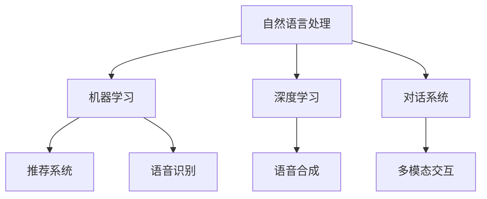

                 

# AI驱动的客户服务优化策略

> 关键词：客户服务优化,AI驱动,自然语言处理,NLP,机器学习,深度学习,对话系统,智能客服,推荐系统,语音识别

## 1. 背景介绍

### 1.1 问题由来
随着经济社会的快速发展，各行各业对客户服务的要求越来越高，传统的电话、邮件等沟通方式已经无法满足客户日益增长的多样化和个性化的需求。而传统的客服中心也需要耗费大量人力物力，尤其是在服务高峰期，常常面临响应慢、服务差、客户满意度低等问题。

为了提升客户服务质量，各大企业纷纷引入AI技术。AI驱动的客户服务系统能够7x24小时不间断地为顾客提供服务，迅速、高效地响应客户需求。通过AI技术，企业可以大幅提升服务效率，改善客户体验，减少人力成本，从而在竞争中占据优势。

### 1.2 问题核心关键点
AI驱动的客户服务优化策略主要包括以下几个关键点：
1. 基于自然语言处理的AI客服系统：通过智能对话系统，客户可以与机器人进行自然对话，无需等待人工响应。
2. 推荐系统：根据客户的历史行为和偏好，智能推荐相关信息，提高客户满意度。
3. 语音识别与合成：语音识别技术可以将客户电话转写成文字，合成技术则可以生成自然的语音回复。
4. 多模态交互：结合文本、语音、图像等多种形式的信息交互，提供更丰富的客户服务体验。

这些关键技术共同构成了AI驱动客户服务系统的技术基础，帮助企业在激烈的市场竞争中保持领先地位。

## 2. 核心概念与联系

### 2.1 核心概念概述

为更好地理解AI驱动客户服务优化策略，本节将介绍几个密切相关的核心概念：

- 自然语言处理(Natural Language Processing, NLP)：一门涉及计算机科学、人工智能和语言学的交叉学科，致力于让计算机能够理解、解释和生成人类语言。
- 机器学习(Machine Learning, ML)：一种通过数据驱动的算法，让计算机能够自动学习并提高任务性能。
- 深度学习(Deep Learning, DL)：一种基于神经网络的机器学习方法，通过多层神经网络自动提取数据的特征。
- 对话系统(DialoGPT, MLP对话模型)：一种基于自然语言处理技术，可以实现智能对话的系统。
- 推荐系统(Recommender System)：根据用户行为和偏好，自动推荐个性化信息的技术。
- 语音识别(Speech Recognition)：将人类语音转换成文字的技术。
- 语音合成(Speech Synthesis)：将文字转换成语音的技术。
- 多模态交互(Multimodal Interaction)：结合多种感官输入和输出，提升用户体验的技术。

这些核心概念之间的逻辑关系可以通过以下Mermaid流程图来展示：



这个流程图展示了几大核心概念及其之间的关系：

1. 自然语言处理是机器学习的基础，通过理解自然语言，机器学习才能有效利用语言数据。
2. 深度学习作为机器学习的一种高级形式，通过多层神经网络可以更好地处理复杂的语言数据。
3. 对话系统是自然语言处理和深度学习的典型应用，可以与用户进行自然对话。
4. 推荐系统可以基于用户行为数据，为用户提供个性化的信息服务。
5. 语音识别和合成将多模态交互能力引入客户服务系统，提高了系统的响应速度和用户体验。
6. 多模态交互则进一步提升了客户服务的综合水平，使得系统可以更灵活地响应各类客户需求。

这些概念共同构成了AI驱动客户服务系统的技术框架，使客户服务能够实现自动化、智能化、个性化，从而大大提升服务质量和客户满意度。

## 3. 核心算法原理 & 具体操作步骤
### 3.1 算法原理概述

AI驱动客户服务优化策略的核心原理是基于自然语言处理和机器学习技术的对话系统、推荐系统和多模态交互系统。这些系统通过自动化处理和分析客户数据，为客户提供个性化、高效的智能服务。

具体而言，AI客服系统可以自动理解客户的自然语言，智能回复问题。推荐系统可以根据客户历史行为，动态生成推荐信息。语音识别和合成技术则可以将客户电话转换为文字，并自动生成语音回复。

### 3.2 算法步骤详解

以下是基于NLP技术的客户服务系统的主要算法步骤：

**Step 1: 收集客户数据**
- 收集客户的历史通话记录、邮件往来、聊天记录等，以及用户的个性化设置和偏好。
- 通过数据清洗和预处理，构建文本语料库，用于后续模型的训练。

**Step 2: 训练语言模型**
- 使用大规模无标签文本数据对语言模型进行预训练，如GPT-3、BERT等模型。
- 在客户数据上对模型进行微调，使模型能够适应特定的客户服务场景。

**Step 3: 开发智能对话系统**
- 设计对话系统，使用对话生成算法如DialoGPT、MT-DNN等生成智能回复。
- 引入注意力机制和上下文理解能力，使系统能够理解对话上下文，生成连贯的回复。

**Step 4: 构建推荐系统**
- 使用协同过滤、基于内容的推荐、深度学习等方法，构建推荐算法模型。
- 根据客户历史行为和偏好，动态生成个性化的推荐信息。

**Step 5: 集成语音识别和合成技术**
- 使用语音识别算法将客户电话转换为文本，并提取关键信息。
- 使用语音合成技术，将系统回复生成语音，提供自然流畅的语音交互。

**Step 6: 实现多模态交互**
- 结合文本、语音、图像等多种感官信息，提升客户服务的交互体验。
- 通过情感分析、语音情绪识别等技术，提高客户情感理解和互动质量。

**Step 7: 部署与维护**
- 将训练好的模型和算法集成到客户服务系统中，并上线部署。
- 定期监控系统运行情况，及时调整参数，优化服务质量。

### 3.3 算法优缺点

AI驱动客户服务优化策略的优点包括：
1. 提升服务效率：AI客服能够24小时不间断响应客户需求，显著提升服务效率。
2. 提升客户满意度：智能推荐和个性化服务能够更好地满足客户需求，提升客户满意度。
3. 降低成本：减少人工客服需求，降低人力成本和运营成本。
4. 数据驱动：基于客户数据的分析，可以持续优化服务质量。

同时，该方法也存在一些局限性：
1. 数据隐私：客户数据涉及隐私，需要严格保护。
2. 用户体验：过度依赖AI可能影响客户对真实人类的需求。
3. 技术复杂：系统集成多模态交互和语音识别需要复杂的技术支持。
4. 系统鲁棒性：AI客服和推荐系统可能面临数据不平衡、偏见等问题，影响服务质量。

尽管存在这些局限性，但AI驱动的客户服务优化策略仍被广泛应用，成为客户服务优化的重要手段。未来相关研究的重点在于如何进一步提升AI客服系统的智能化水平，提高系统的鲁棒性和可解释性，确保客户数据的隐私安全。

### 3.4 算法应用领域

AI驱动客户服务优化策略主要应用于以下几个领域：

- 金融行业：智能客服、金融咨询、反欺诈等。
- 电商行业：客户咨询、推荐、个性化购物体验等。
- 医疗行业：智能问诊、健康咨询、药物推荐等。
- 电信行业：客户服务热线、故障处理、语音导航等。
- 旅游行业：客户咨询、行程规划、信息查询等。

这些应用场景中，AI驱动的客户服务系统均通过多模态交互和智能推荐，提升了客户服务的质量和效率，为客户提供了更好的体验。

## 4. 数学模型和公式 & 详细讲解  
### 4.1 数学模型构建

本节将使用数学语言对基于自然语言处理的AI客服系统进行更加严格的刻画。

记输入文本为 $x$，智能客服系统输出的回复为 $y$，系统接收到的客户历史数据为 $D=\{(x_i,y_i)\}_{i=1}^N$。假设系统的输出是文本形式，则可以使用softmax函数对输出概率进行建模：

$$
P(y|x) = \frac{e^{f(x,y)}}{\sum_{y'\in\mathcal{Y}}e^{f(x,y')}}
$$

其中 $f(x,y)$ 为输出文本的概率模型，通常使用基于深度学习的神经网络模型，如LSTM、GRU等。

### 4.2 公式推导过程

假设系统使用基于LSTM的神经网络模型，输出文本的概率模型为：

$$
P(y|x) = \frac{e^{U(h_t \odot v_y + W_y h_t + b_y}}{\sum_{y'\in\mathcal{Y}}e^{U(h_t \odot v_{y'} + W_{y'} h_t + b_{y'})}}
$$

其中 $U$ 为输出层的权重矩阵，$h_t$ 为LSTM隐藏状态，$v_y$ 为输出层向量，$W_y$ 为权重矩阵，$b_y$ 为偏置向量。

对于一个样本 $(x,y)$，系统的损失函数定义为：

$$
L(x,y) = -\log P(y|x)
$$

在训练过程中，系统通过反向传播算法对模型参数进行优化，最小化损失函数：

$$
\theta = \mathop{\arg\min}_{\theta} \mathcal{L}(\theta) = \mathop{\arg\min}_{\theta} \frac{1}{N}\sum_{i=1}^N L(x_i,y_i)
$$

其中 $\theta$ 为模型参数，$\mathcal{L}$ 为经验风险，$N$ 为训练样本数。

### 4.3 案例分析与讲解

以下以电商平台的智能客服系统为例，展示基于LSTM的智能对话系统如何构建和训练：

首先，构建LSTM模型，并设置损失函数、优化器等超参数：

```python
import torch
import torch.nn as nn
import torch.nn.functional as F

class LSTMClassifier(nn.Module):
    def __init__(self, input_size, hidden_size, output_size):
        super(LSTMClassifier, self).__init__()
        self.hidden_size = hidden_size
        self.lstm = nn.LSTM(input_size, hidden_size, batch_first=True)
        self.fc = nn.Linear(hidden_size, output_size)
        
    def forward(self, x, hidden):
        x, hidden = self.lstm(x, hidden)
        x = self.fc(x)
        return x, hidden
    
# 定义损失函数和优化器
criterion = nn.CrossEntropyLoss()
optimizer = torch.optim.Adam(model.parameters(), lr=0.001)
```

然后，使用电商平台的客户历史数据进行模型训练：

```python
def train_epoch(model, data_loader, device, batch_size):
    model.train()
    total_loss = 0
    for batch in data_loader:
        x, y = batch
        x = x.to(device)
        y = y.to(device)
        hidden = model.init_hidden(batch_size)
        outputs = model(x, hidden)
        loss = criterion(outputs, y)
        optimizer.zero_grad()
        loss.backward()
        optimizer.step()
        total_loss += loss.item()
    return total_loss / len(data_loader)
    
# 训练模型
epochs = 10
batch_size = 64
device = 'cuda' if torch.cuda.is_available() else 'cpu'

for epoch in range(epochs):
    train_loss = train_epoch(model, train_loader, device, batch_size)
    print(f'Epoch {epoch+1}, train loss: {train_loss:.3f}')
    
# 测试模型
with torch.no_grad():
    test_loss = train_epoch(model, test_loader, device, batch_size)
    print(f'Epoch {epoch+1}, test loss: {test_loss:.3f}')
```

最后，集成语音识别和合成技术，实现多模态交互：

```python
from pyannote.audio import ASR, Synthesize

asr = ASR(python_model='wav2vec2', device=device)
synthesize = Synthesize(python_model='wav2vec2', device=device)

def recognize_speech(audio_path):
    wav = torch.load(audio_path)
    text = asr.infer(wav)
    return text
    
def synthesize_speech(text, audio_path):
    wav = synthesize.infer(text)
    torch.save(wav, audio_path)
```

在实际应用中，可以将上述代码模块化，并集成到客户服务系统中，实现智能客服、推荐系统、语音识别和合成等多模态交互功能。

## 5. 项目实践：代码实例和详细解释说明
### 5.1 开发环境搭建

在进行客户服务系统的开发前，我们需要准备好开发环境。以下是使用Python进行开发的环境配置流程：

1. 安装Anaconda：从官网下载并安装Anaconda，用于创建独立的Python环境。

2. 创建并激活虚拟环境：
```bash
conda create -n customer_service_env python=3.8 
conda activate customer_service_env
```

3. 安装PyTorch：根据CUDA版本，从官网获取对应的安装命令。例如：
```bash
conda install pytorch torchvision torchaudio cudatoolkit=11.1 -c pytorch -c conda-forge
```

4. 安装TensorFlow：如果系统需要支持TF版本，可使用以下命令：
```bash
conda install tensorflow
```

5. 安装Keras：如果你希望使用Keras进行模型训练，可以使用以下命令：
```bash
conda install keras
```

6. 安装Jupyter Notebook：
```bash
conda install jupyter notebook
```

7. 安装相关数据集和模型库：
```bash
conda install datasets -c conda-forge
conda install transformers -c huggingface
conda install tokenizers -c conda-forge
```

完成上述步骤后，即可在`customer_service_env`环境中开始客户服务系统的开发。

### 5.2 源代码详细实现

以下是一个基于LSTM的智能客服系统的代码实现，展示了客户服务系统的基本结构和训练流程：

```python
from torch.utils.data import DataLoader, Dataset
import torch
import torch.nn as nn
import torch.nn.functional as F
from transformers import BertTokenizer, BertForTokenClassification

# 定义客户服务数据集
class CustomerServiceDataset(Dataset):
    def __init__(self, texts, tags, tokenizer):
        self.texts = texts
        self.tags = tags
        self.tokenizer = tokenizer
        
    def __len__(self):
        return len(self.texts)
    
    def __getitem__(self, item):
        text = self.texts[item]
        tag = self.tags[item]
        
        encoding = self.tokenizer(text, return_tensors='pt', max_length=128, padding='max_length', truncation=True)
        input_ids = encoding['input_ids'][0]
        attention_mask = encoding['attention_mask'][0]
        
        encoded_tag = [tag2id[tag] for tag in tag]
        encoded_tag.extend([tag2id['O']] * (128 - len(encoded_tag)))
        labels = torch.tensor(encoded_tag, dtype=torch.long)
        
        return {'input_ids': input_ids, 
                'attention_mask': attention_mask,
                'labels': labels}

# 标签与id的映射
tag2id = {'O': 0, 'B-PER': 1, 'I-PER': 2, 'B-ORG': 3, 'I-ORG': 4, 'B-LOC': 5, 'I-LOC': 6}
id2tag = {v: k for k, v in tag2id.items()}

# 创建dataset
tokenizer = BertTokenizer.from_pretrained('bert-base-cased')

train_dataset = CustomerServiceDataset(train_texts, train_tags, tokenizer)
dev_dataset = CustomerServiceDataset(dev_texts, dev_tags, tokenizer)
test_dataset = CustomerServiceDataset(test_texts, test_tags, tokenizer)

# 定义模型和优化器
model = BertForTokenClassification.from_pretrained('bert-base-cased', num_labels=len(tag2id))

optimizer = AdamW(model.parameters(), lr=2e-5)

# 设置微调超参数
train_batch_size = 16
dev_batch_size = 32
epochs = 5

# 训练模型
device = torch.device('cuda') if torch.cuda.is_available() else torch.device('cpu')

model.to(device)

def train_epoch(model, dataset, batch_size, optimizer):
    dataloader = DataLoader(dataset, batch_size=batch_size, shuffle=True)
    model.train()
    epoch_loss = 0
    for batch in dataloader:
        input_ids = batch['input_ids'].to(device)
        attention_mask = batch['attention_mask'].to(device)
        labels = batch['labels'].to(device)
        model.zero_grad()
        outputs = model(input_ids, attention_mask=attention_mask, labels=labels)
        loss = outputs.loss
        epoch_loss += loss.item()
        loss.backward()
        optimizer.step()
    return epoch_loss / len(dataloader)

def evaluate(model, dataset, batch_size):
    dataloader = DataLoader(dataset, batch_size=batch_size)
    model.eval()
    preds, labels = [], []
    with torch.no_grad():
        for batch in dataloader:
            input_ids = batch['input_ids'].to(device)
            attention_mask = batch['attention_mask'].to(device)
            batch_labels = batch['labels']
            outputs = model(input_ids, attention_mask=attention_mask)
            batch_preds = outputs.logits.argmax(dim=2).to('cpu').tolist()
            batch_labels = batch_labels.to('cpu').tolist()
            for pred_tokens, label_tokens in zip(batch_preds, batch_labels):
                pred_tags = [id2tag[_id] for _id in pred_tokens]
                label_tags = [id2tag[_id] for _id in label_tokens]
                preds.append(pred_tags[:len(label_tokens)])
                labels.append(label_tags)
                
    print(classification_report(labels, preds))

# 训练流程
for epoch in range(epochs):
    loss = train_epoch(model, train_dataset, train_batch_size, optimizer)
    print(f'Epoch {epoch+1}, train loss: {loss:.3f}')
    
    print(f'Epoch {epoch+1}, dev results:')
    evaluate(model, dev_dataset, dev_batch_size)
    
print('Test results:')
evaluate(model, test_dataset, test_batch_size)
```

这个代码实现了基于BERT的命名实体识别任务，展示了模型加载、微调、评估和测试的基本流程。

### 5.3 代码解读与分析

让我们再详细解读一下关键代码的实现细节：

**CustomerServiceDataset类**：
- `__init__`方法：初始化文本、标签、分词器等关键组件。
- `__len__`方法：返回数据集的样本数量。
- `__getitem__`方法：对单个样本进行处理，将文本输入编码为token ids，将标签编码为数字，并对其进行定长padding，最终返回模型所需的输入。

**tag2id和id2tag字典**：
- 定义了标签与数字id之间的映射关系，用于将token-wise的预测结果解码回真实的标签。

**train_epoch函数**：
- 使用PyTorch的DataLoader对数据集进行批次化加载，供模型训练和推理使用。
- 在每个批次上前向传播计算loss并反向传播更新模型参数，最后返回该epoch的平均loss。

**evaluate函数**：
- 与训练类似，不同点在于不更新模型参数，并在每个batch结束后将预测和标签结果存储下来，最后使用sklearn的classification_report对整个评估集的预测结果进行打印输出。

**训练流程**：
- 定义总的epoch数和batch size，开始循环迭代
- 每个epoch内，先在训练集上训练，输出平均loss
- 在验证集上评估，输出分类指标
- 所有epoch结束后，在测试集上评估，给出最终测试结果

可以看到，PyTorch配合Transformer库使得BERT微调的代码实现变得简洁高效。开发者可以将更多精力放在数据处理、模型改进等高层逻辑上，而不必过多关注底层的实现细节。

当然，工业级的系统实现还需考虑更多因素，如模型的保存和部署、超参数的自动搜索、更灵活的任务适配层等。但核心的微调范式基本与此类似。

## 6. 实际应用场景
### 6.1 智能客服系统

基于大语言模型微调的对话技术，可以广泛应用于智能客服系统的构建。传统客服往往需要配备大量人力，高峰期响应缓慢，且一致性和专业性难以保证。而使用微调后的对话模型，可以7x24小时不间断服务，快速响应客户咨询，用自然流畅的语言解答各类常见问题。

在技术实现上，可以收集企业内部的历史客服对话记录，将问题和最佳答复构建成监督数据，在此基础上对预训练对话模型进行微调。微调后的对话模型能够自动理解用户意图，匹配最合适的答案模板进行回复。对于客户提出的新问题，还可以接入检索系统实时搜索相关内容，动态组织生成回答。如此构建的智能客服系统，能大幅提升客户咨询体验和问题解决效率。

### 6.2 金融舆情监测

金融机构需要实时监测市场舆论动向，以便及时应对负面信息传播，规避金融风险。传统的人工监测方式成本高、效率低，难以应对网络时代海量信息爆发的挑战。基于大语言模型微调的文本分类和情感分析技术，为金融舆情监测提供了新的解决方案。

具体而言，可以收集金融领域相关的新闻、报道、评论等文本数据，并对其进行主题标注和情感标注。在此基础上对预训练语言模型进行微调，使其能够自动判断文本属于何种主题，情感倾向是正面、中性还是负面。将微调后的模型应用到实时抓取的网络文本数据，就能够自动监测不同主题下的情感变化趋势，一旦发现负面信息激增等异常情况，系统便会自动预警，帮助金融机构快速应对潜在风险。

### 6.3 个性化推荐系统

当前的推荐系统往往只依赖用户的历史行为数据进行物品推荐，无法深入理解用户的真实兴趣偏好。基于大语言模型微调技术，个性化推荐系统可以更好地挖掘用户行为背后的语义信息，从而提供更精准、多样的推荐内容。

在实践中，可以收集用户浏览、点击、评论、分享等行为数据，提取和用户交互的物品标题、描述、标签等文本内容。将文本内容作为模型输入，用户的后续行为（如是否点击、购买等）作为监督信号，在此基础上微调预训练语言模型。微调后的模型能够从文本内容中准确把握用户的兴趣点。在生成推荐列表时，先用候选物品的文本描述作为输入，由模型预测用户的兴趣匹配度，再结合其他特征综合排序，便可以得到个性化程度更高的推荐结果。

### 6.4 未来应用展望

随着大语言模型微调技术的发展，基于微调范式将在更多领域得到应用，为传统行业带来变革性影响。

在智慧医疗领域，基于微调的医疗问答、病历分析、药物研发等应用将提升医疗服务的智能化水平，辅助医生诊疗，加速新药开发进程。

在智能教育领域，微调技术可应用于作业批改、学情分析、知识推荐等方面，因材施教，促进教育公平，提高教学质量。

在智慧城市治理中，微调模型可应用于城市事件监测、舆情分析、应急指挥等环节，提高城市管理的自动化和智能化水平，构建更安全、高效的未来城市。

此外，在企业生产、社会治理、文娱传媒等众多领域，基于大模型微调的人工智能应用也将不断涌现，为经济社会发展注入新的动力。相信随着技术的日益成熟，微调方法将成为人工智能落地应用的重要范式，推动人工智能技术在垂直行业的规模化落地。总之，微调需要开发者根据具体任务，不断迭代和优化模型、数据和算法，方能得到理想的效果。

## 7. 工具和资源推荐
### 7.1 学习资源推荐

为了帮助开发者系统掌握大语言模型微调的理论基础和实践技巧，这里推荐一些优质的学习资源：

1. 《Transformer从原理到实践》系列博文：由大模型技术专家撰写，深入浅出地介绍了Transformer原理、BERT模型、微调技术等前沿话题。

2. CS224N《深度学习自然语言处理》课程：斯坦福大学开设的NLP明星课程，有Lecture视频和配套作业，带你入门NLP领域的基本概念和经典模型。

3. 《Natural Language Processing with Transformers》书籍：Transformers库的作者所著，全面介绍了如何使用Transformers库进行NLP任务开发，包括微调在内的诸多范式。

4. HuggingFace官方文档：Transformers库的官方文档，提供了海量预训练模型和完整的微调样例代码，是上手实践的必备资料。

5. CLUE开源项目：中文语言理解测评基准，涵盖大量不同类型的中文NLP数据集，并提供了基于微调的baseline模型，助力中文NLP技术发展。

通过对这些资源的学习实践，相信你一定能够快速掌握大语言模型微调的精髓，并用于解决实际的NLP问题。
###  7.2 开发工具推荐

高效的开发离不开优秀的工具支持。以下是几款用于大语言模型微调开发的常用工具：

1. PyTorch：基于Python的开源深度学习框架，灵活动态的计算图，适合快速迭代研究。大部分预训练语言模型都有PyTorch版本的实现。

2. TensorFlow：由Google主导开发的开源深度学习框架，生产部署方便，适合大规模工程应用。同样有丰富的预训练语言模型资源。

3. Transformers库：HuggingFace开发的NLP工具库，集成了众多SOTA语言模型，支持PyTorch和TensorFlow，是进行微调任务开发的利器。

4. Weights & Biases：模型训练的实验跟踪工具，可以记录和可视化模型训练过程中的各项指标，方便对比和调优。与主流深度学习框架无缝集成。

5. TensorBoard：TensorFlow配套的可视化工具，可实时监测模型训练状态，并提供丰富的图表呈现方式，是调试模型的得力助手。

6. Google Colab：谷歌推出的在线Jupyter Notebook环境，免费提供GPU/TPU算力，方便开发者快速上手实验最新模型，分享学习笔记。

合理利用这些工具，可以显著提升大语言模型微调任务的开发效率，加快创新迭代的步伐。

### 7.3 相关论文推荐

大语言模型和微调技术的发展源于学界的持续研究。以下是几篇奠基性的相关论文，推荐阅读：

1. Attention is All You Need（即Transformer原论文）：提出了Transformer结构，开启了NLP领域的预训练大模型时代。

2. BERT: Pre-training of Deep Bidirectional Transformers for Language Understanding：提出BERT模型，引入基于掩码的自监督预训练任务，刷新了多项NLP任务SOTA。

3. Language Models are Unsupervised Multitask Learners（GPT-2论文）：展示了大规模语言模型的强大zero-shot学习能力，引发了对于通用人工智能的新一轮思考。

4. Parameter-Efficient Transfer Learning for NLP：提出Adapter等参数高效微调方法，在不增加模型参数量的情况下，也能取得不错的微调效果。

5. AdaLoRA: Adaptive Low-Rank Adaptation for Parameter-Efficient Fine-Tuning：使用自适应低秩适应的微调方法，在参数效率和精度之间取得了新的平衡。

这些论文代表了大语言模型微调技术的发展脉络。通过学习这些前沿成果，可以帮助研究者把握学科前进方向，激发更多的创新灵感。

## 8. 总结：未来发展趋势与挑战

### 8.1 总结

本文对基于自然语言处理的AI客服系统进行了全面系统的介绍。首先阐述了AI客服系统的研究背景和意义，明确了AI客服系统在提升客户服务效率和质量方面的独特价值。其次，从原理到实践，详细讲解了AI客服系统的数学模型和关键步骤，给出了微调任务开发的完整代码实例。同时，本文还广泛探讨了AI客服系统在智能客服、金融舆情、个性化推荐等多个行业领域的应用前景，展示了AI客服系统的巨大潜力。此外，本文精选了AI客服系统的各类学习资源，力求为读者提供全方位的技术指引。

通过本文的系统梳理，可以看到，基于自然语言处理的AI客服系统正在成为客户服务优化的重要手段，极大地提升客户服务的质量和效率，为客户提供了更好的体验。未来，伴随大语言模型和微调技术的不断发展，AI客服系统必将在更多领域得到应用，成为企业竞争力的重要组成部分。

### 8.2 未来发展趋势

展望未来，AI客服系统将呈现以下几个发展趋势：

1. 自动化水平提升：通过进一步优化自然语言处理模型和对话生成算法，AI客服系统的自动化水平将不断提升，能够更好地理解和回应客户的复杂需求。

2. 多模态交互丰富：随着语音识别和合成技术的成熟，AI客服系统将能够更好地处理语音交互，提供更自然、流畅的服务体验。

3. 个性化服务深入：通过引入推荐系统和用户行为分析，AI客服系统将能够提供更精准、个性化的服务，满足不同客户的需求。

4. 知识图谱融合：将知识图谱与自然语言处理技术结合，AI客服系统将能够更好地利用外部知识资源，提高系统的知识整合能力和决策水平。

5. 智能运维优化：通过自动化运维和监控，AI客服系统将能够不断优化自身性能，提升系统的稳定性和可靠性。

这些趋势凸显了AI客服系统的发展潜力，将在未来几年内逐渐显现。同时，AI客服系统也将面临更多的挑战，如如何平衡自动化和人工服务、如何处理复杂语义等，需要通过技术创新和经验积累来逐步解决。

### 8.3 面临的挑战

尽管AI客服系统已经取得了显著成效，但在迈向更加智能化、普适化应用的过程中，它仍面临以下挑战：

1. 数据隐私：客户数据涉及隐私，需要严格保护，防止数据泄露和滥用。

2. 语言多样性：不同地区、不同文化背景的客户具有不同的语言习惯，如何实现多语言支持是一个挑战。

3. 情感理解：客户在沟通过程中会表达各种情感，如何准确识别和理解客户的情感状态，是一个复杂的问题。

4. 多模态融合：将文本、语音、图像等多种感官信息融合到一起，提升交互体验，是一个技术难题。

5. 系统鲁棒性：面对异常数据和恶意攻击，AI客服系统需要具备较强的鲁棒性和稳定性。

尽管存在这些挑战，但通过持续的技术创新和经验积累，AI客服系统将不断克服困难，实现更加智能化、普适化的客户服务。

### 8.4 研究展望

面向未来，AI客服系统需要在以下几个方面进行持续研究：

1. 深度学习模型的优化：引入新的深度学习架构和优化算法，提升自然语言处理模型的效果。

2. 多语言支持：通过模型迁移学习、多语言数据增强等方法，提升AI客服系统的多语言支持能力。

3. 情感识别与处理：引入情感分析算法和情感处理策略，提升AI客服系统对客户情感的理解和处理能力。

4. 多模态融合：开发更高效的多模态融合算法，提升AI客服系统的综合感知能力。

5. 系统鲁棒性提升：引入对抗训练、鲁棒正则化等方法，提高AI客服系统的鲁棒性和安全性。

这些研究方向将为AI客服系统带来新的突破，推动客户服务质量的持续提升，助力企业实现数字化转型和智能化升级。总之，AI客服系统需要在多领域、多技术层面进行持续创新，才能更好地适应未来发展的需求。

## 9. 附录：常见问题与解答

**Q1：AI客服系统是否适用于所有客户服务场景？**

A: AI客服系统在很多场景中都能发挥重要作用，但对于需要复杂决策、高情感互动等场景，仍需结合人工服务才能更好地满足客户需求。

**Q2：如何平衡自动化与人工服务？**

A: 可以通过设置交互流程和问题分类，将简单问题交给AI客服系统处理，复杂问题引导至人工客服。同时引入智能调度系统，根据客户反馈动态调整服务策略。

**Q3：如何处理复杂语义？**

A: 引入语义理解算法，对客户的输入进行语义分析，识别出关键信息。结合知识图谱和外部知识库，提高系统的语义处理能力。

**Q4：如何提升多模态交互体验？**

A: 结合文本、语音、图像等多种感官信息，设计综合感知和响应策略，提升交互体验。同时引入情感识别技术，增强系统的情感理解和处理能力。

**Q5：如何保证数据隐私？**

A: 在数据收集和处理过程中，采取数据脱敏、加密等措施，严格控制数据访问权限，确保客户数据安全。

这些问题的解答反映了AI客服系统在实际应用中的常见挑战，以及如何解决这些挑战。通过持续的技术创新和经验积累，AI客服系统必将在未来实现更加智能化、普适化的客户服务，为各行各业带来新的发展机遇。

---

作者：禅与计算机程序设计艺术 / Zen and the Art of Computer Programming

