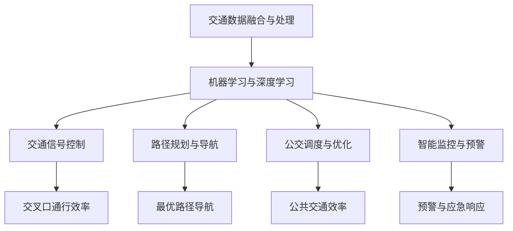

                 

# AI驱动的智能交通管理系统

## 1. 背景介绍

### 1.1 问题由来
随着全球人口的增长和城市化进程的加快，交通拥堵问题日益严峻。交通拥堵不仅造成巨大经济损失，还引发了严重的空气污染和环境问题。各国政府和交通管理机构不断探索创新的交通管理方案，以应对日益复杂的交通状况。

交通管理依赖于大量的数据，包括交通流量、信号灯状态、车辆位置、天气信息等。这些数据被收集后，通过数据分析和模型优化，可以提升交通管理系统的效率和稳定性。因此，AI技术在交通管理中的应用越来越广泛，从交通信号控制、智能导航、公交调度，到路网规划、事故预测，AI正在逐渐成为交通管理的中流砥柱。

### 1.2 问题核心关键点
AI驱动的智能交通管理系统（AI-ITS）主要解决以下问题：
- **数据融合与处理**：整合来自不同来源的交通数据，进行去噪、清洗和转换。
- **模型优化与预测**：应用机器学习和深度学习模型对交通数据进行分析，预测交通流量和车辆行为。
- **控制与调度**：根据模型预测结果，优化交通信号灯控制和车辆调度策略。
- **可视化和监控**：实时展示交通流量和车辆位置，提供监控和评估功能。

本文聚焦于AI-ITS的实现原理，介绍了如何利用AI技术优化交通管理，提升道路通行效率。

## 2. 核心概念与联系

### 2.1 核心概念概述

为更好地理解AI-ITS，我们需要了解几个核心概念：

- **交通数据融合与处理**：将多种来源的交通数据进行整合、去噪和转换，生成可用于分析的规范数据。
- **机器学习与深度学习**：利用算法和模型对交通数据进行分析，提取特征并进行预测和分类。
- **交通信号控制**：基于模型预测结果，优化信号灯控制策略，提升交叉口通行效率。
- **路径规划与导航**：通过模型分析，提供最优路径和导航建议，引导车辆高效通行。
- **公交调度与优化**：根据实时交通数据，优化公交线路和调度，提高公共交通效率。
- **智能监控与预警**：实时监控交通流量和车辆位置，预测事故和异常情况，提供预警和应急响应。

这些概念之间的逻辑关系可以通过以下Mermaid流程图来展示：



这个流程图展示了许多概念之间的相互作用：交通数据通过融合处理后，被机器学习与深度学习模型分析，从而优化交通信号控制、路径规划与导航、公交调度和智能监控与预警等模块的功能。

## 3. 核心算法原理 & 具体操作步骤
### 3.1 算法原理概述

AI-ITS的核心算法原理包括以下几个方面：

1. **数据融合与预处理**：将多种交通数据来源的数据进行融合、去噪、清洗和转换，生成可用于分析的规范数据。
2. **特征提取与模型选择**：从融合后的数据中提取关键特征，选择合适的机器学习和深度学习模型进行训练和预测。
3. **模型优化与参数调优**：通过交叉验证和超参数优化，提升模型预测精度和泛化能力。
4. **信号控制与路径规划**：基于模型预测结果，优化交通信号灯控制和车辆路径规划。
5. **监控与预警**：实时监控交通流量和车辆位置，预测异常情况，提供预警和应急响应。

### 3.2 算法步骤详解

**Step 1: 数据收集与融合**

- **数据来源**：收集交通流量数据、车辆位置数据、信号灯状态数据、天气数据、事故数据等。
- **数据格式转换**：将不同格式的数据转换为统一的格式，如CSV、JSON等。
- **数据清洗与去噪**：去除缺失值、异常值和重复数据，校正数据格式错误。

**Step 2: 特征提取与模型选择**

- **特征提取**：从数据中提取关键特征，如交通流量、车流量、车速、交通密度、路段拥堵程度等。
- **模型选择**：根据特征类型和预测目标，选择合适的模型，如线性回归、随机森林、XGBoost、深度学习等。

**Step 3: 模型训练与优化**

- **模型训练**：使用训练集数据训练模型，优化模型参数。
- **超参数调优**：通过网格搜索、随机搜索、贝叶斯优化等方法，寻找最优的超参数组合。
- **模型验证**：使用验证集数据评估模型性能，避免过拟合。

**Step 4: 模型应用与监控**

- **信号控制**：根据模型预测结果，优化信号灯控制策略。
- **路径规划与导航**：提供最优路径和导航建议。
- **公交调度与优化**：实时优化公交线路和调度。
- **智能监控与预警**：实时监控交通流量和车辆位置，预测异常情况，提供预警和应急响应。

### 3.3 算法优缺点

AI-ITS的优点包括：
1. **高效性**：利用AI技术，可以实时处理大量交通数据，快速响应交通变化。
2. **自适应性**：模型能够根据交通状况自动调整控制策略，提高系统响应速度和效率。
3. **可扩展性**：系统可以根据需要添加新的数据源和功能模块，支持持续优化和升级。

同时，AI-ITS也存在一些缺点：
1. **数据依赖性**：模型的性能高度依赖于数据质量，数据采集和处理的不足可能导致模型失效。
2. **模型复杂性**：高维数据的处理和模型训练需要大量的计算资源。
3. **模型偏见**：模型可能会继承训练数据中的偏见，导致不公正的决策。
4. **解释性不足**：复杂的AI模型难以解释决策过程，增加了系统的透明度和信任度挑战。

### 3.4 算法应用领域

AI-ITS可以应用于多种交通管理场景，包括但不限于：

- **城市道路交通管理**：优化交通信号灯控制，提升交叉口通行效率。
- **智能导航系统**：提供最优路径和导航建议，引导车辆高效通行。
- **公交调度系统**：实时优化公交线路和调度，提高公共交通效率。
- **事故预测与预防**：预测交通事故和异常情况，提供预警和应急响应。
- **交通流量预测与调度**：预测交通流量和车辆行为，优化交通调度策略。

## 4. 数学模型和公式 & 详细讲解 & 举例说明

### 4.1 数学模型构建

假设我们有n个交通数据点 $(x_1, y_1), (x_2, y_2), ..., (x_n, y_n)$，其中 $x$ 为交通特征向量，$y$ 为对应的交通状态（如流量、车速、拥堵程度等）。我们的目标是构建一个机器学习模型，使得模型能够根据输入的交通特征，预测对应的交通状态。

### 4.2 公式推导过程

以线性回归模型为例，其目标是最小化预测误差：

$$
\min_{\theta} \frac{1}{2n} \sum_{i=1}^n (y_i - \theta^T x_i)^2
$$

其中 $\theta$ 为模型参数，$x_i$ 为输入特征，$y_i$ 为真实值。

使用梯度下降算法优化上述目标函数，更新参数 $\theta$ 的公式为：

$$
\theta \leftarrow \theta - \alpha \frac{1}{n} \sum_{i=1}^n (y_i - \theta^T x_i) x_i
$$

其中 $\alpha$ 为学习率。

### 4.3 案例分析与讲解

假设我们有一个包含历史交通数据的数据集，我们需要构建一个模型，预测某个交叉口的交通流量。我们首先对数据进行预处理，提取关键特征，如车流量、交通密度等。然后，使用上述公式构建线性回归模型，并通过交叉验证优化模型参数。最后，使用测试集数据评估模型性能。

## 5. 项目实践：代码实例和详细解释说明

### 5.1 开发环境搭建

在进行AI-ITS项目实践前，我们需要准备好开发环境。以下是使用Python进行TensorFlow开发的简单环境配置流程：

1. 安装Anaconda：从官网下载并安装Anaconda，用于创建独立的Python环境。
2. 创建并激活虚拟环境：
```bash
conda create -n its-env python=3.8 
conda activate its-env
```
3. 安装TensorFlow：根据CUDA版本，从官网获取对应的安装命令。例如：
```bash
conda install tensorflow tensorflow-gpu=2.4 -c conda-forge
```
4. 安装各类工具包：
```bash
pip install numpy pandas scikit-learn matplotlib tqdm jupyter notebook ipython
```

完成上述步骤后，即可在`its-env`环境中开始项目实践。

### 5.2 源代码详细实现

下面我们以交通流量预测任务为例，给出使用TensorFlow对线性回归模型进行训练的代码实现。

首先，定义数据处理函数：

```python
import pandas as pd
import numpy as np
from sklearn.model_selection import train_test_split
from sklearn.preprocessing import StandardScaler

def load_data(file_path):
    data = pd.read_csv(file_path)
    features = data.drop(['flow'], axis=1)
    target = data['flow']
    return features, target

def preprocess_data(features, target):
    scaler = StandardScaler()
    scaled_features = scaler.fit_transform(features)
    scaled_target = np.log(target)  # 取对数处理
    return scaled_features, scaled_target
```

然后，定义模型和优化器：

```python
import tensorflow as tf
from tensorflow.keras.models import Sequential
from tensorflow.keras.layers import Dense

def build_model(input_dim, output_dim):
    model = Sequential([
        Dense(64, input_dim=input_dim, activation='relu'),
        Dense(64, activation='relu'),
        Dense(output_dim, activation='linear')
    ])
    return model

def compile_model(model, optimizer):
    model.compile(loss='mse', optimizer=optimizer)
    return model

def train_model(model, features, target, batch_size, epochs):
    history = model.fit(features, target, batch_size=batch_size, epochs=epochs, validation_split=0.2)
    return history
```

接着，定义模型训练和评估函数：

```python
def evaluate_model(model, features, target):
    predictions = model.predict(features)
    predicted_target = np.exp(predictions)  # 恢复对数预测结果
    mse = np.mean((predicted_target - target)**2)
    print('Mean Squared Error:', mse)
    return mse
```

最后，启动训练流程并在测试集上评估：

```python
epochs = 100
batch_size = 64

features, target = load_data('traffic_data.csv')
scaled_features, scaled_target = preprocess_data(features, target)

model = build_model(scaled_features.shape[1], 1)
optimizer = tf.keras.optimizers.Adam(learning_rate=0.001)

history = train_model(model, scaled_features, scaled_target, batch_size, epochs)

evaluate_model(model, scaled_features, scaled_target)
```

以上就是使用TensorFlow对交通流量预测任务进行模型训练的完整代码实现。可以看到，TensorFlow提供了丰富的工具和库，使得模型构建和训练过程变得简洁高效。

### 5.3 代码解读与分析

让我们再详细解读一下关键代码的实现细节：

**load_data函数**：
- 从文件中加载数据，并分离特征和目标变量。
- 使用sklearn的train_test_split函数将数据划分为训练集和测试集。

**preprocess_data函数**：
- 使用sklearn的StandardScaler进行特征归一化处理。
- 对目标变量取对数，提高模型训练的稳定性和收敛速度。

**build_model函数**：
- 定义一个包含两个隐藏层和一个输出层的神经网络模型。
- 使用relu激活函数提高模型的非线性能力。

**compile_model函数**：
- 编译模型，指定损失函数为均方误差，优化器为Adam。

**train_model函数**：
- 使用训练集数据拟合模型，使用validation_split参数将20%的数据保留为验证集。
- 返回训练过程中的历史对象，记录模型的训练过程。

**evaluate_model函数**：
- 使用测试集数据评估模型性能，计算均方误差。
- 使用np.exp函数将预测结果还原为原始对数值。

可以看到，TensorFlow提供的高级API使得模型训练过程变得直观易懂，开发者可以更加专注于模型的设计和优化。

当然，实际的AI-ITS系统需要考虑更多因素，如模型的压缩和优化、算力的高效利用、系统的稳定性和安全性等。但核心的算法原理和代码实现基本与此类似。

## 6. 实际应用场景

### 6.1 智能导航系统

智能导航系统是AI-ITS的重要应用之一。传统导航系统主要依赖于地图和预设路线，难以适应实时交通状况的变化。通过AI-ITS技术，智能导航系统可以实时获取交通流量和道路状况数据，提供最优路径和导航建议。

例如，某个交叉口出现交通拥堵，智能导航系统可以自动调整路线，避开拥堵区域，重新规划最优路径。这不仅提高了用户导航的效率，还能减少道路拥堵，改善交通环境。

### 6.2 公交调度系统

公交调度系统是另一个重要的应用场景。公交车辆的调度和路线优化对提升公共交通效率至关重要。通过AI-ITS技术，公交调度系统可以根据实时交通数据，动态调整公交线路和发车频率，优化公交资源的分配。

例如，某个时间段内某个区域交通流量激增，公交调度系统可以自动增加该区域的车辆班次和频率，减少乘客等待时间，提高公交运输效率。

### 6.3 事故预测与预防

事故预测与预防是AI-ITS在安全管理方面的重要应用。通过实时监控交通流量和车辆位置，AI-ITS可以预测潜在的事故风险，及时采取措施，减少交通事故的发生。

例如，某个路段的车辆密度突然增加，AI-ITS可以自动预测该区域可能发生交通事故，提前预警，并建议驾驶员减速慢行，避免碰撞。

### 6.4 交通流量预测与调度

交通流量预测与调度是AI-ITS的核心应用之一。通过实时监控交通数据，AI-ITS可以预测未来的交通流量，优化交通信号灯控制和道路通行策略，缓解交通压力。

例如，某个高峰时段预计交通流量将大幅增加，AI-ITS可以提前调整信号灯的绿灯时间，增加通行容量，减少等待时间。

## 7. 工具和资源推荐

### 7.1 学习资源推荐

为了帮助开发者系统掌握AI-ITS的理论基础和实践技巧，这里推荐一些优质的学习资源：

1. **《深度学习与交通工程》**：介绍了深度学习在交通管理中的应用，包括数据处理、模型选择和参数调优等。
2. **Kaggle交通数据集**：提供了丰富的交通数据集和竞赛项目，用于数据预处理和模型训练。
3. **TensorFlow官方文档**：提供了详细的TensorFlow API文档，包括模型构建、训练和评估等。
4. **Google Colab**：免费的在线Jupyter Notebook环境，支持GPU/TPU算力，方便开发者快速迭代实验。

通过对这些资源的学习实践，相信你一定能够快速掌握AI-ITS的核心技术，并用于解决实际的交通管理问题。

### 7.2 开发工具推荐

高效的开发离不开优秀的工具支持。以下是几款用于AI-ITS开发的常用工具：

1. **TensorFlow**：基于Python的开源深度学习框架，灵活动态的计算图，适合快速迭代研究。
2. **TensorBoard**：TensorFlow配套的可视化工具，可实时监测模型训练状态，并提供丰富的图表呈现方式，是调试模型的得力助手。
3. **Keras**：高层次的深度学习API，提供了简单易用的接口，可以快速构建和训练模型。
4. **Jupyter Notebook**：交互式开发环境，支持代码单元格和数据单元格，方便开发和调试。

合理利用这些工具，可以显著提升AI-ITS任务的开发效率，加快创新迭代的步伐。

### 7.3 相关论文推荐

AI-ITS的发展源于学界的持续研究。以下是几篇奠基性的相关论文，推荐阅读：

1. **"AI for Traffic Management: A Survey"**：全面介绍了AI技术在交通管理中的应用，包括数据融合、模型优化、智能调度等。
2. **"Deep Learning in Traffic Engineering: A Survey"**：介绍了深度学习在交通工程中的应用，包括交通预测、路径规划、事故预警等。
3. **"Traffic Signal Control Using Machine Learning"**：介绍了基于机器学习的交通信号控制方法，包括多模态数据融合和自适应控制。

这些论文代表了大数据和AI技术在交通管理中的应用现状和发展趋势，阅读这些文献可以拓展视野，了解最新的研究成果和技术动态。

## 8. 总结：未来发展趋势与挑战

### 8.1 总结

本文对AI-ITS的实现原理和应用实践进行了全面系统的介绍。首先阐述了交通管理中AI技术的应用背景和意义，明确了AI-ITS在提高交通效率和安全性方面的重要作用。其次，从原理到实践，详细讲解了AI-ITS的核心算法和技术细节，给出了基于TensorFlow的交通流量预测代码实现。同时，本文还探讨了AI-ITS在智能导航、公交调度、事故预防、流量预测等多个应用场景中的实际应用，展示了AI-ITS的广阔前景。

通过本文的系统梳理，可以看到，AI-ITS技术正在逐步成为交通管理的中流砥柱，极大地提升了道路通行效率和安全性。未来，伴随AI技术的不断进步和数据量的持续增加，AI-ITS必将在更多领域得到应用，为交通管理的智能化、精准化、高效化提供更多可能。

### 8.2 未来发展趋势

展望未来，AI-ITS技术将呈现以下几个发展趋势：

1. **自适应交通管理**：结合实时交通数据和预测模型，实现动态优化交通信号灯和路线规划，提升交通管理的实时性和响应速度。
2. **多模态数据融合**：融合交通数据、气象数据、地理数据等多源信息，提升交通管理的全面性和准确性。
3. **智能监控与预警**：通过实时监控交通流量和车辆位置，预测交通事故和异常情况，提供预警和应急响应。
4. **分布式计算与边缘计算**：利用边缘计算和分布式计算技术，提升数据处理和模型训练的速度，减少延迟和带宽压力。
5. **联邦学习与隐私保护**：利用联邦学习技术，保护用户隐私和数据安全，同时提高模型的泛化能力和抗干扰能力。
6. **模型解释性与透明性**：引入因果分析和解释性技术，提高模型的可解释性和透明性，增强用户信任。

这些趋势凸显了AI-ITS技术的未来发展方向，为交通管理的智能化、精准化、高效化提供了新的可能性。

### 8.3 面临的挑战

尽管AI-ITS技术已经取得了一定的进展，但在实际应用中也面临诸多挑战：

1. **数据质量与完整性**：交通数据的采集和处理需要高昂的成本和技术，数据质量与完整性问题难以解决。
2. **模型复杂性与可解释性**：高维数据的处理和复杂模型的训练需要大量计算资源，模型的解释性和透明性不足。
3. **隐私与伦理问题**：交通数据涉及个人隐私，如何在保护隐私的同时，实现数据共享和模型优化，是一个重要的伦理问题。
4. **跨域数据融合**：不同来源和格式的数据需要进行统一和融合，技术复杂度较高。
5. **实时计算与响应**：实时处理大量数据和模型预测需要高强度的计算能力，硬件资源有限。
6. **系统稳定性和安全性**：AI-ITS系统需要高可靠性和高安全性，避免系统崩溃和数据泄露等安全问题。

这些挑战需要技术界和业界共同努力，寻找新的解决方案，才能使AI-ITS技术真正落地应用，为交通管理带来更多价值。

### 8.4 研究展望

面对AI-ITS技术面临的挑战，未来的研究方向包括以下几个方面：

1. **数据质量与获取**：探索低成本、高效的数据采集和处理方法，提高数据质量与完整性。
2. **模型简化与优化**：设计更简洁、高效、可解释性强的模型，提升模型训练和推理的速度。
3. **隐私保护与数据安全**：研究联邦学习等隐私保护技术，确保数据安全和用户隐私。
4. **多模态数据融合**：研究多源数据融合和处理技术，提升交通管理的全面性和准确性。
5. **实时计算与分布式计算**：利用分布式计算和边缘计算技术，提升系统实时性和计算能力。
6. **模型解释性与透明性**：引入因果分析和解释性技术，提高模型的可解释性和透明性。

这些研究方向的探索，将推动AI-ITS技术的进一步发展和应用，为交通管理的智能化、精准化、高效化提供更多可能性。未来，伴随着AI技术的不断进步和应用场景的不断扩展，AI-ITS必将在更多领域得到应用，为交通管理的智能化、精准化、高效化提供更多可能。

## 9. 附录：常见问题与解答

**Q1: 数据预处理在AI-ITS中扮演什么角色？**

A: 数据预处理是AI-ITS中非常重要的一环。它包括数据清洗、归一化、特征提取等步骤，是确保模型训练效果的重要因素。

**Q2: AI-ITS中常用的模型有哪些？**

A: 在AI-ITS中常用的模型包括线性回归、随机森林、XGBoost、深度学习等。

**Q3: AI-ITS的模型训练需要哪些资源？**

A: AI-ITS的模型训练需要高性能计算资源，如GPU、TPU等。

**Q4: 如何处理AI-ITS中的数据不平衡问题？**

A: 可以使用数据增强、重采样等方法来处理数据不平衡问题。

**Q5: AI-ITS在实际应用中面临哪些挑战？**

A: AI-ITS在实际应用中面临数据质量、模型复杂性、隐私保护、实时计算等挑战。

---

作者：禅与计算机程序设计艺术 / Zen and the Art of Computer Programming

