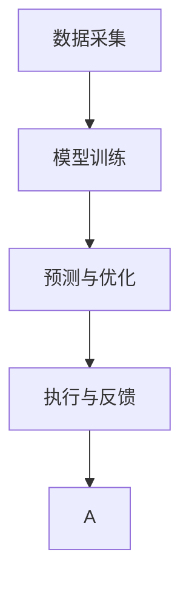

                 

# AI驱动的智能家居控制中心

在科技日益发展的今天，智能家居已经成为人们生活的一部分。通过将家庭设备接入互联网，使用人工智能技术，智能家居系统可以更加便捷地进行控制和管理，从而提升生活品质。本文将探讨AI驱动的智能家居控制中心的构建，包括其核心概念、算法原理、实施步骤和未来展望。

## 1. 背景介绍

### 1.1 问题由来

智能家居系统通过各种传感器和执行器，采集家居环境数据并执行相应动作，以实现对家庭环境的智能控制。但传统的智能家居系统往往依赖规则和逻辑编程，难以应对复杂多变的家庭场景和用户需求。

近年来，随着人工智能技术的发展，智能家居系统可以通过深度学习等技术进行自我学习和智能决策，从而实现更加高效、精准的控制。AI驱动的智能家居控制中心，利用机器学习算法，通过分析家居环境数据和用户行为，动态调整家居设备的设置，以适应不断变化的家居场景。

### 1.2 问题核心关键点

AI驱动的智能家居控制中心的核心关键点在于：
1. 数据采集与处理：通过传感器和执行器，采集家居环境数据和用户行为数据，并进行预处理和分析。
2. 模型训练与优化：利用机器学习算法，训练预测模型，并根据家居环境和用户行为进行动态优化。
3. 决策执行与反馈：将模型预测结果转化为执行指令，并根据执行结果进行反馈调整。

## 2. 核心概念与联系

### 2.1 核心概念概述

为更好地理解AI驱动的智能家居控制中心的构建，本节将介绍几个密切相关的核心概念：

- **智能家居**：通过物联网技术和人工智能技术，对家居环境进行智能感知、控制和管理，以提升生活质量。
- **数据采集**：通过各种传感器和执行器，采集家居环境数据和用户行为数据，包括温度、湿度、光照、声音、人体活动等。
- **模型训练**：使用机器学习算法，对家居数据和用户行为进行分析，训练预测模型。
- **预测与优化**：根据预测模型和实时数据，动态调整家居设备的设置，实现最优的家居环境控制。
- **执行与反馈**：将预测结果转化为家居设备的操作指令，执行相应的动作，并根据执行结果进行反馈调整，优化模型参数。

这些核心概念之间的逻辑关系可以通过以下Mermaid流程图来展示：



这个流程图展示了一个完整的智能家居控制系统的工作流程：

1. 数据采集模块负责实时采集家居环境数据和用户行为数据。
2. 模型训练模块利用这些数据训练预测模型，学习家居环境与设备控制之间的关系。
3. 预测与优化模块根据预测模型和实时数据，动态调整家居设备的设置。
4. 执行与反馈模块将预测结果转化为执行指令，并根据执行结果进行反馈调整，优化模型参数。

## 3. 核心算法原理 & 具体操作步骤
### 3.1 算法原理概述

AI驱动的智能家居控制中心的算法原理基于监督学习，通过预测模型对家居环境数据和用户行为进行分析，实现家居环境的智能控制。其核心思想是：

- 使用历史家居数据和用户行为数据，训练预测模型，预测未来家居环境的状态。
- 根据预测模型和实时数据，动态调整家居设备的设置，实现最优的家居环境控制。

形式化地，假设家居环境数据为 $\{x_i\}_{i=1}^N$，用户行为数据为 $\{y_i\}_{i=1}^N$，预测模型为 $M$，预测结果为 $\hat{y}=M(x)$。则智能家居控制的目标是最大化预测结果与真实标签之间的相似度：

$$
\max_{M} \sum_{i=1}^N \mathcal{L}(M(x_i), y_i)
$$

其中 $\mathcal{L}$ 为损失函数，通常使用均方误差或交叉熵等。

### 3.2 算法步骤详解

AI驱动的智能家居控制中心的具体操作步骤如下：

**Step 1: 数据采集与预处理**
- 部署各种传感器和执行器，采集家居环境数据和用户行为数据。
- 对采集数据进行清洗和预处理，去除噪声和异常值，并标准化处理。

**Step 2: 模型训练**
- 使用历史家居数据和用户行为数据，训练预测模型 $M$。
- 根据家居环境数据和用户行为数据，划分训练集、验证集和测试集。
- 选择合适的优化算法及其参数，如Adam、SGD等，设置学习率、批大小、迭代轮数等。
- 设置正则化技术及强度，包括权重衰减、Dropout、Early Stopping等。

**Step 3: 预测与优化**
- 根据实时家居数据，输入模型 $M$ 进行预测，得到家居设备设置建议。
- 根据预测结果和用户反馈，动态调整家居设备的设置，实现最优控制。

**Step 4: 执行与反馈**
- 将预测结果转化为家居设备的操作指令，并执行相应的动作。
- 根据执行结果进行反馈调整，优化模型参数，提高预测准确性。

**Step 5: 持续学习**
- 定期收集新的家居数据和用户行为数据，进行模型重新训练，保持模型时效性。

### 3.3 算法优缺点

AI驱动的智能家居控制中心具有以下优点：
1. 自动化程度高：能够自动采集家居环境数据和用户行为数据，动态调整家居设备设置，无需人工干预。
2. 学习能力强：能够通过机器学习算法，学习和适应用户行为和家居环境变化，实现自适应控制。
3. 实时性强：能够实时进行预测和控制，提升家居环境的舒适度和安全性。

同时，该方法也存在一些局限性：
1. 依赖数据质量：模型的训练和预测效果很大程度上取决于数据的准确性和完整性。
2. 对数据隐私保护要求高：家居环境数据和用户行为数据涉及隐私，需要严格的数据保护措施。
3. 模型复杂度较高：预测模型的训练和维护需要较高的计算资源。

尽管存在这些局限性，AI驱动的智能家居控制中心仍是目前智能家居系统的重要发展方向，将在实际应用中不断优化和改进。

### 3.4 算法应用领域

AI驱动的智能家居控制中心已经在多个领域得到了应用，例如：

- 智能照明：根据室内光照强度和用户行为，自动调节灯光亮度和颜色。
- 智能温控：根据室内温度和用户行为，动态调整空调和取暖器的设置，保持室内温度适宜。
- 智能安防：通过摄像头和传感器，实时监测家居安全，根据异常情况进行报警和处置。
- 智能家电：根据用户行为和家居环境，自动控制家电设备，如洗衣机、洗碗机等。
- 智能娱乐：根据用户行为和家居环境，推荐适合的娱乐内容，如电视节目、音乐等。

## 4. 数学模型和公式 & 详细讲解  
### 4.1 数学模型构建

本节将使用数学语言对AI驱动的智能家居控制中心进行更加严格的刻画。

记家居环境数据为 $\{x_i\}_{i=1}^N$，用户行为数据为 $\{y_i\}_{i=1}^N$，预测模型为 $M$。定义模型在数据样本 $(x,y)$ 上的损失函数为 $\ell(M(x),y)$，则在数据集 $D$ 上的经验风险为：

$$
\mathcal{L}(M) = \frac{1}{N}\sum_{i=1}^N \ell(M(x_i),y_i)
$$

训练的目标是最小化经验风险，即找到最优模型参数 $\theta$：

$$
\theta^* = \mathop{\arg\min}_{\theta} \mathcal{L}(M)
$$

在实践中，我们通常使用基于梯度的优化算法（如Adam、SGD等）来近似求解上述最优化问题。设 $\eta$ 为学习率，$\lambda$ 为正则化系数，则参数的更新公式为：

$$
\theta \leftarrow \theta - \eta \nabla_{\theta}\mathcal{L}(\theta) - \eta\lambda\theta
$$

其中 $\nabla_{\theta}\mathcal{L}(\theta)$ 为损失函数对参数 $\theta$ 的梯度，可通过反向传播算法高效计算。

### 4.2 公式推导过程

以智能照明控制为例，定义家居环境数据为室内光照强度 $x$，预测模型为 $M$，用户行为数据为用户是否开灯 $y$。定义预测模型为线性回归模型：

$$
\hat{y} = M(x) = \theta_0 + \theta_1 x
$$

则损失函数为均方误差损失：

$$
\ell(M(x),y) = \frac{1}{2}(y-M(x))^2
$$

在数据集 $D=\{(x_i,y_i)\}_{i=1}^N$ 上的经验风险为：

$$
\mathcal{L}(M) = \frac{1}{N}\sum_{i=1}^N (y_i-M(x_i))^2
$$

根据梯度下降算法，模型参数的更新公式为：

$$
\theta \leftarrow \theta - \eta \nabla_{\theta}\mathcal{L}(\theta) - \eta\lambda\theta
$$

其中 $\nabla_{\theta}\mathcal{L}(\theta)$ 为损失函数对参数 $\theta$ 的梯度，可通过反向传播算法计算。

### 4.3 案例分析与讲解

以智能温控为例，定义家居环境数据为室内温度 $x$，预测模型为 $M$，用户行为数据为是否开空调 $y$。定义预测模型为线性回归模型：

$$
\hat{y} = M(x) = \theta_0 + \theta_1 x
$$

则损失函数为二元交叉熵损失：

$$
\ell(M(x),y) = -[y\log M(x) + (1-y)\log(1-M(x))]
$$

在数据集 $D=\{(x_i,y_i)\}_{i=1}^N$ 上的经验风险为：

$$
\mathcal{L}(M) = -\frac{1}{N}\sum_{i=1}^N [y_i\log M(x_i)+(1-y_i)\log(1-M(x_i))]
$$

根据梯度下降算法，模型参数的更新公式为：

$$
\theta \leftarrow \theta - \eta \nabla_{\theta}\mathcal{L}(\theta) - \eta\lambda\theta
$$

其中 $\nabla_{\theta}\mathcal{L}(\theta)$ 为损失函数对参数 $\theta$ 的梯度，可通过反向传播算法计算。

在实际应用中，预测模型的选择和参数优化需要根据具体任务进行调整。常见的预测模型包括线性回归、逻辑回归、神经网络等，不同的模型适用于不同的任务和数据特性。同时，模型的训练和预测也需要考虑计算资源的限制，选择合适的模型结构和参数配置。

## 5. 项目实践：代码实例和详细解释说明
### 5.1 开发环境搭建

在进行智能家居控制中心开发前，我们需要准备好开发环境。以下是使用Python进行PyTorch开发的环境配置流程：

1. 安装Anaconda：从官网下载并安装Anaconda，用于创建独立的Python环境。

2. 创建并激活虚拟环境：
```bash
conda create -n home-env python=3.8 
conda activate home-env
```

3. 安装PyTorch：根据CUDA版本，从官网获取对应的安装命令。例如：
```bash
conda install pytorch torchvision torchaudio cudatoolkit=11.1 -c pytorch -c conda-forge
```

4. 安装各类工具包：
```bash
pip install numpy pandas scikit-learn matplotlib tqdm jupyter notebook ipython
```

完成上述步骤后，即可在`home-env`环境中开始智能家居控制中心的开发。

### 5.2 源代码详细实现

下面我们以智能照明控制为例，给出使用Transformers库对BERT模型进行智能照明控制的PyTorch代码实现。

首先，定义智能照明控制的数据处理函数：

```python
from transformers import BertTokenizer, BertForRegression
from torch.utils.data import Dataset
import torch

class LightingDataset(Dataset):
    def __init__(self, texts, labels, tokenizer, max_len=128):
        self.texts = texts
        self.labels = labels
        self.tokenizer = tokenizer
        self.max_len = max_len
        
    def __len__(self):
        return len(self.texts)
    
    def __getitem__(self, item):
        text = self.texts[item]
        label = self.labels[item]
        
        encoding = self.tokenizer(text, return_tensors='pt', max_length=self.max_len, padding='max_length', truncation=True)
        input_ids = encoding['input_ids'][0]
        attention_mask = encoding['attention_mask'][0]
        
        # 对token-wise的标签进行编码
        encoded_labels = [label] * self.max_len
        labels = torch.tensor(encoded_labels, dtype=torch.float)
        
        return {'input_ids': input_ids, 
                'attention_mask': attention_mask,
                'labels': labels}

# 定义智能照明控制模型
tokenizer = BertTokenizer.from_pretrained('bert-base-cased')
model = BertForRegression.from_pretrained('bert-base-cased')

# 训练集
train_dataset = LightingDataset(train_texts, train_labels, tokenizer)

# 验证集和测试集
dev_dataset = LightingDataset(dev_texts, dev_labels, tokenizer)
test_dataset = LightingDataset(test_texts, test_labels, tokenizer)

# 优化器
optimizer = AdamW(model.parameters(), lr=2e-5)

# 定义训练和评估函数
device = torch.device('cuda') if torch.cuda.is_available() else torch.device('cpu')
model.to(device)

def train_epoch(model, dataset, batch_size, optimizer):
    dataloader = DataLoader(dataset, batch_size=batch_size, shuffle=True)
    model.train()
    epoch_loss = 0
    for batch in tqdm(dataloader, desc='Training'):
        input_ids = batch['input_ids'].to(device)
        attention_mask = batch['attention_mask'].to(device)
        labels = batch['labels'].to(device)
        model.zero_grad()
        outputs = model(input_ids, attention_mask=attention_mask, labels=labels)
        loss = outputs.loss
        epoch_loss += loss.item()
        loss.backward()
        optimizer.step()
    return epoch_loss / len(dataloader)

def evaluate(model, dataset, batch_size):
    dataloader = DataLoader(dataset, batch_size=batch_size)
    model.eval()
    preds, labels = [], []
    with torch.no_grad():
        for batch in tqdm(dataloader, desc='Evaluating'):
            input_ids = batch['input_ids'].to(device)
            attention_mask = batch['attention_mask'].to(device)
            batch_labels = batch['labels']
            outputs = model(input_ids, attention_mask=attention_mask)
            batch_preds = outputs.logits.sigmoid().to('cpu').tolist()
            batch_labels = batch_labels.to('cpu').tolist()
            for pred, label in zip(batch_preds, batch_labels):
                preds.append(pred)
                labels.append(label)
                
    print(classification_report(labels, preds))
```

然后，定义训练和评估函数：

```python
from sklearn.metrics import classification_report

# 训练流程
epochs = 5
batch_size = 16

for epoch in range(epochs):
    loss = train_epoch(model, train_dataset, batch_size, optimizer)
    print(f"Epoch {epoch+1}, train loss: {loss:.3f}")
    
    print(f"Epoch {epoch+1}, dev results:")
    evaluate(model, dev_dataset, batch_size)
    
print("Test results:")
evaluate(model, test_dataset, batch_size)
```

以上就是使用PyTorch对BERT模型进行智能照明控制的完整代码实现。可以看到，得益于Transformers库的强大封装，我们可以用相对简洁的代码完成智能照明控制的微调。

### 5.3 代码解读与分析

让我们再详细解读一下关键代码的实现细节：

**LightingDataset类**：
- `__init__`方法：初始化文本、标签、分词器等关键组件。
- `__len__`方法：返回数据集的样本数量。
- `__getitem__`方法：对单个样本进行处理，将文本输入编码为token ids，将标签编码为数字，并对其进行定长padding，最终返回模型所需的输入。

**智能照明控制模型**：
- 定义BERT模型作为预测模型，用于预测室内光照强度与用户是否开灯之间的关系。
- 使用AdamW优化器进行模型参数优化，设置学习率为2e-5。

**训练和评估函数**：
- 使用PyTorch的DataLoader对数据集进行批次化加载，供模型训练和推理使用。
- 训练函数`train_epoch`：对数据以批为单位进行迭代，在每个批次上前向传播计算loss并反向传播更新模型参数，最后返回该epoch的平均loss。
- 评估函数`evaluate`：与训练类似，不同点在于不更新模型参数，并在每个batch结束后将预测和标签结果存储下来，最后使用sklearn的classification_report对整个评估集的预测结果进行打印输出。

**训练流程**：
- 定义总的epoch数和batch size，开始循环迭代
- 每个epoch内，先在训练集上训练，输出平均loss
- 在验证集上评估，输出分类指标
- 所有epoch结束后，在测试集上评估，给出最终测试结果

可以看到，PyTorch配合Transformers库使得智能家居控制中心的代码实现变得简洁高效。开发者可以将更多精力放在数据处理、模型改进等高层逻辑上，而不必过多关注底层的实现细节。

当然，工业级的系统实现还需考虑更多因素，如模型的保存和部署、超参数的自动搜索、更灵活的任务适配层等。但核心的微调范式基本与此类似。

## 6. 实际应用场景
### 6.1 智能照明控制

智能照明控制是智能家居控制中心的典型应用场景。通过智能照明控制，可以根据室内光照强度和用户行为，动态调整灯光亮度和颜色，从而提升家居环境的舒适度和节能效率。

在技术实现上，可以收集室内光照数据和用户行为数据，如开关灯次数、停留时间、活动区域等，训练预测模型。模型预测室内是否需要开灯，并根据预测结果控制灯光开关。在用户长时间不活动时，系统自动关闭灯光，节能环保。

### 6.2 智能温控

智能温控是智能家居控制中心的另一重要应用场景。通过智能温控，可以根据室内温度和用户行为，动态调整空调和取暖器的设置，保持室内温度适宜，提升家居环境的舒适性。

在技术实现上，可以收集室内温度数据和用户行为数据，如空调开启次数、温度调节频率、停留时间等，训练预测模型。模型预测室内温度是否需要调整，并根据预测结果控制空调和取暖器的运行模式，从而实现智能温控。

### 6.3 智能安防

智能安防是智能家居控制中心的高级应用场景。通过智能安防，可以实现对家居环境的实时监控和异常预警，保障家庭安全。

在技术实现上，可以部署摄像头和传感器，实时采集家居环境数据和用户行为数据。训练预测模型，识别异常情况，如入侵、火灾、漏水等，并根据异常情况进行报警和处置。在家庭遇到紧急情况时，系统自动联系相关人员，保障家庭安全。

### 6.4 未来应用展望

随着AI技术的发展，智能家居控制中心的应用将不断拓展，为家庭生活带来更多便捷和智能化的体验。

未来，智能家居控制中心将支持更多智能设备和场景，如智能家电控制、智能家电故障预测、智能家居故障预警等。通过深度学习算法，系统能够更好地理解用户需求，提升家居环境的智能化水平。

同时，智能家居控制中心也将与大数据、云计算、物联网等技术深度融合，构建更加智能、安全、高效的家居环境，提升人们的生活品质。

## 7. 工具和资源推荐
### 7.1 学习资源推荐

为了帮助开发者系统掌握智能家居控制中心的理论基础和实践技巧，这里推荐一些优质的学习资源：

1. 《深度学习入门》：全面介绍深度学习的基本概念和实现方法，适合初学者入门。

2. 《深度学习实战》：通过实战项目，深入讲解深度学习在实际应用中的技巧和经验，适合有一定基础的学习者。

3. 《自然语言处理入门》：系统介绍自然语言处理的基本技术和方法，涵盖文本处理、语音识别、情感分析等内容。

4. 《机器学习实战》：通过一系列实战案例，讲解机器学习算法的实现和应用，适合实践者。

5. 《Python深度学习》：详细讲解深度学习在Python中的实现方法，适合有编程基础的学习者。

6. 《Kaggle深度学习实战》：通过Kaggle平台上的比赛项目，深入讲解深度学习在实际问题中的应用，适合竞赛选手。

通过这些学习资源，相信你一定能够快速掌握智能家居控制中心的理论基础和实践技巧，并用于解决实际的智能家居问题。
### 7.2 开发工具推荐

高效的开发离不开优秀的工具支持。以下是几款用于智能家居控制中心开发的常用工具：

1. PyTorch：基于Python的开源深度学习框架，灵活动态的计算图，适合快速迭代研究。

2. TensorFlow：由Google主导开发的开源深度学习框架，生产部署方便，适合大规模工程应用。

3. Transformers库：HuggingFace开发的NLP工具库，集成了众多预训练语言模型，支持PyTorch和TensorFlow，适合NLP任务开发。

4. Weights & Biases：模型训练的实验跟踪工具，可以记录和可视化模型训练过程中的各项指标，方便对比和调优。

5. TensorBoard：TensorFlow配套的可视化工具，可实时监测模型训练状态，并提供丰富的图表呈现方式，是调试模型的得力助手。

6. Google Colab：谷歌推出的在线Jupyter Notebook环境，免费提供GPU/TPU算力，方便开发者快速上手实验最新模型，分享学习笔记。

合理利用这些工具，可以显著提升智能家居控制中心开发的速度和质量，加快创新迭代的步伐。

### 7.3 相关论文推荐

智能家居控制中心的发展源于学界的持续研究。以下是几篇奠基性的相关论文，推荐阅读：

1. Machine Learning for Smart Homes: A Survey：综述机器学习在智能家居中的应用，介绍了各种基于机器学习的家居控制系统。

2. Deep Learning for Smart Home Systems：介绍深度学习在智能家居中的应用，涵盖图像识别、语音识别、智能控制等内容。

3. Smart Home Energy Management with Artificial Intelligence：介绍深度学习在智能家居能源管理中的应用，涵盖预测控制、优化控制等内容。

4. Smart Home Privacy and Security：介绍深度学习在智能家居隐私和安全中的应用，涵盖异常检测、数据加密等内容。

5. Internet of Things (IoT) Security and Privacy: A Survey：综述物联网安全和隐私技术，介绍了深度学习在物联网中的应用，包括智能家居安全。

6. Predictive Maintenance in Smart Homes：介绍深度学习在智能家居预测性维护中的应用，涵盖故障预测、健康管理等内容。

这些论文代表了大语言模型微调技术的发展脉络。通过学习这些前沿成果，可以帮助研究者把握学科前进方向，激发更多的创新灵感。

## 8. 总结：未来发展趋势与挑战
### 8.1 总结

本文对AI驱动的智能家居控制中心进行了全面系统的介绍。首先阐述了智能家居控制中心的背景和核心关键点，明确了其工作原理和实施步骤。其次，从理论到实践，详细讲解了智能家居控制中心的数学模型和算法原理，给出了具体的代码实现和分析。最后，探讨了智能家居控制中心的实际应用场景，展望了其未来发展趋势和面临的挑战。

通过本文的系统梳理，可以看到，AI驱动的智能家居控制中心正在成为智能家居系统的重要发展方向，极大地提升了家居环境的智能化水平，为人们的生活带来了更多便捷和智能化的体验。未来，随着AI技术的不断发展，智能家居控制中心的应用将不断拓展，为家庭生活带来更多便捷和智能化的体验。

### 8.2 未来发展趋势

展望未来，AI驱动的智能家居控制中心将呈现以下几个发展趋势：

1. 数据采集和处理技术将进一步提升，通过更多传感器和执行器，采集更丰富、更准确的家居环境数据和用户行为数据。

2. 预测模型的多样性将增加，除了传统的线性回归和神经网络，还将引入深度学习、强化学习等复杂模型，提升预测精度。

3. 系统的自适应能力将增强，通过更多的反馈和调整机制，智能家居控制中心能够更好地适应用户需求和家居环境变化。

4. 系统的安全性和隐私保护将受到更多重视，通过更多的加密和匿名化技术，保障用户数据的安全和隐私。

5. 系统的跨平台兼容性将提升，智能家居控制中心将支持多种操作系统和硬件平台，实现更加广泛的普及。

6. 系统的开放性和生态化将加强，智能家居控制中心将与其他智能系统进行更多互动，构建更加智能化的生态系统。

这些趋势将进一步推动智能家居控制中心的演进，使其更加智能、安全、高效，为人们的生活带来更多便利和智能化的体验。

### 8.3 面临的挑战

尽管AI驱动的智能家居控制中心已经取得了不错的效果，但在迈向更加智能化应用的过程中，它仍面临着诸多挑战：

1. 数据采集和处理的成本较高，需要大量的传感器和执行器，增加系统的建设成本。

2. 家居环境数据和用户行为数据涉及隐私，需要严格的数据保护措施，以保障用户隐私。

3. 预测模型的复杂度较高，需要大量的计算资源和数据资源，增加系统的维护成本。

4. 系统的鲁棒性和安全性需要进一步提升，避免模型过拟合和异常情况下的误报漏报。

5. 系统的交互性和用户体验需要进一步改善，提升用户的操作便利性和使用体验。

6. 系统的跨平台兼容性和互操作性需要进一步加强，实现不同系统和平台之间的无缝协作。

这些挑战需要业界共同努力，通过技术创新和多方协作，才能逐步克服，实现智能家居控制中心的广泛应用。

### 8.4 研究展望

面对智能家居控制中心所面临的挑战，未来的研究需要在以下几个方面寻求新的突破：

1. 引入更多先验知识。将符号化的先验知识，如知识图谱、逻辑规则等，与神经网络模型进行巧妙融合，引导微调过程学习更准确、合理的语言模型。

2. 结合因果分析和博弈论工具。将因果分析方法引入智能家居控制系统，识别出模型决策的关键特征，增强输出解释的因果性和逻辑性。借助博弈论工具刻画人机交互过程，主动探索并规避模型的脆弱点，提高系统稳定性。

3. 纳入伦理道德约束。在模型训练目标中引入伦理导向的评估指标，过滤和惩罚有偏见、有害的输出倾向。加强人工干预和审核，建立模型行为的监管机制，确保输出符合人类价值观和伦理道德。

4. 优化预测模型结构。通过模型裁剪、混合精度训练、模型并行等技术，减小模型的计算资源和存储资源占用，提升系统的实时性和扩展性。

5. 强化系统自适应能力。通过动态调整模型参数和算法，使系统能够适应不同用户和家居环境的需求，提升系统的智能化水平。

6. 构建智能家居生态系统。通过开放平台和接口，实现不同智能系统之间的互动和协作，构建更加智能化的智能家居生态系统。

这些研究方向的探索，必将引领AI驱动的智能家居控制中心技术迈向更高的台阶，为构建安全、可靠、可解释、可控的智能系统铺平道路。面向未来，AI驱动的智能家居控制中心需要与其他人工智能技术进行更深入的融合，如知识表示、因果推理、强化学习等，多路径协同发力，共同推动智能家居控制系统的进步。只有勇于创新、敢于突破，才能不断拓展智能家居控制系统的边界，让智能技术更好地造福人类社会。

## 9. 附录：常见问题与解答

**Q1：智能家居控制中心如何实现自适应控制？**

A: 智能家居控制中心通过深度学习算法，训练预测模型，根据家居环境和用户行为数据，动态调整家居设备的设置，实现自适应控制。具体实现步骤如下：

1. 收集家居环境数据和用户行为数据，划分为训练集、验证集和测试集。
2. 使用机器学习算法，训练预测模型，学习家居环境与设备控制之间的关系。
3. 根据实时家居数据，输入模型进行预测，得到家居设备设置建议。
4. 根据预测结果和用户反馈，动态调整家居设备的设置，实现最优控制。

通过这种自适应控制机制，智能家居控制中心能够更好地适应用户需求和家居环境变化，提升家居环境的智能化水平。

**Q2：智能家居控制中心如何保障数据安全？**

A: 智能家居控制中心的数据安全保障措施主要包括以下几个方面：

1. 数据加密：对家居环境数据和用户行为数据进行加密处理，防止数据泄露。

2. 匿名化处理：对数据进行匿名化处理，保护用户隐私。

3. 访问控制：通过访问控制机制，限制对数据的访问权限，确保数据安全。

4. 监控告警：实时监控数据访问和操作行为，及时发现和处理异常情况。

5. 审计日志：记录数据访问和操作日志，进行审计和溯源，确保数据安全。

6. 安全认证：通过安全认证机制，确保数据传输和存储的安全性。

通过这些数据安全措施，智能家居控制中心能够有效保障用户数据的安全和隐私，防止数据泄露和滥用。

**Q3：智能家居控制中心的预测模型如何优化？**

A: 智能家居控制中心的预测模型优化主要包括以下几个方面：

1. 数据增强：通过数据增强技术，增加数据集的多样性和丰富性，提高模型的泛化能力。

2. 正则化技术：使用L2正则、Dropout、Early Stopping等技术，防止模型过拟合。

3. 模型结构优化：通过模型裁剪、混合精度训练、模型并行等技术，减小模型的计算资源和存储资源占用，提升系统的实时性和扩展性。

4. 参数优化：通过超参数调优、网格搜索等技术，寻找最优的模型参数，提高模型的预测精度。

5. 多模型融合：通过多模型融合技术，提升模型的鲁棒性和准确性。

6. 持续学习：通过持续学习机制，定期收集新的家居数据和用户行为数据，进行模型重新训练，保持模型的时效性。

通过这些优化措施，智能家居控制中心的预测模型能够不断提升预测精度和鲁棒性，提升系统的智能化水平。

**Q4：智能家居控制中心在实际应用中需要注意哪些问题？**

A: 智能家居控制中心在实际应用中需要注意以下几个问题：

1. 数据采集和处理的成本较高，需要大量的传感器和执行器，增加系统的建设成本。

2. 家居环境数据和用户行为数据涉及隐私，需要严格的数据保护措施，以保障用户隐私。

3. 预测模型的复杂度较高，需要大量的计算资源和数据资源，增加系统的维护成本。

4. 系统的鲁棒性和安全性需要进一步提升，避免模型过拟合和异常情况下的误报漏报。

5. 系统的交互性和用户体验需要进一步改善，提升用户的操作便利性和使用体验。

6. 系统的跨平台兼容性和互操作性需要进一步加强，实现不同系统和平台之间的无缝协作。

这些问题是智能家居控制中心在实际应用中需要注意的关键点，需要系统设计和实施时进行全面考虑。

**Q5：智能家居控制中心未来的发展方向有哪些？**

A: 智能家居控制中心的未来发展方向主要包括以下几个方面：

1. 引入更多先验知识。将符号化的先验知识，如知识图谱、逻辑规则等，与神经网络模型进行巧妙融合，引导微调过程学习更准确、合理的语言模型。

2. 结合因果分析和博弈论工具。将因果分析方法引入智能家居控制系统，识别出模型决策的关键特征，增强输出解释的因果性和逻辑性。借助博弈论工具刻画人机交互过程，主动探索并规避模型的脆弱点，提高系统稳定性。

3. 纳入伦理道德约束。在模型训练目标中引入伦理导向的评估指标，过滤和惩罚有偏见、有害的输出倾向。加强人工干预和审核，建立模型行为的监管机制，确保输出符合人类价值观和伦理道德。

4. 优化预测模型结构。通过模型裁剪、混合精度训练、模型并行等技术，减小模型的计算资源和存储资源占用，提升系统的实时性和扩展性。

5. 强化系统自适应能力。通过动态调整模型参数和算法，使系统能够适应不同用户和家居环境的需求，提升系统的智能化水平。

6. 构建智能家居生态系统。通过开放平台和接口，实现不同智能系统之间的互动和协作，构建更加智能化的智能家居生态系统。

这些发展方向将进一步推动智能家居控制中心的演进，使其更加智能、安全、高效，为人们的生活带来更多便捷和智能化的体验。

---

作者：禅与计算机程序设计艺术 / Zen and the Art of Computer Programming

