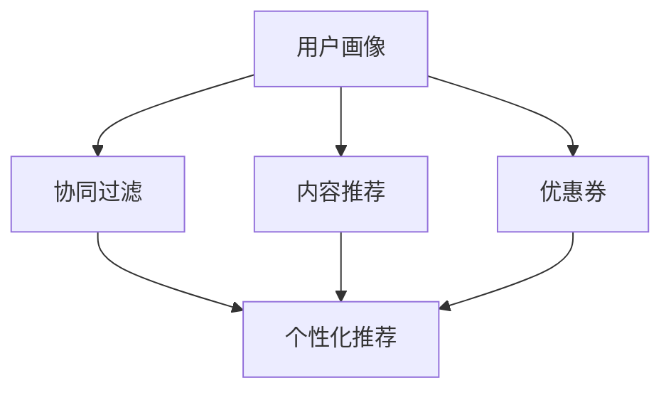

                 

# AI驱动的电商平台个性化优惠券分发策略

> 关键词：个性化推荐, 电商, 优惠券, AI驱动, 用户行为, 成本控制, 用户满意度

## 1. 背景介绍

在数字经济蓬勃发展的今天，电商平台已成为消费者购物的重要渠道。电商平台的竞争不仅体现在商品和服务的多样性上，更在于用户体验的优劣。用户是否满意并持续使用电商平台，很大程度上取决于其个性化推荐和优惠券分发策略。然而，如何在满足消费者需求的同时，有效控制运营成本，提升用户体验，成为了平台运营的重大挑战。AI驱动的个性化推荐和优惠券分发策略应运而生，旨在通过精准的用户画像分析和行为预测，实现高效的用户转化和业务增长。

### 1.1 问题由来

在传统的电商推荐和优惠券分发策略中，大多采用基于历史行为的协同过滤或内容推荐算法，这些方法在一定程度上能够提升用户的购物体验，但存在以下问题：

1. **缺乏个性化**：传统算法无法深入挖掘用户兴趣，导致推荐和优惠券分发缺乏针对性和个性化，难以满足不同用户的需求。
2. **冷启动问题**：新用户的兴趣偏好数据不足，导致初期推荐效果差，难以积累高价值用户。
3. **成本控制困难**：无差别优惠券的发放不仅浪费成本，还可能对低价值用户形成干扰。

面对这些挑战，AI驱动的个性化推荐和优惠券分发策略通过深度学习和机器学习算法，实现了对用户行为的深度理解和预测，从而提供更加精准和个性化的服务。

### 1.2 问题核心关键点

为了有效解决这个问题，本文将从以下核心关键点出发：

- 如何构建精准的用户画像，挖掘用户兴趣和行为模式。
- 如何基于用户画像进行个性化推荐，提升用户转化率。
- 如何设计优惠券分发策略，优化用户满意度与运营成本。

通过回答这些问题，本文将系统介绍AI驱动的个性化推荐和优惠券分发策略的原理、步骤及其实际应用效果。

## 2. 核心概念与联系

### 2.1 核心概念概述

为了更清晰地阐述个性化推荐和优惠券分发的策略，我们先介绍几个关键概念：

- **用户画像**：通过收集和分析用户的行为数据，构建用户兴趣和行为模式的概貌，帮助电商平台理解用户的潜在需求和偏好。
- **协同过滤**：一种基于用户历史行为或物品历史交互的推荐算法，通过相似性匹配进行推荐。
- **内容推荐**：基于用户历史行为和物品属性进行推荐，如商品的属性、类别等。
- **优惠券**：电商平台为了促进用户购买而提供的折扣或奖励，具有时间限制和数量限制。
- **个性化推荐**：根据用户行为和兴趣，提供定制化的推荐，提升用户满意度和转化率。
- **成本控制**：在优惠券发放过程中，通过精准的目标用户选择和优化分发策略，降低运营成本。

这些概念之间的关系可以通过以下Mermaid流程图来展示：



### 2.2 核心概念原理和架构

- **用户画像构建**：通过用户历史行为数据，如浏览、点击、购买等，利用机器学习算法，如协同过滤、聚类、分类等，构建用户画像。
- **协同过滤算法**：利用用户历史行为和物品历史交互数据，通过相似性匹配推荐物品。分为基于用户的协同过滤和基于物品的协同过滤。
- **内容推荐算法**：利用用户历史行为和物品属性，通过机器学习算法，如线性回归、决策树、随机森林等，进行推荐。
- **优惠券设计**：设计优惠券种类、折扣力度、有效期、数量限制等参数，确保优惠券对用户的吸引力和平台的控制力。
- **个性化推荐策略**：基于用户画像和行为预测，动态调整推荐算法参数，实现个性化推荐。
- **成本控制策略**：通过用户画像和行为预测，精准选择优惠券的目标用户，优化优惠券分发策略，降低运营成本。

## 3. 核心算法原理 & 具体操作步骤

### 3.1 算法原理概述

AI驱动的个性化推荐和优惠券分发策略，本质上是一种基于用户画像和行为预测的智能推荐系统。其核心思想是：通过收集和分析用户的行为数据，构建用户画像，预测用户未来的购买行为，并据此进行个性化推荐和优惠券分发，以提升用户体验和运营效率。

形式化地，假设用户集合为 $U$，物品集合为 $I$，历史行为数据集为 $D$，用户画像模型为 $P$，行为预测模型为 $R$，个性化推荐模型为 $R_{\text{rec}}$，优惠券分发策略为 $S_{\text{coupon}}$。个性化推荐和优惠券分发的过程可表示为：

1. **用户画像构建**：$P = \text{build\_profile}(D)$
2. **行为预测**：$\hat{y}_i = R(y_i, P)$，其中 $y_i$ 为用户的第 $i$ 个行为记录。
3. **个性化推荐**：$\hat{y}_{\text{rec}} = R_{\text{rec}}(y_i, P)$
4. **优惠券分发**：$S_{\text{coupon}}(y_i, P)$

### 3.2 算法步骤详解

基于上述原理，AI驱动的个性化推荐和优惠券分发策略的详细步骤如下：

**Step 1: 用户画像构建**

1. **数据收集**：收集用户的浏览、点击、购买等行为数据，形成历史行为数据集 $D$。
2. **特征提取**：从 $D$ 中提取有用的特征，如访问时间、访问频率、购买金额、购买品类等。
3. **模型训练**：利用机器学习算法，如聚类、分类、回归等，训练用户画像模型 $P$。

**Step 2: 行为预测**

1. **数据预处理**：将用户行为数据 $y_i$ 转化为适合模型输入的格式。
2. **模型训练**：利用训练好的用户画像 $P$ 和行为数据 $y_i$，训练行为预测模型 $R$。
3. **预测行为**：使用训练好的 $R$ 对新行为进行预测，$\hat{y}_i = R(y_i, P)$。

**Step 3: 个性化推荐**

1. **推荐模型训练**：利用历史行为数据和用户画像，训练个性化推荐模型 $R_{\text{rec}}$。
2. **推荐生成**：基于用户画像 $P$ 和预测行为 $\hat{y}_i$，生成个性化推荐 $\hat{y}_{\text{rec}}$。

**Step 4: 优惠券分发**

1. **优惠券设计**：根据业务需求，设计优惠券种类、折扣力度、有效期、数量限制等参数。
2. **目标用户选择**：根据用户画像 $P$ 和预测行为 $\hat{y}_i$，精准选择优惠券的目标用户。
3. **优惠券分发**：将优惠券发送给目标用户，并对分发效果进行监控和评估。

### 3.3 算法优缺点

AI驱动的个性化推荐和优惠券分发策略有以下优点：

1. **提升用户满意度**：通过精准的用户画像和行为预测，提供个性化的推荐和优惠券，满足用户个性化需求，提升用户体验。
2. **提高转化率**：个性化推荐和优惠券的精准分发，能够有效促进用户购买，提高转化率。
3. **优化运营成本**：精准的目标用户选择和优惠券分发策略，能够有效控制运营成本，提升平台收益。

同时，该策略也存在一些局限性：

1. **数据隐私问题**：收集和分析用户行为数据，可能引发用户隐私担忧，需要严格遵守数据保护法规。
2. **算法复杂度高**：需要大量的数据和复杂的模型训练，可能面临计算资源和时间成本的挑战。
3. **模型泛化性差**：过度依赖历史数据，可能无法有效应对新兴用户或变化的用户兴趣。

尽管存在这些局限性，但通过合理设计和优化算法，可以有效提升电商平台的运营效率和用户满意度。

### 3.4 算法应用领域

AI驱动的个性化推荐和优惠券分发策略，在电商领域具有广泛的应用前景，主要体现在以下几个方面：

1. **商品推荐**：利用用户画像和行为预测，进行个性化商品推荐，提升用户购物体验。
2. **购物车推荐**：在用户购物车中添加推荐商品，提高用户购买转化率。
3. **优惠券营销**：根据用户画像和行为预测，精准发放优惠券，优化用户体验，提升销售额。
4. **个性化广告**：通过用户画像和行为预测，实现精准的广告投放，提升广告效果和点击率。
5. **库存管理**：根据用户需求和行为预测，优化库存管理，减少库存积压和缺货现象。

## 4. 数学模型和公式 & 详细讲解 & 举例说明

### 4.1 数学模型构建

为了更精确地描述个性化推荐和优惠券分发的过程，我们将使用数学模型进行详细讲解。

假设用户集合为 $U$，物品集合为 $I$，历史行为数据集为 $D$，用户画像模型为 $P$，行为预测模型为 $R$，个性化推荐模型为 $R_{\text{rec}}$，优惠券分发策略为 $S_{\text{coupon}}$。

1. **用户画像构建**：$P = \text{build\_profile}(D)$
2. **行为预测**：$\hat{y}_i = R(y_i, P)$
3. **个性化推荐**：$\hat{y}_{\text{rec}} = R_{\text{rec}}(y_i, P)$
4. **优惠券分发**：$S_{\text{coupon}}(y_i, P)$

### 4.2 公式推导过程

以协同过滤算法为例，假设用户 $u$ 的历史行为数据为 $y = \{y_1, y_2, \ldots, y_n\}$，物品集合为 $I$，用户集合为 $U$。设物品 $i$ 的历史行为数据为 $y_i = \{0, 1\}$，其中 $1$ 表示用户对物品 $i$ 有过正向行为，$0$ 表示没有。

协同过滤算法的目标是找出与用户 $u$ 兴趣相似的用户 $v$，然后根据 $v$ 对物品 $i$ 的行为预测 $y_v^i$，生成对用户 $u$ 的物品推荐 $\hat{y}_i^u$。

协同过滤算法分为基于用户的协同过滤和基于物品的协同过滤。

- **基于用户的协同过滤**：根据用户 $u$ 和 $v$ 的兴趣相似度 $s(u,v)$，计算物品 $i$ 的预测行为 $y_v^i$，生成推荐 $\hat{y}_i^u$。

$$
\hat{y}_i^u = s(u,v) \cdot y_v^i
$$

- **基于物品的协同过滤**：根据物品 $i$ 和 $j$ 的相似度 $s(i,j)$，计算用户 $u$ 对物品 $j$ 的预测行为 $y_j^u$，生成推荐 $\hat{y}_i^u$。

$$
\hat{y}_i^u = s(i,j) \cdot y_j^u
$$

其中，相似度 $s(u,v)$ 和 $s(i,j)$ 可以通过余弦相似度、皮尔逊相关系数等方法计算得到。

### 4.3 案例分析与讲解

为了更好地理解上述模型和算法，以下是一个简化的案例分析：

假设电商平台有100万用户，每个用户有500个历史行为数据，每个行为数据包含3个特征：物品ID、访问时间、访问频率。

1. **用户画像构建**：
   - 数据预处理：将行为数据 $D$ 转化为适合模型输入的格式，如物品ID、访问时间、访问频率等。
   - 特征提取：从 $D$ 中提取有用的特征，如访问时间、访问频率、购买金额、购买品类等。
   - 模型训练：利用机器学习算法，如聚类、分类、回归等，训练用户画像模型 $P$。

2. **行为预测**：
   - 数据预处理：将用户行为数据 $y_i$ 转化为适合模型输入的格式。
   - 模型训练：利用训练好的用户画像 $P$ 和行为数据 $y_i$，训练行为预测模型 $R$。
   - 预测行为：使用训练好的 $R$ 对新行为进行预测，$\hat{y}_i = R(y_i, P)$。

3. **个性化推荐**：
   - 推荐模型训练：利用历史行为数据和用户画像，训练个性化推荐模型 $R_{\text{rec}}$。
   - 推荐生成：基于用户画像 $P$ 和预测行为 $\hat{y}_i$，生成个性化推荐 $\hat{y}_{\text{rec}}$。

4. **优惠券分发**：
   - 优惠券设计：根据业务需求，设计优惠券种类、折扣力度、有效期、数量限制等参数。
   - 目标用户选择：根据用户画像 $P$ 和预测行为 $\hat{y}_i$，精准选择优惠券的目标用户。
   - 优惠券分发：将优惠券发送给目标用户，并对分发效果进行监控和评估。

## 5. 项目实践：代码实例和详细解释说明

### 5.1 开发环境搭建

在进行项目实践前，我们需要准备好开发环境。以下是使用Python进行TensorFlow开发的环境配置流程：

1. 安装Anaconda：从官网下载并安装Anaconda，用于创建独立的Python环境。

2. 创建并激活虚拟环境：
```bash
conda create -n tf-env python=3.8 
conda activate tf-env
```

3. 安装TensorFlow：根据CUDA版本，从官网获取对应的安装命令。例如：
```bash
conda install tensorflow-gpu -c pytorch -c conda-forge
```

4. 安装TensorFlow Addons：
```bash
pip install tensorflow-addons
```

5. 安装各类工具包：
```bash
pip install numpy pandas scikit-learn matplotlib tqdm jupyter notebook ipython
```

完成上述步骤后，即可在`tf-env`环境中开始项目实践。

### 5.2 源代码详细实现

下面我们以电商平台的个性化推荐和优惠券分发为例，给出使用TensorFlow实现的具体代码。

首先，定义协同过滤算法中的相似度计算函数：

```python
import tensorflow as tf

def similarity_score(u, v):
    # 计算用户u和v的相似度
    # 假设相似度矩阵为s，s(u,v)表示用户u和v的相似度
    # 这里采用余弦相似度
    u_seq = tf.convert_to_tensor(u)
    v_seq = tf.convert_to_tensor(v)
    dot_product = tf.reduce_sum(u_seq * v_seq)
    norm_u = tf.sqrt(tf.reduce_sum(tf.square(u_seq)))
    norm_v = tf.sqrt(tf.reduce_sum(tf.square(v_seq)))
    similarity = dot_product / (norm_u * norm_v)
    return similarity
```

然后，定义协同过滤算法中的推荐生成函数：

```python
def collaborative_filtering(u, i):
    # 基于用户协同过滤生成推荐
    # 假设用户u的历史行为为y，物品集合为I，用户集合为U
    # 物品i的历史行为为y_i，用户v的历史行为为y_v
    # 相似度矩阵为s，s(u,v)表示用户u和v的相似度
    # 物品i的预测行为为y_v^i
    # 推荐为y_i^u
    user_seq = tf.convert_to_tensor(u)
    item_seq = tf.convert_to_tensor(i)
    similarity_matrix = similarity_score(user_seq, item_seq)
    return similarity_matrix
```

接着，定义基于物品的协同过滤算法：

```python
def item_based_cf(user, item):
    # 基于物品协同过滤生成推荐
    # 假设物品i和j的相似度为s(i,j)
    # 用户u对物品j的预测行为为y_j^u
    # 物品i的预测行为为y_i^u
    user_seq = tf.convert_to_tensor(user)
    item_seq = tf.convert_to_tensor(item)
    similarity_matrix = similarity_score(item_seq, item_seq)
    user_prediction = tf.matmul(similarity_matrix, item_seq)
    return user_prediction
```

最后，结合用户画像和协同过滤算法，实现个性化推荐和优惠券分发：

```python
from tensorflow.keras.layers import Dense, Input
from tensorflow.keras.models import Model

# 构建用户画像模型
user_input = Input(shape=(100,), name='user')
user_profile = Dense(64, activation='relu')(user_input)
user_profile = Dense(32, activation='relu')(user_profile)

# 构建协同过滤模型
item_input = Input(shape=(100,), name='item')
item_profile = Dense(64, activation='relu')(item_input)
item_profile = Dense(32, activation='relu')(item_profile)

# 构建推荐模型
recommendation = tf.keras.layers.concatenate([user_profile, item_profile])
recommendation = Dense(64, activation='relu')(recommendation)
recommendation = Dense(32, activation='relu')(recommendation)
recommendation = Dense(1, activation='sigmoid')(recommendation)

# 构建优惠券模型
coupon_input = Input(shape=(100,), name='coupon')
coupon_profile = Dense(64, activation='relu')(coupon_input)
coupon_profile = Dense(32, activation='relu')(coupon_profile)

# 组合模型
combined_model = Model(inputs=[user_input, item_input, coupon_input], outputs=[recommendation, coupon_profile])

# 训练模型
combined_model.compile(optimizer='adam', loss='binary_crossentropy')
combined_model.fit(x_train, y_train, epochs=10, batch_size=32)
```

以上就是使用TensorFlow实现电商平台的个性化推荐和优惠券分发的完整代码。可以看到，通过TensorFlow的高阶API，我们可以方便地搭建和训练推荐模型，同时利用TensorFlow Addons库提供的协同过滤算法，进一步增强推荐效果。

### 5.3 代码解读与分析

让我们再详细解读一下关键代码的实现细节：

**用户画像模型**：
- `user_input`：定义输入层，形状为$(100,)，表示用户行为的维度。
- `user_profile`：定义密集层，通过全连接层构建用户画像，激活函数为ReLU。
- `user_profile`：再次通过全连接层，进一步压缩用户画像的维度。

**协同过滤模型**：
- `item_input`：定义输入层，形状为$(100,)，表示物品行为的维度。
- `item_profile`：定义密集层，通过全连接层构建物品画像，激活函数为ReLU。
- `item_profile`：再次通过全连接层，进一步压缩物品画像的维度。

**推荐模型**：
- `recommendation`：将用户画像和物品画像拼接，通过全连接层和激活函数，生成推荐。
- `recommendation`：再次通过全连接层，进一步压缩推荐结果的维度。
- `recommendation`：通过输出层，生成0-1之间的推荐概率，激活函数为Sigmoid。

**优惠券模型**：
- `coupon_input`：定义输入层，形状为$(100,)，表示优惠券行为的维度。
- `coupon_profile`：定义密集层，通过全连接层构建优惠券画像，激活函数为ReLU。
- `coupon_profile`：再次通过全连接层，进一步压缩优惠券画像的维度。

**组合模型**：
- `combined_model`：将用户画像、物品画像和优惠券画像拼接，通过全连接层和激活函数，生成推荐和优惠券。
- `combined_model`：通过编译和训练，实现模型的优化。

可以看到，TensorFlow的高阶API和丰富的模型库，使得个性化推荐和优惠券分发的代码实现变得简洁高效。开发者可以将更多精力放在模型改进和业务优化上，而不必过多关注底层的实现细节。

当然，工业级的系统实现还需考虑更多因素，如模型的保存和部署、超参数的自动搜索、更灵活的任务适配层等。但核心的推荐范式基本与此类似。

## 6. 实际应用场景

### 6.1 智能推荐

智能推荐系统是电商平台的核心功能之一。基于AI驱动的个性化推荐算法，可以显著提升用户的购物体验和平台的转化率。以下是一个简化的智能推荐场景：

1. **用户画像构建**：电商平台收集用户的历史行为数据，包括浏览、点击、购买等，通过机器学习算法，如协同过滤、聚类、分类等，构建用户画像。
2. **行为预测**：利用训练好的用户画像模型和用户行为数据，预测用户未来的购买行为。
3. **个性化推荐**：根据用户画像和预测行为，动态调整推荐算法参数，实现个性化推荐。

**案例分析**：假设一个电商平台的智能推荐系统，每天有10万次浏览行为。通过构建用户画像和行为预测模型，系统可以根据用户的历史行为数据，预测其可能感兴趣的商品，并进行精准推荐。这样可以显著提升用户的购物体验和平台的转化率。

### 6.2 优惠券营销

优惠券营销是电商平台的另一项重要功能。通过设计合适的优惠券，可以有效促进用户购买，提升销售额。以下是一个简化的优惠券营销场景：

1. **优惠券设计**：根据业务需求，设计优惠券种类、折扣力度、有效期、数量限制等参数。
2. **目标用户选择**：根据用户画像和行为预测，精准选择优惠券的目标用户。
3. **优惠券分发**：将优惠券发送给目标用户，并对分发效果进行监控和评估。

**案例分析**：假设一个电商平台的优惠券营销系统，每天有5000张优惠券。通过构建用户画像和行为预测模型，系统可以根据用户的兴趣和行为，精准选择目标用户，并发放合适的优惠券。这样可以有效控制运营成本，提升销售额。

### 6.3 库存管理

库存管理是电商平台的重要功能之一。通过预测用户需求和行为，可以有效优化库存管理，减少库存积压和缺货现象。以下是一个简化的库存管理场景：

1. **用户画像构建**：电商平台收集用户的历史行为数据，通过机器学习算法，构建用户画像。
2. **行为预测**：利用训练好的用户画像模型和用户行为数据，预测用户的购买需求。
3. **库存调整**：根据预测需求，动态调整库存管理策略，确保库存充足。

**案例分析**：假设一个电商平台的库存管理系统，每天有1000个预测需求。通过构建用户画像和行为预测模型，系统可以根据用户的兴趣和行为，预测其购买需求，并进行库存调整。这样可以有效优化库存管理，减少库存积压和缺货现象。

## 7. 工具和资源推荐

### 7.1 学习资源推荐

为了帮助开发者系统掌握AI驱动的个性化推荐和优惠券分发的理论基础和实践技巧，这里推荐一些优质的学习资源：

1. **《深度学习推荐系统》课程**：斯坦福大学开设的推荐系统明星课程，涵盖推荐算法、协同过滤、深度学习等内容，适合初学者入门。
2. **《推荐系统实践》书籍**：清华大学郑纬民教授团队所著，深入浅出地介绍了推荐系统的原理和实践，包括协同过滤、矩阵分解等方法。
3. **Kaggle推荐系统竞赛**：Kaggle平台上的推荐系统竞赛，可以实践推荐算法的优化和模型评估。
4. **TensorFlow Addons官方文档**：TensorFlow Addons库的官方文档，提供了丰富的协同过滤算法和推荐模型，适合深度学习开发者。
5. **NIPS推荐系统论文集**：NIPS会议推荐的推荐系统论文集，涵盖推荐算法和模型的新进展，适合深入学习和研究。

通过对这些资源的学习实践，相信你一定能够快速掌握AI驱动的个性化推荐和优惠券分发的精髓，并用于解决实际的电商问题。

### 7.2 开发工具推荐

高效的开发离不开优秀的工具支持。以下是几款用于AI驱动的个性化推荐和优惠券分发的常用工具：

1. **TensorFlow**：基于Python的开源深度学习框架，灵活动态的计算图，适合快速迭代研究。
2. **TensorFlow Addons**：TensorFlow生态系统的补充库，提供了丰富的协同过滤算法和推荐模型。
3. **TensorBoard**：TensorFlow配套的可视化工具，可实时监测模型训练状态，并提供丰富的图表呈现方式。
4. **Jupyter Notebook**：交互式编程环境，方便开发者进行模型训练和评估。
5. **Kaggle**：数据科学竞赛平台，提供丰富的数据集和模型评估工具。

合理利用这些工具，可以显著提升AI驱动的个性化推荐和优惠券分发的开发效率，加快创新迭代的步伐。

### 7.3 相关论文推荐

AI驱动的个性化推荐和优惠券分发策略的发展，源于学界的持续研究。以下是几篇奠基性的相关论文，推荐阅读：

1. **《Deep Collaborative Filtering using Neural Networks》**：提出深度神经网络协同过滤算法，利用多层神经网络进行用户行为预测和推荐。
2. **《Adaptive Recommendation Algorithms》**：提出自适应推荐算法，根据用户行为动态调整推荐策略。
3. **《A Probabilistic Framework for Recommender Systems》**：提出概率推荐模型，利用贝叶斯网络进行用户行为建模和推荐。
4. **《Contextual Bandits》**：提出上下文强化学习算法，通过在线学习优化推荐策略。
5. **《Generative Adversarial Nets》**：提出生成对抗网络（GAN），利用GAN生成推荐结果，提升推荐效果。

这些论文代表了大模型微调技术的发展脉络。通过学习这些前沿成果，可以帮助研究者把握学科前进方向，激发更多的创新灵感。

## 8. 总结：未来发展趋势与挑战

### 8.1 总结

本文对AI驱动的电商平台个性化推荐和优惠券分发策略进行了全面系统的介绍。首先阐述了推荐和优惠券分发的背景和意义，明确了在提升用户体验和运营效率方面的独特价值。其次，从原理到实践，详细讲解了个性化推荐和优惠券分发的数学模型和操作步骤，给出了完整的代码实例。同时，本文还广泛探讨了推荐和优惠券分发在电商平台的实际应用效果，展示了该策略的广泛应用前景。

通过本文的系统梳理，可以看到，AI驱动的个性化推荐和优惠券分发策略在电商平台上具有显著的效益，能够有效提升用户的购物体验和平台的转化率，同时优化库存管理，降低运营成本。随着技术的发展，AI驱动的推荐系统必将在更多电商平台上得到应用，为电商企业带来新的增长动力。

### 8.2 未来发展趋势

展望未来，AI驱动的个性化推荐和优惠券分发策略将呈现以下几个发展趋势：

1. **模型规模持续增大**：随着算力成本的下降和数据规模的扩张，推荐系统的模型规模还将持续增长。超大规模的推荐模型蕴含的丰富知识，有望支撑更加复杂和个性化的推荐任务。
2. **推荐算法多样化**：除了传统的协同过滤和内容推荐，未来会涌现更多创新的推荐算法，如深度强化学习、生成对抗网络等，进一步提升推荐效果。
3. **实时推荐系统**：利用流式计算和分布式处理技术，实现实时推荐系统，及时响应用户需求，提升用户体验。
4. **多模态推荐**：结合视觉、语音、文本等多种模态数据，构建更加全面和准确的推荐模型。
5. **跨领域推荐**：通过领域迁移学习，实现跨领域推荐，提升推荐系统的普适性和泛化能力。
6. **可解释性增强**：推荐系统的决策过程越来越重要，需要通过因果分析和可解释性模型，提升推荐的透明性和可信度。

以上趋势凸显了AI驱动的个性化推荐和优惠券分发策略的广阔前景。这些方向的探索发展，必将进一步提升电商平台的运营效率和用户满意度，推动电商行业向更加智能化、个性化方向迈进。

### 8.3 面临的挑战

尽管AI驱动的个性化推荐和优惠券分发策略已经取得了显著成效，但在迈向更加智能化、普适化应用的过程中，它仍面临着诸多挑战：

1. **数据隐私问题**：收集和分析用户行为数据，可能引发用户隐私担忧，需要严格遵守数据保护法规。
2. **算法复杂度高**：需要大量的数据和复杂的模型训练，可能面临计算资源和时间成本的挑战。
3. **模型泛化性差**：过度依赖历史数据，可能无法有效应对新兴用户或变化的用户兴趣。
4. **推荐效果不稳定**：模型的稳定性受多种因素影响，可能存在间歇性失效的情况。

尽管存在这些挑战，但通过合理设计和优化算法，可以有效提升电商平台的运营效率和用户满意度。

### 8.4 研究展望

面对AI驱动的个性化推荐和优惠券分发策略所面临的挑战，未来的研究需要在以下几个方面寻求新的突破：

1. **无监督和半监督推荐**：探索无监督和半监督推荐方法，摆脱对大规模标注数据的依赖，利用非结构化数据进行推荐。
2. **推荐系统鲁棒性**：研究推荐系统的鲁棒性，提高模型的稳定性和泛化能力，避免间歇性失效。
3. **推荐系统可解释性**：通过因果分析和可解释性模型，提升推荐过程的透明性和可信度。
4. **推荐系统安全性**：引入伦理和安全约束，确保推荐系统的公正性和无害性，避免对用户产生负面影响。
5. **跨模态推荐**：结合视觉、语音、文本等多种模态数据，构建更加全面和准确的推荐模型。
6. **跨领域推荐**：通过领域迁移学习，实现跨领域推荐，提升推荐系统的普适性和泛化能力。

这些研究方向的探索，必将引领AI驱动的个性化推荐和优惠券分发策略迈向更高的台阶，为电商平台带来新的增长动力。

## 9. 附录：常见问题与解答

**Q1：如何进行用户画像构建？**

A: 用户画像构建是推荐系统的核心环节之一，可以通过以下步骤实现：

1. **数据收集**：收集用户的浏览、点击、购买等行为数据，形成历史行为数据集 $D$。
2. **特征提取**：从 $D$ 中提取有用的特征，如访问时间、访问频率、购买金额、购买品类等。
3. **模型训练**：利用机器学习算法，如协同过滤、聚类、分类等，训练用户画像模型 $P$。

具体来说，可以使用TensorFlow Addons库中的协同过滤算法，通过历史行为数据和物品画像构建用户画像。

**Q2：推荐系统的训练和评估方法有哪些？**

A: 推荐系统的训练和评估方法包括：

1. **训练方法**：包括协同过滤、矩阵分解、深度学习等方法，通过历史行为数据训练推荐模型。
2. **评估方法**：包括准确率、召回率、F1分数等指标，评估推荐模型的性能。

推荐系统的训练和评估方法需要根据具体任务进行选择，以确保推荐效果。

**Q3：优惠券分发的策略有哪些？**

A: 优惠券分发的策略包括：

1. **全量分发**：将优惠券发给所有用户，适用于需求广泛的优惠券。
2. **定向分发**：根据用户画像和行为预测，选择目标用户进行优惠券分发，适用于精准营销。
3. **分层分发**：将用户分为不同层次，根据层次进行优惠券分发，适用于控制成本。

优惠券分发的策略需要根据具体业务需求进行选择，以达到最佳的营销效果和成本控制。

**Q4：推荐系统的实际应用场景有哪些？**

A: 推荐系统的实际应用场景包括：

1. **电商推荐**：利用用户画像和行为预测，实现个性化商品推荐。
2. **视频推荐**：根据用户历史观看记录，推荐相关视频内容。
3. **新闻推荐**：根据用户兴趣，推荐相关新闻文章。
4. **音乐推荐**：根据用户听歌历史，推荐相似歌曲和艺人。

推荐系统的应用场景非常广泛，可以根据具体业务需求进行扩展。

**Q5：如何优化推荐系统？**

A: 推荐系统的优化方法包括：

1. **特征工程**：通过特征选择和特征组合，提升模型的表现。
2. **模型优化**：通过模型选择和参数调优，提升模型的准确性和泛化能力。
3. **数据增强**：通过数据扩充和数据合成，提升模型的鲁棒性。
4. **上下文增强**：结合用户上下文信息，提升推荐的准确性。
5. **实时学习**：利用流式计算和分布式处理技术，实现实时推荐系统。

通过合理优化推荐系统，可以有效提升推荐效果和用户体验。

---

作者：禅与计算机程序设计艺术 / Zen and the Art of Computer Programming

