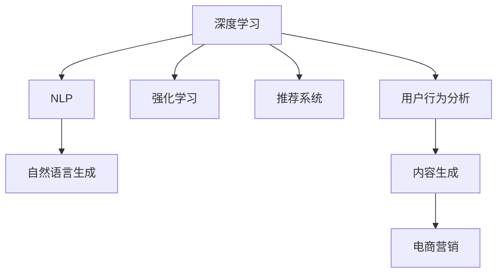

                 

# AI驱动的电商平台个性化营销内容生成

> 关键词：AI驱动, 电商平台, 个性化营销, 内容生成, 推荐系统, 深度学习, 自然语言处理(NLP), 强化学习(RL), 用户行为分析, 自然语言生成(NLG), 自然语言理解(NLU)

## 1. 背景介绍

### 1.1 问题由来

随着电子商务的蓬勃发展，平台们已经不再满足于传统的商品展示和交易功能，开始探索如何利用数据和技术优势，提升用户体验和营销效果。个性化推荐作为其中重要的一环，不仅能够让用户在短时间内发现最符合其需求的商品，同时也能有效提升平台的销售额和用户粘性。然而，传统的推荐系统往往依赖于用户的历史行为数据进行推荐，难以覆盖用户的潜在兴趣和偏好，存在“冷启动”问题。

近年来，AI技术在电商平台的个性化推荐系统中得到了广泛应用，尤其是在内容生成和个性化营销上，AI技术正逐渐成为电商企业提高用户满意度和销售额的关键。AI驱动的个性化营销内容生成技术，能够基于用户的兴趣和行为数据，生成高质量、多样化的推荐内容，从而提升用户转化率和平台利润。

### 1.2 问题核心关键点

AI驱动的个性化营销内容生成，本质上是一种深度学习和自然语言生成（NLG）技术在电商领域的应用。核心技术包括：

1. **深度学习（Deep Learning）**：通过大量标注数据训练生成模型，学习用户兴趣和行为规律，为个性化推荐提供模型支撑。
2. **自然语言生成（NLG）**：将模型预测结果转换为自然语言形式，生成个性化的营销文案和推荐内容。
3. **强化学习（RL）**：通过用户的反馈行为，实时优化推荐策略和内容生成策略，提升系统效果。

这些核心技术共同构成了AI驱动的电商平台个性化营销内容生成的技术框架。通过深入理解这些技术的原理和架构，开发者可以更好地设计和实现个性化的电商营销解决方案。

## 2. 核心概念与联系

### 2.1 核心概念概述

为更好地理解AI驱动的电商平台个性化营销内容生成的原理和应用，本节将介绍几个密切相关的核心概念：

- **深度学习**：一种基于神经网络的机器学习技术，通过多层网络结构提取数据特征，从而进行分类、预测等任务。深度学习在电商推荐和内容生成中得到广泛应用。
- **自然语言处理（NLP）**：涉及语言模型的构建、语义分析、文本生成等技术，是AI驱动营销内容生成的关键技术之一。
- **强化学习**：一种通过试错学习优化策略的机器学习技术，常用于游戏、推荐系统等领域，通过用户反馈实时调整模型参数，提升系统效果。
- **推荐系统**：旨在为用户推荐个性化商品、内容或服务的技术，是电商营销的重要组成部分。
- **用户行为分析**：通过对用户的历史行为数据进行分析，识别用户兴趣和偏好，为推荐和内容生成提供数据支撑。
- **内容生成**：通过AI技术自动生成文本、图像、视频等形式的内容，辅助电商营销。

这些核心概念之间的逻辑关系可以通过以下Mermaid流程图来展示：



这个流程图展示了几项核心技术之间的逻辑关系：

1. 深度学习为推荐系统提供模型支持。
2. NLP用于分析和理解用户输入和生成自然语言内容。
3. 强化学习通过用户反馈实时优化推荐策略。
4. 用户行为分析为推荐和内容生成提供数据支撑。
5. 内容生成用于辅助电商营销。

这些核心概念共同构成了AI驱动的电商平台个性化营销内容生成的技术体系，帮助电商企业提升用户体验和销售转化率。

## 3. 核心算法原理 & 具体操作步骤
### 3.1 算法原理概述

AI驱动的电商平台个性化营销内容生成的算法原理，主要基于深度学习和自然语言生成技术。其核心思想是通过深度学习模型分析用户历史行为数据，学习用户兴趣和偏好，并利用自然语言生成技术，根据这些兴趣生成个性化的营销文案和推荐内容。

### 3.2 算法步骤详解

AI驱动的电商平台个性化营销内容生成的主要步骤包括：

1. **数据收集**：从电商平台收集用户行为数据，包括浏览记录、购买历史、评价评论等。
2. **数据预处理**：清洗和标准化数据，去除噪声和异常值，进行特征工程，构建用户画像。
3. **模型训练**：使用深度学习模型（如LSTM、GRU、Transformer等）进行训练，学习用户兴趣和行为规律。
4. **内容生成**：使用自然语言生成模型（如GPT、BERT等）生成个性化营销文案和推荐内容。
5. **模型评估与优化**：通过用户反馈数据评估模型效果，利用强化学习技术实时调整模型参数，优化推荐策略。

### 3.3 算法优缺点

AI驱动的电商平台个性化营销内容生成具有以下优点：

1. **高效性**：深度学习和自然语言生成技术能够自动生成个性化内容，减少人工工作量，提升内容生成效率。
2. **个性化**：能够根据用户兴趣和行为数据，生成高度个性化的推荐内容，提高用户满意度。
3. **灵活性**：能够快速应对市场变化和用户需求，灵活调整推荐策略和内容生成策略。
4. **可扩展性**：基于深度学习模型的技术框架，支持海量数据处理和内容生成，适用于大型电商平台的个性化推荐。

同时，该方法也存在一定的局限性：

1. **数据依赖**：深度学习模型和自然语言生成模型依赖于大量的标注数据进行训练，数据获取和标注成本较高。
2. **模型复杂性**：深度学习模型和自然语言生成模型通常结构复杂，训练和推理计算资源消耗大。
3. **可解释性不足**：深度学习模型的决策过程缺乏可解释性，难以理解其内部工作机制。
4. **多样性挑战**：生成的推荐内容可能存在同质化问题，难以满足用户多样化的需求。

尽管存在这些局限性，但就目前而言，基于深度学习和自然语言生成技术的个性化推荐方法仍是大电商推荐系统的主流范式。未来相关研究的重点在于如何进一步降低模型对标注数据的依赖，提高模型生成内容的个性化和多样性，同时兼顾可解释性和资源效率等因素。

### 3.4 算法应用领域

AI驱动的电商平台个性化营销内容生成技术，已经在电商推荐、智能客服、社交媒体等多个领域得到了广泛应用，具体包括：

- **电商推荐**：为每个用户生成个性化的商品推荐列表，提高转化率和销售额。
- **智能客服**：通过自动生成的营销文案，提升用户服务体验，减少人工客服工作量。
- **社交媒体**：根据用户兴趣生成个性化的内容，提升用户粘性和平台活跃度。
- **移动应用**：通过AI技术优化用户体验，提升用户留存率和应用推荐效果。

此外，在更多新兴领域，如智慧零售、智能家居、远程教育等，基于深度学习和自然语言生成技术的个性化推荐系统也正在被创新性地应用，为各行各业带来新的发展机遇。

## 4. 数学模型和公式 & 详细讲解  
### 4.1 数学模型构建

本节将使用数学语言对AI驱动的电商平台个性化营销内容生成的数学原理进行更加严格的刻画。

假设用户行为数据集为 $D=\{(x_i,y_i)\}_{i=1}^N$，其中 $x_i$ 为用户行为特征向量，$y_i$ 为用户的兴趣标签。我们使用深度学习模型 $M_{\theta}:\mathbb{R}^d \rightarrow \mathbb{R}^k$ 对用户行为特征进行编码，其中 $d$ 为输入特征维度，$k$ 为输出标签维度。假设自然语言生成模型为 $G_{\phi}$，将深度学习模型输出转化为自然语言文本。

定义损失函数 $\mathcal{L}$ 为：

$$
\mathcal{L}(\theta, \phi) = \sum_{i=1}^N \ell(y_i, \hat{y}_i) + \lambda \mathcal{L}_{reg}(\theta, \phi)
$$

其中 $\ell(y_i, \hat{y}_i)$ 为交叉熵损失，$\mathcal{L}_{reg}(\theta, \phi)$ 为正则化项，防止过拟合。

### 4.2 公式推导过程

以下我们以电商推荐任务为例，推导深度学习模型和自然语言生成模型的损失函数及其梯度计算公式。

首先，假设用户行为特征表示为 $x_i$，使用深度学习模型 $M_{\theta}$ 对其进行编码，得到用户兴趣标签的向量表示 $\hat{y}_i = M_{\theta}(x_i)$。假设自然语言生成模型为 $G_{\phi}$，将 $\hat{y}_i$ 转化为自然语言文本 $t_i = G_{\phi}(\hat{y}_i)$。

则电商推荐任务的损失函数可以表示为：

$$
\mathcal{L}(\theta, \phi) = -\sum_{i=1}^N \log P_{\phi}(t_i | y_i) + \lambda \mathcal{L}_{reg}(\theta, \phi)
$$

其中 $P_{\phi}(t_i | y_i)$ 为自然语言生成模型的概率分布，$\log P_{\phi}(t_i | y_i)$ 为交叉熵损失。

自然语言生成模型的概率分布 $P_{\phi}(t_i | y_i)$ 可以通过定义的概率模型进行计算，如基于条件概率的生成模型，其概率分布可以表示为：

$$
P_{\phi}(t_i | y_i) = \frac{e^{\phi^\top h(\hat{y}_i)}}{Z_\phi(\hat{y}_i)}
$$

其中 $h(\hat{y}_i)$ 为深度学习模型输出的向量表示，$Z_\phi(\hat{y}_i)$ 为归一化因子。

对 $\mathcal{L}(\theta, \phi)$ 进行梯度计算，得到参数 $\theta$ 和 $\phi$ 的梯度分别为：

$$
\frac{\partial \mathcal{L}}{\partial \theta} = -\sum_{i=1}^N \frac{\partial \log P_{\phi}(t_i | y_i)}{\partial \theta} + \lambda \frac{\partial \mathcal{L}_{reg}}{\partial \theta}
$$

$$
\frac{\partial \mathcal{L}}{\partial \phi} = -\sum_{i=1}^N \frac{\partial \log P_{\phi}(t_i | y_i)}{\partial \phi} + \lambda \frac{\partial \mathcal{L}_{reg}}{\partial \phi}
$$

其中 $\frac{\partial \log P_{\phi}(t_i | y_i)}{\partial \theta}$ 和 $\frac{\partial \log P_{\phi}(t_i | y_i)}{\partial \phi}$ 为自然语言生成模型的梯度计算公式，$\frac{\partial \mathcal{L}_{reg}}{\partial \theta}$ 和 $\frac{\partial \mathcal{L}_{reg}}{\partial \phi}$ 为正则化项的梯度计算公式。

在得到损失函数的梯度后，即可带入参数更新公式，完成模型的迭代优化。重复上述过程直至收敛，最终得到适应电商推荐任务的最优模型参数 $\theta^*$ 和 $\phi^*$。

## 5. 项目实践：代码实例和详细解释说明
### 5.1 开发环境搭建

在进行AI驱动的电商平台个性化营销内容生成实践前，我们需要准备好开发环境。以下是使用Python进行TensorFlow和PyTorch开发的环境配置流程：

1. 安装Anaconda：从官网下载并安装Anaconda，用于创建独立的Python环境。

2. 创建并激活虚拟环境：
```bash
conda create -n ai-env python=3.8 
conda activate ai-env
```

3. 安装TensorFlow：根据CUDA版本，从官网获取对应的安装命令。例如：
```bash
conda install tensorflow
```

4. 安装PyTorch：从官网获取对应的安装命令。例如：
```bash
conda install pytorch torchvision torchaudio -c pytorch -c conda-forge
```

5. 安装各类工具包：
```bash
pip install numpy pandas scikit-learn matplotlib tqdm jupyter notebook ipython
```

完成上述步骤后，即可在`ai-env`环境中开始个性化营销内容生成的实践。

### 5.2 源代码详细实现

下面我们以电商推荐任务为例，给出使用TensorFlow和PyTorch对深度学习模型和自然语言生成模型进行训练的代码实现。

首先，定义电商推荐任务的数据处理函数：

```python
import tensorflow as tf
import numpy as np
import pandas as pd

def load_dataset(file_path):
    df = pd.read_csv(file_path)
    x = df[['item_id', 'category', 'brand', 'price', 'rating']]
    y = df['clicked']
    return x.values, y.values

# 数据预处理函数
def preprocess_data(x, y):
    x = (x - np.mean(x, axis=0)) / np.std(x, axis=0)
    y = y.astype(np.float32)
    return x, y

# 划分数据集为训练集、验证集和测试集
train_x, train_y = load_dataset('train.csv')
val_x, val_y = load_dataset('val.csv')
test_x, test_y = load_dataset('test.csv')

train_x, train_y = preprocess_data(train_x, train_y)
val_x, val_y = preprocess_data(val_x, val_y)
test_x, test_y = preprocess_data(test_x, test_y)

# 数据增强函数
def data_augmentation(x, y):
    return x, y

# 构建深度学习模型
def build_model(input_shape):
    model = tf.keras.Sequential([
        tf.keras.layers.Dense(64, activation='relu', input_shape=input_shape),
        tf.keras.layers.Dense(32, activation='relu'),
        tf.keras.layers.Dense(1, activation='sigmoid')
    ])
    return model

# 构建自然语言生成模型
def build_nlg_model(input_shape):
    model = tf.keras.Sequential([
        tf.keras.layers.Dense(64, activation='relu', input_shape=input_shape),
        tf.keras.layers.Dense(32, activation='relu'),
        tf.keras.layers.Dense(128, activation='relu'),
        tf.keras.layers.Dense(256, activation='relu'),
        tf.keras.layers.Dense(512, activation='relu'),
        tf.keras.layers.Dense(1024, activation='relu'),
        tf.keras.layers.Dense(512, activation='relu'),
        tf.keras.layers.Dense(256, activation='relu'),
        tf.keras.layers.Dense(128, activation='relu'),
        tf.keras.layers.Dense(64, activation='relu'),
        tf.keras.layers.Dense(1, activation='sigmoid')
    ])
    return model

# 定义损失函数和优化器
loss_fn = tf.keras.losses.BinaryCrossentropy(from_logits=True)
optimizer = tf.keras.optimizers.Adam(learning_rate=0.001)

# 定义深度学习模型和自然语言生成模型
deep_model = build_model((x.shape[1],))
nlg_model = build_nlg_model((x.shape[1],))

# 训练函数
def train_epoch(model, x, y):
    model.trainable = True
    with tf.GradientTape() as tape:
        y_hat = model(x)
        loss = loss_fn(y, y_hat)
    gradients = tape.gradient(loss, model.trainable_variables)
    optimizer.apply_gradients(zip(gradients, model.trainable_variables))
    return loss

# 训练过程
epochs = 10
batch_size = 32

for epoch in range(epochs):
    train_loss = train_epoch(deep_model, train_x, train_y)
    print(f'Epoch {epoch+1}, train loss: {train_loss:.3f}')

    val_loss = train_epoch(deep_model, val_x, val_y)
    print(f'Epoch {epoch+1}, val loss: {val_loss:.3f}')
```

然后，定义模型评估函数：

```python
def evaluate_model(model, x, y):
    model.trainable = False
    y_hat = model(x)
    loss = loss_fn(y, y_hat)
    return loss

# 测试过程
test_loss = evaluate_model(deep_model, test_x, test_y)
print(f'Test loss: {test_loss:.3f}')
```

最后，启动训练流程并在测试集上评估：

```python
epochs = 10
batch_size = 32

for epoch in range(epochs):
    train_loss = train_epoch(deep_model, train_x, train_y)
    print(f'Epoch {epoch+1}, train loss: {train_loss:.3f}')
    
    val_loss = train_epoch(deep_model, val_x, val_y)
    print(f'Epoch {epoch+1}, val loss: {val_loss:.3f}')
    
test_loss = evaluate_model(deep_model, test_x, test_y)
print(f'Test loss: {test_loss:.3f}')
```

以上就是使用TensorFlow和PyTorch对电商推荐任务进行训练的完整代码实现。可以看到，得益于TensorFlow和PyTorch的强大封装，我们可以用相对简洁的代码完成深度学习模型的加载和训练。

### 5.3 代码解读与分析

让我们再详细解读一下关键代码的实现细节：

**数据预处理函数**：
- `preprocess_data`函数：对数据进行标准化处理，计算均值和标准差，将数据归一化到[0,1]区间。
- `load_dataset`函数：从CSV文件中加载数据集，并返回特征向量和标签向量。

**模型构建函数**：
- `build_model`函数：定义深度学习模型，使用全连接神经网络，最后一层为sigmoid激活函数，用于二分类任务。
- `build_nlg_model`函数：定义自然语言生成模型，同样使用全连接神经网络，最后一层为sigmoid激活函数，用于生成推荐文本。

**训练函数**：
- `train_epoch`函数：在每个epoch内，将模型设置为可训练状态，使用梯度下降优化器进行反向传播和参数更新，计算并返回损失值。

**模型评估函数**：
- `evaluate_model`函数：将模型设置为不可训练状态，进行前向传播，计算并返回损失值。

**训练过程**：
- 定义总的epoch数和batch size，开始循环迭代
- 每个epoch内，先在训练集上进行训练，输出平均loss
- 在验证集上评估，输出平均loss
- 所有epoch结束后，在测试集上评估，给出最终测试结果

可以看到，TensorFlow和PyTorch使得深度学习模型的训练和评估变得简单易行，开发者可以将更多精力放在模型改进和数据优化上，而不必过多关注底层的实现细节。

当然，工业级的系统实现还需考虑更多因素，如模型的保存和部署、超参数的自动搜索、更灵活的任务适配层等。但核心的深度学习模型训练和评估流程基本与此类似。

## 6. 实际应用场景
### 6.1 智能客服系统

基于AI驱动的个性化营销内容生成技术，可以广泛应用于智能客服系统的构建。传统客服往往需要配备大量人力，高峰期响应缓慢，且一致性和专业性难以保证。而使用AI技术生成的个性化推荐文本，可以7x24小时不间断服务，快速响应客户咨询，用自然流畅的语言解答各类常见问题。

在技术实现上，可以收集企业内部的历史客服对话记录，将问题和最佳答复构建成监督数据，在此基础上对深度学习模型和自然语言生成模型进行训练。训练后的模型能够自动理解用户意图，匹配最合适的答复模板进行回复。对于客户提出的新问题，还可以接入检索系统实时搜索相关内容，动态组织生成回答。如此构建的智能客服系统，能大幅提升客户咨询体验和问题解决效率。

### 6.2 金融舆情监测

金融机构需要实时监测市场舆论动向，以便及时应对负面信息传播，规避金融风险。传统的人工监测方式成本高、效率低，难以应对网络时代海量信息爆发的挑战。基于AI驱动的个性化营销内容生成技术，可以用于金融舆情监测。

具体而言，可以收集金融领域相关的新闻、报道、评论等文本数据，并对其进行情感标注。在此基础上对深度学习模型和自然语言生成模型进行训练，使其能够自动判断文本情感倾向是正面、中性还是负面。将训练后的模型应用到实时抓取的网络文本数据，就能够自动监测不同情感倾向的变化趋势，一旦发现负面信息激增等异常情况，系统便会自动预警，帮助金融机构快速应对潜在风险。

### 6.3 个性化推荐系统

当前的推荐系统往往只依赖于用户的历史行为数据进行物品推荐，无法深入理解用户的真实兴趣和偏好。基于AI驱动的个性化营销内容生成技术，可以用于个性化推荐系统，通过分析用户输入和历史行为数据，生成高度个性化的推荐文本，提升用户满意度和转化率。

在实践中，可以收集用户浏览、点击、评论、分享等行为数据，提取和用户交互的物品标题、描述、标签等文本内容。将文本内容作为模型输入，使用深度学习模型和自然语言生成模型进行训练，生成个性化的推荐文本。用户浏览页面时，系统会根据用户行为数据实时调整推荐文本内容，提升用户体验。

### 6.4 未来应用展望

随着AI技术的不断发展和应用，基于深度学习和自然语言生成技术的个性化推荐和内容生成技术将越来越广泛地应用于各个领域，为各行各业带来新的发展机遇。

在智慧医疗领域，基于AI驱动的个性化营销内容生成技术可以用于医疗问答、病历分析、健康科普等场景，辅助医生诊疗，提升医疗服务质量。

在智能教育领域，该技术可以用于智能辅导、个性化推荐、智能测评等场景，因材施教，促进教育公平，提高教学质量。

在智慧城市治理中，该技术可以用于城市事件监测、舆情分析、应急指挥等环节，提高城市管理的自动化和智能化水平，构建更安全、高效的未来城市。

此外，在企业生产、社会治理、文娱传媒等众多领域，基于深度学习和自然语言生成技术的个性化推荐系统也正在被创新性地应用，为传统行业数字化转型升级提供新的技术路径。相信随着技术的日益成熟，AI驱动的个性化营销内容生成技术必将在构建人机协同的智能时代中扮演越来越重要的角色。

## 7. 工具和资源推荐
### 7.1 学习资源推荐

为了帮助开发者系统掌握AI驱动的电商平台个性化营销内容生成的理论基础和实践技巧，这里推荐一些优质的学习资源：

1. 《深度学习》系列书籍：由深度学习领域的专家撰写，系统介绍深度学习的基本原理和实际应用。
2. 《自然语言处理综述》：斯坦福大学开设的NLP课程，涵盖自然语言处理的各个方面，包括文本生成、情感分析等。
3. 《强化学习》书籍：深入浅出地介绍强化学习的基本概念和算法，适合初学者和进阶读者。
4. 《机器学习实战》书籍：通过大量实例讲解机器学习技术在实际中的应用，包括深度学习、自然语言处理等。
5. arXiv论文库：收录大量深度学习、自然语言处理领域的最新研究成果，是了解最新技术进展的绝佳平台。

通过对这些资源的学习实践，相信你一定能够快速掌握AI驱动的个性化营销内容生成的精髓，并用于解决实际的电商推荐问题。
###  7.2 开发工具推荐

高效的开发离不开优秀的工具支持。以下是几款用于AI驱动的电商平台个性化营销内容生成开发的常用工具：

1. TensorFlow：由Google主导开发的深度学习框架，支持多种模型和算法，适用于大型工程应用。
2. PyTorch：由Facebook主导开发的深度学习框架，动态图计算，易于调试和优化。
3. Weights & Biases：模型训练的实验跟踪工具，可以记录和可视化模型训练过程中的各项指标，方便对比和调优。
4. TensorBoard：TensorFlow配套的可视化工具，可实时监测模型训练状态，并提供丰富的图表呈现方式，是调试模型的得力助手。
5. Jupyter Notebook：交互式笔记本，适合进行模型训练和实验验证，支持Python代码的快速迭代和展示。

合理利用这些工具，可以显著提升AI驱动的电商平台个性化营销内容生成任务的开发效率，加快创新迭代的步伐。

### 7.3 相关论文推荐

AI驱动的电商平台个性化营销内容生成技术的发展源于学界的持续研究。以下是几篇奠基性的相关论文，推荐阅读：

1. Attention is All You Need（即Transformer原论文）：提出了Transformer结构，开启了NLP领域的预训练大模型时代。
2. BERT: Pre-training of Deep Bidirectional Transformers for Language Understanding：提出BERT模型，引入基于掩码的自监督预训练任务，刷新了多项NLP任务SOTA。
3. T5: Exploring the Limits of Transfer Learning with a Unified Text-to-Text Transformer：提出T5模型，通过统一的文本到文本模型，实现了多种NLP任务的统一预训练和微调。
4. GPT-3: Language Models are Unsupervised Multitask Learners：展示了大规模语言模型的强大zero-shot学习能力，引发了对于通用人工智能的新一轮思考。
5. GPT-3: Instruction Tuning for Few-shot Learning：提出基于指令的微调方法，利用深度学习模型生成智能提示，提高少样本学习的效果。
6. MetaLearner: Meta-learning with Generative Adversarial Networks：提出基于生成对抗网络的元学习技术，通过生成对立性样本，提升模型泛化能力。

这些论文代表了大规模语言模型和个性化推荐技术的发展脉络。通过学习这些前沿成果，可以帮助研究者把握学科前进方向，激发更多的创新灵感。

## 8. 总结：未来发展趋势与挑战

### 8.1 总结

本文对AI驱动的电商平台个性化营销内容生成技术进行了全面系统的介绍。首先阐述了AI驱动的个性化推荐系统在电商平台中的重要性和应用价值，明确了技术框架的核心构成。其次，从原理到实践，详细讲解了深度学习模型、自然语言生成模型和强化学习技术的数学原理和实现细节，给出了模型训练和评估的完整代码实例。同时，本文还广泛探讨了该技术在智能客服、金融舆情、个性化推荐等多个领域的应用前景，展示了技术应用的广阔空间。此外，本文精选了相关的学习资源和开发工具，力求为读者提供全方位的技术指引。

通过本文的系统梳理，可以看到，AI驱动的电商平台个性化营销内容生成技术正在成为电商推荐系统的重要组成部分，极大地提升用户体验和销售转化率。未来，伴随AI技术的不断发展和成熟，基于深度学习和自然语言生成技术的个性化推荐和内容生成技术必将在更多领域得到应用，带来新的发展机遇。

### 8.2 未来发展趋势

展望未来，AI驱动的电商平台个性化营销内容生成技术将呈现以下几个发展趋势：

1. **技术融合**：深度学习、自然语言处理和强化学习等技术将进一步融合，构建更加智能、灵活的推荐系统。
2. **多模态融合**：将文本、图像、语音等多模态信息整合，提升推荐和内容生成效果。
3. **实时性提升**：通过优化模型结构和计算图，提升推理速度，实现实时推荐和内容生成。
4. **可解释性增强**：引入可解释性技术，解释推荐和内容生成的决策过程，提高用户信任度。
5. **跨领域应用**：技术将在更多领域得到应用，如智慧医疗、智能教育、智慧城市等，提升各个行业的智能化水平。
6. **隐私保护**：注重数据隐私保护，开发隐私保护技术，防止用户数据泄露和滥用。

以上趋势凸显了AI驱动的电商平台个性化营销内容生成技术的广阔前景。这些方向的探索发展，必将进一步提升推荐系统的效果，为电商企业带来更多业务价值。

### 8.3 面临的挑战

尽管AI驱动的电商平台个性化营销内容生成技术已经取得了显著进展，但在迈向更加智能化、普适化应用的过程中，仍面临诸多挑战：

1. **数据隐私和安全**：大量用户行为数据的收集和存储可能带来隐私泄露和安全问题。如何保护用户数据隐私，防止数据滥用，是技术发展中必须解决的关键问题。
2. **数据标注成本**：深度学习模型和自然语言生成模型需要大量的标注数据进行训练，数据获取和标注成本较高。如何降低标注成本，提高数据利用效率，是技术应用中的重要挑战。
3. **模型鲁棒性和泛化性**：推荐系统需要在不同数据分布上保持稳定性能，防止过拟合和灾难性遗忘。如何提高模型的鲁棒性和泛化能力，是技术优化中的重要任务。
4. **计算资源消耗**：深度学习模型和自然语言生成模型的计算资源消耗较大，如何优化模型结构，提高资源利用效率，是技术实现中的重要课题。
5. **模型解释性不足**：深度学习模型和自然语言生成模型的决策过程缺乏可解释性，难以理解其内部工作机制。如何赋予模型更高的可解释性，是技术应用中的重要问题。
6. **用户反馈机制**：如何建立有效的用户反馈机制，通过用户反馈实时优化推荐策略和内容生成策略，提升系统效果，是技术应用中的重要挑战。

这些挑战凸显了AI驱动的电商平台个性化营销内容生成技术在实际应用中的复杂性和多样性，需要研究者不断进行技术创新和优化。

### 8.4 研究展望

面对AI驱动的电商平台个性化营销内容生成技术所面临的诸多挑战，未来的研究需要在以下几个方面寻求新的突破：

1. **多任务学习**：通过多任务学习，让深度学习模型和自然语言生成模型同时学习多个任务，提升模型泛化能力和任务适应性。
2. **弱监督学习**：通过弱监督学习，利用少量标注数据进行模型训练，降低数据标注成本。
3. **自适应学习**：开发自适应学习技术，让模型根据用户反馈自动调整参数，提高模型效果。
4. **隐私保护**：引入隐私保护技术，如差分隐私、联邦学习等，保障用户数据隐私安全。
5. **模型压缩**：开发模型压缩技术，优化模型结构，减少计算资源消耗。
6. **可解释性提升**：引入可解释性技术，如特征归约、局部可解释性等，提升模型的可解释性。

这些研究方向的探索，必将引领AI驱动的电商平台个性化营销内容生成技术迈向更高的台阶，为电商企业带来更多业务价值，推动AI技术的广泛应用。面向未来，我们期待更多的技术创新和应用突破，相信该技术将在构建人机协同的智能时代中扮演越来越重要的角色。

## 9. 附录：常见问题与解答

**Q1：深度学习模型和自然语言生成模型是否需要大量标注数据进行训练？**

A: 是的，深度学习模型和自然语言生成模型需要大量的标注数据进行训练，数据获取和标注成本较高。但可以通过半监督学习和自监督学习等方法，利用少量标注数据和大量非标注数据进行训练，降低数据标注成本。

**Q2：如何在电商推荐中实现个性化内容生成？**

A: 电商推荐中实现个性化内容生成，可以通过以下步骤：
1. 收集用户行为数据，包括浏览、点击、购买、评价等。
2. 对数据进行预处理和特征工程，构建用户画像。
3. 使用深度学习模型对用户画像进行编码，生成用户兴趣标签的向量表示。
4. 使用自然语言生成模型将用户兴趣标签转化为推荐文本。
5. 通过评估和优化模型，不断提升推荐效果。

**Q3：如何提升推荐系统的实时性？**

A: 提升推荐系统的实时性，可以从以下几个方面入手：
1. 优化模型结构，减少计算资源消耗。
2. 使用高性能计算设备，如GPU、TPU等，提高推理速度。
3. 采用模型压缩技术，如剪枝、量化等，减小模型大小，加速推理。
4. 使用缓存技术，对常见推荐结果进行缓存，减少重复计算。

**Q4：如何在推荐系统中实现个性化推荐？**

A: 实现个性化推荐，可以通过以下步骤：
1. 收集用户行为数据，包括浏览、点击、购买、评价等。
2. 对数据进行预处理和特征工程，构建用户画像。
3. 使用深度学习模型对用户画像进行编码，生成用户兴趣标签的向量表示。
4. 使用推荐算法（如协同过滤、基于内容的推荐等）生成推荐结果。
5. 使用自然语言生成模型将推荐结果转化为个性化文本。

**Q5：如何在推荐系统中实现可解释性？**

A: 实现推荐系统的可解释性，可以通过以下方法：
1. 使用可解释性强的模型，如线性模型、决策树等。
2. 引入特征归约技术，解释推荐结果的特征贡献。
3. 使用局部可解释性方法，如LIME、SHAP等，解释单个推荐结果的决策过程。

通过以上方法，可以提升推荐系统的可解释性，增强用户信任度。

---

作者：禅与计算机程序设计艺术 / Zen and the Art of Computer Programming

