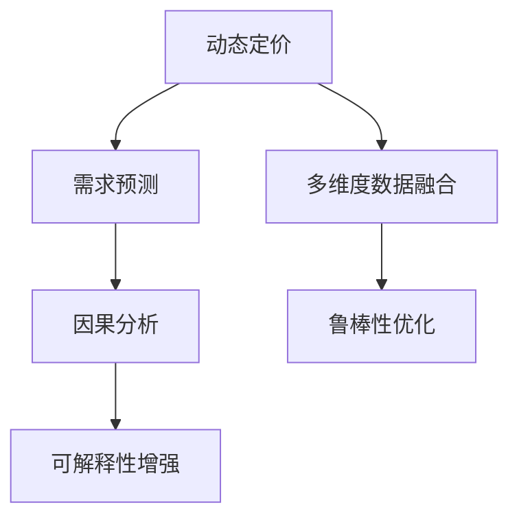

                 

## 1. 背景介绍

### 1.1 问题由来

电商平台的动态定价与需求预测是现代零售商必须应对的两大核心挑战。动态定价通过实时调整商品价格，可以最大化销售收入和利润，同时对抗竞争对手的定价策略。需求预测则通过预测未来需求，帮助电商平台优化库存、采购和配送策略，提升客户满意度。

过去，电商平台的定价和预测通常依赖于专家经验和历史数据分析，但在数据量爆炸和市场环境复杂多变的今天，这些传统方法已经难以满足需求。人工智能和大数据技术的崛起，为电商平台提供了全新的解决方案。基于机器学习算法，电商平台可以构建更加智能、高效、灵活的动态定价与需求预测系统。

### 1.2 问题核心关键点

动态定价与需求预测的核心在于如何构建高效、准确、稳健的预测模型。通过构建准确的预测模型，电商平台可以在实时动态中做出精准的定价决策，提升盈利能力；同时通过需求预测，电商平台可以实现更合理的库存管理，优化客户体验。

其中，动态定价涉及到的关键问题包括：
- 如何实时获取和处理用户行为数据和市场环境信息。
- 如何设计高效、鲁棒的定价模型，实现快速预测和调整。
- 如何优化定价策略，确保其符合平台整体运营目标。

需求预测则涉及：
- 如何高效地处理多维度、高频率的交易数据。
- 如何建模不同因素对需求的影响，提升预测准确性。
- 如何根据预测结果，实时调整库存和配送策略。

### 1.3 问题研究意义

在数字化转型的浪潮下，动态定价与需求预测已逐渐成为电商平台竞争力的重要组成部分。通过优化这两个环节，电商平台可以实现：
- 提升销售和利润：动态定价可以最大化利润，通过实时调整价格，抓住市场机会，对抗竞争。
- 优化库存和供应链：需求预测帮助电商平台精确计算库存需求，提升运营效率。
- 增强用户体验：实时价格调整和库存优化，可以更好地满足客户需求，提升满意度。
- 加速决策速度：机器学习模型通过快速分析海量数据，提供实时预测和定价建议，大幅提升决策速度。

## 2. 核心概念与联系

### 2.1 核心概念概述

为更好地理解电商平台的动态定价与需求预测集成方法，本节将介绍几个密切相关的核心概念：

- **动态定价(Dynamic Pricing)**：指电商平台根据实时市场数据和用户行为，实时调整商品价格，最大化销售收入和利润。
- **需求预测(Demand Forecasting)**：指通过机器学习模型，预测商品在未来时间的销售需求，帮助电商平台优化库存、采购和配送策略。
- **多维度数据融合(Multi-Dimensional Data Fusion)**：指将用户的各类行为数据、市场环境信息等，整合到预测模型中，提升模型的泛化能力和预测准确性。
- **因果分析(Causal Inference)**：指分析模型输出结果的因果关系，帮助电商平台理解影响因素，优化定价和预测策略。
- **鲁棒性(Robustness)**：指模型对数据噪声、异常值等扰动的鲁棒性，确保模型输出稳定可靠。
- **可解释性(Explainability)**：指模型的决策过程可以被解释，电商平台可以理解模型预测的逻辑和依据，提高决策的透明度和可信度。

这些核心概念之间的逻辑关系可以通过以下Mermaid流程图来展示：



这个流程图展示了大语言模型的核心概念及其之间的关系：

1. 动态定价通过多维度数据融合，获取全面、准确的市场和用户信息，指导定价模型的调整。
2. 需求预测同样依赖于多维度数据融合，通过因果分析，理解不同因素对需求的影响，提供精准的预测结果。
3. 鲁棒性和可解释性是模型性能的重要保证，确保定价和预测的稳定性和透明度。

## 3. 核心算法原理 & 具体操作步骤

### 3.1 算法原理概述

电商平台动态定价与需求预测的核心算法为基于机器学习的回归模型和分类模型。具体而言，动态定价模型需要预测商品在未来时间的销售价格，需求预测模型需要预测商品在未来时间的销售数量。

以线性回归模型为例，假设商品i在时间t的价格为$P_i(t)$，其影响因素包括市场因素$X_{market}$、用户因素$X_{user}$和历史销售价格$P_i(t-1)$。线性回归模型可以表示为：

$$
P_i(t) = \beta_0 + \sum_{k=1}^K \beta_k X_k + \epsilon_i(t)
$$

其中$\beta_k$为模型参数，$\epsilon_i(t)$为误差项。通过求解$\beta_k$，模型可以预测商品在任意时间点的价格。

类似地，需求预测模型通常采用线性回归或时序模型，如ARIMA、LSTM等，预测商品在未来时间的销售数量。模型输入包括时间因素、市场因素、用户因素等，输出为销售数量。

### 3.2 算法步骤详解

基于机器学习的电商平台动态定价与需求预测一般包括以下几个关键步骤：

**Step 1: 数据预处理**
- 收集商品历史销售数据、市场环境数据、用户行为数据等。
- 对数据进行清洗、去重、归一化等预处理，确保数据质量和一致性。
- 将多源数据整合到统一的数据格式中，方便后续建模。

**Step 2: 特征工程**
- 设计合适的特征，提取数据的有效信息，提高模型的泛化能力。
- 对重要特征进行编码、归一化等处理，确保特征质量。
- 引入交叉特征、时序特征等，增强模型的表达能力。

**Step 3: 模型选择与训练**
- 选择合适的机器学习算法，如线性回归、决策树、随机森林、神经网络等。
- 划分训练集、验证集和测试集，用于模型训练和评估。
- 设置模型参数和超参数，选择合适的优化算法和损失函数。
- 使用交叉验证等技术，评估模型性能，选择最佳模型。

**Step 4: 模型优化与评估**
- 使用正则化技术、模型融合等手段，优化模型性能。
- 在测试集上评估模型效果，计算均方误差、平均绝对误差等指标。
- 根据评估结果，调整模型参数和超参数，优化模型性能。

**Step 5: 实时预测与定价**
- 部署训练好的模型，实现实时预测和定价功能。
- 使用缓存、分布式计算等技术，提升预测和定价的效率。
- 根据预测结果，实时调整商品价格，优化库存和供应链。

以上是基于机器学习的电商平台动态定价与需求预测的一般流程。在实际应用中，还需要根据具体业务场景，对微调过程的各个环节进行优化设计，如改进训练目标函数，引入更多的正则化技术，搜索最优的超参数组合等，以进一步提升模型性能。

### 3.3 算法优缺点

基于机器学习的电商平台动态定价与需求预测方法具有以下优点：
1. 高效灵活：模型可以快速适应新的市场变化，灵活调整定价和预测结果。
2. 自动化程度高：模型通过自动化算法优化，减少了人工干预和数据处理的工作量。
3. 数据驱动：模型基于历史数据训练，提升了决策的科学性和准确性。
4. 应用广泛：模型适用于多种电商场景，包括B2B、B2C、C2C等。

同时，该方法也存在一定的局限性：
1. 依赖标注数据：模型的训练效果依赖于标注数据的数量和质量，获取高质量标注数据的成本较高。
2. 过拟合风险：在大规模数据中，模型容易过拟合，需要选择合适的正则化技术。
3. 鲁棒性不足：模型对异常值、噪声数据的鲁棒性较差，需要进一步优化。
4. 解释性不足：模型输出结果难以解释，难以理解其决策逻辑。
5. 可解释性不足：模型输出结果难以解释，难以理解其决策逻辑。

尽管存在这些局限性，但就目前而言，基于机器学习的定价与预测方法仍是电商平台的主流范式。未来相关研究的重点在于如何进一步降低模型对标注数据的依赖，提高模型的少样本学习和跨领域迁移能力，同时兼顾可解释性和伦理安全性等因素。

### 3.4 算法应用领域

基于机器学习的动态定价与需求预测技术，在电商平台中已经得到了广泛的应用，覆盖了几乎所有常见场景，例如：

- **产品定价优化**：基于市场竞争、用户行为等因素，动态调整商品价格，提升销售和利润。
- **库存管理**：预测商品的销售需求，优化库存水平，减少缺货和积压。
- **促销策略**：通过需求预测，设计更有效的促销方案，提升销售效果。
- **定价算法优化**：实时分析市场环境变化，调整定价策略，对抗竞争对手。
- **订单履约**：预测订单交付时间，优化物流配送，提升客户满意度。

除了上述这些经典场景外，电商平台还创新性地应用了动态定价与需求预测技术，如个性化推荐、实时定价调整、反向竞价等，为电商技术带来了新的突破。随着机器学习技术的不断进步，相信电商平台在更多场景中能够充分发挥动态定价与需求预测的威力，提供更加精准、灵活、高效的电商体验。

## 4. 数学模型和公式 & 详细讲解 & 举例说明

### 4.1 数学模型构建

本节将使用数学语言对电商平台动态定价与需求预测模型的构建过程进行更加严格的刻画。

假设电商平台销售的商品数量为$Q_i(t)$，其影响因素包括市场因素$X_{market}$、用户因素$X_{user}$和历史销售数量$Q_i(t-1)$。需求预测模型可以表示为：

$$
Q_i(t) = \beta_0 + \sum_{k=1}^K \beta_k X_k + \epsilon_i(t)
$$

其中$\beta_k$为模型参数，$\epsilon_i(t)$为误差项。通过求解$\beta_k$，模型可以预测商品在任意时间点的销售数量。

类似地，动态定价模型同样采用线性回归模型，通过市场因素、用户因素和历史销售价格$P_i(t-1)$预测商品在未来时间的销售价格$P_i(t)$。模型可以表示为：

$$
P_i(t) = \beta_0 + \sum_{k=1}^K \beta_k X_k + \epsilon_i(t)
$$

其中$\beta_k$为模型参数，$\epsilon_i(t)$为误差项。通过求解$\beta_k$，模型可以预测商品在任意时间点的价格。

### 4.2 公式推导过程

以下我们以线性回归模型为例，推导需求预测模型的损失函数及其梯度的计算公式。

假设模型$Q_i(t)$在输入$(X_{market}, X_{user}, Q_i(t-1))$上的损失函数为$\ell(Q_i(t), Q_{true}(t))$，则在数据集$D=\{(x_i,y_i)\}_{i=1}^N, x_i \in \mathcal{X}, y_i \in \mathcal{Y}$上的经验风险为：

$$
\mathcal{L}(\theta) = \frac{1}{N} \sum_{i=1}^N [Q_{i,actual} - Q_{i,predicted}]^2
$$

其中$Q_{i,actual}$为实际销售数量，$Q_{i,predicted}$为模型预测的销售数量。

根据均方误差损失函数，需求预测模型的损失函数可以表示为：

$$
\mathcal{L}(\theta) = \frac{1}{N} \sum_{i=1}^N (Q_{i,actual} - Q_{i,predicted})^2
$$

模型参数$\theta = (\beta_0, \beta_1, ..., \beta_K)$。则损失函数对参数$\theta_k$的梯度为：

$$
\frac{\partial \mathcal{L}(\theta)}{\partial \theta_k} = -\frac{2}{N} \sum_{i=1}^N (Q_{i,actual} - Q_{i,predicted})X_{k,i}
$$

其中$X_{k,i}$为第$i$个样本的第$k$个特征值。

通过求解上述梯度方程，可以更新模型参数，最小化经验风险，实现需求预测模型的训练和优化。

## 5. 项目实践：代码实例和详细解释说明

### 5.1 开发环境搭建

在进行电商平台动态定价与需求预测开发前，我们需要准备好开发环境。以下是使用Python进行TensorFlow开发的环境配置流程：

1. 安装Anaconda：从官网下载并安装Anaconda，用于创建独立的Python环境。

2. 创建并激活虚拟环境：
```bash
conda create -n tf-env python=3.8 
conda activate tf-env
```

3. 安装TensorFlow：根据CUDA版本，从官网获取对应的安装命令。例如：
```bash
conda install tensorflow -c tf -c conda-forge
```

4. 安装各类工具包：
```bash
pip install numpy pandas scikit-learn matplotlib tqdm jupyter notebook ipython
```

完成上述步骤后，即可在`tf-env`环境中开始项目实践。

### 5.2 源代码详细实现

下面我们以电商平台的需求预测为例，给出使用TensorFlow构建的预测模型代码实现。

首先，定义需求预测任务的数据处理函数：

```python
import tensorflow as tf
import numpy as np

def load_data(filename, batch_size):
    with open(filename, 'r') as f:
        data = f.readlines()
    data = np.array([line.split(',') for line in data])
    x = data[:, :-1].astype(np.float32)
    y = data[:, -1].astype(np.float32)
    dataset = tf.data.Dataset.from_tensor_slices((x, y))
    dataset = dataset.shuffle(buffer_size=1000).batch(batch_size)
    return dataset

# 加载数据
train_data = load_data('train.csv', 32)
test_data = load_data('test.csv', 32)
```

然后，定义模型和优化器：

```python
from tensorflow.keras.models import Sequential
from tensorflow.keras.layers import Dense, Dropout
from tensorflow.keras.optimizers import Adam

model = Sequential([
    Dense(64, input_dim=x.shape[1], activation='relu'),
    Dropout(0.2),
    Dense(1)
])
model.compile(optimizer=Adam(0.001), loss='mse')
```

接着，定义训练和评估函数：

```python
@tf.function
def train_epoch(model, dataset, epochs=10):
    for epoch in range(epochs):
        for batch in dataset:
            x, y = batch
            with tf.GradientTape() as tape:
                y_pred = model(x)
                loss = tf.reduce_mean(tf.square(y_pred - y))
            grads = tape.gradient(loss, model.trainable_variables)
            optimizer.apply_gradients(zip(grads, model.trainable_variables))
        print(f'Epoch {epoch+1}, Loss: {loss.numpy()}')

@tf.function
def evaluate(model, dataset):
    total_loss = tf.keras.metrics.Mean()
    for batch in dataset:
        x, y = batch
        y_pred = model(x)
        loss = tf.reduce_mean(tf.square(y_pred - y))
        total_loss.update_state(loss)
    print(f'Test Loss: {total_loss.result().numpy()}')
```

最后，启动训练流程并在测试集上评估：

```python
train_epoch(model, train_data)
evaluate(model, test_data)
```

以上就是使用TensorFlow对电商平台需求预测模型的完整代码实现。可以看到，得益于TensorFlow的强大封装，我们可以用相对简洁的代码完成模型的训练和评估。

### 5.3 代码解读与分析

让我们再详细解读一下关键代码的实现细节：

**load_data函数**：
- 定义数据加载函数，从指定文件中读取数据，并进行预处理和批处理。

**model和optimizer定义**：
- 定义了多层感知器模型，包含一个全连接层和一个输出层。
- 使用Adam优化器，设置学习率为0.001。

**train_epoch函数**：
- 定义训练函数，通过梯度下降更新模型参数。
- 每个epoch迭代一次完整的数据集，输出每个epoch的平均损失。

**evaluate函数**：
- 定义评估函数，通过均方误差计算模型在测试集上的表现。
- 使用TensorFlow的`tf.keras.metrics`模块计算损失。

**训练流程**：
- 定义总的epoch数，开始循环迭代
- 每个epoch内，在训练集上训练，输出平均loss
- 在测试集上评估，输出最终测试结果

可以看到，TensorFlow使得需求预测模型的代码实现变得简洁高效。开发者可以将更多精力放在数据处理、模型改进等高层逻辑上，而不必过多关注底层的实现细节。

当然，工业级的系统实现还需考虑更多因素，如模型的保存和部署、超参数的自动搜索、更灵活的任务适配层等。但核心的需求预测过程基本与此类似。

## 6. 实际应用场景

### 6.1 智能库存管理

基于需求预测的电商平台智能库存管理系统，可以实时监控商品的库存水平，预测未来的需求趋势，从而提前进行补货或减少库存。通过需求预测，电商平台能够及时响应市场变化，避免缺货或积压，提升库存管理效率。

具体实现上，需求预测模型可以实时分析当前市场和用户行为数据，预测未来一周、一个月的销售需求。根据预测结果，智能系统可以自动调整补货计划，优化库存水平，减少库存成本。此外，系统还可以根据历史数据和实时市场信息，动态调整采购策略，确保库存的及时性和合理性。

### 6.2 个性化推荐系统

需求预测技术可以应用于个性化推荐系统中，帮助电商平台实现精准推荐。通过分析用户的浏览、点击、购买等行为数据，预测用户对不同商品的潜在需求，从而提供更个性化的推荐内容。

具体而言，推荐系统可以结合需求预测模型，预测用户对商品的评分和购买概率，根据预测结果进行推荐排序。通过个性化推荐，电商平台可以提升用户体验，增加用户粘性，提高转化率和回购率。此外，推荐系统还可以结合用户画像、商品标签等维度，设计更灵活、准确的推荐策略。

### 6.3 实时定价调整

基于需求预测的电商平台动态定价系统，可以实时调整商品价格，优化销售和利润。通过需求预测模型，系统可以预测未来一段时间的销售需求，根据需求预测结果调整商品价格，最大化销售收入和利润。

具体实现上，动态定价系统可以结合需求预测模型和定价策略，实时调整商品价格。例如，当预测某商品的需求增加时，系统可以提升该商品的价格；当需求下降时，可以降低价格以吸引更多消费者。通过动态定价，电商平台可以更好地应对市场变化，提升竞争力。

### 6.4 未来应用展望

随着需求预测技术的不断发展，基于需求预测的电商平台将呈现以下几个发展趋势：

1. **实时化**：需求预测模型将实现实时化，能够快速响应市场变化，提供更准确的预测结果。实时化的需求预测系统可以实时调整库存和定价策略，大幅提升运营效率。

2. **多模态融合**：电商平台将引入多模态数据，如图片、视频、语音等，增强需求预测的准确性和全面性。多模态融合的需求预测系统可以更好地理解用户需求，提升推荐和定价的精准度。

3. **因果分析**：需求预测模型将引入因果分析技术，理解不同因素对需求的影响，提高预测的科学性和可靠性。因果分析技术可以帮助电商平台设计更合理的定价和库存策略，优化决策过程。

4. **联邦学习**：为了保护用户隐私，电商平台将采用联邦学习技术，通过分布式计算实现数据隐私保护。联邦学习技术可以最大化利用用户数据，同时保护用户隐私，提升预测模型的泛化能力。

5. **解释性和可控性**：需求预测模型将更加注重可解释性和可控性，确保预测过程透明、可信。解释性需求预测系统可以帮助电商平台理解模型输出的逻辑和依据，优化决策过程。

6. **自动化和智能化**：电商平台将采用自动化、智能化的需求预测系统，减少人工干预，提高运营效率。自动化需求预测系统可以自动进行数据清洗、模型训练和预测，实现全流程自动化。

以上趋势凸显了需求预测技术的广阔前景。这些方向的探索发展，必将进一步提升电商平台的运营效率和用户体验，推动电商行业迈向更高的台阶。

## 7. 工具和资源推荐

### 7.1 学习资源推荐

为了帮助开发者系统掌握电商平台动态定价与需求预测的理论基础和实践技巧，这里推荐一些优质的学习资源：

1. 《深度学习》课程：由吴恩达教授主讲的深度学习入门课程，涵盖了深度学习的基本概念和算法，适合初学者学习。

2. 《TensorFlow实战Google深度学习框架》书籍：讲解了TensorFlow的使用方法，结合实战项目，帮助开发者掌握TensorFlow的使用技巧。

3. 《机器学习实战》书籍：通过丰富的案例和项目，帮助开发者理解机器学习的基本原理和算法。

4. 《Python机器学习》书籍：系统介绍了机器学习的基本概念、算法和工具，适合Python开发者学习。

5. 《因果分析：方法、模型与应用》书籍：讲解了因果分析的基本原理和应用方法，适合对因果分析感兴趣的读者学习。

通过学习这些资源，相信你一定能够快速掌握电商平台需求预测的精髓，并用于解决实际的电商问题。

### 7.2 开发工具推荐

高效的开发离不开优秀的工具支持。以下是几款用于电商平台需求预测开发的常用工具：

1. TensorFlow：由Google主导开发的深度学习框架，支持多种语言和平台，适合大规模深度学习应用。

2. PyTorch：由Facebook主导开发的深度学习框架，支持动态图和静态图，灵活性高，适合研究和实验。

3. scikit-learn：基于Python的机器学习库，提供简单易用的机器学习算法和工具，适合快速原型开发。

4. Keras：基于TensorFlow和Theano的高层API，提供简洁易用的深度学习模型构建接口，适合快速实验和开发。

5. Jupyter Notebook：开源的交互式笔记本，支持Python等语言，适合数据处理和模型实验。

6. Google Colab：谷歌提供的免费Jupyter Notebook服务，支持GPU/TPU等高性能计算资源，方便开发者快速实验。

合理利用这些工具，可以显著提升电商平台需求预测任务的开发效率，加快创新迭代的步伐。

### 7.3 相关论文推荐

电商平台需求预测技术的不断发展源于学界的持续研究。以下是几篇奠基性的相关论文，推荐阅读：

1. Gated Recurrent Unit (GRU) Networks: Learning to Order and Align Sequence Model: 提出GRU网络，通过门控机制对时间序列数据进行建模，提升序列预测的准确性。

2. Deep Factorization Machine for Recommender Systems: 提出DeepFM模型，结合深度学习和时间序列预测技术，提升推荐系统的性能。

3. A Survey of Deep Reinforcement Learning for Supply Chain Management: 综述了深度强化学习在供应链管理中的应用，提供深度学习的最新研究成果和应用案例。

4. Deep Learning for Reorder Point Inventory Management: 提出深度学习模型，通过预测需求进行库存管理，提升库存控制的效果。

5. Large-Scale Distributed Deep Learning: 提出在大规模分布式系统中进行深度学习的方法，提升计算效率和模型性能。

这些论文代表了大语言模型需求预测技术的发展脉络。通过学习这些前沿成果，可以帮助研究者把握学科前进方向，激发更多的创新灵感。

## 8. 总结：未来发展趋势与挑战

### 8.1 总结

本文对电商平台动态定价与需求预测的机器学习算法进行了全面系统的介绍。首先阐述了电商平台的定价和预测问题的背景和意义，明确了模型训练、优化、评估和部署的核心步骤。其次，从原理到实践，详细讲解了动态定价与需求预测的数学模型和算法实现，给出了需求预测任务的完整代码实例。同时，本文还广泛探讨了需求预测技术在智能库存管理、个性化推荐、实时定价等电商场景中的应用前景，展示了需求预测范式的巨大潜力。此外，本文精选了需求预测技术的各类学习资源，力求为读者提供全方位的技术指引。

通过本文的系统梳理，可以看到，基于机器学习的电商平台动态定价与需求预测技术正在成为电商平台竞争力的重要组成部分。通过优化这两个环节，电商平台可以实现提升销售和利润、优化库存和供应链、增强用户体验等目标，极大地提升运营效率和用户满意度。未来，伴随机器学习技术的不断进步，需求预测方法还将进一步发展，为电商平台带来更加精准、灵活、高效的服务体验。

### 8.2 未来发展趋势

展望未来，电商平台需求预测技术将呈现以下几个发展趋势：

1. **实时化**：需求预测模型将实现实时化，能够快速响应市场变化，提供更准确的预测结果。实时化的需求预测系统可以实时调整库存和定价策略，大幅提升运营效率。

2. **多模态融合**：电商平台将引入多模态数据，如图片、视频、语音等，增强需求预测的准确性和全面性。多模态融合的需求预测系统可以更好地理解用户需求，提升推荐和定价的精准度。

3. **因果分析**：需求预测模型将引入因果分析技术，理解不同因素对需求的影响，提高预测的科学性和可靠性。因果分析技术可以帮助电商平台设计更合理的定价和库存策略，优化决策过程。

4. **联邦学习**：为了保护用户隐私，电商平台将采用联邦学习技术，通过分布式计算实现数据隐私保护。联邦学习技术可以最大化利用用户数据，同时保护用户隐私，提升预测模型的泛化能力。

5. **解释性和可控性**：需求预测模型将更加注重可解释性和可控性，确保预测过程透明、可信。解释性需求预测系统可以帮助电商平台理解模型输出的逻辑和依据，优化决策过程。

6. **自动化和智能化**：电商平台将采用自动化、智能化的需求预测系统，减少人工干预，提高运营效率。自动化需求预测系统可以自动进行数据清洗、模型训练和预测，实现全流程自动化。

以上趋势凸显了需求预测技术的广阔前景。这些方向的探索发展，必将进一步提升电商平台的运营效率和用户体验，推动电商行业迈向更高的台阶。

### 8.3 面临的挑战

尽管电商平台需求预测技术已经取得了瞩目成就，但在迈向更加智能化、普适化应用的过程中，它仍面临着诸多挑战：

1. **数据质量瓶颈**：需求预测模型的训练效果依赖于数据质量，但电商平台面临的是海量、多样化的数据，数据清洗和预处理工作量巨大。如何提升数据质量，减少人工干预，仍是一个重要的研究方向。

2. **模型鲁棒性不足**：需求预测模型对异常值、噪声数据的鲁棒性较差，需要进一步优化。模型需要更好地处理数据分布的复杂性和多样性，确保预测结果的稳定性。

3. **计算资源消耗**：大规模深度学习模型的训练和预测需要大量的计算资源，特别是实时化需求预测系统，需要高效、低延迟的计算平台。如何提升计算效率，降低资源消耗，仍是一个重要的研究方向。

4. **模型可解释性不足**：需求预测模型通常是一个黑盒模型，难以解释其内部工作机制和决策逻辑。如何提升模型的可解释性，增强用户信任，仍是一个重要的研究方向。

5. **隐私保护问题**：电商平台需要保护用户隐私，但同时需要利用用户数据提升预测模型性能。如何在保护隐私的同时，最大化利用用户数据，仍是一个重要的研究方向。

6. **跨平台兼容性**：需求预测模型需要在不同的电商平台上运行，需要考虑平台之间的差异性和兼容性。如何设计通用的需求预测模型，支持跨平台应用，仍是一个重要的研究方向。

正视需求预测面临的这些挑战，积极应对并寻求突破，将是大语言模型需求预测技术走向成熟的必由之路。相信随着学界和产业界的共同努力，这些挑战终将一一被克服，需求预测方法将成为电商平台落地应用的重要范式，推动电商行业迈向更高的台阶。

### 8.4 研究展望

面对需求预测所面临的种种挑战，未来的研究需要在以下几个方面寻求新的突破：

1. **优化数据处理流程**：通过自动化数据清洗和预处理，提升数据质量，减少人工干预。研究更高效的数据处理算法和工具，支持大规模数据处理。

2. **提升模型鲁棒性**：引入更多的正则化技术，优化模型架构，提升模型对异常值、噪声数据的鲁棒性。研究更先进的优化算法，加速模型训练过程。

3. **优化计算资源使用**：研究更高效、更灵活的计算平台，支持大规模深度学习模型的训练和预测。研究模型压缩和优化技术，降低资源消耗。

4. **增强模型可解释性**：引入可解释性技术，如模型可视化、特征重要性分析等，提升模型的可解释性。研究更先进的模型架构，增强模型决策过程的可解释性。

5. **保护用户隐私**：研究隐私保护技术，如差分隐私、联邦学习等，保护用户数据隐私。设计更安全的隐私保护模型，确保数据使用的合法性和安全性。

6. **实现跨平台兼容**：设计通用的需求预测模型，支持跨平台应用。研究跨平台数据迁移和模型迁移技术，确保模型在不同平台上的性能一致性。

这些研究方向的探索，必将引领电商平台需求预测技术迈向更高的台阶，为电商平台带来更加精准、灵活、高效的服务体验。面向未来，电商平台需求预测技术还需要与其他人工智能技术进行更深入的融合，如知识表示、因果推理、强化学习等，多路径协同发力，共同推动电商行业向更高的水平发展。

## 9. 附录：常见问题与解答

**Q1：电商平台需求预测是否适用于所有电商场景？**

A: 电商平台需求预测在大多数电商场景上都能取得不错的效果，特别是对于数据量较大的场景。但对于一些特定领域的电商场景，如奢侈品、艺术品等，需求预测的效果可能因数据稀疏、非线性关系复杂而受到限制。此时需要在特定领域语料上进一步预训练，再进行微调，才能获得理想效果。

**Q2：在需求预测中，如何选择合适的损失函数？**

A: 需求预测模型通常采用均方误差(MSE)或平均绝对误差(MAE)作为损失函数。MSE对异常值敏感，适合数据分布较广的情况；MAE对异常值鲁棒性较好，适合数据分布较集中的情况。具体选择应根据数据分布和业务需求确定。

**Q3：电商平台需求预测模型在落地部署时需要注意哪些问题？**

A: 将需求预测模型转化为实际应用，还需要考虑以下因素：
1. 模型裁剪：去除不必要的层和参数，减小模型尺寸，加快推理速度。
2. 量化加速：将浮点模型转为定点模型，压缩存储空间，提高计算效率。
3. 服务化封装：将模型封装为标准化服务接口，便于集成调用。
4. 弹性伸缩：根据请求流量动态调整资源配置，平衡服务质量和成本。
5. 监控告警：实时采集系统指标，设置异常告警阈值，确保服务稳定性。

大语言模型需求预测为电商平台带来了新的机遇，但如何将强大的性能转化为稳定、高效、安全的业务价值，还需要工程实践的不断打磨。唯有从数据、算法、工程、业务等多个维度协同发力，才能真正实现人工智能技术在垂直行业的规模化落地。

总之，需求预测需要开发者根据具体业务场景，不断迭代和优化模型、数据和算法，方能得到理想的效果。

