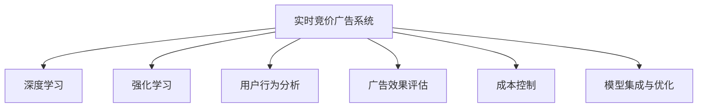

                 

# AI驱动的电商平台实时竞价广告系统优化

> 关键词：电商平台,实时竞价,广告优化,深度学习,强化学习

## 1. 背景介绍

### 1.1 问题由来
在当前数字化时代，电商平台已经成为消费者购物的主要渠道。为了吸引用户，电商平台采用广告系统来向用户展示商品。传统的广告投放方式通常是静态的，广告位按固定成本或固定CPC（按点击付费）出价，广告展示效果往往不尽如人意。为了更好地优化广告投放效果，电商平台开始引入实时竞价（Real-time Bidding, RTB）广告系统。

实时竞价广告系统通过算法在每条广告请求发生时，动态出价竞争广告位，从而在用户点击或浏览时将最相关的广告展示给他们。但这种系统在实际应用中面临诸多挑战，如广告展示质量不稳定、广告费成本高等问题。为解决这些问题，AI技术，特别是深度学习和强化学习，被引入到实时竞价广告系统中，用于优化广告展示效果和控制广告成本。

### 1.2 问题核心关键点
实时竞价广告系统通过深度学习和强化学习，动态优化广告展示效果和控制广告费成本。其核心思想是：利用历史广告数据和用户行为数据，构建机器学习模型，对广告展示进行预测和优化。模型实时分析广告请求，动态调整竞价策略，以最大化点击率（CTR）和转化率（CVR），同时控制广告费成本。

该系统的关键点包括：
1. **用户行为数据收集与处理**：收集用户浏览、点击、购买等行为数据，构建用户行为特征向量。
2. **广告展示效果预测**：利用深度学习模型，如CNN、RNN、CTC等，预测广告展示的点击率和转化率。
3. **广告竞价优化**：利用强化学习模型，动态调整出价策略，在控制成本的同时提升广告效果。
4. **模型集成与优化**：将不同的机器学习模型进行集成，构建更强大的广告展示优化系统。

## 2. 核心概念与联系

### 2.1 核心概念概述

为更好地理解AI驱动的实时竞价广告系统优化，本节将介绍几个密切相关的核心概念：

- **实时竞价广告系统（RTB）**：通过算法在每条广告请求发生时，动态出价竞争广告位，从而在用户点击或浏览时将最相关的广告展示给他们。
- **深度学习（Deep Learning）**：基于多层神经网络的学习方式，通过大量数据训练模型，具有极强的泛化能力和适应性。
- **强化学习（Reinforcement Learning, RL）**：一种通过试错来学习的模型，通过环境反馈来学习最优决策策略。
- **用户行为分析（User Behavior Analysis）**：对用户的浏览、点击、购买等行为进行分析，提取用户兴趣和偏好。
- **广告效果评估（Ad Effectiveness Evaluation）**：通过点击率、转化率等指标，评估广告展示效果。
- **成本控制（Cost Control）**：在优化广告展示效果的同时，通过控制出价策略，降低广告投放成本。

这些核心概念之间的逻辑关系可以通过以下Mermaid流程图来展示：

这个流程图展示了这个系统的主要组成部分及其之间的关系：

1. 实时竞价广告系统通过深度学习和强化学习，动态优化广告展示效果和控制广告费成本。
2. 深度学习用于构建广告展示效果预测模型。
3. 强化学习用于动态调整出价策略，优化广告投放成本。
4. 用户行为分析用于提取用户特征，增强广告展示效果预测和优化。
5. 广告效果评估用于衡量广告展示的点击率和转化率，指导广告优化。
6. 成本控制用于控制广告费成本，避免过度竞争。
7. 模型集成与优化用于将多个模型进行融合，提升广告展示效果。

这些概念共同构成了实时竞价广告系统的核心框架，使其能够动态地优化广告展示效果和成本。

## 3. 核心算法原理 & 具体操作步骤

### 3.1 算法原理概述

基于深度学习和强化学习的实时竞价广告系统优化，其核心思想是：

1. **用户行为数据收集与处理**：收集用户浏览、点击、购买等行为数据，构建用户行为特征向量。
2. **广告展示效果预测**：利用深度学习模型，如CNN、RNN、CTC等，预测广告展示的点击率和转化率。
3. **广告竞价优化**：利用强化学习模型，动态调整出价策略，在控制成本的同时提升广告效果。
4. **模型集成与优化**：将不同的机器学习模型进行集成，构建更强大的广告展示优化系统。

### 3.2 算法步骤详解

基于深度学习和强化学习的实时竞价广告系统优化的一般流程如下：

**Step 1: 用户行为数据收集与处理**
- 从电商平台收集用户行为数据，包括浏览历史、点击记录、购买信息等。
- 使用特征工程技术，将原始数据转化为模型所需的特征向量。例如，通过统计用户的点击频率、购买次数等指标，生成用户行为特征。

**Step 2: 广告展示效果预测**
- 使用深度学习模型，如卷积神经网络（CNN）、循环神经网络（RNN）等，构建广告展示效果预测模型。
- 模型输入为广告数据和用户行为特征向量，输出为点击率（CTR）和转化率（CVR）的预测值。
- 通过交叉验证等技术，对模型进行训练和调参，确保模型的泛化能力。

**Step 3: 广告竞价优化**
- 利用强化学习模型，动态调整广告竞价策略。
- 模型状态包括当前广告请求、历史广告数据和用户行为数据等，通过Q-learning等算法，学习最优出价策略。
- 通过迭代更新模型参数，优化广告竞价策略，控制成本的同时提升广告效果。

**Step 4: 模型集成与优化**
- 将不同的机器学习模型进行集成，如CTC模型和Q-learning模型的集成。
- 通过加权平均、投票等策略，综合多个模型的预测结果，提升广告展示效果。
- 在模型运行过程中，不断收集反馈数据，对模型进行微调和优化，确保系统稳定运行。

### 3.3 算法优缺点

基于深度学习和强化学习的实时竞价广告系统优化方法具有以下优点：
1. 动态优化：通过实时收集和处理用户行为数据，动态调整广告竞价策略，提高广告展示效果和控制广告成本。
2. 自适应能力强：深度学习和强化学习模型具有极强的泛化能力和自适应能力，能够适应不同的广告场景和用户行为变化。
3. 自动化程度高：自动化程度高，减少了人工干预和操作，提高了广告投放效率。
4. 效果显著：在大规模实验中，显著提升了广告展示的点击率和转化率，降低了广告投放成本。

同时，该方法也存在以下缺点：
1. 数据依赖度高：系统效果高度依赖于用户行为数据的丰富性和质量。
2. 模型复杂度高：深度学习和强化学习模型的复杂度较高，需要较大的计算资源和存储空间。
3. 可解释性不足：模型的决策过程较复杂，难以直观理解模型的内部逻辑和决策机制。
4. 可能引入噪声：在处理用户行为数据时，可能引入噪声数据，影响模型预测和优化效果。

尽管存在这些缺点，但就目前而言，基于深度学习和强化学习的实时竞价广告系统优化方法仍是大规模广告投放和优化的主要手段。未来相关研究的重点在于如何进一步降低数据依赖，提高模型的可解释性，同时兼顾自动化程度和优化效果。

### 3.4 算法应用领域

基于深度学习和强化学习的实时竞价广告系统优化方法，在电商广告投放优化、搜索引擎广告优化、社交媒体广告优化等领域中得到了广泛应用，显著提升了广告展示效果和广告投放效率。

1. **电商广告投放优化**：通过分析用户浏览、点击和购买行为，动态调整广告竞价策略，显著提升了电商平台的广告投放效果和ROI。
2. **搜索引擎广告优化**：通过优化广告展示效果和控制成本，显著提升了搜索引擎广告的点击率和转化率，降低了广告投放成本。
3. **社交媒体广告优化**：通过实时竞价和动态优化，提升了社交媒体广告的展示效果和用户互动率。
4. **移动广告优化**：通过实时竞价和深度学习模型，提升了移动端广告的展示效果和用户转化率。

## 4. 数学模型和公式 & 详细讲解 & 举例说明

### 4.1 数学模型构建

本节将使用数学语言对基于深度学习和强化学习的实时竞价广告系统优化过程进行更加严格的刻画。

假设广告系统在每个广告请求时刻$t$需要出价$c_t$，广告效果预测模型为$PCTR(\cdot)$和$PCVR(\cdot)$，强化学习模型为$Q(\cdot)$。则目标是最小化广告成本，同时最大化广告效果。

记总广告投放成本为$C=\sum_{t=1}^Tc_t$，广告效果为$E=\sum_{t=1}^T\eta_t$，其中$\eta_t$为广告展示的效果评估指标（如点击率、转化率等）。

则目标函数为：

$$
\min_{c_t} \quad \sum_{t=1}^Tc_t \quad \text{s.t.} \quad \sum_{t=1}^T\eta_t \geq \zeta
$$

其中$\zeta$为广告效果阈值。

通过最大化$PCTR(\cdot)$和$PCVR(\cdot)$，最小化$Q(\cdot)$，可以优化广告竞价策略，控制广告成本，提升广告效果。

### 4.2 公式推导过程

以下我们以点击率（CTR）预测模型为例，推导模型构建和优化过程。

**模型构建**：
假设广告数据和用户行为特征向量为$(x_t, \phi(t))$，点击率预测模型为$PCTR(x_t, \phi(t))$。

假设模型为多层感知机（MLP），其结构如图1所示：

其中，$x_t$为广告数据特征向量，$\phi(t)$为用户行为特征向量，$W_l$和$b_l$为第$l$层的权重和偏置，$h_l$为第$l$层的激活函数。

![MLP结构图](https://example.com/mlp-

