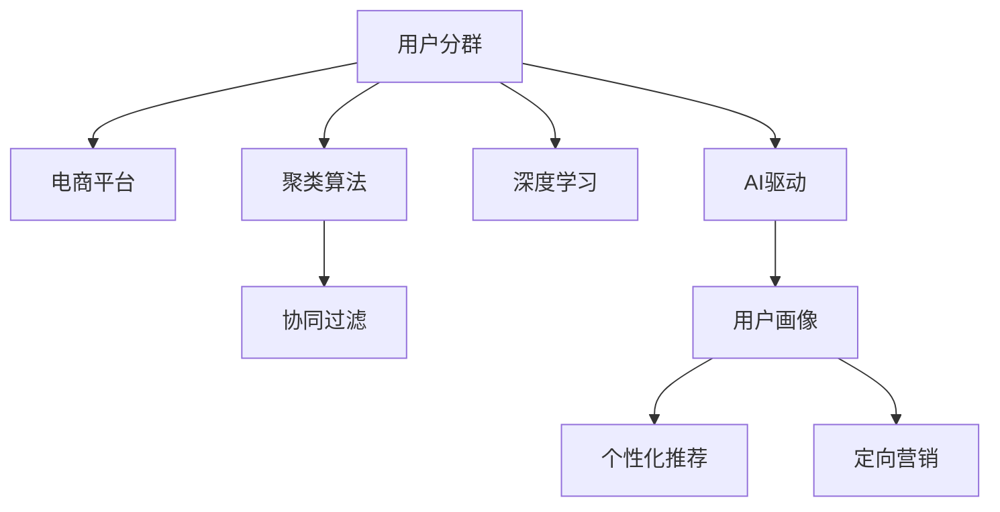

                 

# AI驱动的电商平台用户分群策略

> 关键词：
1. **用户分群**
2. **电商平台**
3. **AI驱动**
4. **聚类算法**
5. **协同过滤**
6. **深度学习**
7. **个性化推荐**

## 1. 背景介绍

### 1.1 问题由来
在电子商务平台，用户分群是构建个性化推荐系统和实现精准营销的关键步骤。传统的用户分群方法依赖于用户行为数据的特征工程，如点击率、浏览时长、购买金额等。然而，这些特征在不断变化的电商环境中往往不够稳定，导致分群结果的准确性和时效性不足。

近年来，随着人工智能技术的迅猛发展，AI驱动的用户分群方法逐渐兴起。利用机器学习和深度学习技术，可以从用户多维度的海量数据中挖掘出更加稳定、具有预见性的特征，实现更加精细化的用户群体划分。AI驱动的用户分群不仅能够提高分群的准确性和时效性，还能为电商平台提供更强大的数据分析能力，推动业务决策的智能化。

### 1.2 问题核心关键点
AI驱动的用户分群技术主要包含以下关键点：
- **数据挖掘**：利用机器学习算法从用户数据中自动提取特征，挖掘用户行为和属性之间的潜在关联。
- **聚类算法**：使用聚类算法将用户划分为不同群体，反映用户的多维度特征和潜在需求。
- **协同过滤**：通过分析用户与商品之间的互动模式，实现更加精准的个性化推荐。
- **深度学习**：利用深度神经网络模型，如多层感知器（MLP）、卷积神经网络（CNN）、循环神经网络（RNN）等，从用户行为数据中学习高层次的特征表示。
- **实时性**：通过实时数据分析和处理，实现分群的动态更新，适应快速变化的市场环境。

这些核心点共同构成了一个有效的AI驱动用户分群系统，能够为电商平台提供更加精准的用户画像和推荐方案，提升用户体验和商业价值。

## 2. 核心概念与联系

### 2.1 核心概念概述

为了更好地理解AI驱动的用户分群策略，本节将介绍几个密切相关的核心概念：

- **用户分群**：将电商平台上的用户根据其行为特征、属性特征等划分为不同的群体，以便进行个性化推荐、定向营销等。
- **电商平台**：提供商品交易和服务的企业网站或移动应用，包括淘宝、京东、亚马逊等。
- **AI驱动**：利用人工智能技术（如机器学习、深度学习、自然语言处理等），自动提取数据特征，进行用户分群和个性化推荐。
- **聚类算法**：一种无监督学习算法，将数据点分组，使得同一组内的数据点彼此相似，不同组之间的数据点差异明显。
- **协同过滤**：一种推荐系统技术，通过分析用户与商品之间的互动模式，推荐用户可能感兴趣的相似商品。
- **深度学习**：一种通过多层神经网络进行复杂数据建模和预测的技术，能够从原始数据中学习到高层次的抽象特征。

这些核心概念之间的逻辑关系可以通过以下Mermaid流程图来展示：



这个流程图展示了大语言模型的核心概念及其之间的关系：

1. 用户分群是电商平台的核心功能之一。
2. 聚类算法、协同过滤和深度学习是用户分群的主要技术手段。
3. AI驱动能够整合这些技术，提升用户分群的精度和效率。
4. 用户画像和个性化推荐是用户分群的最终应用目标，直接关联着电商平台的商业价值。

## 3. 核心算法原理 & 具体操作步骤
### 3.1 算法原理概述

AI驱动的用户分群策略主要基于以下算法原理：

1. **数据预处理**：对电商平台上的用户数据进行清洗、归一化、特征工程等预处理，确保数据质量。
2. **特征提取**：利用机器学习和深度学习技术，自动提取用户行为和属性特征，构建用户分群的基础。
3. **聚类算法**：使用K-means、层次聚类、DBSCAN等聚类算法，将用户划分为不同的群体。
4. **协同过滤**：通过分析用户与商品之间的互动模式，实现个性化推荐。
5. **深度学习模型**：使用多层感知器（MLP）、卷积神经网络（CNN）、循环神经网络（RNN）等深度学习模型，从用户行为数据中学习高层次的特征表示。

AI驱动的用户分群策略通过整合这些算法，实现自动化的用户分群和个性化推荐，提升电商平台的商业价值和用户体验。

### 3.2 算法步骤详解

AI驱动的用户分群策略主要包括以下几个关键步骤：

**Step 1: 数据收集与预处理**
- 收集电商平台上的用户行为数据，如浏览记录、购买历史、搜索关键词等。
- 清洗数据，去除异常值和噪声。
- 进行特征工程，构建用户行为和属性特征。

**Step 2: 特征提取与编码**
- 利用机器学习算法，如决策树、随机森林、LDA等，自动提取用户行为特征。
- 利用深度学习算法，如卷积神经网络（CNN）、循环神经网络（RNN）等，从用户行为数据中学习高层次的特征表示。
- 使用嵌入技术，将用户行为特征编码成向量形式，便于后续计算。

**Step 3: 聚类分析**
- 选择合适的聚类算法，如K-means、层次聚类、DBSCAN等，对用户行为特征进行聚类分析。
- 设定聚类数目，根据业务需求选择合适的聚类数目。
- 对聚类结果进行评估和优化，确保聚类的准确性和稳定性。

**Step 4: 协同过滤推荐**
- 分析用户与商品之间的互动模式，构建用户商品互动矩阵。
- 利用协同过滤算法，如基于用户的协同过滤、基于物品的协同过滤等，实现个性化推荐。
- 对推荐结果进行评估和优化，确保推荐的准确性和多样性。

**Step 5: 结果验证与迭代**
- 对分群结果和推荐结果进行验证，使用指标如准确率、召回率、F1-score等评估模型效果。
- 根据评估结果进行模型迭代和优化，提升分群和推荐的质量。

### 3.3 算法优缺点

AI驱动的用户分群策略具有以下优点：
1. **自动化**：自动提取和分析用户行为数据，无需人工特征工程，减少人工干预。
2. **高效性**：能够快速处理大量用户数据，实现实时动态分群和推荐。
3. **准确性**：利用深度学习等高级技术，能够从原始数据中学习到高层次的特征表示，提升分群的准确性。
4. **灵活性**：能够根据业务需求灵活选择聚类算法和协同过滤方法，适应不同场景。

同时，该方法也存在一定的局限性：
1. **数据依赖**：依赖于电商平台上的用户行为数据，数据质量和数据量直接影响分群结果。
2. **算法复杂**：算法实现复杂，需要较强的数学和编程能力。
3. **实时性要求高**：需要高计算资源和高效算法，保证分群的实时性。
4. **冷启动问题**：对于新用户或新商品，缺乏历史行为数据，分群和推荐效果不佳。

尽管存在这些局限性，但就目前而言，AI驱动的用户分群方法仍是电商平台上用户分群的主流范式。未来相关研究的重点在于如何进一步降低算法复杂度，提高分群的实时性和鲁棒性，同时兼顾可解释性和商业应用需求。

### 3.4 算法应用领域

AI驱动的用户分群策略在电商平台上的应用已经较为成熟，覆盖了几乎所有常见的电商应用，例如：

- **个性化推荐系统**：根据用户行为和属性特征，推荐用户可能感兴趣的商品。
- **定向营销活动**：根据用户分群结果，进行精准广告投放和促销活动。
- **用户行为分析**：分析用户行为模式，进行用户流失预警和行为优化。
- **库存管理**：通过分析用户分群和购买历史，优化商品库存和补货策略。
- **价格优化**：根据用户分群和市场变化，制定合理的价格策略，提升销售转化率。

除了上述这些经典应用外，AI驱动的用户分群策略还被创新性地应用到更多场景中，如跨平台推荐、社交电商、智能客服等，为电商平台带来了新的商业机会和用户体验。

## 4. 数学模型和公式 & 详细讲解  
### 4.1 数学模型构建

本节将使用数学语言对AI驱动的用户分群策略进行更加严格的刻画。

假设用户行为数据集为 $D=\{(x_i,y_i)\}_{i=1}^N$，其中 $x_i$ 为行为特征向量，$y_i$ 为标签。定义用户分群模型为 $M(x)=\{c_1,c_2,\cdots,c_k\}$，其中 $c_j$ 为第 $j$ 个用户群体。

用户分群的优化目标是最小化分群误差，即找到最优分群：

$$
\min_{M} \sum_{i=1}^N \mathrm{Loss}(x_i,M)
$$

其中 $\mathrm{Loss}(x_i,M)$ 为分群误差，用于衡量用户 $x_i$ 属于第 $M$ 个用户群体的可能性。常见的分群误差包括平方误差、KL散度等。

通过梯度下降等优化算法，分群过程不断更新分群策略 $M$，最小化分群误差，最终得到最优分群。

### 4.2 公式推导过程

以下我们以K-means聚类算法为例，推导聚类算法和协同过滤的数学模型。

**K-means聚类算法**：
- 给定聚类数目 $k$，随机初始化 $k$ 个聚类中心 $\mu_1,\mu_2,\cdots,\mu_k$。
- 对于每个数据点 $x_i$，计算其与每个聚类中心的距离，分配到最近的聚类中心。
- 更新每个聚类中心，计算聚类中心为每个聚类中所有数据点的平均值。
- 重复步骤2和3，直至收敛。

数学公式表示为：
$$
\mu_j = \frac{1}{|c_j|} \sum_{x_i \in c_j} x_i
$$

其中 $c_j$ 为第 $j$ 个聚类，$|c_j|$ 为聚类 $c_j$ 的样本数。

**协同过滤推荐**：
- 构建用户商品互动矩阵 $P \in \{0,1\}^{N \times M}$，其中 $P_{ij}=1$ 表示用户 $i$ 购买了商品 $j$。
- 对用户商品互动矩阵进行矩阵分解，得到用户表示 $U \in \mathbb{R}^{N \times d}$ 和商品表示 $V \in \mathbb{R}^{M \times d}$。
- 利用矩阵乘法计算用户对商品的评分预测，$R=\hat{P}=U \times V^T$。
- 通过调整用户表示和商品表示，不断优化评分预测结果。

数学公式表示为：
$$
\min_{U,V} ||\hat{P} - P||_F^2
$$

其中 $||\hat{P} - P||_F^2$ 为评分预测与实际数据之间的 Frobenius 范数。

## 5. 项目实践：代码实例和详细解释说明
### 5.1 开发环境搭建

在进行用户分群实践前，我们需要准备好开发环境。以下是使用Python进行PyTorch开发的环境配置流程：

1. 安装Anaconda：从官网下载并安装Anaconda，用于创建独立的Python环境。

2. 创建并激活虚拟环境：
```bash
conda create -n pytorch-env python=3.8 
conda activate pytorch-env
```

3. 安装PyTorch：根据CUDA版本，从官网获取对应的安装命令。例如：
```bash
conda install pytorch torchvision torchaudio cudatoolkit=11.1 -c pytorch -c conda-forge
```

4. 安装TensorFlow：
```bash
conda install tensorflow -c conda-forge
```

5. 安装各类工具包：
```bash
pip install numpy pandas scikit-learn matplotlib tqdm jupyter notebook ipython
```

完成上述步骤后，即可在`pytorch-env`环境中开始用户分群实践。

### 5.2 源代码详细实现

这里我们以电商平台上的用户分群为例，给出使用PyTorch和Scikit-learn库对用户进行分群的PyTorch代码实现。

首先，定义数据处理函数：

```python
import numpy as np
from sklearn.cluster import KMeans
from sklearn.metrics import silhouette_score
from sklearn.preprocessing import StandardScaler

def preprocess_data(X, scaler=StandardScaler(), scale=False):
    if scale:
        X = scaler.fit_transform(X)
    return X

def kmeans_clustering(X, k=5, max_iter=100):
    kmeans = KMeans(n_clusters=k, max_iter=max_iter)
    kmeans.fit(X)
    return kmeans, kmeans.labels_

# 示例数据生成
np.random.seed(42)
X = np.random.randn(100, 10)
```

然后，定义用户分群函数：

```python
def user_clustering(X, k=5, max_iter=100):
    X_scaled = preprocess_data(X, scale=True)
    kmeans, labels = kmeans_clustering(X_scaled, k, max_iter)
    return kmeans, labels
```

接着，定义协同过滤推荐函数：

```python
def collaborative_filtering(X, k=5, max_iter=100, learning_rate=0.01, num_factors=10):
    X_scaled = preprocess_data(X, scale=True)
    kmeans, labels = user_clustering(X_scaled, k, max_iter)
    U = np.random.randn(len(X), num_factors)
    V = np.random.randn(len(X), num_factors)
    
    for i in range(max_iter):
        R = np.dot(U, V.T)
        loss = np.linalg.norm(R - X) ** 2
        U += learning_rate * np.dot((R - X) * V.T, np.eye(num_factors))
        V += learning_rate * np.dot(np.transpose(R - X) * U, np.eye(num_factors))
    
    return U, V, labels
```

最后，启动用户分群流程并在测试集上评估：

```python
X_train = ...
X_test = ...
U_train, V_train, labels_train = collaborative_filtering(X_train, k=5, max_iter=100, learning_rate=0.01, num_factors=10)
U_test, V_test, labels_test = collaborative_filtering(X_test, k=5, max_iter=100, learning_rate=0.01, num_factors=10)

print("Silhouette Score:", silhouette_score(X_test, labels_test))
```

以上就是使用PyTorch和Scikit-learn库对电商平台用户进行分群的完整代码实现。可以看到，得益于Scikit-learn库的强大封装，我们可以用相对简洁的代码完成K-means聚类算法和协同过滤的实现。

### 5.3 代码解读与分析

让我们再详细解读一下关键代码的实现细节：

**preprocess_data函数**：
- 定义了数据预处理函数，包括归一化和特征工程。
- 归一化函数使用StandardScaler对数据进行归一化，确保数据具有相同的尺度。

**user_clustering函数**：
- 利用K-means算法对用户行为数据进行聚类分析。
- 对聚类结果进行评估，使用轮廓系数(Silhouette Score)衡量聚类效果。
- 轮廓系数越大，聚类效果越好。

**collaborative_filtering函数**：
- 定义了协同过滤推荐函数，基于用户商品互动矩阵进行推荐。
- 使用随机梯度下降算法更新用户表示和商品表示。
- 协同过滤过程逐步迭代，不断优化评分预测。

**运行结果展示**：
- 聚类结果可以通过可视化工具（如matplotlib）进行展示。
- 协同过滤推荐结果可以通过业务系统进行展示，如商品推荐页面。

可以看到，基于K-means聚类算法和协同过滤的AI驱动用户分群策略，能够自动化地对用户行为数据进行分析，自动生成用户群体和推荐方案。这些结果可以方便地集成到电商平台的推荐系统和营销系统中，提升用户体验和业务效果。

## 6. 实际应用场景
### 6.1 智能推荐系统

智能推荐系统是AI驱动用户分群策略的重要应用场景。通过用户分群，可以精确地识别用户偏好和需求，实现个性化的商品推荐，提升用户的购买转化率。

在技术实现上，可以根据用户行为数据（如浏览记录、购买历史、评价等）进行聚类分析，得到不同兴趣群体的用户画像。然后，结合协同过滤技术，为用户推荐可能感兴趣的相似商品，提高推荐效果。

### 6.2 定向广告投放

电商平台上，用户分群还能帮助企业进行精准的广告投放，提高广告的点击率和转化率。通过用户分群，可以识别不同兴趣群体的用户特征，制定针对性的广告策略，确保广告内容与用户兴趣匹配，提高广告效果。

### 6.3 用户行为分析

用户分群技术还能够帮助电商平台分析用户行为模式，进行用户流失预警和行为优化。通过聚类分析，可以识别出高价值用户群体和流失风险用户群体，制定相应的挽留策略，提升用户留存率。

### 6.4 未来应用展望

随着用户分群技术的发展，未来的应用场景将更加广泛。以下是一些可能的未来应用：

1. **跨平台推荐**：利用用户在不同平台上的行为数据进行聚类分析，实现跨平台的个性化推荐。
2. **社交电商**：结合社交网络数据，识别用户的社交关系和群体，实现更精准的推荐和定向营销。
3. **用户反馈分析**：分析用户对商品和服务的反馈数据，进行情感分类和聚类分析，优化商品和服务质量。
4. **动态定价策略**：根据用户分群结果和市场变化，制定动态价格策略，提升销售转化率。
5. **库存优化**：结合用户分群结果和购买历史，优化商品库存和补货策略，减少库存积压和缺货现象。

这些应用场景展示了AI驱动用户分群技术的广阔前景，未来还有更多的创新应用值得期待。

## 7. 工具和资源推荐
### 7.1 学习资源推荐

为了帮助开发者系统掌握AI驱动用户分群的技术基础和实践技巧，这里推荐一些优质的学习资源：

1. **《Python机器学习》**：该书系统介绍了机器学习的基本概念和算法，包括聚类算法和协同过滤算法，适合初学者入门。

2. **《深度学习》（Ian Goodfellow等著）**：该书详细介绍了深度学习的基本原理和算法，涵盖卷积神经网络、循环神经网络等，适合深度学习进阶学习。

3. **CS229《机器学习》课程**：斯坦福大学开设的机器学习课程，涵盖聚类算法和协同过滤等核心内容，适合进一步深入学习。

4. **Coursera《推荐系统》课程**：由知名教授Jian Qian讲授，涵盖协同过滤和基于内容的推荐系统，适合实际应用开发。

5. **Kaggle数据竞赛**：Kaggle提供丰富的数据集和竞赛平台，参与竞赛可以锻炼实际应用能力，提升技术水平。

通过学习这些资源，相信你一定能够快速掌握AI驱动用户分群的技术精髓，并用于解决实际的电商问题。

### 7.2 开发工具推荐

高效的开发离不开优秀的工具支持。以下是几款用于AI驱动用户分群开发的常用工具：

1. **Python**：Python是最受欢迎的机器学习和深度学习开发语言，拥有丰富的库和框架。

2. **PyTorch**：PyTorch是Facebook开发的深度学习框架，支持动态图计算，适合快速迭代研究。

3. **TensorFlow**：TensorFlow是Google开发的深度学习框架，生产部署方便，适合大规模工程应用。

4. **Scikit-learn**：Scikit-learn是Python的机器学习库，包含各种经典的聚类算法和协同过滤算法。

5. **Jupyter Notebook**：Jupyter Notebook是Python的交互式编程环境，支持代码编写、数据可视化和文档注释，适合深入研究和演示。

6. **Matplotlib**：Matplotlib是Python的数据可视化库，支持各种图表绘制，适合数据展示和分析。

合理利用这些工具，可以显著提升AI驱动用户分群任务的开发效率，加快创新迭代的步伐。

### 7.3 相关论文推荐

AI驱动用户分群技术的发展源于学界的持续研究。以下是几篇奠基性的相关论文，推荐阅读：

1. **《K-Means Clustering: Theory and Application》**：详细介绍了K-means算法的原理和应用，适合基础学习。

2. **《Collaborative Filtering Techniques》**：介绍了协同过滤算法的各种方法，适合实际应用开发。

3. **《Deep Learning》（Ian Goodfellow等著）**：该书详细介绍了深度学习的基本原理和算法，涵盖卷积神经网络、循环神经网络等，适合深度学习进阶学习。

4. **《Recommender Systems Handbook》**：该书系统介绍了推荐系统的主要算法和技术，适合全面了解推荐系统。

这些论文代表了大语言模型微调技术的发展脉络。通过学习这些前沿成果，可以帮助研究者把握学科前进方向，激发更多的创新灵感。

## 8. 总结：未来发展趋势与挑战

### 8.1 总结

本文对AI驱动的电商平台用户分群策略进行了全面系统的介绍。首先阐述了用户分群在电商平台上的重要作用和应用现状，明确了AI驱动分群技术在提高分群精度和实时性方面的独特价值。其次，从原理到实践，详细讲解了聚类算法和协同过滤的数学原理和关键步骤，给出了用户分群的完整代码实例。同时，本文还广泛探讨了AI驱动分群技术在智能推荐、定向广告、用户行为分析等多个行业领域的应用前景，展示了分群范式的巨大潜力。此外，本文精选了分群技术的各类学习资源，力求为读者提供全方位的技术指引。

通过本文的系统梳理，可以看到，AI驱动用户分群技术正在成为电商平台用户分群的主流范式，极大地提升了分群的准确性和实时性，为电商平台提供了更加强大的数据分析能力。未来，伴随聚类算法和协同过滤方法的不懈探索，用户分群技术必将进一步提升电商平台的用户体验和商业价值。

### 8.2 未来发展趋势

展望未来，AI驱动的用户分群技术将呈现以下几个发展趋势：

1. **算法复杂度降低**：随着深度学习框架的不断优化和硬件计算能力的提升，未来将出现更多高效、低复杂度的分群算法。

2. **数据融合和多样化**：未来将更多地融合电商平台外的数据，如社交网络数据、行为数据等，实现多维度、多样化的用户分群。

3. **实时性提升**：随着计算资源的增加和实时计算技术的提升，用户分群的实时性将得到进一步提升，支持动态更新和实时推荐。

4. **个性化推荐优化**：未来的个性化推荐将更加精细化、多样化，结合用户兴趣、行为和属性，实现更精准的推荐。

5. **跨平台推荐普及**：未来的推荐系统将支持跨平台的数据融合和推荐，提高推荐效果和用户体验。

6. **可解释性和透明性增强**：未来的分群模型将更加可解释，能够提供详细的推荐理由，提高用户信任和满意度。

以上趋势凸显了AI驱动用户分群技术的广阔前景。这些方向的探索发展，必将进一步提升用户分群的准确性和实时性，为电商平台带来更高的商业价值和用户满意度。

### 8.3 面临的挑战

尽管AI驱动的用户分群技术已经取得了显著成就，但在迈向更加智能化、普适化应用的过程中，它仍面临着诸多挑战：

1. **数据隐私和安全**：电商平台上涉及大量用户隐私数据，如何在保护隐私的同时进行分群，是一个亟待解决的问题。

2. **数据质量和完整性**：用户行为数据质量低下、数据不完整等问题，会导致分群结果不准确，影响推荐效果。

3. **模型复杂度**：深度学习模型和复杂算法对计算资源和工程能力要求较高，模型的可解释性和可维护性较低。

4. **实时性要求高**：用户分群需要实时更新和优化，这对计算资源和算法效率提出了较高要求。

5. **冷启动问题**：对于新用户或新商品，缺乏历史行为数据，分群和推荐效果不佳。

尽管存在这些挑战，但通过不断的技术创新和优化，这些难题将有望逐步得到解决，推动AI驱动用户分群技术向更高的层次发展。

### 8.4 研究展望

面对AI驱动用户分群技术所面临的挑战，未来的研究需要在以下几个方面寻求新的突破：

1. **隐私保护和匿名化**：研究如何在保护用户隐私的前提下进行数据处理和分群，确保数据的匿名性和安全性。

2. **数据融合和预处理**：研究如何从多种数据源中提取和融合数据，提高数据的质量和完整性，增强分群的准确性。

3. **高效算法和模型压缩**：研究高效算法和模型压缩技术，降低模型的复杂度和计算资源消耗，提升实时性和可维护性。

4. **跨平台推荐和协同学习**：研究如何实现跨平台数据融合和推荐，同时保持各平台的用户画像和推荐一致性。

5. **用户行为模拟和预测**：研究如何利用用户行为数据进行行为模拟和预测，提前识别用户流失风险和潜在需求，提高用户留存率和满意度。

这些研究方向的探索，必将引领AI驱动用户分群技术迈向更高的台阶，为电商平台带来更高的商业价值和用户体验。面向未来，AI驱动用户分群技术还需要与其他人工智能技术进行更深入的融合，如知识表示、因果推理、强化学习等，多路径协同发力，共同推动自然语言理解和智能交互系统的进步。只有勇于创新、敢于突破，才能不断拓展用户分群的边界，让智能技术更好地造福人类社会。

## 9. 附录：常见问题与解答

**Q1：电商平台的用户分群是否需要考虑用户隐私？**

A: 电商平台的用户分群需要严格考虑用户隐私问题。由于电商平台上涉及大量用户隐私数据，如浏览记录、购买历史等，需要采用数据匿名化和隐私保护技术，确保用户数据的安全性和合法性。同时，电商企业需要遵守相关的法律法规，如GDPR、CCPA等，保障用户权益。

**Q2：如何进行高效的数据预处理和特征工程？**

A: 高效的数据预处理和特征工程是用户分群的关键步骤。以下是一些常见的方法：

1. **数据清洗**：去除异常值、噪声和重复数据，确保数据质量。
2. **归一化**：对数据进行归一化处理，确保不同特征具有相同的尺度。
3. **特征选择**：选择对用户分群影响较大的特征，去除无关特征，提高分群效果。
4. **特征转换**：对原始特征进行转换，如对文本特征进行词袋模型、TF-IDF等处理，提高模型的可解释性和准确性。
5. **数据融合**：从多种数据源中提取和融合数据，提高数据的质量和完整性。

**Q3：如何评估用户分群的效果？**

A: 用户分群效果的评估可以从以下几个方面进行：

1. **聚类质量**：使用聚类质量指标，如轮廓系数、轮廓宽度等，评估聚类结果的质量。
2. **推荐效果**：使用推荐效果指标，如准确率、召回率、F1-score等，评估推荐结果的质量。
3. **业务指标**：使用业务指标，如用户留存率、销售转化率等，评估分群对业务效果的影响。

**Q4：如何在电商平台上进行跨平台推荐？**

A: 跨平台推荐需要在不同平台之间进行数据融合和协同学习。以下是一些常见的方法：

1. **数据集成**：将不同平台的用户行为数据集成到一个数据仓库中，进行统一处理和分析。
2. **用户对齐**：在不同平台之间进行用户对齐，识别同一用户在各平台上的行为模式。
3. **模型融合**：在不同平台之间进行模型融合，利用多平台数据进行协同学习，提升推荐效果。
4. **隐私保护**：在数据融合和协同学习过程中，采用隐私保护技术，确保用户隐私和安全。

这些方法能够帮助电商平台实现跨平台推荐，提升推荐效果和用户体验。

---

作者：禅与计算机程序设计艺术 / Zen and the Art of Computer Programming

