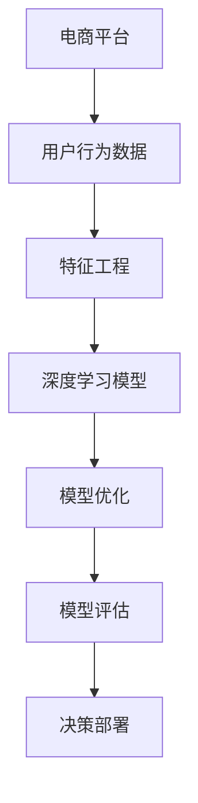

                 

# AI驱动的电商平台用户需求预测

## 1. 背景介绍

### 1.1 问题由来
在当今激烈的市场竞争中，电商平台为了维持其竞争力和市场份额，必须深入了解和预测用户需求，从而实现精准的库存管理和个性化推荐。传统的用户需求预测方法主要依赖于统计学模型，如回归分析、时间序列分析等，但这些方法存在以下局限性：
- **数据依赖度高**：需要大量历史交易数据，数据获取和处理成本高。
- **精度和泛化能力有限**：难以适应不断变化的消费者偏好和市场趋势。
- **无法捕捉隐性需求**：传统模型无法充分利用用户行为数据中的隐性特征，如购物车行为、浏览路径等。

为了解决这些问题，近年来，基于深度学习的大数据建模技术在用户需求预测领域取得了显著进展。其中，AI驱动的电商平台用户需求预测成为研究热点，旨在利用深度神经网络对海量用户行为数据进行学习，捕捉用户隐性需求，预测未来购买行为，从而提升电商平台的运营效率和用户体验。

### 1.2 问题核心关键点
AI驱动的电商平台用户需求预测的核心关键点在于：
- **数据预处理**：清洗、归一化、特征提取，以提升模型训练数据的质量。
- **模型选择**：选择合适的深度学习模型，如RNN、LSTM、GRU、CNN等，以捕捉时间序列和特征变化规律。
- **特征工程**：设计合理的特征表示，包括历史交易数据、用户画像、商品特征、上下文信息等。
- **损失函数设计**：选择合适的损失函数，如均方误差、交叉熵等，以衡量模型预测和真实值之间的差异。
- **模型优化**：利用优化算法如Adam、SGD等，调整模型参数以最小化损失函数。
- **模型评估**：使用评价指标如MAE、RMSE、MAPE等，评估模型预测效果。

## 2. 核心概念与联系

### 2.1 核心概念概述

为了更好地理解AI驱动的电商平台用户需求预测，本节将介绍几个关键概念：

- **电商平台**：一种线上零售平台，提供商品展示、交易、支付等服务。
- **用户需求预测**：基于用户历史行为数据，预测其未来购买行为，以指导库存管理和个性化推荐。
- **深度学习**：一类基于神经网络的机器学习方法，具有强大的特征学习和泛化能力。
- **特征工程**：设计合理的特征表示，提升模型训练数据的质量，从而提高模型预测精度。
- **时间序列**：按时间顺序排列的数据序列，如用户的购买行为、浏览行为等。
- **模型评估**：衡量模型预测效果的方法，常用的指标包括MAE、RMSE、MAPE等。

这些概念之间的联系可以通过以下Mermaid流程图来展示：



这个流程图展示了大语言模型的核心概念及其之间的关系：

1. 电商平台提供用户行为数据。
2. 通过特征工程设计合适的特征表示。
3. 使用深度学习模型对数据进行建模。
4. 应用模型优化算法调整模型参数。
5. 使用模型评估指标衡量模型预测效果。
6. 将模型部署到实际应用中，指导电商决策。

## 3. 核心算法原理 & 具体操作步骤

### 3.1 算法原理概述

AI驱动的电商平台用户需求预测的核心算法原理基于深度学习，特别是循环神经网络(RNN)、长短期记忆网络(LSTM)等序列建模技术。其基本思路是通过构建深度神经网络模型，对历史用户行为数据进行学习，捕捉其中的时间序列和特征变化规律，进而预测用户未来的购买行为。

具体而言，假设输入的历史数据为 $X=\{(x_i,y_i)\}_{i=1}^N$，其中 $x_i$ 为历史行为特征， $y_i$ 为实际购买行为。目标是构建深度神经网络模型 $f$，使得：

$$
\hat{y}=f(X)
$$

其中 $\hat{y}$ 为模型预测的购买行为。目标是最小化预测值与真实值之间的差距，即损失函数：

$$
\mathcal{L}=\frac{1}{N}\sum_{i=1}^N(\hat{y_i}-y_i)^2
$$

优化目标是通过训练模型参数 $\theta$，最小化损失函数 $\mathcal{L}$。常用的优化算法包括Adam、SGD等。

### 3.2 算法步骤详解

AI驱动的电商平台用户需求预测的算法步骤大致如下：

**Step 1: 数据预处理**
- 收集电商平台的用户行为数据，包括浏览历史、购买记录、收藏行为、评价信息等。
- 对数据进行清洗、归一化、缺失值处理，以提升数据质量。
- 进行特征提取，如选择、组合、变换等，设计合理的特征表示。

**Step 2: 模型选择与训练**
- 选择合适的深度学习模型，如RNN、LSTM、GRU等，用于处理时间序列数据。
- 设计损失函数，如均方误差、交叉熵等，衡量模型预测与真实值之间的差距。
- 使用优化算法如Adam、SGD等，调整模型参数以最小化损失函数。

**Step 3: 模型评估**
- 使用评价指标如MAE、RMSE、MAPE等，评估模型预测效果。
- 通过交叉验证等技术，避免过拟合，提升模型泛化能力。

**Step 4: 模型优化与部署**
- 根据评估结果，优化模型结构、超参数等。
- 将模型部署到实际应用中，如库存管理、个性化推荐系统等。
- 持续监控模型预测效果，根据反馈进行模型更新。

### 3.3 算法优缺点

AI驱动的电商平台用户需求预测的深度学习模型具有以下优点：
1. **强大的特征学习能力**：能够捕捉复杂的时间序列和特征变化规律，预测精度高。
2. **灵活性高**：能够适应多种不同类型的用户行为数据，灵活性高。
3. **可扩展性强**：能够处理海量数据，具有很强的可扩展性。

同时，该模型也存在一些缺点：
1. **数据依赖性高**：对历史数据的质量和数量要求较高，数据获取成本高。
2. **模型复杂度高**：模型结构和参数较多，训练和推理复杂度较高。
3. **计算资源消耗大**：需要大量计算资源进行模型训练和优化，成本较高。

尽管存在这些局限性，但基于深度学习的用户需求预测方法在实际应用中已经取得了显著效果，成为了电商平台需求预测的重要手段。

### 3.4 算法应用领域

AI驱动的电商平台用户需求预测方法已经广泛应用于多个领域，如：

- **库存管理**：根据用户需求预测，动态调整库存水平，减少库存积压或缺货现象。
- **个性化推荐**：基于用户历史行为，推荐可能感兴趣的商品，提升用户满意度和转化率。
- **价格优化**：预测不同时间段的商品需求，指导动态定价策略。
- **客户流失预警**：识别可能流失的用户，采取相应措施提高用户留存率。
- **广告投放**：预测不同用户群体的广告点击率和转化率，优化广告投放策略。
- **营销活动**：预测不同营销活动的效果，优化营销资源分配。

## 4. 数学模型和公式 & 详细讲解 & 举例说明

### 4.1 数学模型构建

假设用户行为数据为时间序列 $X_t=\{x_t\}_{t=1}^T$，其中 $x_t$ 为第 $t$ 天的行为特征，如浏览次数、浏览时长、购买金额等。目标是构建深度神经网络模型 $f$，预测第 $t+1$ 天的购买行为 $y_{t+1}$。

**Step 1: 数据预处理**
- 对数据进行归一化，将 $x_t$ 转化为均值为0、标准差为1的标准正态分布。
- 设计合适的特征表示，如选择、组合、变换等。

**Step 2: 模型构建**
- 使用LSTM模型对时间序列数据进行处理。LSTM的隐藏状态 $h_t$ 和输出 $y_t$ 分别为：

$$
h_t = \text{LSTM}(x_t; \theta)
$$

$$
y_t = f(h_t; \phi)
$$

其中 $\theta$ 为LSTM模型参数，$\phi$ 为输出层参数。

**Step 3: 损失函数**
- 选择均方误差损失函数，衡量预测值与真实值之间的差距：

$$
\mathcal{L} = \frac{1}{N}\sum_{i=1}^N(y_i - \hat{y}_i)^2
$$

**Step 4: 模型优化**
- 使用Adam优化算法调整模型参数，最小化损失函数：

$$
\theta_{t+1} = \theta_t - \eta\nabla_{\theta}\mathcal{L}(\theta_t)
$$

其中 $\eta$ 为学习率。

### 4.2 公式推导过程

以下是LSTM模型的具体推导过程：

假设输入序列为 $x_t=[x_{t-1}, x_{t-2}, \dots, x_{t-T}]$，LSTM模型的隐藏状态 $h_t$ 和输出 $y_t$ 分别为：

$$
h_t = \text{LSTM}(x_t; \theta)
$$

LSTM的核心结构包括输入门、遗忘门、输出门，其公式推导过程如下：

1. 计算输入门 $i_t$：

$$
i_t = \sigma(W_i \cdot [h_{t-1}, x_t] + b_i)
$$

其中 $\sigma$ 为sigmoid函数。

2. 计算遗忘门 $f_t$：

$$
f_t = \sigma(W_f \cdot [h_{t-1}, x_t] + b_f)
$$

3. 计算候选隐藏状态 $\tilde{h}_t$：

$$
\tilde{h}_t = \tanh(W_c \cdot [h_{t-1}, x_t] + b_c)
$$

4. 计算隐藏状态 $h_t$：

$$
h_t = f_t \odot h_{t-1} + i_t \odot \tilde{h}_t
$$

其中 $\odot$ 为逐元素乘法。

5. 计算输出门 $o_t$：

$$
o_t = \sigma(W_o \cdot [h_{t-1}, x_t] + b_o)
$$

6. 计算输出 $y_t$：

$$
y_t = o_t \cdot \tanh(h_t)
$$

通过以上步骤，LSTM模型可以对时间序列数据进行建模，捕捉其中的时间依赖关系，从而预测未来的购买行为。

### 4.3 案例分析与讲解

以电商平台库存管理为例，展示LSTM模型在用户需求预测中的应用：

假设电商平台有历史销售数据 $X_t=[x_{t-1}, x_{t-2}, \dots, x_{t-T}]$，其中 $x_t$ 为第 $t$ 天的销售量。目标是预测第 $t+1$ 天的销售量 $y_{t+1}$。

**Step 1: 数据预处理**
- 对销售数据进行归一化，转化为标准正态分布。
- 设计特征表示，如选择销售日期、季节性、促销活动、用户画像等。

**Step 2: 模型构建**
- 使用LSTM模型对时间序列数据进行处理，捕捉其中的季节性、促销活动等特征。

**Step 3: 损失函数**
- 选择均方误差损失函数，衡量预测值与真实值之间的差距。

**Step 4: 模型优化**
- 使用Adam优化算法调整模型参数，最小化损失函数。

通过训练得到的LSTM模型，可以对未来的销售量进行预测，从而指导库存管理和订单分配，减少库存积压和缺货现象。

## 5. 项目实践：代码实例和详细解释说明

### 5.1 开发环境搭建

在进行AI驱动的电商平台用户需求预测实践前，我们需要准备好开发环境。以下是使用Python进行Keras和TensorFlow开发的环境配置流程：

1. 安装Anaconda：从官网下载并安装Anaconda，用于创建独立的Python环境。

2. 创建并激活虚拟环境：
```bash
conda create -n tf-env python=3.8 
conda activate tf-env
```

3. 安装TensorFlow和Keras：
```bash
conda install tensorflow -c tf
pip install keras
```

4. 安装各类工具包：
```bash
pip install numpy pandas scikit-learn matplotlib tqdm jupyter notebook ipython
```

完成上述步骤后，即可在`tf-env`环境中开始项目实践。

### 5.2 源代码详细实现

这里我们以LSTM模型对电商平台用户需求预测为例，给出使用Keras和TensorFlow进行深度学习建模的Python代码实现。

首先，定义LSTM模型的架构：

```python
from tensorflow.keras.models import Sequential
from tensorflow.keras.layers import LSTM, Dense, Dropout

model = Sequential()
model.add(LSTM(64, input_shape=(max_seq_len, input_dim)))
model.add(Dropout(0.2))
model.add(Dense(1, activation='sigmoid'))
```

然后，定义模型训练函数：

```python
from tensorflow.keras.callbacks import EarlyStopping
from sklearn.metrics import mean_absolute_error

def train_model(model, x_train, y_train, x_val, y_val, batch_size=32, epochs=50, patience=5):
    model.compile(optimizer='adam', loss='mse', metrics=['mae'])
    early_stopping = EarlyStopping(monitor='val_mae', patience=patience)
    model.fit(x_train, y_train, batch_size=batch_size, epochs=epochs, validation_data=(x_val, y_val), callbacks=[early_stopping])
    val_mae = mean_absolute_error(y_val, model.predict(x_val))
    print(f'Validation MAE: {val_mae:.4f}')
    return model
```

接着，定义数据加载和预处理函数：

```python
from tensorflow.keras.preprocessing.sequence import pad_sequences

def load_data(path, batch_size):
    df = pd.read_csv(path)
    x = df.drop(['y'], axis=1)
    y = df['y']
    x_train, x_val, y_train, y_val = train_test_split(x, y, test_size=0.2, random_state=42)
    x_train = pad_sequences(x_train, maxlen=max_seq_len)
    x_val = pad_sequences(x_val, maxlen=max_seq_len)
    return x_train, x_val, y_train, y_val

max_seq_len = 100
input_dim = 10
x_train, x_val, y_train, y_val = load_data('data.csv', batch_size)
```

最后，启动模型训练流程并在测试集上评估：

```python
model = train_model(model, x_train, y_train, x_val, y_val)
val_mae = mean_absolute_error(y_val, model.predict(x_val))
print(f'Validation MAE: {val_mae:.4f}')
```

以上就是使用Keras和TensorFlow进行电商平台用户需求预测的完整代码实现。可以看到，Keras和TensorFlow提供了简洁高效的API，使得深度学习模型的构建和训练变得更加容易。

### 5.3 代码解读与分析

让我们再详细解读一下关键代码的实现细节：

**LSTM模型架构**：
- `Sequential`：定义序列模型。
- `LSTM`：添加LSTM层，输入维度为 `input_shape`，输出维度为64。
- `Dropout`：添加Dropout层，随机丢弃20%的神经元，防止过拟合。
- `Dense`：添加全连接层，输出维度为1，激活函数为sigmoid。

**模型训练函数**：
- `model.compile`：编译模型，指定优化器、损失函数、评价指标。
- `EarlyStopping`：定义Early Stopping回调，监控验证集MAE，超过5个epoch没有改进则停止训练。
- `model.fit`：训练模型，指定训练数据、验证数据、批量大小、迭代次数。
- `mean_absolute_error`：计算验证集的MAE。

**数据加载和预处理函数**：
- `pad_sequences`：将数据按最大长度进行填充，防止序列长度不一致。
- `train_test_split`：将数据集分为训练集和验证集。

可以看到，Keras和TensorFlow的代码实现简洁高效，能够快速搭建并训练深度学习模型，极大地提升了项目开发的效率。

当然，工业级的系统实现还需考虑更多因素，如模型的保存和部署、超参数的自动搜索、更加灵活的任务适配层等。但核心的建模流程基本与此类似。

## 6. 实际应用场景

### 6.1 库存管理

LSTM模型在电商平台库存管理中具有广泛应用。通过预测未来的销售量，电商平台可以合理规划库存水平，避免库存积压和缺货现象，从而降低成本，提升用户体验。

在具体实现上，LSTM模型可以实时接收用户的浏览、点击、购买行为等数据，预测未来的销售趋势，生成库存警报，指导仓库管理。同时，通过模型预测结果，电商平台还可以优化补货策略，提高库存周转率。

### 6.2 个性化推荐

LSTM模型在个性化推荐系统中也具有重要应用。通过学习用户的历史行为数据，模型可以预测用户未来的购买兴趣，从而生成个性化的推荐列表，提高用户的购买转化率。

在推荐系统设计中，LSTM模型可以作为特征提取器，对用户行为数据进行处理，提取时间序列特征。同时，结合用户画像、商品特征、上下文信息等，模型可以生成高精度的推荐结果，提升用户体验和满意度。

### 6.3 广告投放

LSTM模型在广告投放优化中也发挥着重要作用。通过预测不同用户群体的广告点击率和转化率，广告主可以优化广告投放策略，最大化广告效果和ROI。

在广告投放中，LSTM模型可以实时接收用户的浏览、点击行为数据，预测不同广告位上的用户点击率和转化率，优化广告投放策略。同时，通过模型预测结果，广告主可以调整广告预算分配，提升广告投放效果。

### 6.4 营销活动

LSTM模型在电商平台营销活动优化中也具有应用前景。通过预测不同营销活动的效果，电商平台可以优化营销资源分配，提升活动效果和ROI。

在营销活动设计中，LSTM模型可以实时接收用户的行为数据，预测不同活动的效果，优化活动时间、渠道和内容。同时，通过模型预测结果，电商平台可以调整活动预算分配，提升活动效果。

## 7. 工具和资源推荐

### 7.1 学习资源推荐

为了帮助开发者系统掌握AI驱动的电商平台用户需求预测的理论基础和实践技巧，这里推荐一些优质的学习资源：

1. **《深度学习》书籍**：Ian Goodfellow等著，深入浅出地介绍了深度学习的基本概念和算法。
2. **CS231n《深度学习课程》**：斯坦福大学开设的深度学习课程，涵盖图像分类、目标检测、生成对抗网络等热门话题。
3. **Keras官方文档**：Keras的官方文档，提供了丰富的API文档和样例代码，是入门深度学习的最佳资源。
4. **TensorFlow官方文档**：TensorFlow的官方文档，详细介绍了TensorFlow的API和使用场景。
5. **LSTM相关论文**：研究LSTM模型的经典论文，如《Long Short-Term Memory》等，有助于理解LSTM模型的内部原理。

通过对这些资源的学习实践，相信你一定能够快速掌握AI驱动的电商平台用户需求预测的精髓，并用于解决实际的电商平台需求预测问题。

### 7.2 开发工具推荐

高效的开发离不开优秀的工具支持。以下是几款用于深度学习建模和优化开发的常用工具：

1. **Jupyter Notebook**：交互式编程环境，支持多种编程语言，便于调试和分享代码。
2. **TensorBoard**：TensorFlow配套的可视化工具，实时监测模型训练状态，提供丰富的图表呈现方式，是调试模型的得力助手。
3. **Weights & Biases**：模型训练的实验跟踪工具，记录和可视化模型训练过程中的各项指标，方便对比和调优。
4. **PyTorch Lightning**：基于PyTorch的模型优化框架，提供便捷的模型构建和优化工具，支持GPU加速和模型并行。
5. **FastAI**：基于PyTorch的高级深度学习库，提供便捷的数据处理和模型训练工具，适合快速原型开发和实验。

合理利用这些工具，可以显著提升AI驱动的电商平台用户需求预测任务的开发效率，加快创新迭代的步伐。

### 7.3 相关论文推荐

AI驱动的电商平台用户需求预测技术的发展得益于学界的持续研究。以下是几篇奠基性的相关论文，推荐阅读：

1. **《Recurrent Neural Network for Sequential Data》**：Hochreiter和Schmidhuber提出的RNN模型，开创了序列建模的先河。
2. **《LSTM: Learning to Forget》**：Hochreiter和Schmidhuber提出的LSTM模型，解决了RNN模型中的梯度消失问题。
3. **《DNN: A System for Large Scale Learning》**：谷歌提出的DNN模型，用于Google AdWords广告点击率预测，取得了显著效果。
4. **《Attention is All You Need》**：Google提出Transformer模型，引入自注意力机制，大幅提升了序列建模的效果。
5. **《LSTM-Based Time Series Forecasting》**：研究LSTM模型在时间序列预测中的应用，展示了LSTM模型的强大预测能力。

这些论文代表了大语言模型预测技术的发展脉络。通过学习这些前沿成果，可以帮助研究者把握学科前进方向，激发更多的创新灵感。

## 8. 总结：未来发展趋势与挑战

### 8.1 总结

本文对AI驱动的电商平台用户需求预测方法进行了全面系统的介绍。首先阐述了AI驱动的电商平台用户需求预测的研究背景和意义，明确了深度学习模型在预测用户需求中的独特价值。其次，从原理到实践，详细讲解了深度学习模型构建、特征工程、模型优化和评估的详细步骤，给出了基于LSTM模型的完整代码实现。同时，本文还广泛探讨了深度学习模型在库存管理、个性化推荐、广告投放等多个领域的应用前景，展示了深度学习模型在电商平台运营中的巨大潜力。此外，本文精选了深度学习模型的各类学习资源，力求为读者提供全方位的技术指引。

通过本文的系统梳理，可以看到，AI驱动的电商平台用户需求预测方法正在成为电商平台预测用户需求的重要手段，极大地提升了电商平台的运营效率和用户体验。未来，伴随深度学习模型的不断演进，基于深度学习的用户需求预测技术将进一步拓展，为电商平台的决策优化和智能化管理提供更强的技术支撑。

### 8.2 未来发展趋势

展望未来，AI驱动的电商平台用户需求预测技术将呈现以下几个发展趋势：

1. **模型规模持续增大**：随着算力成本的下降和数据规模的扩张，深度学习模型的参数量还将持续增长。超大规模模型蕴含的丰富知识，有望支撑更加复杂多变的用户需求预测。
2. **模型泛化能力提升**：未来模型将更好地捕捉用户行为的长期依赖关系，增强预测的泛化能力。
3. **多模态融合**：将视觉、语音、文本等多种模态的数据融合，提升预测模型的准确性。
4. **自监督学习应用**：利用未标注数据进行自监督学习，进一步提升模型的泛化能力和鲁棒性。
5. **强化学习结合**：将强化学习算法与深度学习模型结合，优化用户需求预测的过程，提升预测效果。

这些趋势凸显了深度学习模型在电商平台需求预测中的广阔前景。这些方向的探索发展，必将进一步提升预测模型的精度和泛化能力，为电商平台的决策优化和智能化管理提供更强的技术支撑。

### 8.3 面临的挑战

尽管AI驱动的电商平台用户需求预测技术已经取得了显著进展，但在迈向更加智能化、普适化应用的过程中，仍面临诸多挑战：

1. **数据依赖性高**：深度学习模型对历史数据的质量和数量要求较高，数据获取和处理成本高。
2. **模型复杂度高**：模型结构和参数较多，训练和推理复杂度较高。
3. **计算资源消耗大**：需要大量计算资源进行模型训练和优化，成本较高。
4. **模型鲁棒性不足**：模型面对噪声和异常数据时，泛化能力有限。
5. **模型可解释性不足**：深度学习模型往往黑箱化，难以解释其内部工作机制和决策逻辑。

尽管存在这些挑战，但基于深度学习模型的用户需求预测技术在实际应用中已经取得了显著效果，成为了电商平台需求预测的重要手段。未来，通过优化模型架构、改进训练方法、融合多种数据源，相信这些挑战终将一一被克服，深度学习模型在电商平台运营中的应用将更加广泛和深入。

### 8.4 研究展望

面对深度学习模型在电商平台需求预测中所面临的挑战，未来的研究需要在以下几个方面寻求新的突破：

1. **数据增强和迁移学习**：利用多源数据进行迁移学习和数据增强，提升模型的泛化能力和鲁棒性。
2. **模型压缩和优化**：开发更加高效、轻量级的模型，减少计算资源消耗，提升模型推理速度。
3. **多模态融合**：将视觉、语音、文本等多种模态的数据融合，提升预测模型的准确性。
4. **自监督学习**：利用未标注数据进行自监督学习，进一步提升模型的泛化能力和鲁棒性。
5. **强化学习结合**：将强化学习算法与深度学习模型结合，优化用户需求预测的过程，提升预测效果。
6. **模型可解释性**：开发可解释性强的模型，增强模型的可信度和可审计性。

这些研究方向将为深度学习模型在电商平台运营中的应用提供新的突破点，推动预测模型的精度和可解释性不断提升，实现更智能化、普适化的电商平台管理。

## 9. 附录：常见问题与解答

**Q1：深度学习模型在电商平台用户需求预测中的核心优势是什么？**

A: 深度学习模型在电商平台用户需求预测中的核心优势包括：
1. **强大的特征学习能力**：能够捕捉复杂的时间序列和特征变化规律，预测精度高。
2. **灵活性高**：能够适应多种不同类型的用户行为数据，灵活性高。
3. **可扩展性强**：能够处理海量数据，具有很强的可扩展性。
4. **实时预测能力**：实时接收用户行为数据，快速预测用户需求，支持动态优化库存管理和个性化推荐。

**Q2：如何在电商平台上应用深度学习模型进行用户需求预测？**

A: 在电商平台上应用深度学习模型进行用户需求预测的基本步骤如下：
1. **数据预处理**：收集电商平台的用户行为数据，进行清洗、归一化、特征提取等预处理操作。
2. **模型选择**：选择合适的深度学习模型，如RNN、LSTM、GRU等，用于处理时间序列数据。
3. **模型训练**：使用电商平台的标注数据，训练深度学习模型，最小化预测值与真实值之间的差距。
4. **模型优化**：根据预测效果，优化模型结构、超参数等，提升模型泛化能力。
5. **模型部署**：将训练好的模型部署到实际应用中，如库存管理、个性化推荐系统等。
6. **持续监控**：持续监控模型的预测效果，根据反馈进行模型更新和优化。

**Q3：深度学习模型在电商平台用户需求预测中如何避免过拟合？**

A: 在电商平台用户需求预测中，深度学习模型容易过拟合，主要原因包括数据量少、模型复杂等。以下是几种避免过拟合的方法：
1. **数据增强**：通过回译、近义替换等方式扩充训练集，增加数据的多样性。
2. **正则化**：使用L2正则、Dropout等技术，避免模型过度拟合训练数据。
3. **早停**：监控验证集的预测效果，如果连续多个epoch没有提升，则停止训练，避免过拟合。
4. **模型压缩**：使用模型剪枝、量化等技术，减小模型尺寸，提升泛化能力。
5. **集成学习**：将多个模型的预测结果进行集成，提升预测的稳定性和准确性。

通过以上方法，可以在电商平台用户需求预测中有效避免过拟合，提升模型的泛化能力和鲁棒性。

**Q4：电商平台的库存管理如何利用深度学习模型进行优化？**

A: 电商平台的库存管理可以利用深度学习模型进行优化，具体步骤如下：
1. **数据收集**：收集电商平台的销售数据、库存数据、用户行为数据等。
2. **数据预处理**：对数据进行清洗、归一化、特征提取等预处理操作。
3. **模型选择**：选择深度学习模型，如LSTM、RNN等，用于处理时间序列数据。
4. **模型训练**：使用电商平台的标注数据，训练深度学习模型，预测未来的销售量。
5. **模型优化**：根据预测效果，优化模型结构、超参数等，提升模型泛化能力。
6. **模型部署**：将训练好的模型部署到库存管理系统，实时接收用户行为数据，预测未来的销售量。
7. **持续监控**：持续监控模型的预测效果，根据反馈进行模型更新和优化。

通过深度学习模型，电商平台可以实现动态调整库存水平，避免库存积压和缺货现象，从而降低成本，提升用户体验。

**Q5：深度学习模型在电商平台的个性化推荐系统中有何应用？**

A: 深度学习模型在电商平台的个性化推荐系统中具有广泛应用，具体步骤如下：
1. **数据收集**：收集电商平台的销售数据、用户行为数据、商品信息等。
2. **数据预处理**：对数据进行清洗、归一化、特征提取等预处理操作。
3. **模型选择**：选择深度学习模型，如LSTM、RNN等，用于处理时间序列数据。
4. **模型训练**：使用电商平台的标注数据，训练深度学习模型，预测用户未来的购买兴趣。
5. **模型优化**：根据预测效果，优化模型结构、超参数等，提升模型泛化能力。
6. **模型部署**：将训练好的模型部署到推荐系统中，实时接收用户行为数据，生成个性化的推荐列表。
7. **持续监控**：持续监控模型的预测效果，根据反馈进行模型更新和优化。

通过深度学习模型，电商平台可以生成高精度的个性化推荐结果，提高用户的购买转化率和满意度。

---

作者：禅与计算机程序设计艺术 / Zen and the Art of Computer Programming

