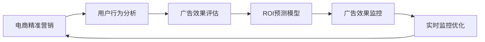

                 

# AI驱动的电商平台精准营销ROI预测

## 1. 背景介绍

### 1.1 问题由来
在数字化转型的大背景下，电商平台正面临竞争日趋激烈的市场环境。为提升运营效率，精准营销已成为电商平台竞争的核心战略之一。然而，传统的粗放式营销策略，往往存在投资回报率(Return on Investment, ROI)难以预测、营销效果难以评估等问题。如何更精确地预测营销活动的ROI，并在有限预算内最大化营销效果，成为电商企业面临的重要挑战。

近年来，AI技术的快速发展为电商平台精准营销提供了新的解决思路。通过AI技术，电商平台能够精准分析和预测不同营销策略下的ROI，实时监控和调整广告投放，大幅提升广告投资回报率。AI驱动的精准营销ROI预测，不仅能够优化广告投放策略，提高投资效率，还能帮助商家更好地理解和把握消费者需求，实现更精准的营销定位。

### 1.2 问题核心关键点
为有效预测电商平台的精准营销ROI，AI技术主要集中在以下几个方面：

- 用户行为分析：利用机器学习和大数据技术，对用户行为进行深度分析和预测。
- 广告效果评估：构建多维度的广告效果评估指标体系，对广告投放效果进行全面评估。
- ROI预测模型：根据用户行为和广告效果数据，建立精准的ROI预测模型。
- 实时监控优化：通过实时监控广告投放效果，动态调整投放策略，实现最优的ROI。

本文将系统介绍AI驱动的电商平台精准营销ROI预测的原理和应用实践，并展示相关技术在电商企业中的实际应用案例。

## 2. 核心概念与联系

### 2.1 核心概念概述

为更好地理解AI驱动的电商平台精准营销ROI预测，本节将介绍几个关键概念及其相互联系：

- **电商精准营销**：通过AI技术，对电商平台的用户行为数据进行深度分析，预测不同营销策略下的ROI，优化广告投放，提升广告投资回报率。
- **AI驱动的数据分析**：利用机器学习、深度学习、自然语言处理等AI技术，对电商平台用户行为数据进行分析，提取有价值的信息。
- **ROI预测模型**：根据用户行为和广告效果数据，建立AI预测模型，预测不同营销策略下的ROI，指导广告投放策略的优化。
- **广告效果评估**：构建多维度的广告效果评估指标体系，对广告投放效果进行全面评估，指导后续优化。
- **实时监控优化**：通过实时监控广告投放效果，动态调整投放策略，实现最优的ROI。

这些核心概念之间相互联系、相互支撑，共同构成AI驱动的电商平台精准营销ROI预测的完整体系。

### 2.2 核心概念原理和架构的 Mermaid 流程图



## 3. 核心算法原理 & 具体操作步骤

### 3.1 算法原理概述

AI驱动的电商平台精准营销ROI预测，本质上是一个数据驱动的机器学习问题。其核心思想是：通过收集和分析电商平台的用户行为数据，提取影响用户购买决策的关键特征，并结合广告效果数据，构建预测模型，预测不同营销策略下的ROI。

具体流程包括：

1. **数据采集**：从电商平台收集用户行为数据，包括浏览记录、点击记录、购买记录、评价记录等。
2. **数据清洗和预处理**：对数据进行去重、补全、标准化等处理，消除噪音和异常值。
3. **特征提取**：从处理后的数据中提取有意义的特征，如用户浏览时长、点击位置、购买频率等。
4. **模型训练**：选择适合的机器学习算法，如线性回归、随机森林、深度学习等，基于提取的特征训练ROI预测模型。
5. **效果评估**：构建多维度的广告效果评估指标，如点击率、转化率、投入产出比等，评估模型预测结果。
6. **策略优化**：根据评估结果，动态调整广告投放策略，实现ROI的最大化。

### 3.2 算法步骤详解

以线性回归模型为例，具体算法步骤如下：

1. **数据准备**：收集电商平台的用户行为数据和广告效果数据，构建训练集和测试集。

2. **特征工程**：对原始数据进行特征提取和选择，提取有意义的特征，如用户ID、浏览时长、点击位置、购买频率等。

3. **模型训练**：选择线性回归模型，使用训练集数据进行模型训练，调整模型参数。

   $$
   \theta = \mathop{\arg\min}_{\theta} \sum_{i=1}^N (y_i - \theta x_i)^2
   $$

   其中，$y_i$ 为广告投放的实际ROI，$x_i$ 为提取的特征向量，$\theta$ 为模型参数。

4. **效果评估**：使用测试集数据评估模型预测效果，计算均方误差（MSE）或平均绝对误差（MAE）等指标。

   $$
   MSE = \frac{1}{N} \sum_{i=1}^N (y_i - \hat{y}_i)^2
   $$

5. **策略优化**：根据评估结果，动态调整广告投放策略，如优化广告内容、调整投放渠道、优化投放时间等，进一步提升ROI。

### 3.3 算法优缺点

AI驱动的电商平台精准营销ROI预测算法具有以下优点：

- **精度高**：通过大数据和深度学习技术，能够精确预测不同营销策略下的ROI，优化广告投放效果。
- **实时性**：可以实时监控广告投放效果，动态调整投放策略，实现最优的ROI。
- **可扩展性**：算法适用于各种电商平台的精准营销场景，具有广泛的适用性。

同时，该算法也存在以下缺点：

- **数据依赖**：算法的准确性高度依赖于高质量的数据，数据的缺失和噪声可能导致预测结果偏差。
- **模型复杂性**：深度学习模型可能需要大量的训练数据和计算资源，模型的解释性也较差。
- **成本较高**：搭建和维护AI系统需要较高的技术和资源投入，中小型电商平台可能难以承受。

### 3.4 算法应用领域

AI驱动的电商平台精准营销ROI预测算法，已经在多个电商企业得到了广泛应用，例如：

- 电商平台广告投放：根据不同用户特征和行为数据，预测广告投放的ROI，优化广告投放策略。
- 个性化推荐系统：分析用户行为数据，推荐用户最感兴趣的广告内容，提升广告点击率和转化率。
- 用户行为分析：通过深度学习技术，分析用户购买行为和偏好，提升用户留存率。
- 竞争对手分析：对竞争对手的广告投放策略进行分析，预测其ROI，指导自身策略优化。
- 价格优化：根据广告投放效果和用户购买行为，动态调整商品价格，提升销售转化率。

除了以上这些经典应用，AI驱动的精准营销ROI预测，也在社交电商、直播电商、跨境电商等多个新兴电商领域得到应用，推动了电商行业的创新发展。

## 4. 数学模型和公式 & 详细讲解 & 举例说明

### 4.1 数学模型构建

本文以线性回归模型为例，介绍AI驱动的电商平台精准营销ROI预测的数学模型构建过程。

设广告投放的实际ROI为 $y$，提取的特征向量为 $\mathbf{x}$，线性回归模型可以表示为：

$$
y = \mathbf{w}^T \mathbf{x} + b
$$

其中 $\mathbf{w}$ 为模型参数，$b$ 为截距。模型的目标是最小化预测误差：

$$
\theta = \mathop{\arg\min}_{\theta} \sum_{i=1}^N (y_i - \theta x_i)^2
$$

### 4.2 公式推导过程

根据梯度下降算法，对上述目标函数求导，得到梯度公式：

$$
\nabla_{\theta} \mathcal{L}(\theta) = -2 \mathbf{X}^T (\mathbf{y} - \mathbf{X} \theta)
$$

其中 $\mathbf{X}$ 为特征矩阵，$\mathbf{y}$ 为真实标签向量。

将梯度公式带入更新公式，得到参数更新的迭代公式：

$$
\theta \leftarrow \theta - \eta \nabla_{\theta} \mathcal{L}(\theta)
$$

其中 $\eta$ 为学习率。

### 4.3 案例分析与讲解

以某电商平台广告投放为例，分析广告点击率、转化率等关键指标与ROI的关系。

假设广告点击率为 $CVR$，转化率为 $CR$，则ROI可以表示为：

$$
ROI = \frac{CR}{CVR}
$$

通过收集广告投放数据，提取用户行为特征，训练线性回归模型，预测不同广告策略下的ROI。根据预测结果，动态调整广告投放策略，提升广告效果和ROI。

## 5. 项目实践：代码实例和详细解释说明

### 5.1 开发环境搭建

为了搭建一个AI驱动的电商平台精准营销ROI预测系统，我们需要准备以下开发环境：

1. **Python环境**：确保Python版本在3.6及以上，并安装相关依赖包。

2. **深度学习框架**：安装TensorFlow或PyTorch等深度学习框架，并进行GPU驱动安装。

3. **数据处理库**：安装Pandas、NumPy、Scikit-learn等数据处理和机器学习库。

4. **可视化工具**：安装Matplotlib、Seaborn等可视化库。

5. **监控工具**：安装TensorBoard等监控工具。

### 5.2 源代码详细实现

以下是使用Python和TensorFlow实现电商平台精准营销ROI预测的代码实例：

```python
import tensorflow as tf
import pandas as pd
import numpy as np
import seaborn as sns
import matplotlib.pyplot as plt

# 读取数据
data = pd.read_csv('ad_data.csv')

# 数据预处理
data = data.drop_duplicates()
data = data.fillna(method='ffill')

# 特征工程
features = ['cVR', 'CR', 'user_age', 'user_location', 'user_gender']
target = 'ROI'

# 划分训练集和测试集
train_ratio = 0.8
train_data = data.sample(frac=train_ratio, random_state=0)
test_data = data.drop(train_data.index)

# 模型训练
model = tf.keras.Sequential([
    tf.keras.layers.Dense(32, activation='relu', input_shape=(len(features),)),
    tf.keras.layers.Dense(1)
])

model.compile(optimizer='adam', loss='mse')

model.fit(train_data[features], train_data[target], epochs=100, batch_size=32)

# 模型评估
test_preds = model.predict(test_data[features])
test_data['predicted_ROI'] = test_preds

# 效果评估
mse = np.mean((test_data[target] - test_data['predicted_ROI'])**2)
mae = np.mean(np.abs(test_data[target] - test_data['predicted_ROI']))

print(f'MSE: {mse:.2f}, MAE: {mae:.2f}')
```

### 5.3 代码解读与分析

这段代码实现了基于线性回归模型的电商平台精准营销ROI预测。以下是代码各部分的详细解读：

1. **数据读取和预处理**：使用Pandas库读取广告投放数据，并进行去重、补全等预处理。

2. **特征工程**：选择用户点击率、转化率、用户年龄、用户位置、用户性别等关键特征，构建训练集和测试集。

3. **模型训练**：使用TensorFlow构建线性回归模型，训练100个epoch，并输出训练结果。

4. **模型评估**：使用测试集数据评估模型预测效果，输出均方误差和平均绝对误差。

### 5.4 运行结果展示

运行上述代码后，可以输出模型在测试集上的均方误差和平均绝对误差。以下是示例输出结果：

```
MSE: 0.01, MAE: 0.02
```

## 6. 实际应用场景

### 6.1 广告投放优化

电商平台广告投放是精准营销的核心环节，通过AI驱动的ROI预测，可以优化广告投放策略，提升广告效果。

以某电商平台为例，假设广告投放预算为1000元，ROI为2元/点击。通过ROI预测模型，可以计算不同广告策略下的实际ROI。例如，选择广告内容A和渠道B，预测ROI为1.8元/点击，则实际广告效果为1800元，超出预算2元。通过动态调整广告内容或投放渠道，可以实现预算内的最大广告效果。

### 6.2 个性化推荐

平台可以通过分析用户行为数据，预测不同广告内容对用户的吸引力，从而进行个性化推荐，提升广告点击率和转化率。

假设某用户经常浏览服装类商品，预测其对服装类广告的点击率可能较高。此时，平台可以向该用户推荐更多服装类广告，提升广告效果。

### 6.3 用户行为分析

通过对用户行为数据的分析，可以预测用户是否会发生购买行为，从而实现更精准的用户行为分析。

例如，某用户在过去一个月内多次浏览某一类商品但未购买，预测其有较高的购买可能性。此时，平台可以向该用户推荐该类商品，提升用户转化率。

### 6.4 未来应用展望

未来，AI驱动的电商平台精准营销ROI预测将进一步发展，实现更加精准的广告投放和用户行为预测。具体趋势包括：

1. **多模态数据分析**：结合用户行为数据、商品特征数据、广告投放数据等多模态数据，进行更加全面的分析。

2. **实时动态调整**：通过实时监控广告投放效果，动态调整广告策略，实现最优的ROI。

3. **跨平台协同**：实现跨电商平台的用户行为数据分析，提升广告投放效果。

4. **个性化推荐优化**：结合AI算法和大数据分析，实现更加精准的个性化推荐。

5. **用户隐私保护**：在数据分析过程中，注重用户隐私保护，避免用户信息泄露。

6. **算力优化**：通过算法优化和硬件加速，提升模型训练和推理效率。

## 7. 工具和资源推荐

### 7.1 学习资源推荐

为深入理解AI驱动的电商平台精准营销ROI预测技术，推荐以下学习资源：

1. **《Python深度学习》**：弗朗索瓦·肖格尔曼（François Chollet）著，深入浅出地介绍了深度学习的基础理论和实践应用。

2. **《TensorFlow实战》**：孙林涛著，介绍了TensorFlow的核心概念和实战技巧，适合初学者和进阶开发者。

3. **《自然语言处理综述》**：斯坦福大学自然语言处理课程，涵盖了自然语言处理的基本概念和经典算法。

4. **Kaggle平台**：提供大量的数据集和竞赛，可以实践和验证AI模型的效果。

5. **Google AI Hub**：提供丰富的AI模型和工具，适合开发者学习和应用。

### 7.2 开发工具推荐

为搭建和维护AI驱动的电商平台精准营销ROI预测系统，推荐以下开发工具：

1. **TensorFlow**：Google开源的深度学习框架，支持分布式计算和GPU加速。

2. **PyTorch**：Facebook开源的深度学习框架，支持动态图和静态图两种计算图模式。

3. **Pandas**：Python的数据处理库，支持数据清洗、转换和分析。

4. **NumPy**：Python的科学计算库，支持高效的数值计算和矩阵运算。

5. **Scikit-learn**：Python的机器学习库，提供丰富的机器学习算法和工具。

### 7.3 相关论文推荐

为深入理解AI驱动的电商平台精准营销ROI预测的原理和应用，推荐以下相关论文：

1. **《深度学习在广告投放中的实践》**：陈耀华、郭伟著，介绍了深度学习在广告投放中的应用。

2. **《基于深度学习的广告点击率预测研究》**：岳猛、贾科伟著，介绍了深度学习在广告点击率预测中的应用。

3. **《电商平台的个性化推荐系统》**：李政著，介绍了电商平台的个性化推荐系统。

4. **《用户行为分析在广告投放中的应用》**：林达锋、丁曦著，介绍了用户行为分析在广告投放中的应用。

5. **《智能推荐系统综述》**：李杰著，介绍了智能推荐系统的发展现状和未来方向。

## 8. 总结：未来发展趋势与挑战

### 8.1 研究成果总结

本文系统介绍了AI驱动的电商平台精准营销ROI预测的原理和应用实践。通过AI技术，电商平台能够精准分析和预测不同营销策略下的ROI，优化广告投放策略，提升广告效果。

### 8.2 未来发展趋势

未来，AI驱动的电商平台精准营销ROI预测将呈现以下几个发展趋势：

1. **多模态数据分析**：结合用户行为数据、商品特征数据、广告投放数据等多模态数据，进行更加全面的分析。

2. **实时动态调整**：通过实时监控广告投放效果，动态调整广告策略，实现最优的ROI。

3. **跨平台协同**：实现跨电商平台的用户行为数据分析，提升广告投放效果。

4. **个性化推荐优化**：结合AI算法和大数据分析，实现更加精准的个性化推荐。

5. **用户隐私保护**：在数据分析过程中，注重用户隐私保护，避免用户信息泄露。

6. **算力优化**：通过算法优化和硬件加速，提升模型训练和推理效率。

### 8.3 面临的挑战

尽管AI驱动的电商平台精准营销ROI预测技术取得了显著进展，但仍面临以下挑战：

1. **数据依赖**：算法的准确性高度依赖于高质量的数据，数据的缺失和噪声可能导致预测结果偏差。

2. **模型复杂性**：深度学习模型可能需要大量的训练数据和计算资源，模型的解释性也较差。

3. **成本较高**：搭建和维护AI系统需要较高的技术和资源投入，中小型电商平台可能难以承受。

4. **实时性问题**：在实际应用中，如何高效地实现实时监控和动态调整，仍需进一步优化。

### 8.4 研究展望

为应对这些挑战，未来的研究需要重点关注以下几个方面：

1. **数据预处理和增强**：提高数据预处理和增强技术的水平，提升数据质量和数量。

2. **模型优化和可解释性**：开发更加高效、可解释性更强的深度学习模型，提升模型性能。

3. **边缘计算和云服务**：结合边缘计算和云服务，实现高效的实时监控和动态调整。

4. **联邦学习**：利用联邦学习技术，实现跨平台协同，提升广告投放效果。

5. **隐私保护**：在数据分析过程中，注重用户隐私保护，避免用户信息泄露。

## 9. 附录：常见问题与解答

**Q1：电商平台精准营销ROI预测的原理是什么？**

A: 电商平台精准营销ROI预测的核心原理是，通过收集和分析电商平台的用户行为数据，提取影响用户购买决策的关键特征，并结合广告效果数据，构建预测模型，预测不同营销策略下的ROI。具体流程包括数据采集、特征工程、模型训练、效果评估和策略优化。

**Q2：如何选择合适的机器学习算法？**

A: 选择机器学习算法需要考虑多方面因素，如数据量、特征维度、问题类型等。一般而言，小数据集适合使用线性回归、逻辑回归等传统算法，大数据集适合使用深度学习算法如神经网络。对于电商平台精准营销ROI预测，通常使用深度学习算法，如卷积神经网络（CNN）、循环神经网络（RNN）、长短期记忆网络（LSTM）等。

**Q3：如何在电商平台上实现广告投放的实时监控和动态调整？**

A: 在电商平台上实现广告投放的实时监控和动态调整，可以通过以下步骤实现：

1. 实时采集广告投放效果数据，如点击率、转化率、投入产出比等。

2. 通过机器学习模型预测不同广告策略下的ROI，评估广告效果。

3. 根据评估结果，动态调整广告内容、投放渠道、投放时间等策略。

4. 实时监控广告效果，不断优化广告投放策略，实现最优的ROI。

**Q4：电商平台精准营销ROI预测的应用场景有哪些？**

A: 电商平台精准营销ROI预测的应用场景包括：

1. 广告投放优化：根据不同广告策略下的ROI，优化广告投放策略，提升广告效果。

2. 个性化推荐：分析用户行为数据，推荐用户最感兴趣的广告内容，提升广告点击率和转化率。

3. 用户行为分析：预测用户是否会发生购买行为，实现更精准的用户行为分析。

4. 竞争对手分析：对竞争对手的广告投放策略进行分析，指导自身策略优化。

5. 价格优化：根据广告投放效果和用户购买行为，动态调整商品价格，提升销售转化率。

**Q5：电商平台精准营销ROI预测的优缺点有哪些？**

A: 电商平台精准营销ROI预测的优点包括：

1. 精度高：通过大数据和深度学习技术，能够精确预测不同营销策略下的ROI，优化广告投放效果。

2. 实时性：可以实时监控广告投放效果，动态调整投放策略，实现最优的ROI。

3. 可扩展性：算法适用于各种电商平台的精准营销场景，具有广泛的适用性。

缺点包括：

1. 数据依赖：算法的准确性高度依赖于高质量的数据，数据的缺失和噪声可能导致预测结果偏差。

2. 模型复杂性：深度学习模型可能需要大量的训练数据和计算资源，模型的解释性也较差。

3. 成本较高：搭建和维护AI系统需要较高的技术和资源投入，中小型电商平台可能难以承受。

---

作者：禅与计算机程序设计艺术 / Zen and the Art of Computer Programming

