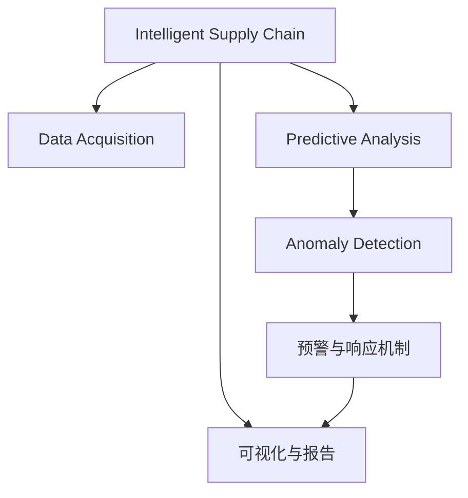

                 

# AI驱动的电商智能供应链风险预警与管理系统

> 关键词：电商智能供应链, 风险预警系统, 人工智能, 供应链管理, 预测分析, 预警算法, 异常检测

## 1. 背景介绍

### 1.1 问题由来

随着全球电商市场的迅猛发展，企业面临着供应链管理的复杂性和不确定性日益增加。供应链中涉及的生产、仓储、运输、库存、订单等多个环节，任何一个环节出现异常都可能引发严重的运营风险，导致损失。然而，由于供应链的复杂性，传统的监控和预警方法难以全面覆盖各环节的风险，导致预警及时性和准确性不足。

近年来，随着AI技术，特别是机器学习和深度学习技术在各行各业的应用，为智能供应链风险预警与管理带来了新的可能性。AI技术能够处理和分析大量数据，发现异常模式和风险因素，从而提高供应链管理的智能化水平。本文将介绍基于AI驱动的智能供应链风险预警与管理系统，探索如何在电商领域中应用这些技术，实现供应链风险的早期预警和智能管理。

### 1.2 问题核心关键点

智能供应链风险预警与管理系统，基于AI技术的预测分析和异常检测算法，对供应链中的各个环节进行实时监控，预测可能出现的风险，并给出及时预警。核心关键点包括：

1. **数据采集与整合**：采集供应链各个环节的数据，包括生产状态、库存水平、运输进度、订单状态等，通过数据清洗和整合，构建统一的数据仓库。
2. **预测分析模型**：使用机器学习和深度学习模型，对供应链数据进行建模和分析，预测未来的供应链状态和风险。
3. **异常检测算法**：通过AI算法检测供应链中的异常情况，如库存不足、运输延误、订单取消等，并及时发出预警。
4. **预警与响应机制**：根据预警结果，启动相应的应急响应机制，如调整生产计划、增加库存、调整物流等，确保供应链的稳定运行。
5. **可视化与报告**：提供实时的供应链状态和风险预警报告，帮助管理层进行决策和调整。

这些关键点共同构成了智能供应链风险预警与管理系统的核心功能，旨在提升电商供应链的智能化水平，减少运营风险，提高运营效率。

## 2. 核心概念与联系

### 2.1 核心概念概述

为更好地理解基于AI驱动的智能供应链风险预警与管理系统，本节将介绍几个密切相关的核心概念：

- **智能供应链**：利用AI技术对供应链进行智能监控、预测和决策的系统，旨在提高供应链的效率、稳定性和可靠性。
- **风险预警系统**：基于AI技术的系统，通过分析供应链数据，预测可能出现的风险，并及时发出预警。
- **预测分析**：使用机器学习、深度学习等算法，对历史和实时数据进行建模和分析，预测未来趋势和异常。
- **异常检测**：通过AI算法，从供应链数据中识别出异常情况，如库存不足、运输延误等。
- **预警与响应机制**：根据异常检测结果，自动触发应急响应措施，如调整生产计划、增加库存等。
- **可视化与报告**：将供应链状态和风险预警结果以图表、报告等形式展示，便于管理层进行决策。

这些核心概念之间的逻辑关系可以通过以下Mermaid流程图来展示：



这个流程图展示了这个系统的核心概念及其之间的关系：

1. 智能供应链通过数据采集得到供应链数据。
2. 预测分析模型对数据进行建模，预测未来的供应链状态。
3. 异常检测算法识别供应链中的异常情况。
4. 预警与响应机制根据异常检测结果触发应急响应。
5. 可视化与报告将预警结果呈现给管理层，辅助决策。

## 3. 核心算法原理 & 具体操作步骤
### 3.1 算法原理概述

基于AI驱动的智能供应链风险预警与管理系统，本质上是一个基于机器学习和深度学习的预测和异常检测系统。其核心思想是：通过分析供应链中的历史和实时数据，使用AI模型预测未来的供应链状态和风险，并使用异常检测算法检测供应链中的异常情况，最后根据异常检测结果触发相应的预警和响应机制。

形式化地，假设供应链数据为 $D=\{(x_i,y_i)\}_{i=1}^N$，其中 $x_i$ 为供应链数据，$y_i$ 为未来供应链状态或风险标签。预测分析模型的目标是找到最优模型 $M_{\theta}$，使得：

$$
M_{\theta} = \mathop{\arg\min}_{\theta} \mathcal{L}(M_{\theta},D)
$$

其中 $\mathcal{L}$ 为预测模型在数据集上的损失函数，用于衡量模型预测输出与真实标签之间的差异。常见的损失函数包括均方误差、交叉熵等。

异常检测算法则是识别出供应链数据中的异常样本，通常使用基于统计的方法、基于距离的方法或基于机器学习的方法。异常检测算法的目标是最小化误报率和漏报率，即识别出真正的异常样本，同时避免将正常样本误判为异常。

预警与响应机制则根据异常检测结果，自动执行相应的应急措施，如调整生产计划、增加库存等。这些措施的具体执行方式可以根据企业的具体情况进行调整。

### 3.2 算法步骤详解

基于AI驱动的智能供应链风险预警与管理系统，一般包括以下几个关键步骤：

**Step 1: 数据采集与预处理**
- 从供应链的各个环节采集数据，如生产状态、库存水平、运输进度、订单状态等。
- 对采集到的数据进行清洗、去重、标准化等预处理，构建统一的数据仓库。

**Step 2: 构建预测模型**
- 选择合适的机器学习或深度学习模型，如随机森林、LSTM、BERT等，对供应链数据进行建模。
- 使用历史数据训练预测模型，并使用验证集进行模型评估和参数调优。

**Step 3: 异常检测**
- 使用基于统计的方法、基于距离的方法或基于机器学习的方法，对供应链数据进行异常检测。
- 设计合适的异常检测算法，设定异常阈值，避免误报和漏报。

**Step 4: 预警与响应**
- 根据异常检测结果，启动相应的应急响应机制，如调整生产计划、增加库存等。
- 设计预警与响应流程，确保预警信息的及时传递和有效执行。

**Step 5: 可视化与报告**
- 将供应链状态和风险预警结果以图表、报告等形式展示。
- 提供决策支持，帮助管理层进行供应链的优化和调整。

### 3.3 算法优缺点

基于AI驱动的智能供应链风险预警与管理系统，具有以下优点：

1. **高效率**：通过自动化处理数据，实时预测和检测供应链风险，提高供应链管理的效率。
2. **高精度**：使用先进机器学习和深度学习算法，提高预测和异常检测的准确性。
3. **灵活性**：可以根据不同的供应链场景和需求，灵活调整预测和检测算法。
4. **及时响应**：系统能够及时发现风险并发出预警，帮助企业快速应对，减少损失。

然而，该系统也存在一些局限性：

1. **数据依赖性**：系统的性能很大程度上取决于供应链数据的准确性和完整性。
2. **模型复杂性**：预测和异常检测模型复杂，需要大量的数据和计算资源进行训练和调优。
3. **误报和漏报**：异常检测算法需要设定合适的阈值，避免误报和漏报。
4. **成本高**：系统开发和维护成本较高，需要专业的AI技术团队支持。

尽管存在这些局限性，但就目前而言，基于AI驱动的智能供应链风险预警与管理系统仍是一种高效、可靠的供应链管理手段。

### 3.4 算法应用领域

智能供应链风险预警与管理系统在多个领域均有应用，如：

1. **电商供应链**：监控和预警电商物流、库存、订单等环节的风险，提高供应链效率。
2. **制造业供应链**：预测和检测生产计划、库存水平、供应链中断等风险，提高生产效率和质量。
3. **零售供应链**：监测和预警商品库存、订单处理、门店管理等风险，提升客户满意度。
4. **农业供应链**：监控和预警农产品生产、运输、销售等环节的风险，保障食品安全。

除了上述这些领域外，该系统还被创新性地应用到更多场景中，如金融供应链风险评估、医疗供应链监控等，为供应链管理带来了新的思路和方法。

## 4. 数学模型和公式 & 详细讲解  
### 4.1 数学模型构建

本节将使用数学语言对基于AI驱动的智能供应链风险预警与管理系统进行更加严格的刻画。

假设供应链数据为 $D=\{(x_i,y_i)\}_{i=1}^N$，其中 $x_i$ 为供应链数据，$y_i$ 为未来供应链状态或风险标签。

定义供应链数据 $x$ 的预测模型为 $M_{\theta}(x)$，其中 $\theta$ 为模型参数。模型 $M_{\theta}(x)$ 的预测结果为 $\hat{y}$，预测误差为 $e$。则预测模型的损失函数为：

$$
\mathcal{L}(\theta) = \frac{1}{N} \sum_{i=1}^N e_i^2
$$

其中 $e_i = y_i - M_{\theta}(x_i)$。

异常检测算法通常使用统计方法或机器学习方法，如基于孤立森林、基于深度学习的异常检测算法。假设异常检测算法的输出为 $z$，则异常检测模型的损失函数为：

$$
\mathcal{L}(z) = \frac{1}{N} \sum_{i=1}^N \ell(z_i, y_i)
$$

其中 $\ell$ 为异常检测模型的损失函数，通常为交叉熵损失。

异常检测算法的目标是最大化准确性，即最小化误报率和漏报率。可以使用ROC曲线、AUC等指标评估异常检测算法的性能。

## 5. 项目实践：代码实例和详细解释说明
### 5.1 开发环境搭建

在进行项目实践前，我们需要准备好开发环境。以下是使用Python进行PyTorch开发的环境配置流程：

1. 安装Anaconda：从官网下载并安装Anaconda，用于创建独立的Python环境。

2. 创建并激活虚拟环境：
```bash
conda create -n pytorch-env python=3.8 
conda activate pytorch-env
```

3. 安装PyTorch：根据CUDA版本，从官网获取对应的安装命令。例如：
```bash
conda install pytorch torchvision torchaudio cudatoolkit=11.1 -c pytorch -c conda-forge
```

4. 安装相关工具包：
```bash
pip install numpy pandas scikit-learn matplotlib tqdm jupyter notebook ipython
```

完成上述步骤后，即可在`pytorch-env`环境中开始项目实践。

### 5.2 源代码详细实现

下面我们以基于LSTM模型的电商供应链风险预警与管理系统为例，给出使用PyTorch代码实现。

首先，定义供应链数据预处理函数：

```python
import pandas as pd
from sklearn.preprocessing import MinMaxScaler

def preprocess_data(data):
    # 数据清洗和去重
    data = data.dropna()
    data = data.drop_duplicates()
    
    # 数据标准化
    scaler = MinMaxScaler(feature_range=(0, 1))
    scaled_data = scaler.fit_transform(data)
    
    return scaled_data
```

然后，定义LSTM模型的预测函数：

```python
import torch.nn as nn
import torch

class LSTM(nn.Module):
    def __init__(self, input_size, hidden_size, output_size):
        super(LSTM, self).__init__()
        self.hidden_size = hidden_size
        self.lstm = nn.LSTM(input_size, hidden_size)
        self.fc = nn.Linear(hidden_size, output_size)
    
    def forward(self, x):
        batch_size, seq_len = x.shape
        hidden = (torch.zeros(1, batch_size, self.hidden_size), torch.zeros(1, batch_size, self.hidden_size))
        outputs = []
        for t in range(seq_len):
            lstm_out, hidden = self.lstm(x[:, t, :], hidden)
            outputs.append(self.fc(lstm_out[:, -1, :]))
        outputs = torch.stack(outputs, dim=1)
        return outputs

# 初始化LSTM模型
input_size = 10
hidden_size = 64
output_size = 1
model = LSTM(input_size, hidden_size, output_size)
model.to(device)

# 定义优化器和损失函数
optimizer = torch.optim.Adam(model.parameters(), lr=0.001)
loss_fn = nn.MSELoss()
```

接着，定义训练和评估函数：

```python
from sklearn.metrics import mean_absolute_error

def train_epoch(model, data_loader, optimizer):
    model.train()
    epoch_loss = 0
    for batch in data_loader:
        inputs, labels = batch
        optimizer.zero_grad()
        outputs = model(inputs)
        loss = loss_fn(outputs, labels)
        loss.backward()
        optimizer.step()
        epoch_loss += loss.item()
    return epoch_loss / len(data_loader)

def evaluate(model, data_loader):
    model.eval()
    preds = []
    labels = []
    with torch.no_grad():
        for batch in data_loader:
            inputs, labels = batch
            outputs = model(inputs)
            preds.append(outputs.numpy())
            labels.append(labels.numpy())
    preds = np.concatenate(preds)
    labels = np.concatenate(labels)
    mae = mean_absolute_error(labels, preds)
    print(f'Mean Absolute Error: {mae:.2f}')
```

最后，启动训练流程并在测试集上评估：

```python
epochs = 100
batch_size = 32

for epoch in range(epochs):
    loss = train_epoch(model, data_loader_train, optimizer)
    print(f'Epoch {epoch+1}, train loss: {loss:.4f}')
    
    print(f'Epoch {epoch+1}, test results:')
    evaluate(model, data_loader_test)
    
print('Training Complete')
```

以上就是使用PyTorch对LSTM模型进行电商供应链风险预警与管理系统开发的完整代码实现。可以看到，得益于PyTorch的强大封装，我们能够用相对简洁的代码实现LSTM模型的训练和评估。

### 5.3 代码解读与分析

让我们再详细解读一下关键代码的实现细节：

**preprocess_data函数**：
- 数据清洗和去重：使用Pandas的`dropna`和`drop_duplicates`方法。
- 数据标准化：使用Scikit-learn的`MinMaxScaler`方法，将数据缩放到[0, 1]的范围内。

**LSTM模型类**：
- 定义LSTM模型的输入、隐藏层和输出大小。
- 使用PyTorch的LSTM和全连接层定义模型结构。
- 在`forward`方法中，使用循环展开计算LSTM的输出，并通过全连接层预测未来的供应链状态。

**train_epoch函数**：
- 在每个epoch中，循环遍历训练集中的所有批次。
- 在每个批次上，前向传播计算损失函数，反向传播更新模型参数，并累加损失。
- 在epoch结束后，返回平均损失。

**evaluate函数**：
- 在每个批次上，前向传播计算模型的预测输出和真实标签。
- 使用sklearn的`mean_absolute_error`方法计算预测结果和真实标签之间的均方误差。
- 打印出均方误差作为评估指标。

**训练流程**：
- 定义总的epoch数和batch size，开始循环迭代。
- 在每个epoch中，先在训练集上训练，输出平均loss。
- 在验证集上评估，输出评估结果。
- 所有epoch结束后，在测试集上评估，给出最终测试结果。

可以看到，PyTorch配合LSTM模型使得电商供应链风险预警与管理系统的开发变得简洁高效。开发者可以将更多精力放在数据处理、模型改进等高层逻辑上，而不必过多关注底层的实现细节。

当然，工业级的系统实现还需考虑更多因素，如模型的保存和部署、超参数的自动搜索、更灵活的任务适配层等。但核心的预测和异常检测算法基本与此类似。

## 6. 实际应用场景
### 6.1 电商供应链

基于AI驱动的智能供应链风险预警与管理系统，在电商供应链中具有广泛的应用前景。电商供应链中涉及的生产、仓储、运输、库存、订单等多个环节，任何一个环节出现异常都可能引发严重的运营风险，导致损失。通过该系统，可以对供应链中的各个环节进行实时监控，预测可能出现的风险，并及时发出预警。

在技术实现上，可以收集电商供应链的历史和实时数据，如订单状态、库存水平、物流进度等，使用LSTM等深度学习模型进行预测和异常检测。当预测到供应链风险时，系统自动发出预警，并建议采取相应的应急措施，如增加库存、调整物流等，确保供应链的稳定运行。

### 6.2 制造业供应链

制造业供应链同样面临生产、库存、运输等环节的风险，传统监控手段难以全面覆盖。通过基于AI驱动的智能供应链风险预警与管理系统，可以对生产计划、库存水平、供应链中断等风险进行预测和检测。当检测到异常时，系统自动触发应急响应，如调整生产计划、增加库存等，确保供应链的顺畅运行。

在技术实现上，可以使用随机森林、LSTM等模型，对供应链数据进行建模和分析，预测未来的供应链状态和风险。同时，结合基于统计或机器学习的异常检测算法，及时识别供应链中的异常情况，并发出预警。

### 6.3 零售供应链

零售供应链中，商品库存、订单处理、门店管理等环节的风险需要及时监控和预警。通过基于AI驱动的智能供应链风险预警与管理系统，可以实时监控供应链状态，预测商品库存不足、订单处理延误等风险，并及时发出预警。系统建议采取相应的应急措施，如增加库存、优化订单处理流程等，保障供应链的稳定运行。

在技术实现上，可以使用LSTM、深度神经网络等模型，对零售供应链数据进行建模和分析，预测未来的供应链状态和风险。同时，结合基于统计或机器学习的异常检测算法，及时识别供应链中的异常情况，并发出预警。

### 6.4 未来应用展望

随着AI技术的发展，基于AI驱动的智能供应链风险预警与管理系统将在更多领域得到应用，为供应链管理带来新的思路和方法。未来，该系统将在以下领域具有更广阔的应用前景：

1. **金融供应链**：监测和预警金融市场的风险，保障金融机构的稳定运行。
2. **医疗供应链**：监控和预警医疗物资的供应情况，保障医疗机构的正常运营。
3. **农业供应链**：监测和预警农产品的生产和运输情况，保障食品的供应安全。
4. **物流供应链**：监控和预警物流运输的进展情况，保障物流服务的稳定。

未来，伴随AI技术的进一步发展，基于AI驱动的智能供应链风险预警与管理系统将不断优化和升级，为各行各业的供应链管理提供更加智能化、可靠性的解决方案。

## 7. 工具和资源推荐
### 7.1 学习资源推荐

为了帮助开发者系统掌握基于AI驱动的智能供应链风险预警与管理系统的理论基础和实践技巧，这里推荐一些优质的学习资源：

1. **《深度学习》课程**：斯坦福大学的深度学习课程，涵盖了深度学习的基础理论和实践技巧。
2. **PyTorch官方文档**：PyTorch的官方文档，提供了丰富的API和教程，适合快速上手深度学习开发。
3. **LSTM模型详解**：TensorFlow的LSTM模型教程，详细介绍了LSTM模型的原理和实现方法。
4. **异常检测算法**：统计学习、机器学习中的异常检测算法，如孤立森林、k近邻等。
5. **异常检测应用案例**：Kaggle等平台上的异常检测应用案例，提供丰富的实践经验。

通过对这些资源的学习实践，相信你一定能够快速掌握基于AI驱动的智能供应链风险预警与管理系统的精髓，并用于解决实际的供应链问题。

### 7.2 开发工具推荐

高效的开发离不开优秀的工具支持。以下是几款用于基于AI驱动的智能供应链风险预警与管理系统开发的常用工具：

1. **PyTorch**：基于Python的开源深度学习框架，灵活的计算图，适合快速迭代研究。
2. **TensorFlow**：由Google主导开发的开源深度学习框架，生产部署方便，适合大规模工程应用。
3. **Keras**：高层API，适合快速原型开发和模型构建。
4. **Jupyter Notebook**：交互式笔记本，适合进行数据探索、模型实验等。
5. **TensorBoard**：TensorFlow配套的可视化工具，可实时监测模型训练状态，提供丰富的图表呈现方式。
6. **Weights & Biases**：模型训练的实验跟踪工具，记录和可视化模型训练过程中的各项指标。

合理利用这些工具，可以显著提升基于AI驱动的智能供应链风险预警与管理系统的开发效率，加快创新迭代的步伐。

### 7.3 相关论文推荐

基于AI驱动的智能供应链风险预警与管理系统的发展源于学界的持续研究。以下是几篇奠基性的相关论文，推荐阅读：

1. **《LSTM基于时间序列的预测模型》**：介绍使用LSTM模型进行时间序列预测的方法，适合电商供应链的预测应用。
2. **《异常检测算法综述》**：综述统计学、机器学习中的异常检测算法，提供丰富的理论基础。
3. **《基于深度学习的供应链管理》**：介绍使用深度学习技术进行供应链管理的最新研究进展。
4. **《智能供应链风险预警与管理系统》**：介绍智能供应链风险预警与管理系统的发展历程和应用实例。

这些论文代表了大语言模型微调技术的发展脉络。通过学习这些前沿成果，可以帮助研究者把握学科前进方向，激发更多的创新灵感。

## 8. 总结：未来发展趋势与挑战
### 8.1 总结

本文对基于AI驱动的智能供应链风险预警与管理系统进行了全面系统的介绍。首先阐述了该系统在电商、制造业、零售等供应链中的应用背景和重要性，明确了智能供应链风险预警与管理系统的核心功能。其次，从原理到实践，详细讲解了系统的预测和异常检测算法，给出了基于LSTM模型的代码实例。同时，本文还广泛探讨了系统的实际应用场景，展示了其在电商、制造业、零售等领域的广泛应用前景。此外，本文精选了系统的学习资源、开发工具和相关论文，力求为读者提供全方位的技术指引。

通过本文的系统梳理，可以看到，基于AI驱动的智能供应链风险预警与管理系统在电商、制造业、零售等领域具有广泛的应用前景，能够提升供应链的智能化水平，减少运营风险，提高运营效率。未来，伴随AI技术的进一步发展，该系统将在更多领域得到应用，为各行各业的供应链管理提供更加智能化、可靠性的解决方案。

### 8.2 未来发展趋势

展望未来，基于AI驱动的智能供应链风险预警与管理系统将呈现以下几个发展趋势：

1. **预测精度提升**：随着数据量的增加和算法的优化，预测模型的准确性将不断提高。
2. **异常检测多样化**：结合更多算法和特征，异常检测算法将更加准确、多样化。
3. **实时性提升**：使用更高效的算法和计算资源，预测和异常检测的实时性将得到显著提升。
4. **多模态融合**：结合传感器数据、图像数据等多模态信息，进一步提升预测和异常检测的准确性。
5. **智能化决策支持**：结合专家知识和数据驱动的决策，实现更智能化的供应链管理。

以上趋势凸显了基于AI驱动的智能供应链风险预警与管理系统的广阔前景。这些方向的探索发展，必将进一步提升供应链的智能化水平，减少运营风险，提高运营效率。

### 8.3 面临的挑战

尽管基于AI驱动的智能供应链风险预警与管理系统已经取得了瞩目成就，但在迈向更加智能化、普适化应用的过程中，它仍面临诸多挑战：

1. **数据隐私和安全**：供应链数据的采集、存储和使用过程中，需要考虑数据隐私和安全问题，确保数据不被滥用。
2. **模型复杂性**：预测和异常检测模型复杂，需要大量的数据和计算资源进行训练和调优。
3. **算法鲁棒性**：预测和异常检测算法需要具备一定的鲁棒性，避免在特定情况下失效。
4. **成本高**：系统开发和维护成本较高，需要专业的AI技术团队支持。
5. **用户接受度**：用户对系统的接受度和信任度需要逐步建立，确保系统的应用效果。

尽管存在这些挑战，但通过不断优化和改进系统，这些挑战终将一一被克服，基于AI驱动的智能供应链风险预警与管理系统必将在构建人机协同的智能供应链中扮演越来越重要的角色。

### 8.4 研究展望

面向未来，基于AI驱动的智能供应链风险预警与管理系统需要在以下几个方面寻求新的突破：

1. **数据增强**：结合更多的数据来源，如传感器数据、物联网数据等，提升数据的丰富性和多样性。
2. **模型融合**：结合多种模型，如深度学习、统计学习、规则模型等，提升预测和异常检测的准确性。
3. **跨领域应用**：将智能供应链风险预警与管理系统应用于更多领域，如金融、医疗、农业等，实现跨领域协同优化。
4. **人机协同**：结合专家知识和数据驱动的决策，实现更智能化的供应链管理，提升供应链的适应性和灵活性。

这些研究方向的探索，必将引领基于AI驱动的智能供应链风险预警与管理系统迈向更高的台阶，为构建更加智能化、可靠性的供应链管理提供更多可能性。

## 9. 附录：常见问题与解答

**Q1：基于AI驱动的智能供应链风险预警与管理系统如何适应不同供应链场景？**

A: 基于AI驱动的智能供应链风险预警与管理系统可以通过灵活的算法和参数调整，适应不同供应链场景。在电商供应链中，可以使用LSTM等深度学习模型进行预测和异常检测；在制造业供应链中，可以使用随机森林等统计学习方法；在零售供应链中，可以使用k近邻等算法。系统通过参数调优和模型融合，适应不同供应链的具体需求，提升预测和异常检测的准确性。

**Q2：系统中如何保证预测和异常检测的实时性？**

A: 预测和异常检测的实时性可以通过以下方式保证：
1. 使用高效的算法和计算资源，如GPU、TPU等。
2. 对数据进行预处理和优化，如数据压缩、特征选择等。
3. 优化模型结构，如使用轻量级模型、剪枝等技术。
4. 设计高效的模型训练和推理流程，如使用小批量训练、异步推理等。

**Q3：系统中如何保证预测和异常检测的准确性？**

A: 预测和异常检测的准确性可以通过以下方式保证：
1. 使用大量的历史数据进行模型训练，提升模型的泛化能力。
2. 结合多种算法和特征，如深度学习、统计学习、规则模型等。
3. 设定合适的异常阈值，避免误报和漏报。
4. 定期更新和优化模型，确保模型在新数据上的适应性。

**Q4：系统中如何保证数据隐私和安全？**

A: 数据隐私和安全可以通过以下方式保证：
1. 对供应链数据进行匿名化和去标识化处理，确保数据无法被追踪到具体个体。
2. 使用加密技术，对数据进行传输和存储的安全保护。
3. 设计严格的数据访问控制机制，确保数据不被滥用。
4. 定期进行数据安全审计，发现和修复潜在的安全漏洞。

**Q5：系统中如何提升用户的接受度和信任度？**

A: 提升用户的接受度和信任度可以通过以下方式：
1. 使用简单易懂的模型和界面，降低用户的使用门槛。
2. 提供清晰详细的预警报告，帮助用户理解和接受系统预警。
3. 与用户进行积极的互动和沟通，了解用户需求和反馈，不断优化系统。
4. 提供实际案例和成功应用，增强用户的信任和接受度。

通过不断优化和改进系统，基于AI驱动的智能供应链风险预警与管理系统必将提升供应链的智能化水平，减少运营风险，提高运营效率，成为供应链管理的重要工具。

---

作者：禅与计算机程序设计艺术 / Zen and the Art of Computer Programming

