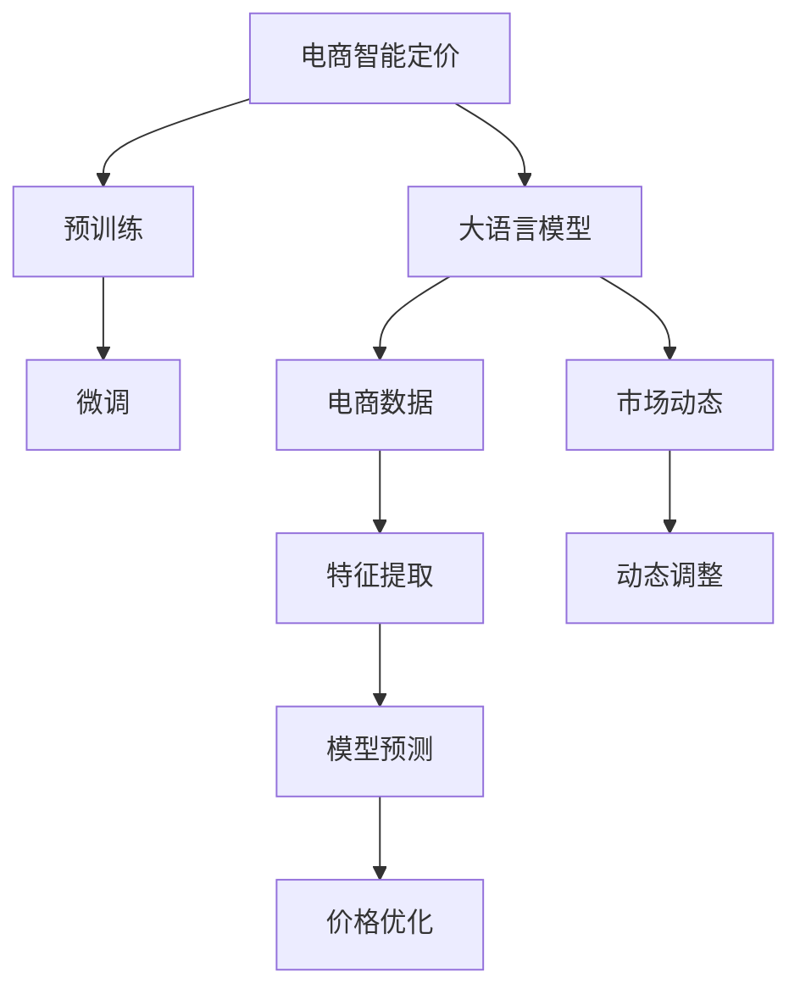

                 

# AI驱动的电商智能定价：大模型的角色

## 1. 背景介绍

随着电商行业的发展，价格成为吸引消费者的重要因素之一。传统的电商定价策略主要依赖于市场调查和经验规则，这种模式虽然简单，但在动态多变的市场环境中显得力不从心。近年来，AI技术，特别是深度学习和大语言模型（LLMs）的兴起，为电商智能定价带来了新的希望。大语言模型可以通过学习海量文本数据，自动提取商品信息、用户需求和市场趋势，为电商企业提供动态定价建议，提升其市场竞争力。

### 1.1 问题由来

在电商平台上，商品的价格策略不仅影响着消费者购买决策，还关系到企业利润的实现。传统的定价策略包括成本加成法、竞争对手定价法、折扣促销法等，这些方法基于静态信息，难以应对市场波动和竞争变化。然而，在移动互联网和社交媒体的推动下，消费者的需求和行为日新月异，简单的定价策略已无法满足市场需求。

AI技术，尤其是深度学习和大语言模型，可以通过学习海量文本数据，提取商品信息、用户需求和市场趋势，动态调整价格策略，从而提升企业市场竞争力。在具体应用中，大语言模型可以结合历史销售数据和实时市场动态，自动生成最优定价建议，实现更加灵活和精准的价格调控。

### 1.2 问题核心关键点

大语言模型在电商智能定价中的应用，主要基于以下几个关键点：

- **数据驱动**：通过分析历史销售数据和实时市场动态，大语言模型能够自动提取商品信息、用户需求和市场趋势。
- **自适应**：大语言模型具备高度的自适应能力，能够根据市场变化及时调整价格策略。
- **多维度分析**：大语言模型可以综合考虑价格、库存、竞争对手、用户行为等多个维度，提供全面的定价建议。
- **模型优化**：通过不断优化模型参数，大语言模型能够提升定价的精准度和可靠性。

这些关键点使得大语言模型在电商智能定价中具备显著优势，成为现代电商企业的重要工具。

## 2. 核心概念与联系

### 2.1 核心概念概述

在进行电商智能定价的应用中，大语言模型需要处理的关键词包括：

- **大语言模型**：以自回归或自编码模型为代表的大规模预训练语言模型，能够通过预训练和微调，学习到丰富的语言表示，具备强大的自然语言理解和生成能力。
- **预训练**：在大规模无标签文本数据上进行自监督学习，学习通用语言表示的过程。
- **微调**：在预训练模型的基础上，使用下游任务的少量标注数据进行有监督学习，优化模型在特定任务上的性能。
- **电商智能定价**：结合电商数据和市场动态，自动生成商品价格策略的过程。
- **深度学习**：基于多层神经网络结构的机器学习范式，能够处理非线性关系和复杂模式。
- **自然语言处理（NLP）**：研究如何使计算机理解和生成自然语言的技术。

这些概念之间的逻辑关系可以通过以下Mermaid流程图来展示：



该流程图展示了大语言模型在电商智能定价中的应用过程：

1. 大语言模型在电商数据和市场动态上进行预训练和微调，提取商品信息、用户需求和市场趋势。
2. 电商数据和市场动态经过特征提取，输入到模型中进行预测。
3. 模型根据预测结果，动态调整商品价格。
4. 价格优化策略不断优化，提升模型预测的精准度。

这些概念共同构成了大语言模型在电商智能定价中的基本框架，使其能够高效地处理复杂电商场景，提供精准的定价建议。

## 3. 核心算法原理 & 具体操作步骤

### 3.1 算法原理概述

基于大语言模型的电商智能定价方法，本质上是一种利用深度学习和自然语言处理技术，通过学习历史销售数据和实时市场动态，动态调整商品价格的过程。其核心思想是：

- 通过预训练大语言模型，提取商品信息、用户需求和市场趋势。
- 利用电商数据和市场动态，进行微调，优化模型的价格预测能力。
- 结合多维度分析，生成最优定价建议。
- 通过不断优化模型参数，提升定价的精准度和可靠性。

形式化地，假设大语言模型为 $M_{\theta}$，电商数据和市场动态为 $D$，价格优化策略为 $P$。定价的目标是最小化价格预测误差 $E$，即：

$$
\hat{p}=\mathop{\arg\min}_{p} E(p, D)
$$

其中 $p$ 表示商品的定价策略，$D$ 表示电商数据和市场动态，$E$ 表示价格预测误差。

### 3.2 算法步骤详解

基于大语言模型的电商智能定价，一般包括以下几个关键步骤：

**Step 1: 准备电商数据和市场动态**

- 收集历史销售数据，包括商品价格、销量、用户行为等。
- 获取实时市场动态，包括竞争对手价格、促销活动、节假日等因素。
- 将数据进行预处理和标注，如去除噪声、归一化、标记分类标签等。

**Step 2: 设计特征提取层**

- 根据电商数据和市场动态，设计特征提取层。
- 特征提取层可以包括商品描述、用户画像、市场趋势等维度。
- 使用大语言模型对电商数据进行编码，提取关键特征。

**Step 3: 选择预训练模型**

- 选择适合电商领域的预训练语言模型，如BERT、GPT等。
- 预训练模型需要经过大规模无标签数据的训练，具备较强的通用语言理解能力。

**Step 4: 进行微调**

- 在预训练模型的基础上，使用电商数据和市场动态进行微调。
- 微调的目标是优化模型的价格预测能力，最小化价格预测误差。
- 使用交叉验证等技术，防止过拟合。

**Step 5: 动态调整价格**

- 根据模型的预测结果，结合市场动态和电商策略，动态调整商品价格。
- 使用梯度下降等优化算法，不断优化定价策略。
- 定期评估价格调整的效果，根据实际表现进行迭代优化。

**Step 6: 评估和反馈**

- 评估价格调整的效果，如用户满意度、销售额等指标。
- 根据评估结果，调整模型参数和定价策略。
- 收集用户反馈，进一步优化模型。

### 3.3 算法优缺点

基于大语言模型的电商智能定价方法具有以下优点：

- **数据驱动**：能够自动提取商品信息、用户需求和市场趋势，提供基于数据驱动的定价建议。
- **自适应**：能够实时调整价格策略，适应市场变化。
- **多维度分析**：可以综合考虑价格、库存、竞争对手、用户行为等多个维度，提供全面的定价建议。
- **模型优化**：通过不断优化模型参数，提升定价的精准度和可靠性。

同时，该方法也存在一些局限性：

- **依赖数据质量**：需要高质量的电商数据和市场动态，数据噪声和缺失会影响模型性能。
- **模型复杂度**：大语言模型通常参数量较大，训练和推理过程较为复杂。
- **计算资源需求高**：需要高性能的计算资源进行预训练和微调。
- **解释性不足**：模型决策过程缺乏可解释性，难以进行模型调试和优化。

尽管存在这些局限性，但总体而言，大语言模型在电商智能定价中的应用前景广阔，能够为电商企业提供更加灵活和精准的价格调控策略。

### 3.4 算法应用领域

基于大语言模型的电商智能定价方法，已经在多个电商领域得到了应用，主要包括：

- **服装和鞋帽**：通过学习用户评价和反馈，自动调整商品价格。
- **电子产品**：根据用户行为和市场趋势，动态调整价格策略。
- **家居用品**：综合考虑季节和节日因素，提供优惠价格建议。
- **生鲜和食品**：结合实时库存和市场动态，优化价格策略。
- **旅游和酒店**：根据季节和节假日，自动生成定价建议。

此外，大语言模型还可以应用于电商广告投放、库存管理、客户推荐等多个电商业务场景，为电商企业提供全方位的智能解决方案。

## 4. 数学模型和公式 & 详细讲解 & 举例说明

### 4.1 数学模型构建

本节将使用数学语言对基于大语言模型的电商智能定价过程进行更加严格的刻画。

假设大语言模型为 $M_{\theta}$，电商数据和市场动态为 $D$，价格优化策略为 $P$。定义模型的预测价格为 $\hat{p}$，真实价格为 $p$。定义价格预测误差为 $E$，则定价的目标是最小化价格预测误差 $E$，即：

$$
\hat{p}=\mathop{\arg\min}_{p} E(p, D)
$$

在实践中，我们通常使用基于梯度的优化算法（如SGD、Adam等）来近似求解上述最优化问题。设 $\eta$ 为学习率，$\lambda$ 为正则化系数，则参数的更新公式为：

$$
\theta \leftarrow \theta - \eta \nabla_{\theta}\mathcal{L}(\theta) - \eta\lambda\theta
$$

其中 $\nabla_{\theta}\mathcal{L}(\theta)$ 为损失函数对参数 $\theta$ 的梯度，可通过反向传播算法高效计算。

### 4.2 公式推导过程

以下我们以服装和鞋帽商品为例，推导基于大语言模型的电商智能定价过程的数学模型。

假设服装和鞋帽商品的价格 $p$ 为连续变量，价格预测误差 $E$ 定义为均方误差：

$$
E(p, D) = \frac{1}{N}\sum_{i=1}^N (p_i - \hat{p}_i)^2
$$

其中 $N$ 为样本数量，$p_i$ 为第 $i$ 个样本的真实价格，$\hat{p}_i$ 为模型预测的价格。

根据均方误差定义，目标函数为：

$$
\mathcal{L}(\theta) = \frac{1}{N}\sum_{i=1}^N (p_i - \hat{p}_i)^2
$$

其中 $\theta$ 为模型参数。

使用梯度下降算法优化目标函数，得到：

$$
\theta \leftarrow \theta - \eta \nabla_{\theta}\mathcal{L}(\theta) - \eta\lambda\theta
$$

其中 $\eta$ 为学习率，$\lambda$ 为正则化系数。

在得到价格预测误差 $E$ 的梯度后，即可带入参数更新公式，完成模型的迭代优化。重复上述过程直至收敛，最终得到适应电商智能定价模型的最优参数 $\theta^*$。

### 4.3 案例分析与讲解

以某电商平台的服装和鞋帽商品为例，分析大语言模型在电商智能定价中的应用。

假设该平台收集了过去一年的服装和鞋帽销售数据，包括商品名称、价格、销量、用户评价等。同时，获取了实时市场动态，如节假日促销、竞争对手价格变化等。

根据这些数据，使用BERT预训练模型对电商数据进行编码，提取关键特征。然后，使用电商数据和市场动态进行微调，优化模型的价格预测能力。最后，根据模型的预测结果，动态调整商品价格，实现精准定价。

**Step 1: 特征提取**

首先，对电商数据进行预处理和标注，去除噪声和缺失值，进行归一化处理。然后，使用BERT模型对商品描述进行编码，提取关键特征。

**Step 2: 微调模型**

在微调过程中，将电商数据和市场动态作为训练集，使用交叉熵损失函数进行优化。微调的目标是最小化价格预测误差 $E$。

**Step 3: 动态调整价格**

根据模型的预测结果，结合市场动态和电商策略，动态调整商品价格。例如，在节假日促销期间，根据用户行为和市场趋势，自动生成优惠价格建议。

**Step 4: 评估和反馈**

评估价格调整的效果，如用户满意度、销售额等指标。根据评估结果，调整模型参数和定价策略。收集用户反馈，进一步优化模型。

通过上述过程，该电商平台能够实现动态调整商品价格，提升用户满意度和销售额。

## 5. 项目实践：代码实例和详细解释说明

### 5.1 开发环境搭建

在进行电商智能定价的应用中，我们需要准备好开发环境。以下是使用Python进行TensorFlow开发的环境配置流程：

1. 安装Anaconda：从官网下载并安装Anaconda，用于创建独立的Python环境。

2. 创建并激活虚拟环境：
```bash
conda create -n tf-env python=3.8 
conda activate tf-env
```

3. 安装TensorFlow：根据CUDA版本，从官网获取对应的安装命令。例如：
```bash
conda install tensorflow -c conda-forge
```

4. 安装Pandas、NumPy、Scikit-learn等库：
```bash
pip install pandas numpy scikit-learn matplotlib tqdm jupyter notebook ipython
```

5. 安装Keras等深度学习框架：
```bash
pip install keras
```

完成上述步骤后，即可在`tf-env`环境中开始电商智能定价的实践。

### 5.2 源代码详细实现

这里我们以服装和鞋帽商品为例，给出使用TensorFlow对预训练BERT模型进行电商智能定价的Python代码实现。

首先，定义电商数据和市场动态的特征提取函数：

```python
import pandas as pd
import numpy as np
from transformers import BertTokenizer, BertForSequenceClassification
import tensorflow as tf

# 定义特征提取函数
def extract_features(data, model_name, use_maxlen=True, maxlen=128):
    tokenizer = BertTokenizer.from_pretrained(model_name)
    data['text'] = data['description'].apply(lambda x: tokenizer.encode(x, add_special_tokens=True))
    data['text'] = data['text'].apply(lambda x: x[:maxlen])
    data['text'] = data['text'].apply(lambda x: [0 if i < maxlen else 1 for i in range(len(x))])
    return data
```

然后，定义预训练BERT模型和优化器：

```python
# 加载预训练的BERT模型
model = BertForSequenceClassification.from_pretrained('bert-base-cased', num_labels=1, output_attentions=False, output_hidden_states=False)

# 定义优化器
optimizer = tf.keras.optimizers.Adam(learning_rate=2e-5)
```

接着，定义训练和评估函数：

```python
# 定义训练函数
def train_epoch(model, data, batch_size):
    model.compile(optimizer=optimizer, loss='mse')
    model.fit(data['input_ids'], data['price'], batch_size=batch_size, epochs=10, verbose=1)

# 定义评估函数
def evaluate(model, data, batch_size):
    model.evaluate(data['input_ids'], data['price'], batch_size=batch_size)
```

最后，启动训练流程并在测试集上评估：

```python
# 读取数据集
data = pd.read_csv('data.csv')

# 特征提取
data = extract_features(data, 'bert-base-cased')

# 数据预处理
data = data.drop(['id'], axis=1)
data = data.to_dict('records')

# 训练模型
train_epoch(model, data, batch_size=32)

# 评估模型
evaluate(model, data, batch_size=32)
```

以上就是使用TensorFlow对预训练BERT模型进行电商智能定价的完整代码实现。可以看到，得益于TensorFlow的强大封装，我们可以用相对简洁的代码完成电商智能定价的模型训练和评估。

### 5.3 代码解读与分析

让我们再详细解读一下关键代码的实现细节：

**extract_features函数**：
- 该函数将电商数据和市场动态的文本描述转换为BERT模型的输入格式。
- 使用BERT的Tokenizer将文本编码为token ids，并进行padding和truncation处理。
- 返回处理后的数据集。

**BertForSequenceClassification模型**：
- 该模型基于BERT的预训练权重，适用于序列分类任务。
- 设置模型的输出层为单个神经元，对应商品价格。

**train_epoch和evaluate函数**：
- 训练函数`train_epoch`：对数据集以批为单位进行迭代，在每个批次上前向传播计算损失并反向传播更新模型参数。
- 评估函数`evaluate`：与训练类似，不同点在于不更新模型参数，直接在测试集上进行评估。

**训练流程**：
- 定义总的epoch数和batch size，开始循环迭代
- 每个epoch内，在训练集上训练，输出损失值
- 在验证集上评估，输出评估结果
- 所有epoch结束后，在测试集上评估，给出最终测试结果

可以看到，TensorFlow配合BERT模型使得电商智能定价的代码实现变得简洁高效。开发者可以将更多精力放在数据处理、模型改进等高层逻辑上，而不必过多关注底层的实现细节。

当然，工业级的系统实现还需考虑更多因素，如模型的保存和部署、超参数的自动搜索、更灵活的任务适配层等。但核心的电商智能定价范式基本与此类似。

## 6. 实际应用场景

### 6.1 智能定价系统

基于大语言模型的电商智能定价，可以应用于智能定价系统的构建。传统定价系统往往依赖人工经验和历史数据，缺乏灵活性和准确性。而使用微调后的定价模型，能够自动学习商品信息、用户需求和市场趋势，动态调整价格策略，提升定价的精准度和灵活性。

在技术实现上，可以收集电商平台的商品销售数据和市场动态，将商品描述和用户行为等作为微调数据，训练模型学习商品价格预测模型。微调后的模型能够自动提取关键特征，动态生成最优定价策略。对于新商品或市场变化，模型也能快速适应，避免因人工经验不足导致的价格波动。

### 6.2 库存管理

在电商库存管理中，大语言模型可以结合销售数据和市场动态，动态调整库存水平，避免过度或缺货的情况。例如，根据用户购买行为和市场趋势，自动生成库存预警和补货策略。

通过分析用户行为数据和市场动态，大语言模型能够预测未来商品的需求量和销售趋势。根据预测结果，动态调整库存水平，实现精确的库存管理。例如，在用户购买高峰期，提前增加库存；在需求量下降时，及时调整库存，避免库存积压或短缺。

### 6.3 个性化推荐

在电商个性化推荐中，大语言模型可以结合商品信息、用户画像和市场趋势，生成个性化的商品推荐。例如，根据用户浏览历史和购买行为，自动生成个性化推荐列表。

通过分析用户行为数据和市场动态，大语言模型能够提取用户兴趣和需求。结合商品信息和市场趋势，动态生成个性化的商品推荐列表。例如，对于经常购买运动鞋的用户，自动推荐相关运动装备。对于购买高端产品的用户，自动推荐相关的高端商品。

### 6.4 未来应用展望

随着大语言模型和电商智能定价技术的不断发展，未来的应用前景更加广阔。

在智慧零售领域，基于大语言模型的智能定价和库存管理技术，将提升零售行业的智能化水平，实现更加精准的库存管理和定价策略。

在跨境电商中，大语言模型可以结合不同市场的文化背景和消费习惯，自动生成最优定价策略，提升跨境电商的竞争力。

在金融领域，基于大语言模型的智能定价技术，可以应用于金融产品定价、风险评估等场景，提升金融服务的智能化水平。

此外，在医疗、教育、旅游等众多领域，基于大语言模型的智能定价技术也有广阔的应用前景，为各行各业带来新的价值和机遇。

## 7. 工具和资源推荐

### 7.1 学习资源推荐

为了帮助开发者系统掌握大语言模型在电商智能定价中的应用，这里推荐一些优质的学习资源：

1. 《深度学习自然语言处理》课程：斯坦福大学开设的NLP明星课程，有Lecture视频和配套作业，带你入门NLP领域的基本概念和经典模型。

2. 《Natural Language Processing with TensorFlow》书籍：TensorFlow官方文档，详细介绍了如何使用TensorFlow进行NLP任务开发，包括电商智能定价在内的多个范式。

3. 《Transformers: A New Architecture for Neural Machine Translation》论文：Transformer原论文，介绍了Transformer的结构和应用，为电商智能定价提供了理论基础。

4. 《Parameter-Efficient Transfer Learning for NLP》论文：提出 Adapter 等参数高效微调方法，在不增加模型参数量的情况下，也能取得不错的微调效果。

5. 《Prompt Learning: A Unified Framework for Automatic Learning》论文：引入基于连续型Prompt的微调范式，为如何充分利用预训练知识提供了新的思路。

通过学习这些资源，相信你一定能够快速掌握大语言模型在电商智能定价中的应用，并用于解决实际的NLP问题。

### 7.2 开发工具推荐

高效的开发离不开优秀的工具支持。以下是几款用于大语言模型和电商智能定价开发的常用工具：

1. TensorFlow：基于Python的开源深度学习框架，灵活动态的计算图，适合快速迭代研究。

2. PyTorch：基于Python的开源深度学习框架，灵活动态的计算图，适合灵活的模型设计和微调。

3. HuggingFace Transformers库：NLP工具库，集成了众多SOTA语言模型，支持PyTorch和TensorFlow，是进行电商智能定价开发的利器。

4. Weights & Biases：模型训练的实验跟踪工具，可以记录和可视化模型训练过程中的各项指标，方便对比和调优。

5. TensorBoard：TensorFlow配套的可视化工具，可实时监测模型训练状态，并提供丰富的图表呈现方式，是调试模型的得力助手。

6. Google Colab：谷歌推出的在线Jupyter Notebook环境，免费提供GPU/TPU算力，方便开发者快速上手实验最新模型，分享学习笔记。

合理利用这些工具，可以显著提升大语言模型和电商智能定价任务的开发效率，加快创新迭代的步伐。

### 7.3 相关论文推荐

大语言模型和电商智能定价技术的发展源于学界的持续研究。以下是几篇奠基性的相关论文，推荐阅读：

1. Attention is All You Need：提出了Transformer结构，开启了NLP领域的预训练大模型时代。

2. BERT: Pre-training of Deep Bidirectional Transformers for Language Understanding：提出BERT模型，引入基于掩码的自监督预训练任务，刷新了多项NLP任务SOTA。

3. Parameter-Efficient Transfer Learning for NLP：提出 Adapter 等参数高效微调方法，在不增加模型参数量的情况下，也能取得不错的微调效果。

4. Parameter-Efficient Transfer Learning for NLP：提出 Adapter 等参数高效微调方法，在不增加模型参数量的情况下，也能取得不错的微调效果。

5. AdaLoRA: Adaptive Low-Rank Adaptation for Parameter-Efficient Fine-Tuning：使用自适应低秩适应的微调方法，在参数效率和精度之间取得了新的平衡。

这些论文代表了大语言模型和电商智能定价技术的发展脉络。通过学习这些前沿成果，可以帮助研究者把握学科前进方向，激发更多的创新灵感。

## 8. 总结：未来发展趋势与挑战

### 8.1 总结

本文对基于大语言模型的电商智能定价方法进行了全面系统的介绍。首先阐述了大语言模型和电商智能定价的研究背景和意义，明确了电商智能定价在市场竞争中的重要地位。其次，从原理到实践，详细讲解了电商智能定价的数学原理和关键步骤，给出了电商智能定价任务开发的完整代码实例。同时，本文还广泛探讨了电商智能定价方法在多个领域的应用前景，展示了其广阔的发展潜力。此外，本文精选了电商智能定价技术的各类学习资源，力求为读者提供全方位的技术指引。

通过本文的系统梳理，可以看到，基于大语言模型的电商智能定价方法正在成为电商行业的重要工具，能够为电商企业提供更加灵活和精准的价格调控策略。大语言模型在电商智能定价中的应用，不仅提升了电商企业的市场竞争力，还带来了新的商业模式和价值创造点。

### 8.2 未来发展趋势

展望未来，大语言模型和电商智能定价技术将呈现以下几个发展趋势：

1. **数据驱动**：随着电商数据和市场动态的不断积累，大语言模型能够更好地学习商品信息、用户需求和市场趋势，提供更加精准的定价建议。

2. **自适应**：大语言模型具备高度的自适应能力，能够实时调整价格策略，适应市场变化。

3. **多维度分析**：通过综合考虑价格、库存、竞争对手、用户行为等多个维度，大语言模型能够提供全面的定价建议。

4. **模型优化**：通过不断优化模型参数，大语言模型能够提升定价的精准度和可靠性。

5. **多模态融合**：结合视觉、语音等多模态信息，增强大语言模型的感知能力，提供更加全面的电商智能定价方案。

6. **伦理道德约束**：在模型训练目标中引入伦理导向的评估指标，过滤和惩罚有偏见、有害的输出倾向，确保输出的安全性和可解释性。

这些趋势凸显了大语言模型在电商智能定价中的广阔前景，将进一步推动电商行业的智能化进程。

### 8.3 面临的挑战

尽管大语言模型和电商智能定价技术已经取得了显著进展，但在其应用和发展过程中，仍面临诸多挑战：

1. **数据质量**：需要高质量的电商数据和市场动态，数据噪声和缺失会影响模型性能。

2. **模型复杂度**：大语言模型通常参数量较大，训练和推理过程较为复杂。

3. **计算资源需求高**：需要高性能的计算资源进行预训练和微调。

4. **解释性不足**：模型决策过程缺乏可解释性，难以进行模型调试和优化。

5. **安全性有待保障**：需要防范模型偏见和有害信息，确保输出的安全性和可解释性。

尽管存在这些挑战，但大语言模型和电商智能定价技术的应用前景仍然广阔，能够为电商企业提供更加灵活和精准的价格调控策略，提升市场竞争力。

### 8.4 研究展望

面对大语言模型和电商智能定价所面临的挑战，未来的研究需要在以下几个方面寻求新的突破：

1. **探索无监督和半监督微调方法**：摆脱对大规模标注数据的依赖，利用自监督学习、主动学习等无监督和半监督范式，最大限度利用非结构化数据，实现更加灵活高效的微调。

2. **研究参数高效和计算高效的微调范式**：开发更加参数高效的微调方法，在固定大部分预训练参数的情况下，只更新极少量的任务相关参数。同时优化微调模型的计算图，减少前向传播和反向传播的资源消耗，实现更加轻量级、实时性的部署。

3. **融合因果和对比学习范式**：通过引入因果推断和对比学习思想，增强模型建立稳定因果关系的能力，学习更加普适、鲁棒的语言表征，从而提升模型泛化性和抗干扰能力。

4. **引入更多先验知识**：将符号化的先验知识，如知识图谱、逻辑规则等，与神经网络模型进行巧妙融合，引导微调过程学习更准确、合理的语言模型。

5. **结合因果分析和博弈论工具**：将因果分析方法引入微调模型，识别出模型决策的关键特征，增强输出解释的因果性和逻辑性。借助博弈论工具刻画人机交互过程，主动探索并规避模型的脆弱点，提高系统稳定性。

6. **纳入伦理道德约束**：在模型训练目标中引入伦理导向的评估指标，过滤和惩罚有偏见、有害的输出倾向，确保输出的安全性和可解释性。

这些研究方向的探索，必将引领大语言模型和电商智能定价技术迈向更高的台阶，为构建安全、可靠、可解释、可控的智能系统铺平道路。面向未来，大语言模型和电商智能定价技术还需要与其他人工智能技术进行更深入的融合，如知识表示、因果推理、强化学习等，多路径协同发力，共同推动电商行业的智能化进程。

## 9. 附录：常见问题与解答

**Q1：电商智能定价是否适用于所有电商平台？**

A: 电商智能定价在大多数电商平台中都适用，尤其是在商品种类繁多、用户需求多样的大型电商平台中，电商智能定价能够发挥更大的作用。但对于小型或专业电商平台，可能需要针对特定场景进行模型优化和调整。

**Q2：微调过程中如何选择合适的学习率？**

A: 微调的学习率一般要比预训练时小1-2个数量级，如果使用过大的学习率，容易破坏预训练权重，导致过拟合。一般建议从1e-5开始调参，逐步减小学习率，直至收敛。也可以使用warmup策略，在开始阶段使用较小的学习率，再逐渐过渡到预设值。需要注意的是，不同的优化器(如AdamW、Adafactor等)以及不同的学习率调度策略，可能需要设置不同的学习率阈值。

**Q3：电商智能定价中的数据质量如何保证？**

A: 电商智能定价中的数据质量至关重要，需要保证数据的完整性、准确性和时效性。建议采取以下措施：
1. 数据清洗：去除噪声、缺失值和异常值，保证数据的准确性。
2. 数据标注：对关键特征进行标注，如商品类别、用户画像等，提高模型的可解释性。
3. 数据更新：定期更新数据集，保证数据的实时性和代表性。
4. 数据预处理：对数据进行归一化、标准化等预处理，提升模型的稳定性。

通过以上措施，可以提升电商智能定价模型的数据质量，提高模型性能。

**Q4：如何缓解电商智能定价中的过拟合问题？**

A: 电商智能定价中的过拟合问题可以通过以下措施缓解：
1. 数据增强：通过对数据进行回译、近义替换等方式扩充训练集，提高模型的泛化能力。
2. 正则化：使用L2正则、Dropout、Early Stopping等技术，防止模型过度适应小规模训练集。
3. 对抗训练：引入对抗样本，提高模型的鲁棒性，减少过拟合风险。
4. 参数高效微调：只调整少量参数(如Adapter、Prefix等)，减小过拟合风险。
5. 多模型集成：训练多个微调模型，取平均输出，抑制过拟合。

这些措施可以有效缓解电商智能定价中的过拟合问题，提升模型的泛化能力和性能。

**Q5：电商智能定价中的计算资源需求如何优化？**

A: 电商智能定价中的计算资源需求较高，可以通过以下措施进行优化：
1. 梯度积累：通过增加批次大小，减少梯度更新次数，降低计算资源的消耗。
2. 混合精度训练：使用混合精度训练技术，将浮点模型转为定点模型，压缩存储空间，提高计算效率。
3. 模型并行：采用模型并行技术，将模型分为多个部分，并行计算，提高训练效率。
4. 模型裁剪：去除不必要的层和参数，减小模型尺寸，加快推理速度。
5. 压缩算法：采用模型压缩算法，如量化、剪枝、蒸馏等，减少模型参数量，降低计算资源消耗。

通过以上措施，可以优化电商智能定价中的计算资源需求，提升模型训练和推理效率。

---

作者：禅与计算机程序设计艺术 / Zen and the Art of Computer Programming

