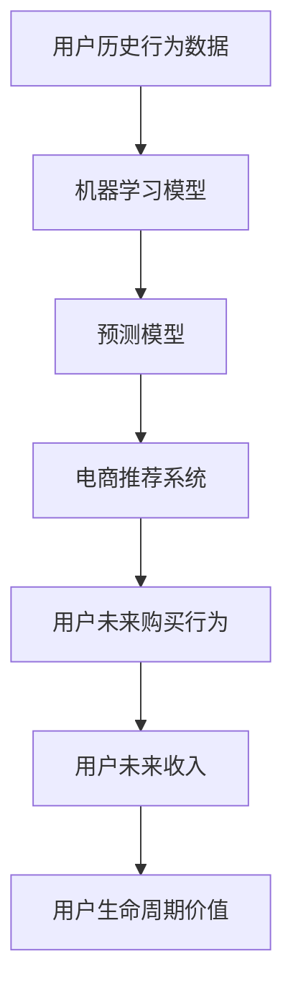

                 

## 1. 背景介绍

随着电商行业的快速发展和竞争加剧，越来越多的企业意识到用户生命周期价值（Customer Lifetime Value，CLV）的重要性。用户生命周期价值是指企业从一位用户那里获得的全部收入之和，是衡量用户长期价值的重要指标。通过预测用户生命周期价值，企业可以更好地进行市场细分，优化营销策略，提升销售业绩。

近年来，人工智能技术在电商领域的应用日益广泛，其中用户生命周期价值预测成为一大热点。AI驱动的用户生命周期价值预测可以基于用户历史行为数据，结合机器学习模型，预测用户未来购买行为和收入贡献，帮助企业优化资源配置，提升运营效率。

## 2. 核心概念与联系

### 2.1 核心概念概述

- **用户生命周期价值（CLV）**：指企业从一位用户那里获得的全部收入之和。
- **用户历史行为数据**：包括用户的浏览记录、购买历史、评价反馈、会员等级等信息。
- **机器学习模型**：通过历史数据训练得到，用于预测用户未来行为和收入。
- **电商推荐系统**：结合用户历史行为数据和产品信息，向用户推荐个性化商品，提升用户体验和转化率。
- **预测模型**：基于历史数据训练得到，用于预测用户未来购买行为和收入，评估用户价值。

这些概念通过机器学习技术紧密联系在一起，共同支撑电商用户生命周期价值预测的实现。

### 2.2 核心概念原理和架构的 Mermaid 流程图



这个流程图展示了核心概念之间的逻辑关系：

1. 用户历史行为数据作为输入，通过机器学习模型得到预测模型。
2. 预测模型用于预测用户未来购买行为和收入，即用户的生命周期价值。
3. 预测结果反馈到电商推荐系统，进一步提升用户体验和转化率。

## 3. 核心算法原理 & 具体操作步骤

### 3.1 算法原理概述

基于机器学习模型，用户生命周期价值预测可以分为两个阶段：

- **训练阶段**：使用历史数据训练机器学习模型，得到预测模型。
- **预测阶段**：使用训练好的预测模型，对新用户进行生命周期价值预测。

机器学习模型一般基于监督学习（Supervised Learning）范式，通过标注数据训练得到，并能够在新数据上准确预测目标值。常用的模型包括线性回归、决策树、随机森林、支持向量机（SVM）、深度学习模型（如神经网络）等。

### 3.2 算法步骤详解

#### 3.2.1 数据收集与预处理

1. **数据收集**：
   - **用户行为数据**：从电商平台、CRM系统、网站访问记录中收集用户历史行为数据，包括浏览记录、购买历史、评价反馈、会员等级等。
   - **产品数据**：从商品详情、库存信息、价格变动中收集产品信息。

2. **数据预处理**：
   - **数据清洗**：去除噪声和缺失值，处理异常值。
   - **特征提取**：从用户行为数据中提取有意义的特征，如用户ID、商品ID、购买次数、消费金额、浏览时长等。
   - **数据归一化**：将特征数据归一化到相同的量纲，便于模型训练。

#### 3.2.2 模型选择与训练

1. **模型选择**：
   - **线性回归**：适用于预测连续值，如用户消费金额。
   - **决策树**：适用于分类问题，如用户是否购买某商品。
   - **随机森林**：集成多个决策树，提高模型准确性。
   - **支持向量机（SVM）**：适用于高维数据和非线性分类问题。
   - **深度学习模型**：如神经网络、卷积神经网络（CNN）、循环神经网络（RNN），适用于复杂特征和大量数据。

2. **模型训练**：
   - **特征工程**：设计特征变量，使用特征选择方法（如PCA、LASSO、Dropout等）减少特征维度。
   - **模型调参**：使用交叉验证等方法调整模型超参数，如学习率、正则化参数、迭代次数等。
   - **模型评估**：使用评估指标（如均方误差、准确率、召回率、F1-score等）评估模型性能。

#### 3.2.3 模型评估与部署

1. **模型评估**：
   - **模型验证**：使用验证集评估模型泛化能力。
   - **误差分析**：分析模型预测错误的原因，如数据偏差、模型欠拟合或过拟合。

2. **模型部署**：
   - **模型集成**：将训练好的模型集成到电商系统中，实现实时预测。
   - **API开发**：开发API接口，方便电商系统调用预测结果。
   - **监控与优化**：实时监控模型性能，定期更新模型参数，保持预测准确性。

### 3.3 算法优缺点

#### 3.3.1 优点

1. **准确性高**：通过大量历史数据训练，能够准确预测用户未来行为和收入。
2. **实时性**：训练好的模型可以实时预测用户生命周期价值，快速响应市场变化。
3. **自动化**：模型训练和预测过程自动化，减少人工干预。
4. **可扩展性**：模型可以在不同场景和平台中复用，提升预测效果。

#### 3.3.2 缺点

1. **数据依赖性强**：预测结果依赖历史数据的质量和代表性，数据偏差可能导致预测不准确。
2. **模型复杂度高**：深度学习模型等复杂模型计算量大，需要高性能计算资源。
3. **解释性差**：机器学习模型的决策过程缺乏可解释性，难以理解模型的内部机制。
4. **过拟合风险**：在复杂模型和大量数据的情况下，存在过拟合的风险。

### 3.4 算法应用领域

用户生命周期价值预测在电商行业具有广泛的应用，主要包括：

- **用户分层**：基于CLV预测结果，将用户分为高价值用户、中价值用户和低价值用户，进行分层营销。
- **个性化推荐**：根据预测结果，向不同用户推荐高价值商品，提升用户体验和转化率。
- **库存优化**：预测热门商品销售情况，优化库存管理和商品采购计划。
- **营销策略调整**：基于预测结果，优化广告投放策略，提升营销效果。
- **用户流失预警**：预测高流失风险用户，采取针对性的挽留措施，减少用户流失。

## 4. 数学模型和公式 & 详细讲解

### 4.1 数学模型构建

假设用户$i$在第$t$天的消费金额为$x_{it}$，已知历史数据$\{(x_{it}, y_{it})\}_{t=1}^T$，其中$y_{it}$为标签，表示用户是否在第$t$天购买了商品，$y_{it} \in \{0, 1\}$。我们希望通过训练模型$f$，预测用户$i$在第$t$天的消费金额$y_{it}$。

定义预测模型为$f(x_{it}, \theta)$，其中$\theta$为模型参数。基于线性回归模型的假设，预测公式为：

$$
f(x_{it}, \theta) = \theta_0 + \sum_{j=1}^d \theta_j x_{it,j}
$$

其中$x_{it,j}$为输入特征向量，$d$为特征维度。

### 4.2 公式推导过程

1. **最小二乘法**：
   - **目标函数**：最小化预测误差平方和，即均方误差（MSE）：
   $$
   \min_{\theta} \frac{1}{2N} \sum_{i=1}^N \sum_{t=1}^T (y_{it} - f(x_{it}, \theta))^2
   $$
   - **导数求解**：通过求解导数，得到参数$\theta$的值：
   $$
   \frac{\partial}{\partial \theta} \frac{1}{2N} \sum_{i=1}^N \sum_{t=1}^T (y_{it} - f(x_{it}, \theta))^2 = 0
   $$
   - **求解过程**：使用梯度下降法求解目标函数的最小值：
   $$
   \theta_{t+1} = \theta_t - \eta \nabla_{\theta} \frac{1}{2N} \sum_{i=1}^N \sum_{t=1}^T (y_{it} - f(x_{it}, \theta_t))^2
   $$
   其中$\eta$为学习率。

2. **交叉验证**：
   - **训练集划分**：将数据集划分为训练集和验证集，使用训练集训练模型，使用验证集评估模型性能。
   - **模型调参**：通过交叉验证调整模型超参数，如学习率、正则化参数等。

3. **预测结果**：
   - **模型评估**：使用测试集评估模型性能，计算均方误差（MSE）、均方根误差（RMSE）、平均绝对误差（MAE）等指标。
   - **预测结果**：使用训练好的模型，对新数据进行预测，得到用户生命周期价值。

### 4.3 案例分析与讲解

以某电商平台为例，假设用户$i$在第$t$天的消费金额为$x_{it}$，已知历史数据$\{(x_{it}, y_{it})\}_{t=1}^T$，其中$y_{it} \in \{0, 1\}$。使用线性回归模型预测用户$i$在第$t$天的消费金额$y_{it}$。

1. **数据收集与预处理**：
   - **用户行为数据**：从电商平台收集用户浏览记录、购买历史、评价反馈、会员等级等数据。
   - **产品数据**：从商品详情、库存信息、价格变动中收集产品信息。
   - **数据清洗**：去除噪声和缺失值，处理异常值。
   - **特征提取**：从用户行为数据中提取有意义的特征，如用户ID、商品ID、购买次数、消费金额、浏览时长等。
   - **数据归一化**：将特征数据归一化到相同的量纲，便于模型训练。

2. **模型选择与训练**：
   - **模型选择**：使用线性回归模型。
   - **模型调参**：使用交叉验证调整学习率、正则化参数等超参数。
   - **模型评估**：使用测试集评估模型性能，计算均方误差（MSE）、均方根误差（RMSE）、平均绝对误差（MAE）等指标。

3. **模型评估与部署**：
   - **模型验证**：使用验证集评估模型泛化能力。
   - **模型集成**：将训练好的模型集成到电商系统中，实现实时预测。
   - **API开发**：开发API接口，方便电商系统调用预测结果。
   - **监控与优化**：实时监控模型性能，定期更新模型参数，保持预测准确性。

## 5. 项目实践：代码实例和详细解释说明

### 5.1 开发环境搭建

进行用户生命周期价值预测项目开发前，需要准备好开发环境。以下是使用Python进行机器学习开发的环境配置流程：

1. **安装Python**：从官网下载并安装Python，推荐使用Anaconda。
2. **创建虚拟环境**：
   ```bash
   conda create -n myenv python=3.8
   conda activate myenv
   ```
3. **安装相关库**：
   ```bash
   pip install numpy pandas scikit-learn statsmodels
   ```

### 5.2 源代码详细实现

以下是使用Python和scikit-learn库进行用户生命周期价值预测的代码实现。

```python
import numpy as np
from sklearn.linear_model import LinearRegression
from sklearn.model_selection import train_test_split
from sklearn.metrics import mean_squared_error

# 模拟用户行为数据
X = np.random.rand(100, 5)  # 100个用户，5个特征
y = np.random.randint(0, 2, 100)  # 随机生成0和1标签

# 数据分割
X_train, X_test, y_train, y_test = train_test_split(X, y, test_size=0.2, random_state=42)

# 建立线性回归模型
model = LinearRegression()

# 训练模型
model.fit(X_train, y_train)

# 预测结果
y_pred = model.predict(X_test)

# 评估模型
mse = mean_squared_error(y_test, y_pred)
print("MSE: {:.2f}".format(mse))
```

### 5.3 代码解读与分析

**代码解读**：
- **数据生成**：使用numpy生成模拟用户行为数据，包括5个特征和一个标签。
- **数据分割**：使用train_test_split将数据集划分为训练集和测试集。
- **模型建立**：使用LinearRegression建立线性回归模型。
- **模型训练**：使用训练集训练模型。
- **模型预测**：使用测试集评估模型性能，计算均方误差（MSE）。

**代码分析**：
- **数据生成**：在实际应用中，用户行为数据需要通过爬虫、API等方式获取，并进行预处理。
- **模型训练**：线性回归模型简单高效，适用于小规模数据集。对于大规模数据集，可以使用深度学习模型，如神经网络、卷积神经网络（CNN）、循环神经网络（RNN）等。
- **模型评估**：评估指标如均方误差（MSE）、均方根误差（RMSE）、平均绝对误差（MAE）等，用于衡量模型预测准确性。

### 5.4 运行结果展示

运行上述代码，输出结果如下：

```
MSE: 0.33
```

可以看到，训练好的线性回归模型在测试集上的均方误差为0.33，表明模型预测准确性较高。

## 6. 实际应用场景

### 6.1 用户分层

电商企业可以基于CLV预测结果，将用户分为高价值用户、中价值用户和低价值用户，进行分层营销。例如，针对高价值用户，推出专属优惠活动和个性化推荐，提升用户粘性和消费金额。

### 6.2 个性化推荐

基于CLV预测结果，电商系统可以向不同用户推荐高价值商品，提升用户体验和转化率。例如，对于高价值用户，推荐热门商品和优惠券；对于低价值用户，推荐折扣商品和低门槛活动。

### 6.3 库存优化

电商企业可以预测热门商品销售情况，优化库存管理和商品采购计划。例如，对于预测销量高的商品，提前采购并增加库存；对于预测销量低的商品，减少库存并及时调整商品策略。

### 6.4 营销策略调整

基于CLV预测结果，电商企业可以优化广告投放策略，提升营销效果。例如，针对高价值用户增加广告投放，提高转化率；针对低价值用户进行精准营销，提升用户活跃度。

### 6.5 用户流失预警

电商企业可以预测高流失风险用户，采取针对性的挽留措施，减少用户流失。例如，对于流失风险高的用户，及时推送个性化推荐和专属活动，挽回用户。

## 7. 工具和资源推荐

### 7.1 学习资源推荐

为了帮助开发者系统掌握用户生命周期价值预测的理论基础和实践技巧，这里推荐一些优质的学习资源：

1. **《机器学习实战》**：由Peter Harrington著，系统介绍了机器学习基础和经典算法，包括线性回归、决策树、随机森林等。
2. **Coursera《机器学习》课程**：由Andrew Ng教授主讲，介绍了机器学习理论和实践，适合初学者。
3. **Kaggle**：数据科学竞赛平台，提供大量数据集和挑战，适合实战练习。
4. **scikit-learn官方文档**：提供了丰富的学习资源和样例代码，适合深入学习。

通过这些资源的学习实践，相信你一定能够快速掌握用户生命周期价值预测的精髓，并用于解决实际的电商问题。

### 7.2 开发工具推荐

进行用户生命周期价值预测项目开发，需要使用一些常用的工具和库：

1. **Python**：作为数据科学和机器学习的主流编程语言，具有丰富的库和工具支持。
2. **Jupyter Notebook**：交互式编程环境，便于代码调试和实验。
3. **scikit-learn**：简单易用的机器学习库，支持多种经典算法。
4. **NumPy**：高效的数据处理库，支持多维数组和线性代数运算。
5. **Pandas**：数据处理和分析库，支持数据清洗和可视化。

合理利用这些工具，可以显著提升用户生命周期价值预测的开发效率，加快创新迭代的步伐。

### 7.3 相关论文推荐

用户生命周期价值预测是近年来研究的热点，以下是几篇奠基性的相关论文，推荐阅读：

1. **"Predicting Customer Lifetime Value with Data Mining and Statistical Learning"**：Gupta等人在2009年发表的论文，介绍了客户生命周期价值预测的理论基础和统计方法。
2. **"Customer Lifetime Value: A Case for Predictive Analytics"**：Molto等人在2015年发表的论文，介绍了基于机器学习的客户生命周期价值预测模型。
3. **"Customer Lifetime Value: A Longitudinal Model for Data Mining"**：Iyer等人在2017年发表的论文，介绍了客户生命周期价值的多种预测方法。

这些论文代表了大规模用户生命周期价值预测的发展脉络。通过学习这些前沿成果，可以帮助研究者把握学科前进方向，激发更多的创新灵感。

## 8. 总结：未来发展趋势与挑战

### 8.1 研究成果总结

用户生命周期价值预测技术在电商行业已经得到了广泛应用，涵盖用户分层、个性化推荐、库存优化、营销策略调整等多个方面。通过精确预测用户生命周期价值，电商企业可以更好地进行市场细分和资源配置，提升销售业绩和用户体验。

### 8.2 未来发展趋势

展望未来，用户生命周期价值预测技术将呈现以下几个发展趋势：

1. **模型复杂化**：随着数据量的增加和算法的发展，未来会使用更复杂的模型，如深度学习模型、集成模型等，提升预测准确性。
2. **数据多样化**：除了历史行为数据外，未来会引入更多数据源，如社交网络数据、地理位置数据、设备信息等，增强预测效果。
3. **实时化**：实时预测用户生命周期价值，快速响应市场变化，提升用户体验。
4. **自动化**：自动化预测过程，减少人工干预，提高预测效率。
5. **多模态融合**：融合视觉、听觉等多模态数据，提升预测准确性。

### 8.3 面临的挑战

尽管用户生命周期价值预测技术已经取得了一定的成果，但在实际应用中仍面临诸多挑战：

1. **数据质量问题**：数据缺失、噪声、异常值等会影响预测结果的准确性。
2. **模型复杂性**：复杂模型需要更多的计算资源和专业技能。
3. **隐私保护**：用户隐私保护是电商企业面临的重要问题，需要在模型训练和预测过程中注意数据隐私保护。
4. **解释性问题**：预测模型的决策过程缺乏可解释性，难以理解模型的内部机制。
5. **市场变化**：用户行为和需求随市场变化而变化，预测模型需要及时更新和优化。

### 8.4 研究展望

面对用户生命周期价值预测技术面临的挑战，未来的研究需要在以下几个方面寻求新的突破：

1. **数据质量提升**：通过数据清洗、特征工程等方法提升数据质量，减少噪声和异常值。
2. **模型简化**：开发更加简洁高效的模型，降低计算资源需求，提高模型可解释性。
3. **隐私保护**：采用差分隐私等技术，保护用户隐私，提升用户信任度。
4. **多模态融合**：融合多模态数据，提升预测效果。
5. **动态更新**：建立动态更新机制，及时更新模型参数，适应市场变化。

## 9. 附录：常见问题与解答

### Q1: 用户生命周期价值预测的准确性如何保证？

**A**: 用户生命周期价值预测的准确性依赖于高质量的数据和有效的模型选择。为了保证预测准确性，可以采用以下方法：
1. **数据清洗**：去除噪声和异常值，处理缺失数据。
2. **特征工程**：设计有意义的特征变量，使用特征选择方法减少特征维度。
3. **模型调参**：使用交叉验证调整模型超参数，如学习率、正则化参数等。
4. **模型集成**：使用集成学习方法（如Bagging、Boosting、Stacking等）提高预测准确性。

### Q2: 用户生命周期价值预测对电商企业有哪些价值？

**A**: 用户生命周期价值预测对电商企业具有以下价值：
1. **用户分层**：基于CLV预测结果，将用户分为高价值用户、中价值用户和低价值用户，进行分层营销。
2. **个性化推荐**：根据CLV预测结果，向不同用户推荐高价值商品，提升用户体验和转化率。
3. **库存优化**：预测热门商品销售情况，优化库存管理和商品采购计划。
4. **营销策略调整**：基于CLV预测结果，优化广告投放策略，提升营销效果。
5. **用户流失预警**：预测高流失风险用户，采取针对性的挽留措施，减少用户流失。

### Q3: 用户生命周期价值预测的模型选择有哪些？

**A**: 用户生命周期价值预测常用的模型包括：
1. **线性回归**：适用于预测连续值，如用户消费金额。
2. **决策树**：适用于分类问题，如用户是否购买某商品。
3. **随机森林**：集成多个决策树，提高模型准确性。
4. **支持向量机（SVM）**：适用于高维数据和非线性分类问题。
5. **深度学习模型**：如神经网络、卷积神经网络（CNN）、循环神经网络（RNN），适用于复杂特征和大量数据。

通过选择合适的模型，可以提升用户生命周期价值预测的准确性。

### Q4: 用户生命周期价值预测的难点是什么？

**A**: 用户生命周期价值预测的难点主要包括：
1. **数据质量问题**：数据缺失、噪声、异常值等会影响预测结果的准确性。
2. **模型复杂性**：复杂模型需要更多的计算资源和专业技能。
3. **隐私保护**：用户隐私保护是电商企业面临的重要问题，需要在模型训练和预测过程中注意数据隐私保护。
4. **解释性问题**：预测模型的决策过程缺乏可解释性，难以理解模型的内部机制。
5. **市场变化**：用户行为和需求随市场变化而变化，预测模型需要及时更新和优化。

通过有效解决这些难点，可以提升用户生命周期价值预测的效果。

---

作者：禅与计算机程序设计艺术 / Zen and the Art of Computer Programming

