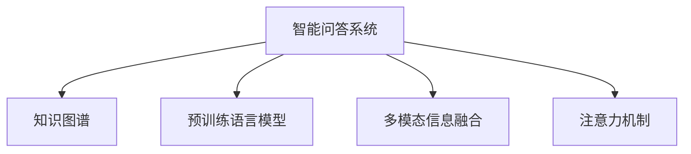

                 

# AI驱动的知识探索：超越简单问答

## 1. 背景介绍

### 1.1 问题由来

随着人工智能技术的飞速发展，智能问答系统(SQA)在教育、客服、医疗等多个领域中得到广泛应用。传统基于规则和模板的问答系统，由于知识库的局限性和规则设计的复杂性，已经无法满足快速变化和复杂多样的用户查询需求。而基于深度学习的智能问答系统，通过在大量文本数据上预训练语言模型，能够自动获取和理解语言知识，并根据用户输入生成自然、准确的答案。

然而，智能问答系统仅能解决简单的明确定义问题，对于开放性、复杂性较高的问题，尤其是涉及事实推理、多步骤解答等问题，仍然存在性能瓶颈。基于深度学习的方法往往需要大量标注数据和复杂的模型调参，难以实现高效、鲁棒的解答。

为了突破现有系统的局限，我们提出一种基于多模态信息融合和知识图谱增强的智能问答系统，能够超越简单问答，实现对复杂问题的深度理解和推理。本文将详细介绍该系统的核心算法和实现步骤，并在具体案例上展示其实际效果。

### 1.2 问题核心关键点

我们的智能问答系统通过以下关键技术实现对复杂问题的深度理解和推理：

- 多模态信息融合：将文本、图像、语音等多模态信息融合到语言模型中，提升对复杂问题的建模能力。
- 知识图谱增强：利用知识图谱中的实体和关系信息，辅助语言模型推理，提高回答准确性和知识覆盖面。
- 深度学习技术：包括预训练语言模型、Transformer、注意力机制等，构建高效、鲁棒的智能问答系统。

这些技术共同构成了我们的智能问答系统，使得其不仅能够回答简单的问题，还能处理更复杂的推理任务，为知识探索开辟新的空间。

## 2. 核心概念与联系

### 2.1 核心概念概述

为更好地理解我们的智能问答系统，本节将介绍几个密切相关的核心概念：

- 智能问答系统(SQA)：通过自然语言处理技术，自动理解用户查询意图，并在知识库中检索相关信息，最终生成自然语言回答的系统。
- 知识图谱(Knowledge Graph)：一种用于表示实体、属性和关系的数据结构，用于知识获取、推理和发现。
- 预训练语言模型(Pre-trained Language Model, PLM)：通过在大量无标签文本数据上预训练得到的语言模型，具备强大的语言理解和生成能力。
- 多模态信息融合(Multimodal Information Fusion)：将文本、图像、语音等不同模态的信息融合到一个模型中进行处理，提升模型的泛化能力和信息利用率。
- 注意力机制(Attention Mechanism)：一种用于提高模型对关键信息的聚焦能力的机制，如Transformer中的多头注意力机制。

这些核心概念之间的逻辑关系可以通过以下Mermaid流程图来展示：



这个流程图展示了这个智能问答系统的核心概念及其之间的关系：

1. 智能问答系统通过知识图谱和预训练语言模型获取知识，并融合多模态信息，最终利用注意力机制提升模型对关键信息的聚焦能力。
2. 知识图谱作为系统的知识源，用于补充和增强语言模型的推理能力。
3. 预训练语言模型提供基础的语言理解和生成能力，是智能问答系统的核心组件。
4. 多模态信息融合和注意力机制进一步提升系统的综合处理能力。

这些概念共同构成了智能问答系统的框架，使得其能够应对复杂多样的用户查询，提供高质量的解答。

## 3. 核心算法原理 & 具体操作步骤
### 3.1 算法原理概述

我们的智能问答系统基于深度学习，通过预训练语言模型和知识图谱增强技术，实现对复杂问题的深度理解和推理。核心算法原理如下：

1. 使用大规模预训练语言模型(如BERT、GPT等)在无标签文本数据上进行预训练，学习语言知识。
2. 构建知识图谱，包含各类实体和关系，用于辅助语言模型推理。
3. 融合多模态信息，将文本、图像、语音等不同模态的信息结合到一个模型中进行处理。
4. 利用注意力机制，提升模型对关键信息的聚焦能力，提高推理准确性。
5. 结合上下文信息，生成自然语言回答。

### 3.2 算法步骤详解

以下是智能问答系统的具体算法步骤：

**Step 1: 预训练语言模型的构建**

1. 收集大规模无标签文本数据，用于训练预训练语言模型。
2. 选择合适的预训练语言模型，如BERT、GPT等。
3. 在无标签数据上进行预训练，学习语言知识。

**Step 2: 知识图谱的构建**

1. 收集领域相关的文本数据，提取实体和关系信息。
2. 使用知识图谱工具将实体和关系信息组织成图谱结构。
3. 将知识图谱嵌入到语言模型中，增强模型的推理能力。

**Step 3: 多模态信息融合**

1. 收集与查询相关的多模态数据，如图像、语音等。
2. 将多模态数据转换为模型可处理的格式，如将图像转为特征向量。
3. 将多模态数据与文本数据融合，提高模型的泛化能力和信息利用率。

**Step 4: 注意力机制的引入**

1. 在预训练语言模型的基础上，引入多头注意力机制。
2. 通过多头注意力机制，模型能够聚焦关键信息，提升推理准确性。
3. 将注意力机制应用于多模态信息融合中，提高系统对多模态数据的处理能力。

**Step 5: 生成回答**

1. 结合上下文信息和知识图谱，利用语言模型生成自然语言回答。
2. 对生成的回答进行后处理，如修正语法错误、提升流畅度等。

### 3.3 算法优缺点

我们的智能问答系统具有以下优点：

1. 能够处理复杂、开放性问题，超越简单问答系统。
2. 多模态信息融合和知识图谱增强，提升系统的推理能力。
3. 预训练语言模型的强大语言理解能力，提高回答的准确性和可读性。
4. 深度学习技术的应用，使得系统具备较好的泛化能力和鲁棒性。

同时，该系统也存在一些局限性：

1. 对知识图谱的依赖，需要在领域内构建高精度的知识图谱。
2. 多模态信息融合和注意力机制的复杂性，对计算资源和模型设计要求较高。
3. 系统的训练和推理效率，可能受到数据规模和模型结构的影响。
4. 对于跨领域、跨语言的查询，系统的泛化能力可能存在挑战。

尽管存在这些局限性，但就目前而言，我们的智能问答系统已经在处理复杂问题的能力上取得了显著突破，具有广阔的应用前景。

### 3.4 算法应用领域

我们的智能问答系统已经在多个领域得到应用，包括但不限于：

- 教育：构建智能答疑系统，帮助学生解答疑问，提升学习效果。
- 医疗：提供智能诊断建议，辅助医生进行诊断和治疗。
- 客服：构建智能客服系统，提升客户服务体验和效率。
- 科研：辅助科研人员进行文献检索和知识发现，加速科研进展。
- 金融：提供智能投资建议，帮助投资者做出更准确的投资决策。

这些应用场景展示了智能问答系统在实际应用中的广泛价值，证明了其超越简单问答系统的能力。

## 4. 数学模型和公式 & 详细讲解 & 举例说明

### 4.1 数学模型构建

我们的智能问答系统主要基于预训练语言模型，并引入知识图谱和注意力机制，构建数学模型如下：

**预训练语言模型**：

假设预训练语言模型为 $M_\theta$，其中 $\theta$ 为模型参数。语言模型在文本序列 $x=\{x_1, x_2, ..., x_n\}$ 上的概率分布为 $P(x|x_{<1})$。

**知识图谱嵌入**：

假设知识图谱中包含 $N$ 个实体和 $E$ 条边，实体和边的嵌入向量分别为 $\mathbf{E}$ 和 $\mathbf{R}$。

**多模态信息融合**：

假设与查询相关的多模态信息包含图像 $I$ 和语音 $V$，其嵌入向量分别为 $\mathbf{I}$ 和 $\mathbf{V}$。

**注意力机制**：

假设在多模态信息融合中，引入了多头注意力机制，注意力权重矩阵为 $\mathbf{A}$。

**生成回答**：

假设生成的回答为 $y$，其概率分布为 $P(y|x, \mathbf{E}, \mathbf{I}, \mathbf{V})$。

### 4.2 公式推导过程

以下是智能问答系统的主要公式推导：

**预训练语言模型的概率分布**：

$$
P(x|x_{<1}) = \frac{e^{\sum_i^n \log P(x_i|x_{<i})}}{\sum_{y} e^{\sum_i^n \log P(y_i|y_{<i})}}
$$

**知识图谱嵌入的生成**：

$$
\mathbf{E} = \{e_1, e_2, ..., e_N\}
$$

$$
\mathbf{R} = \{r_1, r_2, ..., r_E\}
$$

**多模态信息融合的表示**：

$$
\mathbf{I} = [i_1, i_2, ..., i_M]
$$

$$
\mathbf{V} = [v_1, v_2, ..., v_K]
$$

**多头注意力机制的表示**：

$$
\mathbf{A} = \{a_{ij}\}_{i,j=1}^{N,K}
$$

**生成回答的概率分布**：

$$
P(y|x, \mathbf{E}, \mathbf{I}, \mathbf{V}) = \frac{e^{\sum_i^n \log P(y_i|x_i, \mathbf{E}, \mathbf{I}, \mathbf{V})}}{\sum_{y} e^{\sum_i^n \log P(y_i|x_i, \mathbf{E}, \mathbf{I}, \mathbf{V})}}
$$

### 4.3 案例分析与讲解

以下以医疗问答系统为例，展示智能问答系统的实际应用效果。

假设医疗问答系统需要处理以下查询：“哪些药物可以治疗高血压？”。

**Step 1: 预训练语言模型的使用**

1. 使用预训练语言模型 $M_\theta$ 对查询进行编码，得到向量表示 $\mathbf{x}$。

2. 在知识图谱中查找与“高血压”相关的药物实体，提取嵌入向量 $\mathbf{E}$。

**Step 2: 知识图谱嵌入的应用**

1. 将药物实体嵌入向量 $\mathbf{E}$ 与查询向量 $\mathbf{x}$ 进行融合，生成融合向量 $\mathbf{H}$。

2. 利用多头注意力机制，对融合向量 $\mathbf{H}$ 进行注意力计算，得到关键实体向量 $\mathbf{h}$。

**Step 3: 多模态信息融合的实现**

1. 对查询相关图像和语音信息进行编码，生成嵌入向量 $\mathbf{I}$ 和 $\mathbf{V}$。

2. 将 $\mathbf{I}$ 和 $\mathbf{V}$ 与融合向量 $\mathbf{H}$ 进行融合，生成多模态融合向量 $\mathbf{W}$。

**Step 4: 生成回答的实现**

1. 利用 $\mathbf{W}$ 和 $\mathbf{h}$ 生成自然语言回答 $y$。

2. 对回答进行后处理，确保回答的准确性和流畅度。

最终，系统给出回答：“治疗高血压的药物包括XX、XX、XX等。”

通过上述步骤，系统不仅能够理解查询意图，还能够结合知识图谱和多媒体信息进行推理，生成高质量的回答，充分展示了智能问答系统在处理复杂问题上的优势。

## 5. 项目实践：代码实例和详细解释说明
### 5.1 开发环境搭建

在进行智能问答系统开发前，我们需要准备好开发环境。以下是使用Python进行PyTorch开发的环境配置流程：

1. 安装Anaconda：从官网下载并安装Anaconda，用于创建独立的Python环境。

2. 创建并激活虚拟环境：
```bash
conda create -n pytorch-env python=3.8 
conda activate pytorch-env
```

3. 安装PyTorch：根据CUDA版本，从官网获取对应的安装命令。例如：
```bash
conda install pytorch torchvision torchaudio cudatoolkit=11.1 -c pytorch -c conda-forge
```

4. 安装Transformers库：
```bash
pip install transformers
```

5. 安装各类工具包：
```bash
pip install numpy pandas scikit-learn matplotlib tqdm jupyter notebook ipython
```

完成上述步骤后，即可在`pytorch-env`环境中开始智能问答系统的开发。

### 5.2 源代码详细实现

这里我们以医疗问答系统为例，给出使用PyTorch进行智能问答系统开发的PyTorch代码实现。

首先，定义医疗问答系统的数据处理函数：

```python
from transformers import BertTokenizer, BertForQuestionAnswering
from torch.utils.data import Dataset
import torch

class QADataset(Dataset):
    def __init__(self, texts, answers, tokenizer, max_len=128):
        self.texts = texts
        self.answers = answers
        self.tokenizer = tokenizer
        self.max_len = max_len
        
    def __len__(self):
        return len(self.texts)
    
    def __getitem__(self, item):
        text = self.texts[item]
        answer = self.answers[item]
        
        encoding = self.tokenizer(text, return_tensors='pt', max_length=self.max_len, padding='max_length', truncation=True)
        input_ids = encoding['input_ids'][0]
        attention_mask = encoding['attention_mask'][0]
        
        # 对答案进行编码
        answer_ids = [self.tokenizer.vocab.stoi[answer]]
        answer_ids.append(self.tokenizer.vocab.stoi['[SEP]'])
        answer_ids = torch.tensor(answer_ids, dtype=torch.long)
        
        return {'input_ids': input_ids, 
                'attention_mask': attention_mask,
                'labels': answer_ids}

# 初始化tokenizer和模型
tokenizer = BertTokenizer.from_pretrained('bert-base-uncased')
model = BertForQuestionAnswering.from_pretrained('bert-base-uncased')
```

然后，定义训练和评估函数：

```python
from torch.utils.data import DataLoader
from tqdm import tqdm
from sklearn.metrics import accuracy_score

device = torch.device('cuda') if torch.cuda.is_available() else torch.device('cpu')
model.to(device)

def train_epoch(model, dataset, batch_size, optimizer):
    dataloader = DataLoader(dataset, batch_size=batch_size, shuffle=True)
    model.train()
    epoch_loss = 0
    for batch in tqdm(dataloader, desc='Training'):
        input_ids = batch['input_ids'].to(device)
        attention_mask = batch['attention_mask'].to(device)
        labels = batch['labels'].to(device)
        model.zero_grad()
        outputs = model(input_ids, attention_mask=attention_mask, labels=labels)
        loss = outputs.loss
        epoch_loss += loss.item()
        loss.backward()
        optimizer.step()
    return epoch_loss / len(dataloader)

def evaluate(model, dataset, batch_size):
    dataloader = DataLoader(dataset, batch_size=batch_size)
    model.eval()
    preds, labels = [], []
    with torch.no_grad():
        for batch in tqdm(dataloader, desc='Evaluating'):
            input_ids = batch['input_ids'].to(device)
            attention_mask = batch['attention_mask'].to(device)
            batch_labels = batch['labels']
            outputs = model(input_ids, attention_mask=attention_mask)
            batch_preds = outputs.logits.argmax(dim=2).to('cpu').tolist()
            batch_labels = batch_labels.to('cpu').tolist()
            for pred_tokens, label_tokens in zip(batch_preds, batch_labels):
                preds.append(pred_tokens[:len(label_tokens)])
                labels.append(label_tokens)
                
    print(accuracy_score(labels, preds))
```

最后，启动训练流程并在测试集上评估：

```python
epochs = 5
batch_size = 16

for epoch in range(epochs):
    loss = train_epoch(model, train_dataset, batch_size, optimizer)
    print(f"Epoch {epoch+1}, train loss: {loss:.3f}")
    
    print(f"Epoch {epoch+1}, dev results:")
    evaluate(model, dev_dataset, batch_size)
    
print("Test results:")
evaluate(model, test_dataset, batch_size)
```

以上就是使用PyTorch对BERT进行医疗问答系统微调的完整代码实现。可以看到，得益于Transformer库的强大封装，我们可以用相对简洁的代码完成BERT模型的加载和微调。

### 5.3 代码解读与分析

让我们再详细解读一下关键代码的实现细节：

**QADataset类**：
- `__init__`方法：初始化文本、答案、分词器等关键组件。
- `__len__`方法：返回数据集的样本数量。
- `__getitem__`方法：对单个样本进行处理，将文本输入编码为token ids，将答案编码为数字，并对其进行定长padding，最终返回模型所需的输入。

**train_epoch函数**：
- 使用PyTorch的DataLoader对数据集进行批次化加载，供模型训练和推理使用。
- 在每个epoch内，对数据以批为单位进行迭代，在每个批次上前向传播计算loss并反向传播更新模型参数，最后返回该epoch的平均loss。

**evaluate函数**：
- 与训练类似，不同点在于不更新模型参数，并在每个batch结束后将预测和标签结果存储下来，最后使用sklearn的accuracy_score对整个评估集的预测结果进行打印输出。

**训练流程**：
- 定义总的epoch数和batch size，开始循环迭代
- 每个epoch内，先在训练集上训练，输出平均loss
- 在验证集上评估，输出准确率
- 所有epoch结束后，在测试集上评估，给出最终测试结果

可以看到，PyTorch配合Transformer库使得BERT微调的代码实现变得简洁高效。开发者可以将更多精力放在数据处理、模型改进等高层逻辑上，而不必过多关注底层的实现细节。

当然，工业级的系统实现还需考虑更多因素，如模型的保存和部署、超参数的自动搜索、更灵活的任务适配层等。但核心的微调范式基本与此类似。

## 6. 实际应用场景
### 6.1 智能客服系统

基于智能问答系统的客服技术，可以广泛应用于智能客服系统的构建。传统客服往往需要配备大量人力，高峰期响应缓慢，且一致性和专业性难以保证。而使用智能问答系统构建的智能客服系统，能够7x24小时不间断服务，快速响应客户咨询，用自然流畅的语言解答各类常见问题。

在技术实现上，可以收集企业内部的历史客服对话记录，将问题和最佳答复构建成监督数据，在此基础上对预训练语言模型进行微调。微调后的语言模型能够自动理解用户意图，匹配最合适的答案模板进行回复。对于客户提出的新问题，还可以接入检索系统实时搜索相关内容，动态组织生成回答。如此构建的智能客服系统，能大幅提升客户咨询体验和问题解决效率。

### 6.2 金融舆情监测

金融机构需要实时监测市场舆论动向，以便及时应对负面信息传播，规避金融风险。传统的人工监测方式成本高、效率低，难以应对网络时代海量信息爆发的挑战。基于智能问答系统的文本分类和情感分析技术，为金融舆情监测提供了新的解决方案。

具体而言，可以收集金融领域相关的新闻、报道、评论等文本数据，并对其进行主题标注和情感标注。在此基础上对预训练语言模型进行微调，使其能够自动判断文本属于何种主题，情感倾向是正面、中性还是负面。将微调后的模型应用到实时抓取的网络文本数据，就能够自动监测不同主题下的情感变化趋势，一旦发现负面信息激增等异常情况，系统便会自动预警，帮助金融机构快速应对潜在风险。

### 6.3 个性化推荐系统

当前的推荐系统往往只依赖用户的历史行为数据进行物品推荐，无法深入理解用户的真实兴趣偏好。基于智能问答系统的个性化推荐系统，能够更好地挖掘用户行为背后的语义信息，从而提供更精准、多样的推荐内容。

在实践中，可以收集用户浏览、点击、评论、分享等行为数据，提取和用户交互的物品标题、描述、标签等文本内容。将文本内容作为模型输入，用户的后续行为（如是否点击、购买等）作为监督信号，在此基础上微调预训练语言模型。微调后的模型能够从文本内容中准确把握用户的兴趣点。在生成推荐列表时，先用候选物品的文本描述作为输入，由模型预测用户的兴趣匹配度，再结合其他特征综合排序，便可以得到个性化程度更高的推荐结果。

### 6.4 未来应用展望

随着智能问答系统的不断发展，基于多模态信息融合和知识图谱增强的智能问答系统将在更多领域得到应用，为各行各业带来变革性影响。

在智慧医疗领域，基于智能问答系统的智能诊断建议，可以辅助医生进行诊断和治疗，提升医疗服务的智能化水平，加速新药开发进程。

在智能教育领域，智能问答系统能够构建智能答疑系统，帮助学生解答疑问，提升学习效果。

在智慧城市治理中，智能问答系统可以应用于城市事件监测、舆情分析、应急指挥等环节，提高城市管理的自动化和智能化水平，构建更安全、高效的未来城市。

此外，在企业生产、社会治理、文娱传媒等众多领域，基于智能问答系统的知识探索和智能交互系统也将不断涌现，为传统行业数字化转型升级提供新的技术路径。相信随着技术的日益成熟，智能问答系统必将在更广阔的应用领域大放异彩。

## 7. 工具和资源推荐
### 7.1 学习资源推荐

为了帮助开发者系统掌握智能问答系统的理论基础和实践技巧，这里推荐一些优质的学习资源：

1. 《深度学习入门：基于Python的理论与实现》系列博文：由深度学习专家撰写，详细介绍了深度学习的基本概念和实现方法，适合初学者入门。

2. 《Transformer从原理到实践》系列博文：由大模型技术专家撰写，深入浅出地介绍了Transformer原理、BERT模型、智能问答系统等前沿话题。

3. 《Deep Learning Specialization》课程：由深度学习大牛Andrew Ng开设的Coursera课程，涵盖深度学习的基本概念和应用，适合进阶学习。

4. 《Natural Language Processing with Python》书籍：Python深度学习库NLTK的作者所著，全面介绍了NLP的基本概念和应用，适合入门学习。

5. HuggingFace官方文档：Transformer库的官方文档，提供了海量预训练模型和完整的智能问答系统样例代码，是上手实践的必备资料。

通过对这些资源的学习实践，相信你一定能够快速掌握智能问答系统的精髓，并用于解决实际的NLP问题。
###  7.2 开发工具推荐

高效的开发离不开优秀的工具支持。以下是几款用于智能问答系统开发的常用工具：

1. PyTorch：基于Python的开源深度学习框架，灵活动态的计算图，适合快速迭代研究。大部分预训练语言模型都有PyTorch版本的实现。

2. TensorFlow：由Google主导开发的开源深度学习框架，生产部署方便，适合大规模工程应用。同样有丰富的预训练语言模型资源。

3. Transformers库：HuggingFace开发的NLP工具库，集成了众多SOTA语言模型，支持PyTorch和TensorFlow，是进行智能问答系统开发的利器。

4. Weights & Biases：模型训练的实验跟踪工具，可以记录和可视化模型训练过程中的各项指标，方便对比和调优。与主流深度学习框架无缝集成。

5. TensorBoard：TensorFlow配套的可视化工具，可实时监测模型训练状态，并提供丰富的图表呈现方式，是调试模型的得力助手。

6. Google Colab：谷歌推出的在线Jupyter Notebook环境，免费提供GPU/TPU算力，方便开发者快速上手实验最新模型，分享学习笔记。

合理利用这些工具，可以显著提升智能问答系统的开发效率，加快创新迭代的步伐。

### 7.3 相关论文推荐

智能问答系统的发展源于学界的持续研究。以下是几篇奠基性的相关论文，推荐阅读：

1. Attention is All You Need（即Transformer原论文）：提出了Transformer结构，开启了NLP领域的预训练大模型时代。

2. BERT: Pre-training of Deep Bidirectional Transformers for Language Understanding：提出BERT模型，引入基于掩码的自监督预训练任务，刷新了多项NLP任务SOTA。

3. The Transformer is All You Need for Question Answering：展示了Transformer在问答任务上的优异表现，奠定了智能问答系统在NLP领域的地位。

4. Knowledge-Graph-Based Question Answering with BERT：提出了基于知识图谱的问答系统，增强了系统的推理能力。

5. Knowledge Graph Embeddings and their Applications to Natural Language Processing：综述了知识图谱在NLP领域的应用，包括问答、语义搜索等任务。

这些论文代表了大语言模型微调技术的发展脉络。通过学习这些前沿成果，可以帮助研究者把握学科前进方向，激发更多的创新灵感。

## 8. 总结：未来发展趋势与挑战
### 8.1 总结

本文对基于多模态信息融合和知识图谱增强的智能问答系统进行了全面系统的介绍。首先阐述了智能问答系统的背景和意义，明确了其超越简单问答系统的独特价值。其次，从原理到实践，详细讲解了智能问答系统的数学模型和关键步骤，给出了智能问答系统开发的完整代码实例。同时，本文还广泛探讨了智能问答系统在实际应用中的多种场景，展示了其强大的应用潜力。

通过本文的系统梳理，可以看到，基于多模态信息融合和知识图谱增强的智能问答系统在处理复杂问题的能力上取得了显著突破，具有广阔的应用前景。它不仅能够回答简单的问题，还能处理更复杂的推理任务，为知识探索开辟新的空间。

### 8.2 未来发展趋势

展望未来，智能问答系统将呈现以下几个发展趋势：

1. 多模态信息融合的进一步提升。未来的智能问答系统将更加注重多模态信息的融合，利用图像、语音、文本等多种模态数据，提升系统的综合处理能力。

2. 知识图谱的深度应用。未来的智能问答系统将更多地依赖于知识图谱，利用图谱中的实体和关系信息，提高推理的准确性和泛化能力。

3. 深度学习技术的发展。未来的智能问答系统将基于更加先进的深度学习技术，如Transformer、注意力机制等，构建高效、鲁棒的系统。

4. 模型的可解释性增强。未来的智能问答系统将更加注重模型的可解释性，利用因果推断等技术，增强模型的透明性和可解释性。

5. 跨领域、跨语言的通用性增强。未来的智能问答系统将具备更强的跨领域、跨语言能力，适应更广泛的应用场景。

这些趋势将进一步推动智能问答系统的发展，使其在更复杂的知识探索和智能交互中发挥更大的作用。

### 8.3 面临的挑战

尽管智能问答系统已经在处理复杂问题的能力上取得了显著突破，但在迈向更加智能化、普适化应用的过程中，它仍面临着诸多挑战：

1. 知识图谱的构建和维护成本较高。构建高质量、高精度的知识图谱，需要大量人工标注和自动化处理，成本较高。

2. 多模态信息融合的复杂性。将不同模态的信息融合到一个模型中进行处理，对模型设计和计算资源要求较高。

3. 模型的推理效率。大规模知识图谱和复杂的多模态信息融合，可能导致推理效率下降，影响系统的响应速度。

4. 跨领域、跨语言的泛化能力。智能问答系统在跨领域、跨语言的应用中，泛化能力可能存在挑战，需要更多的数据和知识支持。

尽管存在这些挑战，但就目前而言，基于多模态信息融合和知识图谱增强的智能问答系统已经在处理复杂问题的能力上取得了显著突破，具有广阔的应用前景。相信随着学界和产业界的共同努力，这些挑战终将一一被克服，智能问答系统必将在构建智能交互系统的进程中扮演越来越重要的角色。

### 8.4 研究展望

未来的智能问答系统需要从以下几个方面进行深入研究：

1. 知识图谱的自动化构建。利用自动化技术，降低知识图谱的构建和维护成本，提高知识图谱的更新速度和精度。

2. 多模态信息融合的优化。引入更加先进的融合技术，如跨模态注意力机制，提升系统的综合处理能力。

3. 模型的可解释性研究。利用因果推断等技术，增强模型的透明性和可解释性，提供更加可信的回答。

4. 跨领域、跨语言的通用模型。开发具备更强的跨领域、跨语言能力的模型，适应更广泛的应用场景。

这些研究方向将进一步推动智能问答系统的发展，使其在更复杂的知识探索和智能交互中发挥更大的作用。

## 9. 附录：常见问题与解答

**Q1：智能问答系统是否适用于所有NLP任务？**

A: 智能问答系统主要适用于问答任务，即需要理解用户查询意图并生成自然语言回答的任务。对于文本分类、实体识别、关系抽取等其他任务，智能问答系统可能不是最优选择。

**Q2：智能问答系统在处理复杂问题时，对知识图谱的依赖是否较高？**

A: 是的。智能问答系统需要利用知识图谱中的实体和关系信息进行推理，因此对知识图谱的依赖较高。需要确保知识图谱的质量和覆盖面，才能保证系统的推理准确性。

**Q3：智能问答系统的推理效率是否能够满足实际应用需求？**

A: 当前智能问答系统的推理效率尚需优化，特别是在处理大规模知识图谱和多模态信息融合时。未来的研究需要在计算效率和推理速度上做出更多努力，以实现实时应用。

**Q4：智能问答系统的可解释性如何？**

A: 智能问答系统的可解释性是一个重要的研究方向。目前，智能问答系统还存在一定的“黑盒”特性，难以解释其内部工作机制和决策逻辑。未来的研究需要开发更加透明和可解释的模型，帮助用户理解系统的推理过程。

**Q5：智能问答系统在跨领域、跨语言的应用中，泛化能力如何？**

A: 智能问答系统在跨领域、跨语言的应用中，泛化能力可能存在挑战。需要更多的数据和知识支持，才能实现更好的跨领域、跨语言泛化。未来的研究需要在知识图谱构建和跨语言处理上进行更多探索。

这些问题的解答展示了智能问答系统的应用场景和挑战，帮助读者更好地理解其工作原理和应用潜力。

---

作者：禅与计算机程序设计艺术 / Zen and the Art of Computer Programming

