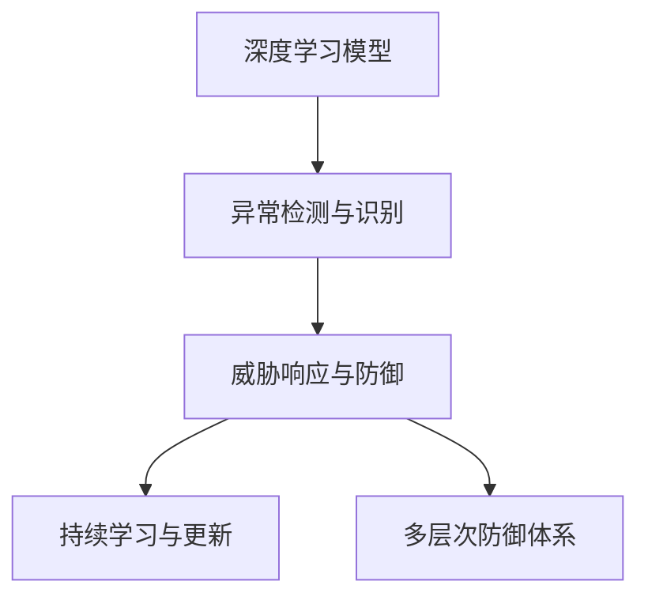

                 

# AI驱动的网络安全：威胁检测与防御

## 1. 背景介绍

### 1.1 问题由来

网络安全形势日益严峻，黑客攻击手段不断升级，对企业和个人的网络资产造成严重威胁。传统的安全防护措施，如防火墙、入侵检测系统(IDS)、恶意软件防护等，虽然有效，但存在一些局限性：

- **误报率高**：由于攻击行为的多样性和复杂性，现有系统容易误报正常行为为攻击，影响业务正常运行。
- **攻击变种识别难度大**：随着攻击技术的进步，新型的、未知的攻击变种层出不穷，现有系统难以有效识别。
- **防御资源不足**：网络流量的大幅增长，使得安全防护系统需要处理的负载增加，硬件和软件资源不足成为瓶颈。
- **实时响应能力有限**：攻击发生后，防护系统往往需要一定时间响应，无法实时阻止恶意行为。

面对这些挑战，利用人工智能技术，特别是基于深度学习的威胁检测与防御技术，成为提升网络安全防护水平的有效手段。AI驱动的网络安全系统能够实时分析网络流量和行为，识别并应对各种威胁，提高防护系统的智能化和自动化水平。

### 1.2 问题核心关键点

AI驱动的网络安全系统主要通过以下几个关键技术实现威胁检测与防御：

1. **深度学习模型**：利用深度神经网络，对网络数据进行建模，识别异常行为和攻击模式。
2. **异常检测与识别**：检测网络数据中的异常特征，区分正常和异常流量。
3. **威胁响应与防御**：根据检测结果，自动化采取防御措施，如隔离、阻断、报警等。
4. **持续学习与更新**：实时更新模型，适应新的攻击手段，保持系统的防御能力。
5. **多层次防御体系**：综合使用多种防御技术，构建多层次、立体化的安全防护体系。

这些技术通过协同工作，形成了一个完整的、高效的AI驱动网络安全防御框架，能够有效应对各类网络威胁。

## 2. 核心概念与联系

### 2.1 核心概念概述

为了更好地理解AI驱动的网络安全系统，本节将介绍几个关键概念：

- **深度学习模型**：一种基于神经网络的机器学习技术，通过多层非线性变换，对复杂数据进行建模和预测。
- **异常检测与识别**：识别网络流量中的异常模式和行为，如异常流量、异常连接等。
- **威胁响应与防御**：根据检测结果，自动化采取防御措施，如隔离、阻断、报警等。
- **持续学习与更新**：利用最新数据和攻击模式，实时更新模型，适应新的攻击手段。
- **多层次防御体系**：综合使用多种防御技术，构建多层次、立体化的安全防护体系。

这些概念通过以下Mermaid流程图来展示：



这个流程图展示了深度学习模型、异常检测、威胁响应、持续学习和多层次防御之间的逻辑关系：

1. 深度学习模型负责对网络数据进行建模，识别异常行为和攻击模式。
2. 异常检测与识别基于深度学习模型，检测网络流量中的异常模式和行为。
3. 威胁响应与防御根据检测结果，自动化采取防御措施。
4. 持续学习与更新利用最新数据和攻击模式，实时更新模型。
5. 多层次防御体系综合使用多种防御技术，构建立体化的安全防护体系。

这些概念共同构成了AI驱动的网络安全系统的核心框架，使得系统能够实时分析网络流量，识别并应对各类威胁。

## 3. 核心算法原理 & 具体操作步骤
### 3.1 算法原理概述

AI驱动的网络安全系统通过深度学习模型实现威胁检测与防御。其核心思想是：利用深度神经网络，对网络流量进行建模，识别其中的异常模式和攻击行为。具体流程如下：

1. **数据收集**：收集网络流量数据，包括日志、包头信息、协议数据等。
2. **特征提取**：使用深度学习模型提取网络流量的关键特征，如流量大小、连接时长、协议类型等。
3. **模型训练**：利用标注数据，训练深度学习模型，学习正常行为和攻击行为的特征分布。
4. **异常检测**：对实时网络流量进行特征提取和模型预测，识别异常流量。
5. **威胁响应**：根据检测结果，采取隔离、阻断、报警等防御措施。
6. **持续学习**：利用最新数据和攻击模式，实时更新模型，保持系统的防御能力。

### 3.2 算法步骤详解

下面详细介绍基于深度学习的AI驱动网络安全系统的具体实现步骤：

**Step 1: 数据收集**

- 使用网络流量监控设备（如网络包捕获卡、网络流量分析器等），收集网络流量数据。
- 将数据存储在数据库或分布式文件系统中，便于后续处理和分析。

**Step 2: 数据预处理**

- 对原始网络流量数据进行清洗和预处理，去除噪声和无用数据。
- 对数据进行特征提取，生成特征向量，作为深度学习模型的输入。

**Step 3: 模型训练**

- 选择适当的深度学习模型（如卷积神经网络、循环神经网络等）。
- 划分训练集、验证集和测试集，进行模型训练和调参。
- 使用标注数据对模型进行监督学习，训练模型识别正常行为和攻击行为。

**Step 4: 异常检测**

- 对实时网络流量进行特征提取，输入深度学习模型进行预测。
- 根据模型输出，判断当前流量是否异常，是则触发异常报警。

**Step 5: 威胁响应**

- 根据异常检测结果，采取相应的防御措施，如隔离、阻断、报警等。
- 将检测结果记录到日志中，供后续分析和审计。

**Step 6: 持续学习**

- 收集最新的攻击模式和数据，进行模型更新。
- 利用新数据对模型进行微调，提升模型的检测能力和泛化能力。

### 3.3 算法优缺点

基于深度学习的AI驱动网络安全系统具有以下优点：

1. **自动化程度高**：系统能够实时分析网络流量，自动识别异常和攻击，无需人工干预。
2. **自适应能力强**：模型能够利用最新数据进行持续学习，适应新的攻击手段。
3. **准确率高**：深度学习模型能够学习复杂的数据分布，提高异常检测和攻击识别的准确率。
4. **处理能力强**：深度学习模型能够处理大规模网络流量，适应复杂的网络环境。

同时，该方法也存在一些局限性：

1. **误报率高**：模型可能会将正常行为误判为攻击，需要进一步优化算法和特征提取方法。
2. **计算资源消耗大**：深度学习模型的训练和推理需要大量的计算资源，硬件设备成本较高。
3. **攻击变种识别困难**：深度学习模型对新型的、未知的攻击变种识别能力有限，需要结合其他技术进行综合防护。
4. **模型可解释性不足**：深度学习模型的决策过程较为复杂，难以进行详细解释和调试。

### 3.4 算法应用领域

AI驱动的网络安全系统已经在多个领域得到了广泛应用，主要包括：

1. **企业网络安全**：保护企业内网和外网的安全，防止数据泄露、入侵等攻击。
2. **云计算安全**：保护云服务提供商和用户的云资源安全，防止DDoS攻击、恶意软件传播等。
3. **物联网安全**：保护物联网设备的安全，防止设备被恶意控制、数据被窃取等。
4. **移动应用安全**：保护移动应用的用户数据和功能，防止攻击和欺诈。
5. **车联网安全**：保护车联网设备的安全，防止数据被窃取、车辆被远程控制等。

## 4. 数学模型和公式 & 详细讲解 & 举例说明

### 4.1 数学模型构建

本节将使用数学语言对基于深度学习的AI驱动网络安全系统进行更加严格的刻画。

假设网络流量数据为 $\{x_i\}_{i=1}^N$，其中 $x_i$ 为第 $i$ 个数据样本。目标是对这些数据进行建模，学习正常行为和攻击行为的特征分布。

定义深度学习模型为 $M_\theta$，其中 $\theta$ 为模型参数。模型的输入为特征向量 $x_i$，输出为模型预测结果 $y_i$。训练集为 $D=\{(x_i, y_i)\}_{i=1}^N$，其中 $y_i$ 为标注数据，指示 $x_i$ 是否为攻击行为。

### 4.2 公式推导过程

以下我们以卷积神经网络(CNN)为例，推导模型的训练和预测过程。

假设CNN模型的结构为 $M_\theta = [Conv_1, MaxPool_1, Conv_2, MaxPool_2, FullyConnected_1, FullyConnected_2]$，其中 $Conv_1$ 和 $Conv_2$ 为卷积层，$MaxPool_1$ 和 $MaxPool_2$ 为池化层，$FullyConnected_1$ 和 $FullyConnected_2$ 为全连接层。模型的输出为攻击行为的概率 $y_i$。

模型的损失函数为交叉熵损失函数：

$$
\mathcal{L}(\theta) = -\frac{1}{N}\sum_{i=1}^N [y_i \log \hat{y_i} + (1-y_i) \log (1-\hat{y_i})]
$$

其中 $\hat{y_i}$ 为模型预测结果，即攻击行为的概率。

模型的前向传播过程为：

$$
h_1 = Conv_1(x_i)
$$
$$
h_1 = MaxPool_1(h_1)
$$
$$
h_2 = Conv_2(h_1)
$$
$$
h_2 = MaxPool_2(h_2)
$$
$$
h_3 = FullyConnected_1(h_2)
$$
$$
\hat{y_i} = Softmax(FullyConnected_2(h_3))
$$

模型的后向传播过程为：

$$
\frac{\partial \mathcal{L}}{\partial \theta} = -\frac{1}{N}\sum_{i=1}^N [(y_i - \hat{y_i}) \frac{\partial \hat{y_i}}{\partial h_3} \frac{\partial h_3}{\partial h_2} \frac{\partial h_2}{\partial h_1} \frac{\partial h_1}{\partial x_i} + (1-y_i) \frac{\partial \hat{y_i}}{\partial h_3} \frac{\partial h_3}{\partial h_2} \frac{\partial h_2}{\partial h_1} \frac{\partial h_1}{\partial x_i}]
$$

其中 $\frac{\partial \hat{y_i}}{\partial h_3}$ 为全连接层的偏导数，$\frac{\partial h_3}{\partial h_2}$ 等为各层的偏导数。

通过反向传播算法，更新模型参数 $\theta$，最小化损失函数 $\mathcal{L}$。

### 4.3 案例分析与讲解

为了更好地理解深度学习模型在网络安全中的应用，下面我们以DDoS攻击检测为例，进行详细讲解。

**案例背景**：DDoS攻击是一种常见的网络攻击，通过大量伪造的流量请求，使目标服务器瘫痪，造成业务中断。为了检测和防御DDoS攻击，可以利用深度学习模型对网络流量进行建模，识别异常流量和攻击行为。

**数据集**：DDoS攻击数据集包括正常流量和攻击流量的样本，标注数据指示每个样本是否为DDoS攻击。

**模型选择**：选择适当的深度学习模型，如卷积神经网络或循环神经网络，对网络流量进行建模。

**训练过程**：划分训练集、验证集和测试集，对模型进行监督学习训练。在训练过程中，使用梯度下降等优化算法，更新模型参数，最小化交叉熵损失。

**预测过程**：对实时网络流量进行特征提取，输入深度学习模型进行预测。根据模型输出，判断当前流量是否为DDoS攻击。

## 5. 项目实践：代码实例和详细解释说明
### 5.1 开发环境搭建

在进行AI驱动网络安全系统的开发实践前，我们需要准备好开发环境。以下是使用Python进行TensorFlow开发的环境配置流程：

1. 安装Anaconda：从官网下载并安装Anaconda，用于创建独立的Python环境。

2. 创建并激活虚拟环境：
```bash
conda create -n tensorflow-env python=3.8 
conda activate tensorflow-env
```

3. 安装TensorFlow：根据CUDA版本，从官网获取对应的安装命令。例如：
```bash
conda install tensorflow tensorflow-2.8 -c conda-forge
```

4. 安装TensorBoard：
```bash
conda install tensorboard
```

5. 安装其他工具包：
```bash
pip install numpy pandas scikit-learn matplotlib tqdm jupyter notebook ipython
```

完成上述步骤后，即可在`tensorflow-env`环境中开始开发实践。

### 5.2 源代码详细实现

下面我们以DDoS攻击检测为例，给出使用TensorFlow进行网络安全威胁检测的PyTorch代码实现。

首先，定义模型和优化器：

```python
import tensorflow as tf
from tensorflow.keras.layers import Conv2D, MaxPooling2D, Flatten, Dense
from tensorflow.keras.models import Sequential

# 定义模型
model = Sequential([
    Conv2D(32, (3, 3), activation='relu', input_shape=(28, 28, 1)),
    MaxPooling2D((2, 2)),
    Conv2D(64, (3, 3), activation='relu'),
    MaxPooling2D((2, 2)),
    Flatten(),
    Dense(128, activation='relu'),
    Dense(1, activation='sigmoid')
])

# 定义优化器
optimizer = tf.keras.optimizers.Adam(learning_rate=0.001)

# 编译模型
model.compile(optimizer=optimizer, loss='binary_crossentropy', metrics=['accuracy'])
```

然后，定义训练和评估函数：

```python
import numpy as np

def train_epoch(model, dataset, batch_size):
    model.fit(dataset['inputs'], dataset['targets'], batch_size=batch_size, epochs=1, verbose=0)

def evaluate(model, dataset, batch_size):
    loss, acc = model.evaluate(dataset['inputs'], dataset['targets'], batch_size=batch_size, verbose=0)
    print(f'Test loss: {loss:.4f}')
    print(f'Test accuracy: {acc:.4f}')
```

最后，启动训练流程并在测试集上评估：

```python
# 加载数据集
train_dataset = ...
test_dataset = ...

# 训练模型
epochs = 10
batch_size = 32

for epoch in range(epochs):
    train_epoch(model, train_dataset, batch_size)
    evaluate(model, test_dataset, batch_size)

print('Model trained and evaluated.')
```

以上就是使用TensorFlow对DDoS攻击检测任务进行微调的完整代码实现。可以看到，得益于TensorFlow的强大封装，我们可以用相对简洁的代码完成模型的训练和评估。

### 5.3 代码解读与分析

让我们再详细解读一下关键代码的实现细节：

**train_epoch函数**：
- 对数据集进行单批次训练，损失和准确率由模型自动输出。

**evaluate函数**：
- 对模型进行单批次评估，并输出损失和准确率。

**模型定义**：
- 定义了卷积神经网络模型，包含卷积层、池化层和全连接层。

**训练和评估流程**：
- 定义训练和评估的参数，如学习率、批次大小等。
- 在指定epoch内循环迭代，每轮迭代都先训练，再评估，最后输出结果。

可以看到，TensorFlow的高级API使得模型训练和评估变得非常简便，开发者可以将更多精力放在数据处理、模型设计等高层逻辑上，而不必过多关注底层的实现细节。

## 6. 实际应用场景
### 6.1 企业网络安全

AI驱动的网络安全系统在企业网络安全中得到了广泛应用。传统企业网络安全系统依赖人工监控和分析，效率低下，容易漏报和误报。利用深度学习模型，系统能够实时分析网络流量，自动识别异常行为和攻击，提高安全防护能力。

**应用场景**：
- 对企业内网和外网流量进行实时监控，检测并阻止DDoS攻击、恶意软件传播等攻击行为。
- 对企业数据进行加密和保护，防止数据泄露和未授权访问。
- 对企业网络设备进行安全配置和管理，防止设备被恶意控制。

**技术实现**：
- 利用深度学习模型对企业网络流量进行建模，训练模型识别正常和异常流量。
- 对实时流量进行特征提取和模型预测，检测异常行为和攻击。
- 根据检测结果，自动化采取隔离、阻断、报警等防御措施。

### 6.2 云计算安全

云计算平台的安全防护是一个重要课题，云服务提供商需要保护自身的云资源和用户的云资源安全。利用深度学习模型，云计算平台可以构建高效、智能的安全防护系统。

**应用场景**：
- 检测和防御DDoS攻击，防止云资源被大量恶意请求占用。
- 检测和防御恶意软件，防止云资源被恶意软件感染和控制。
- 检测和防御数据泄露，防止敏感数据被窃取和传播。

**技术实现**：
- 利用深度学习模型对云计算平台的网络流量进行建模，训练模型识别正常和异常流量。
- 对实时流量进行特征提取和模型预测，检测异常行为和攻击。
- 根据检测结果，自动化采取隔离、阻断、报警等防御措施。

### 6.3 物联网安全

物联网设备的安全防护是一个重要课题，设备之间通信频繁，容易受到攻击和控制。利用深度学习模型，物联网设备的安全防护系统可以更加智能和高效。

**应用场景**：
- 检测和防御恶意软件，防止物联网设备被恶意软件感染和控制。
- 检测和防御数据泄露，防止物联网设备上的数据被窃取和传播。
- 检测和防御恶意攻击，防止物联网设备被远程控制和破坏。

**技术实现**：
- 利用深度学习模型对物联网设备的网络流量进行建模，训练模型识别正常和异常流量。
- 对实时流量进行特征提取和模型预测，检测异常行为和攻击。
- 根据检测结果，自动化采取隔离、阻断、报警等防御措施。

## 7. 工具和资源推荐
### 7.1 学习资源推荐

为了帮助开发者系统掌握深度学习在网络安全中的应用，这里推荐一些优质的学习资源：

1. 《深度学习》系列课程：由斯坦福大学开设的深度学习课程，内容全面，涵盖深度学习的基本概念和经典模型。

2. 《深度学习实战》书籍：Hands-On深度学习实践，通过实例讲解深度学习模型的实现和应用。

3. 《TensorFlow深度学习》书籍：官方TensorFlow文档，提供了丰富的示例代码和详细说明。

4. 《机器学习实战》博客：Kaggle社区的深度学习实战博客，提供了大量深度学习模型的实践案例和代码实现。

5. 《深度学习网络安全》在线课程：由Coursera平台提供的深度学习在网络安全中的应用课程，涵盖多种网络安全技术。

通过对这些资源的学习实践，相信你一定能够快速掌握深度学习在网络安全中的应用，并用于解决实际的NLP问题。

### 7.2 开发工具推荐

高效的开发离不开优秀的工具支持。以下是几款用于深度学习在网络安全中的应用开发的常用工具：

1. TensorFlow：由Google主导开发的开源深度学习框架，生产部署方便，适合大规模工程应用。

2. PyTorch：基于Python的开源深度学习框架，灵活动态的计算图，适合快速迭代研究。

3. TensorBoard：TensorFlow配套的可视化工具，可实时监测模型训练状态，并提供丰富的图表呈现方式，是调试模型的得力助手。

4. Weights & Biases：模型训练的实验跟踪工具，可以记录和可视化模型训练过程中的各项指标，方便对比和调优。

5. Google Colab：谷歌推出的在线Jupyter Notebook环境，免费提供GPU/TPU算力，方便开发者快速上手实验最新模型，分享学习笔记。

合理利用这些工具，可以显著提升深度学习在网络安全中的应用开发效率，加快创新迭代的步伐。

### 7.3 相关论文推荐

深度学习在网络安全中的应用已经得到了广泛的研究和应用。以下是几篇奠基性的相关论文，推荐阅读：

1. 《Deep learning for cybersecurity: A review》：一篇综述论文，总结了深度学习在网络安全中的多种应用，如入侵检测、恶意软件分析等。

2. 《Adversarial examples in deep learning and neural networks》：介绍深度学习模型中的对抗攻击和防御方法，为网络安全防护提供理论基础。

3. 《Anomaly detection and classification using deep learning: A review》：总结了深度学习在异常检测和分类中的应用，为网络安全防护提供技术支持。

4. 《Autoencoder-based intrusion detection system: A survey》：综述了基于自编码器的入侵检测系统，展示了深度学习在网络安全中的实际应用。

5. 《Cyber security: A review of recent literature and future directions》：综述了最近的网络安全文献，探讨了未来的研究方向和趋势。

这些论文代表了大规模网络安全研究的发展脉络。通过学习这些前沿成果，可以帮助研究者把握学科前进方向，激发更多的创新灵感。

## 8. 总结：未来发展趋势与挑战

### 8.1 总结

本文对基于深度学习的AI驱动网络安全系统进行了全面系统的介绍。首先阐述了网络安全形势严峻的现状，以及深度学习在网络安全中的应用背景。接着从原理到实践，详细讲解了深度学习模型的训练和预测过程，并给出了实际应用场景和代码实例。同时，本文还广泛探讨了深度学习在网络安全中的应用前景，展示了深度学习技术的巨大潜力。

通过本文的系统梳理，可以看到，基于深度学习的AI驱动网络安全系统正在成为网络安全防护的重要手段，极大地提高了网络安全防护的智能化和自动化水平。未来，伴随深度学习技术的不断发展，AI驱动的网络安全技术必将在更多领域得到应用，为网络安全防护带来革命性变革。

### 8.2 未来发展趋势

展望未来，深度学习在网络安全中的应用将呈现以下几个发展趋势：

1. **多模态融合**：深度学习模型可以处理多种类型的数据，如网络流量、日志、行为等，通过多模态数据融合，提升模型的检测能力和泛化能力。

2. **自适应模型**：深度学习模型可以实时更新，适应新的攻击手段和数据分布，提高模型的动态防御能力。

3. **分布式训练**：大规模网络流量和数据需要分布式计算资源进行处理，深度学习模型需要支持分布式训练，提高计算效率和处理能力。

4. **模型压缩和优化**：深度学习模型参数量巨大，需要优化模型结构，压缩模型体积，提高推理效率。

5. **可解释性和可视化**：深度学习模型的决策过程复杂，需要进一步提升模型的可解释性，通过可视化手段展示模型的检测过程和结果。

6. **协同防御**：深度学习模型可以与其他安全技术，如入侵检测系统、防火墙等，协同工作，形成综合防护体系。

以上趋势凸显了深度学习在网络安全中的广阔前景。这些方向的探索发展，必将进一步提升网络安全防护系统的性能和应用范围，为网络安全带来新的突破。

### 8.3 面临的挑战

尽管深度学习在网络安全中的应用已经取得了显著成果，但在迈向更加智能化、普适化应用的过程中，它仍面临诸多挑战：

1. **误报率高**：深度学习模型可能会将正常行为误判为攻击，需要进一步优化算法和特征提取方法。
2. **计算资源消耗大**：深度学习模型的训练和推理需要大量的计算资源，硬件设备成本较高。
3. **攻击变种识别困难**：深度学习模型对新型的、未知的攻击变种识别能力有限，需要结合其他技术进行综合防护。
4. **模型可解释性不足**：深度学习模型的决策过程复杂，难以进行详细解释和调试。
5. **数据隐私和安全**：深度学习模型需要大量的标注数据进行训练，如何保护数据隐私和安全，避免数据泄露和滥用，是一个重要问题。

### 8.4 研究展望

面对深度学习在网络安全中面临的挑战，未来的研究需要在以下几个方面寻求新的突破：

1. **优化算法和特征提取方法**：进一步优化深度学习算法的性能，提高异常检测和攻击识别的准确率。
2. **模型压缩和优化**：开发更加高效的深度学习模型结构，压缩模型体积，提高推理效率。
3. **自适应模型和协同防御**：开发能够实时更新和适应的深度学习模型，与其他安全技术协同工作，形成综合防护体系。
4. **数据隐私和安全**：研究保护数据隐私和安全的方法，防止数据泄露和滥用。
5. **可解释性和可视化**：提升深度学习模型的可解释性，通过可视化手段展示模型的检测过程和结果。

这些研究方向的探索，必将引领深度学习在网络安全中的不断发展，为网络安全防护带来新的突破。相信随着技术的日益成熟，深度学习在网络安全中的应用将更加广泛和深入，为构建安全、可靠、高效的网络环境提供有力保障。

