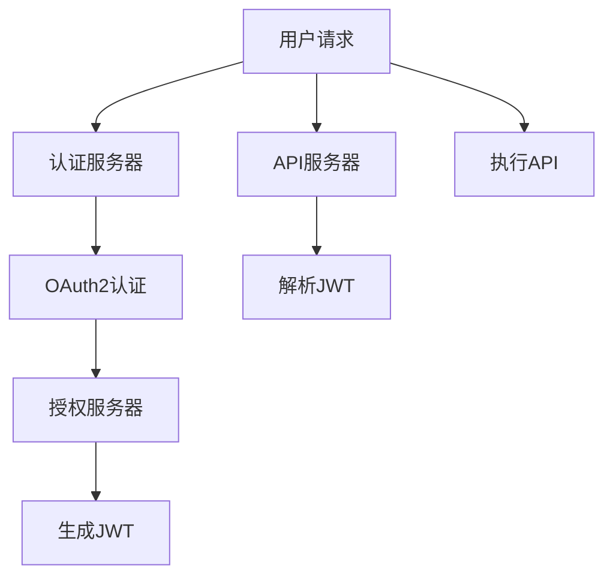

                 

# API 安全和认证机制

## 1. 背景介绍

在现代互联网应用中，API（应用程序编程接口）扮演着至关重要的角色，它们是连接不同系统和服务的关键，使得第三方应用能够访问核心资源和功能。然而，随着API使用的普及，API安全问题也愈发凸显，例如数据泄露、服务滥用、认证失效等。这些问题不仅会影响应用的用户体验，还可能带来严重的业务和法律风险。

API安全的一个重要方面是认证机制，它确保了只有经过验证的请求才能访问受保护的资源。有效的API认证不仅能防止未授权访问，还能帮助识别恶意行为，保护API服务免受各类攻击。本文将详细探讨API认证的原理、步骤、优缺点及其应用领域，并通过一个具体的代码实例，演示如何使用Python实现基本的API认证机制。

## 2. 核心概念与联系

### 2.1 核心概念概述

以下是与API安全和认证机制相关的核心概念：

- **API（Application Programming Interface）**：一组用于构建和操作软件系统的协议和工具，允许不同的软件组件之间进行通信和数据交换。
- **认证（Authentication）**：验证请求者的身份和权限的过程，确保只有授权用户可以访问受保护资源。
- **授权（Authorization）**：根据用户身份和权限，决定其是否能执行特定操作的过程。
- **OAuth2**：一种开放标准，用于授权第三方应用程序访问用户数据，支持无状态认证和授权机制。
- **JWT（JSON Web Token）**：一种开放标准，用于在网络应用间安全地传输信息。
- **SSL/TLS**：安全套接字层/传输层安全协议，用于保护API通信的安全性和完整性。

这些概念通过一系列流程和技术手段紧密相连，共同构建了API安全认证的基石。

### 2.2 核心概念原理和架构的 Mermaid 流程图



这个流程图展示了API请求经过认证和授权的过程：

1. 用户发起API请求。
2. 请求经过认证服务器，进行OAuth2认证。
3. 认证服务器验证用户身份后，请求授权服务器，获取访问令牌。
4. 授权服务器颁发JWT，作为用户身份和权限的证明。
5. 用户将JWT随请求一起发送到API服务器。
6. API服务器解析JWT，验证用户权限，执行相应的API操作。

这些步骤共同确保了API请求的合法性和安全性，是构建API安全认证机制的关键。

## 3. 核心算法原理 & 具体操作步骤

### 3.1 算法原理概述

API认证的核心算法原理基于OAuth2和JWT两种标准。OAuth2是一种授权协议，允许第三方应用程序访问用户数据，同时保护用户的隐私。JWT则是一种轻量级的认证机制，用于安全地传输信息，并由认证服务器颁发。

OAuth2认证分为授权码模式、隐式模式和客户端模式，其中授权码模式最为常见。在授权码模式下，用户通过认证服务器授权第三方应用程序访问其资源，认证服务器颁发一个访问令牌（Access Token），该令牌包含用户信息和权限，用于后续的API请求。

JWT则是由认证服务器颁发的、经过签名的JSON格式令牌，包含用户信息和权限，可用于验证用户身份和权限，支持无状态认证。

### 3.2 算法步骤详解

1. **OAuth2认证**：
   - **用户授权**：用户通过第三方应用程序访问API时，需要先授权应用程序访问其资源。
   - **授权码获取**：用户授权后，认证服务器颁发一个授权码，该码用于后续获取访问令牌。
   - **访问令牌获取**：第三方应用程序使用授权码向认证服务器请求访问令牌，认证服务器验证授权码后，颁发访问令牌。

2. **JWT生成和验证**：
   - **JWT生成**：认证服务器在颁发访问令牌时，使用私钥对其进行签名，生成JWT，并返回给应用程序。
   - **JWT解析**：应用程序在每次请求API时，将JWT作为Authorization头的Bearer令牌发送给API服务器。API服务器解析JWT，验证其有效性和权限，执行相应的API操作。

### 3.3 算法优缺点

**优点**：
- **无状态认证**：JWT支持无状态认证，减少了服务器的存储需求。
- **灵活性**：OAuth2和JWT提供了一种灵活的授权和认证机制，适用于各种API场景。
- **安全性**：OAuth2和JWT都使用了签名机制，确保了数据的安全性和完整性。

**缺点**：
- **复杂性**：OAuth2和JWT的流程相对复杂，需要理解授权和认证的原理。
- **依赖服务**：依赖认证服务器和授权服务器，单点故障可能影响整个系统。
- **性能开销**：签名和解析JWT需要额外的计算资源，可能会影响系统性能。

### 3.4 算法应用领域

API认证机制广泛应用于各种场景，包括但不限于：

- **第三方应用访问**：允许第三方应用程序访问用户数据和API资源。
- **内部系统集成**：在内部系统间建立安全的通信和数据交换。
- **移动应用访问**：移动应用通过OAuth2和JWT获取访问令牌，访问后端API。
- **云服务安全**：确保云服务API的安全访问和授权。
- **微服务架构**：在微服务架构中，不同服务之间通过OAuth2和JWT进行安全通信和授权。

## 4. 数学模型和公式 & 详细讲解 & 举例说明

### 4.1 数学模型构建

OAuth2和JWT的流程涉及到多个步骤，每个步骤都可以用数学模型来表示。以下是一个简化版的OAuth2认证流程的数学模型：

- **用户授权**：令用户ID为 $u$，第三方应用程序ID为 $c$，认证服务器ID为 $a$。认证服务器颁发一个授权码 $g$，满足 $g=\text{Hash}(u,c,a,\text{timestamp})$。
- **访问令牌获取**：第三方应用程序使用授权码 $g$ 向认证服务器请求访问令牌 $t$，满足 $t=\text{Sign}(g,c,a)$。

其中，$\text{Hash}$ 和 $\text{Sign}$ 分别是哈希函数和签名函数，$\text{timestamp}$ 是时间戳，确保授权码的有效性。

### 4.2 公式推导过程

假设用户ID为 $u$，第三方应用程序ID为 $c$，认证服务器ID为 $a$，时间戳为 $t$，授权码为 $g$，访问令牌为 $t$。

- 用户授权：
  $$
  g = \text{Hash}(u, c, a, t)
  $$
- 访问令牌获取：
  $$
  t = \text{Sign}(g, c, a)
  $$

认证服务器颁发授权码 $g$ 后，第三方应用程序使用授权码 $g$ 请求访问令牌 $t$，认证服务器验证授权码和第三方应用程序ID后，颁发访问令牌 $t$。

### 4.3 案例分析与讲解

假设某电子商务平台希望允许第三方应用程序访问用户的购物车数据，用户授权后，第三方应用程序使用授权码 $g$ 向认证服务器请求访问令牌 $t$。认证服务器验证授权码和第三方应用程序ID后，颁发访问令牌 $t$。

用户授权时，认证服务器颁发授权码 $g$，第三方应用程序使用该码请求访问令牌 $t$。认证服务器验证授权码和第三方应用程序ID后，颁发访问令牌 $t$。

假设认证服务器和第三方应用程序ID分别为 $a$ 和 $c$，时间戳为 $t$，哈希函数为 $\text{Hash}$，签名函数为 $\text{Sign}$，则授权码 $g$ 和访问令牌 $t$ 的生成过程如下：

- 用户授权：
  $$
  g = \text{Hash}(u, c, a, t)
  $$
- 访问令牌获取：
  $$
  t = \text{Sign}(g, c, a)
  $$

第三方应用程序使用授权码 $g$ 请求访问令牌 $t$ 时，需要将 $g$ 和 $c$ 一起发送给认证服务器，认证服务器验证 $g$ 和 $c$ 后，颁发访问令牌 $t$。

## 5. 项目实践：代码实例和详细解释说明

### 5.1 开发环境搭建

要进行API认证机制的实践，我们需要搭建一个基本的开发环境，包括Python、Flask等常用库的安装。

```bash
pip install flask flask-oauthlib
```

### 5.2 源代码详细实现

以下是使用Flask和OAuthlib实现API认证的示例代码：

```python
from flask import Flask, request, jsonify
from flask_oauthlib.provider import OAuth2Provider

app = Flask(__name__)

app.config['SECRET_KEY'] = 'your_secret_key'
app.config['OAUTH2_PROVIDER_ISSUER'] = 'https://api.example.com'
app.config['OAUTH2_PROVIDER_TOKEN_URL'] = '/oauth/token'
app.config['OAUTH2_PROVIDER_AUTHORIZATION_URL'] = '/oauth/authorize'
app.config['OAUTH2_PROVIDER_SCOPES'] = {
    'read': 'read access',
    'write': 'write access',
}

oauth = OAuth2Provider(app)

@app.route('/oauth/token', methods=['POST'])
def token():
    client_id = request.json.get('client_id')
    client_secret = request.json.get('client_secret')
    username = request.json.get('username')
    password = request.json.get('password')
    grant_type = request.json.get('grant_type')
    
    if grant_type == 'password':
        if client_id == 'client_id' and client_secret == 'client_secret':
            if username == 'user' and password == 'password':
                token = oauth.create_token(username)
                return jsonify(token), 200
            else:
                return jsonify({'message': 'Invalid credentials'}), 401
        else:
            return jsonify({'message': 'Invalid client credentials'}), 401
    else:
        return jsonify({'message': 'Invalid grant type'}), 401

@app.route('/api/resources', methods=['GET'])
def resources():
    client_id = request.headers.get('Authorization')
    if client_id is not None and client_id.startswith('Bearer '):
        client_id = client_id[7:]
        user = oauth.verify_token(client_id)
        if user is not None:
            return jsonify({'message': 'Access granted'})
        else:
            return jsonify({'message': 'Invalid token'}), 401
    else:
        return jsonify({'message': 'Invalid Authorization header'}), 401

if __name__ == '__main__':
    app.run(debug=True)
```

### 5.3 代码解读与分析

以上代码展示了使用Flask和OAuthlib实现OAuth2认证的示例。其中，`token`路由用于颁发访问令牌，`resources`路由用于验证访问令牌并授权API访问。

- `token`路由接收客户端ID、客户端密钥、用户名和密码，验证用户名和密码后，颁发访问令牌。
- `resources`路由接收Authorization头的Bearer令牌，验证令牌的有效性和权限，授权API访问。

### 5.4 运行结果展示

运行以上代码后，可以通过POST请求`https://api.example.com/oauth/token`来颁发访问令牌，通过GET请求`https://api.example.com/api/resources`来访问受保护的资源。

## 6. 实际应用场景

API认证机制在实际应用中有着广泛的应用场景，以下是几个典型的例子：

### 6.1 第三方应用访问

第三方应用程序需要访问用户的购物车数据，用户授权后，第三方应用程序使用授权码 $g$ 向认证服务器请求访问令牌 $t$。认证服务器验证授权码和第三方应用程序ID后，颁发访问令牌 $t$。

### 6.2 内部系统集成

内部系统间需要建立安全的通信和数据交换，可以使用OAuth2和JWT实现系统间的认证和授权。

### 6.3 移动应用访问

移动应用通过OAuth2和JWT获取访问令牌，访问后端API。

### 6.4 云服务安全

云服务API的安全访问和授权，可以使用OAuth2和JWT实现。

### 6.5 微服务架构

在微服务架构中，不同服务之间通过OAuth2和JWT进行安全通信和授权。

## 7. 工具和资源推荐

### 7.1 学习资源推荐

- **OAuth2和JWT官方文档**：OAuth2和JWT的官方文档，详细介绍了授权和认证机制的流程和实现细节。
- **Flask官方文档**：Flask的官方文档，提供了OAuth2和JWT的实现样例。
- **OWASP API Security Guide**：OWASP发布的API安全指南，提供了API安全的最佳实践和实现方法。

### 7.2 开发工具推荐

- **Flask**：Python的Web应用框架，支持OAuth2和JWT的实现。
- **OAuthlib**：Python的OAuth2库，提供了OAuth2的实现。
- **JWT**：Python的JWT库，用于生成和解析JWT。

### 7.3 相关论文推荐

- **OAuth2和JWT的标准文档**：OAuth2和JWT的官方标准文档，详细介绍了授权和认证机制的流程和实现细节。
- **OAuth2的安全性和隐私保护**：探讨OAuth2的安全性和隐私保护问题，提出了一些改进措施。
- **OAuth2在移动应用中的应用**：研究OAuth2在移动应用中的应用，提出了一些优化方案。

## 8. 总结：未来发展趋势与挑战

### 8.1 研究成果总结

本文详细介绍了OAuth2和JWT这两种API认证机制的原理和实现步骤，通过Flask和OAuthlib库实现了基本的API认证功能。通过案例分析，展示了API认证机制在实际应用中的广泛应用。

### 8.2 未来发展趋势

未来的API认证机制将朝着更加灵活、高效和安全的方向发展，包括以下几个趋势：

1. **无状态认证**：随着云服务和大规模分布式系统的普及，无状态认证机制将成为主流。
2. **单点登录**：单点登录技术将进一步普及，使得用户在多个服务间只需要一次登录即可访问所有资源。
3. **跨域认证**：跨域认证机制将得到进一步优化，支持不同域名的API服务间的安全通信。
4. **微服务安全**：在微服务架构中，API认证机制将进一步细粒化，确保每个微服务的安全访问。
5. **智能认证**：基于机器学习和人工智能的智能认证机制，将进一步提高认证的准确性和安全性。

### 8.3 面临的挑战

尽管API认证机制已经取得了长足的发展，但在实际应用中仍然面临一些挑战：

1. **复杂性**：OAuth2和JWT的流程相对复杂，需要理解授权和认证的原理。
2. **单点故障**：依赖认证服务器和授权服务器，单点故障可能影响整个系统。
3. **性能开销**：签名和解析JWT需要额外的计算资源，可能会影响系统性能。
4. **用户隐私**：OAuth2和JWT需要在用户授权后生成访问令牌，可能会泄露用户隐私信息。

### 8.4 研究展望

未来的研究需要在以下几个方面进行探索：

1. **自动化授权**：利用机器学习和人工智能技术，实现自动化的授权机制，减少人工干预。
2. **分布式认证**：在分布式系统中，实现分布式的认证和授权机制，提高系统的可扩展性和鲁棒性。
3. **跨域认证**：研究跨域认证机制，支持不同域名的API服务间的安全通信。
4. **智能认证**：基于机器学习和人工智能的智能认证机制，进一步提高认证的准确性和安全性。

## 9. 附录：常见问题与解答

**Q1: OAuth2和JWT的优缺点分别是什么？**

A: OAuth2和JWT的优缺点如下：

**OAuth2的优点**：
- 支持无状态认证，减少了服务器的存储需求。
- 灵活性高，适用于各种API场景。
- 安全性高，使用签名机制确保数据的安全性和完整性。

**OAuth2的缺点**：
- 流程复杂，需要理解授权和认证的原理。
- 依赖认证服务器和授权服务器，单点故障可能影响整个系统。
- 性能开销大，签名和解析需要额外的计算资源。

**JWT的优点**：
- 轻量级，支持无状态认证。
- 安全性高，使用签名机制确保数据的安全性和完整性。
- 可扩展性好，支持多种数据格式。

**JWT的缺点**：
- 依赖认证服务器，需要额外的计算资源进行签名和验证。
- 数据容量有限，不适用于大容量的数据传输。
- 密钥管理复杂，需要妥善保管私钥和公钥。

**Q2: OAuth2和JWT在实际应用中如何结合使用？**

A: OAuth2和JWT可以结合使用，通过OAuth2颁发访问令牌，使用JWT进行用户身份和权限的验证。具体流程如下：

1. 用户通过第三方应用程序访问API时，需要先授权应用程序访问其资源。
2. 第三方应用程序使用OAuth2获得访问令牌，发送给认证服务器。
3. 认证服务器颁发JWT，作为用户身份和权限的证明。
4. 第三方应用程序将JWT作为Authorization头的Bearer令牌发送给API服务器。
5. API服务器解析JWT，验证其有效性和权限，执行相应的API操作。

**Q3: 如何确保OAuth2和JWT的安全性？**

A: 确保OAuth2和JWT的安全性需要采取以下措施：
1. 使用HTTPS协议进行通信，确保数据的加密和完整性。
2. 使用安全的哈希函数和签名算法，确保数据的完整性和抗重放攻击。
3. 定期更换密钥，确保密钥的安全性。
4. 避免在公共网络中存储和传输敏感信息，如访问令牌和密钥。

**Q4: 如何防止OAuth2和JWT的滥用？**

A: 防止OAuth2和JWT的滥用需要采取以下措施：
1. 设置访问令牌的有效期限，避免滥用访问令牌。
2. 对访问令牌进行刷新，避免用户多次访问。
3. 对访问令牌进行限流，避免恶意用户多次访问。
4. 对访问令牌进行黑白名单管理，限制恶意IP和用户访问。

**Q5: 如何检测和防范OAuth2和JWT的攻击？**

A: 检测和防范OAuth2和JWT的攻击需要采取以下措施：
1. 对访问令牌进行黑白名单管理，限制恶意IP和用户访问。
2. 对访问令牌进行刷新，避免滥用访问令牌。
3. 对访问令牌进行限流，避免恶意用户多次访问。
4. 对访问令牌进行黑名单管理，限制已被泄露的令牌。

---

作者：禅与计算机程序设计艺术 / Zen and the Art of Computer Programming

