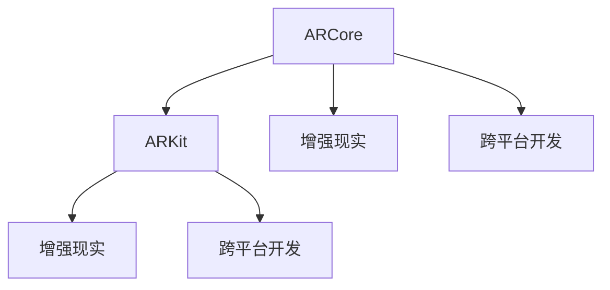

                 

# ARCore与ARKit：移动AR应用开发对比

> 关键词：ARCore, ARKit, 移动AR应用, 增强现实, 对比, 开发, 平台特性

## 1. 背景介绍

随着增强现实（AR）技术在教育、娱乐、购物、医疗等领域的广泛应用，越来越多的开发者开始涉足AR应用开发。苹果公司的ARKit和谷歌的ARCore是目前主流的两个移动AR开发框架，它们都提供了一整套工具和API，帮助开发者轻松创建AR应用。尽管它们在架构和功能上存在一些差异，但总体上都能让开发者快速构建出沉浸式的AR体验。

## 2. 核心概念与联系

### 2.1 核心概念概述

- **ARCore**: 由谷歌开发的移动AR开发平台，可为Android设备提供AR体验。ARCore提供了丰富的API和工具，帮助开发者快速创建AR应用，支持三维物体在真实世界中的叠加、碰撞检测等。
- **ARKit**: 由苹果公司开发的移动AR开发平台，为iOS设备提供AR体验。ARKit提供了ARKit View、World Tracking、Anchor等API和工具，支持将三维物体叠加到现实世界中，并进行场景理解、图像识别等。
- **增强现实**: 一种将虚拟信息与现实世界紧密结合的技术，通过计算机视觉和3D图形技术，让用户可以在现实世界中看到虚拟物体。
- **跨平台开发**: 指的是在不同的操作系统（如iOS和Android）上开发可兼容的应用，以降低开发成本。

这些核心概念之间的逻辑关系可以通过以下Mermaid流程图来展示：



这个流程图展示了大语言模型的核心概念及其之间的关系：

1. ARCore和ARKit都是增强现实技术的重要组成部分，各自为不同的平台提供支持。
2. 两者都支持增强现实的应用场景，允许开发者在现实世界中展示虚拟信息。
3. 跨平台开发能够帮助开发者在不同的操作系统上开发兼容的应用，ARCore和ARKit都支持跨平台开发。

## 3. 核心算法原理 & 具体操作步骤

### 3.1 算法原理概述

ARCore和ARKit的核心原理都是利用摄像头、传感器等设备捕捉现实世界的图像和数据，并通过计算机视觉和图形处理技术，将虚拟物体叠加到现实世界。它们通常包括以下几个关键步骤：

1. **初始化**: 通过摄像头或其他传感器获取现实世界的图像和数据。
2. **场景理解**: 对获取的图像和数据进行分析和处理，理解现实世界中的环境。
3. **场景构建**: 基于场景理解的结果，构建虚拟物体并展示在现实世界中。
4. **交互处理**: 对用户与虚拟物体的交互进行响应，更新场景和虚拟物体的状态。

### 3.2 算法步骤详解

以ARCore和ARKit的核心算法为例，详细讲解它们的操作步骤：

**ARCore算法步骤**:

1. **相机捕捉**: ARCore通过设备的摄像头捕捉现实世界的图像和视频。

2. **深度信息提取**: 利用相机拍摄的多张图像，ARCore进行深度信息提取，以确定物体的距离和位置。

3. **场景理解**: 通过图像识别和语义分割等技术，ARCore理解场景中的物体、空间布局等。

4. **物体渲染**: 将虚拟物体放置在现实世界中，并根据场景的深度信息进行渲染，确保虚拟物体看起来在正确的位置。

5. **交互响应**: 对用户的手势、点击等操作进行响应，更新虚拟物体的状态，如旋转、缩放等。

**ARKit算法步骤**:

1. **相机捕捉**: ARKit使用设备的摄像头捕捉现实世界的图像和视频。

2. **图像处理**: 利用图像处理技术，ARKit对图像进行预处理，如噪声滤除、边缘检测等。

3. **场景理解**: 通过图像分割和语义识别等技术，ARKit理解场景中的物体和环境。

4. **物体渲染**: 将虚拟物体叠加到现实世界中，并根据场景的深度信息进行渲染，确保虚拟物体看起来在正确的位置。

5. **交互响应**: 对用户的手势、点击等操作进行响应，更新虚拟物体的状态，如旋转、缩放等。

### 3.3 算法优缺点

**ARCore优点**:

1. **支持广泛的设备**: 支持Android 5.0及以上的设备，包括平板和手机。
2. **丰富的API和工具**: 提供了一系列API和工具，如WorldTracking、HitTest等，帮助开发者快速构建AR应用。
3. **性能优化**: 支持多线程渲染和动态内存管理，优化了性能和资源使用。

**ARCore缺点**:

1. **平台依赖**: 仅适用于Android平台，对iOS设备不兼容。
2. **资源消耗较大**: 需要较高的计算资源和内存，可能影响设备性能。

**ARKit优点**:

1. **用户界面友好**: 提供了一系列易于使用的API和工具，如ARKit View、Anchor等，降低了开发难度。
2. **支持iOS 11及以上的设备**: 支持最新iOS设备和iPad，提供更好的AR体验。
3. **跨平台兼容**: 可以利用Xcode开发工具，同时在iOS和macOS平台上运行。

**ARKit缺点**:

1. **资源限制**: 对设备的CPU和GPU性能要求较高，可能导致性能问题。
2. **API限制**: 某些API和工具需要配合特定的硬件设备才能使用，如相机和传感器。

### 3.4 算法应用领域

**ARCore应用领域**:

1. **游戏**: 支持开发各种类型的AR游戏，如探险、解谜、射击等。
2. **教育**: 在教育应用中展示虚拟场景、互动教学等。
3. **医疗**: 在医疗应用中提供虚拟解剖、手术模拟等。
4. **室内设计**: 展示虚拟家具、设计效果等。

**ARKit应用领域**:

1. **游戏**: 支持开发各种类型的AR游戏，如逃脱室、解谜、购物等。
2. **教育**: 在教育应用中展示虚拟场景、互动教学等。
3. **娱乐**: 在娱乐应用中展示虚拟物体、互动体验等。
4. **室内设计**: 展示虚拟家具、设计效果等。

## 4. 数学模型和公式 & 详细讲解 & 举例说明

### 4.1 数学模型构建

ARCore和ARKit的核心数学模型基于计算机视觉和图形处理技术，主要包括图像处理、三维坐标变换、物体渲染等。

**ARCore数学模型**:

1. **图像处理**: 利用图像处理技术，如去噪、边缘检测等，提取关键特征点。
2. **三维坐标变换**: 通过立体视觉和三角测量等技术，确定虚拟物体在现实世界中的位置和姿态。
3. **物体渲染**: 利用图形处理技术，将虚拟物体渲染到屏幕上，实现逼真的视觉效果。

**ARKit数学模型**:

1. **图像处理**: 利用图像处理技术，如去噪、边缘检测等，提取关键特征点。
2. **三维坐标变换**: 通过立体视觉和三角测量等技术，确定虚拟物体在现实世界中的位置和姿态。
3. **物体渲染**: 利用图形处理技术，将虚拟物体渲染到屏幕上，实现逼真的视觉效果。

### 4.2 公式推导过程

**ARCore公式推导**:

1. **深度信息提取**: 
$$
d = f \cdot \frac{z}{z_c}
$$
其中，$f$ 是相机的焦距，$z_c$ 是图像中的关键点深度，$z$ 是现实世界中的深度。

2. **物体渲染**:
$$
R = \begin{bmatrix}
R_{11} & R_{12} & R_{13} \\
R_{21} & R_{22} & R_{23} \\
R_{31} & R_{32} & R_{33}
\end{bmatrix}
$$
$$
t = \begin{bmatrix}
t_x \\
t_y \\
t_z
\end{bmatrix}
$$
其中，$R$ 是旋转矩阵，$t$ 是平移向量。

**ARKit公式推导**:

1. **深度信息提取**: 
$$
d = f \cdot \frac{z}{z_c}
$$
其中，$f$ 是相机的焦距，$z_c$ 是图像中的关键点深度，$z$ 是现实世界中的深度。

2. **物体渲染**:
$$
R = \begin{bmatrix}
R_{11} & R_{12} & R_{13} \\
R_{21} & R_{22} & R_{23} \\
R_{31} & R_{32} & R_{33}
\end{bmatrix}
$$
$$
t = \begin{bmatrix}
t_x \\
t_y \\
t_z
\end{bmatrix}
$$
其中，$R$ 是旋转矩阵，$t$ 是平移向量。

### 4.3 案例分析与讲解

**ARCore案例**:

1. **虚拟家具摆放**: 利用ARCore进行室内设计，用户可以通过手机展示虚拟家具在现实世界中的效果，并进行调整。
2. **虚拟装饰品展示**: 在电商应用中，展示虚拟装饰品在现实世界中的效果，用户可以预览商品的摆放效果。

**ARKit案例**:

1. **室内设计**: 在室内设计应用中，用户可以通过ARKit展示虚拟家具在现实世界中的效果，并进行调整。
2. **虚拟产品试用**: 在电商应用中，展示虚拟产品（如衣服、配件等）在现实世界中的效果，用户可以试穿或试用。

## 5. 项目实践：代码实例和详细解释说明

### 5.1 开发环境搭建

要在Android或iOS设备上使用ARCore或ARKit进行开发，需要以下开发环境：

**Android环境**:

1. 安装Android Studio，并配置项目。
2. 配置Android SDK和AVD，创建虚拟设备。
3. 连接Android设备，进行调试和测试。

**iOS环境**:

1. 安装Xcode，并配置项目。
2. 连接iOS设备，进行调试和测试。

### 5.2 源代码详细实现

以下是一个简单的ARCore和ARKit代码示例，演示如何将虚拟物体叠加到现实世界中：

**ARCore代码**:

```java
// 初始化ARCore
if (!ARCoreApk.isSupported()) {
    Toast.makeText(this, "ARCore not supported", Toast.LENGTH_SHORT).show();
    return;
}

ARCoreEnvironment.setGlobalLightEstimateMode(ARCoreEnvironment.LIGHT_ESTIMATE_MODE_ENVIRONMENT_LIGHT);

// 创建ARCore跟踪器
ARCoreSession session = new ARCoreSession(this);
session.setWorldTrackingMode(WorldTrackingMode.PLANE_FLOOR);

// 创建虚拟物体
Renderable virtualObject = RenderableBuilder.builder()
        .setSource(R.drawable.virtual_object)
        .build();

// 渲染虚拟物体
RenderableRenderablePlugin plugin = new RenderableRenderablePlugin(session, virtualObject);
plugin.startRendering();
```

**ARKit代码**:

```swift
// 初始化ARKit
guard let device = AVCaptureDevice.default(for: .video) else {
    print("Failed to get camera device")
    return
}

guard let session = ARSession(device: device) else {
    print("Failed to create AR session")
    return
}

// 创建虚拟物体
let node = SCNNode()
node电子书赔的钱
node.geometry = SCNSphere(radius: 0.5)

// 添加虚拟物体到场景中
session.rootNode.addChildSceneNode(node)
session.run(nil)
```

### 5.3 代码解读与分析

**ARCore代码分析**:

1. **初始化ARCore**: 检查设备是否支持ARCore，设置全局光照估计模式为环境光。
2. **创建ARCore跟踪器**: 创建ARCore跟踪器，设置跟踪模式为平面地板。
3. **创建虚拟物体**: 从资源文件中加载虚拟物体，并创建虚拟物体的渲染管线。
4. **渲染虚拟物体**: 创建虚拟物体渲染插件，并启动渲染。

**ARKit代码分析**:

1. **初始化ARKit**: 获取相机设备，创建ARKit会话。
2. **创建虚拟物体**: 创建一个球体节点，并设置其半径。
3. **添加虚拟物体到场景中**: 将虚拟物体节点添加到场景中，并运行ARKit会话。

### 5.4 运行结果展示

**ARCore运行结果**:

1. 虚拟物体在平面地板上显示。
2. 可以通过手势操作改变虚拟物体的姿态和位置。

**ARKit运行结果**:

1. 虚拟物体在平面地板上显示。
2. 可以通过手势操作改变虚拟物体的姿态和位置。

## 6. 实际应用场景

**ARCore应用场景**:

1. **室内设计**: 展示虚拟家具和装饰品在现实世界中的效果，用户可以预览并调整。
2. **教育**: 提供虚拟场景和互动教学，如历史古迹虚拟导览、科学实验模拟等。
3. **医疗**: 提供虚拟解剖和手术模拟，帮助医生进行手术训练和教学。

**ARKit应用场景**:

1. **室内设计**: 展示虚拟家具和装饰品在现实世界中的效果，用户可以预览并调整。
2. **教育**: 提供虚拟场景和互动教学，如历史古迹虚拟导览、科学实验模拟等。
3. **娱乐**: 提供虚拟物体和互动体验，如逃脱室游戏、AR购物等。

## 7. 工具和资源推荐

### 7.1 学习资源推荐

- **ARCore官方文档**: 提供了详细的API文档和示例代码，帮助开发者快速上手。
- **ARKit官方文档**: 提供了详细的API文档和示例代码，帮助开发者快速上手。
- **Google开发者博客**: 提供了一系列关于ARCore的博客和教程，涵盖从基础到高级的各个方面。
- **Apple开发者博客**: 提供了一系列关于ARKit的博客和教程，涵盖从基础到高级的各个方面。

### 7.2 开发工具推荐

- **Android Studio**: 谷歌提供的Android开发环境，支持ARCore的开发。
- **Xcode**: 苹果提供的iOS开发环境，支持ARKit的开发。
- **SketchUp**: 流行的3D建模软件，可用于创建虚拟物体和场景。

### 7.3 相关论文推荐

- **ARCore: A Real-Time Augmented Reality System for Mobile Devices**: 谷歌公司的论文，介绍了ARCore的技术架构和算法实现。
- **ARKit: Real-Time Augmented Reality for iOS Devices**: 苹果公司的论文，介绍了ARKit的技术架构和算法实现。

## 8. 总结：未来发展趋势与挑战

### 8.1 总结

本文详细对比了ARCore和ARKit这两个移动AR开发平台的特性和功能。ARCore和ARKit都提供了丰富的API和工具，帮助开发者轻松创建AR应用，支持虚拟物体在现实世界的叠加、碰撞检测等。尽管它们在架构和功能上存在一些差异，但总体上都能让开发者快速构建出沉浸式的AR体验。

### 8.2 未来发展趋势

未来，ARCore和ARKit将会在以下方面继续发展：

1. **多模态交互**: 支持语音、手势、面部表情等多种交互方式，提升用户体验。
2. **环境理解**: 利用计算机视觉和深度学习技术，更准确地理解环境信息，提升AR场景的逼真度。
3. **跨平台兼容性**: 提供更加完善的跨平台开发工具，降低开发者成本。
4. **硬件支持**: 支持更多的硬件设备，如AR眼镜、手势识别器等。

### 8.3 面临的挑战

尽管ARCore和ARKit已经取得了显著的进展，但在应用推广和普及方面仍面临一些挑战：

1. **设备兼容性**: 不同设备的摄像头、传感器等硬件设备可能存在差异，影响AR体验的一致性。
2. **用户隐私**: 摄像头、麦克风等设备可能涉及用户隐私，需要采取必要的保护措施。
3. **资源消耗**: 增强现实应用对设备性能和内存的要求较高，可能导致用户体验问题。

### 8.4 研究展望

未来，ARCore和ARKit需要进一步解决以下问题：

1. **优化性能**: 优化算法和渲染管线，提高AR应用的性能和响应速度。
2. **增强体验**: 利用多模态交互和环境理解技术，提升AR场景的真实感和沉浸感。
3. **保护隐私**: 采用隐私保护技术，确保用户数据的安全和隐私。
4. **扩展应用场景**: 开发更多场景，如工业、医疗、教育等，拓展AR应用的广度和深度。

## 9. 附录：常见问题与解答

**Q1: 如何使用ARCore和ARKit进行跨平台开发？**

A: 可以使用Xcode和Android Studio分别开发ARKit和ARCore应用，并利用Git和CI工具进行同步和集成。同时，利用云平台进行版本控制和发布。

**Q2: ARCore和ARKit的性能如何？**

A: ARCore和ARKit的性能取决于设备的硬件配置，如CPU、GPU、内存等。一般来说，高性能设备可以提供更流畅的AR体验，但需要优化算法和渲染管线以提高性能。

**Q3: 如何在ARCore和ARKit中实现虚拟物体在真实世界中的碰撞检测？**

A: 可以通过检测虚拟物体和现实物体之间的空间关系，实现碰撞检测。ARCore和ARKit都提供了相应的API和工具，可以帮助开发者实现这一功能。

**Q4: 如何保护用户隐私？**

A: 在开发AR应用时，需要遵守相关法律法规和隐私政策，确保用户数据的安全和隐私。可以采用匿名化、加密、用户授权等技术手段，保护用户隐私。

总之，ARCore和ARKit作为移动AR开发的重要平台，具有广阔的应用前景。通过不断优化和创新，它们将为增强现实技术带来更多的可能性，为开发者和用户带来更加丰富、逼真的AR体验。

