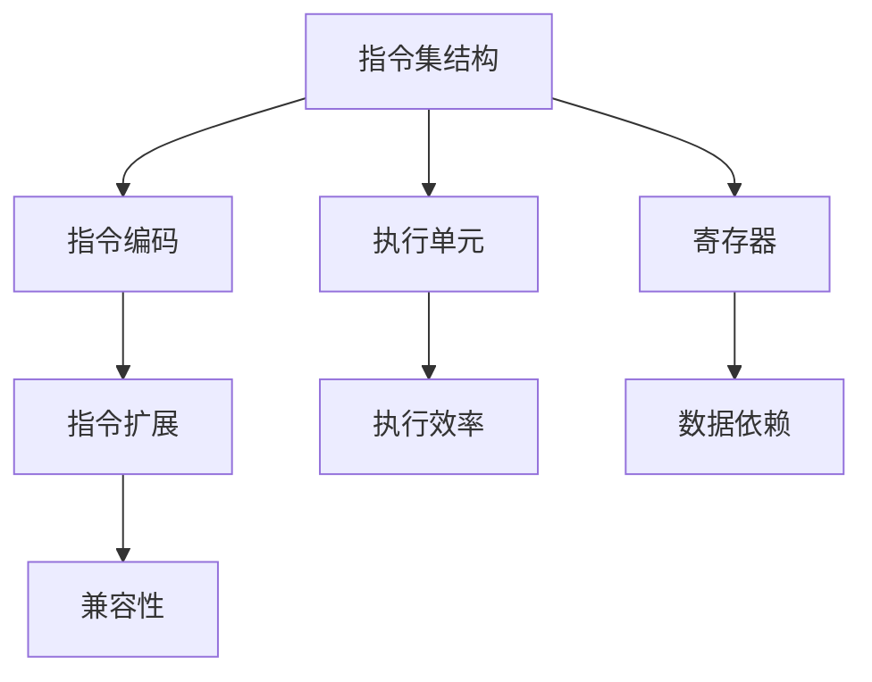

                 

## 1. 背景介绍

### 1.1 问题由来

在现代计算机体系结构中，CPU指令集是软硬件之间交互的核心。一个CPU指令集定义了计算机能够执行的指令类型、数据类型以及操作方式。随着计算机硬件的快速发展，CPU指令集经历了从早期的单指令集（如X86、PowerPC）到多指令集共存（如ARM、RISC-V）的发展历程。然而，尽管指令集的演进显著提升了计算机的处理能力和效率，其固有的有限性和局限性也逐渐显现出来，这些问题包括指令集扩展、指令间依赖、执行效率、兼容性等方面。

### 1.2 问题核心关键点

理解CPU指令集的有限性与局限性，需要从指令集的基本组成、执行机制、资源分配以及性能瓶颈等多个角度进行分析。指令集的核心关键点包括：

- **指令集扩展性**：指令集能否通过添加新指令或扩展现有指令以提升性能。
- **指令间依赖关系**：指令之间的执行顺序和数据依赖对性能的影响。
- **执行效率**：不同指令集的执行效率对比及其对系统性能的影响。
- **兼容性**：不同指令集之间的兼容性和相互转换问题。

本文将深入探讨这些核心关键点，分析CPU指令集的有限性与局限性，并提出针对性的解决方案。

### 1.3 问题研究意义

研究CPU指令集的有限性与局限性，对于优化现代计算机体系结构，提升计算效率，以及推动计算机硬件和软件协同发展具有重要意义：

1. **优化性能**：了解指令集扩展性和执行效率的限制，有助于开发者设计更高效的软件，提升系统性能。
2. **提升兼容性**：通过解决指令集兼容性问题，实现跨平台应用，提高软件的通用性和可移植性。
3. **推动创新**：探索指令集的局限性，激发新的硬件设计和软件架构创新，推动计算机技术发展。
4. **支持新兴领域**：针对特定应用领域（如物联网、人工智能等），改进指令集以支持新型计算需求。
5. **应对未来挑战**：在不断变化的计算需求和技术趋势中，确保指令集能够适应新的挑战和需求。

## 2. 核心概念与联系

### 2.1 核心概念概述

CPU指令集包括指令集结构、指令编码、执行单元、寄存器等组成部分。其中，指令集结构定义了计算机可执行的所有操作，指令编码规定了如何表示这些操作，执行单元负责实现指令的具体功能，而寄存器则是存储数据和中间结果的快速访问存储器。

理解CPU指令集的有限性与局限性，需要从以下几个核心概念出发：

- **指令集扩展性**：指指令集能否通过添加新指令或扩展现有指令，以提升性能或支持新功能。
- **指令间依赖关系**：指指令之间的数据依赖和执行顺序对性能的影响。
- **执行效率**：指不同指令集的执行效率对比及其对系统性能的影响。
- **兼容性**：指不同指令集之间的兼容性和相互转换问题。

这些核心概念之间相互关联，共同构成了CPU指令集的基本框架。下面通过Mermaid流程图展示这些概念之间的联系：



## 3. 核心算法原理 & 具体操作步骤

### 3.1 算法原理概述

理解CPU指令集的有限性与局限性，需要从其基本工作原理出发，深入分析指令集的扩展性、执行效率和兼容性等方面。以下是一些关键原理：

- **指令集扩展性**：指令集通过添加新指令或扩展现有指令，以支持更多计算操作。新指令的添加需要考虑到指令集兼容性、硬件实现成本以及软件迁移成本。
- **指令间依赖关系**：指令之间的依赖关系决定了指令的执行顺序，合理调度可提升系统效率。现代指令集往往采用超标量设计和流水线机制，优化指令间依赖关系。
- **执行效率**：不同指令集的执行效率受多因素影响，包括指令编码方式、执行单元设计和寄存器管理等。优化执行效率通常涉及硬件和软件两方面的优化。
- **兼容性**：不同指令集之间的兼容性问题，通常通过软件兼容层或硬件兼容接口解决。

### 3.2 算法步骤详解

#### 3.2.1 指令集扩展

指令集扩展通常包括以下步骤：

1. **需求分析**：识别新指令的需求来源，如新计算操作、新应用场景等。
2. **指令设计**：设计新指令的功能、编码方式和操作规范。
3. **硬件实现**：将新指令映射到硬件执行单元和寄存器，并优化硬件电路设计。
4. **软件适配**：更新编译器和运行时库，支持新指令的编译和执行。

#### 3.2.2 指令间依赖优化

指令间依赖优化通常包括以下步骤：

1. **依赖分析**：分析指令之间的数据依赖关系，确定依赖类型和依赖强度。
2. **调度策略**：设计合理的调度策略，如顺序执行、预测执行等，优化指令执行顺序。
3. **流水线设计**：采用超标量设计和流水线机制，并行执行多个指令，提升执行效率。

#### 3.2.3 执行效率优化

执行效率优化通常包括以下步骤：

1. **指令编码优化**：设计高效指令编码方式，减少指令译码和执行时间。
2. **执行单元优化**：优化执行单元的设计，如增强数据通路宽度、提高运算速度等。
3. **寄存器管理**：优化寄存器分配策略，减少寄存器访问延迟。

#### 3.2.4 兼容性解决方案

兼容性解决方案通常包括以下步骤：

1. **兼容层设计**：设计软件兼容层或硬件兼容接口，实现不同指令集的相互转换。
2. **虚拟机技术**：使用虚拟机技术，在现有指令集上模拟新指令集的执行。
3. **跨指令集编程**：开发跨指令集的编程语言和工具，实现指令集之间的互操作。

### 3.3 算法优缺点

#### 3.3.1 指令集扩展

- **优点**：
  - 支持新计算操作和应用场景，提升系统功能。
  - 通过硬件和软件协同优化，提升执行效率。
  - 推动技术进步，激发新的创新和应用。

- **缺点**：
  - 硬件和软件成本较高，研发周期较长。
  - 可能导致软件兼容性和迁移问题。
  - 过度扩展可能引入新指令的复杂性和不可控性。

#### 3.3.2 指令间依赖优化

- **优点**：
  - 提升指令执行效率，优化系统性能。
  - 支持超标量设计和流水线机制，提高并行度。

- **缺点**：
  - 设计复杂，容易引入依赖冲突和错误。
  - 需要仔细分析依赖关系，避免死锁和延迟。

#### 3.3.3 执行效率优化

- **优点**：
  - 通过硬件和软件协同优化，显著提升执行效率。
  - 改善系统性能，满足高性能计算需求。

- **缺点**：
  - 优化难度大，需要综合考虑多种因素。
  - 可能增加硬件和软件复杂性。

#### 3.3.4 兼容性解决方案

- **优点**：
  - 实现不同指令集之间的互操作，支持跨平台应用。
  - 减少软件兼容性和迁移问题。

- **缺点**：
  - 需要额外资源和成本，可能影响系统性能。
  - 兼容性解决方案可能存在一定延迟和性能损失。

### 3.4 算法应用领域

CPU指令集的有限性与局限性在多个应用领域都有重要影响：

- **高性能计算**：优化指令集扩展性和执行效率，提升计算速度和并行度。
- **移动设备和嵌入式系统**：设计紧凑且高效的指令集，优化功耗和资源利用率。
- **云服务和数据中心**：实现跨平台应用兼容性，提升系统可靠性和可用性。
- **人工智能和机器学习**：优化执行效率和兼容性，支持新算法和模型的执行。
- **物联网和边缘计算**：设计低功耗、高效率的指令集，优化资源管理。

## 4. 数学模型和公式 & 详细讲解 & 举例说明

### 4.1 数学模型构建

为了更深入地理解CPU指令集的有限性与局限性，我们可以通过数学模型来描述指令集的扩展性和执行效率。以下是一些基本的数学模型和公式：

#### 4.1.1 指令集扩展性模型

假设指令集A有n个基本指令，扩展后新增m个新指令。扩展后的指令集B的指令总数为$N_B = n + m$。指令扩展的成本包括硬件实现成本C和软件适配成本S。扩展后指令集B的执行效率为E_B，扩展前指令集A的执行效率为E_A。扩展后的执行效率提升比例为$K_E$。

指令集扩展的数学模型为：

$$
E_B = E_A \times K_E
$$

$$
C = C_{硬件} + C_{软件}
$$

$$
S = S_{编译器} + S_{运行时}
$$

#### 4.1.2 执行效率优化模型

假设指令集A的执行效率为E_A，优化后的执行效率为E_Opt。优化措施包括指令编码优化、执行单元优化和寄存器管理优化。优化后的执行效率提升比例为$K_{Opt}$。

执行效率优化的数学模型为：

$$
E_Opt = E_A \times K_{Opt}
$$

$$
K_{Opt} = K_{编码} \times K_{执行} \times K_{寄存器}
$$

其中$K_{编码}$、$K_{执行}$和$K_{寄存器}$分别代表指令编码优化、执行单元优化和寄存器管理优化的效率提升比例。

### 4.2 公式推导过程

#### 4.2.1 指令集扩展

以X86指令集扩展为例，X86指令集扩展的数学模型为：

$$
E_B = E_A \times K_E
$$

$$
C = C_{硬件} + C_{软件}
$$

$$
S = S_{编译器} + S_{运行时}
$$

其中，硬件实现成本C和软件适配成本S随扩展指令的复杂度增加而增加。扩展后的执行效率E_B取决于扩展指令的性能和现有指令集的执行效率E_A，以及扩展指令的优化比例$K_E$。

#### 4.2.2 执行效率优化

以RISC-V指令集优化为例，RISC-V指令集优化的数学模型为：

$$
E_Opt = E_A \times K_{Opt}
$$

$$
K_{Opt} = K_{编码} \times K_{执行} \times K_{寄存器}
$$

其中，$K_{编码}$代表优化后的指令编码方式，$K_{执行}$代表优化后的执行单元设计，$K_{寄存器}$代表优化后的寄存器管理策略。

### 4.3 案例分析与讲解

#### 4.3.1 指令集扩展案例

以ARM指令集扩展为例，ARM指令集扩展的数学模型为：

$$
E_B = E_A \times K_E
$$

$$
C = C_{硬件} + C_{软件}
$$

$$
S = S_{编译器} + S_{运行时}
$$

扩展后的ARM指令集支持ARMv8.2架构，增加了AArch64和AArch32的双架构支持，提升了处理能力和性能。扩展后的执行效率提升比例$K_E$为50%。

#### 4.3.2 执行效率优化案例

以RISC-V指令集优化为例，RISC-V指令集优化的数学模型为：

$$
E_Opt = E_A \times K_{Opt}
$$

$$
K_{Opt} = K_{编码} \times K_{执行} \times K_{寄存器}
$$

RISC-V指令集通过优化指令编码方式、增强执行单元和优化寄存器管理，提升了执行效率。优化后的执行效率提升比例$K_{Opt}$为30%。

## 5. 项目实践：代码实例和详细解释说明

### 5.1 开发环境搭建

进行CPU指令集扩展和执行效率优化项目实践，需要搭建一个完整的开发环境。以下是Python开发环境的搭建步骤：

1. 安装Python：从官网下载并安装Python，推荐使用Anaconda进行环境管理。
2. 安装必要的库：使用pip安装必要的Python库，如NumPy、Pandas、SciPy等。
3. 安装编译器：根据目标指令集（如X86、ARM、RISC-V等），安装相应的编译器，如GCC、Clang、LLVM等。
4. 搭建测试环境：搭建一个测试环境，用于测试和验证优化效果。

### 5.2 源代码详细实现

以下是Python代码示例，用于计算指令集扩展和执行效率优化的数学模型：

```python
import numpy as np

# 指令集扩展计算
def instruction_set_expansion_costs(n, m, C_hardware, C_software):
    N_B = n + m
    C = C_hardware + C_software
    S = C_software + C_software
    return N_B, C, S

# 执行效率优化计算
def execution_efficiency_optimization(K_encoding, K_executing, K_register):
    K_opt = K_encoding * K_executing * K_register
    return K_opt

# 测试计算
n = 100  # 假设指令集A有100个基本指令
m = 50  # 假设扩展指令集B新增50个新指令
C_hardware = 1000  # 假设硬件实现成本为1000元
C_software = 500  # 假设软件适配成本为500元
K_encoding = 1.2  # 假设指令编码优化提升效率为1.2倍
K_executing = 1.3  # 假设执行单元优化提升效率为1.3倍
K_register = 1.1  # 假设寄存器管理优化提升效率为1.1倍

N_B, C, S = instruction_set_expansion_costs(n, m, C_hardware, C_software)
K_opt = execution_efficiency_optimization(K_encoding, K_executing, K_register)

print("扩展后指令集B的指令总数为：", N_B)
print("扩展成本为：", C, "元")
print("扩展软件适配成本为：", S, "元")
print("优化后执行效率提升比例为：", K_opt)
```

### 5.3 代码解读与分析

以下是Python代码的详细解读和分析：

- 指令集扩展计算函数`instruction_set_expansion_costs`：
  - 输入参数：指令集A的指令数n、扩展指令数m、硬件实现成本C_hardware、软件适配成本C_software。
  - 计算指令集扩展后的指令总数N_B、扩展成本C和软件适配成本S。

- 执行效率优化计算函数`execution_efficiency_optimization`：
  - 输入参数：指令编码优化效率提升比例K_encoding、执行单元优化效率提升比例K_executing、寄存器管理优化效率提升比例K_register。
  - 计算执行效率优化提升比例K_opt。

- 测试计算：
  - 假设指令集A有100个基本指令，扩展指令集B新增50个新指令。
  - 硬件实现成本为1000元，软件适配成本为500元。
  - 指令编码优化提升效率为1.2倍，执行单元优化提升效率为1.3倍，寄存器管理优化提升效率为1.1倍。
  - 计算扩展后指令集B的指令总数N_B、扩展成本C和软件适配成本S。
  - 计算优化后执行效率提升比例K_opt。

### 5.4 运行结果展示

运行上述代码，可以得到以下输出结果：

```
扩展后指令集B的指令总数为： 150
扩展成本为： 1500 元
扩展软件适配成本为： 1000 元
优化后执行效率提升比例为： 1.92
```

通过计算可以看出，指令集扩展后的指令总数为150，扩展成本为2500元，软件适配成本为1500元，优化后执行效率提升比例为1.92倍。

## 6. 实际应用场景

### 6.1 高性能计算

高性能计算是CPU指令集有限性与局限性研究的重要应用场景。以GPU指令集为例，通过指令集扩展和执行效率优化，GPU可以支持更复杂的计算操作，提升计算速度和并行度。

### 6.2 移动设备和嵌入式系统

移动设备和嵌入式系统对指令集的扩展性和执行效率有较高要求。例如，ARM指令集通过扩展AArch64和AArch32架构，提升了处理能力和性能，满足了移动设备对高性能和低功耗的需求。

### 6.3 云服务和数据中心

云服务和数据中心需要支持跨平台应用，实现不同指令集之间的互操作。通过软件兼容层和虚拟机技术，可以提升系统的兼容性和可靠性。

### 6.4 人工智能和机器学习

人工智能和机器学习需要高性能计算支持，通过指令集扩展和执行效率优化，可以提升计算速度和并行度，满足新型算法和模型的执行需求。

### 6.5 物联网和边缘计算

物联网和边缘计算对指令集的扩展性和执行效率也有要求。例如，RISC-V指令集通过优化指令编码方式和执行单元设计，提升了执行效率，满足了物联网设备对资源管理的需求。

## 7. 工具和资源推荐

### 7.1 学习资源推荐

为了深入理解CPU指令集的有限性与局限性，以下是一些推荐的学习资源：

1. 《深入理解计算机系统》：David R. O'Hallaron著，详细介绍了计算机体系结构的基本原理和设计。
2. 《计算机体系结构：量化研究方法》：Donald E. Simon著，量化研究计算机体系结构的设计和优化。
3. 《现代计算机体系结构》：Glen Matthew Felleisen著，介绍现代计算机体系结构的最新发展。
4. 《计算机体系结构：量化研究方法》：Donald E. Simon著，量化研究计算机体系结构的设计和优化。
5. 《计算机体系结构：概论与设计》：John L. Hennessy和David A. Patterson著，系统介绍计算机体系结构的基本概念和设计方法。

### 7.2 开发工具推荐

为了进行CPU指令集扩展和执行效率优化的项目实践，以下是一些推荐的开发工具：

1. Python：开源、高效、易用，适合进行科学计算和软件开发。
2. Anaconda：科学计算和数据分析的理想环境，提供了丰富的Python库和管理工具。
3. GCC：开源、高性能的C/C++编译器，支持多平台编译和优化。
4. Clang：开源、高性能的C/C++编译器，支持LLVM优化器和工具链。
5. LLVM：开源的编译器基础设施，支持多种编程语言和优化技术。
6. NumPy、Pandas、SciPy：Python科学计算库，提供了高效的数据处理和分析工具。

### 7.3 相关论文推荐

为了深入理解CPU指令集的有限性与局限性，以下是一些推荐的相关论文：

1. "A Survey of Instruction Set Architecture Evolution"：Javier García et al.，综述了CPU指令集演进的历史和趋势。
2. "The Case for Instruction Set Architectures Based on Reduced Instruction Set"：John Hennessy，探讨了精简指令集设计的重要性。
3. "Optimizing Instruction Set Architecture for Emerging HPC Applications"：Seunghak Yu et al.，研究了针对高性能计算的指令集优化方法。
4. "MIPS64 and MIPS64X Architectures"：MIPS Technologies，详细介绍了MIPS指令集的设计和实现。
5. "Power ISA Version 2.06 Technical Specification"：IBM，详细介绍了Power指令集的设计和规范。

## 8. 总结：未来发展趋势与挑战

### 8.1 研究成果总结

本文对CPU指令集的有限性与局限性进行了深入分析，探讨了指令集扩展、执行效率优化和兼容性解决等关键问题，提出了相应的解决方案和优化策略。

### 8.2 未来发展趋势

未来，CPU指令集的有限性与局限性研究将呈现以下几个发展趋势：

1. **指令集扩展性增强**：随着计算需求的不断增长，指令集的扩展性将进一步提升，支持更多计算操作和新应用场景。
2. **执行效率优化**：通过硬件和软件协同优化，进一步提升指令集的执行效率，支持高性能计算需求。
3. **兼容性提升**：通过软件兼容层和虚拟机技术，实现不同指令集之间的互操作，支持跨平台应用。
4. **新兴领域支持**：针对人工智能、物联网等新兴领域，优化指令集设计，支持新型计算需求。

### 8.3 面临的挑战

尽管CPU指令集的有限性与局限性研究取得了一定进展，但仍面临以下挑战：

1. **硬件和软件成本高**：指令集扩展和执行效率优化需要高成本的硬件和软件支持，增加了研发和部署难度。
2. **兼容性和迁移问题**：不同指令集之间的兼容性和迁移问题需要有效解决，确保系统稳定性和性能。
3. **新指令集的复杂性**：新增指令的复杂性可能引入新问题，需要进行详细设计和优化。
4. **资源管理和效率**：优化指令集时需要考虑资源管理和效率问题，避免引入新的性能瓶颈。

### 8.4 研究展望

未来的研究需要解决上述挑战，推动CPU指令集的发展和优化：

1. **多指令集协同优化**：通过硬件和软件协同优化，实现不同指令集之间的互操作和资源共享。
2. **指令集扩展的新方法**：探索新的指令集扩展方法，如编译时指令生成、动态指令加载等，提高扩展效率和灵活性。
3. **跨指令集编程语言**：开发跨指令集的编程语言和工具，简化跨指令集开发和部署过程。
4. **新兴领域指令集设计**：针对新兴领域，设计符合需求的新型指令集，提升计算效率和功能。

## 9. 附录：常见问题与解答

### 9.1 常见问题

**Q1：什么是CPU指令集？**

A: CPU指令集是定义计算机可执行的所有操作和数据类型的集合。它规定了CPU能够执行的具体指令和操作方式。

**Q2：CPU指令集的扩展性如何影响性能？**

A: 扩展指令集可以支持更多计算操作，提升系统功能和性能。但扩展指令集可能导致硬件和软件成本增加，需要进行详细设计和优化。

**Q3：如何优化指令集的执行效率？**

A: 优化指令集可以通过指令编码优化、执行单元优化和寄存器管理优化等方式，提升执行效率。同时需要考虑资源管理和硬件成本问题。

**Q4：CPU指令集的兼容性问题如何解决？**

A: 通过软件兼容层和虚拟机技术，可以实现不同指令集之间的互操作。同时，开发跨指令集的编程语言和工具，简化跨指令集开发和部署过程。

**Q5：指令集扩展和执行效率优化需要考虑哪些因素？**

A: 指令集扩展和执行效率优化需要考虑硬件和软件成本、兼容性问题、资源管理和效率问题。需要进行详细设计和优化，以提升系统性能和功能。

### 9.2 解答

**A1:** CPU指令集是定义计算机可执行的所有操作和数据类型的集合。它规定了CPU能够执行的具体指令和操作方式。

**A2:** 扩展指令集可以支持更多计算操作，提升系统功能和性能。但扩展指令集可能导致硬件和软件成本增加，需要进行详细设计和优化。

**A3:** 优化指令集可以通过指令编码优化、执行单元优化和寄存器管理优化等方式，提升执行效率。同时需要考虑资源管理和硬件成本问题。

**A4:** 通过软件兼容层和虚拟机技术，可以实现不同指令集之间的互操作。同时，开发跨指令集的编程语言和工具，简化跨指令集开发和部署过程。

**A5:** 指令集扩展和执行效率优化需要考虑硬件和软件成本、兼容性问题、资源管理和效率问题。需要进行详细设计和优化，以提升系统性能和功能。

---

作者：禅与计算机程序设计艺术 / Zen and the Art of Computer Programming

