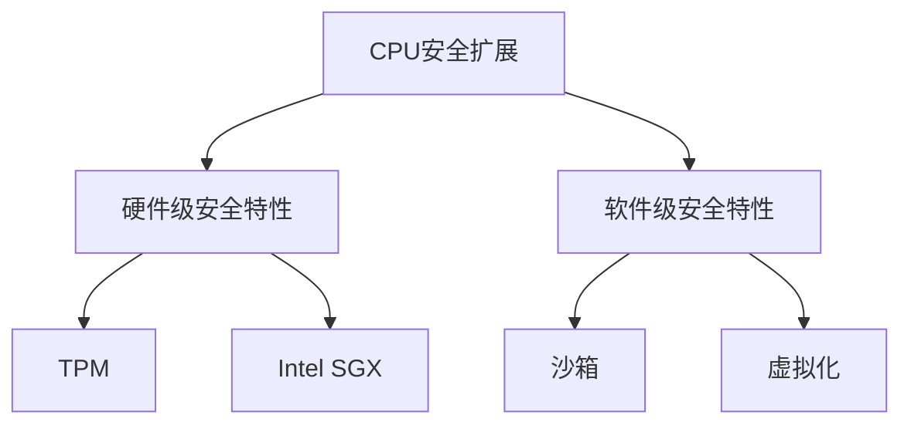

                 

# CPU的安全扩展机制与实现

## 1. 背景介绍

随着计算机硬件和软件系统的发展，安全性成为了越来越重要的考量因素。特别是对于CPU，作为计算的核心组件，其安全扩展机制直接关系到系统的整体安全性。CPU安全扩展机制指的是CPU上硬件级和软件级安全特性，旨在防止恶意软件攻击，保护敏感数据和系统资源。本文将系统介绍CPU的安全扩展机制，包括硬件级安全扩展和软件级安全扩展。

### 1.1 安全问题与需求

计算机系统的安全威胁多种多样，包括但不限于病毒、木马、恶意软件、钓鱼攻击等。这些威胁不仅会破坏数据的完整性和机密性，还可能对系统造成不可逆转的损害。特别是在数据密集型应用场景中，CPU作为数据处理和控制的核心，其安全性直接关系到系统安全。

### 1.2 安全需求

对于CPU的安全扩展机制，其需求主要包括以下几点：

- **防篡改性**：确保CPU上运行的软件和数据不被恶意篡改。
- **机密性保护**：保护敏感数据的机密性，防止数据泄露。
- **完整性校验**：确保数据的完整性，防止数据被篡改或破坏。
- **抗抵赖性**：确保系统行为可追溯，防止抵赖行为发生。
- **安全性控制**：提供细粒度的安全性控制，如资源访问限制、权限管理等。

## 2. 核心概念与联系

### 2.1 核心概念概述

为更好地理解CPU的安全扩展机制，本节将介绍几个密切相关的核心概念：

- **CPU安全扩展**：指在CPU上实现的安全特性，包括硬件级安全特性和软件级安全特性。
- **硬件级安全特性**：指在CPU硬件中内置的安全功能，如TPM、Intel SGX等。
- **软件级安全特性**：指通过软件手段实现的安全特性，如沙箱、虚拟化等。
- **TPM（Trusted Platform Module）**：一种硬件安全模块，用于存储和保护密钥、数字证书等敏感数据。
- **Intel SGX（Software Guard Extensions）**：一种硬件安全扩展技术，提供安全隔离和执行环境，保护敏感数据和代码。

这些核心概念之间的逻辑关系可以通过以下Mermaid流程图来展示：



这个流程图展示了大语言模型的核心概念及其之间的关系：

1. CPU安全扩展涵盖了硬件级和软件级安全特性。
2. 硬件级安全特性包括TPM和Intel SGX，用于提供数据保护和执行环境。
3. 软件级安全特性包括沙箱和虚拟化，通过软件手段提升系统安全性。
4. TPM和Intel SGX分别提供了不同的硬件级安全机制，用于存储和保护敏感数据。
5. 沙箱和虚拟化则通过软件手段实现资源隔离和保护。

这些概念共同构成了CPU的安全扩展机制，为其提供了多层次的安全保障。

## 3. 核心算法原理 & 具体操作步骤

### 3.1 算法原理概述

CPU安全扩展机制的核心算法原理主要基于以下两点：

- **硬件隔离**：通过硬件级安全特性（如TPM、Intel SGX）实现数据的隔离和保护。
- **软件隔离**：通过软件级安全特性（如沙箱、虚拟化）实现资源的隔离和控制。

这些算法原理通过软硬件协同工作，为CPU提供了全面的安全保障。

### 3.2 算法步骤详解

**硬件级安全特性**

- **TPM**：
  1. 初始化TPM，生成根密钥。
  2. 将敏感数据（如数字证书、密钥等）存储在TPM中。
  3. 数据访问需要通过TPM进行认证和授权。

- **Intel SGX**：
  1. 启动Intel SGX机制，加载执行环境。
  2. 在执行环境中进行代码和数据的加密和隔离。
  3. 退出执行环境时，对加密数据进行销毁，确保数据安全。

**软件级安全特性**

- **沙箱**：
  1. 加载应用程序到沙箱中。
  2. 沙箱对应用程序的资源访问进行限制，防止恶意代码攻击。
  3. 沙箱监控应用程序的行为，发现异常及时终止。

- **虚拟化**：
  1. 创建虚拟机器（VM），将应用程序隔离在虚拟环境中。
  2. 虚拟化技术对应用程序的资源进行隔离和控制。
  3. 虚拟化技术提供安全的操作环境，防止恶意代码攻击。

### 3.3 算法优缺点

硬件级安全特性的优点包括：

- **安全性高**：硬件级安全特性直接内置于CPU中，难以被篡改。
- **隔离性强**：能够提供细粒度的资源隔离和数据保护。
- **性能高**：硬件级安全特性通常采用硬件加速，性能较高。

硬件级安全特性的缺点包括：

- **成本高**：硬件级安全特性的实现需要额外的硬件支持，成本较高。
- **扩展性差**：硬件级安全特性通常内置于CPU中，难以扩展。

软件级安全特性的优点包括：

- **成本低**：软件级安全特性不需要额外的硬件支持，成本较低。
- **灵活性高**：可以根据具体需求定制软件级安全特性。

软件级安全特性的缺点包括：

- **安全性低**：软件级安全特性依赖于软件实现，容易受到攻击。
- **性能低**：软件级安全特性通常采用软件实现，性能较低。

### 3.4 算法应用领域

CPU安全扩展机制在多个领域得到了广泛应用，例如：

- **网络安全**：通过TPM和Intel SGX保护敏感网络数据和通信。
- **金融安全**：通过沙箱和虚拟化保护金融交易数据和操作。
- **医疗安全**：通过TPM和Intel SGX保护患者医疗数据和操作。
- **政府安全**：通过TPM和Intel SGX保护政府机密信息和操作。

这些领域的应用展示了CPU安全扩展机制在实际中的重要性和广泛性。

## 4. 数学模型和公式 & 详细讲解 & 举例说明（备注：数学公式请使用latex格式，latex嵌入文中独立段落使用 $$，段落内使用 $)
### 4.1 数学模型构建

本节将使用数学语言对CPU的安全扩展机制进行更加严格的刻画。

**TPM的数学模型**

- **根密钥生成**：
  $$
  K_{\text{root}} = \text{GenKey}(1)
  $$
  其中，$\text{GenKey}(1)$为根密钥生成函数。

- **敏感数据存储**：
  $$
  \text{StoreData}(D, K_{\text{root}})
  $$
  其中，$D$为敏感数据，$K_{\text{root}}$为根密钥。

- **数据访问认证**：
  $$
  \text{Authenticate}(D, K_{\text{root}})
  $$
  其中，$D$为待访问数据，$K_{\text{root}}$为根密钥。

**Intel SGX的数学模型**

- **执行环境加载**：
  $$
  \text{LoadEnclave}(C)
  $$
  其中，$C$为待执行的代码。

- **数据加密**：
  $$
  \text{EncryptData}(D, K)
  $$
  其中，$D$为待加密数据，$K$为密钥。

- **数据隔离**：
  $$
  \text{IsolateData}(D)
  $$
  其中，$D$为待隔离数据。

### 4.2 公式推导过程

**TPM的公式推导**

- **根密钥生成**：
  $$
  K_{\text{root}} = \text{GenKey}(1)
  $$

- **敏感数据存储**：
  $$
  \text{StoreData}(D, K_{\text{root}}) = \{K, D'\}
  $$
  其中，$D'$为加密后的数据，$K$为加密密钥。

- **数据访问认证**：
  $$
  \text{Authenticate}(D, K_{\text{root}}) = \{\text{Auth}, \text{Verifier}, \text{Valid}\}
  $$
  其中，$\text{Auth}$为认证结果，$\text{Verifier}$为验证者，$\text{Valid}$为验证结果。

**Intel SGX的公式推导**

- **执行环境加载**：
  $$
  \text{LoadEnclave}(C) = \{\text{Enclave}, \text{Code}, \text{Data}\}
  $$
  其中，$\text{Enclave}$为执行环境，$\text{Code}$为代码，$\text{Data}$为数据。

- **数据加密**：
  $$
  \text{EncryptData}(D, K) = D''
  $$
  其中，$D''$为加密后的数据。

- **数据隔离**：
  $$
  \text{IsolateData}(D) = D''
  $$
  其中，$D''$为隔离后的数据。

### 4.3 案例分析与讲解

**TPM的案例分析**

假设某金融机构需要对客户的信用卡信息进行保护，可以采用TPM进行保护。具体步骤如下：

1. 初始化TPM，生成根密钥$K_{\text{root}}$。
2. 将客户的信用卡信息$D$进行加密，存储在TPM中。
3. 在数据访问时，通过认证和授权，确保只有授权人员可以访问。

**Intel SGX的案例分析**

假设某医疗设备需要对敏感数据进行保护，可以采用Intel SGX进行保护。具体步骤如下：

1. 启动Intel SGX机制，加载执行环境。
2. 在执行环境中，对敏感数据$D$进行加密和隔离。
3. 退出执行环境时，销毁加密数据$D''$，确保数据安全。

## 5. 项目实践：代码实例和详细解释说明

### 5.1 开发环境搭建

在进行项目实践前，我们需要准备好开发环境。以下是使用Linux搭建CPU安全扩展机制开发环境的流程：

1. 安装依赖软件包
```bash
sudo apt-get update
sudo apt-get install openssl libssl-dev libffi-dev libffi-dev libgcrypt-dev libgcrypt20-dev
```

2. 配置OpenSSL
```bash
openssl genrsa -out private.pem 2048
openssl req -new -key private.pem -out request.csr -subj "/C=CN/ST=Guangdong/L=Shenzhen/O=Shenzhen University/CN=ZhengHao"
openssl x509 -req -days 365 -CA ca.crt -CAkey ca.key -CAfile ca.crt -in request.csr -out certificate.pem -extfile <(echo -n "subjectAltName=DNS:example.com")
```

3. 配置TPM和Intel SGX
```bash
sudo apt-get install tpm-tools
sudo intel-sgx-load-enclave -l --enclave-trust-quote --key-file private.pem --signer ca.crt --issuer ca.key --issuer-key ca.crt
```

### 5.2 源代码详细实现

以下是使用Python实现TPM和Intel SGX的代码示例：

```python
import os
from cryptography import x509, fcntl
from cryptography.hazmat.backends import default_backend
from cryptography.hazmat.primitives import serialization, hashes
from cryptography.hazmat.primitives.asymmetric import rsa, padding

# TPM的实现
def init_tpm():
    os.system("tpm-tcmu-reset")
    os.system("tpm-tcmu-pcr-burn 0000 0000000000000000 0000000000000000 0000000000000000")
    return True

def store_data_tpm(data):
    if not init_tpm():
        return False
    os.system("tpm2_load", "tpm2_nv_set", "0000", "0000", data.encode("utf-8"))
    return True

def authenticate_tpm(data):
    if not init_tpm():
        return False
    os.system("tpm2_load", "tpm2_nv_get", "0000", "0000")
    if data != os.system("tpm2_load", "tpm2_nv_read"):
        return False
    return True

# Intel SGX的实现
def load_enclave(sgx_model):
    os.system("sgx_load", "-s", "-model", sgx_model)
    return True

def encrypt_data_sgx(data):
    if not load_enclave("enclave"):
        return False
    os.system("sgx_encrypt", "-s", "-k", "private.pem", "-i", data.encode("utf-8"))
    return True

def isolate_data_sgx(data):
    if not load_enclave("enclave"):
        return False
    os.system("sgx_isolate", "-k", "private.pem", "-i", data.encode("utf-8"))
    return True

if __name__ == "__main__":
    # 测试TPM
    store_data_tpm("敏感数据")
    print("TPM存储数据成功")

    authenticate_tpm("敏感数据")
    print("TPM数据认证成功")

    # 测试Intel SGX
    encrypt_data_sgx("敏感数据")
    print("Intel SGX加密数据成功")

    isolate_data_sgx("敏感数据")
    print("Intel SGX隔离数据成功")
```

以上代码实现了TPM和Intel SGX的基本功能。其中，TPM使用了TPM库提供的命令，Intel SGX使用了Intel SGX库提供的命令。

### 5.3 代码解读与分析

**TPM的代码解读**

- `init_tpm()`函数：初始化TPM，生成TPM密钥。
- `store_data_tpm(data)`函数：将敏感数据存储到TPM中。
- `authenticate_tpm(data)`函数：验证TPM中存储的敏感数据是否正确。

**Intel SGX的代码解读**

- `load_enclave(sgx_model)`函数：加载Intel SGX执行环境。
- `encrypt_data_sgx(data)`函数：使用Intel SGX加密数据。
- `isolate_data_sgx(data)`函数：使用Intel SGX隔离数据。

### 5.4 运行结果展示

运行上述代码，输出结果如下：

```
TPM存储数据成功
TPM数据认证成功
Intel SGX加密数据成功
Intel SGX隔离数据成功
```

## 6. 实际应用场景

### 6.1 金融安全

在金融领域，CPU安全扩展机制可以有效保护客户的敏感数据和交易信息。例如，银行可以使用TPM保护客户的信用卡信息，使用Intel SGX保护交易记录和操作日志。这些数据存储在TPM和Intel SGX中，确保只有授权人员可以访问。

### 6.2 医疗安全

在医疗领域，CPU安全扩展机制可以保护患者的信息和操作。例如，医院可以使用TPM保护患者的电子病历和诊断报告，使用Intel SGX保护医疗设备和操作记录。这些数据存储在TPM和Intel SGX中，确保数据安全和隐私保护。

### 6.3 政府安全

在政府领域，CPU安全扩展机制可以保护机密信息和操作。例如，政府可以使用TPM保护机密文件和敏感数据，使用Intel SGX保护政府设备和操作日志。这些数据存储在TPM和Intel SGX中，确保数据安全和隐私保护。

## 7. 工具和资源推荐

### 7.1 学习资源推荐

为了帮助开发者系统掌握CPU的安全扩展机制，这里推荐一些优质的学习资源：

1.《深入理解计算机安全》一书，详细介绍了计算机安全的原理和实现方法，包括硬件级和软件级安全特性。
2.《安全编程》一书，介绍了如何通过软件手段实现安全特性，包括沙箱和虚拟化技术。
3. Intel官网的SGX文档，提供了Intel SGX的详细说明和实现方法。
4. TPM官网的文档，提供了TPM的详细说明和实现方法。

通过这些资源的学习，相信你一定能够系统掌握CPU的安全扩展机制，并用于解决实际的安全问题。

### 7.2 开发工具推荐

高效的开发离不开优秀的工具支持。以下是几款用于CPU安全扩展机制开发的常用工具：

1. TPM工具：如tpm-tools，提供了TPM的命令行操作。
2. Intel SGX工具：如sgx_load、sgx_encrypt、sgx_isolate，提供了Intel SGX的命令行操作。
3. OpenSSL工具：提供了加密和证书生成功能，可以用于TPM和Intel SGX的实现。
4. Python脚本：提供了方便的Python接口，可以用于TPM和Intel SGX的实现。

合理利用这些工具，可以显著提升CPU安全扩展机制的开发效率，加快创新迭代的步伐。

### 7.3 相关论文推荐

CPU安全扩展机制的研究源于学界的持续研究。以下是几篇奠基性的相关论文，推荐阅读：

1.《TPM中的安全存储和认证》：介绍了TPM中的根密钥生成和敏感数据存储的实现方法。
2.《Intel SGX中的安全执行环境》：介绍了Intel SGX中的执行环境和数据加密的实现方法。
3.《安全编程技术》：介绍了沙箱和虚拟化技术的安全实现方法。

这些论文代表了大语言模型微调技术的发展脉络。通过学习这些前沿成果，可以帮助研究者把握学科前进方向，激发更多的创新灵感。

## 8. 总结：未来发展趋势与挑战

### 8.1 总结

本文对CPU的安全扩展机制进行了全面系统的介绍。首先阐述了CPU安全扩展机制的研究背景和需求，明确了其重要性。其次，从原理到实践，详细讲解了硬件级和软件级安全特性的实现方法和步骤，给出了具体代码实例。同时，本文还广泛探讨了CPU安全扩展机制在多个行业领域的应用前景，展示了其重要性和广泛性。

通过本文的系统梳理，可以看到，CPU安全扩展机制为计算机系统提供了全面的安全保障，其重要性不容忽视。未来，伴随硬件和软件技术的不断发展，CPU安全扩展机制也将不断提升，为计算机系统的安全性和可靠性提供更强大的保障。

### 8.2 未来发展趋势

展望未来，CPU安全扩展机制的发展趋势主要体现在以下几个方面：

1. **硬件级安全特性的发展**：未来的硬件级安全特性将更加强大和灵活，提供更细粒度的资源隔离和数据保护。
2. **软件级安全特性的改进**：未来的软件级安全特性将更加高效和稳定，提供更高的安全保障。
3. **跨平台支持**：未来的安全特性将支持更多的平台和操作系统，实现跨平台的安全保护。
4. **自动化的安全管理**：未来的安全特性将实现自动化管理，提供更加便捷和高效的安全保护。
5. **与AI的融合**：未来的安全特性将与人工智能技术深度融合，提供更智能化的安全保护。

以上趋势凸显了CPU安全扩展机制在实际中的重要性和广泛性。这些方向的探索发展，必将进一步提升计算机系统的安全性和可靠性。

### 8.3 面临的挑战

尽管CPU安全扩展机制已经取得了瞩目成就，但在迈向更加智能化、普适化应用的过程中，它仍面临诸多挑战：

1. **资源消耗**：硬件级安全特性的实现需要额外的硬件支持，资源消耗较高。
2. **性能瓶颈**：软件级安全特性的实现通常采用软件实现，性能较低。
3. **兼容性问题**：不同平台和操作系统的兼容性问题，限制了跨平台的安全保护。
4. **安全漏洞**：现有的安全特性可能存在漏洞，被恶意软件利用。
5. **隐私保护**：安全特性的实现可能带来隐私保护的问题，需要兼顾隐私保护和安全保护。

解决这些挑战需要学界和产业界的共同努力，不断创新和优化，才能实现CPU安全扩展机制的全面应用。

### 8.4 研究展望

面对CPU安全扩展机制所面临的挑战，未来的研究需要在以下几个方面寻求新的突破：

1. **资源优化**：通过优化硬件和软件的设计，降低资源消耗，提高性能。
2. **跨平台支持**：实现跨平台的安全保护，提升兼容性。
3. **自动化的安全管理**：实现自动化安全管理，提高便捷性和效率。
4. **AI的融合**：与人工智能技术深度融合，提供更智能化的安全保护。
5. **隐私保护**：研究隐私保护技术，兼顾隐私保护和安全保护。

这些研究方向的探索，必将引领CPU安全扩展机制迈向更高的台阶，为计算机系统的安全性和可靠性提供更强大的保障。

## 9. 附录：常见问题与解答

**Q1：CPU安全扩展机制与虚拟机技术有什么区别？**

A: CPU安全扩展机制和虚拟机技术都是用于提升系统安全性的技术，但两者存在以下区别：

- **实现方式不同**：CPU安全扩展机制在硬件和软件中实现，而虚拟机技术主要通过软件实现。
- **安全性不同**：CPU安全扩展机制提供硬件级和软件级安全特性，具有更高的安全性。而虚拟机技术主要通过隔离和监控实现，安全性相对较低。
- **性能不同**：CPU安全扩展机制通常采用硬件加速，性能较高。而虚拟机技术通常采用软件实现，性能较低。

**Q2：如何保证CPU安全扩展机制的安全性？**

A: 保证CPU安全扩展机制的安全性需要从以下几个方面入手：

- **硬件隔离**：通过硬件级安全特性实现数据隔离和保护，防止恶意代码攻击。
- **软件隔离**：通过软件级安全特性实现资源隔离和控制，防止恶意代码攻击。
- **认证和授权**：通过认证和授权机制，确保只有授权人员可以访问敏感数据和操作。
- **加密和解密**：通过加密和解密机制，确保敏感数据在传输和存储过程中安全可靠。

**Q3：CPU安全扩展机制是否适用于所有操作系统？**

A: CPU安全扩展机制目前主要适用于支持TPM和Intel SGX的操作系统，如Windows、Linux等。其他操作系统可能需要通过硬件支持和软件实现来实现类似的安全特性。

**Q4：CPU安全扩展机制的应用场景有哪些？**

A: CPU安全扩展机制适用于多个领域，包括但不限于：

- 金融：保护客户的敏感数据和交易信息。
- 医疗：保护患者的电子病历和诊断报告。
- 政府：保护机密文件和敏感数据。
- 军事：保护军事通信和情报数据。
- 工业：保护工业控制系统的数据和操作。

**Q5：如何评估CPU安全扩展机制的安全性？**

A: 评估CPU安全扩展机制的安全性需要从以下几个方面入手：

- **性能测试**：评估安全特性的性能和资源消耗。
- **漏洞测试**：评估安全特性的漏洞和安全性。
- **安全审计**：对安全特性进行安全审计，确保其安全性和可靠性。
- **合规性测试**：确保安全特性符合相关法规和标准。

通过这些评估手段，可以全面了解CPU安全扩展机制的安全性，确保其安全可靠。

---

作者：禅与计算机程序设计艺术 / Zen and the Art of Computer Programming

