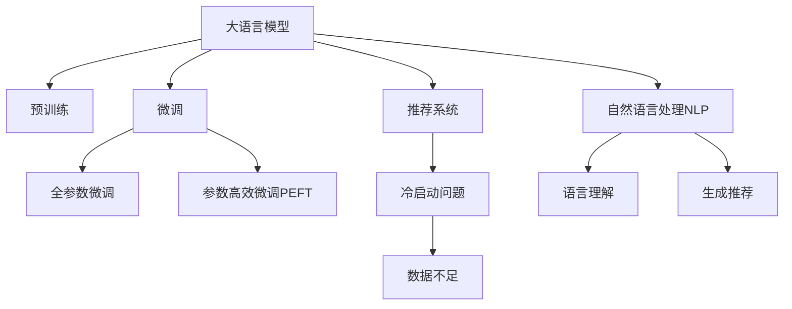

                 

# ChatGPT在推荐领域

大语言模型，尤其是ChatGPT，近年来在自然语言处理(NLP)领域取得了显著进展，其能力已经远超传统的文本生成模型。ChatGPT通过在海量数据上预训练，能够生成自然流畅、语义连贯的文本，具有极强的语言理解和生成能力。本文将详细探讨ChatGPT在推荐领域的应用，包括其原理、操作步骤、优势与挑战，以及未来的发展趋势。

## 1. 背景介绍

### 1.1 问题由来
推荐系统在电商、视频、音乐、新闻等领域扮演着至关重要的角色。传统推荐系统依赖于用户行为数据，如点击、购买、评分等，构建模型预测用户可能感兴趣的内容。然而，这种基于行为数据的推荐方式存在冷启动问题，即对于新用户或新商品，无法准确预测用户行为。此外，推荐模型难以捕捉用户的潜在兴趣和偏好，导致推荐结果缺乏多样性和个性化。

为了解决这些问题，研究者们开始探索利用大语言模型进行推荐，其中ChatGPT因其强大的语言生成能力，成为了潜在的重要工具。基于ChatGPT的推荐系统通过自然语言处理技术，将用户的搜索历史、评论反馈等转化为文本形式，进而生成个性化的推荐结果。

### 1.2 问题核心关键点
ChatGPT在推荐领域的应用涉及以下几个核心关键点：

- **语言理解能力**：ChatGPT能够通过语义理解生成与用户输入匹配的推荐内容，提升推荐结果的相关性和个性化。
- **推荐多样性**：通过自然语言生成，ChatGPT能够提供多样化的推荐选项，避免推荐结果的同质化。
- **用户反馈**：利用ChatGPT生成推荐结果后，通过用户的反馈进一步微调模型，提升推荐效果。
- **冷启动问题**：在用户行为数据不足的情况下，ChatGPT可以通过自然语言处理技术，预测用户兴趣，解决冷启动问题。
- **融合其他信息源**：将ChatGPT与商品描述、用户画像、社交网络等外部信息源结合，提高推荐准确性和覆盖率。

## 2. 核心概念与联系

### 2.1 核心概念概述

为更好地理解ChatGPT在推荐领域的应用，本节将介绍几个密切相关的核心概念：

- **大语言模型**：以自回归(如GPT)或自编码(如BERT)模型为代表的大规模预训练语言模型。通过在海量无标签文本数据上进行预训练，学习通用的语言表示，具备强大的语言理解和生成能力。

- **预训练(Pre-training)**：指在大规模无标签文本语料上，通过自监督学习任务训练通用语言模型的过程。常见的预训练任务包括言语建模、遮挡语言模型等。

- **微调(Fine-tuning)**：指在预训练模型的基础上，使用下游任务的少量标注数据，通过有监督学习优化模型在特定任务上的性能。通常只需要调整顶层分类器或解码器，并以较小的学习率更新全部或部分的模型参数。

- **推荐系统**：根据用户的历史行为、兴趣和上下文信息，为用户推荐可能感兴趣的产品或内容的系统。推荐系统可以分为基于协同过滤、内容推荐、混合推荐等多种方式。

- **冷启动问题**：对于新用户或新商品，推荐系统无法获取足够的行为数据，导致难以准确预测用户兴趣。

- **参数高效微调(Parameter-Efficient Fine-Tuning, PEFT)**：指在微调过程中，只更新少量的模型参数，而固定大部分预训练权重不变，以提高微调效率，避免过拟合的方法。

这些核心概念之间的逻辑关系可以通过以下Mermaid流程图来展示：



这个流程图展示了大语言模型的核心概念及其之间的关系：

1. 大语言模型通过预训练获得基础能力。
2. 微调是对预训练模型进行任务特定的优化，可以分为全参数微调和参数高效微调。
3. 推荐系统利用微调后的模型生成个性化推荐内容。
4. 冷启动问题需要通过自然语言处理技术，预测用户兴趣解决。
5. 自然语言处理包括语言理解和生成，是推荐系统的重要组成部分。

## 3. 核心算法原理 & 具体操作步骤

### 3.1 算法原理概述

基于ChatGPT的推荐系统，本质上是一个有监督的细粒度迁移学习过程。其核心思想是：将预训练的ChatGPT模型作为初始化参数，通过用户的历史行为、兴趣和上下文信息等，有监督地训练模型，优化其在特定推荐任务上的性能。

形式化地，假设预训练模型为 $M_{\theta}$，其中 $\theta$ 为预训练得到的模型参数。给定推荐任务的训练集 $D=\{(x_i,y_i)\}_{i=1}^N$，推荐的目标是找到新的模型参数 $\hat{\theta}$，使得：

$$
\hat{\theta}=\mathop{\arg\min}_{\theta} \mathcal{L}(M_{\theta},D)
$$

其中 $\mathcal{L}$ 为针对推荐任务设计的损失函数，用于衡量模型预测结果与真实标签之间的差异。常见的损失函数包括交叉熵损失、均方误差损失等。

通过梯度下降等优化算法，推荐过程不断更新模型参数 $\theta$，最小化损失函数 $\mathcal{L}$，使得模型输出逼近真实标签。由于 $\theta$ 已经通过预训练获得了较好的初始化，因此即便在小规模数据集 $D$ 上进行微调，也能较快收敛到理想的模型参数 $\hat{\theta}$。

### 3.2 算法步骤详解

基于ChatGPT的推荐系统一般包括以下几个关键步骤：

**Step 1: 准备预训练模型和数据集**
- 选择合适的预训练ChatGPT模型作为初始化参数。
- 准备推荐任务的训练集 $D$，划分为训练集、验证集和测试集。一般要求标注数据与预训练数据的分布不要差异过大。

**Step 2: 添加任务适配层**
- 根据推荐任务类型，在预训练模型顶层设计合适的输出层和损失函数。
- 对于分类任务，通常在顶层添加线性分类器和交叉熵损失函数。
- 对于生成任务，通常使用语言模型的解码器输出概率分布，并以负对数似然为损失函数。

**Step 3: 设置推荐超参数**
- 选择合适的优化算法及其参数，如 AdamW、SGD 等，设置学习率、批大小、迭代轮数等。
- 设置正则化技术及强度，包括权重衰减、Dropout、Early Stopping等。
- 确定冻结预训练参数的策略，如仅微调顶层，或全部参数都参与微调。

**Step 4: 执行梯度训练**
- 将训练集数据分批次输入模型，前向传播计算损失函数。
- 反向传播计算参数梯度，根据设定的优化算法和学习率更新模型参数。
- 周期性在验证集上评估模型性能，根据性能指标决定是否触发 Early Stopping。
- 重复上述步骤直到满足预设的迭代轮数或 Early Stopping 条件。

**Step 5: 测试和部署**
- 在测试集上评估微调后模型 $M_{\hat{\theta}}$ 的性能，对比微调前后的精度提升。
- 使用微调后的模型对新样本进行推荐预测，集成到实际的应用系统中。
- 持续收集新的数据，定期重新微调模型，以适应数据分布的变化。

以上是基于ChatGPT的推荐系统的一般流程。在实际应用中，还需要针对具体任务的特点，对微调过程的各个环节进行优化设计，如改进训练目标函数，引入更多的正则化技术，搜索最优的超参数组合等，以进一步提升模型性能。

### 3.3 算法优缺点

基于ChatGPT的推荐系统具有以下优点：
1. 简单高效。只需准备少量标注数据，即可对预训练模型进行快速适配，生成高质量推荐结果。
2. 泛化能力强。ChatGPT的强大语言理解和生成能力，使其能够处理各种推荐场景，适应性强。
3. 模型鲁棒性好。ChatGPT能够利用上下文信息，生成稳定可靠的推荐结果。
4. 推荐多样性高。通过自然语言生成，ChatGPT可以提供多样化、个性化的推荐选项，满足用户需求。

同时，该方法也存在一定的局限性：
1. 依赖标注数据。微调的效果很大程度上取决于标注数据的质量和数量，获取高质量标注数据的成本较高。
2. 知识提取不足。由于预训练数据的泛化性，ChatGPT可能无法有效捕捉特定领域的知识，导致推荐结果不够精准。
3. 可解释性不足。ChatGPT的推荐过程缺乏可解释性，难以对其推理逻辑进行分析和调试。

尽管存在这些局限性，但就目前而言，基于ChatGPT的推荐方法已经在大规模推荐系统实践中得到应用，并取得了良好的效果。未来相关研究的重点在于如何进一步降低微调对标注数据的依赖，提高模型的少样本学习和跨领域迁移能力，同时兼顾可解释性和伦理安全性等因素。

### 3.4 算法应用领域

基于ChatGPT的推荐系统已经在多个领域得到应用，例如：

- 电商推荐：利用ChatGPT生成个性化商品推荐，提升用户购物体验。
- 视频推荐：通过自然语言处理技术，生成符合用户兴趣的视频内容推荐。
- 音乐推荐：分析用户评论和行为数据，生成个性化音乐推荐。
- 新闻推荐：结合用户的浏览历史和社交网络，生成个性化新闻内容推荐。

除了上述这些经典应用外，基于ChatGPT的推荐技术还在旅游、金融、健康医疗等诸多领域得到了创新性应用，为NLP技术带来了新的突破。随着ChatGPT和推荐方法不断进步，相信其在推荐领域的应用将会更加广泛，带来更多的创新价值。

## 4. 数学模型和公式 & 详细讲解

### 4.1 数学模型构建

本节将使用数学语言对基于ChatGPT的推荐过程进行更加严格的刻画。

记预训练语言模型为 $M_{\theta}$，其中 $\theta$ 为模型参数。假设推荐任务的训练集为 $D=\{(x_i,y_i)\}_{i=1}^N, x_i \in \mathcal{X}, y_i \in \mathcal{Y}$，其中 $\mathcal{X}$ 为输入空间，$\mathcal{Y}$ 为推荐结果空间。

定义模型 $M_{\theta}$ 在数据样本 $(x,y)$ 上的损失函数为 $\ell(M_{\theta}(x),y)$，则在数据集 $D$ 上的经验风险为：

$$
\mathcal{L}(\theta) = \frac{1}{N} \sum_{i=1}^N \ell(M_{\theta}(x_i),y_i)
$$

其中，推荐结果 $y_i$ 可以是商品ID、视频ID、新闻ID等，具体取决于推荐任务类型。推荐的目标是最小化经验风险，即找到最优参数：

$$
\theta^* = \mathop{\arg\min}_{\theta} \mathcal{L}(\theta)
$$

在实践中，我们通常使用基于梯度的优化算法（如SGD、Adam等）来近似求解上述最优化问题。设 $\eta$ 为学习率，$\lambda$ 为正则化系数，则参数的更新公式为：

$$
\theta \leftarrow \theta - \eta \nabla_{\theta}\mathcal{L}(\theta) - \eta\lambda\theta
$$

其中 $\nabla_{\theta}\mathcal{L}(\theta)$ 为损失函数对参数 $\theta$ 的梯度，可通过反向传播算法高效计算。

### 4.2 公式推导过程

以下我们以电商推荐任务为例，推导交叉熵损失函数及其梯度的计算公式。

假设模型 $M_{\theta}$ 在输入 $x$ 上的输出为 $\hat{y}=M_{\theta}(x) \in [0,1]$，表示商品被购买的概率。真实标签 $y \in \{0,1\}$。则二分类交叉熵损失函数定义为：

$$
\ell(M_{\theta}(x),y) = -[y\log \hat{y} + (1-y)\log (1-\hat{y})]
$$

将其代入经验风险公式，得：

$$
\mathcal{L}(\theta) = -\frac{1}{N}\sum_{i=1}^N [y_i\log M_{\theta}(x_i)+(1-y_i)\log(1-M_{\theta}(x_i))]
$$

根据链式法则，损失函数对参数 $\theta_k$ 的梯度为：

$$
\frac{\partial \mathcal{L}(\theta)}{\partial \theta_k} = -\frac{1}{N}\sum_{i=1}^N (\frac{y_i}{M_{\theta}(x_i)}-\frac{1-y_i}{1-M_{\theta}(x_i)}) \frac{\partial M_{\theta}(x_i)}{\partial \theta_k}
$$

其中 $\frac{\partial M_{\theta}(x_i)}{\partial \theta_k}$ 可进一步递归展开，利用自动微分技术完成计算。

在得到损失函数的梯度后，即可带入参数更新公式，完成模型的迭代优化。重复上述过程直至收敛，最终得到适应推荐任务的最优模型参数 $\theta^*$。

## 5. 项目实践：代码实例和详细解释说明

### 5.1 开发环境搭建

在进行推荐实践前，我们需要准备好开发环境。以下是使用Python进行PyTorch开发的环境配置流程：

1. 安装Anaconda：从官网下载并安装Anaconda，用于创建独立的Python环境。

2. 创建并激活虚拟环境：
```bash
conda create -n pytorch-env python=3.8 
conda activate pytorch-env
```

3. 安装PyTorch：根据CUDA版本，从官网获取对应的安装命令。例如：
```bash
conda install pytorch torchvision torchaudio cudatoolkit=11.1 -c pytorch -c conda-forge
```

4. 安装Transformers库：
```bash
pip install transformers
```

5. 安装各类工具包：
```bash
pip install numpy pandas scikit-learn matplotlib tqdm jupyter notebook ipython
```

完成上述步骤后，即可在`pytorch-env`环境中开始推荐实践。

### 5.2 源代码详细实现

下面我们以电商推荐任务为例，给出使用Transformers库对GPT模型进行推荐训练的PyTorch代码实现。

首先，定义推荐任务的数据处理函数：

```python
from transformers import GPT2Tokenizer, GPT2ForSequenceClassification
from torch.utils.data import Dataset, DataLoader
import torch

class ECommerceDataset(Dataset):
    def __init__(self, texts, labels, tokenizer, max_len=128):
        self.texts = texts
        self.labels = labels
        self.tokenizer = tokenizer
        self.max_len = max_len
        
    def __len__(self):
        return len(self.texts)
    
    def __getitem__(self, item):
        text = self.texts[item]
        label = self.labels[item]
        
        encoding = self.tokenizer(text, return_tensors='pt', max_length=self.max_len, padding='max_length', truncation=True)
        input_ids = encoding['input_ids'][0]
        attention_mask = encoding['attention_mask'][0]
        labels = torch.tensor([label], dtype=torch.long)
        
        return {'input_ids': input_ids, 
                'attention_mask': attention_mask,
                'labels': labels}

# 创建dataset
tokenizer = GPT2Tokenizer.from_pretrained('gpt2')

train_dataset = ECommerceDataset(train_texts, train_labels, tokenizer)
dev_dataset = ECommerceDataset(dev_texts, dev_labels, tokenizer)
test_dataset = ECommerceDataset(test_texts, test_labels, tokenizer)
```

然后，定义模型和优化器：

```python
from transformers import AdamW

model = GPT2ForSequenceClassification.from_pretrained('gpt2', num_labels=2)

optimizer = AdamW(model.parameters(), lr=2e-5)
```

接着，定义训练和评估函数：

```python
from tqdm import tqdm
from sklearn.metrics import accuracy_score

device = torch.device('cuda') if torch.cuda.is_available() else torch.device('cpu')
model.to(device)

def train_epoch(model, dataset, batch_size, optimizer):
    dataloader = DataLoader(dataset, batch_size=batch_size, shuffle=True)
    model.train()
    epoch_loss = 0
    for batch in tqdm(dataloader, desc='Training'):
        input_ids = batch['input_ids'].to(device)
        attention_mask = batch['attention_mask'].to(device)
        labels = batch['labels'].to(device)
        model.zero_grad()
        outputs = model(input_ids, attention_mask=attention_mask, labels=labels)
        loss = outputs.loss
        epoch_loss += loss.item()
        loss.backward()
        optimizer.step()
    return epoch_loss / len(dataloader)

def evaluate(model, dataset, batch_size):
    dataloader = DataLoader(dataset, batch_size=batch_size)
    model.eval()
    preds, labels = [], []
    with torch.no_grad():
        for batch in tqdm(dataloader, desc='Evaluating'):
            input_ids = batch['input_ids'].to(device)
            attention_mask = batch['attention_mask'].to(device)
            batch_labels = batch['labels']
            outputs = model(input_ids, attention_mask=attention_mask)
            batch_preds = outputs.logits.argmax(dim=2).to('cpu').tolist()
            batch_labels = batch_labels.to('cpu').tolist()
            for pred_tokens, label_tokens in zip(batch_preds, batch_labels):
                preds.append(pred_tokens)
                labels.append(label_tokens)
                
    return accuracy_score(labels, preds)

```

最后，启动训练流程并在测试集上评估：

```python
epochs = 5
batch_size = 16

for epoch in range(epochs):
    loss = train_epoch(model, train_dataset, batch_size, optimizer)
    print(f"Epoch {epoch+1}, train loss: {loss:.3f}")
    
    print(f"Epoch {epoch+1}, dev results:")
    accuracy = evaluate(model, dev_dataset, batch_size)
    print(f"Dev accuracy: {accuracy:.3f}")
    
print("Test results:")
accuracy = evaluate(model, test_dataset, batch_size)
print(f"Test accuracy: {accuracy:.3f}")
```

以上就是使用PyTorch对GPT进行电商推荐任务训练的完整代码实现。可以看到，得益于Transformers库的强大封装，我们可以用相对简洁的代码完成GPT模型的加载和训练。

### 5.3 代码解读与分析

让我们再详细解读一下关键代码的实现细节：

**ECommerceDataset类**：
- `__init__`方法：初始化文本、标签、分词器等关键组件。
- `__len__`方法：返回数据集的样本数量。
- `__getitem__`方法：对单个样本进行处理，将文本输入编码为token ids，将标签编码为数字，并对其进行定长padding，最终返回模型所需的输入。

**GPT2ForSequenceClassification**：
- 使用了GPT2作为预训练模型，并指定输出层为分类器，适合进行电商推荐任务的微调。

**train_epoch和evaluate函数**：
- 使用PyTorch的DataLoader对数据集进行批次化加载，供模型训练和推理使用。
- 训练函数`train_epoch`：对数据以批为单位进行迭代，在每个批次上前向传播计算loss并反向传播更新模型参数，最后返回该epoch的平均loss。
- 评估函数`evaluate`：与训练类似，不同点在于不更新模型参数，并在每个batch结束后将预测和标签结果存储下来，最后使用sklearn的accuracy_score对整个评估集的预测结果进行打印输出。

**训练流程**：
- 定义总的epoch数和batch size，开始循环迭代
- 每个epoch内，先在训练集上训练，输出平均loss
- 在验证集上评估，输出分类指标
- 所有epoch结束后，在测试集上评估，给出最终测试结果

可以看到，PyTorch配合Transformers库使得GPT微调的代码实现变得简洁高效。开发者可以将更多精力放在数据处理、模型改进等高层逻辑上，而不必过多关注底层的实现细节。

当然，工业级的系统实现还需考虑更多因素，如模型的保存和部署、超参数的自动搜索、更灵活的任务适配层等。但核心的微调范式基本与此类似。

## 6. 实际应用场景

### 6.1 智能客服系统

基于GPT的推荐技术，可以广泛应用于智能客服系统的构建。传统客服往往需要配备大量人力，高峰期响应缓慢，且一致性和专业性难以保证。而使用基于GPT的推荐技术，可以7x24小时不间断服务，快速响应客户咨询，用自然流畅的语言解答各类常见问题。

在技术实现上，可以收集企业内部的历史客服对话记录，将问题和最佳答复构建成监督数据，在此基础上对预训练GPT模型进行微调。微调后的GPT模型能够自动理解用户意图，匹配最合适的答案模板进行回复。对于客户提出的新问题，还可以接入检索系统实时搜索相关内容，动态组织生成回答。如此构建的智能客服系统，能大幅提升客户咨询体验和问题解决效率。

### 6.2 金融舆情监测

金融机构需要实时监测市场舆论动向，以便及时应对负面信息传播，规避金融风险。传统的人工监测方式成本高、效率低，难以应对网络时代海量信息爆发的挑战。基于GPT的文本分类和情感分析技术，为金融舆情监测提供了新的解决方案。

具体而言，可以收集金融领域相关的新闻、报道、评论等文本数据，并对其进行主题标注和情感标注。在此基础上对预训练GPT模型进行微调，使其能够自动判断文本属于何种主题，情感倾向是正面、中性还是负面。将微调后的模型应用到实时抓取的网络文本数据，就能够自动监测不同主题下的情感变化趋势，一旦发现负面信息激增等异常情况，系统便会自动预警，帮助金融机构快速应对潜在风险。

### 6.3 个性化推荐系统

当前的推荐系统往往只依赖用户的历史行为数据进行物品推荐，无法深入理解用户的真实兴趣偏好。基于GPT的个性化推荐系统可以更好地挖掘用户行为背后的语义信息，从而提供更精准、多样的推荐内容。

在实践中，可以收集用户浏览、点击、评论、分享等行为数据，提取和用户交互的物品标题、描述、标签等文本内容。将文本内容作为模型输入，用户的后续行为（如是否点击、购买等）作为监督信号，在此基础上微调预训练GPT模型。微调后的模型能够从文本内容中准确把握用户的兴趣点。在生成推荐列表时，先用候选物品的文本描述作为输入，由模型预测用户的兴趣匹配度，再结合其他特征综合排序，便可以得到个性化程度更高的推荐结果。

### 6.4 未来应用展望

随着GPT模型和推荐方法的发展，基于GPT的推荐技术将在更多领域得到应用，为NLP技术带来新的突破。

在智慧医疗领域，基于GPT的医疗问答、病历分析、药物研发等应用将提升医疗服务的智能化水平，辅助医生诊疗，加速新药开发进程。

在智能教育领域，GPT技术可应用于作业批改、学情分析、知识推荐等方面，因材施教，促进教育公平，提高教学质量。

在智慧城市治理中，GPT技术可应用于城市事件监测、舆情分析、应急指挥等环节，提高城市管理的自动化和智能化水平，构建更安全、高效的未来城市。

此外，在企业生产、社会治理、文娱传媒等众多领域，基于GPT的推荐技术也将不断涌现，为传统行业数字化转型升级提供新的技术路径。相信随着技术的日益成熟，GPT推荐技术必将在构建人机协同的智能时代中扮演越来越重要的角色。

## 7. 工具和资源推荐
### 7.1 学习资源推荐

为了帮助开发者系统掌握GPT在推荐领域的应用，这里推荐一些优质的学习资源：

1. 《Transformer从原理到实践》系列博文：由大模型技术专家撰写，深入浅出地介绍了Transformer原理、GPT模型、推荐系统等前沿话题。

2. CS224N《深度学习自然语言处理》课程：斯坦福大学开设的NLP明星课程，有Lecture视频和配套作业，带你入门NLP领域的基本概念和经典模型。

3. 《Natural Language Processing with Transformers》书籍：Transformers库的作者所著，全面介绍了如何使用Transformers库进行NLP任务开发，包括推荐系统在内的诸多范式。

4. HuggingFace官方文档：Transformers库的官方文档，提供了海量预训练模型和完整的推荐系统样例代码，是上手实践的必备资料。

5. CLUE开源项目：中文语言理解测评基准，涵盖大量不同类型的中文NLP数据集，并提供了基于GPT的baseline模型，助力中文NLP技术发展。

通过对这些资源的学习实践，相信你一定能够快速掌握GPT在推荐领域的应用精髓，并用于解决实际的NLP问题。
###  7.2 开发工具推荐

高效的开发离不开优秀的工具支持。以下是几款用于GPT推荐系统开发的常用工具：

1. PyTorch：基于Python的开源深度学习框架，灵活动态的计算图，适合快速迭代研究。大部分预训练语言模型都有PyTorch版本的实现。

2. TensorFlow：由Google主导开发的开源深度学习框架，生产部署方便，适合大规模工程应用。同样有丰富的预训练语言模型资源。

3. Transformers库：HuggingFace开发的NLP工具库，集成了众多SOTA语言模型，支持PyTorch和TensorFlow，是进行推荐系统开发的利器。

4. Weights & Biases：模型训练的实验跟踪工具，可以记录和可视化模型训练过程中的各项指标，方便对比和调优。与主流深度学习框架无缝集成。

5. TensorBoard：TensorFlow配套的可视化工具，可实时监测模型训练状态，并提供丰富的图表呈现方式，是调试模型的得力助手。

6. Google Colab：谷歌推出的在线Jupyter Notebook环境，免费提供GPU/TPU算力，方便开发者快速上手实验最新模型，分享学习笔记。

合理利用这些工具，可以显著提升GPT推荐系统的开发效率，加快创新迭代的步伐。

### 7.3 相关论文推荐

GPT在推荐领域的应用源于学界的持续研究。以下是几篇奠基性的相关论文，推荐阅读：

1. Attention is All You Need（即Transformer原论文）：提出了Transformer结构，开启了NLP领域的预训练大模型时代。

2. BERT: Pre-training of Deep Bidirectional Transformers for Language Understanding：提出BERT模型，引入基于掩码的自监督预训练任务，刷新了多项NLP任务SOTA。

3. Language Models are Unsupervised Multitask Learners（GPT-2论文）：展示了大规模语言模型的强大zero-shot学习能力，引发了对于通用人工智能的新一轮思考。

4. Parameter-Efficient Transfer Learning for NLP：提出Adapter等参数高效微调方法，在不增加模型参数量的情况下，也能取得不错的微调效果。

5. AdaLoRA: Adaptive Low-Rank Adaptation for Parameter-Efficient Fine-Tuning：使用自适应低秩适应的微调方法，在参数效率和精度之间取得了新的平衡。

6. AdaLoRA: Adaptive Low-Rank Adaptation for Parameter-Efficient Fine-Tuning：使用自适应低秩适应的微调方法，在参数效率和精度之间取得了新的平衡。

这些论文代表了大语言模型在推荐领域的研究进展。通过学习这些前沿成果，可以帮助研究者把握学科前进方向，激发更多的创新灵感。

## 8. 总结：未来发展趋势与挑战

### 8.1 总结

本文对基于GPT的推荐系统进行了全面系统的介绍。首先阐述了GPT在推荐领域的应用背景和意义，明确了推荐系统面临的冷启动、推荐多样性、用户反馈等问题，以及GPT的强大语言生成能力如何帮助解决这些问题。其次，从原理到实践，详细讲解了GPT在推荐系统中的应用步骤、数学模型和具体实现，提供了完整的代码实例。同时，本文还广泛探讨了GPT在智能客服、金融舆情、个性化推荐等多个行业领域的应用前景，展示了GPT推荐系统的前景和潜力。此外，本文精选了推荐系统的各类学习资源，力求为读者提供全方位的技术指引。

通过本文的系统梳理，可以看到，基于GPT的推荐系统已经在大规模推荐系统实践中得到应用，并取得了良好的效果。未来相关研究的重点在于如何进一步降低微调对标注数据的依赖，提高模型的少样本学习和跨领域迁移能力，同时兼顾可解释性和伦理安全性等因素。

### 8.2 未来发展趋势

展望未来，GPT在推荐领域将呈现以下几个发展趋势：

1. 模型规模持续增大。随着算力成本的下降和数据规模的扩张，预训练语言模型的参数量还将持续增长。超大规模语言模型蕴含的丰富语言知识，有望支撑更加复杂多变的推荐场景。

2. 推荐方法日趋多样。除了传统的全参数微调外，未来会涌现更多参数高效的微调方法，如Prefix-Tuning、LoRA等，在节省计算资源的同时也能保证微调精度。

3. 持续学习成为常态。随着数据分布的不断变化，GPT推荐系统也需要持续学习新知识以保持性能。如何在不遗忘原有知识的同时，高效吸收新样本信息，将成为重要的研究课题。

4. 标注样本需求降低。受启发于提示学习(Prompt-based Learning)的思路，未来的GPT推荐方法将更好地利用GPT的语言理解能力，通过更加巧妙的任务描述，在更少的标注样本上也能实现理想的推荐效果。

5. 融合多模态数据。GPT推荐系统不仅限于文本数据，未来的推荐系统将融合图像、视频、音频等多模态数据，提升推荐系统的综合能力。

6. 推荐系统的伦理性。随着GPT推荐系统在各领域的广泛应用，其伦理性和公平性问题将受到越来越多的关注。未来的推荐系统需要在算法设计中纳入伦理导向，避免算法的偏见和歧视。

以上趋势凸显了GPT在推荐领域的应用前景和研究挑战。这些方向的探索发展，必将进一步提升GPT推荐系统的性能和应用范围，为构建安全、可靠、可解释、可控的智能系统铺平道路。面向未来，GPT推荐技术还需要与其他人工智能技术进行更深入的融合，如知识表示、因果推理、强化学习等，多路径协同发力，共同推动智能交互系统的进步。只有勇于创新、敢于突破，才能不断拓展GPT的边界，让智能技术更好地造福人类社会。

### 8.3 面临的挑战

尽管GPT在推荐系统中的应用已经取得了显著进展，但在迈向更加智能化、普适化应用的过程中，它仍面临着诸多挑战：

1. 标注成本瓶颈。虽然微调过程可以显著降低标注数据的需求，但对于长尾应用场景，难以获得充足的高质量标注数据，成为制约GPT推荐性能的瓶颈。如何进一步降低GPT推荐对标注样本的依赖，将是一大难题。

2. 模型鲁棒性不足。GPT模型面对域外数据时，泛化性能往往大打折扣。对于测试样本的微小扰动，GPT推荐模型的预测也容易发生波动。如何提高GPT推荐模型的鲁棒性，避免灾难性遗忘，还需要更多理论和实践的积累。

3. 推理效率有待提高。大规模GPT模型虽然精度高，但在实际部署时往往面临推理速度慢、内存占用大等效率问题。如何在保证性能的同时，简化模型结构，提升推理速度，优化资源占用，将是重要的优化方向。

4. 可解释性亟需加强。GPT推荐模型的决策过程缺乏可解释性，难以对其推理逻辑进行分析和调试。对于医疗、金融等高风险应用，算法的可解释性和可审计性尤为重要。如何赋予GPT推荐模型更强的可解释性，将是亟待攻克的难题。

5. 安全性有待保障。GPT推荐模型难免会学习到有偏见、有害的信息，通过推荐传递到用户，产生误导性、歧视性的输出，给实际应用带来安全隐患。如何从数据和算法层面消除GPT推荐模型的偏见，避免恶意用途，确保输出的安全性，也将是重要的研究课题。

6. 知识整合能力不足。现有的GPT推荐模型往往局限于文本数据，难以灵活吸收和运用更广泛的先验知识。如何让GPT推荐过程更好地与外部知识库、规则库等专家知识结合，形成更加全面、准确的信息整合能力，还有很大的想象空间。

正视GPT推荐面临的这些挑战，积极应对并寻求突破，将是GPT推荐系统走向成熟的必由之路。相信随着学界和产业界的共同努力，这些挑战终将一一被克服，GPT推荐技术必将在构建安全、可靠、可解释、可控的智能系统铺平道路。

### 8.4 研究展望

面向未来，GPT推荐系统需要在以下几个方面寻求新的突破：

1. 探索无监督和半监督GPT推荐方法。摆脱对大规模标注数据的依赖，利用自监督学习、主动学习等无监督和半监督范式，最大限度利用非结构化数据，实现更加灵活高效的GPT推荐。

2. 研究参数高效和计算高效的GPT推荐范式。开发更加参数高效的GPT推荐方法，在固定大部分预训练参数的同时，只更新极少量的任务相关参数。同时优化GPT推荐模型的计算图，减少前向传播和反向传播的资源消耗，实现更加轻量级、实时性的部署。

3. 融合因果和对比学习范式。通过引入因果推断和对比学习思想，增强GPT推荐建立稳定因果关系的能力，学习更加普适、鲁棒的语言表征，从而提升推荐泛化性和抗干扰能力。

4. 引入更多先验知识。将符号化的先验知识，如知识图谱、逻辑规则等，与神经网络模型进行巧妙融合，引导GPT推荐过程学习更准确、合理的语言模型。同时加强不同模态数据的整合，实现视觉、语音等多模态信息与文本信息的协同建模。

5. 结合因果分析和博弈论工具。将因果分析方法引入GPT推荐模型，识别出模型决策的关键特征，增强输出解释的因果性和逻辑性。借助博弈论工具刻画人机交互过程，主动探索并规避GPT推荐的脆弱点，提高系统稳定性。

6. 纳入伦理道德约束。在GPT推荐目标中引入伦理导向的评估指标，过滤和惩罚有偏见、有害的输出倾向。同时加强人工干预和审核，建立GPT推荐行为的监管机制，确保输出符合人类价值观和伦理道德。

这些研究方向的探索，必将引领GPT推荐技术迈向更高的台阶，为构建安全、可靠、可解释、可控的智能系统铺平道路。面向未来，GPT推荐技术还需要与其他人工智能技术进行更深入的融合，如知识表示、因果推理、强化学习等，多路径协同发力，共同推动智能交互系统的进步。只有勇于创新、敢于突破，才能不断拓展GPT的边界，让智能技术更好地造福人类社会。

## 9. 附录：常见问题与解答

**Q1：GPT在推荐系统中的优缺点有哪些？**

A: GPT在推荐系统中的优点包括：

1. 强大语言生成能力：GPT能够自然流畅地生成推荐结果，提升推荐的多样性和个性化。
2. 泛化能力强：GPT能够处理各种推荐场景，适应性强。
3. 模型鲁棒性好：GPT推荐模型能够利用上下文信息，生成稳定可靠的推荐结果。
4. 推荐多样性高：通过自然语言生成，GPT可以提供多样化、个性化的推荐选项，满足用户需求。

GPT在推荐系统中的缺点包括：

1. 依赖标注数据：GPT微调过程需要大量标注数据，获取高质量标注数据的成本较高。
2. 知识提取不足：由于预训练数据的泛化性，GPT可能无法有效捕捉特定领域的知识，导致推荐结果不够精准。
3. 可解释性不足：GPT推荐过程缺乏可解释性，难以对其推理逻辑进行分析和调试。

尽管存在这些局限性，但GPT在推荐系统中的应用已经取得了显著进展，未来相关研究的重点在于如何进一步降低微调对标注数据的依赖，提高模型的少样本学习和跨领域迁移能力，同时兼顾可解释性和伦理安全性等因素。

**Q2：如何降低GPT推荐系统对标注数据的依赖？**

A: 为了降低GPT推荐系统对标注数据的依赖，可以考虑以下方法：

1. 利用无监督或半监督学习：通过自监督学习、主动学习等无监督和半监督范式，最大限度利用非结构化数据，实现更加灵活高效的GPT推荐。

2. 融合多模态数据：GPT推荐系统不仅限于文本数据，未来的推荐系统将融合图像、视频、音频等多模态数据，提升推荐系统的综合能力。

3. 引入知识图谱：将符号化的先验知识，如知识图谱、逻辑规则等，与神经网络模型进行巧妙融合，引导GPT推荐过程学习更准确、合理的语言模型。

4. 优化推荐算法：通过改进推荐算法，如协同过滤、内容推荐等，结合GPT推荐结果，提升推荐系统的综合性能。

5. 数据增强：通过数据增强技术，如回译、近义替换等，扩充训练集，提高模型的泛化能力。

这些方法可以帮助GPT推荐系统在不依赖大规模标注数据的情况下，仍然能够取得较好的推荐效果。

**Q3：GPT推荐系统的推理效率如何提升？**

A: 为了提升GPT推荐系统的推理效率，可以考虑以下方法：

1. 参数高效微调：使用参数高效微调技术，如AdaLoRA、Adapter等，在固定大部分预训练参数的同时，只更新极少量的任务相关参数，减小计算资源消耗。

2. 模型压缩和稀疏化：采用模型压缩和稀疏化技术，减小模型的存储空间和计算量，提升推理速度。

3. 混合精度训练：使用混合精度训练技术，减少浮点运算的精度，提升推理效率。

4. 模型并行和分布式训练：采用模型并行和分布式训练技术，提高计算效率，加速推理。

5. 优化算法：使用更高效的优化算法，如Adafactor、LAMB等，加速模型训练和推理。

这些方法可以帮助GPT推荐系统在不牺牲性能的情况下，提升推理效率，实现更高效的部署和应用。

**Q4：GPT推荐系统的伦理性如何保障？**

A: 为了保障GPT推荐系统的伦理性，可以考虑以下方法：

1. 引入伦理导向的评估指标：在GPT推荐目标中引入伦理导向的评估指标，过滤和惩罚有偏见、有害的输出倾向。

2. 加强人工干预和审核：建立GPT推荐行为的监管机制，对推荐结果进行人工审核，确保输出符合人类价值观和伦理道德。

3. 引入知识图谱和规则库：将符号化的先验知识，如知识图谱、逻辑规则等，与神经网络模型进行巧妙融合，引导GPT推荐过程学习更准确、合理的语言模型。

4. 引入对比学习：利用对比学习技术，训练GPT推荐模型，使其能够区分有害和无害内容，避免有害信息的传播。

5. 数据清洗和预处理：对推荐数据进行清洗和预处理，去除有害信息和偏见，提升GPT推荐模型的公平性和公正性。

这些方法可以帮助GPT推荐系统在保持高性能的同时，保障其伦理性，避免算法的偏见和歧视。

**Q5：GPT推荐系统如何提升推荐多样性？**

A: 为了提升GPT推荐系统的多样性，可以考虑以下方法：

1. 引入多样性损失函数：在GPT推荐模型的损失函数中加入多样性约束，确保推荐结果不偏向某一类商品或内容。

2. 利用多模态数据：融合图像、视频、音频等多模态数据，提升推荐系统的综合能力，推荐更加多样化的内容。

3. 引入知识图谱和规则库：将符号化的先验知识，如知识图谱、逻辑规则等，与神经网络模型进行巧妙融合，引导GPT推荐过程学习更准确、合理的语言模型。

4. 引入上下文信息：在GPT推荐模型中引入上下文信息，如用户的历史行为、社交网络等，提高推荐结果的相关性和多样性。

5. 优化推荐算法：通过改进推荐算法，如协同过滤、内容推荐等，结合GPT推荐结果，提升推荐系统的综合性能。

这些方法可以帮助GPT推荐系统在不牺牲性能的情况下，提升推荐结果的多样性和个性化。

---

作者：禅与计算机程序设计艺术 / Zen and the Art of Computer Programming

