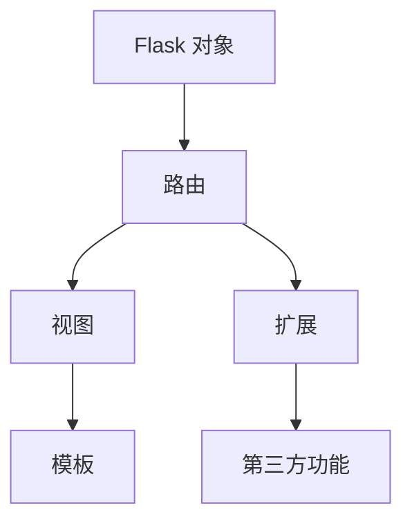
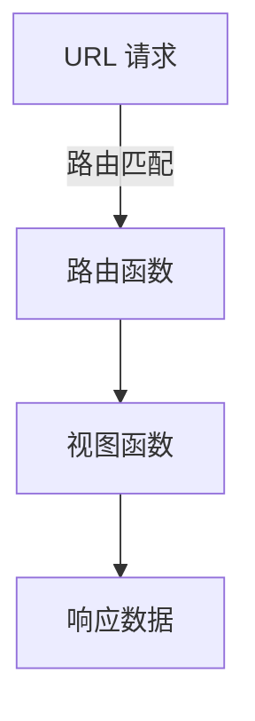

                 

# Flask 框架：微型 Python 框架

> 关键词：Flask, Python Web 开发, 微型框架, RESTful API, 微服务架构

## 1. 背景介绍

### 1.1 问题由来
在当今快速变化的技术环境中，Web开发人员和系统架构师面临着前所未有的挑战。一方面，Web应用程序的复杂性日益增加，包括微服务架构、容器化部署、DevOps 实践等；另一方面，传统的 Web 框架如 Django 和 Ruby on Rails 等，虽然功能丰富，但过于复杂，使用门槛较高。

为了解决这些挑战，一种新的 Web 框架应运而生：微型框架。微型框架以其轻量、灵活、易于上手等特点，受到开发者的广泛欢迎。Flask 正是这类微型框架中最著名的一个，其轻量、易扩展和高度可定制化使其成为 Python Web 开发的首选框架。

### 1.2 问题核心关键点
Flask 框架在微型 Python 框架中占有重要地位，具有以下核心特点：

- 轻量级：Flask 非常小巧，仅包含核心功能，没有多余的抽象层，易于快速上手。
- 灵活性：Flask 提供丰富的插件和扩展，可以轻松地集成第三方功能，如数据库访问、表单处理、身份验证等。
- 易用性：Flask 提供了简单的路由、模板和视图机制，使得开发者可以快速构建功能丰富的 Web 应用。
- 高性能：Flask 采用 WSGI 协议，兼容多种服务器和负载均衡器，可高效处理高并发请求。
- 社区支持：Flask 拥有一个庞大的用户社区，丰富的文档和教程资源，方便开发者学习和使用。

这些特点使得 Flask 成为 Python Web 开发中不可或缺的一部分，无论是在企业级应用中，还是在个人项目开发中，都能发挥重要作用。

### 1.3 问题研究意义
Flask 框架的研究和实践，对于提升 Python Web 开发效率、简化 Web 应用构建过程、推动 Web 技术进步具有重要意义：

1. 提高开发效率：Flask 框架的轻量和易用性，降低了 Web 应用的开发门槛，使得开发者可以更快地构建和迭代 Web 应用。
2. 增强应用可扩展性：Flask 丰富的插件和扩展，使得开发者可以根据实际需求，灵活地选择和集成第三方功能，提升应用性能和功能。
3. 推动技术创新：Flask 框架的灵活性和易扩展性，促进了 Web 技术的不断创新，推动了微服务、无服务器、DevOps 等新兴技术的普及。
4. 推动产业应用：Flask 框架的社区支持和丰富的资源，为 Web 技术在各行各业的应用提供了坚实的基础，推动了 Web 技术的产业化进程。

通过深入研究 Flask 框架的设计理念和实现原理，有助于开发者更好地理解 Web 开发的核心技术，提升自身技能水平，促进技术进步。

## 2. 核心概念与联系

### 2.1 核心概念概述

Flask 框架的核心概念包括 Flask 对象、路由、视图、模板、扩展等，这些概念相互关联，共同构成了 Flask 的 Web 开发生态。

- Flask 对象：是 Flask 框架的核心组件，负责管理整个应用的配置和生命周期。
- 路由（Routing）：定义应用的处理逻辑，将 URL 请求映射到对应的视图函数或类方法。
- 视图（Views）：处理 URL 请求的核心逻辑，通常包含数据处理、业务逻辑等。
- 模板（Templates）：用于渲染动态内容的模板引擎，支持 HTML、Jinja2 等多种模板语言。
- 扩展（Extensions）：通过插件机制扩展 Flask 功能，如数据库访问、表单处理、身份验证等。

这些核心概念之间的联系可以通过以下 Mermaid 流程图来展示：



这个流程图展示了他的核心概念及其之间的关系：

1. Flask 对象是整个框架的基础，负责管理路由、视图和扩展。
2. 路由定义应用的处理逻辑，将 URL 请求映射到对应的视图。
3. 视图处理 URL 请求的核心逻辑，通常包含数据处理、业务逻辑等。
4. 模板用于渲染动态内容，支持多种模板语言。
5. 扩展通过插件机制扩展 Flask 功能，方便集成第三方功能。

这些核心概念共同构成了 Flask 框架的 Web 开发生态，使得开发者能够快速构建功能丰富的 Web 应用。

## 3. 核心算法原理 & 具体操作步骤
### 3.1 算法原理概述

Flask 框架的核心算法原理主要包括路由匹配和视图函数调用。

- 路由匹配：Flask 根据 URL 请求和路由规则，匹配出对应的路由函数或视图方法。路由匹配的算法基于字典和正则表达式，高效且灵活。
- 视图函数调用：当路由匹配成功后，Flask 将 URL 请求和请求参数传递给对应的视图函数或方法，视图函数根据请求处理逻辑生成响应数据。视图函数的调用基于 Python 函数调用的机制，简单易懂。

Flask 框架的路由匹配和视图函数调用的原理如下图所示：



### 3.2 算法步骤详解

Flask 框架的使用步骤可以分为以下几步：

**Step 1: 创建 Flask 应用**

创建一个 Flask 应用的基本步骤如下：

```python
from flask import Flask

app = Flask(__name__)

@app.route('/')
def index():
    return 'Hello, World!'
```

**Step 2: 定义路由**

使用 `@app.route` 装饰器定义路由，将 URL 请求映射到对应的视图函数。例如：

```python
@app.route('/')
def index():
    return 'Hello, World!'

@app.route('/about')
def about():
    return 'About Us'
```

**Step 3: 添加视图函数**

使用 `def` 定义视图函数，处理 URL 请求的核心逻辑。例如：

```python
def index():
    return 'Hello, World!'

def about():
    return 'About Us'
```

**Step 4: 添加模板引擎**

Flask 默认使用 Jinja2 模板引擎，通过 `render_template` 方法渲染动态内容。例如：

```python
from flask import render_template

@app.route('/')
def index():
    return render_template('index.html')
```

**Step 5: 运行应用**

使用 `run` 方法运行 Flask 应用，使其监听指定的端口。例如：

```python
if __name__ == '__main__':
    app.run(debug=True, port=5000)
```

### 3.3 算法优缺点

Flask 框架的优点包括：

- 轻量级：Flask 框架非常小巧，没有多余的抽象层，易于快速上手。
- 灵活性：Flask 提供丰富的插件和扩展，方便集成第三方功能，如数据库访问、表单处理、身份验证等。
- 易用性：Flask 提供了简单的路由、模板和视图机制，使得开发者可以快速构建功能丰富的 Web 应用。
- 高性能：Flask 采用 WSGI 协议，兼容多种服务器和负载均衡器，可高效处理高并发请求。
- 社区支持：Flask 拥有一个庞大的用户社区，丰富的文档和教程资源，方便开发者学习和使用。

Flask 框架的缺点包括：

- 功能有限：Flask 框架只包含核心功能，不提供复杂的功能组件，如 ORM、认证、缓存等。
- 学习曲线：Flask 框架虽然易用，但某些高级特性可能需要一定的学习成本。
- 扩展性有限：Flask 框架的扩展性相对 Django 等框架较弱，需要开发者自行设计和实现扩展。

尽管有这些局限性，但 Flask 框架以其轻量、灵活和易用性，成为 Python Web 开发的首选框架。

### 3.4 算法应用领域

Flask 框架广泛应用于各种 Python Web 开发场景，包括但不限于：

- 企业级 Web 应用：用于构建功能丰富、性能优良的企业级 Web 应用，如电商网站、社交平台、内容管理系统等。
- 微型 Web 应用：用于构建简单的 Web 应用，如个人博客、文档管理系统等。
- 微服务架构：用于构建基于微服务的分布式 Web 应用，如 API 网关、负载均衡器等。
- DevOps 实践：用于构建自动化测试、部署和监控的 Web 应用，如 CI/CD 管道、日志分析工具等。

Flask 框架在各种场景下的应用，展示了其广泛的适用性和强大的功能，成为 Python Web 开发的重要工具。

## 4. 数学模型和公式 & 详细讲解 & 举例说明

### 4.1 数学模型构建

Flask 框架的数学模型主要涉及路由匹配和视图函数调用的逻辑实现。

路由匹配的算法基于字典和正则表达式，通过哈希表将 URL 请求映射到对应的视图函数。假设路由规则和视图函数分别如下：

```python
app = Flask(__name__)

@app.route('/user/<username>')
def profile(username):
    return 'Hello, {}!'.format(username)
```

路由规则为 `/user/<username>`，其中 `<username>` 表示动态参数。当收到请求 `/user/john` 时，Flask 框架将路由规则和动态参数传递给路由匹配算法，找到对应的视图函数 `profile`。

视图函数调用的算法基于 Python 函数调用的机制，通过函数调用来执行视图函数的逻辑。假设视图函数为：

```python
def profile(username):
    return 'Hello, {}!'.format(username)
```

当路由匹配成功后，Flask 框架将 URL 请求和请求参数传递给视图函数 `profile`，生成响应数据并返回给客户端。

### 4.2 公式推导过程

以下推导路由匹配和视图函数调用的过程：

**路由匹配**

假设路由规则为 `/user/<username>`，视图函数为 `profile(username)`。当收到请求 `/user/john` 时，Flask 框架的路由匹配过程如下：

1. 将 URL 请求 `/path/to/resource` 解析成各个部分，即 `(/user/, 'john')`。
2. 遍历路由规则列表，逐个匹配规则。
3. 对于每个规则，将 URL 请求的各个部分与规则中的模板参数进行匹配。
4. 如果匹配成功，将参数值替换到规则中的动态参数中。
5. 将匹配成功的规则对应的视图函数返回。

路由匹配的过程可以通过以下 Python 代码实现：

```python
def match_rule(rule):
    url_parts = rule[1:]
    request_parts = url.split('/')
    for i, part in enumerate(url_parts):
        if part != request_parts[i]:
            return None
    return url_parts[0]

@app.route('/user/<username>')
def profile(username):
    url = match_rule(rule)
    if url is not None:
        return 'Hello, {}!'.format(username)
```

**视图函数调用**

假设视图函数为 `profile(username)`，当路由匹配成功后，Flask 框架的视图函数调用过程如下：

1. 将 URL 请求和请求参数传递给视图函数。
2. 视图函数执行逻辑，生成响应数据。
3. 将响应数据返回给客户端。

视图函数调用的过程可以通过以下 Python 代码实现：

```python
def profile(username):
    return 'Hello, {}!'.format(username)

@app.route('/user/<username>')
def profile(username):
    url = match_rule(rule)
    if url is not None:
        return profile(username)
```

### 4.3 案例分析与讲解

以下以 Flask 框架的应用为例，分析其核心算法原理：

**案例 1: 路由匹配**

假设路由规则为 `/user/<username>`，视图函数为 `profile(username)`。当收到请求 `/user/john` 时，Flask 框架的路由匹配过程如下：

1. 将 URL 请求 `/path/to/resource` 解析成各个部分，即 `(/user/, 'john')`。
2. 遍历路由规则列表，逐个匹配规则。
3. 对于每个规则，将 URL 请求的各个部分与规则中的模板参数进行匹配。
4. 如果匹配成功，将参数值替换到规则中的动态参数中。
5. 将匹配成功的规则对应的视图函数返回。

路由匹配的过程可以通过以下 Python 代码实现：

```python
def match_rule(rule):
    url_parts = rule[1:]
    request_parts = url.split('/')
    for i, part in enumerate(url_parts):
        if part != request_parts[i]:
            return None
    return url_parts[0]

@app.route('/user/<username>')
def profile(username):
    url = match_rule(rule)
    if url is not None:
        return 'Hello, {}!'.format(username)
```

**案例 2: 视图函数调用**

假设视图函数为 `profile(username)`，当路由匹配成功后，Flask 框架的视图函数调用过程如下：

1. 将 URL 请求和请求参数传递给视图函数。
2. 视图函数执行逻辑，生成响应数据。
3. 将响应数据返回给客户端。

视图函数调用的过程可以通过以下 Python 代码实现：

```python
def profile(username):
    return 'Hello, {}!'.format(username)

@app.route('/user/<username>')
def profile(username):
    url = match_rule(rule)
    if url is not None:
        return profile(username)
```

## 5. 项目实践：代码实例和详细解释说明

### 5.1 开发环境搭建

在进行 Flask 框架的实践前，我们需要准备好开发环境。以下是使用 Python 进行 Flask 开发的典型环境配置流程：

1. 安装 Python：从官网下载并安装 Python 3.x 版本，确保支持 Flask 框架。
2. 创建虚拟环境：使用 `virtualenv` 或 `conda` 创建虚拟环境，避免与其他项目冲突。
3. 安装 Flask：使用 `pip` 安装 Flask 框架。
4. 安装开发工具：安装 PyCharm、VSCode 或 Sublime Text 等开发工具，用于编写代码和调试。

完成上述步骤后，即可在虚拟环境中进行 Flask 框架的开发实践。

### 5.2 源代码详细实现

下面我们以 Flask 框架的 Web 应用为例，给出完整的代码实现：

**文件结构**

```
my_flask_app/
├── app.py
├── static/
│   ├── styles.css
│   └── index.html
├── templates/
│   └── index.html
├── requirements.txt
├── .env
└── .gitignore
```

**代码实现**

1. `app.py`：定义 Flask 应用和视图函数

```python
from flask import Flask, render_template

app = Flask(__name__)

@app.route('/')
def index():
    return render_template('index.html')
```

2. `static/styles.css`：定义样式表

```css
body {
    font-family: Arial, sans-serif;
    background-color: #f0f0f0;
    text-align: center;
    margin: 0;
    padding: 0;
}

h1 {
    color: #333;
    font-size: 3em;
    margin-top: 2em;
}

p {
    color: #666;
    font-size: 1.5em;
    margin-bottom: 2em;
}
```

3. `templates/index.html`：定义模板文件

```html
<!DOCTYPE html>
<html lang="en">
<head>
    <meta charset="UTF-8">
    <title>My Flask App</title>
    <link rel="stylesheet" href="{{ url_for('static', filename='styles.css') }}">
</head>
<body>
    <h1>Welcome to My Flask App</h1>
    <p>Hello, World!</p>
</body>
</html>
```

4. `requirements.txt`：列出应用所需依赖包

```text
flask==2.0.3
```

5. `.env`：定义应用配置

```text
FLASK_APP=app.py
FLASK_ENV=development
FLASK_DEBUG=True
```

6. `.gitignore`：忽略不重要的文件

```
__pycache__
static/
templates/
```

### 5.3 代码解读与分析

让我们再详细解读一下关键代码的实现细节：

**app.py**

- `app = Flask(__name__)`：创建 Flask 应用对象，初始化配置。
- `@app.route('/')`：定义路由规则，将 `/` 路径映射到 `index()` 函数。
- `return render_template('index.html')`：使用模板引擎渲染 `index.html` 文件，并将响应数据返回给客户端。

**static/styles.css**

- `body`：定义全局样式。
- `h1`：定义标题样式。
- `p`：定义段落样式。

**templates/index.html**

- `<!DOCTYPE html>`：定义 HTML 文档类型。
- `<head>`：定义文档头部，包括标题和样式表引用。
- `<body>`：定义文档主体，包括标题和段落。

**requirements.txt**

- `flask==2.0.3`：列出应用所需 Flask 版本。

**.env**

- `FLASK_APP=app.py`：定义应用入口文件。
- `FLASK_ENV=development`：定义应用运行环境。
- `FLASK_DEBUG=True`：启用调试模式。

**.gitignore**

- `__pycache__`：忽略 Python 代码的缓存文件。
- `static/`：忽略静态文件目录。
- `templates/`：忽略模板文件目录。

通过上述代码的实现，可以看到 Flask 框架的典型用法：使用简单的路由规则、视图函数和模板引擎，快速构建 Web 应用。开发者可以根据实际需求，灵活地定义路由、视图和模板，实现功能丰富的应用。

### 5.4 运行结果展示

使用以下命令运行 Flask 应用：

```bash
$ flask run
```

在浏览器中访问 `http://127.0.0.1:5000`，即可看到 `Hello, World!` 的响应。


## 6. 实际应用场景

### 6.1 智能客服系统

Flask 框架在智能客服系统中发挥了重要作用。智能客服系统可以自动化地回答客户咨询，提供快速、准确的服务，减轻客服人员的工作负担。

在实践中，可以使用 Flask 框架搭建智能客服系统，将常见的客户咨询问题整理成规则库，编写视图函数处理客户请求。系统可以根据用户输入的文本，匹配规则库中的问题和答案，生成动态回答。同时，可以集成第三方语音识别和自然语言处理工具，实现语音客服和智能对话功能。

### 6.2 金融舆情监测

Flask 框架在金融舆情监测系统中也得到了广泛应用。金融舆情监测系统可以实时监测网络舆情，分析市场情绪，辅助投资者做出决策。

在实践中，可以使用 Flask 框架搭建金融舆情监测系统，将舆情数据整理成结构化数据，编写视图函数进行数据分析和可视化。系统可以根据舆情数据的情感倾向，实时发布预警信息，帮助投资者规避风险。同时，可以集成第三方数据源和自然语言处理工具，提升系统准确性和时效性。

### 6.3 个性化推荐系统

Flask 框架在个性化推荐系统中也具有重要的应用价值。个性化推荐系统可以根据用户的兴趣和行为，推荐个性化的商品或内容，提升用户体验。

在实践中，可以使用 Flask 框架搭建个性化推荐系统，将用户的浏览、购买、评分等行为数据整理成特征库，编写视图函数进行特征计算和模型训练。系统可以根据用户特征，实时推荐个性化的商品或内容。同时，可以集成第三方数据源和自然语言处理工具，提升推荐系统的准确性和多样性。

## 7. 工具和资源推荐

### 7.1 学习资源推荐

为了帮助开发者系统掌握 Flask 框架的理论基础和实践技巧，这里推荐一些优质的学习资源：

1. Flask 官方文档：Flask 框架的官方文档，包含详细的使用指南、API 参考和示例代码。
2. Flask Mega-Tutorial：Flask 框架的入门教程，适合初学者学习。
3. Flask Web Development with Python 2 and 3：一本 Flask 框架的经典书籍，深入浅出地介绍了 Flask 框架的使用方法和实践技巧。
4. Flask By Example：一本 Flask 框架的实践指南，通过大量实例演示 Flask 框架的实际应用。
5. Flask 社区论坛：Flask 框架的社区论坛，可以获取最新的技术动态、开发者经验和问题解答。

通过对这些资源的学习实践，相信你一定能够快速掌握 Flask 框架的精髓，并用于解决实际的 Web 问题。

### 7.2 开发工具推荐

高效的开发离不开优秀的工具支持。以下是几款用于 Flask 框架开发的常用工具：

1. PyCharm：一款流行的 Python IDE，支持 Flask 框架的开发和调试。
2. VSCode：一款轻量级的代码编辑器，支持 Flask 框架的开发和调试。
3. Sublime Text：一款灵活的代码编辑器，支持 Flask 框架的开发和调试。
4. Flask-Admin：用于 Flask 框架的后台管理，提供了便捷的 Web 管理界面。
5. Flask-WTF：用于 Flask 框架的表单处理，支持表单验证和数据绑定。

合理利用这些工具，可以显著提升 Flask 框架的开发效率，加快创新迭代的步伐。

### 7.3 相关论文推荐

Flask 框架的研究和实践，对于提升 Web 开发效率、简化 Web 应用构建过程、推动 Web 技术进步具有重要意义。以下是几篇奠基性的相关论文，推荐阅读：

1. "A Micro Web Framework for Python"：Flask 框架的创建者提出 Flask 框架的设计理念和实现原理。
2. "Flask: A Lightweight Web Application Framework for Python"：Flask 框架的作者介绍 Flask 框架的优点和使用场景。
3. "Flask: An Extensible Web Framework for Python"：Flask 框架的文档开发者介绍 Flask 框架的扩展和定制化。

这些论文代表了大语言模型微调技术的发展脉络。通过学习这些前沿成果，可以帮助研究者把握学科前进方向，激发更多的创新灵感。

## 8. 总结：未来发展趋势与挑战

### 8.1 总结

本文对 Flask 框架进行了全面系统的介绍。首先阐述了 Flask 框架的诞生背景和研究意义，明确了 Flask 框架在微型 Python 框架中的地位和重要性。其次，从原理到实践，详细讲解了 Flask 框架的数学模型和核心算法，给出了 Flask 框架的代码实现实例。同时，本文还广泛探讨了 Flask 框架在智能客服、金融舆情、个性化推荐等实际应用场景中的应用，展示了 Flask 框架的广泛适用性和强大功能。最后，本文精选了 Flask 框架的学习资源、开发工具和相关论文，力求为开发者提供全方位的技术指引。

通过本文的系统梳理，可以看到，Flask 框架以其轻量、灵活和易用性，成为 Python Web 开发中不可或缺的一部分，无论是在企业级应用中，还是在个人项目开发中，都能发挥重要作用。未来，随着 Flask 框架的不断发展和完善，将进一步推动 Web 技术的进步和普及。

### 8.2 未来发展趋势

展望未来，Flask 框架的发展趋势如下：

1. 社区持续活跃：Flask 框架拥有一个庞大的用户社区，社区支持和文档资源丰富，将继续推动 Flask 框架的普及和应用。
2. 功能不断扩展：Flask 框架将持续扩展和完善功能，支持更多的插件和扩展，提升应用性能和功能。
3. 性能持续优化：Flask 框架将不断优化性能，支持高并发请求和大规模数据处理，提升应用效率和稳定性。
4. 技术不断创新：Flask 框架将不断引入新的技术，如微服务、DevOps、自动化测试等，提升应用开发和运维水平。

以上趋势凸显了 Flask 框架的活力和潜力，Flask 框架将在未来的 Web 开发中扮演更加重要的角色。

### 8.3 面临的挑战

尽管 Flask 框架已经取得了瞩目成就，但在迈向更加智能化、普适化应用的过程中，它仍面临着诸多挑战：

1. 功能不足：Flask 框架只包含核心功能，不提供复杂的功能组件，需要开发者自行设计和实现扩展。
2. 学习曲线：Flask 框架虽然易用，但某些高级特性可能需要一定的学习成本。
3. 扩展性有限：Flask 框架的扩展性相对 Django 等框架较弱，需要开发者自行设计和实现扩展。
4. 性能瓶颈：Flask 框架在处理高并发请求时，可能会遇到性能瓶颈，需要优化代码和配置。
5. 安全性问题：Flask 框架在应用中可能面临一些安全问题，如 SQL 注入、跨站脚本等，需要开发者加强防范。

尽管有这些局限性，但 Flask 框架以其轻量、灵活和易用性，成为 Python Web 开发的首选框架。未来，需要开发者积极应对并克服这些挑战，才能充分发挥 Flask 框架的潜力，推动 Flask 框架的持续发展和应用。

### 8.4 研究展望

面向未来，Flask 框架需要在以下几个方面进行深入研究：

1. 扩展功能：设计和实现更多的扩展和插件，提升 Flask 框架的功能性和易用性。
2. 性能优化：优化 Flask 框架的性能，支持高并发请求和大规模数据处理。
3. 安全性保障：加强 Flask 框架的安全性，防止 SQL 注入、跨站脚本等攻击。
4. 社区建设：加强 Flask 框架的社区建设，提供更多的文档和教程资源，促进开发者交流。
5. 技术创新：引入新的技术，如微服务、DevOps、自动化测试等，提升 Flask 框架的应用水平。

这些研究方向的探索，将引领 Flask 框架迈向更高的台阶，为 Python Web 开发带来新的突破和发展。

## 9. 附录：常见问题与解答

**Q1：Flask 框架是否支持多种数据库？**

A: Flask 框架支持多种数据库，如 MySQL、PostgreSQL、SQLite 等。在实践中，可以使用第三方扩展库如 Flask-SQLAlchemy、Flask-MongoEngine 等，方便地集成数据库访问功能。例如：

```python
from flask_sqlalchemy import SQLAlchemy

app.config['SQLALCHEMY_DATABASE_URI'] = 'sqlite:///mydb.db'
db = SQLAlchemy(app)
```

**Q2：如何使用 Flask 框架构建 RESTful API？**

A: Flask 框架天生支持 RESTful API 的构建，可以使用 `@app.route` 装饰器和 HTTP 方法（如 GET、POST、PUT、DELETE 等）来定义 API 接口。例如：

```python
@app.route('/api/users', methods=['GET'])
def get_users():
    users = User.query.all()
    return jsonify([{'name': user.name, 'age': user.age} for user in users])

@app.route('/api/users', methods=['POST'])
def add_user():
    data = request.json
    user = User(name=data['name'], age=data['age'])
    db.session.add(user)
    db.session.commit()
    return jsonify({'message': 'User added successfully'})
```

**Q3：如何在 Flask 框架中使用模板引擎？**

A: Flask 框架支持多种模板引擎，如 Jinja2、Mako、Pug 等。在实践中，可以使用 `render_template` 方法渲染模板。例如：

```python
from flask import render_template

@app.route('/')
def index():
    return render_template('index.html')
```

**Q4：如何使用 Flask 框架进行表单处理？**

A: Flask 框架提供了内置的表单处理功能，可以使用 `request.form` 访问表单数据。例如：

```python
@app.route('/submit', methods=['POST'])
def submit():
    name = request.form.get('name')
    email = request.form.get('email')
    return f'Hello, {name}! Your email is {email}'
```

通过上述常见问题的解答，可以看出 Flask 框架在实际应用中的灵活性和易用性。开发者可以根据实际需求，灵活地设计和实现 Flask 框架的应用，构建高效、稳定、安全的 Web 应用。

---

作者：禅与计算机程序设计艺术 / Zen and the Art of Computer Programming

