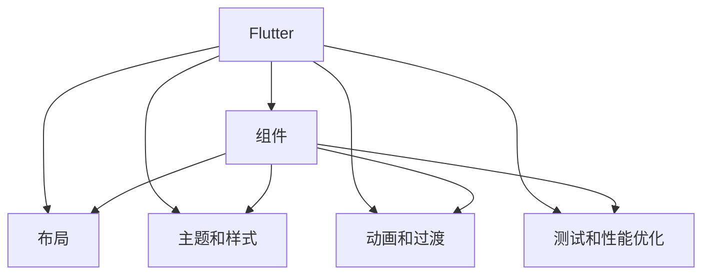

                 

# Flutter UI 框架：构建美观的用户界面

## 1. 背景介绍

### 1.1 问题由来
随着移动设备的普及，应用程序的用户界面设计已成为吸引用户的关键因素。Android 和 iOS 平台各自的 UI 框架限制了开发者的设计自由度。为了克服这些限制，Google 推出了 Flutter，一个开源的移动开发框架，它使用了热重载和编译时构建技术，可以快速构建高性能和美观的用户界面，并在 iOS 和 Android 平台上统一表现。

### 1.2 问题核心关键点
Flutter 提供了丰富的 UI 组件和高度定制的布局系统，开发人员可以使用这些工具来构建美观、可扩展的用户界面。与原生开发相比，使用 Flutter 可以更快地迭代和设计，同时提高了开发效率和跨平台的一致性。

### 1.3 问题研究意义
通过使用 Flutter，开发者能够实现跨平台应用的设计自由度，提升用户体验，同时缩短开发周期，降低开发成本。Flutter 的组件库和定制工具使得开发者能够快速构建高质量的应用界面，进而提高应用的市场竞争力。

## 2. 核心概念与联系

### 2.1 核心概念概述

为更好地理解 Flutter UI 框架的原理和实现，本节将介绍几个密切相关的核心概念：

- **Flutter**：谷歌开发的跨平台移动开发框架，使用热重载和编译时构建技术，实现了高性能和美观的用户界面。
- **组件**：Flutter UI 框架的核心，提供可复用的模块化组件，允许开发人员快速构建界面。
- **布局**：用于组织和管理组件的布局系统，允许开发者创建动态和响应式用户界面。
- **主题和样式**：允许开发人员自定义应用程序的颜色、字体和布局，提升应用的美观度。
- **动画和过渡**：用于创建流畅的动画效果和过渡效果，提升用户体验。
- **测试和性能优化**：提供工具和最佳实践，帮助开发人员确保应用的质量和性能。

这些核心概念之间的逻辑关系可以通过以下 Mermaid 流程图来展示：



这个流程图展示了这个核心概念的相互关系：

1. Flutter 提供了构建用户界面的基础组件和布局系统。
2. 组件可以通过主题和样式进行定制。
3. 动画和过渡为用户的交互提供了视觉反馈。
4. 测试和性能优化工具帮助开发人员确保应用的稳定性和响应性。

这些概念共同构成了 Flutter UI 框架的设计和实现框架，使其能够快速构建美观、一致的用户界面。

## 3. 核心算法原理 & 具体操作步骤

### 3.1 算法原理概述

Flutter 使用编译时构建和热重载技术，实现了高性能和流畅的用户界面。其核心原理如下：

1. **编译时构建**：在开发时，Flutter 通过编译时构建技术，将代码转换为高效的机器码，减少了运行时的开销。这使得 Flutter 能够在执行时提供与原生应用相似的性能。

2. **热重载**：Flutter 使用热重载技术，可以在不重新启动应用的情况下更新界面，提高开发效率。开发者可以在实时预览中看到修改后的效果，并及时调试和迭代。

3. **自定义组件和布局**：Flutter 允许开发者创建自定义组件和布局，以便更灵活地设计和实现用户界面。

4. **动画和过渡**：Flutter 的动画和过渡系统使得开发者可以轻松地创建流畅的动画效果，提升用户体验。

### 3.2 算法步骤详解

Flutter UI 框架的开发流程主要包括以下几个关键步骤：

**Step 1: 初始化 Flutter 项目**
- 安装 Flutter SDK，并配置项目目录和环境变量。
- 使用 `flutter create` 命令创建新项目，并初始化依赖库。

**Step 2: 编写界面代码**
- 使用 Flutter 提供的组件库，编写界面代码。
- 创建自定义组件和布局，以便更好地组织界面。
- 使用主题和样式定制界面，提升美观度。

**Step 3: 调试和迭代**
- 使用热重载工具，实时预览修改后的界面，并及时调试和迭代。
- 进行性能测试，确保应用稳定性和响应性。

**Step 4: 优化和发布**
- 进行性能优化，减小应用体积，提升执行效率。
- 打包和发布应用，以便用户下载和使用。

### 3.3 算法优缺点

Flutter UI 框架的优点包括：

1. 高性能和流畅的用户界面：通过编译时构建和热重载技术，Flutter 实现了与原生应用相似的性能。
2. 跨平台一致性：Flutter 可以在 iOS 和 Android 平台上提供一致的用户体验。
3. 开发效率高：热重载和自定义组件使得 Flutter 的开发过程更加快速和灵活。
4. 丰富的组件库和工具：Flutter 提供了大量的组件和工具，方便开发人员进行界面设计和实现。

然而，Flutter 也存在一些局限性：

1. 学习曲线较陡：对于新手而言，学习和上手 Flutter 可能需要一些时间。
2. 第三方库较少：尽管 Flutter 的组件库丰富，但与原生开发相比，第三方库的数量较少。
3. 社区和生态系统：虽然 Flutter 社区在不断发展，但与原生平台相比，社区和生态系统相对较弱。

### 3.4 算法应用领域

Flutter UI 框架在许多领域都有广泛的应用，例如：

- 应用程序开发：企业应用、社交应用、游戏应用等。
- 教育工具：学习平台、在线课程、互动练习等。
- 医疗应用：健康监测、在线咨询、预约系统等。
- 金融应用：在线支付、银行应用、股票交易等。

## 4. 数学模型和公式 & 详细讲解 & 举例说明

### 4.1 数学模型构建

Flutter 使用了编译时构建和热重载技术，这些技术涉及到的核心概念和算法如下：

- **编译时构建**：
  - 开发过程中，Flutter 通过编译器将 Dart 代码转换为高效的机器码。
  - 编译过程分为两个阶段：前端编译和后端编译。前端编译将 Dart 代码转换为字节码，后端编译再将字节码转换为可执行的机器码。

- **热重载**：
  - 热重载技术允许 Flutter 在不重新启动应用的情况下更新界面。
  - 开发者可以在实时预览中看到修改后的效果，并及时调试和迭代。

- **自定义组件和布局**：
  - Flutter 提供了丰富的组件库，包括按钮、文本框、卡片等。
  - 开发者可以创建自定义组件，以便更好地组织界面。

### 4.2 公式推导过程

虽然 Flutter 的核心算法不涉及复杂的数学公式，但其性能优化和热重载技术涉及到一些基本的数学原理：

- **性能优化**：
  - 编译时构建技术通过将 Dart 代码转换为机器码，减少了运行时的开销。
  - 前端编译过程涉及 Dart 虚拟机和字节码生成器的优化，而后端编译过程涉及机器码的生成和优化。

- **热重载**：
  - 热重载技术依赖于程序运行时的动态重写，这涉及到动态编译和 Just-In-Time (JIT) 编译器的优化。

### 4.3 案例分析与讲解

为了更好地理解 Flutter 的性能优化和热重载技术，以下是一些实际案例分析：

**案例 1: 性能优化**
- Flutter 通过编译时构建和 Just-In-Time (JIT) 编译器，实现了高效的性能。
- 开发者可以手动优化代码，以便减小应用体积，提升执行效率。

**案例 2: 热重载**
- Flutter 的热重载技术依赖于程序运行时的动态重写，这涉及到了一些高级的编程技巧和编译器优化。
- 开发者可以手动优化热重载配置，以便更好地控制开发效率。

## 5. 项目实践：代码实例和详细解释说明

### 5.1 开发环境搭建

在进行 Flutter 开发前，需要安装 Flutter SDK，并配置项目目录和环境变量。以下是具体的配置流程：

1. 安装 Flutter SDK：从官网下载 Flutter SDK，并解压缩到本地文件夹中。
2. 配置项目目录：在项目目录中创建 `pubspec.yaml` 文件，用于管理依赖库。
3. 配置环境变量：将 `flutter` 的路径添加到系统环境变量 `PATH` 中。

完成上述步骤后，即可开始 Flutter 项目的开发。

### 5.2 源代码详细实现

以下是一个简单的 Flutter 应用的代码实现，包括界面设计和样式定制：

```dart
import 'package:flutter/material.dart';

void main() {
  runApp(MyApp());
}

class MyApp extends StatelessWidget {
  @override
  Widget build(BuildContext context) {
    return MaterialApp(
      title: 'Flutter UI 示例',
      theme: ThemeData(
        primaryColor: Colors.blue,
        accentColor: Colors.white,
        visualDensity: VisualDensity.adaptivePlatformDensity,
      ),
      home: HomeScreen(),
    );
  }
}

class HomeScreen extends StatefulWidget {
  @override
  _HomeScreenState createState() => _HomeScreenState();
}

class _HomeScreenState extends State<HomeScreen> {
  @override
  Widget build(BuildContext context) {
    return Scaffold(
      appBar: AppBar(
        title: Text('首页'),
        backgroundColor: Colors.blue,
      ),
      body: Center(
        child: Text(
          '这是一个 Flutter UI 示例应用。',
          style: TextStyle(
            fontSize: 24,
            color: Colors.white,
          ),
        ),
      ),
    );
  }
}
```

这段代码创建了一个简单的 Flutter 应用，包括一个带有自定义样式的文本组件。

### 5.3 代码解读与分析

让我们再详细解读一下关键代码的实现细节：

- **MaterialApp**：用于创建一个 Material Design 风格的 Flutter 应用。
- **ThemeData**：用于设置应用的主题样式，包括颜色、字体等。
- **Text**：用于显示文本内容。
- **StyleText**：用于设置文本的字体、颜色等样式。

**MaterialApp**：
- `title`：设置应用标题。
- `theme`：设置应用的主题样式。

**ThemeData**：
- `primaryColor`：设置主色调。
- `accentColor`：设置辅助色。
- `visualDensity`：设置视觉密度，确保在不同屏幕大小和分辨率下应用效果一致。

**Text**：
- `style`：设置文本样式。

通过这些基本组件和样式配置，开发者可以创建出美观的 Flutter 应用界面。

### 5.4 运行结果展示

运行上述代码后，将看到一个简单的 Flutter 应用，包括一个带有自定义样式的文本组件。这个应用展示了 Flutter UI 框架的基本用法和风格。

## 6. 实际应用场景

### 6.1 智能客服系统

Flutter 的应用范围不仅限于移动应用，还可以用于构建智能客服系统。通过将 Flutter 应用嵌入到网站中，企业可以实时与客户进行互动，快速响应客户咨询，提升客户体验。

### 6.2 金融舆情监测

金融机构可以利用 Flutter 构建实时监测系统，监控金融市场的舆情动态，及时发现潜在的风险。通过与第三方数据源集成，Flutter 应用可以提供实时的市场分析和报告。

### 6.3 个性化推荐系统

Flutter 可以用于构建个性化推荐系统，通过分析用户行为数据，推荐个性化的商品或内容。通过与用户交互，Flutter 应用可以不断学习用户的偏好，提供更精准的推荐。

### 6.4 未来应用展望

随着 Flutter 社区的不断发展，其应用场景将不断拓展。未来，Flutter 将不仅仅是一个移动开发框架，而是一个通用的界面设计工具，帮助开发者快速构建高质量的应用程序。

## 7. 工具和资源推荐

### 7.1 学习资源推荐

为了帮助开发者系统掌握 Flutter UI 框架的理论基础和实践技巧，这里推荐一些优质的学习资源：

1. **Flutter 官方文档**：提供了丰富的 API 文档和示例代码，帮助开发者快速上手 Flutter。
2. **Flutter 教程**：系列博客和视频教程，涵盖了 Flutter 的基本概念和实际应用。
3. **Flutter 书籍**：《Flutter 应用程序开发》等书籍，提供了深入的 Flutter 技术和开发指南。
4. **Flutter 社区**：Flutter 社区提供了大量的博客、文档和问答，帮助开发者解决问题。

通过对这些资源的学习实践，相信你一定能够快速掌握 Flutter UI 框架的精髓，并用于解决实际的 UI 设计问题。

### 7.2 开发工具推荐

Flutter 提供了丰富的工具和库，帮助开发者更高效地开发和测试 Flutter 应用：

1. **Flutter 编辑器**：如 VS Code、Android Studio 等，提供了集成的 Flutter 开发环境。
2. **热重载工具**：帮助开发者实时预览修改后的界面，并及时调试和迭代。
3. **性能测试工具**：如 Benchmark 等，帮助开发者优化应用的性能。
4. **调试工具**：如 Debugger 等，帮助开发者调试 Flutter 应用。

这些工具可以帮助开发者更高效地开发和调试 Flutter 应用，提升开发效率和应用质量。

### 7.3 相关论文推荐

Flutter 的发展得益于学界的持续研究，以下是几篇奠基性的相关论文，推荐阅读：

1. **《Flutter: Cross-platform Mobile UI Development with a Single Language》**：介绍了 Flutter 的核心概念和设计思路。
2. **《Flutter: Building Fast Android Apps with a Personal Touch》**：介绍了 Flutter 的性能优化和热重载技术。
3. **《Flutter for Performance and Usability》**：介绍了 Flutter 的性能优化和用户体验设计。

这些论文代表了 Flutter 技术的最新进展，帮助开发者深入理解 Flutter 的核心算法和技术细节。

## 8. 总结：未来发展趋势与挑战

### 8.1 总结

本文对 Flutter UI 框架的原理和实现进行了全面系统的介绍。首先阐述了 Flutter 框架的设计思路和优势，明确了 Flutter 在跨平台开发和 UI 设计方面的独特价值。其次，从原理到实践，详细讲解了 Flutter UI 框架的数学模型和关键步骤，给出了 Flutter UI 开发的具体代码实例。同时，本文还探讨了 Flutter UI 框架在智能客服、金融舆情、个性化推荐等多个行业领域的应用前景，展示了 Flutter UI 框架的广泛适用性。

通过本文的系统梳理，可以看到，Flutter UI 框架在提高跨平台开发效率、提升 UI 设计灵活性、增强应用性能方面具有显著优势，成为现代移动应用开发的重要工具。未来，伴随 Flutter 社区的不断壮大，Flutter UI 框架必将在更多领域大放异彩，为开发者提供更高效、更灵活的开发工具。

### 8.2 未来发展趋势

展望未来，Flutter UI 框架将呈现以下几个发展趋势：

1. **跨平台性能提升**：随着编译时构建技术的不断优化，Flutter 应用将实现更高的性能和更好的用户体验。
2. **界面设计自由度提升**：Flutter 的自定义组件和布局系统将变得更加灵活和强大，允许开发者创建更复杂和更美观的用户界面。
3. **开发者工具和生态系统丰富**：Flutter 社区将提供更多的高质量工具和库，帮助开发者更高效地开发和测试 Flutter 应用。
4. **开源社区的活跃度提升**：Flutter 开源社区的不断壮大，将吸引更多的开发者和用户，推动 Flutter 技术的发展。

以上趋势凸显了 Flutter UI 框架的广阔前景。这些方向的探索发展，必将进一步提升 Flutter UI 框架的性能和应用范围，为开发者提供更高效、更灵活的开发工具。

### 8.3 面临的挑战

尽管 Flutter UI 框架已经取得了显著的进展，但在迈向更加智能化、普适化应用的过程中，它仍面临诸多挑战：

1. **第三方库和工具的扩展**：虽然 Flutter 组件库丰富，但与原生开发相比，第三方库的数量较少。如何吸引更多的开发者和社区参与，丰富第三方库和工具，将是重要的挑战。
2. **性能优化**：虽然 Flutter 应用性能高，但在一些高性能场景下，如何进一步优化性能，仍需不断探索和实践。
3. **跨平台一致性**：尽管 Flutter 在跨平台表现一致，但在某些特定场景下，如何确保跨平台应用的性能和用户体验一致，还需要更多优化和改进。

### 8.4 研究展望

面对 Flutter UI 框架所面临的挑战，未来的研究需要在以下几个方面寻求新的突破：

1. **提高第三方库和工具的数量和质量**：吸引更多的开发者和社区参与，丰富第三方库和工具，提升 Flutter 应用的开发效率和可扩展性。
2. **优化性能和用户体验**：进一步优化编译时构建技术和界面设计系统，提升 Flutter 应用的性能和用户体验。
3. **增强跨平台一致性**：研究跨平台应用的性能优化和用户体验一致性，确保 Flutter 应用在不同平台上的表现一致。

这些研究方向的探索，必将引领 Flutter UI 框架走向更高的台阶，为开发者提供更高效、更灵活的开发工具。面向未来，Flutter UI 框架需要与其他界面设计工具和技术进行更深入的融合，共同推动跨平台应用的创新和进步。

## 9. 附录：常见问题与解答

**Q1: Flutter 的性能是否与原生应用相当？**

A: Flutter 的性能已经接近原生应用，通过编译时构建和 Just-In-Time (JIT) 编译器，可以实现与原生应用相似的性能。但与原生应用相比，Flutter 在渲染性能上略有差距，主要体现在动画和过渡效果的实现上。开发者需要优化这些性能瓶颈，以便实现更流畅的用户体验。

**Q2: Flutter 的热重载技术是否影响性能？**

A: Flutter 的热重载技术可以提升开发效率，但可能会对性能产生一定影响。开发过程中，热重载工具需要不断重写和加载代码，这可能会增加应用的启动时间。开发者可以通过优化热重载配置，减少重载次数，提升应用性能。

**Q3: Flutter 是否支持所有的 UI 组件和布局？**

A: Flutter 提供了丰富的 UI 组件和布局系统，但并不支持所有的组件和布局。开发者需要根据实际需求，自定义组件和布局，以实现更复杂和更美观的用户界面。Flutter 社区不断更新和扩展组件库，以适应开发者的需求。

**Q4: Flutter 的性能优化有哪些方法？**

A: Flutter 的性能优化方法包括：
1. 编译时构建：通过将 Dart 代码转换为高效的机器码，减小应用体积，提升执行效率。
2. Just-In-Time (JIT) 编译器：通过 Just-In-Time 编译器，优化代码的执行效率。
3. 缓存机制：使用缓存机制，减少不必要的渲染和计算。
4. 代码优化：优化代码结构，减少不必要的计算和内存占用。

通过这些优化方法，开发者可以提升 Flutter 应用的性能和用户体验。

**Q5: Flutter 的开发者工具和生态系统如何？**

A: Flutter 提供了丰富的开发者工具和生态系统，帮助开发者更高效地开发和测试 Flutter 应用。社区提供了大量的博客、文档和问答，帮助开发者解决问题。此外，Flutter 社区还提供了许多高质量的工具和库，如热重载工具、性能测试工具等，提升开发效率和应用质量。

通过对这些问题的回答，可以帮助开发者更好地理解和应用 Flutter UI 框架，提升开发效率和应用质量。

---

作者：禅与计算机程序设计艺术 / Zen and the Art of Computer Programming

