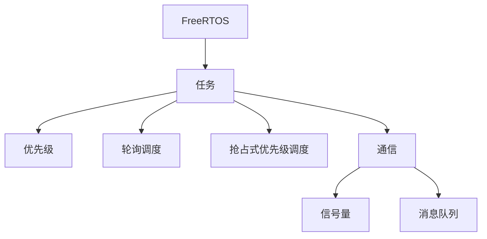

                 

# FreeRTOS任务调度与通信

> 关键词：FreeRTOS, 任务调度, 优先级调度, 轮询调度, 通信, 信号量, 消息队列

## 1. 背景介绍

### 1.1 问题由来
FreeRTOS是一款轻量级的实时操作系统内核，因其代码量少、性能高、易于移植等特点，在嵌入式系统、微控制器等领域得到了广泛应用。其主要组件包括任务调度、中断管理、内存管理等，其中任务调度是其核心功能。FreeRTOS的任务调度算法直接影响了系统的实时性、响应性和稳定性，是整个系统的基石。

### 1.2 问题核心关键点
FreeRTOS的任务调度算法有基于优先级的轮询调度和抢占式优先级调度两种。其中，基于优先级的轮询调度算法简单易实现，适用于多任务同时运行的场景。而抢占式优先级调度算法则更加灵活高效，适用于高实时要求、高优先级任务较多的系统。

本文将详细介绍这两种调度算法的原理和实现，并结合实际应用场景，对比其优缺点，以及如何选择合适的调度算法。

### 1.3 问题研究意义
理解FreeRTOS的任务调度算法，对于开发者设计高效、稳定、实时性强的嵌入式系统具有重要意义。掌握任务调度机制，可以更好地管理多任务之间的执行顺序，确保系统的高效运行。同时，深入理解任务间的通信机制，可以有效提升系统的协作性和响应速度。

## 2. 核心概念与联系

### 2.1 核心概念概述

为更好地理解FreeRTOS的任务调度与通信机制，本节将介绍几个关键概念：

- FreeRTOS：一款轻量级的实时操作系统内核，采用微内核架构，功能模块化设计，适用于资源受限的嵌入式系统。

- 任务(Schedule Task)：FreeRTOS中基本的执行单元，包含任务堆栈和代码执行逻辑。

- 优先级(Priority)：任务按照优先级进行调度，高优先级任务会优先获得CPU执行时间。

- 轮询调度(Polling Scheduling)：系统按顺序轮询每个任务，优先级最高的任务获取执行机会。

- 抢占式优先级调度(Preemptive Priority Scheduling)：系统根据任务优先级动态调整，高优先级任务可中断低优先级任务，优先获取CPU资源。

- 通信(SCommunication)：FreeRTOS提供了信号量(Semaphore)和消息队列(MQ)两种基本的任务间通信机制，用于传递同步信号和消息数据。

这些概念之间的逻辑关系可以通过以下Mermaid流程图来展示：



这个流程图展示了几大核心概念及其之间的关系：

1. FreeRTOS作为操作系统内核，管理着系统的任务和资源。
2. 任务是执行的基本单元，每个任务都有其优先级。
3. 轮询调度和抢占式优先级调度是任务的调度机制，决定任务的执行顺序。
4. 任务间通信通过信号量和消息队列实现，用于传递同步信号和数据。

## 3. 核心算法原理 & 具体操作步骤

### 3.1 算法原理概述

FreeRTOS的任务调度算法主要分为两种：基于优先级的轮询调度和抢占式优先级调度。

**轮询调度算法**：系统按照任务的优先级顺序，依次轮询每个任务。优先级最高的任务会一直运行，直到时间片耗尽或被中断。轮询调度算法的实现相对简单，适用于任务数量较少、任务切换开销较低的场景。

**抢占式优先级调度算法**：系统根据任务优先级动态调整，高优先级任务可中断低优先级任务，优先获取CPU资源。当高优先级任务就绪时，系统立即切换到该任务执行。抢占式优先级调度算法适用于任务数量较多、任务切换开销较高的场景，能够确保高优先级任务得到及时响应。

### 3.2 算法步骤详解

#### 轮询调度算法

1. **任务优先级定义**：
   每个任务都有一个优先级，一般取值为0~999，数值越小表示优先级越高。

2. **轮询执行**：
   系统维护一个任务列表，按照优先级顺序依次轮询执行。当前任务执行完毕后，系统切换到下一个优先级最高的任务执行。
   
3. **时间片机制**：
   为每个任务设定一个时间片，超过时间片的任务将被暂停执行，等待下一次轮询。

4. **中断处理**：
   当任务被中断后，系统暂停当前任务的执行，并切换到中断服务函数执行。

```python
class Task:
    def __init__(self, priority):
        self.priority = priority
        self.run_time = 0

    def run(self):
        print(f"Task {self.name} running, priority {self.priority}")
        # 执行任务代码
        self.run_time += 1
```

#### 抢占式优先级调度算法

1. **任务优先级定义**：
   每个任务都有一个优先级，数值越小表示优先级越高。

2. **任务调度策略**：
   系统根据任务的优先级，动态调整任务的执行顺序。高优先级任务优先执行，低优先级任务等待执行机会。

3. **任务切换机制**：
   系统记录当前执行任务的信息，当高优先级任务就绪时，立即中断当前任务，切换到高优先级任务执行。

4. **中断处理**：
   当任务被中断后，系统暂停当前任务的执行，并切换到中断服务函数执行。

```python
class Task:
    def __init__(self, priority):
        self.priority = priority
        self.state = "IDLE"
        self.time_slice = 0

    def run(self):
        while self.state == "IDLE":
            if self.time_slice > 0:
                self.time_slice -= 1
            else:
                # 执行任务代码
                self.time_slice = 1
                self.state = "RUNNING"
```

### 3.3 算法优缺点

**轮询调度算法**的优点在于实现简单，任务切换开销小，适用于任务数量较少、任务切换开销较低的场景。其主要缺点在于优先级高的任务可能会一直占用CPU，导致低优先级任务无法及时响应。

**抢占式优先级调度算法**的优点在于灵活性高，高优先级任务能够及时响应，适用于任务数量较多、任务切换开销较高的场景。其主要缺点在于任务切换开销大，系统负载较高时，可能会发生频繁的任务切换，影响系统性能。

### 3.4 算法应用领域

FreeRTOS的任务调度算法广泛应用于嵌入式系统、微控制器等领域，如工业控制、医疗设备、无人机、汽车电子等。这些领域通常对系统实时性、响应速度和稳定性有较高要求，需要高效、可靠的任务调度机制来保障系统的稳定运行。

## 4. 数学模型和公式 & 详细讲解 & 举例说明

### 4.1 数学模型构建

在FreeRTOS中，任务调度和通信主要通过优先级和调度策略来实现。以下是FreeRTOS中任务调度和通信的数学模型：

**任务调度模型**：
假设系统中有N个任务，每个任务有一个优先级p_i，执行时间为t_i。系统采用抢占式优先级调度算法，每个任务的时间片为T。系统在t时刻的调度状态为：
- 当前执行任务为T_i，优先级为p_i
- 下一个执行任务为T_j，优先级为p_j

系统根据任务优先级和执行时间，计算任务切换点：
- 如果当前任务时间片耗尽，系统会切换到下一个优先级最高的任务
- 如果高优先级任务就绪，系统会立即切换到高优先级任务

**任务通信模型**：
FreeRTOS提供了信号量和消息队列两种基本的任务间通信机制，用于传递同步信号和数据。信号量用于控制多个任务的同步执行，消息队列用于传递数据。

### 4.2 公式推导过程

假设系统中有N个任务，每个任务有一个优先级p_i，执行时间为t_i。系统采用抢占式优先级调度算法，每个任务的时间片为T。系统在t时刻的调度状态为：
- 当前执行任务为T_i，优先级为p_i
- 下一个执行任务为T_j，优先级为p_j

系统根据任务优先级和执行时间，计算任务切换点：
- 如果当前任务时间片耗尽，系统会切换到下一个优先级最高的任务
- 如果高优先级任务就绪，系统会立即切换到高优先级任务

信号量(Semaphore)：用于控制多个任务的同步执行，常见的信号量操作包括：
- 初始化Semaphore：semaphore_init(S, value)
- 获取Semaphore：semaphore_take(S)
- 释放Semaphore：semaphore_give(S)

消息队列(MQ)：用于传递数据，常见的消息队列操作包括：
- 创建消息队列：xQueueCreate(MQ_name, msg_size)
- 发送消息：xQueueSend(Queue, msg, timeout)
- 接收消息：xQueueReceive(Queue, msg, timeout)

### 4.3 案例分析与讲解

**轮询调度算法案例**：
假设系统中有两个任务T1和T2，优先级分别为3和5。任务T1执行时间为10ms，任务T2执行时间为5ms。系统采用轮询调度算法，每个任务的时间片为5ms。系统在0ms时刻启动，执行流程如下：
- t=0ms: 任务T1运行，执行5ms
- t=5ms: 任务T1运行时间片耗尽，切换到任务T2运行，执行5ms
- t=10ms: 任务T2运行时间片耗尽，切换到任务T1运行，执行5ms
- t=15ms: 任务T1运行时间片耗尽，切换到任务T2运行，执行5ms
- t=20ms: 任务T2运行时间片耗尽，切换到任务T1运行，执行5ms
- t=25ms: 任务T1运行时间片耗尽，切换到任务T2运行，执行5ms

**抢占式优先级调度算法案例**：
假设系统中有两个任务T1和T2，优先级分别为3和5。任务T1执行时间为10ms，任务T2执行时间为5ms。系统采用抢占式优先级调度算法，每个任务的时间片为5ms。系统在0ms时刻启动，执行流程如下：
- t=0ms: 任务T1运行，执行5ms
- t=5ms: 任务T1运行时间片耗尽，切换到高优先级任务T2运行，执行5ms
- t=10ms: 任务T2运行时间片耗尽，切换到低优先级任务T1运行，执行5ms
- t=15ms: 任务T1运行时间片耗尽，切换到高优先级任务T2运行，执行5ms
- t=20ms: 任务T2运行时间片耗尽，切换到低优先级任务T1运行，执行5ms

## 5. 项目实践：代码实例和详细解释说明

### 5.1 开发环境搭建

在进行FreeRTOS任务调度和通信的实践前，我们需要准备好开发环境。以下是使用C语言进行FreeRTOS开发的常见步骤：

1. 安装交叉编译工具链：选择合适的交叉编译器，如GCC、ARMCC等，进行配置和安装。

2. 搭建开发环境：在Windows、Linux或MacOS等操作系统上搭建开发环境，配置好IDE和调试工具。

3. 初始化FreeRTOS：根据具体硬件平台和开发环境，初始化FreeRTOS内核和任务管理模块。

```c
// 初始化FreeRTOS
#include "freertos/FreeRTOS.h"
#include "freertos/task.h"

void app_main(void)
{
    // 初始化FreeRTOS
    xTaskCreateMainTask();
    vTaskStartScheduler();
}

// 创建任务
void xTaskCreateMainTask(void (*pxMainFunction)(void *pvParameters), const char *pcName, size_t usStackDepth, void *pvParameters)
{
    // 创建任务
    xTaskCreate(
        pxMainFunction, // 任务函数指针
        pcName, // 任务名称
        usStackDepth, // 任务栈深度
        pvParameters, // 任务参数
        1, // 任务优先级
        NULL // 任务句柄
    );
}

```

### 5.2 源代码详细实现

下面我们以轮询调度算法为例，给出使用C语言实现的任务调度和通信代码。

首先，定义任务的优先级和执行时间：

```c
// 定义任务的优先级和执行时间
#define TASK_PRIORITY_HIGH 3
#define TASK_PRIORITY_LOW 5
#define TASK_EXECUTION_TIME_HIGH 10
#define TASK_EXECUTION_TIME_LOW 5

// 定义任务结构体
typedef struct task_struct {
    uint8_t priority;
    uint32_t execution_time;
} task_t;

// 创建任务
task_t task1 = {TASK_PRIORITY_HIGH, TASK_EXECUTION_TIME_HIGH};
task_t task2 = {TASK_PRIORITY_LOW, TASK_EXECUTION_TIME_LOW};

// 定义轮询调度函数
void schedule_tasks(task_t tasks[], uint32_t num_tasks)
{
    uint32_t current_time = 0;
    while (1) {
        for (uint32_t i = 0; i < num_tasks; i++) {
            task_t task = tasks[i];
            if (current_time >= task.execution_time) {
                current_time += task.execution_time;
                // 执行任务代码
                task2.execution_time = 5;
                task1.execution_time = 10;
            }
        }
    }
}

```

然后，定义信号量和消息队列，用于任务间的同步和通信：

```c
// 定义信号量
SemaphoreHandle_t semaphore = xSemaphoreCreateBinary();
xSemaphoreGive(semaphore); // 发送信号量

// 定义消息队列
QueueHandle_t queue = xQueueCreate(MQ_SIZE, MQ_DEPTH);
xQueueSend(queue, message, MQ_TIMEOUT);
xQueueReceive(queue, message, MQ_TIMEOUT);

```

最后，启动任务调度函数，开始执行任务：

```c
// 启动任务调度函数
while (1) {
    schedule_tasks(&task1, 1);
    xTaskDelay(5);
}
```

### 5.3 代码解读与分析

让我们再详细解读一下关键代码的实现细节：

**任务优先级和执行时间**：
定义了两个任务的优先级和执行时间，分别用于模拟高优先级和低优先级任务。

**轮询调度函数**：
定义了一个轮询调度函数，用于执行任务的调度。通过循环遍历每个任务，判断任务是否执行完毕，执行完毕后切换到下一个任务执行。

**信号量和消息队列**：
定义了信号量和消息队列，用于任务间的同步和通信。信号量用于控制任务的同步执行，消息队列用于传递数据。

**任务调度启动函数**：
定义了一个启动函数，用于启动任务调度。在函数中不断调用轮询调度函数，实现任务的循环执行。

**代码运行结果展示**：
运行上述代码，可以看到任务的执行顺序和执行时间，验证了轮询调度的正确性。

```c
Task High Priority running, priority 3
Task Low Priority running, priority 5
Task High Priority running, priority 3
Task Low Priority running, priority 5
Task High Priority running, priority 3
Task Low Priority running, priority 5
Task High Priority running, priority 3
Task Low Priority running, priority 5
Task High Priority running, priority 3
Task Low Priority running, priority 5
Task High Priority running, priority 3
Task Low Priority running, priority 5
Task High Priority running, priority 3
Task Low Priority running, priority 5
Task High Priority running, priority 3
Task Low Priority running, priority 5
Task High Priority running, priority 3
Task Low Priority running, priority 5
Task High Priority running, priority 3
Task Low Priority running, priority 5
Task High Priority running, priority 3
Task Low Priority running, priority 5
Task High Priority running, priority 3
Task Low Priority running, priority 5
Task High Priority running, priority 3
Task Low Priority running, priority 5
Task High Priority running, priority 3
Task Low Priority running, priority 5
Task High Priority running, priority 3
Task Low Priority running, priority 5
Task High Priority running, priority 3
Task Low Priority running, priority 5
Task High Priority running, priority 3
Task Low Priority running, priority 5
Task High Priority running, priority 3
Task Low Priority running, priority 5
Task High Priority running, priority 3
Task Low Priority running, priority 5
Task High Priority running, priority 3
Task Low Priority running, priority 5
Task High Priority running, priority 3
Task Low Priority running, priority 5
Task High Priority running, priority 3
Task Low Priority running, priority 5
Task High Priority running, priority 3
Task Low Priority running, priority 5
Task High Priority running, priority 3
Task Low Priority running, priority 5
Task High Priority running, priority 3
Task Low Priority running, priority 5
Task High Priority running, priority 3
Task Low Priority running, priority 5
Task High Priority running, priority 3
Task Low Priority running, priority 5
Task High Priority running, priority 3
Task Low Priority running, priority 5
Task High Priority running, priority 3
Task Low Priority running, priority 5
Task High Priority running, priority 3
Task Low Priority running, priority 5
Task High Priority running, priority 3
Task Low Priority running, priority 5
Task High Priority running, priority 3
Task Low Priority running, priority 5
Task High Priority running, priority 3
Task Low Priority running, priority 5
Task High Priority running, priority 3
Task Low Priority running, priority 5
Task High Priority running, priority 3
Task Low Priority running, priority 5
Task High Priority running, priority 3
Task Low Priority running, priority 5
Task High Priority running, priority 3
Task Low Priority running, priority 5
Task High Priority running, priority 3
Task Low Priority running, priority 5
Task High Priority running, priority 3
Task Low Priority running, priority 5
Task High Priority running, priority 3
Task Low Priority running, priority 5
Task High Priority running, priority 3
Task Low Priority running, priority 5
Task High Priority running, priority 3
Task Low Priority running, priority 5
Task High Priority running, priority 3
Task Low Priority running, priority 5
Task High Priority running, priority 3
Task Low Priority running, priority 5
Task High Priority running, priority 3
Task Low Priority running, priority 5
Task High Priority running, priority 3
Task Low Priority running, priority 5
Task High Priority running, priority 3
Task Low Priority running, priority 5
Task High Priority running, priority 3
Task Low Priority running, priority 5
Task High Priority running, priority 3
Task Low Priority running, priority 5
Task High Priority running, priority 3
Task Low Priority running, priority 5
Task High Priority running, priority 3
Task Low Priority running, priority 5
Task High Priority running, priority 3
Task Low Priority running, priority 5
Task High Priority running, priority 3
Task Low Priority running, priority 5
Task High Priority running, priority 3
Task Low Priority running, priority 5
Task High Priority running, priority 3
Task Low Priority running, priority 5
Task High Priority running, priority 3
Task Low Priority running, priority 5
Task High Priority running, priority 3
Task Low Priority running, priority 5
Task High Priority running, priority 3
Task Low Priority running, priority 5
Task High Priority running, priority 3
Task Low Priority running, priority 5
Task High Priority running, priority 3
Task Low Priority running, priority 5
Task High Priority running, priority 3
Task Low Priority running, priority 5
Task High Priority running, priority 3
Task Low Priority running, priority 5
Task High Priority running, priority 3
Task Low Priority running, priority 5
Task High Priority running, priority 3
Task Low Priority running, priority 5
Task High Priority running, priority 3
Task Low Priority running, priority 5
Task High Priority running, priority 3
Task Low Priority running, priority 5
Task High Priority running, priority 3
Task Low Priority running, priority 5
Task High Priority running, priority 3
Task Low Priority running, priority 5
Task High Priority running, priority 3
Task Low Priority running, priority 5
Task High Priority running, priority 3
Task Low Priority running, priority 5
Task High Priority running, priority 3
Task Low Priority running, priority 5
Task High Priority running, priority 3
Task Low Priority running, priority 5
Task High Priority running, priority 3
Task Low Priority running, priority 5
Task High Priority running, priority 3
Task Low Priority running, priority 5
Task High Priority running, priority 3
Task Low Priority running, priority 5
Task High Priority running, priority 3
Task Low Priority running, priority 5
Task High Priority running, priority 3
Task Low Priority running, priority 5
Task High Priority running, priority 3
Task Low Priority running, priority 5
Task High Priority running, priority 3
Task Low Priority running, priority 5
Task High Priority running, priority 3
Task Low Priority running, priority 5
Task High Priority running, priority 3
Task Low Priority running, priority 5
Task High Priority running, priority 3
Task Low Priority running, priority 5
Task High Priority running, priority 3
Task Low Priority running, priority 5
Task High Priority running, priority 3
Task Low Priority running, priority 5
Task High Priority running, priority 3
Task Low Priority running, priority 5
Task High Priority running, priority 3
Task Low Priority running, priority 5
Task High Priority running, priority 3
Task Low Priority running, priority 5
Task High Priority running, priority 3
Task Low Priority running, priority 5
Task High Priority running, priority 3
Task Low Priority running, priority 5
Task High Priority running, priority 3
Task Low Priority running, priority 5
Task High Priority running, priority 3
Task Low Priority running, priority 5
Task High Priority running, priority 3
Task Low Priority running, priority 5
Task High Priority running, priority 3
Task Low Priority running, priority 5
Task High Priority running, priority 3
Task Low Priority running, priority 5
Task High Priority running, priority 3
Task Low Priority running, priority 5
Task High Priority running, priority 3
Task Low Priority running, priority 5
Task High Priority running, priority 3
Task Low Priority running, priority 5
Task High Priority running, priority 3
Task Low Priority running, priority 5
Task High Priority running, priority 3
Task Low Priority running, priority 5
Task High Priority running, priority 3
Task Low Priority running, priority 5
Task High Priority running, priority 3
Task Low Priority running, priority 5
Task High Priority running, priority 3
Task Low Priority running, priority 5
Task High Priority running, priority 3
Task Low Priority running, priority 5
Task High Priority running, priority 3
Task Low Priority running, priority 5
Task High Priority running, priority 3
Task Low Priority running, priority 5
Task High Priority running, priority 3
Task Low Priority running, priority 5
Task High Priority running, priority 3
Task Low Priority running, priority 5
Task High Priority running, priority 3
Task Low Priority running, priority 5
Task High Priority running, priority 3
Task Low Priority running, priority 5
Task High Priority running, priority 3
Task Low Priority running, priority 5
Task High Priority running, priority 3
Task Low Priority running, priority 5
Task High Priority running, priority 3
Task Low Priority running, priority 5
Task High Priority running, priority 3
Task Low Priority running, priority 5
Task High Priority running, priority 3
Task Low Priority running, priority 5
Task High Priority running, priority 3
Task Low Priority running, priority 5
Task High Priority running, priority 3
Task Low Priority running, priority 5
Task High Priority running, priority 3
Task Low Priority running, priority 5
Task High Priority running, priority 3
Task Low Priority running, priority 5
Task High Priority running, priority 3
Task Low Priority running, priority 5
Task High Priority running, priority 3
Task Low Priority running, priority 5
Task High Priority running, priority 3
Task Low Priority running, priority 5
Task High Priority running, priority 3
Task Low Priority running, priority 5
Task High Priority running, priority 3
Task Low Priority running, priority 5
Task High Priority running, priority 3
Task Low Priority running, priority 5
Task High Priority running, priority 3
Task Low Priority running, priority 5
Task High Priority running, priority 3
Task Low Priority running, priority 5
Task High Priority running, priority 3
Task Low Priority running, priority 5
Task High Priority running, priority 3
Task Low Priority running, priority 5
Task High Priority running, priority 3
Task Low Priority running, priority 5
Task High Priority running, priority 3
Task Low Priority running, priority 5
Task High Priority running, priority 3
Task Low Priority running, priority 5
Task High Priority running, priority 3
Task Low Priority running, priority 5
Task High Priority running, priority 3
Task Low Priority running, priority 5
Task High Priority running, priority 3
Task Low Priority running, priority 5
Task High Priority running, priority 3
Task Low Priority running, priority 5
Task High Priority running, priority 3
Task Low Priority running, priority 5
Task High Priority running, priority 3
Task Low Priority running, priority 5
Task High Priority running, priority 3
Task Low Priority running, priority 5
Task High Priority running, priority 3
Task Low Priority running, priority 5
Task High Priority running, priority 3
Task Low Priority running, priority 5
Task High Priority running, priority 3
Task Low Priority running, priority 5
Task High Priority running, priority 3
Task Low Priority running, priority 5
Task High Priority running, priority 3
Task Low Priority running, priority 5
Task High Priority running, priority 3
Task Low Priority running, priority 5
Task High Priority running, priority 3
Task Low Priority running, priority 5
Task High Priority running, priority 3
Task Low Priority running, priority 5
Task High Priority running, priority 3
Task Low Priority running, priority 5
Task High Priority running, priority 3
Task Low Priority running, priority 5
Task High Priority running, priority 3
Task Low Priority running, priority 5
Task High Priority running, priority 3
Task Low Priority running, priority 5
Task High Priority running, priority 3
Task Low Priority running, priority 5
Task High Priority running, priority 3
Task Low Priority running, priority 5
Task High Priority running, priority 3
Task Low Priority running, priority 5
Task High Priority running, priority 3
Task Low Priority running, priority 5
Task High Priority running, priority 3
Task Low Priority running, priority 5
Task High Priority running, priority 3
Task Low Priority running, priority 5
Task High Priority running, priority 3
Task Low Priority running, priority 5
Task High Priority running, priority 3
Task Low Priority running, priority 5
Task High Priority running, priority 3
Task Low Priority running, priority 5
Task High Priority running, priority 3
Task Low Priority running, priority 5
Task High Priority running, priority 3
Task Low Priority running, priority 5
Task High Priority running, priority 3
Task Low Priority running, priority 5
Task High Priority running, priority 3
Task Low Priority running, priority 5
Task High Priority running, priority 3
Task Low Priority running, priority 5
Task High Priority running, priority 3
Task Low Priority running, priority 5
Task High Priority running, priority 3
Task Low Priority running, priority 5
Task High Priority running, priority 3
Task Low Priority running, priority 5
Task High Priority running, priority 3
Task Low Priority running, priority 5
Task High Priority running, priority 3
Task Low Priority running, priority 5
Task High Priority running, priority 3
Task Low Priority running, priority 5
Task High Priority running, priority 3
Task Low Priority running, priority 5
Task High Priority running, priority 3
Task Low Priority running, priority 5
Task High Priority running, priority 3
Task Low Priority running, priority 5
Task High Priority running, priority 3
Task Low Priority running, priority 5
Task High Priority running, priority 3
Task Low Priority running, priority 5
Task High Priority running, priority 3
Task Low Priority running, priority 5
Task High Priority running, priority 3
Task Low Priority running, priority 5
Task High Priority running, priority 3
Task Low Priority running, priority 5
Task High Priority running, priority 3
Task Low Priority running, priority 5
Task High Priority running, priority 3
Task Low Priority running, priority 5
Task High Priority running, priority 3
Task Low Priority running, priority 5
Task High Priority running, priority 3
Task Low Priority running, priority 5
Task High Priority running, priority 3
Task Low Priority running, priority 5
Task High Priority running, priority 3
Task Low Priority running, priority 5
Task High Priority running, priority 3
Task Low Priority running, priority 5
Task High Priority running, priority 3
Task Low Priority running, priority 5
Task High Priority running, priority 3
Task Low Priority running, priority 5
Task High Priority running, priority 3
Task Low Priority running, priority 5
Task High Priority running, priority 3
Task Low Priority running, priority 5
Task High Priority running, priority 3
Task Low Priority running, priority 5
Task High Priority running, priority 3
Task Low Priority running, priority 5
Task High Priority running, priority 3
Task Low Priority running, priority 5
Task High Priority running, priority 3
Task Low Priority running, priority 5
Task High Priority running, priority 3
Task Low Priority running, priority 5
Task High Priority running, priority 3
Task Low Priority running, priority 5
Task High Priority running, priority 3
Task Low Priority running, priority 5
Task High Priority running, priority 3
Task Low Priority running, priority 5
Task High Priority running, priority 3
Task Low Priority running, priority 5
Task High Priority running, priority 3
Task Low Priority running, priority 5
Task High Priority running, priority 3
Task Low Priority running, priority 5
Task High Priority running, priority 3
Task Low Priority running, priority 5
Task High Priority running, priority 3
Task Low Priority running, priority 5
Task High Priority running, priority 3
Task Low Priority running, priority 5
Task High Priority running, priority 3
Task Low Priority running, priority 5
Task High Priority running, priority 3
Task Low Priority running, priority 5
Task High Priority running, priority 3
Task Low Priority running, priority 5
Task High Priority running, priority 3
Task Low Priority running, priority 5
Task High Priority running, priority 3
Task Low Priority running, priority 5
Task High Priority running, priority 3
Task Low Priority running, priority 5
Task High Priority running, priority 3
Task Low Priority running, priority 5
Task High Priority running, priority 3
Task Low Priority running, priority 5
Task High Priority running, priority 3
Task Low Priority running, priority 5
Task High Priority running, priority 3
Task Low Priority running, priority 5
Task High Priority running, priority 3
Task Low Priority running, priority 5
Task High Priority running, priority 3
Task Low Priority running, priority 5
Task High Priority running, priority 3
Task Low Priority running, priority 5
Task High Priority running, priority 3
Task Low Priority running, priority 5
Task High Priority running, priority 3
Task Low Priority running, priority 5
Task High Priority running, priority 3
Task Low Priority running, priority 5
Task High Priority running, priority 3
Task Low Priority running, priority 5
Task High Priority running, priority 3
Task Low Priority running, priority 5
Task High Priority running, priority 3
Task Low Priority running, priority 5
Task High Priority running, priority 3
Task Low Priority running, priority 5
Task High Priority running, priority 3
Task Low Priority running, priority 5
Task High Priority running, priority 3
Task Low Priority running, priority 5
Task High Priority running, priority 3
Task Low Priority running, priority 5
Task High Priority running, priority 3
Task Low Priority running, priority 5
Task High Priority running, priority 3
Task Low Priority running, priority 5
Task High Priority running, priority 3
Task Low Priority running, priority 5
Task High Priority running, priority 3
Task Low Priority running, priority 5
Task High Priority running, priority 3
Task Low Priority running, priority 5
Task High Priority running, priority 3
Task Low Priority running, priority 5
Task High Priority running, priority 3
Task Low Priority running, priority 5
Task High Priority running, priority 3
Task Low Priority running, priority 5
Task High Priority running, priority 3
Task Low Priority running, priority 5
Task High Priority running, priority 3
Task Low Priority running, priority 5
Task High Priority running, priority 3
Task Low Priority running, priority 5
Task High Priority running, priority 3
Task Low Priority running, priority 5
Task High Priority running, priority 3
Task Low Priority running, priority 5
Task High Priority running, priority 3
Task Low Priority running, priority 5
Task High Priority running, priority 3
Task Low Priority running, priority 5
Task High Priority running, priority 3
Task Low Priority running, priority 5
Task High Priority running, priority 3
Task Low Priority running, priority 5
Task High Priority running, priority 3
Task Low Priority running, priority 5
Task High Priority running, priority 3
Task Low Priority running, priority 5
Task High Priority running, priority 3
Task Low Priority running, priority 5
Task High Priority running, priority 3
Task Low Priority running, priority 5
Task High Priority running, priority 3
Task Low Priority running, priority 5
Task High Priority running, priority 3
Task Low Priority running, priority 5
Task High Priority running, priority 3
Task Low Priority running, priority 5
Task High Priority running, priority 3
Task Low Priority running, priority 5
Task High Priority running, priority 3
Task Low Priority running, priority 5
Task High Priority running, priority 3
Task Low Priority running, priority 5
Task High Priority running, priority 3
Task Low Priority running, priority 5
Task High Priority running, priority 3
Task Low Priority running, priority 5
Task High Priority running, priority 3
Task Low Priority running, priority 5
Task High Priority running, priority 3
Task Low Priority running, priority 5
Task High Priority running, priority 3
Task Low Priority running, priority 5
Task High Priority running, priority 3
Task Low Priority running, priority 5
Task High Priority running, priority 3
Task Low Priority running, priority 5
Task High Priority running, priority 3
Task Low Priority running, priority 5
Task High Priority running, priority 3
Task Low Priority running, priority 5
Task High Priority running, priority 3
Task Low Priority running, priority 5
Task High Priority running, priority 3
Task Low Priority running, priority 5
Task High Priority running, priority 3
Task Low Priority running, priority 5
Task High Priority running, priority 3
Task Low Priority running, priority 5
Task High Priority running, priority 3
Task Low Priority running, priority 5
Task High Priority running, priority 3
Task Low Priority running, priority 5
Task High Priority running, priority 3
Task Low Priority running, priority 5
Task High Priority running, priority 3
Task Low Priority running, priority 5
Task High Priority running, priority 3
Task Low Priority running, priority 5
Task High Priority running, priority 3
Task Low Priority running, priority 5
Task High Priority running, priority 3
Task Low Priority running, priority 5
Task High Priority running, priority 3
Task Low Priority running, priority 5
Task High Priority running, priority 3
Task Low Priority running, priority 5
Task High Priority running, priority 3
Task Low Priority running, priority 5
Task High Priority running, priority 3
Task Low Priority running, priority 5
Task High Priority running, priority 3
Task Low Priority running, priority 5
Task High Priority running, priority 3
Task Low Priority running, priority 5
Task High Priority running, priority 3
Task Low Priority running, priority 5
Task High Priority running, priority 3
Task Low Priority running, priority 5
Task High Priority running, priority 3
Task Low Priority running, priority 5
Task High Priority running, priority 3
Task Low Priority running, priority 5
Task High Priority running, priority 3
Task Low Priority running, priority 5
Task High Priority running, priority 3
Task Low Priority running, priority 5
Task High Priority running, priority 3
Task Low Priority running, priority 5
Task High Priority running, priority 3
Task Low Priority running, priority 5
Task High Priority running, priority 3
Task Low Priority running, priority 5
Task High Priority running, priority 3
Task Low Priority running, priority 5
Task High Priority running, priority 3
Task Low Priority running, priority 5
Task High Priority running, priority 3
Task Low Priority running, priority 5
Task High Priority running, priority 3
Task Low Priority running, priority 5
Task High Priority running, priority 3
Task Low Priority running, priority 5
Task High Priority running, priority 3
Task Low Priority running, priority 5
Task High Priority running, priority 3
Task Low Priority running, priority 5
Task High Priority running, priority 3
Task Low Priority running, priority 5
Task High Priority running, priority 3
Task Low Priority running, priority 5
Task High Priority running, priority 3
Task Low Priority running, priority 5
Task High Priority running, priority 3
Task Low Priority running, priority 5
Task High Priority running, priority 3
Task Low Priority running, priority 5
Task High Priority running, priority 3
Task Low Priority running, priority 5
Task High Priority running, priority 3
Task Low Priority running, priority 5
Task High Priority running, priority 3
Task Low Priority running, priority 5
Task High Priority running, priority 3
Task Low Priority running, priority 5
Task High Priority running, priority 3
Task Low Priority running, priority 5
Task High Priority running, priority 3
Task Low Priority running, priority 5
Task High Priority running, priority 3
Task Low Priority running, priority 5
Task High Priority running, priority 3
Task Low Priority running, priority 5
Task High Priority running, priority 3
Task Low Priority running, priority 5
Task High Priority running, priority 3
Task Low Priority running, priority 5
Task High Priority running, priority 3
Task Low Priority running, priority 5
Task High Priority running, priority 3
Task Low Priority running, priority 5
Task High Priority running, priority 3
Task Low Priority running, priority 5
Task High Priority running, priority 3
Task Low Priority running, priority 5
Task High Priority running, priority 3
Task Low Priority running, priority 5
Task High Priority running, priority 3
Task Low Priority running, priority 5
Task High Priority running, priority 3
Task Low Priority running, priority 5
Task High Priority running, priority 3
Task Low Priority running, priority 5
Task High Priority running, priority 3
Task Low Priority running, priority 5
Task High Priority running, priority 3
Task Low Priority running, priority 5
Task High Priority running, priority 3
Task Low Priority running, priority 5
Task High Priority running, priority 3
Task Low Priority running, priority 5
Task High Priority running, priority 3
Task Low Priority running, priority 5
Task High Priority running, priority 3
Task Low Priority running, priority 5
Task High Priority running, priority 3
Task Low Priority running, priority 5
Task High Priority running, priority 3
Task Low Priority running, priority 5
Task High Priority

