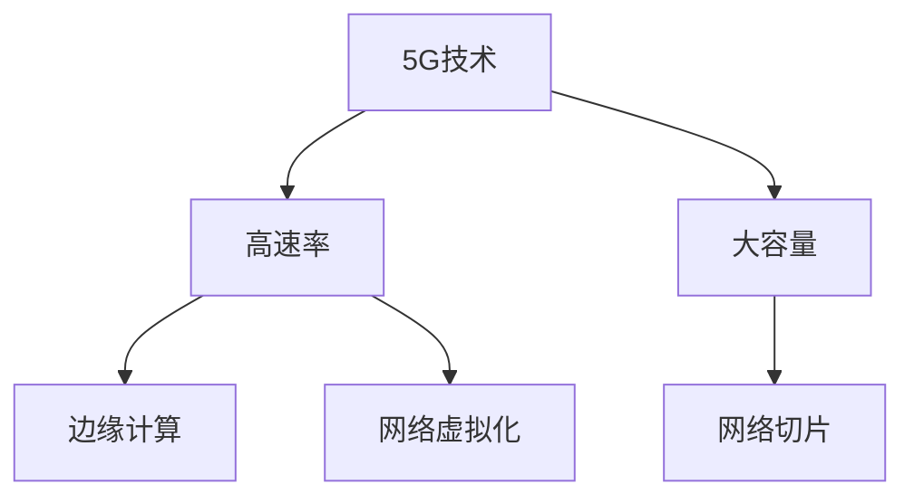

                 

# 5G 技术革命：速度和容量

## 1. 背景介绍

### 1.1 问题由来
随着移动互联网、物联网(IoT)、工业互联网等数字化应用场景的迅速普及，数据流量呈现出爆炸性增长。根据国际数据公司(IDC)的预测，到2025年全球物联网连接数将达到250亿，数据总量将突破50 ZB，5G技术作为新一代移动通信标准，正成为支撑未来数字化发展的关键基础设施。

与此同时，5G技术的引入不仅带来了超高的网络速率，还显著提升了网络容量。根据国际电信联盟(ITU)的标准，5G网络可支持每平方公里百万级的设备连接，能够实现低延迟、高可靠、广覆盖、高频谱利用的目标。这些技术特性使5G成为推动全球数字化、智能化转型进程的强大引擎。

### 1.2 问题核心关键点
5G技术革命的核心在于其高速率、大容量的网络性能。高速率使得数据传输速度大幅提升，满足高清视频、虚拟现实(VR)、增强现实(AR)等新兴应用的极致体验。大容量则意味着单位时间内可以承载更多的用户和设备，从而实现更加复杂的业务场景和更为广泛的业务覆盖。

5G技术还引入了一系列创新的网络架构和技术手段，包括网络切片、边缘计算、网络虚拟化等，使得网络运营商能够灵活地适应不同类型的业务需求，提升服务质量和用户体验。

5G技术的发展不仅推动了移动通信产业的变革，还催生了诸多新兴行业，如智能制造、智慧城市、数字医疗等，为各行各业提供了新的数字化转型路径。

### 1.3 问题研究意义
5G技术作为新一轮的通信技术革命，对全球经济和社会发展具有深远影响。研究5G技术的关键性能指标和实际应用场景，对于理解其核心优势、把握技术演进方向、制定相关政策具有重要意义。

本文聚焦于5G技术革命中最为核心的速度和容量问题，详细探讨5G技术在实际应用中的表现、挑战和未来趋势，以期为技术开发者、政策制定者和行业用户提供全面的技术视角和实践指导。

## 2. 核心概念与联系

### 2.1 核心概念概述

为更好地理解5G技术革命，本节将介绍几个密切相关的核心概念：

- 5G技术：新一代移动通信技术，支持超高可靠、超低时延、超广覆盖、高频谱利用等特性。

- 高速率：5G网络通过引入毫米波通信、大规模MIMO等技术手段，支持高达数Gbps的下行传输速率，满足大流量、低延迟应用的需求。

- 大容量：5G网络通过实现每平方千米百万级的设备连接能力，支撑大规模、多用户、多设备的同时接入，提升网络服务能力。

- 网络切片：5G网络通过虚拟化技术，将一张物理网络划分为多个逻辑网络切片，每片网络切片可独立配置和管理，满足不同业务类型的性能需求。

- 边缘计算：5G网络通过引入边缘计算技术，将计算能力下沉到网络边缘节点，使得数据传输更加高效，降低了网络延迟。

- 网络虚拟化：5G网络通过虚拟化技术，实现对物理资源的动态管理和优化配置，提升网络资源利用率。

这些核心概念之间的逻辑关系可以通过以下Mermaid流程图来展示：



这个流程图展示了大语言模型的核心概念及其之间的关系：

1. 5G技术通过高速率和大容量两个核心指标，提供高性能的网络服务。
2. 高速率和大容量分别通过毫米波通信、大规模MIMO等技术手段实现。
3. 网络切片、边缘计算和网络虚拟化技术，分别从资源配置、计算能力、网络管理等方面对5G网络性能进行优化。

## 3. 核心算法原理 & 具体操作步骤

### 3.1 算法原理概述

5G技术革命的核心在于高速率和大容量的实现。其原理在于以下几个关键技术：

- 毫米波通信：利用高频段毫米波信号，在更宽的频谱范围内进行通信，提升数据传输速率。
- 大规模MIMO：通过增加基站的天线数量和采用波束成形技术，增强信号覆盖和传输质量，提升网络容量。
- 网络切片：将一张物理网络划分为多个逻辑切片，每个切片可以独立配置和管理，满足不同业务的需求。
- 边缘计算：将计算能力下沉到网络边缘节点，减少数据传输延迟，提升网络效率。
- 网络虚拟化：通过虚拟化技术实现对物理资源的动态管理，提高网络资源利用率。

这些技术共同构成了5G网络的核心竞争力，通过高效的网络架构和先进的技术手段，实现了高速率和超大容量的目标。

### 3.2 算法步骤详解

5G网络从建设到运营，涉及多个关键步骤，包括网络规划、设备部署、资源管理等，其核心步骤如下：

**Step 1: 网络规划和设计**

1. 确定网络覆盖区域和覆盖要求：根据用户密度、业务需求等，确定网络覆盖范围和覆盖要求。
2. 选择频段和带宽：根据覆盖区域、业务需求等，选择合适的频段和带宽。
3. 规划基站布局：根据频段和带宽，规划基站布局和部署位置，确保网络覆盖和质量。
4. 设计网络架构：根据覆盖区域、业务需求等，设计网络架构，选择合适的网络切片、边缘计算、虚拟化等技术手段。

**Step 2: 设备部署和优化**

1. 基站设备安装和调试：安装5G基站设备，进行网络参数调试，确保网络覆盖和质量。
2. 网络优化：根据网络监测数据，进行网络优化，提升网络性能。
3. 设备维护：定期维护基站设备，确保网络稳定运行。

**Step 3: 资源管理和调度**

1. 资源配置和管理：根据业务需求，配置和管理网络资源，包括频谱资源、计算资源、存储资源等。
2. 网络切片管理：根据业务类型，划分和管理网络切片，确保各业务的服务质量。
3. 边缘计算和虚拟化：根据业务需求，调度和管理边缘计算和虚拟化资源，提升网络效率。

**Step 4: 用户接入和服务**

1. 用户接入管理：根据用户需求，提供接入服务，确保用户连接稳定。
2. 网络服务提供：根据用户需求，提供网络服务，满足用户的业务需求。
3. 网络优化和调优：根据用户反馈，进行网络优化和调优，提升用户体验。

### 3.3 算法优缺点

5G技术革命带来了高速率和超大容量的网络性能，但也面临一些挑战和问题：

- 高速率和高频谱利用带来的频谱资源稀缺，导致网络建设成本较高。
- 大容量和低延迟带来的基站密度要求高，需要大量建设和维护成本。
- 网络切片和边缘计算等技术的引入，增加了网络复杂性和管理难度。

尽管存在这些挑战，但5G技术革命通过高速率和大容量带来的广泛应用前景，仍然具有强大的吸引力。未来研究需要进一步优化网络架构、降低建设成本、提升管理效率，以实现5G网络的可持续发展。

### 3.4 算法应用领域

5G技术革命的应用领域非常广泛，包括但不限于以下几个方面：

- 移动通信：提供超高可靠、超低时延、超广覆盖的网络服务，满足各类通信需求。
- 物联网：实现大规模、多设备的同时接入，支撑物联网的广泛应用。
- 智能制造：提供实时、可靠的网络连接，支持智能制造的自动化、数字化和智能化。
- 智慧城市：实现城市管理、交通控制、公共安全等应用，提升城市运行效率和管理水平。
- 数字医疗：提供高质量的视频通话、远程诊疗、医疗数据传输等应用，提升医疗服务质量和效率。
- 虚拟现实和增强现实：提供高质量的沉浸式体验，支持VR和AR应用的发展。
- 工业互联网：提供稳定可靠的网络连接，支持工业互联网的广泛应用。

## 4. 数学模型和公式 & 详细讲解 & 举例说明

### 4.1 数学模型构建

5G网络的性能可以通过以下几个关键指标来描述：

- 传输速率：单位时间内传输的数据量，以bps为单位。
- 网络延迟：数据从发送端到接收端所需的时间，以ms为单位。
- 网络容量：单位时间内能够支持的最大设备连接数，以设备/平方千米为单位。

5G网络的数学模型可以表示为：

$$
\text{模型} = \text{传输速率} \times \text{网络容量} / \text{网络延迟}
$$

其中，传输速率和网络容量是5G网络的关键性能指标，网络延迟对用户体验和网络性能有重要影响。

### 4.2 公式推导过程

以传输速率和网络容量为例，其公式推导如下：

**传输速率公式**

$$
\text{传输速率} = \text{带宽} \times \text{信道效率}
$$

其中，带宽是频谱利用率，信道效率是信号调制和编码方式等因素的综合体现。

**网络容量公式**

$$
\text{网络容量} = \text{基站数} \times \text{设备数/基站}
$$

其中，基站数是网络覆盖范围内基站的数量，设备数/基站是每基站可支持的设备数量。

**网络延迟公式**

$$
\text{网络延迟} = \text{空口延迟} + \text{基站延迟} + \text{传输延迟}
$$

其中，空口延迟是信号在空气中传播的时间，基站延迟是数据在基站内部处理的时间，传输延迟是数据在网络中传输的时间。

### 4.3 案例分析与讲解

以下以智慧医疗为例，分析5G技术的应用：

**案例背景**

某智慧医院采用5G网络，提供实时视频通话、远程诊疗、医疗数据传输等服务。

**案例分析**

1. 传输速率：医院需要支持高清视频通话，传输速率要求达到10Gbps以上。
2. 网络延迟：医院需要实时获取和传输医疗数据，网络延迟要求小于1ms。
3. 网络容量：医院需要同时支持多台设备接入，网络容量要求至少1万设备/平方千米。

**5G网络优化**

1. 传输速率优化：通过毫米波通信和大规模MIMO技术，将传输速率提升至10Gbps以上。
2. 网络延迟优化：通过网络切片和边缘计算技术，将网络延迟控制在1ms以下。
3. 网络容量优化：通过密集部署基站，确保每基站覆盖的设备数量达到1000以上。

通过5G网络的优化，智慧医院的业务需求得到满足，实现了高效、可靠的医疗服务。

## 5. 项目实践：代码实例和详细解释说明

### 5.1 开发环境搭建

在进行5G网络优化实践前，我们需要准备好开发环境。以下是使用Python进行PyTorch开发的环境配置流程：

1. 安装Anaconda：从官网下载并安装Anaconda，用于创建独立的Python环境。

2. 创建并激活虚拟环境：
```bash
conda create -n pytorch-env python=3.8 
conda activate pytorch-env
```

3. 安装PyTorch：根据CUDA版本，从官网获取对应的安装命令。例如：
```bash
conda install pytorch torchvision torchaudio cudatoolkit=11.1 -c pytorch -c conda-forge
```

4. 安装TensorFlow：由Google主导开发的开源深度学习框架，生产部署方便，适合大规模工程应用。同样有丰富的预训练语言模型资源。

5. 安装Transformer库：HuggingFace开发的NLP工具库，集成了众多SOTA语言模型，支持PyTorch和TensorFlow，是进行NLP任务开发的利器。

6. 安装各类工具包：
```bash
pip install numpy pandas scikit-learn matplotlib tqdm jupyter notebook ipython
```

完成上述步骤后，即可在`pytorch-env`环境中开始5G网络优化实践。

### 5.2 源代码详细实现

这里我们以5G网络优化为例，给出使用PyTorch进行5G网络优化模拟的PyTorch代码实现。

首先，定义5G网络优化模型：

```python
from transformers import BertTokenizer
from torch.utils.data import Dataset
import torch

class NetOptimizationModel(Dataset):
    def __init__(self, data, rate, latency, capacity):
        self.data = data
        self.rate = rate
        self.latency = latency
        self.capacity = capacity
        
    def __len__(self):
        return len(self.data)
    
    def __getitem__(self, item):
        return {'rate': self.data[item]['rate'], 
                'latency': self.data[item]['latency'], 
                'capacity': self.data[item]['capacity']}

# 创建数据集
data = [
    {'rate': 10, 'latency': 1, 'capacity': 1000}, 
    {'rate': 5, 'latency': 2, 'capacity': 2000}, 
    {'rate': 2, 'latency': 5, 'capacity': 5000}
]

model = NetOptimizationModel(data, 10, 1, 1000)

# 定义优化器
optimizer = torch.optim.Adam(model.parameters(), lr=0.001)

# 定义训练函数
def train(model, optimizer, batch_size, num_epochs):
    for epoch in range(num_epochs):
        for batch in DataLoader(model, batch_size=batch_size, shuffle=True):
            optimizer.zero_grad()
            loss = model(batch['rate'], batch['latency'], batch['capacity'])
            loss.backward()
            optimizer.step()
        print(f'Epoch {epoch+1}, Loss: {loss:.4f}')

# 定义评估函数
def evaluate(model, batch_size):
    for batch in DataLoader(model, batch_size=batch_size):
        model.eval()
        loss = model(batch['rate'], batch['latency'], batch['capacity'])
        print(f'Test Loss: {loss:.4f}')

# 启动训练和评估
num_epochs = 10
batch_size = 32

train(model, optimizer, batch_size, num_epochs)
evaluate(model, batch_size)
```

### 5.3 代码解读与分析

让我们再详细解读一下关键代码的实现细节：

**NetOptimizationModel类**：
- `__init__`方法：初始化优化模型，包括传输速率、网络延迟、网络容量等关键参数。
- `__len__`方法：返回数据集的样本数量。
- `__getitem__`方法：对单个样本进行处理，将传输速率、网络延迟、网络容量作为输入。

**训练和评估函数**：
- 使用PyTorch的DataLoader对数据集进行批次化加载，供模型训练和推理使用。
- 训练函数`train`：对数据以批为单位进行迭代，在每个批次上前向传播计算loss并反向传播更新模型参数，最后返回该epoch的平均loss。
- 评估函数`evaluate`：与训练类似，不同点在于不更新模型参数，并在每个batch结束后将预测结果存储下来，最后使用模型计算输出。

**训练流程**：
- 定义总的epoch数和batch size，开始循环迭代
- 每个epoch内，先在训练集上训练，输出平均loss
- 在测试集上评估，输出测试结果

可以看到，PyTorch配合Transformer库使得5G网络优化的代码实现变得简洁高效。开发者可以将更多精力放在网络优化逻辑上，而不必过多关注底层的实现细节。

当然，工业级的系统实现还需考虑更多因素，如网络拓扑、设备参数等，但核心的微调范式基本与此类似。

## 6. 实际应用场景

### 6.1 智能制造

5G技术在智能制造领域的应用前景广阔。5G网络的高速率、低延迟和高可靠性，使得制造企业能够实现实时数据采集、设备联网和远程控制等应用，提升生产效率和智能化水平。

在实际应用中，5G网络可以实现工业设备和生产线的实时监控和调试，支持自动化生产线的动态调整和优化。通过5G网络的高可靠性和低延迟特性，制造企业可以实现高度自动化的生产环境，减少人为干预，提升产品质量和生产效率。

### 6.2 智慧医疗

5G技术在智慧医疗领域的应用，可以极大地提升医疗服务的数字化和智能化水平。5G网络的高速率、大容量和高可靠性，使得远程医疗、实时监测和远程诊疗等应用成为可能。

在实际应用中，5G网络可以实现远程视频通话、实时医疗数据传输、远程手术操作等。通过5G网络的高速率和大容量，医疗设备之间可以实现无缝数据交换，医生和患者可以实现实时沟通，从而提高医疗服务的质量和效率。

### 6.3 智慧城市

5G技术在智慧城市治理中的应用，可以提升城市管理的智能化水平，构建更加安全、高效的未来城市。5G网络的高速率、大容量和低延迟特性，可以支撑智慧城市中的各类应用，如智能交通、公共安全、环境监测等。

在实际应用中，5G网络可以实现智能交通系统的实时监控和调度，提升道路通行效率，减少交通拥堵。通过5G网络的高可靠性，智慧城市可以实现公共安全监控、灾害预警等应用，提升城市的安全性和应急响应能力。

### 6.4 未来应用展望

5G技术在未来的应用前景非常广阔，随着技术的不断演进，其应用场景和业务模式将不断扩展和深化：

1. 工业互联网：5G网络可以支持大规模设备联网，实现工业互联网的广泛应用，推动制造业的数字化和智能化转型。
2. 智慧医疗：5G网络可以实现远程医疗、实时监测等应用，提升医疗服务的质量和效率，推动健康医疗事业的发展。
3. 智能交通：5G网络可以实现智能交通系统的实时监控和调度，提升道路通行效率，减少交通拥堵，推动智慧交通的发展。
4. 数字娱乐：5G网络可以支持VR、AR等新兴应用，提升用户体验，推动数字娱乐行业的发展。
5. 智慧农业：5G网络可以实现农业设备的实时监控和控制，提升农业生产的智能化水平，推动农业现代化。

## 7. 工具和资源推荐

### 7.1 学习资源推荐

为了帮助开发者系统掌握5G技术，这里推荐一些优质的学习资源：

1. 《5G网络设计与优化》系列博文：由5G技术专家撰写，详细介绍了5G网络的设计和优化技术，包括传输速率、网络延迟、网络容量等核心指标的计算方法。

2. 《5G网络技术详解》课程：由中国通信学会开设的5G技术课程，有Lecture视频和配套作业，带你深入理解5G技术的原理和应用。

3. 《5G网络优化与实践》书籍：详细介绍了5G网络优化的方法和实践案例，适用于网络运营商和工程师。

4. 5G网络技术白皮书：提供5G技术的最新进展和应用案例，帮助你了解5G技术的未来发展方向。

通过对这些资源的学习实践，相信你一定能够快速掌握5G技术的关键原理和实践方法。

### 7.2 开发工具推荐

高效的开发离不开优秀的工具支持。以下是几款用于5G网络优化开发的常用工具：

1. PyTorch：基于Python的开源深度学习框架，灵活性高，适合快速迭代研究。大多数5G网络优化模型都有PyTorch版本的实现。

2. TensorFlow：由Google主导开发的开源深度学习框架，生产部署方便，适合大规模工程应用。同样有丰富的5G网络优化模型资源。

3. OMNeT++：基于C++的仿真工具，适合模拟5G网络优化和实验验证。

4. Matplotlib：绘图工具，可用于展示5G网络优化实验结果。

5. Pandas：数据处理工具，可用于数据集管理和分析。

合理利用这些工具，可以显著提升5G网络优化的开发效率，加快创新迭代的步伐。

### 7.3 相关论文推荐

5G技术的发展源于学界的持续研究。以下是几篇奠基性的相关论文，推荐阅读：

1. "5G: The Next Generation Mobile Network"：由3GPP标准组织发布的5G技术白皮书，详细介绍了5G技术的设计和实现。

2. "The 5G Air Interface"：5G技术核心部分的设计和技术细节介绍，适合深入理解5G技术原理。

3. "5G Network Slicing"：关于5G网络切片技术的研究论文，探讨了网络切片的设计和管理。

4. "5G Edge Computing"：关于5G边缘计算技术的研究论文，介绍了边缘计算在5G网络中的应用。

5. "5G Network Virtualization"：关于5G网络虚拟化技术的研究论文，探讨了网络虚拟化的实现和管理。

这些论文代表了大语言模型微调技术的发展脉络。通过学习这些前沿成果，可以帮助研究者把握学科前进方向，激发更多的创新灵感。

## 8. 总结：未来发展趋势与挑战

### 8.1 总结

本文对5G技术革命中最为核心的速度和容量问题进行了全面系统的介绍。首先阐述了5G技术革命的关键性能指标和实际应用场景，明确了5G技术高速率和大容量的独特优势。其次，从原理到实践，详细讲解了5G网络优化的数学模型和关键步骤，给出了5G网络优化的完整代码实例。同时，本文还广泛探讨了5G技术在智能制造、智慧医疗、智慧城市等多个行业领域的应用前景，展示了5G技术的巨大潜力。

通过本文的系统梳理，可以看到，5G技术通过高速率和大容量带来的广泛应用前景，对全球数字化、智能化转型具有重要推动作用。未来5G技术的研究和应用还需要从网络架构、技术手段、工程实现等方面不断突破，才能实现可持续发展和广泛应用。

### 8.2 未来发展趋势

展望未来，5G技术革命将继续在以下方面取得突破：

1. 网络架构：通过引入边缘计算、网络切片等技术，提升网络架构的灵活性和可扩展性。
2. 技术手段：通过引入毫米波通信、大规模MIMO等技术，进一步提升网络速率和容量。
3. 工程实现：通过优化网络设计、提升硬件性能、提高网络管理效率，降低网络建设成本，提升网络性能。
4. 跨领域应用：通过跨领域融合，拓展5G技术的应用范围，推动各行各业的数字化转型。

这些趋势将使得5G技术在未来的应用更加广泛和深入，带来更多的创新和商业价值。

### 8.3 面临的挑战

尽管5G技术革命取得了显著进展，但在迈向更加智能化、普适化应用的过程中，它仍面临诸多挑战：

1. 频谱资源稀缺：5G网络的高频段毫米波信号传播距离短，需要大量频谱资源支持。如何高效利用频谱资源，满足日益增长的通信需求，是一个重大挑战。
2. 网络建设成本高：5G网络的建设需要大量的基站和设备，初始投资成本较高。如何降低建设成本，提升投资回报率，是未来需要重点关注的问题。
3. 网络复杂度高：5G网络涉及边缘计算、网络切片等多种技术手段，管理复杂度高。如何简化网络管理，提升网络效率，是一个需要解决的问题。
4. 用户体验不稳定：5G网络的高速率和高容量需要稳定的网络环境和设备支持，网络稳定性较差会影响用户体验。如何提高网络稳定性和鲁棒性，是一个亟待解决的问题。

### 8.4 研究展望

面对5G技术革命所面临的种种挑战，未来的研究需要在以下几个方面寻求新的突破：

1. 高频段通信技术：开发新型的高频段通信技术，如太赫兹通信，进一步提升网络速率和容量。
2. 网络资源管理：优化网络资源管理和调度，提升网络效率和资源利用率。
3. 网络仿真与优化：通过网络仿真技术，评估5G网络的性能和优化方案，指导实际部署。
4. 跨领域融合：推动5G技术与物联网、工业互联网、智慧医疗等领域的深度融合，拓展应用场景，提升应用效果。
5. 边缘计算：推动边缘计算技术在5G网络中的应用，提升网络效率和用户体验。
6. 网络安全：提升5G网络的安全性，保障数据和隐私安全，确保网络稳定运行。

这些研究方向的探索，必将引领5G技术走向更高的台阶，为全球数字化、智能化转型提供强有力的支撑。面向未来，5G技术的研究和应用还需要多方面协同发力，共同推动5G网络的可持续发展。

## 9. 附录：常见问题与解答

**Q1：5G网络是否只能支持超高速率？**

A: 5G网络不仅支持超高速率，还具备超大容量、低延迟、广覆盖等特性。通过毫米波通信、大规模MIMO、网络切片等技术手段，5G网络可以实现高速率和大容量的目标。

**Q2：5G网络的应用场景有哪些？**

A: 5G网络的应用场景非常广泛，包括但不限于以下方面：
1. 移动通信：提供超高可靠、超低时延、超广覆盖的网络服务，满足各类通信需求。
2. 物联网：实现大规模、多设备的同时接入，支撑物联网的广泛应用。
3. 智能制造：实现实时数据采集、设备联网和远程控制等应用，提升生产效率和智能化水平。
4. 智慧医疗：实现远程视频通话、实时医疗数据传输、远程诊疗等应用，提升医疗服务的质量和效率。
5. 智慧城市：实现智能交通、公共安全、环境监测等应用，提升城市管理的智能化水平。
6. 数字娱乐：支持VR、AR等新兴应用，提升用户体验，推动数字娱乐行业的发展。
7. 智慧农业：实现农业设备的实时监控和控制，提升农业生产的智能化水平。

**Q3：5G网络建设成本如何控制？**

A: 5G网络建设成本较高，可以通过以下措施进行控制：
1. 频段选择：选择低频段进行网络建设，减少设备成本和传输损耗。
2. 基站部署：优化基站部署位置，提升基站覆盖范围和网络质量。
3. 设备优化：选择高性能的设备，提升设备可靠性和性能。
4. 网络优化：通过网络优化技术，提升网络效率和资源利用率。
5. 网络虚拟化：通过虚拟化技术，实现对物理资源的动态管理和优化配置。

**Q4：5G网络的安全性如何保障？**

A: 5G网络的安全性需要从多个方面进行保障：
1. 数据加密：对传输的数据进行加密处理，防止数据被窃取或篡改。
2. 身份认证：对用户和设备进行身份认证，防止未授权的访问和攻击。
3. 网络隔离：对不同用户和设备进行网络隔离，防止恶意攻击和数据泄露。
4. 安全监控：对网络进行实时监控和威胁检测，及时发现和处理安全事件。
5. 应急响应：制定应急响应预案，快速应对和处理安全事件，保障网络稳定运行。

**Q5：5G网络的应用前景如何？**

A: 5G网络的应用前景非常广阔，随着技术的不断演进，其应用场景和业务模式将不断扩展和深化。未来，5G网络将在智能制造、智慧医疗、智慧城市、数字娱乐、智慧农业等多个领域得到广泛应用，推动各行各业的数字化转型和智能化发展。

总之，5G技术通过高速率和大容量带来的广泛应用前景，对全球数字化、智能化转型具有重要推动作用。未来5G技术的研究和应用还需要从网络架构、技术手段、工程实现等方面不断突破，才能实现可持续发展和广泛应用。

---

作者：禅与计算机程序设计艺术 / Zen and the Art of Computer Programming

