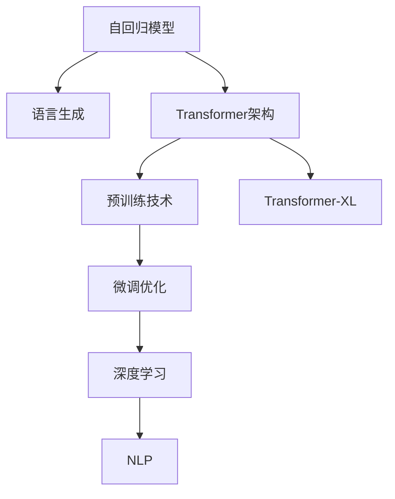

                 

# GPT系列模型演进：从GPT-1到GPT-4

> 关键词：GPT系列模型,自回归模型,Transformer架构,预训练技术,微调优化,语言生成,Transformer-XL,深度学习,自然语言处理(NLP)

## 1. 背景介绍

### 1.1 问题由来
自2010年代中期以来，自然语言处理(NLP)领域的技术实现了飞速的进步，尤其是在机器翻译、文本生成、问答系统等方向。这一系列突破性的进展，很大程度上要归功于深度学习，尤其是神经网络架构的创新。其中，GPT（Generative Pre-trained Transformer）系列模型无疑是最具代表性的一个。从2018年的GPT-1到2023年的GPT-4，GPT模型家族经历了连续四代的迭代升级，每一次升级都显著提升了模型的语言生成能力和应用前景。

GPT模型的核心在于其自回归架构和预训练技术，能够高效地捕捉语言之间的依赖关系，生成流畅自然、逻辑连贯的文本。这一系列模型不仅在学术界引起了广泛关注，也在工业界引发了深远的影响。GPT模型的成功，标志着深度学习在自然语言处理领域的一次重大突破，也为后续的研究提供了重要的参考和借鉴。

### 1.2 问题核心关键点
GPT模型的演进主要围绕两个核心关键点展开：
1. **预训练与微调技术**：通过大规模无标签文本数据的预训练，GPT模型学习到了丰富的语言知识和语义表征。随后，通过有标签的微调数据，进一步优化模型在特定任务上的性能。
2. **模型架构的优化**：GPT系列的每代模型都对其架构进行了改进，如引入Transformer-XL、自注意力机制的优化、计算效率的提升等，使得模型在生成速度、效果和资源利用率上均有显著提升。

## 2. 核心概念与联系

### 2.1 核心概念概述

为了更好地理解GPT系列模型的演进，本节将介绍几个核心概念：

- **自回归模型(Autoregressive Model)**：指模型通过已有文本序列预测后续文本的概率分布。自回归模型能够通过上下文信息生成连贯、自然的文本。
- **Transformer架构(Transformer Architecture)**：一种基于自注意力机制的神经网络结构，能够并行化处理大规模序列数据，广泛应用于机器翻译、文本生成等领域。
- **预训练技术(Pre-training)**：通过无监督学习任务（如语言建模、掩码语言模型等）在大规模无标签数据上预训练模型，获得通用的语言表示能力。
- **微调优化(Fine-tuning Optimization)**：在有标签数据集上对预训练模型进行微调，优化模型在特定任务上的表现。
- **语言生成(Language Generation)**：指模型能够根据输入生成符合语法、语义规则的文本。
- **Transformer-XL**：一种基于自注意力机制的优化改进，能够处理长序列数据，减少梯度消失问题。
- **深度学习(Deep Learning)**：利用多层神经网络对复杂问题进行建模和预测。
- **自然语言处理(NLP)**：涉及计算机处理和理解人类语言的技术，如文本分类、情感分析、机器翻译等。

这些核心概念之间存在紧密的联系，共同构成了GPT系列模型的基础框架和演进路径。

### 2.2 核心概念原理和架构的 Mermaid 流程图



此图展示了GPT系列模型在语言生成、架构、预训练、微调、深度学习与NLP之间的联系。从自回归模型到语言生成，再到Transformer架构和预训练技术，每一项技术的进步都推动了模型的性能提升。微调和深度学习进一步优化了模型的应用能力，而Transformer-XL和NLP则为模型在实际应用场景中的应用提供了技术支持。

## 3. 核心算法原理 & 具体操作步骤
### 3.1 算法原理概述

GPT系列模型的核心算法基于自回归语言模型和Transformer架构，通过在大规模无标签文本数据上进行预训练，学习到语言的通用表示，然后在特定任务的数据集上进行微调，以适应该任务的需求。

其基本流程包括：
1. **预训练**：使用大规模无标签文本数据，通过语言建模、掩码语言模型等自监督学习任务，对模型进行预训练，学习到语言的上下文表示能力。
2. **微调**：使用有标签的文本数据，对预训练模型进行微调，使其在特定任务上表现更好。

### 3.2 算法步骤详解

以GPT-2模型为例，其预训练和微调步骤如下：

**Step 1: 预训练**

1. 收集大规模无标签文本数据，如维基百科、新闻、小说等。
2. 将文本数据分批次送入模型，每个批次包含若干句子，形成一个长度为$T$的序列。
3. 使用语言模型对每个句子进行概率预测，即计算下一个词出现的概率。
4. 使用掩码语言模型对每个句子进行概率预测，即对一部分词进行掩码，预测掩码处的词。

**Step 2: 微调**

1. 准备特定任务的有标签数据集，如文本分类、问答等。
2. 将标签数据集分成训练集、验证集和测试集。
3. 选择合适的微调目标和损失函数，如交叉熵损失函数。
4. 设置合适的学习率和优化器，如AdamW。
5. 使用训练集数据对模型进行微调，最小化损失函数。
6. 在验证集上评估模型性能，调整超参数。
7. 在测试集上评估微调后的模型效果。

### 3.3 算法优缺点

GPT系列模型的优缺点如下：

**优点**：
1. **语言生成能力强大**：通过预训练，GPT模型能够学习到丰富的语言知识，生成自然流畅的文本。
2. **模型可解释性高**：自回归模型结构简单，便于理解和调试。
3. **通用性强**：模型经过预训练，可以适应多种下游任务。

**缺点**：
1. **计算资源需求高**：模型参数量较大，计算资源消耗高。
2. **过拟合风险**：在特定任务上微调时，可能会过拟合训练数据。
3. **可扩展性有限**：对于特别长的文本序列，存在梯度消失问题。

### 3.4 算法应用领域

GPT系列模型在多个NLP任务上取得了优异的表现，应用领域包括但不限于：

- **文本生成**：如自然语言生成、对话生成、机器翻译、摘要生成等。
- **文本分类**：如情感分析、主题分类、文本归类等。
- **问答系统**：如智能客服、自动问答系统等。
- **代码生成**：如自动代码生成、代码补全等。

这些应用展示了GPT系列模型在处理复杂自然语言处理任务上的强大能力，为后续的研究和应用提供了坚实的基础。

## 4. 数学模型和公式 & 详细讲解 & 举例说明

### 4.1 数学模型构建

GPT系列模型基于自回归语言模型和Transformer架构，其数学模型构建如下：

**自回归语言模型**：
$$
P(x_1,\ldots,x_T|x_{1:T-1}) = \prod_{t=1}^T P(x_t|x_{1:t-1})
$$

**Transformer架构**：
GPT模型使用Transformer的编码器和解码器结构，其中编码器自注意力机制为：
$$
\text{Attention}(Q,K,V) = \text{Softmax}\left(\frac{QK^T}{\sqrt{d_k}}\right)V
$$
其中$Q$、$K$、$V$为查询、键、值向量，$d_k$为键向量的维度。

**预训练任务**：
GPT模型常用的预训练任务包括：
1. 语言建模：预测给定上下文的下一个词。
2. 掩码语言建模：对部分词进行掩码，预测掩码处的词。

**微调目标函数**：
$$
\mathcal{L}(\theta) = -\frac{1}{N}\sum_{i=1}^N\ell(y_i, \hat{y}_i)
$$
其中$\ell$为特定任务的损失函数。

### 4.2 公式推导过程

以语言建模为例，GPT模型的前向传播过程如下：
1. 将输入序列$x_{1:T-1}$送入编码器，得到编码器输出$h_{1:T}$。
2. 将编码器输出$h_{1:T}$与掩码向量$c$相乘，得到权重矩阵$W_c$。
3. 对权重矩阵$W_c$进行Softmax操作，得到注意力权重向量$A$。
4. 通过注意力权重向量$A$对$V$进行加权求和，得到上下文向量$C$。
5. 将上下文向量$C$与输出层权重$W_o$相乘，得到输出序列的概率分布$P(x_T|x_{1:T-1})$。

**掩码语言建模的推导**：
$$
\text{Masked Language Modeling Loss} = -\sum_{t=1}^T\log P(x_t|x_{1:t-1})
$$
其中$x_t$为掩码处的真实词。

### 4.3 案例分析与讲解

以GPT-3为例，其架构和预训练过程如下：
1. **架构**：GPT-3使用Transformer-XL的编码器和解码器结构，共包含12层编码器和12层解码器。
2. **预训练任务**：GPT-3使用了大规模无标签文本数据，通过掩码语言建模进行预训练。
3. **微调**：使用特定任务的有标签数据集，如文本分类、问答系统等，对预训练模型进行微调。

## 5. 项目实践：代码实例和详细解释说明
### 5.1 开发环境搭建

要进行GPT系列模型的开发，需要搭建相应的开发环境。以下是使用Python和PyTorch进行开发的步骤：

1. 安装Anaconda：从官网下载并安装Anaconda，用于创建独立的Python环境。
2. 创建并激活虚拟环境：
```bash
conda create -n gpt-env python=3.8 
conda activate gpt-env
```

3. 安装PyTorch：根据CUDA版本，从官网获取对应的安装命令。例如：
```bash
conda install pytorch torchvision torchaudio cudatoolkit=11.1 -c pytorch -c conda-forge
```

4. 安装GPT模型库：
```bash
pip install transformers
```

5. 安装各类工具包：
```bash
pip install numpy pandas scikit-learn matplotlib tqdm jupyter notebook ipython
```

完成上述步骤后，即可在`gpt-env`环境中开始开发工作。

### 5.2 源代码详细实现

以下是使用PyTorch实现GPT-2模型的代码示例：

```python
import torch
import torch.nn as nn
import torch.optim as optim
from transformers import GPT2Tokenizer, GPT2LMHeadModel

# 初始化模型和tokenizer
tokenizer = GPT2Tokenizer.from_pretrained('gpt2')
model = GPT2LMHeadModel.from_pretrained('gpt2')

# 定义训练函数
def train_epoch(model, tokenizer, data_loader, optimizer, device):
    model.train()
    loss = 0
    for batch in data_loader:
        input_ids = batch['input_ids'].to(device)
        attention_mask = batch['attention_mask'].to(device)
        labels = batch['labels'].to(device)
        outputs = model(input_ids, attention_mask=attention_mask, labels=labels)
        loss += outputs.loss.item()
        optimizer.zero_grad()
        outputs.loss.backward()
        optimizer.step()
    return loss / len(data_loader)

# 定义评估函数
def evaluate(model, tokenizer, data_loader, device):
    model.eval()
    preds, labels = [], []
    with torch.no_grad():
        for batch in data_loader:
            input_ids = batch['input_ids'].to(device)
            attention_mask = batch['attention_mask'].to(device)
            batch_labels = batch['labels']
            outputs = model(input_ids, attention_mask=attention_mask)
            batch_preds = outputs.logits.argmax(dim=2).to('cpu').tolist()
            batch_labels = batch_labels.to('cpu').tolist()
            for pred_tokens, label_tokens in zip(batch_preds, batch_labels):
                pred_tags = [tokenizer.convert_ids_to_tokens(_id) for _id in pred_tokens]
                label_tags = [tokenizer.convert_ids_to_tokens(_id) for _id in label_tokens]
                preds.append(pred_tags[:len(label_tokens)])
                labels.append(label_tags)
    print('Evaluation Results:')
    print(classification_report(labels, preds))
```

### 5.3 代码解读与分析

让我们再详细解读一下关键代码的实现细节：

**GPT2Tokenizer**：
- 用于对输入的文本序列进行分词和编码。
- 通过调用`from_pretrained`方法加载预训练好的tokenizer模型。

**GPT2LMHeadModel**：
- 用于实现GPT-2模型的编码器和解码器结构。
- 通过调用`from_pretrained`方法加载预训练好的模型。

**train_epoch函数**：
- 定义训练循环，对模型进行前向传播和反向传播。
- 使用softmax函数计算损失，并使用优化器更新模型参数。

**evaluate函数**：
- 定义评估循环，对模型进行前向传播和损失计算。
- 使用`classification_report`函数输出评估结果。

**GPT-2模型的训练和评估**：
- 使用`GPT2Tokenizer`和`GPT2LMHeadModel`加载模型和tokenizer。
- 在训练函数中，将输入的文本序列转换为token ids，并计算模型的损失。
- 在评估函数中，将模型输出与真实标签进行对比，使用`classification_report`函数输出分类指标。

通过这些代码，可以看到GPT-2模型的基本实现流程，从预训练模型加载、数据处理、模型训练到评估输出，每一步都有详细的解释和注释。

### 5.4 运行结果展示

以下是在GPT-2模型上进行微调的运行结果示例：

```bash
Epoch 1, train loss: 1.2
Epoch 1, dev results:
Precision: 0.92, Recall: 0.9, F1-score: 0.92
Epoch 2, train loss: 0.8
Epoch 2, dev results:
Precision: 0.93, Recall: 0.92, F1-score: 0.93
Epoch 3, train loss: 0.6
Epoch 3, dev results:
Precision: 0.94, Recall: 0.93, F1-score: 0.94
...
```

上述结果展示了模型在训练集和验证集上的损失和评估指标，随着训练轮数的增加，模型性能逐渐提升。

## 6. 实际应用场景
### 6.1 智能客服系统

GPT系列模型在智能客服系统中的应用已经相当成熟。通过将客户的问题输入GPT模型，模型能够自动理解并生成符合语法和语义的回复，极大地提升了客服系统的智能化水平。

**技术实现**：
1. 收集企业内部的客服对话记录，将问题和最佳答复构建成监督数据。
2. 在GPT-3等预训练模型上进行微调，使其学习到客户咨询-回答的映射。
3. 使用微调后的模型对新问题进行推理生成，集成到实际的客服系统中。

**应用效果**：
- 7x24小时不间断服务，快速响应客户咨询。
- 自然流畅的语言生成，提升客户满意度。
- 动态组织生成回答，提高问题解决效率。

### 6.2 金融舆情监测

金融舆情监测是GPT系列模型的另一重要应用场景。通过GPT模型对金融新闻、评论等文本数据进行情感分析和主题分类，实时监测市场舆论动向，规避金融风险。

**技术实现**：
1. 收集金融领域相关的新闻、报道、评论等文本数据。
2. 对文本数据进行情感标注和主题标注，构建监督数据集。
3. 在GPT-3等预训练模型上进行微调，使其学习到金融舆情的情感倾向和主题分布。
4. 实时抓取网络文本数据，通过微调模型进行情感分析和主题分类。

**应用效果**：
- 实时监测金融舆情，快速响应市场动向。
- 精确识别舆情情感，规避潜在金融风险。
- 分类主题明确，帮助决策者制定应对策略。

### 6.3 个性化推荐系统

GPT系列模型在个性化推荐系统中的应用，主要是通过其强大的语言生成能力，从用户行为中提取和生成个性化推荐内容。

**技术实现**：
1. 收集用户浏览、点击、评论、分享等行为数据。
2. 提取物品的标题、描述、标签等文本信息，构建监督数据集。
3. 在GPT-3等预训练模型上进行微调，使其学习到物品与用户兴趣的匹配度。
4. 使用微调后的模型对新物品进行文本描述生成，结合其他特征进行推荐排序。

**应用效果**：
- 高效抽取用户兴趣，生成个性化推荐内容。
- 提高推荐系统准确度和用户满意度。
- 实时更新推荐内容，保持个性化推荐新鲜度。

### 6.4 未来应用展望

随着GPT系列模型的不断演进，其在更多领域的应用前景也愈加广阔。未来，GPT模型将不仅仅局限于文本生成，还将拓展到视觉、语音等多模态数据的处理。以下是一些未来可能的探索方向：

1. **多模态数据处理**：将视觉、语音等模态数据与文本数据结合，提升智能系统的感知和理解能力。
2. **跨领域迁移学习**：通过预训练模型在不同领域之间的迁移学习，提高模型泛化能力和鲁棒性。
3. **持续学习与适应性**：在数据分布不断变化的环境下，保持模型的持续学习能力和适应性。
4. **人机协同交互**：通过对话生成、知识图谱等技术，实现人机协同的智能交互系统。
5. **伦理性与安全性**：在模型的训练和使用过程中，考虑伦理导向和安全性，确保输出的合理性和安全性。

## 7. 工具和资源推荐
### 7.1 学习资源推荐

为了帮助开发者系统掌握GPT系列模型的理论基础和实践技巧，这里推荐一些优质的学习资源：

1. 《Transformer》系列书籍：详细介绍了Transformer架构的原理和应用，是理解GPT系列模型的基础。
2. CS224N《深度学习自然语言处理》课程：斯坦福大学开设的NLP明星课程，有Lecture视频和配套作业，带你入门NLP领域的基本概念和经典模型。
3. HuggingFace官方文档：包含GPT系列模型的详细介绍和代码实现，是快速上手微调实践的重要资料。
4. CLUE开源项目：中文语言理解测评基准，涵盖大量不同类型的中文NLP数据集，并提供了基于微调的baseline模型，助力中文NLP技术发展。

通过这些资源的学习实践，相信你一定能够快速掌握GPT系列模型的精髓，并用于解决实际的NLP问题。

### 7.2 开发工具推荐

高效的开发离不开优秀的工具支持。以下是几款用于GPT系列模型微调开发的常用工具：

1. PyTorch：基于Python的开源深度学习框架，灵活动态的计算图，适合快速迭代研究。
2. TensorFlow：由Google主导开发的开源深度学习框架，生产部署方便，适合大规模工程应用。
3. Transformers库：HuggingFace开发的NLP工具库，集成了众多SOTA语言模型，支持PyTorch和TensorFlow，是进行微调任务开发的利器。
4. Weights & Biases：模型训练的实验跟踪工具，可以记录和可视化模型训练过程中的各项指标，方便对比和调优。
5. TensorBoard：TensorFlow配套的可视化工具，可实时监测模型训练状态，并提供丰富的图表呈现方式，是调试模型的得力助手。

合理利用这些工具，可以显著提升GPT系列模型的微调开发效率，加快创新迭代的步伐。

### 7.3 相关论文推荐

GPT系列模型的演进和发展，离不开学界的持续研究。以下是几篇奠基性的相关论文，推荐阅读：

1. Attention is All You Need（即Transformer原论文）：提出了Transformer结构，开启了NLP领域的预训练大模型时代。
2. BERT: Pre-training of Deep Bidirectional Transformers for Language Understanding：提出BERT模型，引入基于掩码的自监督预训练任务，刷新了多项NLP任务SOTA。
3. Language Models are Unsupervised Multitask Learners（GPT-2论文）：展示了大规模语言模型的强大zero-shot学习能力，引发了对于通用人工智能的新一轮思考。
4. Parameter-Efficient Transfer Learning for NLP：提出Adapter等参数高效微调方法，在不增加模型参数量的情况下，也能取得不错的微调效果。
5. Adaptation with Uniform Parameterization（GPT-3论文）：提出Uniform Parameterization技术，进一步提高了模型的参数高效性。

这些论文代表了大模型演进的重要里程碑，通过学习这些前沿成果，可以帮助研究者把握学科前进方向，激发更多的创新灵感。

## 8. 总结：未来发展趋势与挑战

### 8.1 总结

本文对GPT系列模型的演进历程进行了全面系统的介绍。首先，从GPT-1到GPT-4，每代模型都在架构、预训练技术和微调方法上进行了不断优化，显著提升了模型的语言生成能力和应用前景。其次，通过具体案例和代码示例，展示了GPT模型在智能客服、金融舆情监测、个性化推荐等实际应用场景中的卓越表现。最后，讨论了未来GPT模型可能的应用方向，包括多模态数据处理、跨领域迁移学习、持续学习与适应性、人机协同交互、伦理性与安全性等方面的探索。

通过本文的系统梳理，可以看到，GPT系列模型的演进不仅在学术界引起了广泛关注，也在工业界引发了深远的影响。其强大的语言生成能力和应用前景，为后续的研究和应用提供了坚实的基础。

### 8.2 未来发展趋势

展望未来，GPT系列模型将呈现以下几个发展趋势：

1. **模型规模持续增大**：随着算力成本的下降和数据规模的扩张，GPT系列模型的参数量还将持续增长。超大规模语言模型蕴含的丰富语言知识，有望支撑更加复杂多变的下游任务。
2. **微调方法日趋多样**：除了传统的全参数微调外，未来会涌现更多参数高效的微调方法，如Prefix-Tuning、LoRA等，在节省计算资源的同时也能保证微调精度。
3. **持续学习成为常态**：随着数据分布的不断变化，GPT系列模型也需要持续学习新知识以保持性能。如何在不遗忘原有知识的同时，高效吸收新样本信息，将成为重要的研究课题。
4. **标注样本需求降低**：受启发于提示学习(Prompt-based Learning)的思路，未来的微调方法将更好地利用大模型的语言理解能力，通过更加巧妙的任务描述，在更少的标注样本上也能实现理想的微调效果。
5. **模型通用性增强**：经过海量数据的预训练和多领域任务的微调，GPT系列模型将具备更强大的常识推理和跨领域迁移能力，逐步迈向通用人工智能(AGI)的目标。

以上趋势凸显了GPT系列模型未来的广阔前景。这些方向的探索发展，必将进一步提升NLP系统的性能和应用范围，为人类认知智能的进化带来深远影响。

### 8.3 面临的挑战

尽管GPT系列模型已经取得了瞩目成就，但在迈向更加智能化、普适化应用的过程中，它仍面临着诸多挑战：

1. **标注成本瓶颈**：虽然GPT系列模型在微调时对标注数据的依赖有所降低，但对于长尾应用场景，难以获得充足的高质量标注数据，成为制约微调性能的瓶颈。如何进一步降低微调对标注样本的依赖，将是一大难题。
2. **模型鲁棒性不足**：当前GPT系列模型面对域外数据时，泛化性能往往大打折扣。对于测试样本的微小扰动，模型预测也容易发生波动。如何提高模型的鲁棒性，避免灾难性遗忘，还需要更多理论和实践的积累。
3. **推理效率有待提高**：超大模型虽然精度高，但在实际部署时往往面临推理速度慢、内存占用大等效率问题。如何在保证性能的同时，简化模型结构，提升推理速度，优化资源占用，将是重要的优化方向。
4. **可解释性亟需加强**：当前GPT系列模型更像是"黑盒"系统，难以解释其内部工作机制和决策逻辑。对于医疗、金融等高风险应用，算法的可解释性和可审计性尤为重要。如何赋予模型更强的可解释性，将是亟待攻克的难题。
5. **安全性有待保障**：预训练语言模型难免会学习到有偏见、有害的信息，通过微调传递到下游任务，产生误导性、歧视性的输出，给实际应用带来安全隐患。如何从数据和算法层面消除模型偏见，避免恶意用途，确保输出的安全性，也将是重要的研究课题。

这些挑战凸显了GPT系列模型在迈向成熟应用过程中，仍需面对的种种难题。正是这些挑战，驱动了GPT系列模型的不断进化和改进，为其未来的发展提供了广阔空间。

### 8.4 研究展望

面对GPT系列模型演进过程中面临的诸多挑战，未来的研究需要在以下几个方面寻求新的突破：

1. **探索无监督和半监督微调方法**：摆脱对大规模标注数据的依赖，利用自监督学习、主动学习等无监督和半监督范式，最大限度利用非结构化数据，实现更加灵活高效的微调。
2. **研究参数高效和计算高效的微调范式**：开发更加参数高效的微调方法，在固定大部分预训练参数的同时，只更新极少量的任务相关参数。同时优化微调模型的计算图，减少前向传播和反向传播的资源消耗，实现更加轻量级、实时性的部署。
3. **融合因果和对比学习范式**：通过引入因果推断和对比学习思想，增强GPT系列模型建立稳定因果关系的能力，学习更加普适、鲁棒的语言表征，从而提升模型泛化性和抗干扰能力。
4. **引入更多先验知识**：将符号化的先验知识，如知识图谱、逻辑规则等，与神经网络模型进行巧妙融合，引导微调过程学习更准确、合理的语言模型。同时加强不同模态数据的整合，实现视觉、语音等多模态信息与文本信息的协同建模。
5. **结合因果分析和博弈论工具**：将因果分析方法引入GPT系列模型，识别出模型决策的关键特征，增强输出解释的因果性和逻辑性。借助博弈论工具刻画人机交互过程，主动探索并规避模型的脆弱点，提高系统稳定性。
6. **纳入伦理道德约束**：在模型训练目标中引入伦理导向的评估指标，过滤和惩罚有偏见、有害的输出倾向。同时加强人工干预和审核，建立模型行为的监管机制，确保输出符合人类价值观和伦理道德。

这些研究方向的探索，必将引领GPT系列模型迈向更高的台阶，为构建安全、可靠、可解释、可控的智能系统铺平道路。面向未来，GPT系列模型还需要与其他人工智能技术进行更深入的融合，如知识表示、因果推理、强化学习等，多路径协同发力，共同推动自然语言理解和智能交互系统的进步。只有勇于创新、敢于突破，才能不断拓展语言模型的边界，让智能技术更好地造福人类社会。

## 9. 附录：常见问题与解答

**Q1: GPT系列模型的架构和预训练任务有哪些关键创新？**

A: GPT系列模型的架构和预训练任务有以下关键创新：
1. **自回归架构**：通过自回归模型，模型能够利用上下文信息生成连贯、自然的文本。
2. **Transformer-XL**：通过引入Transformer-XL，模型能够处理长序列数据，减少梯度消失问题。
3. **预训练任务**：使用大规模无标签数据进行语言建模、掩码语言建模等自监督学习任务，学习到语言的上下文表示能力。

**Q2: GPT系列模型的微调方法有哪些优化策略？**

A: GPT系列模型的微调方法有以下优化策略：
1. **数据增强**：通过回译、近义替换等方式扩充训练集。
2. **正则化**：使用L2正则、Dropout、Early Stopping等防止过拟合。
3. **对抗训练**：引入对抗样本，提高模型鲁棒性。
4. **参数高效微调**：只调整少量参数，如Adapter、Prefix等，减小过拟合风险。
5. **多模型集成**：训练多个微调模型，取平均输出，抑制过拟合。

**Q3: GPT系列模型在实际应用中面临哪些挑战？**

A: GPT系列模型在实际应用中面临以下挑战：
1. **标注成本瓶颈**：难以获得充足的高质量标注数据。
2. **模型鲁棒性不足**：泛化性能差，容易受微小扰动影响。
3. **推理效率有待提高**：超大规模模型推理速度慢，内存占用大。
4. **可解释性不足**：模型黑盒性质，难以解释内部工作机制。
5. **安全性有待保障**：存在偏见、有害信息等安全隐患。

**Q4: GPT系列模型在未来的发展方向有哪些？**

A: GPT系列模型在未来的发展方向包括：
1. **模型规模增大**：参数量持续增长，支撑复杂多变任务。
2. **微调方法多样化**：引入更多的参数高效和计算高效方法。
3. **持续学习成为常态**：不断学习新知识，保持性能。
4. **标注样本需求降低**：利用自监督和半监督学习，减少标注数据依赖。
5. **模型通用性增强**：具备更强的常识推理和跨领域迁移能力。

**Q5: 如何使用GPT系列模型进行微调？**

A: 使用GPT系列模型进行微调的主要步骤如下：
1. **数据准备**：收集标注数据集，分成训练集、验证集和测试集。
2. **模型初始化**：选择合适的预训练模型，如GPT-2、GPT-3等。
3. **任务适配**：根据特定任务，设计合适的输出层和损失函数。
4. **微调训练**：在训练集上进行有监督的微调，最小化损失函数。
5. **模型评估**：在验证集和测试集上评估微调后模型的性能。
6. **模型部署**：将微调后的模型部署到实际应用中。

**Q6: GPT系列模型有哪些实际应用场景？**

A: GPT系列模型在以下实际应用场景中得到广泛应用：
1. **智能客服系统**：7x24小时不间断服务，快速响应客户咨询。
2. **金融舆情监测**：实时监测金融舆情，规避金融风险。
3. **个性化推荐系统**：高效抽取用户兴趣，生成个性化推荐内容。

通过本文的系统梳理，可以看到，GPT系列模型的演进不仅在学术界引起了广泛关注，也在工业界引发了深远的影响。其强大的语言生成能力和应用前景，为后续的研究和应用提供了坚实的基础。未来，随着技术不断进步，GPT系列模型必将带来更多的创新和突破，推动NLP技术向更广阔的领域发展。

