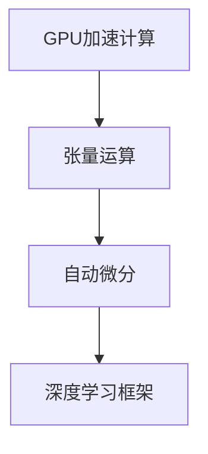

                 

# GPU 加速计算：加速深度学习

> 关键词：GPU加速,深度学习,张量运算,自动微分,深度学习框架,模型训练

## 1. 背景介绍

### 1.1 问题由来

深度学习（Deep Learning）作为人工智能领域的核心技术之一，近年来在图像识别、语音识别、自然语言处理等诸多领域取得了突破性进展。然而，深度学习模型的训练过程往往需要庞大的计算资源，尤其是在大规模的图像和序列数据上。传统的CPU计算资源远远无法满足需求，这就需要借助GPU（图形处理器）的并行计算能力来加速训练过程。

GPU加速计算作为加速深度学习模型训练的一种手段，近年来得到了广泛应用。GPU之所以适合深度学习计算，是因为其具有以下几个优势：

- **并行计算能力**：GPU拥有数千个计算核心，可以同时处理多个数据点的计算任务。
- **高速内存带宽**：GPU的内存带宽远远高于CPU，能够快速读写大量数据。
- **高效的数据并行处理**：深度学习模型中大量涉及矩阵运算，GPU能够高效地处理这些并行任务。

GPU加速计算不仅能够显著提高深度学习模型的训练速度，还能有效降低计算成本，使得深度学习技术更容易落地应用。

### 1.2 问题核心关键点

GPU加速计算的核心关键点在于如何高效地利用GPU的并行计算能力。具体而言，包括以下几个方面：

- **数据并行**：将深度学习模型中的计算任务分解为多个子任务，并行在GPU上进行计算。
- **模型并行**：将深度学习模型拆分为多个部分，并行在多个GPU上进行计算。
- **混合并行**：结合数据并行和模型并行，进一步提升并行计算效率。
- **自动微分**：实现深度学习模型的反向传播，通过自动微分算法自动计算梯度。

这些关键点共同构成了GPU加速计算的技术框架，使得深度学习模型能够在GPU上高效地进行训练。

## 2. 核心概念与联系

### 2.1 核心概念概述

为更好地理解GPU加速计算的原理和应用，本节将介绍几个关键概念：

- **GPU加速计算**：通过将深度学习模型中的计算任务映射到GPU上进行并行处理，显著提升计算速度和效率的过程。
- **张量运算**：深度学习模型中涉及大量矩阵和向量运算，这些运算被称为张量运算。GPU擅长处理张量运算，能够显著加速模型训练。
- **自动微分**：深度学习模型训练过程中需要计算梯度，通过自动微分算法自动计算梯度，避免手动计算的复杂性和错误。
- **深度学习框架**：如TensorFlow、PyTorch等，提供了高效的GPU加速计算接口，简化了深度学习模型的开发和训练过程。

这些概念之间的逻辑关系可以通过以下Mermaid流程图来展示：



这个流程图展示了大语言模型的核心概念及其之间的关系：

1. GPU加速计算是将深度学习模型中的计算任务映射到GPU上进行并行处理的过程。
2. 张量运算涉及到深度学习模型中大量的矩阵和向量运算，GPU擅长处理这些并行任务。
3. 自动微分是一种自动计算梯度的方法，用于优化深度学习模型的训练过程。
4. 深度学习框架提供了高效的GPU加速计算接口，简化了深度学习模型的开发和训练过程。

这些概念共同构成了GPU加速计算的技术框架，使得深度学习模型能够在GPU上高效地进行训练。

## 3. 核心算法原理 & 具体操作步骤
### 3.1 算法原理概述

GPU加速计算的原理是通过将深度学习模型中的计算任务映射到GPU上进行并行处理，利用GPU的并行计算能力来加速模型训练。具体而言，深度学习模型中的张量运算可以在GPU上并行计算，显著提升计算速度和效率。

形式化地，假设深度学习模型 $M$ 包含 $L$ 个神经网络层，其中每一层的计算任务可以通过张量运算表示为：

$$
\mathbf{z}_l = f_l(\mathbf{z}_{l-1}, \mathbf{W}_l, \mathbf{b}_l)
$$

其中，$\mathbf{z}_l$ 为第 $l$ 层的输出张量，$\mathbf{z}_{l-1}$ 为上一层的输出张量，$\mathbf{W}_l$ 和 $\mathbf{b}_l$ 分别为第 $l$ 层的权重和偏置。

在GPU加速计算中，每个神经网络层 $l$ 的计算任务可以并行在GPU上进行计算，即：

$$
\mathbf{z}_l^{\text{GPU}} = f_l^{\text{GPU}}(\mathbf{z}_{l-1}, \mathbf{W}_l, \mathbf{b}_l)
$$

其中，$f_l^{\text{GPU}}$ 表示在GPU上执行的神经网络层计算函数。

### 3.2 算法步骤详解

GPU加速计算一般包括以下几个关键步骤：

**Step 1: 数据准备**

- 将深度学习模型的输入数据 $\mathbf{x}$ 和目标数据 $\mathbf{y}$ 准备为GPU支持的张量格式。
- 将模型的权重和偏置初始化，设定训练参数（如学习率、批量大小等）。

**Step 2: 模型定义**

- 在深度学习框架中定义神经网络模型，并指定在GPU上进行计算。
- 对模型进行前向传播，计算输出 $\mathbf{z}_L$。

**Step 3: 计算损失**

- 根据输出 $\mathbf{z}_L$ 和目标数据 $\mathbf{y}$ 计算损失函数 $\mathcal{L}$。
- 反向传播计算梯度，使用自动微分算法自动计算每个参数的梯度。

**Step 4: 更新模型**

- 根据计算出的梯度，使用优化算法（如SGD、Adam等）更新模型参数。
- 重复上述步骤，直到模型收敛或达到预设的迭代次数。

**Step 5: 性能评估**

- 在验证集上评估模型性能，调整模型参数以进一步提升精度。
- 在测试集上评估最终模型性能，评估模型的泛化能力。

以上是GPU加速计算的一般流程。在实际应用中，还需要根据具体任务和数据特点进行优化设计，如改进损失函数、调整优化器参数、引入正则化技术等，以进一步提升模型性能。

### 3.3 算法优缺点

GPU加速计算具有以下优点：

1. **显著提升计算速度**：GPU的并行计算能力使得深度学习模型能够在大规模数据上高效地进行训练。
2. **降低计算成本**：相比于传统CPU计算，GPU计算可以大幅度降低计算成本，加速模型开发和训练。
3. **提高模型精度**：GPU加速计算能够更好地处理深度学习模型中的大量张量运算，提高模型精度和稳定性。

同时，GPU加速计算也存在一些局限性：

1. **资源需求高**：GPU计算需要较高的内存和显存资源，对于计算资源有限的场景可能不适用。
2. **编程复杂**：GPU计算的并行编程需要一定的技巧和经验，初学者可能需要较长时间的学习和调试。
3. **模型部署困难**：将GPU计算模型部署到生产环境中可能存在一定的复杂性，需要考虑硬件兼容性和优化策略。

尽管存在这些局限性，但GPU加速计算仍是当前深度学习模型训练的主流技术。未来随着GPU技术的不断进步和优化工具的完善，GPU加速计算将进一步提升深度学习模型的训练效率和精度。

### 3.4 算法应用领域

GPU加速计算在深度学习模型的训练和推理过程中得到了广泛应用，涵盖了几乎所有常见的深度学习应用领域，例如：

- **计算机视觉**：如图像分类、目标检测、图像分割等。
- **自然语言处理**：如文本分类、机器翻译、问答系统等。
- **语音识别**：如语音转文本、语音合成等。
- **推荐系统**：如用户行为预测、物品推荐等。
- **强化学习**：如游戏智能、机器人控制等。

除了这些经典应用外，GPU加速计算还在更多领域得到了创新性地应用，如医疗影像分析、分子模拟、交通流量预测等，为各行各业带来了新的技术突破。

## 4. 数学模型和公式 & 详细讲解 & 举例说明

### 4.1 数学模型构建

在GPU加速计算中，深度学习模型的数学模型可以表示为：

$$
\mathbf{z}_L = M(\mathbf{z}_{L-1})
$$

其中，$M$ 为深度学习模型的前向传播函数，$\mathbf{z}_{L-1}$ 为上一层的输出张量。

假设损失函数为 $\mathcal{L}$，则优化目标为：

$$
\theta^* = \mathop{\arg\min}_{\theta} \mathcal{L}(\theta)
$$

其中，$\theta$ 为模型的参数。

在GPU加速计算中，反向传播算法用于计算损失函数 $\mathcal{L}$ 对模型参数 $\theta$ 的梯度：

$$
\nabla_{\theta} \mathcal{L} = \frac{\partial \mathcal{L}}{\partial \mathbf{z}_L} \frac{\partial \mathbf{z}_L}{\partial \mathbf{z}_{L-1}} \cdots \frac{\partial \mathbf{z}_2}{\partial \mathbf{z}_1} \frac{\partial \mathbf{z}_1}{\partial \theta}
$$

其中，$\frac{\partial \mathbf{z}_l}{\partial \mathbf{z}_{l-1}}$ 表示第 $l$ 层的激活函数对输入的导数。

### 4.2 公式推导过程

以一个简单的全连接神经网络为例，推导反向传播算法中的梯度计算公式。

假设神经网络包含两个隐藏层，第一层有 $n_1$ 个神经元，第二层有 $n_2$ 个神经元，输出层有 $n_3$ 个神经元，则前向传播过程可以表示为：

$$
\begin{align*}
\mathbf{z}_1 &= f_1(\mathbf{x}, \mathbf{W}_1, \mathbf{b}_1) \\
\mathbf{z}_2 &= f_2(\mathbf{z}_1, \mathbf{W}_2, \mathbf{b}_2) \\
\mathbf{z}_L &= f_L(\mathbf{z}_2, \mathbf{W}_L, \mathbf{b}_L)
\end{align*}
$$

其中，$f_1$ 和 $f_2$ 为激活函数，$\mathbf{W}_1$ 和 $\mathbf{W}_2$ 分别为两个隐藏层的权重矩阵，$\mathbf{b}_1$ 和 $\mathbf{b}_2$ 分别为两个隐藏层的偏置向量。

假设损失函数为交叉熵损失函数，目标数据为 $\mathbf{y}$，则损失函数可以表示为：

$$
\mathcal{L} = -\frac{1}{N} \sum_{i=1}^N \sum_{j=1}^{n_3} y_{i,j} \log \hat{y}_{i,j}
$$

其中，$N$ 为样本数，$\hat{y}_{i,j}$ 为神经网络对第 $i$ 个样本的第 $j$ 个输出节点的预测概率。

反向传播算法用于计算损失函数 $\mathcal{L}$ 对每个参数的梯度。以第一层的权重矩阵 $\mathbf{W}_1$ 的梯度为例，计算过程如下：

$$
\begin{align*}
\frac{\partial \mathcal{L}}{\partial \mathbf{W}_1} &= \frac{1}{N} \sum_{i=1}^N \frac{\partial \mathcal{L}}{\partial \hat{y}_1} \frac{\partial \hat{y}_1}{\partial \mathbf{z}_1} \frac{\partial \mathbf{z}_1}{\partial \mathbf{x}} \frac{\partial \mathbf{x}}{\partial \mathbf{W}_1} \\
&= \frac{1}{N} \sum_{i=1}^N y_i \frac{\partial \hat{y}_1}{\partial \mathbf{z}_1} \frac{\partial \mathbf{z}_1}{\partial \mathbf{W}_1} \\
&= \frac{1}{N} \sum_{i=1}^N y_i \delta_1 f_1'(\mathbf{z}_1) \mathbf{x}
\end{align*}
$$

其中，$\delta_1$ 为第一层的激活函数导数，$f_1'$ 为激活函数的导数。

通过反向传播算法，可以计算出每个参数的梯度，然后使用优化算法（如SGD、Adam等）更新模型参数。

### 4.3 案例分析与讲解

以下以图像分类任务为例，展示GPU加速计算在深度学习模型训练中的应用。

假设输入数据为 $28 \times 28$ 的灰度图像，目标数据为 $10$ 类别的独热编码向量。使用卷积神经网络（CNN）进行图像分类，模型的前向传播过程可以表示为：

$$
\begin{align*}
\mathbf{z}_1 &= f_1(\mathbf{x}, \mathbf{W}_1, \mathbf{b}_1) \\
\mathbf{z}_2 &= f_2(\mathbf{z}_1, \mathbf{W}_2, \mathbf{b}_2) \\
\mathbf{z}_L &= f_L(\mathbf{z}_2, \mathbf{W}_L, \mathbf{b}_L)
\end{align*}
$$

其中，$f_1$ 和 $f_2$ 为激活函数，$\mathbf{W}_1$ 和 $\mathbf{W}_2$ 分别为卷积层和池化层的权重矩阵，$\mathbf{b}_1$ 和 $\mathbf{b}_2$ 分别为卷积层和池化层的偏置向量。

假设损失函数为交叉熵损失函数，目标数据为 $\mathbf{y}$，则损失函数可以表示为：

$$
\mathcal{L} = -\frac{1}{N} \sum_{i=1}^N \sum_{j=1}^{10} y_{i,j} \log \hat{y}_{i,j}
$$

其中，$N$ 为样本数，$\hat{y}_{i,j}$ 为神经网络对第 $i$ 个样本的第 $j$ 个输出节点的预测概率。

反向传播算法用于计算损失函数 $\mathcal{L}$ 对每个参数的梯度。以卷积层权重矩阵 $\mathbf{W}_1$ 的梯度为例，计算过程如下：

$$
\begin{align*}
\frac{\partial \mathcal{L}}{\partial \mathbf{W}_1} &= \frac{1}{N} \sum_{i=1}^N \frac{\partial \mathcal{L}}{\partial \hat{y}_1} \frac{\partial \hat{y}_1}{\partial \mathbf{z}_1} \frac{\partial \mathbf{z}_1}{\partial \mathbf{W}_1} \\
&= \frac{1}{N} \sum_{i=1}^N y_i \delta_1 f_1'(\mathbf{z}_1) * \mathbf{I} * \mathbf{x} \\
&= \frac{1}{N} \sum_{i=1}^N y_i \delta_1 f_1'(\mathbf{z}_1) * \mathbf{x}
\end{align*}
$$

其中，$\delta_1$ 为卷积层激活函数导数，$f_1'$ 为激活函数的导数，$*$ 表示卷积运算，$\mathbf{I}$ 为单位矩阵。

通过反向传播算法，可以计算出每个参数的梯度，然后使用优化算法（如SGD、Adam等）更新模型参数。

## 5. 项目实践：代码实例和详细解释说明
### 5.1 开发环境搭建

在进行GPU加速计算的实践前，我们需要准备好开发环境。以下是使用Python进行PyTorch开发的环境配置流程：

1. 安装Anaconda：从官网下载并安装Anaconda，用于创建独立的Python环境。

2. 创建并激活虚拟环境：
```bash
conda create -n pytorch-env python=3.8 
conda activate pytorch-env
```

3. 安装PyTorch：根据CUDA版本，从官网获取对应的安装命令。例如：
```bash
conda install pytorch torchvision torchaudio cudatoolkit=11.1 -c pytorch -c conda-forge
```

4. 安装TensorFlow：由于TensorFlow支持GPU加速计算，可以安装对应的GPU版本。
```bash
conda install tensorflow-gpu
```

5. 安装各类工具包：
```bash
pip install numpy pandas scikit-learn matplotlib tqdm jupyter notebook ipython
```

完成上述步骤后，即可在`pytorch-env`环境中开始GPU加速计算实践。

### 5.2 源代码详细实现

下面我们以图像分类任务为例，给出使用PyTorch进行GPU加速计算的PyTorch代码实现。

首先，定义数据处理函数：

```python
import torch
import torch.nn as nn
import torchvision
import torchvision.transforms as transforms
from torch.utils.data import DataLoader

# 定义数据处理函数
transform = transforms.Compose([
    transforms.ToTensor(),
    transforms.Normalize((0.5,), (0.5,))
])

# 加载数据集
train_dataset = torchvision.datasets.CIFAR10(root='./data', train=True, download=True, transform=transform)
test_dataset = torchvision.datasets.CIFAR10(root='./data', train=False, download=True, transform=transform)

# 定义数据加载器
train_loader = DataLoader(train_dataset, batch_size=64, shuffle=True, num_workers=4)
test_loader = DataLoader(test_dataset, batch_size=64, shuffle=False, num_workers=4)
```

然后，定义模型和优化器：

```python
# 定义卷积神经网络
class CNN(nn.Module):
    def __init__(self):
        super(CNN, self).__init__()
        self.conv1 = nn.Conv2d(3, 64, kernel_size=3, stride=1, padding=1)
        self.conv2 = nn.Conv2d(64, 128, kernel_size=3, stride=1, padding=1)
        self.pool = nn.MaxPool2d(kernel_size=2, stride=2)
        self.fc1 = nn.Linear(128 * 8 * 8, 256)
        self.fc2 = nn.Linear(256, 10)

    def forward(self, x):
        x = self.conv1(x)
        x = nn.ReLU()(x)
        x = self.pool(x)
        x = self.conv2(x)
        x = nn.ReLU()(x)
        x = self.pool(x)
        x = x.view(-1, 128 * 8 * 8)
        x = self.fc1(x)
        x = nn.ReLU()(x)
        x = self.fc2(x)
        return x

# 定义优化器和损失函数
model = CNN()
optimizer = torch.optim.Adam(model.parameters(), lr=0.001)
criterion = nn.CrossEntropyLoss()

# 定义GPU设备
device = torch.device("cuda:0" if torch.cuda.is_available() else "cpu")
model.to(device)
```

接着，定义训练和评估函数：

```python
# 定义训练函数
def train_epoch(model, data_loader, optimizer, criterion, device):
    model.train()
    running_loss = 0.0
    for batch_idx, (data, target) in enumerate(data_loader):
        data, target = data.to(device), target.to(device)
        optimizer.zero_grad()
        output = model(data)
        loss = criterion(output, target)
        loss.backward()
        optimizer.step()
        running_loss += loss.item()
        if batch_idx % 100 == 99:
            print('[%d, %5d] loss: %.3f' % (epoch + 1, batch_idx + 1, running_loss / 100))
            running_loss = 0.0

# 定义评估函数
def evaluate(model, data_loader, device):
    model.eval()
    correct = 0
    total = 0
    with torch.no_grad():
        for data, target in data_loader:
            data, target = data.to(device), target.to(device)
            output = model(data)
            _, predicted = torch.max(output.data, 1)
            total += target.size(0)
            correct += (predicted == target).sum().item()
    print('Accuracy of the network on the 10000 test images: %d %%' % (100 * correct / total))

# 启动训练流程并在测试集上评估
epochs = 10
for epoch in range(epochs):
    train_epoch(model, train_loader, optimizer, criterion, device)
    evaluate(model, test_loader, device)
```

以上代码展示了如何使用PyTorch在GPU上进行图像分类任务的训练和评估。可以看到，GPU加速计算使得深度学习模型的训练和评估变得更加高效和稳定。

### 5.3 代码解读与分析

让我们再详细解读一下关键代码的实现细节：

**数据处理函数**：
- `transforms`模块提供了多种数据预处理操作，包括将数据转换为张量格式和归一化操作。
- `CIFAR10`数据集包含了60,000张32x32的彩色图像，10个类别的标签。
- `DataLoader`用于批量加载数据，方便模型的训练和评估。

**模型定义**：
- 定义了包含两个卷积层和两个全连接层的卷积神经网络模型。
- 使用`nn.Conv2d`定义卷积层，使用`nn.ReLU`定义激活函数，使用`nn.MaxPool2d`定义池化层。
- 使用`nn.Linear`定义全连接层，使用`nn.CrossEntropyLoss`定义交叉熵损失函数。

**优化器和损失函数**：
- 使用`torch.optim.Adam`定义优化器，设置学习率为0.001。
- 使用`nn.CrossEntropyLoss`定义损失函数。

**GPU设备**：
- 使用`torch.device`定义GPU设备，确保模型在GPU上运行。
- 使用`model.to(device)`将模型移动到GPU设备上。

**训练函数**：
- 在每个epoch内，对训练集进行迭代训练。
- 在每个batch中，将数据和标签移动到GPU设备上，进行前向传播和反向传播。
- 使用优化器更新模型参数，并打印出每个epoch的平均损失。

**评估函数**：
- 在测试集上对模型进行评估，统计准确率。
- 使用`torch.no_grad`禁用模型的梯度计算，避免对评估过程造成干扰。

**训练流程**：
- 定义总的epoch数，开始循环迭代。
- 在每个epoch内，先进行训练，后进行评估。
- 所有epoch结束后，输出最终的评估结果。

可以看到，PyTorch提供了简洁易用的API，使得GPU加速计算的实现变得简单高效。开发者可以快速上手，构建深度学习模型并进行GPU加速训练。

当然，工业级的系统实现还需考虑更多因素，如模型的保存和部署、超参数的自动搜索、更灵活的任务适配层等。但核心的GPU加速计算范式基本与此类似。

## 6. 实际应用场景
### 6.1 自然语言处理

GPU加速计算在自然语言处理（NLP）领域也得到了广泛应用，特别是在深度学习模型的训练和推理过程中。

以语言模型为例，语言模型通过预测下一个单词的概率来衡量一个句子或段落的连贯性。训练一个语言模型需要大量的计算资源，特别是在大规模的文本数据上。GPU加速计算使得训练过程变得更加高效和稳定。

具体而言，GPU加速计算可以应用于以下NLP任务：

- 文本分类：如情感分析、主题分类等。
- 机器翻译：如英中翻译、中英翻译等。
- 对话系统：如聊天机器人、客服对话等。
- 问答系统：如智能问答、知识图谱等。

在实际应用中，GPU加速计算可以显著提升NLP模型的训练速度和性能，使得NLP技术更容易落地应用。

### 6.2 计算机视觉

GPU加速计算在计算机视觉领域的应用同样广泛。计算机视觉任务通常涉及大量张量运算，如卷积、池化、反卷积等。GPU的并行计算能力使得这些运算能够在短时间内完成，从而显著提升模型的训练速度。

以图像分类为例，GPU加速计算可以应用于以下计算机视觉任务：

- 图像分类：如手写数字识别、物体识别等。
- 目标检测：如行人检测、车辆检测等。
- 图像分割：如语义分割、实例分割等。

在实际应用中，GPU加速计算可以显著提升计算机视觉模型的训练速度和性能，使得计算机视觉技术更容易落地应用。

### 6.3 语音识别

GPU加速计算在语音识别领域也有着广泛的应用。语音识别任务通常涉及大量的信号处理和张量运算，GPU的并行计算能力使得这些运算能够在短时间内完成，从而显著提升模型的训练速度。

以语音识别为例，GPU加速计算可以应用于以下语音识别任务：

- 语音转文本：如语音识别、语音命令等。
- 语音合成：如文本转语音、语音生成等。

在实际应用中，GPU加速计算可以显著提升语音识别模型的训练速度和性能，使得语音识别技术更容易落地应用。

### 6.4 推荐系统

GPU加速计算在推荐系统领域也有着广泛的应用。推荐系统通常涉及大量的计算和数据处理，GPU的并行计算能力使得这些运算能够在短时间内完成，从而显著提升模型的训练速度和性能。

以推荐系统为例，GPU加速计算可以应用于以下推荐系统任务：

- 用户行为预测：如用户兴趣预测、推荐物品等。
- 物品推荐：如物品相似度计算、推荐排序等。

在实际应用中，GPU加速计算可以显著提升推荐系统的训练速度和性能，使得推荐系统更容易落地应用。

## 7. 工具和资源推荐
### 7.1 学习资源推荐

为了帮助开发者系统掌握GPU加速计算的理论基础和实践技巧，这里推荐一些优质的学习资源：

1. 《深度学习》（周志华著）：全面介绍了深度学习的基本概念和算法，涵盖GPU加速计算等技术细节。
2. 《PyTorch官方文档》：提供了GPU加速计算的详细API文档，方便开发者快速上手。
3. 《TensorFlow官方文档》：提供了GPU加速计算的详细API文档，涵盖GPU加速计算的各种功能。
4. 《深度学习框架TensorFlow实战》：详细介绍TensorFlow的GPU加速计算功能，并通过实战案例帮助开发者掌握。
5. 《深度学习框架PyTorch实战》：详细介绍PyTorch的GPU加速计算功能，并通过实战案例帮助开发者掌握。

通过对这些资源的学习实践，相信你一定能够快速掌握GPU加速计算的精髓，并用于解决实际的深度学习问题。
###  7.2 开发工具推荐

高效的开发离不开优秀的工具支持。以下是几款用于GPU加速计算开发的常用工具：

1. PyTorch：基于Python的开源深度学习框架，灵活动态的计算图，适合快速迭代研究。
2. TensorFlow：由Google主导开发的开源深度学习框架，生产部署方便，适合大规模工程应用。
3. Keras：高层API，方便开发者快速构建深度学习模型。
4. Jupyter Notebook：交互式编程环境，支持多种编程语言，方便开发者调试和分享代码。
5. Anaconda：Python环境管理工具，方便开发者安装和管理Python环境。
6. Visual Studio Code：现代化的编程工具，支持多种编程语言，提供丰富的插件和扩展。

合理利用这些工具，可以显著提升GPU加速计算的开发效率，加快创新迭代的步伐。

### 7.3 相关论文推荐

GPU加速计算作为深度学习模型训练的核心技术之一，近年来得到了学界的广泛关注。以下是几篇奠基性的相关论文，推荐阅读：

1. A New Look at Backpropagation in Deep Neural Networks：提出反向传播算法，为深度学习模型的训练提供了理论基础。
2. Deep Learning with CUDA：介绍了GPU加速计算在深度学习模型训练中的应用，展示了GPU的并行计算能力。
3. CuDNN：NVIDIA开发的深度学习加速库，提供了丰富的GPU加速计算功能。
4. NVIDIA Caffe2：NVIDIA推出的深度学习框架，提供了丰富的GPU加速计算接口。
5. PyTorch Lightning：基于PyTorch的深度学习框架，提供了自动化的GPU加速计算功能。

这些论文代表了大语言模型微调技术的发展脉络。通过学习这些前沿成果，可以帮助研究者把握学科前进方向，激发更多的创新灵感。

## 8. 总结：未来发展趋势与挑战

### 8.1 总结

本文对GPU加速计算的原理和应用进行了全面系统的介绍。首先阐述了GPU加速计算的背景和意义，明确了GPU加速计算在深度学习模型训练中的重要地位。其次，从原理到实践，详细讲解了GPU加速计算的数学原理和关键步骤，给出了GPU加速计算任务开发的完整代码实例。同时，本文还广泛探讨了GPU加速计算在自然语言处理、计算机视觉、语音识别、推荐系统等多个领域的应用前景，展示了GPU加速计算的广阔应用空间。

通过本文的系统梳理，可以看到，GPU加速计算在深度学习模型的训练和推理过程中起到了至关重要的作用。GPU加速计算不仅能够显著提升计算速度和效率，还能有效降低计算成本，使得深度学习技术更容易落地应用。未来，随着GPU技术的不断进步和优化工具的完善，GPU加速计算将进一步提升深度学习模型的训练效率和精度。

### 8.2 未来发展趋势

展望未来，GPU加速计算的发展趋势可以从以下几个方面考虑：

1. **更多层级支持**：未来，GPU加速计算将在更多层级上得到支持，包括CPU、GPU、FPGA等多种硬件设备。这些设备将形成协同计算网络，进一步提升计算效率。
2. **更多优化技术**：随着深度学习模型的规模不断增大，GPU加速计算也需要更多的优化技术，如张量核、数据并行等。这些技术将进一步提升GPU加速计算的性能和可扩展性。
3. **更多应用场景**：随着GPU加速计算的不断优化，其应用场景将不断扩展，涵盖更多领域的深度学习任务，如医疗影像分析、分子模拟等。
4. **更多计算框架**：未来，更多的深度学习框架将支持GPU加速计算，提供更加灵活高效的计算接口，加速深度学习模型的开发和训练。
5. **更多应用模式**：GPU加速计算将不仅仅局限于本地计算，还将支持云平台、分布式计算等模式，提升计算资源的使用效率。

以上趋势凸显了GPU加速计算的广阔前景。这些方向的探索发展，必将进一步提升深度学习模型的训练效率和精度，使得深度学习技术更容易落地应用。

### 8.3 面临的挑战

尽管GPU加速计算已经取得了显著的进展，但在迈向更加智能化、普适化应用的过程中，它仍面临着诸多挑战：

1. **资源消耗高**：GPU加速计算需要大量的计算资源和存储空间，对于计算资源有限的场景可能不适用。
2. **编程复杂**：GPU加速计算的并行编程需要一定的技巧和经验，初学者可能需要较长时间的学习和调试。
3. **模型部署困难**：将GPU计算模型部署到生产环境中可能存在一定的复杂性，需要考虑硬件兼容性和优化策略。
4. **安全性和隐私**：GPU加速计算需要处理大量的数据和计算任务，存在数据泄露和计算安全的问题。
5. **计算效率不均衡**：由于GPU加速计算的并行性，不同任务之间可能存在计算效率不均衡的问题，需要优化计算资源分配。

尽管存在这些挑战，但GPU加速计算仍是当前深度学习模型训练的主流技术。未来随着GPU技术的不断进步和优化工具的完善，GPU加速计算将进一步提升深度学习模型的训练效率和精度。

### 8.4 研究展望

面向未来，GPU加速计算需要在以下几个方面寻求新的突破：

1. **多模态计算**：未来，GPU加速计算将不仅仅局限于单模态数据，还将支持多模态数据的并行计算，提升计算效率和模型性能。
2. **深度学习优化**：未来，GPU加速计算将结合更多深度学习优化技术，如深度学习优化器、数据增强等，提升模型训练速度和效果。
3. **硬件协同计算**：未来，GPU加速计算将结合更多硬件设备，如CPU、FPGA等，形成协同计算网络，提升计算效率和可扩展性。
4. **模型压缩和优化**：未来，GPU加速计算将结合更多模型压缩和优化技术，如知识蒸馏、剪枝等，提升模型压缩比和性能。
5. **计算平台化**：未来，GPU加速计算将更多地融入计算平台，如云计算、边缘计算等，提升计算资源的利用效率。

这些研究方向的探索，必将引领GPU加速计算技术迈向更高的台阶，为深度学习模型的训练和推理带来新的突破。面向未来，GPU加速计算需要与更多前沿技术结合，如因果推理、强化学习等，共同推动深度学习技术的发展。

## 9. 附录：常见问题与解答

**Q1：GPU加速计算是否适用于所有深度学习任务？**

A: GPU加速计算适用于大部分深度学习任务，特别是那些涉及大量张量运算的任务。对于一些计算量较小的任务，CPU计算同样能够胜任。

**Q2：GPU加速计算的并行编程复杂吗？**

A: GPU加速计算的并行编程确实需要一定的技巧和经验，但对于有经验的开发者来说，并不难掌握。可以使用现有的深度学习框架提供的API进行编程，如PyTorch、TensorFlow等。

**Q3：GPU加速计算需要大量的计算资源吗？**

A: 是的，GPU加速计算需要大量的计算资源和存储空间，对于计算资源有限的场景可能不适用。可以考虑使用GPU集群、云计算等解决方案。

**Q4：GPU加速计算如何优化模型训练速度？**

A: 可以通过优化模型的网络结构、使用更高效的优化器、增加数据增强、使用模型剪枝等技术来优化模型训练速度。

**Q5：GPU加速计算如何应对计算资源不足的问题？**

A: 可以使用GPU集群、云计算等解决方案，提升计算资源的可用性。同时，可以使用混合精度计算、模型压缩等技术来降低计算资源的消耗。

总之，GPU加速计算为深度学习模型的训练和推理带来了显著的提升，是当前深度学习技术发展的重要手段。未来，随着GPU技术的不断进步和优化工具的完善，GPU加速计算将进一步提升深度学习模型的训练效率和精度，使得深度学习技术更容易落地应用。

---

作者：禅与计算机程序设计艺术 / Zen and the Art of Computer Programming

