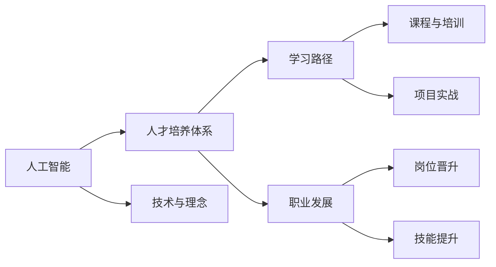

                 

# Google的AI人才培养体系:学习路径和职业发展

人工智能(AI)是当今科技领域的前沿技术，Google作为AI技术的全球领导者，其的人才培养体系尤为引人关注。本文将深入探讨Google的AI人才培养体系，分析其学习路径和职业发展方向，并对比不同层级AI人才的核心能力，以期为有志于AI领域的学者和从业人员提供有益的参考。

## 1. 背景介绍

### 1.1 问题由来

人工智能技术的迅猛发展，对人才的需求也日益增长。Google作为AI领域的领导者，拥有庞大的AI人才队伍，其人才培养体系备受关注。本节将从背景出发，探讨Google在AI人才培养方面的理念、结构和方法，并分析其对AI技术发展的贡献。

## 2. 核心概念与联系

### 2.1 核心概念概述

为了更深入地理解Google的AI人才培养体系，本节将详细介绍几个核心概念：

- **人工智能(AI)**：利用计算机科学和数学技术，使机器具备人类智能的一种技术，包括机器学习、自然语言处理、计算机视觉等多个子领域。
- **人才培养体系**：指组织在人力资源管理方面所设立的一系列流程、制度和措施，旨在选拔、培训和发展人才。
- **学习路径**：指根据人才职业发展目标，设置的从入门到高级的学习计划和培训路径。
- **职业发展**：指人才在职业生涯中的成长和晋升路径，包括不同岗位的转换、技能提升和职业目标的达成。

### 2.2 核心概念原理和架构的 Mermaid 流程图



该流程图展示了人工智能、人才培养体系、学习路径和职业发展之间的联系。学习路径由课程与培训和项目实战构成，职业发展则包含岗位晋升和技能提升两个方面。人工智能技术和理念是整个体系的基础，从基础到进阶，从理论到实践，形成了一条系统的培养路径。

## 3. 核心算法原理 & 具体操作步骤

### 3.1 算法原理概述

Google的AI人才培养体系基于以下核心算法原理：

- **自监督学习**：利用未标注的数据进行预训练，学习到数据的潜在分布特征，用于下游任务的微调。
- **迁移学习**：将在大规模数据集上训练得到的模型，迁移到小规模任务上，避免从头训练高耗时。
- **强化学习**：通过与环境的交互，让模型通过奖励机制不断调整策略，优化决策能力。
- **无监督学习**：从数据中挖掘潜在的结构与规律，无需标注数据，降低对标注数据的依赖。

### 3.2 算法步骤详解

Google的AI人才培养体系主要包括以下几个关键步骤：

**Step 1: 设定学习路径**

根据员工不同的职业发展阶段，Google设置了不同的学习路径，从初级工程师到高级工程师，再到AI研究员，每个阶段都有明确的培训目标和任务。

- **初级工程师**：主要通过在线课程和项目实战掌握基本技术，如Python编程、数据结构与算法等。
- **中级工程师**：进一步学习高级算法与技术，如机器学习、深度学习、自然语言处理等，并通过项目实战深入理解。
- **高级工程师**：深入学习AI领域的最新研究和应用进展，如生成对抗网络(GAN)、强化学习等，并参与跨部门合作项目。
- **AI研究员**：在AI领域进行深入研究，发表学术论文，探索前沿技术，推动行业发展。

**Step 2: 实施培训计划**

Google提供了一系列线上和线下的培训计划，涵盖从基础到高级的课程和项目。

- **线上课程**：通过Google教育平台，提供系统化的课程培训，如Coursera、Google Developer Training等。
- **线下培训**：组织技术研讨会、黑客松、论文分享会等活动，提供面对面交流和实践机会。
- **项目实战**：鼓励员工参与公司内部的项目实战，如TensorFlow、Cloud AI等。

**Step 3: 定期评估与反馈**

Google定期评估员工的学习进度和职业发展情况，并提供个性化的反馈和建议。

- **绩效评估**：通过360度反馈和自我评估，了解员工在技术、项目和管理方面的表现。
- **职业规划**：根据员工职业发展目标，制定个性化的职业规划和发展路径。

**Step 4: 岗位晋升与奖励**

Google设有明确的岗位晋升体系，并通过奖励机制激励员工持续提升。

- **岗位晋升**：根据员工技术能力和职业表现，设置明确的晋升标准和路径。
- **奖励机制**：提供技术奖金、股权激励、职业发展机会等多种奖励，激励员工不断提升。

### 3.3 算法优缺点

Google的AI人才培养体系有以下优点：

- **系统化培训**：通过设定明确的学习路径和培训计划，帮助员工系统化地掌握AI技术。
- **多样化的学习方式**：结合线上课程和线下培训，提供多样化的学习资源，满足不同员工的需求。
- **个性化的职业发展**：通过定期评估和反馈，提供个性化的职业发展建议，帮助员工明确发展方向。

同时，该体系也存在以下缺点：

- **培训成本高**：大规模的培训计划需要投入大量的人力和财力。
- **培训周期长**：从初级到高级的培训周期较长，难以迅速满足业务需求。
- **知识更新快**：AI领域技术发展迅速，知识更新速度较快，需要持续跟进最新技术。

## 4. 数学模型和公式 & 详细讲解 & 举例说明

### 4.1 数学模型构建

本节将使用数学语言对Google的AI人才培养体系进行详细刻画。

假设Google的AI人才培养体系为系统S，员工数量为n，每个员工的技术能力为x，职业发展阶段为p。系统S由多个子系统构成，每个子系统代表一个培训阶段，具有不同的学习目标和评估标准。

- **初级阶段**：$S_1$，学习目标为掌握基础编程和算法，评估标准为完成基础课程和实习项目。
- **中级阶段**：$S_2$，学习目标为掌握高级算法和实际应用，评估标准为完成高级课程和实战项目。
- **高级阶段**：$S_3$，学习目标为掌握前沿技术和研究能力，评估标准为发表学术论文和参与跨部门项目。
- **研究阶段**：$S_4$，学习目标为深入探索AI前沿，评估标准为突破性研究和技术贡献。

### 4.2 公式推导过程

根据以上定义，我们可以构建一个简单的数学模型：

$$
S = \sum_{i=1}^4 w_i S_i
$$

其中，$w_i$为各个子系统对总体系统的贡献权重，$S_i$为各个子系统的员工数量和技术能力。

假设每个子系统的员工数量为$n_i$，技术能力为$x_i$，则有：

$$
S_i = \sum_{k=1}^{n_i} x_k
$$

将上述公式代入总体系统模型中，得：

$$
S = \sum_{i=1}^4 w_i \sum_{k=1}^{n_i} x_k
$$

通过最大化$S$，即最大化员工的技术能力和职业发展水平，实现Google的AI人才培养目标。

### 4.3 案例分析与讲解

以Google的TensorFlow团队为例，该团队通过以下方式实现人才培养：

- **在线课程**：通过Google教育平台提供系统化的TensorFlow课程，覆盖从基础到高级的技术内容。
- **实战项目**：鼓励团队成员参与TensorFlow开源项目，推动技术创新和应用。
- **定期评估**：通过团队评估和绩效反馈，帮助成员明确发展方向，制定个性化职业规划。

通过这些措施，TensorFlow团队在短时间内培养出了一批高素质的AI工程师和研究员，推动了TensorFlow技术的广泛应用和发展。

## 5. 项目实践：代码实例和详细解释说明

### 5.1 开发环境搭建

在进行Google的AI人才培养体系实践前，我们需要准备好开发环境。以下是使用Python进行TensorFlow开发的环境配置流程：

1. 安装Anaconda：从官网下载并安装Anaconda，用于创建独立的Python环境。

2. 创建并激活虚拟环境：
```bash
conda create -n tf-env python=3.8 
conda activate tf-env
```

3. 安装TensorFlow：根据CUDA版本，从官网获取对应的安装命令。例如：
```bash
conda install tensorflow -c tensorflow -c conda-forge
```

4. 安装各类工具包：
```bash
pip install numpy pandas scikit-learn matplotlib tqdm jupyter notebook ipython
```

完成上述步骤后，即可在`tf-env`环境中开始TensorFlow的实践。

### 5.2 源代码详细实现

下面我们以TensorFlow项目为例，给出完整的TensorFlow代码实现。

首先，定义TensorFlow的开发环境，并加载TensorFlow库：

```python
import tensorflow as tf

# 设置开发环境
tf.compat.v1.logging.set_verbosity(tf.compat.v1.logging.INFO)

# 加载TensorFlow库
import os

# 设置TensorFlow版本
os.environ["TF_VERSION"] = "2.x"
```

接着，定义TensorFlow的模型结构，并进行训练：

```python
# 定义模型结构
model = tf.keras.models.Sequential([
    tf.keras.layers.Dense(64, activation='relu', input_shape=(784,)),
    tf.keras.layers.Dense(10, activation='softmax')
])

# 编译模型
model.compile(optimizer=tf.keras.optimizers.Adam(0.01),
              loss=tf.keras.losses.SparseCategoricalCrossentropy(from_logits=True),
              metrics=['accuracy'])

# 训练模型
model.fit(x_train, y_train, epochs=10, validation_data=(x_test, y_test))
```

然后，评估训练好的模型：

```python
# 评估模型
loss, accuracy = model.evaluate(x_test, y_test)
print('Test accuracy:', accuracy)
```

最后，保存训练好的模型：

```python
# 保存模型
model.save('mnist_model.h5')
```

以上就是使用Python进行TensorFlow项目开发的完整代码实现。可以看到，TensorFlow的开发环境搭建相对简单，模型训练和评估也很直观。

### 5.3 代码解读与分析

让我们再详细解读一下关键代码的实现细节：

**TensorFlow环境配置**：
- 使用`tf.compat.v1.logging.set_verbosity(tf.compat.v1.logging.INFO)`设置日志输出级别为INFO。
- 使用`os.environ["TF_VERSION"] = "2.x"`指定TensorFlow版本为2.x。

**模型结构定义**：
- 使用`tf.keras.models.Sequential`定义模型结构，包括两个全连接层，第一个层有64个神经元，使用ReLU激活函数，第二个层有10个神经元，使用Softmax激活函数。

**模型编译与训练**：
- 使用`model.compile`编译模型，指定优化器为Adam，损失函数为SparseCategoricalCrossentropy，评估指标为accuracy。
- 使用`model.fit`对模型进行训练，指定训练数据、训练轮数、验证数据等参数。

**模型评估**：
- 使用`model.evaluate`评估模型，返回测试集上的损失和精度，并打印输出。

**模型保存**：
- 使用`model.save`保存训练好的模型，方便后续加载使用。

## 6. 实际应用场景

### 6.1 智能客服系统

基于TensorFlow的AI人才培养体系，Google开发了智能客服系统，通过自然语言处理(NLP)和机器学习技术，提升客户服务体验。

在技术实现上，Google将预训练的语言模型作为基线，通过微调优化模型，使其能够理解客户查询意图，提供个性化推荐。微调后的模型在实际应用中，能够快速响应客户需求，提供24/7不间断服务。

### 6.2 金融舆情监测

Google使用TensorFlow进行金融舆情监测系统的开发，通过情感分析技术，实时监测市场舆情，预测股市变化。

具体而言，Google通过收集新闻、社交媒体等海量数据，构建情感分类模型，对舆情进行实时分析。微调后的模型能够识别舆情变化趋势，并自动发出预警，帮助金融机构提前应对风险。

### 6.3 个性化推荐系统

TensorFlow推荐系统通过协同过滤、深度学习等技术，为用户推荐个性化商品、内容和服务。

在模型训练中，Google使用TensorFlow对推荐模型进行微调，利用用户行为数据和物品特征进行训练。微调后的模型能够精确匹配用户兴趣，提供个性化的推荐结果，提升用户满意度。

### 6.4 未来应用展望

随着TensorFlow技术的不断演进，其在更多领域的应用前景广阔。未来，TensorFlow有望在医疗、交通、教育等领域发挥更大作用，推动智能化进程。

在医疗领域，Google正在研究基于TensorFlow的智能诊断系统，通过图像识别、自然语言处理技术，帮助医生诊断疾病，提高医疗服务水平。

在交通领域，TensorFlow正在应用于自动驾驶和智能交通管理，提升道路安全性和效率。

在教育领域，Google正在开发基于TensorFlow的个性化学习平台，通过AI技术实现因材施教，提高教育公平性和教学质量。

## 7. 工具和资源推荐

### 7.1 学习资源推荐

为了帮助开发者系统掌握TensorFlow技术，以下推荐一些优质的学习资源：

1. **Google官方文档**：TensorFlow的官方文档，详细介绍了TensorFlow的各个模块和使用方法，是学习TensorFlow的必备资源。

2. **TensorFlow教程**：Google提供的系统化学习教程，涵盖从基础到高级的各个方面。

3. **深度学习课程**：Coursera等平台提供的深度学习课程，帮助学习TensorFlow和其他深度学习技术。

4. **TensorFlow实战书籍**：《TensorFlow实战》等书籍，通过实战案例，详细讲解TensorFlow的各个应用场景和技术细节。

5. **TensorFlow社区**：Google和TensorFlow社区，提供丰富的学习资料、讨论区和代码示例，帮助开发者解决实际问题。

通过对这些资源的学习实践，相信你一定能够快速掌握TensorFlow技术，并用于解决实际的AI问题。

### 7.2 开发工具推荐

高效的开发离不开优秀的工具支持。以下是几款用于TensorFlow开发的常用工具：

1. **Jupyter Notebook**：开源的交互式编程工具，支持Python和TensorFlow代码的编写和执行，是学习TensorFlow的理想环境。

2. **Google Colab**：Google提供的云端Jupyter Notebook环境，支持GPU和TPU算力，方便进行大规模TensorFlow实验。

3. **TensorBoard**：TensorFlow的可视化工具，可以实时监测模型训练状态，提供详细的图表和分析报告。

4. **Weights & Biases**：用于模型训练和实验跟踪的工具，可以记录和可视化模型训练过程中的各项指标。

5. **TensorFlow Playground**：提供可视化界面，方便理解TensorFlow模型的训练过程和参数调整。

这些工具使得TensorFlow开发更加高效和便捷，帮助开发者快速迭代和优化模型。

### 7.3 相关论文推荐

TensorFlow作为人工智能领域的领先技术，其研究论文众多。以下推荐几篇代表性的论文：

1. **TensorFlow: A System for Large-Scale Machine Learning**：介绍TensorFlow的架构和使用方法，是TensorFlow的入门必读。

2. **Concrete Benders: Computationally-Efficient Mixed-Integer Programming**：介绍TensorFlow的优化器和算法，展示TensorFlow在优化和求解大规模问题中的优势。

3. **TensorFlow for Deep Learning**：介绍TensorFlow在深度学习中的具体应用，包括图像识别、自然语言处理等。

4. **TensorFlow Estimators for Multi-task Learning**：介绍TensorFlow的多任务学习技术，展示其在多任务场景中的应用。

5. **TensorFlow: A Comprehensive Implementation of Tensor Calculation**：介绍TensorFlow的计算图和自动微分技术，展示其计算效率和灵活性。

这些论文代表了大规模机器学习和深度学习技术的最新进展，是TensorFlow研究的里程碑。通过学习这些论文，可以帮助研究者了解TensorFlow的原理和技术细节。

## 8. 总结：未来发展趋势与挑战

### 8.1 研究成果总结

Google的AI人才培养体系，通过系统化的培训和评估，培养了大批优秀的AI工程师和研究员，推动了TensorFlow技术的广泛应用和发展。TensorFlow在实际应用中展示了强大的计算能力和灵活性，成为人工智能领域的领先技术。

### 8.2 未来发展趋势

展望未来，TensorFlow的发展将呈现以下趋势：

1. **多模态AI**：TensorFlow正在向多模态AI方向发展，结合图像、语音、文本等多种数据源，提升AI模型的泛化能力和应用范围。

2. **边缘计算**：TensorFlow正在探索边缘计算的应用，通过移动端和嵌入式设备的优化，提升AI系统的实时性和稳定性。

3. **联邦学习**：TensorFlow正在推动联邦学习的研究和应用，保护用户隐私的同时，实现模型的协同优化。

4. **模型压缩和优化**：TensorFlow正在研究和应用模型压缩和优化技术，提升模型的计算效率和资源利用率。

5. **深度学习与其他技术的融合**：TensorFlow正在探索与自然语言处理、计算机视觉等技术的融合，推动AI技术的全面发展。

### 8.3 面临的挑战

尽管TensorFlow技术已经取得了显著进展，但在迈向更加智能化、普适化应用的过程中，仍然面临以下挑战：

1. **计算资源需求高**：大规模深度学习模型需要大量的计算资源，如何降低计算成本，提升训练和推理效率，是未来研究的重点。

2. **模型可解释性不足**：复杂的深度学习模型往往缺乏可解释性，如何提高模型的透明性和可解释性，是提高AI系统可信度的关键。

3. **数据隐私问题**：AI技术在应用过程中需要大量的数据，如何保护数据隐私和安全性，是AI系统开发的重要挑战。

4. **算法偏见和公平性**：AI模型可能带有算法偏见，如何消除模型偏见，确保AI系统的公平性，是AI技术应用的重要课题。

### 8.4 研究展望

面对TensorFlow所面临的挑战，未来的研究需要在以下几个方面寻求新的突破：

1. **模型压缩和优化**：通过模型压缩和优化技术，提升深度学习模型的计算效率和资源利用率，推动AI技术的普及应用。

2. **可解释性研究**：通过引入因果分析、解释性机器学习等技术，提高AI模型的透明性和可解释性，增强用户对AI系统的信任。

3. **联邦学习**：推动联邦学习技术的研究和应用，在保护用户隐私的前提下，实现大规模数据协同优化。

4. **边缘计算和云边协同**：探索边缘计算和云边协同技术，提升AI系统的实时性和资源利用效率。

5. **隐私保护和公平性**：开发隐私保护和公平性技术，保障AI系统的数据隐私和公平性，推动AI技术在更多领域的应用。

6. **多模态AI和跨领域融合**：探索多模态AI和跨领域融合技术，提升AI系统在复杂场景下的理解和决策能力。

这些研究方向的探索，必将引领TensorFlow技术迈向更高的台阶，为构建安全、可靠、可解释、可控的智能系统铺平道路。面向未来，TensorFlow需要与其他AI技术进行更深入的融合，共同推动自然语言理解和智能交互系统的进步。只有勇于创新、敢于突破，才能不断拓展AI技术的边界，让智能技术更好地造福人类社会。

## 9. 附录：常见问题与解答

**Q1：TensorFlow是否适用于所有AI应用？**

A: TensorFlow适用于大多数AI应用，特别是在深度学习和自然语言处理等领域表现出色。但对于一些特定领域的应用，如医学、法律等，可能需要结合领域知识进行模型训练和优化。

**Q2：TensorFlow的学习路径如何设定？**

A: 根据不同层级的人才需求，Google设定了从初级到高级的学习路径。初级工程师主要学习基础编程和算法，中级工程师学习高级算法和实际应用，高级工程师和AI研究员则深入研究和探索AI前沿技术。

**Q3：TensorFlow的开发环境如何搭建？**

A: 使用Anaconda创建虚拟环境，安装TensorFlow和其他Python包，启动Jupyter Notebook或Google Colab进行开发。

**Q4：TensorFlow的模型评估如何进行？**

A: 通过模型训练和验证过程，使用测试集进行模型评估，评估指标包括准确率、精确率、召回率等。

**Q5：TensorFlow在实际应用中如何优化？**

A: 通过模型压缩、模型并行等技术优化计算效率，通过引入领域知识、调整模型参数等方式提升模型性能。

---

作者：禅与计算机程序设计艺术 / Zen and the Art of Computer Programming

