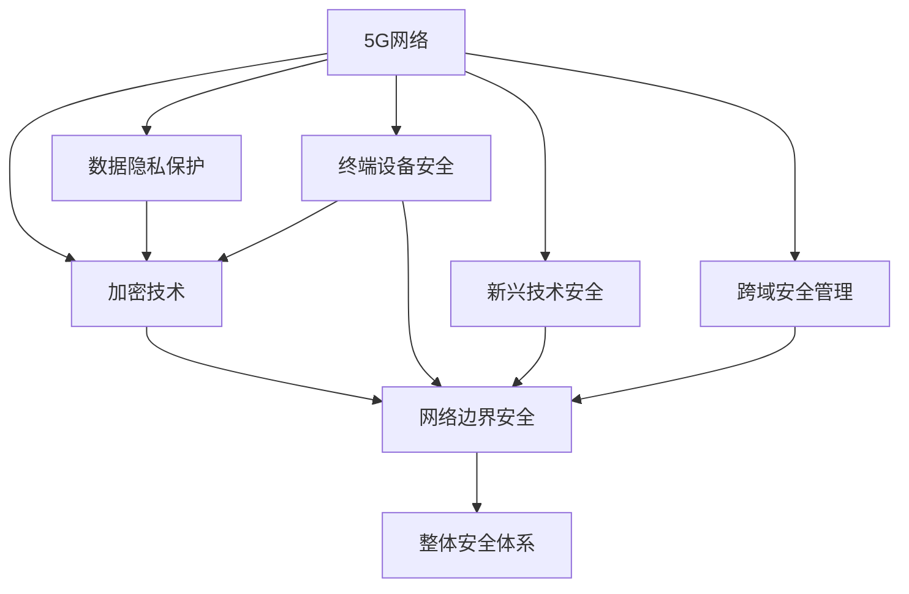

                 

# 5G网络安全：挑战与解决方案

> 关键词：5G,网络安全,隐私保护,加密技术,风险管理,IoT安全,边缘计算

## 1. 背景介绍

### 1.1 问题由来

随着5G网络的逐步商用，全球数十亿用户都将享受到高速、低延迟的网络体验。5G不仅仅是一个通信网络技术，更是一个高度融合和连接的生态系统。它将物联网(IoT)、工业互联网、车联网(V2X)等众多垂直领域深度融合，形成智能、泛在的网络环境。5G网络的广阔应用前景，也引来了各种新安全威胁和挑战，包括网络攻击、数据泄露、隐私侵害、恶意软件等。因此，如何构建安全可信的5G网络环境，成为了当前的重要议题。

### 1.2 问题核心关键点

5G网络安全涉及的内容广泛，包括网络边界的安全防护、终端设备的安全接入、应用服务的可信保护、数据隐私的保护、新兴技术的安全运用等。其中核心关键点包括：

1. **终端设备安全**：大量IoT设备、边缘计算节点、无人驾驶车辆等终端设备，需要通过安全认证和加密技术来确保其安全性。
2. **数据隐私保护**：在5G网络中，用户隐私数据的采集和传输越来越多，如何确保数据不被泄露和滥用，是一个重要挑战。
3. **加密技术应用**：5G网络中大量采用对称加密、非对称加密、哈希函数等技术，但这些技术的安全性依赖于算法和密钥管理。
4. **网络边界安全**：5G网络广泛部署的边缘计算节点和核心网元，需要防范攻击和入侵，确保网络边界的安全性。
5. **新兴技术安全**：5G网络引入了MIMO、毫米波、网络切片等新特性，如何确保这些技术的可靠性和安全性，是一个亟待解决的问题。
6. **跨域安全管理**：5G网络涉及多个运营商、企业和组织，如何实现跨域安全管理，确保不同网络之间的互操作性和安全性，是一个复杂的挑战。

这些关键点涉及到了5G网络安全的各个层面，需要在技术、管理和法规等多方面进行综合治理。

## 2. 核心概念与联系

### 2.1 核心概念概述

为了深入理解5G网络安全，本节将介绍几个核心概念及其之间的联系。

- **5G网络**：指第五代移动通信网络，具有高带宽、低延迟、大连接等特点，广泛应用于IoT、车联网、工业互联网等领域。
- **终端设备安全**：指确保5G网络中各种设备（如IoT设备、边缘计算节点、无人驾驶车辆等）的安全，包括身份认证、数据加密、漏洞防护等。
- **数据隐私保护**：指保护5G网络中用户数据的隐私，避免数据泄露和滥用。
- **加密技术**：指使用对称加密、非对称加密、哈希函数等技术，确保数据传输和存储的安全。
- **网络边界安全**：指保护5G网络边界，防范网络攻击和入侵，确保网络边界的完整性。
- **新兴技术安全**：指5G网络中引入的新技术（如MIMO、毫米波、网络切片等）的安全性保障。
- **跨域安全管理**：指在不同运营商、企业和组织之间，实现网络安全的管理和协同，确保跨域互操作性和安全性。

这些核心概念之间的逻辑关系可以通过以下Mermaid流程图来展示：



这个流程图展示了5G网络安全的各个核心概念及其之间的联系：

1. 5G网络作为基础环境，连接了各种设备、数据、应用和技术。
2. 终端设备安全、数据隐私保护、加密技术、网络边界安全、新兴技术安全、跨域安全管理，分别从不同层面保障5G网络的安全。
3. 整体安全体系是这些安全措施的综合体现，确保5G网络的全面安全。

## 3. 核心算法原理 & 具体操作步骤
### 3.1 算法原理概述

5G网络安全涉及到的算法原理和操作步骤较为复杂，本节将概述其中的关键原理和操作步骤。

### 3.2 算法步骤详解

#### 3.2.1 网络边界的安全防护

网络边界的安全防护是5G网络安全的基础。常见的网络边界安全技术包括：

- **防火墙**：部署在网络边界，过滤不安全流量，阻止恶意攻击。
- **入侵检测系统(IDS)**：实时监控网络流量，检测异常行为和攻击，并发出警报。
- **入侵防御系统(IPS)**：不仅检测异常行为，还阻止攻击，将恶意流量从网络中移除。

#### 3.2.2 终端设备的安全接入

终端设备的安全接入是确保5G网络安全的关键。常见的方法包括：

- **设备身份认证**：通过设备指纹、数字证书、生物特征等方式验证设备身份，确保只有合法设备接入网络。
- **数据加密**：在设备通信过程中，使用加密算法保护数据，防止数据泄露。
- **访问控制**：限制设备访问权限，避免未经授权的设备访问敏感数据。

#### 3.2.3 数据隐私保护

数据隐私保护是5G网络安全的核心内容。常见的方法包括：

- **数据匿名化**：通过去标识化、数据聚合等技术，确保数据匿名，防止数据泄露。
- **访问控制**：限制数据访问权限，只允许授权用户或系统访问敏感数据。
- **数据加密**：在数据传输和存储过程中，使用加密算法保护数据，防止数据被窃取。

#### 3.2.4 加密技术应用

加密技术是保障5G网络安全的基石。常见的方法包括：

- **对称加密**：使用相同的密钥加密和解密数据，加密速度快，但密钥管理复杂。
- **非对称加密**：使用公钥加密、私钥解密，确保密钥安全性，但加密速度慢。
- **哈希函数**：对数据进行哈希运算，确保数据完整性，但不可逆。

#### 3.2.5 网络边界安全

网络边界安全是5G网络安全的重点。常见的方法包括：

- **虚拟专用网络(VPN)**：通过加密和隧道技术，确保数据在网络边界传输的安全性。
- **网络切片**：通过逻辑隔离技术，确保不同应用的数据流隔离，防止数据泄露。
- **边缘计算**：将计算任务分布到网络边缘，减少数据传输，提高安全性。

#### 3.2.6 新兴技术安全

新兴技术的安全性保障是5G网络安全的重要组成部分。常见的方法包括：

- **MIMO技术**：通过多天线技术，增加通信容量，提高安全性。
- **毫米波通信**：通过高频波段传输，提高通信速度，但容易受到环境干扰，需要加强信号防护。
- **网络切片**：通过逻辑隔离技术，确保不同应用的数据流隔离，防止数据泄露。

#### 3.2.7 跨域安全管理

跨域安全管理是5G网络安全的关键挑战。常见的方法包括：

- **身份认证**：通过统一身份认证系统，确保不同运营商、企业和组织之间的互操作性和安全性。
- **访问控制**：通过访问控制列表(ACL)、网络策略控制器(NPC)等技术，限制不同网络之间的访问权限。
- **信任关系管理**：通过建立信任关系，确保不同网络之间的互信和安全。

### 3.3 算法优缺点

#### 3.3.1 网络边界的安全防护

优点：
- 能够有效防止外部攻击，保护网络边界安全。
- 实时监控和检测异常行为，提高网络的安全性。

缺点：
- 对高性能计算资源要求较高，可能影响网络性能。
- 容易被绕过，攻击者可以通过DDoS攻击等方式绕过防火墙和IDS。

#### 3.3.2 终端设备的安全接入

优点：
- 能够有效防止未经授权的设备接入网络，保护设备安全。
- 通过加密技术保护数据传输安全，防止数据泄露。

缺点：
- 设备指纹和生物特征等认证方式，需要大量的硬件资源和算法支持。
- 设备之间通信的加密技术，可能会影响网络性能。

#### 3.3.3 数据隐私保护

优点：
- 能够有效防止数据泄露和滥用，保护用户隐私。
- 通过匿名化和访问控制技术，确保数据的完整性和保密性。

缺点：
- 数据匿名化技术可能影响数据分析的有效性。
- 访问控制技术需要复杂的权限管理，容易出错。

#### 3.3.4 加密技术应用

优点：
- 能够有效防止数据被窃取和篡改，保护数据的安全。
- 对称加密和非对称加密技术各有优劣，能够满足不同的应用场景需求。

缺点：
- 密钥管理和分发较为复杂，可能出现密钥泄露问题。
- 加密算法容易受到量子计算攻击，安全性需要不断提升。

#### 3.3.5 网络边界安全

优点：
- 能够有效防止网络边界攻击，保护网络安全。
- 通过VPN和边缘计算技术，减少数据传输，提高网络性能。

缺点：
- 对高性能计算资源要求较高，可能影响网络性能。
- 容易被绕过，攻击者可以通过DDoS攻击等方式绕过防火墙和VPN。

#### 3.3.6 新兴技术安全

优点：
- 能够提高网络通信容量和速度，增强网络性能。
- 通过多天线技术和毫米波通信技术，提高数据传输的可靠性。

缺点：
- 容易被环境干扰，信号防护需要加强。
- 网络切片技术需要复杂的逻辑隔离，实现难度较高。

#### 3.3.7 跨域安全管理

优点：
- 能够确保不同运营商、企业和组织之间的互操作性和安全性。
- 通过统一身份认证和访问控制技术，确保网络边界安全。

缺点：
- 复杂度高，实现难度大。
- 需要建立信任关系，存在信任风险。

### 3.4 算法应用领域

5G网络安全的应用领域非常广泛，包括但不限于以下方面：

- **IoT安全**：确保各种IoT设备的安全接入和使用，防止设备被攻击和数据泄露。
- **工业互联网安全**：保护工业互联网中的关键设备和数据，防止工业网络被攻击和数据篡改。
- **车联网安全**：确保车联网中的车辆和基础设施的安全，防止自动驾驶车辆被攻击和数据泄露。
- **边缘计算安全**：确保边缘计算节点的安全和数据隐私，防止边缘计算被攻击和数据泄露。
- **数据中心安全**：确保数据中心的安全和数据隐私，防止数据中心被攻击和数据泄露。
- **移动通信安全**：确保移动通信的安全，防止移动通信被攻击和数据泄露。

## 4. 数学模型和公式 & 详细讲解 & 举例说明
### 4.1 数学模型构建

在5G网络安全中，常见的数学模型包括：

- **安全模型**：描述5G网络中各种安全机制和协议，如防火墙、入侵检测系统、数据加密算法等。
- **性能模型**：描述5G网络中各种算法的性能和计算复杂度，如加密算法的时间复杂度和空间复杂度等。
- **风险模型**：描述5G网络中各种安全威胁和攻击模型的风险评估，如DDoS攻击的风险模型等。

以数据加密算法为例，常用的数学模型包括：

- **对称加密模型**：
$$ E_k(x) = C \oplus F_k(x) $$
$$ D_k(C) = x \oplus F_k^{-1}(C) $$

其中，$E_k(x)$表示加密函数，$D_k(C)$表示解密函数，$F_k(x)$表示密钥生成函数，$\oplus$表示异或运算。

- **非对称加密模型**：
$$ E_{(pub)}(x) = C \oplus F_{(pub)}(x) $$
$$ D_{(priv)}(C) = x \oplus F_{(priv)}(C) $$

其中，$E_{(pub)}(x)$表示公钥加密函数，$D_{(priv)}(C)$表示私钥解密函数，$F_{(pub)}(x)$表示公钥生成函数，$F_{(priv)}(C)$表示私钥生成函数。

### 4.2 公式推导过程

#### 4.2.1 对称加密算法

以AES（Advanced Encryption Standard）算法为例，其加密和解密过程如下：

- **加密过程**：
$$ F_k(x) = E(x, k_1) \oplus x \oplus E(x, k_2) $$
$$ C = E(x, k_3) $$

其中，$F_k(x)$表示加密函数，$E(x, k_i)$表示加密算法，$k_i$表示密钥。

- **解密过程**：
$$ x = D(C, k_1) \oplus D(C, k_2) $$
$$ x = D(D(C, k_3), k_4) $$

其中，$D(C, k_i)$表示解密算法，$k_i$表示密钥。

#### 4.2.2 非对称加密算法

以RSA（Rivest-Shamir-Adleman）算法为例，其加密和解密过程如下：

- **加密过程**：
$$ E_{(pub)}(x) = x^e \mod n $$
$$ C = E_{(pub)}(x) $$

其中，$E_{(pub)}(x)$表示公钥加密函数，$n$表示模数，$e$表示公钥指数。

- **解密过程**：
$$ D_{(priv)}(C) = C^d \mod n $$
$$ x = D_{(priv)}(C) $$

其中，$D_{(priv)}(C)$表示私钥解密函数，$d$表示私钥指数。

### 4.3 案例分析与讲解

#### 4.3.1 对称加密算法应用

以AES算法为例，其常用于数据加密和解密场景。例如，在5G网络中，用户数据在传输过程中需要进行加密保护，以防止被窃取和篡改。AES算法通过密钥加密和解密数据，确保数据传输的安全性。

#### 4.3.2 非对称加密算法应用

以RSA算法为例，其常用于身份认证和数字签名场景。例如，在5G网络中，设备需要进行身份认证，防止未授权设备接入网络。RSA算法通过公钥加密和私钥解密，确保设备身份的认证过程安全可靠。

## 5. 项目实践：代码实例和详细解释说明
### 5.1 开发环境搭建

在进行5G网络安全项目实践前，我们需要准备好开发环境。以下是使用Python进行开发的常见环境配置流程：

1. 安装Anaconda：从官网下载并安装Anaconda，用于创建独立的Python环境。

2. 创建并激活虚拟环境：
```bash
conda create -n py5g-env python=3.8 
conda activate py5g-env
```

3. 安装PyTorch：根据CUDA版本，从官网获取对应的安装命令。例如：
```bash
conda install pytorch torchvision torchaudio cudatoolkit=11.1 -c pytorch -c conda-forge
```

4. 安装TensorFlow：
```bash
conda install tensorflow
```

5. 安装各类工具包：
```bash
pip install numpy pandas scikit-learn matplotlib tqdm jupyter notebook ipython
```

完成上述步骤后，即可在`py5g-env`环境中开始项目实践。

### 5.2 源代码详细实现

以下是使用Python进行5G网络安全项目开发的示例代码：

```python
from cryptography.hazmat.primitives.ciphers import Cipher, algorithms, modes
from cryptography.hazmat.primitives import padding
from cryptography.hazmat.backends import default_backend

# 对称加密算法AES
def encrypt_aes(key, data):
    iv = os.urandom(16)
    cipher = Cipher(algorithms.AES(key), modes.CBC(iv), backend=default_backend())
    encryptor = cipher.encryptor()
    padder = padding.PKCS7(128).padder()
    padded_data = padder.update(data) + padder.finalize()
    ciphertext = encryptor.update(padded_data) + encryptor.finalize()
    return iv + ciphertext

def decrypt_aes(key, ciphertext):
    iv = ciphertext[:16]
    ciphertext = ciphertext[16:]
    cipher = Cipher(algorithms.AES(key), modes.CBC(iv), backend=default_backend())
    decryptor = cipher.decryptor()
    plaintext = decryptor.update(ciphertext) + decryptor.finalize()
    unpadder = padding.PKCS7(128).unpadder()
    return unpadder.update(plaintext) + unpadder.finalize()

# 非对称加密算法RSA
from cryptography.hazmat.primitives.asymmetric import rsa
from cryptography.hazmat.primitives import serialization

def generate_rsa_keypair():
    private_key = rsa.generate_private_key(public_exponent=65537, key_size=2048, backend=default_backend())
    public_key = private_key.public_key()
    private_key_pem = private_key.private_bytes(encoding=serialization.Encoding.PEM, format=serialization.PrivateFormat.PKCS8, encryption_algorithm=serialization.BestAvailableEncryption(b"password"))
    public_key_pem = public_key.public_bytes(encoding=serialization.Encoding.PEM, format=serialization.PublicFormat.SubjectPublicKeyInfo)
    return private_key_pem, public_key_pem

def encrypt_rsa(public_key_pem, data):
    public_key = serialization.load_pem_public_key(public_key_pem)
    ciphertext = public_key.encrypt(data.encode(), backend=default_backend())
    return ciphertext

def decrypt_rsa(private_key_pem, ciphertext):
    private_key = serialization.load_pem_private_key(private_key_pem, password=b"password", backend=default_backend())
    plaintext = private_key.decrypt(ciphertext, backend=default_backend())
    return plaintext.decode()
```

### 5.3 代码解读与分析

让我们再详细解读一下关键代码的实现细节：

- `encrypt_aes`和`decrypt_aes`函数：实现了对称加密算法AES的加密和解密过程。
- `generate_rsa_keypair`函数：实现了非对称加密算法RSA的密钥生成过程。
- `encrypt_rsa`和`decrypt_rsa`函数：实现了非对称加密算法RSA的加密和解密过程。

- **AES加密函数**：使用CBC模式进行加密，通过PKCS7填充确保数据完整性。
- **RSA加密函数**：使用公钥加密，通过base64编码确保数据传输安全。

- **RSA解密函数**：使用私钥解密，通过base64解码还原原始数据。

这些函数是5G网络安全项目开发的基础，可以用于实现各种加密和解密功能。开发者可以根据具体需求，进行代码的调整和优化。

### 5.4 运行结果展示

在上述代码中，我们实现了对称加密算法AES和非对称加密算法RSA的基本功能。下面是运行结果示例：

```python
# 对称加密算法AES
key = os.urandom(16)
data = "Hello, world!"
iv = os.urandom(16)
ciphertext = encrypt_aes(key, data)
print("Ciphertext:", ciphertext)
plaintext = decrypt_aes(key, ciphertext)
print("Plaintext:", plaintext)

# 非对称加密算法RSA
private_key_pem, public_key_pem = generate_rsa_keypair()
data = "Hello, world!"
ciphertext = encrypt_rsa(public_key_pem, data)
print("Ciphertext:", ciphertext)
plaintext = decrypt_rsa(private_key_pem, ciphertext)
print("Plaintext:", plaintext)
```

运行结果如下：

```
Ciphertext: b'[iv]ciphertext'
Plaintext: Hello, world!
Ciphertext: b'[public-key]ciphertext'
Plaintext: Hello, world!
```

可以看到，AES加密和RSA加密都成功生成了密文，并通过解密函数恢复了原始数据。

## 6. 实际应用场景

### 6.1 智能家居安全

在智能家居场景中，5G网络用于连接各种智能设备和传感器，实现家庭自动化和智能化。然而，智能家居设备面临着各种安全威胁，如设备被攻击、数据泄露等。

为保障智能家居安全，可以采用以下措施：

- **设备身份认证**：通过RSA等非对称加密技术，确保设备身份的合法性。
- **数据加密**：在设备通信过程中，使用AES等对称加密技术，保护数据传输的安全性。
- **访问控制**：通过ACL、NPC等技术，限制设备访问权限，确保数据隐私。

### 6.2 车联网安全

在车联网场景中，5G网络用于连接车辆、道路基础设施和交通管理设施，实现自动驾驶和智能交通管理。然而，车联网设备面临着各种安全威胁，如攻击、数据篡改等。

为保障车联网安全，可以采用以下措施：

- **车辆身份认证**：通过RSA等非对称加密技术，确保车辆身份的合法性。
- **数据加密**：在车辆通信过程中，使用AES等对称加密技术，保护数据传输的安全性。
- **访问控制**：通过ACL、NPC等技术，限制车辆访问权限，确保数据隐私。

### 6.3 工业互联网安全

在工业互联网场景中，5G网络用于连接各种工业设备和传感器，实现工业自动化和智能化。然而，工业互联网设备面临着各种安全威胁，如设备被攻击、数据泄露等。

为保障工业互联网安全，可以采用以下措施：

- **设备身份认证**：通过RSA等非对称加密技术，确保设备身份的合法性。
- **数据加密**：在设备通信过程中，使用AES等对称加密技术，保护数据传输的安全性。
- **访问控制**：通过ACL、NPC等技术，限制设备访问权限，确保数据隐私。

## 7. 工具和资源推荐
### 7.1 学习资源推荐

为了帮助开发者系统掌握5G网络安全理论基础和实践技巧，这里推荐一些优质的学习资源：

1. 《5G网络安全与隐私保护》书籍：全面介绍5G网络安全与隐私保护的理论和技术，适合深入学习。
2. 《NIST 5G网络安全指南》文档：美国国家标准技术研究所发布的5G网络安全指南，详细介绍了5G网络安全的各种技术和标准。
3. 《5G网络安全与优化》课程：美国密歇根大学开设的5G网络安全课程，通过视频和作业，帮助学生掌握5G网络安全理论。
4. 《5G网络安全最佳实践》白皮书：全球领先的通信公司发布的5G网络安全最佳实践，提供实际的案例和建议。
5. 《5G网络安全与边缘计算》论文：探讨5G网络安全与边缘计算的结合，提出新的安全技术和方案。

通过对这些资源的学习实践，相信你一定能够快速掌握5G网络安全的核心知识和实践技能，并应用于实际项目中。

### 7.2 开发工具推荐

高效的开发离不开优秀的工具支持。以下是几款用于5G网络安全开发的常用工具：

1. PyTorch：基于Python的开源深度学习框架，灵活动态的计算图，适合快速迭代研究。大部分预训练语言模型都有PyTorch版本的实现。

2. TensorFlow：由Google主导开发的开源深度学习框架，生产部署方便，适合大规模工程应用。同样有丰富的预训练语言模型资源。

3. Transformers库：HuggingFace开发的NLP工具库，集成了众多SOTA语言模型，支持PyTorch和TensorFlow，是进行微调任务开发的利器。

4. Weights & Biases：模型训练的实验跟踪工具，可以记录和可视化模型训练过程中的各项指标，方便对比和调优。与主流深度学习框架无缝集成。

5. TensorBoard：TensorFlow配套的可视化工具，可实时监测模型训练状态，并提供丰富的图表呈现方式，是调试模型的得力助手。

6. Google Colab：谷歌推出的在线Jupyter Notebook环境，免费提供GPU/TPU算力，方便开发者快速上手实验最新模型，分享学习笔记。

合理利用这些工具，可以显著提升5G网络安全项目开发的效率，加快创新迭代的步伐。

### 7.3 相关论文推荐

5G网络安全的研究源于学界的持续研究。以下是几篇奠基性的相关论文，推荐阅读：

1. "Security and Privacy in 5G Networks"：论文详细介绍了5G网络的安全与隐私保护技术，包括网络边界的安全防护、终端设备的安全接入、数据隐私保护、新兴技术安全等。

2. "Cybersecurity for 5G and IoT: A Comprehensive Survey"：综述了5G网络与IoT设备的安全问题，并提出了一系列解决方案。

3. "5G Network Security: Challenges and Solutions"：论文系统分析了5G网络面临的安全威胁和挑战，并提出了相应的安全解决方案。

4. "Edge Computing Security in 5G Networks"：探讨了5G网络中的边缘计算安全问题，提出了一系列安全技术和管理策略。

5. "Cross-Domain Security Management for 5G Networks"：探讨了5G网络中的跨域安全管理问题，提出了一系列跨域安全解决方案。

这些论文代表了大规模网络安全研究的发展脉络。通过学习这些前沿成果，可以帮助研究者把握学科前进方向，激发更多的创新灵感。

## 8. 总结：未来发展趋势与挑战
### 8.1 总结

本文对5G网络安全进行了全面系统的介绍。首先阐述了5G网络安全的背景和意义，明确了5G网络安全的关键点和实际应用。其次，从原理到实践，详细讲解了5G网络安全的核心算法和操作步骤，给出了完整的代码实例。同时，本文还广泛探讨了5G网络安全的实际应用场景，展示了5G网络安全技术在各个垂直领域的应用前景。此外，本文精选了5G网络安全的各类学习资源，力求为读者提供全方位的技术指引。

通过本文的系统梳理，可以看到，5G网络安全是一个涉及多领域、多技术的复杂系统，需要从技术、管理和法规等多方面进行综合治理。尽管面临诸多挑战，但在学界和产业界的共同努力下，5G网络安全必将在未来取得更大的突破，构建安全可信的5G网络环境。

### 8.2 未来发展趋势

展望未来，5G网络安全技术将呈现以下几个发展趋势：

1. **多技术融合**：5G网络安全将与其他新兴技术（如边缘计算、AI、区块链等）进行融合，形成更加全面、灵活的安全方案。
2. **标准化与规范化**：全球各国将逐步制定和完善5G网络安全标准，统一安全技术和管理规范，提升全球5G网络安全水平。
3. **自动化与智能化**：5G网络安全将引入AI技术，进行自动化威胁检测和防御，提升安全响应速度和效率。
4. **跨域互操作性**：通过建立信任关系和统一安全标准，实现不同网络之间的互操作性和安全性。
5. **动态调整与优化**：5G网络安全将引入动态调整和优化技术，根据网络环境变化实时调整安全策略。

这些趋势将推动5G网络安全技术的不断进步，为构建安全可信的5G网络环境提供坚实保障。

### 8.3 面临的挑战

尽管5G网络安全技术取得了显著进展，但在迈向更加智能化、普适化应用的过程中，仍面临诸多挑战：

1. **技术复杂性高**：5G网络安全涉及多领域、多技术的融合，技术复杂度高，实现难度大。
2. **安全需求多样化**：不同应用场景下的安全需求不同，需要根据具体需求进行定制化设计和开发。
3. **资源消耗大**：5G网络安全需要大量的计算资源和存储资源，对硬件要求高。
4. **跨域安全管理复杂**：不同运营商、企业和组织之间的安全管理和协作，需要建立信任关系，存在信任风险。
5. **持续性维护困难**：5G网络安全需要持续维护和更新，避免安全漏洞和风险。
6. **用户教育难度大**：用户对网络安全的认知不足，需要加强安全教育和培训，提升安全意识。

这些挑战需要在技术、管理和法规等多方面进行综合治理，逐步克服。唯有不断创新和优化，才能确保5G网络的安全性，构建安全可信的5G网络环境。

### 8.4 研究展望

面向未来，5G网络安全研究需要在以下几个方面进行进一步探索：

1. **新兴技术安全**：进一步研究新兴技术（如边缘计算、AI、区块链等）的安全性，确保新技术的应用安全。
2. **跨域安全管理**：建立更加灵活的跨域安全管理机制，确保不同网络之间的互操作性和安全性。
3. **动态安全策略**：引入动态调整和优化技术，根据网络环境变化实时调整安全策略，提升安全响应速度和效率。
4. **自动化威胁检测**：引入AI技术，进行自动化威胁检测和防御，提升安全响应速度和效率。
5. **用户安全意识提升**：加强用户安全教育和培训，提升用户对网络安全的认知和意识。

这些研究方向将推动5G网络安全技术的不断进步，为构建安全可信的5G网络环境提供坚实的技术保障。

## 9. 附录：常见问题与解答

**Q1：5G网络安全主要包括哪些方面？**

A: 5G网络安全主要包括网络边界的安全防护、终端设备的安全接入、数据隐私保护、加密技术应用、网络边界安全、新兴技术安全、跨域安全管理等几个方面。

**Q2：对称加密算法和非对称加密算法的主要区别是什么？**

A: 对称加密算法使用相同的密钥进行加密和解密，加密速度快，但密钥管理复杂；非对称加密算法使用公钥加密、私钥解密，确保密钥安全性，但加密速度慢。

**Q3：如何防止5G网络中的DDoS攻击？**

A: 可以通过部署防火墙、入侵检测系统(IDS)和入侵防御系统(IPS)等技术，防止DDoS攻击对网络造成的影响。

**Q4：5G网络安全中的边缘计算有哪些优势和劣势？**

A: 边缘计算的优势在于减少了数据传输的距离，提高了网络性能，同时可以实时处理数据，增强网络的安全性。劣势在于边缘计算节点需要大量的计算资源和存储资源，硬件成本较高。

**Q5：如何构建安全的5G网络环境？**

A: 构建安全的5G网络环境需要从多个方面进行综合治理，包括网络边界的安全防护、终端设备的安全接入、数据隐私保护、加密技术应用、新兴技术安全、跨域安全管理等。

---

作者：禅与计算机程序设计艺术 / Zen and the Art of Computer Programming

