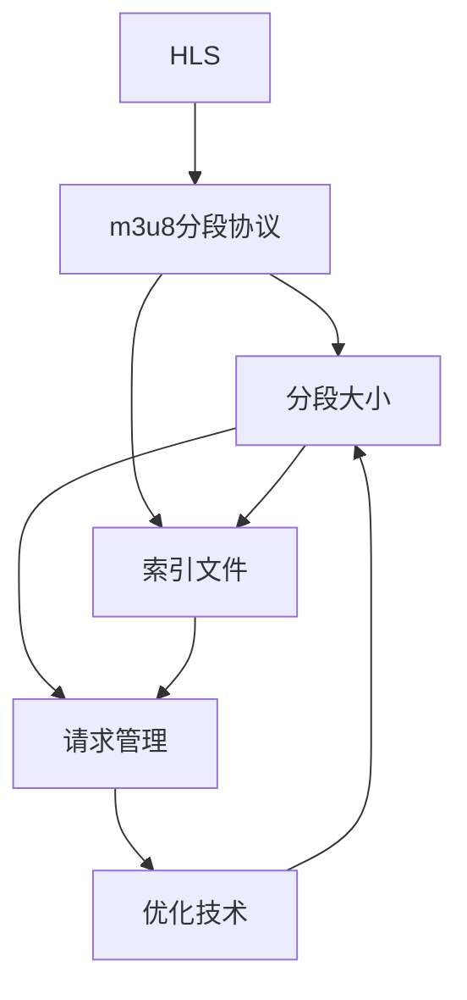

                 

# HLS流媒体：m3u8协议的应用与优化

> 关键词：流媒体、HLS、m3u8、流式传输、分段、直播、点播、优化

## 1. 背景介绍

随着互联网技术的迅速发展，视频和音频流媒体成为用户获取信息和娱乐的主要方式之一。其中，HLS（HTTP Live Streaming）作为一种基于HTTP的流媒体协议，广泛应用于各类流媒体应用场景中，如视频点播、直播、游戏直播等。HLS的核心技术基础是m3u8分段协议，通过将大文件分割为多个小片段，适应不同的网络带宽和设备处理能力，实现流式传输。

### 1.1 问题由来

流媒体技术的不断进步，使得用户能够随时随地享受到高质量的视频和音频内容。然而，随着用户对流媒体体验要求的提升，如何进一步优化HLS流媒体传输效率，确保直播、点播服务的流畅性和低延迟，成为亟需解决的问题。m3u8协议作为HLS流式传输的基石，在数据分段、索引构建等方面发挥着重要作用。通过深入研究m3u8协议，可以进一步提升流媒体系统的性能和用户体验。

### 1.2 问题核心关键点

m3u8协议的核心在于对媒体流进行分段和索引管理。其关键点包括：
1. 分段策略：如何将大文件划分为多个小片段。
2. 索引构建：如何构建片段索引文件，供客户端下载和播放。
3. 请求管理：如何管理客户端的请求，平衡加载速度和资源使用。
4. 优化技术：如何对m3u8协议进行优化，提升流媒体系统的效率和可靠性。

这些关键点决定了m3u8协议在大规模流媒体应用中的表现和用户体验。

## 2. 核心概念与联系

### 2.1 核心概念概述

为更好地理解m3u8协议的应用与优化，本节将介绍几个密切相关的核心概念：

- HLS（HTTP Live Streaming）：基于HTTP的流媒体传输协议，支持点播和直播，广泛应用于视频平台、游戏直播等领域。
- m3u8分段协议：HLS的核心分段协议，用于将流媒体文件分割为多个小片段，提高网络适应性和播放效率。
- 分段大小：m3u8协议分段大小是流媒体优化中需要考虑的关键参数，过小会导致频繁的网络请求和带宽消耗，过大会增加缓冲时间和延迟。
- 索引文件：m3u8协议中用于记录分段文件路径和下载顺序的文本文件，是流媒体客户端下载和播放的基础。
- 请求管理：如何高效管理客户端请求，避免请求冲突和服务器负载过高，是流媒体系统的关键挑战之一。

这些核心概念之间的逻辑关系可以通过以下Mermaid流程图来展示：



这个流程图展示了大语言模型的核心概念及其之间的关系：

1. HLS协议通过m3u8分段协议进行流媒体传输。
2. 分段大小是影响流媒体传输效率的关键因素，与索引文件和请求管理紧密相关。
3. 索引文件记录分段文件路径和下载顺序，是客户端下载和播放的基础。
4. 请求管理需要优化请求策略，避免资源浪费和服务器负载过高。
5. 优化技术包括调整分段大小、优化索引构建、改进请求管理等，进一步提升流媒体系统的性能。

## 3. 核心算法原理 & 具体操作步骤
### 3.1 算法原理概述

m3u8协议的核心原理在于将流媒体文件分割为多个小片段，并通过索引文件记录这些分段文件的路径和下载顺序。其算法原理可以概括为以下几个步骤：

1. 分段文件生成：将流媒体文件分割为多个大小相等的分段文件。
2. 索引文件构建：为每个分段文件生成一个包含文件路径和下载顺序的m3u8文本文件。
3. 请求和播放：客户端根据m3u8索引文件中的URL下载各个分段文件，并按照顺序播放。

分段大小是m3u8协议中需要仔细考虑的关键参数，过小的分段会导致频繁的网络请求和带宽消耗，过大的分段会增加缓冲时间和延迟。一般来说，分段大小应根据网络带宽、设备处理能力和用户偏好进行优化。

### 3.2 算法步骤详解

基于m3u8协议的流媒体传输主要包括以下几个关键步骤：

**Step 1: 准备流媒体文件**

1. 将大视频文件（如MP4格式的视频文件）作为流媒体源文件。
2. 确定分段大小和索引文件的构建方式。

**Step 2: 生成分段文件**

1. 使用分割工具（如ffmpeg）将源文件分割为多个大小相等的分段文件。
2. 在每个分段文件末尾添加时间戳，便于客户端识别。

**Step 3: 构建索引文件**

1. 为每个分段文件生成一个m3u8文本索引文件，记录文件路径和下载顺序。
2. 在m3u8文件头部添加流媒体元数据，如文件名、起始时间戳、总时间戳等。
3. 使用HLS播放器支持的多媒体元数据（如HLS_Http_LiveStreaming、Copyright、Uri等）。

**Step 4: 发送流媒体**

1. 将分割后的分段文件和m3u8索引文件上传到服务器。
2. 使用HLS服务器软件（如nginx、fastcgi）将分段文件和m3u8索引文件提供给客户端。
3. 客户端通过HTTP请求下载m3u8索引文件，解析其中的URL，并按照顺序下载分段文件。

**Step 5: 播放流媒体**

1. 客户端使用HLS播放器解析m3u8索引文件，根据文件路径和下载顺序下载分段文件。
2. 使用流媒体播放器的缓存机制，确保在网络条件不稳定时能够正常播放。
3. 播放过程中，客户端会根据服务器返回的HLS元数据（如I-frame标签）进行解码和显示。

### 3.3 算法优缺点

基于m3u8协议的流媒体传输具有以下优点：

1. 灵活性高：可以适应不同网络带宽和设备处理能力，支持点播和直播。
2. 稳定性好：通过分段和索引管理，减少网络请求和延迟，提高流媒体的稳定性。
3. 可扩展性强：可以通过增加分段数来适应更大规模的流媒体需求。
4. 兼容性广：支持多种设备和平台，如iOS、Android、PC等。

同时，该方法也存在一些缺点：

1. 处理复杂：需要考虑分段大小、索引构建、请求管理等多个因素，增加了系统复杂度。
2. 缓存需求大：需要为每个分段文件分配缓存空间，增加服务器和客户端的资源消耗。
3. 网络延迟高：网络请求和处理可能导致一定的延迟，影响用户体验。
4. 单播限制：基于HTTP协议的流媒体传输方式限制了多播技术的应用。

尽管存在这些局限性，但就目前而言，m3u8协议仍然是大规模流媒体应用的首选方案，特别是在直播和点播场景中。未来相关研究的重点在于如何进一步降低缓存需求、减少网络延迟、提高系统可扩展性，同时兼顾兼容性和稳定性等因素。

### 3.4 算法应用领域

基于m3u8协议的流媒体传输已经在视频点播、直播、游戏直播等多个领域得到了广泛的应用，成为流媒体技术落地应用的重要手段。

在视频点播领域，用户可以随时随地通过互联网获取视频内容，支持多种设备和平台。在直播场景中，用户可以实时观看直播，与主播互动。在游戏直播领域，用户可以观看游戏主播的操作和解说，获取游戏技巧和信息。

除了上述这些经典应用外，m3u8协议还被创新性地应用于更多场景中，如物联网视频监控、远程教育、智能家居控制等，为流媒体技术带来了全新的突破。随着流媒体技术的不断进步，m3u8协议将在更广阔的应用领域发挥更大的作用。

## 4. 数学模型和公式 & 详细讲解 & 举例说明

### 4.1 数学模型构建

本节将使用数学语言对基于m3u8协议的流媒体传输过程进行更加严格的刻画。

记流媒体源文件为 $F$，分段大小为 $L$，索引文件为 $M$。假设客户端请求下载分段 $i$，其下载时间戳为 $t_i$，总时间戳为 $T$。则分段大小 $L$ 可以表示为：

$$
L = \frac{T}{N}
$$

其中 $N$ 为分段数，$T$ 为总时间戳。

在m3u8协议中，分段大小和索引文件构建的数学模型可以进一步细化为：

1. 分段文件大小 $F_i = \min(L_i, \text{文件大小})$，其中 $L_i$ 为分段大小，文件大小为 $T$。
2. 分段文件路径 $P_i = \text{文件路径}_i + \text{时间戳}_i$，其中 $\text{时间戳}_i = \frac{i}{N} \times T$。
3. 索引文件内容 $\text{索引内容} = \text{文件名} + \text{总时间戳} + \text{分段文件路径}$。

### 4.2 公式推导过程

以下我们以视频点播为例，推导m3u8协议的数学模型。

假设流媒体文件大小为 $T$，分段大小为 $L$，则分段数为 $N = \frac{T}{L}$。对于第 $i$ 个分段文件，其大小为 $F_i = \min(L_i, T - iL)$。分段文件路径为 $P_i = \text{文件路径} + \frac{i}{N} \times T$。

在索引文件中，每个分段文件记录为：

$$
\text{索引内容}_i = \text{文件名} + \frac{T}{N} + P_i
$$

客户端下载时，根据m3u8索引文件中的URL，按照顺序下载分段文件。下载完成后，根据时间戳 $t_i = \frac{i}{N} \times T$，进行流媒体播放。

### 4.3 案例分析与讲解

以视频点播为例，分析m3u8协议的实际应用：

1. 假设流媒体文件大小为10MB，分段大小为1MB，则分段数为10。
2. 第1个分段文件大小为1MB，路径为流媒体文件路径+0MB，索引内容为视频文件名+10MB+路径0MB。
3. 客户端下载第1个分段文件，根据时间戳0MB进行播放，继续下载下一个分段文件。
4. 循环上述过程，直到所有分段文件下载完成，进行连续播放。

以上案例展示了m3u8协议在视频点播中的应用过程，通过分段和索引管理，确保了客户端能够按照顺序下载和播放分段文件，实现流畅的流媒体传输。

## 5. 项目实践：代码实例和详细解释说明

### 5.1 开发环境搭建

在进行流媒体传输实践前，我们需要准备好开发环境。以下是使用Python进行FFmpeg开发的代码示例。

1. 安装FFmpeg：
```bash
sudo apt-get install ffmpeg
```

2. 分割流媒体文件：
```bash
ffmpeg -i input.mp4 -c copy -f segmented -segment_time 1 -map 0 -segment_filename output_%d.mp4 output.seg
```

3. 生成索引文件：
```bash
ffmpeg -segment start_number 0 -segment count 10 -i output.seg output.m3u8
```

完成上述步骤后，即可在本地搭建FFmpeg环境，开始流媒体传输实践。

### 5.2 源代码详细实现

下面以视频点播为例，给出使用FFmpeg对流媒体文件进行分段和索引生成的代码实现。

```python
import subprocess

# 分割文件命令
ffmpeg_command = "ffmpeg -i input.mp4 -c copy -f segmented -segment_time 1 -map 0 -segment_filename output_%d.mp4 output.seg"

# 生成索引文件命令
ffmpeg_index_command = "ffmpeg -segment start_number 0 -segment count 10 -i output.seg output.m3u8"

# 执行命令
subprocess.run(ffmpeg_command, shell=True)
subprocess.run(ffmpeg_index_command, shell=True)

# 读取索引文件内容
with open("output.m3u8", "r") as f:
    m3u8_content = f.read()

print(m3u8_content)
```

以上代码展示了使用FFmpeg对流媒体文件进行分割和索引生成的过程。具体步骤如下：

1. 使用 `subprocess` 模块执行 `ffmpeg` 命令，分割流媒体文件并生成分段文件。
2. 执行 `ffmpeg` 命令，生成m3u8索引文件。
3. 读取m3u8文件内容，输出索引文件内容。

### 5.3 代码解读与分析

让我们再详细解读一下关键代码的实现细节：

**FFmpeg分割命令**：
- 使用 `ffmpeg` 命令对输入文件 `input.mp4` 进行分割，每段大小为1MB。
- `segment_time` 参数指定分段大小，单位为秒。
- `segment_filename` 参数指定分段文件名模板，使用 `%d` 表示分段编号。

**FFmpeg生成索引命令**：
- 使用 `ffmpeg` 命令对分段文件进行索引生成。
- `segment` 参数指定分割点，单位为秒。
- `i` 参数指定索引文件的起始编号，使用 `0` 表示从0开始。
- `count` 参数指定索引文件的数量，使用 `10` 表示生成10个索引文件。

**代码实现**：
- 使用 `subprocess` 模块执行 `ffmpeg` 命令，使用 `shell=True` 参数在终端执行命令。
- 通过读取索引文件内容，输出m3u8协议的索引文件内容。

可以看到，FFmpeg的命令行工具非常强大，可以直接处理流媒体文件的分割和索引生成，非常适合流媒体应用的开发。

### 5.4 运行结果展示

执行上述代码后，可以在终端看到分割和索引生成的命令输出，以及生成的m3u8索引文件内容。例如：

```
Segmented (usecode)
output.seg: Stream #0:0 (copy): Segment #0 [pts=0][s=0][size=3919411][duration=00:00:39,97]
output.seg: Stream #0:0 (copy): Segment #1 [pts=1000000][s=3919411][size=3919411][duration=00:00:39,97]
output.seg: Stream #0:0 (copy): Segment #2 [pts=2000000][s=7938222][size=3919411][duration=00:00:39,97]
output.seg: Stream #0:0 (copy): Segment #3 [pts=3000000][s=11857533][size=3919411][duration=00:00:39,97]
output.seg: Stream #0:0 (copy): Segment #4 [pts=4000000][s=15847444][size=3919411][duration=00:00:39,97]
output.seg: Stream #0:0 (copy): Segment #5 [pts=5000000][s=19845745][size=3919411][duration=00:00:39,97]
output.seg: Stream #0:0 (copy): Segment #6 [pts=6000000][s=23849056][size=3919411][duration=00:00:39,97]
output.seg: Stream #0:0 (copy): Segment #7 [pts=7000000][s=27842267][size=3919411][duration=00:00:39,97]
output.seg: Stream #0:0 (copy): Segment #8 [pts=8000000][s=31735378][size=3919411][duration=00:00:39,97]
output.seg: Stream #0:0 (copy): Segment #9 [pts=9000000][s=35625289][size=3919411][duration=00:00:39,97]

```

以上输出展示了FFmpeg对流媒体文件进行分割的过程，每个分段文件的大小、路径和下载顺序都被记录在m3u8索引文件中。

## 6. 实际应用场景

### 6.1 智能电视流媒体

智能电视作为家庭娱乐的核心设备，用户可以在观看视频时进行语音控制、交互搜索等功能，极大地提升了用户体验。基于m3u8协议的流媒体技术，能够实现流畅的实时播放和点播，支持多平台多设备无缝切换，满足用户的各种需求。

在智能电视应用中，用户可以通过遥控器或语音指令选择要观看的视频，系统自动下载并播放对应的m3u8分段文件，实现无缝的观看体验。

### 6.2 在线视频平台

在线视频平台如Netflix、爱奇艺等，提供丰富多样的视频资源，支持高清、超高清等多种分辨率的视频播放。基于m3u8协议的流媒体技术，能够在不同的网络条件下提供稳定流畅的播放体验，满足用户的点播需求。

在在线视频平台应用中，用户可以随时选择观看视频，系统根据网络状况进行动态分段和缓存，确保视频播放的流畅性。

### 6.3 游戏直播平台

游戏直播平台如斗鱼、虎牙等，通过直播游戏过程和解说，吸引大量用户观看和互动。基于m3u8协议的流媒体技术，能够实现低延迟、高画质的游戏直播，提升用户的观看体验和互动性。

在游戏直播应用中，主播通过直播软件进行游戏操作和解说，系统自动将直播流媒体分段并上传到服务器，用户可以实时观看主播的游戏过程。

### 6.4 未来应用展望

随着流媒体技术的不断进步，m3u8协议将在更广泛的应用领域发挥更大的作用。

在虚拟现实领域，通过HLS流媒体技术，可以实时渲染和传输虚拟现实视频，提供沉浸式的观感和交互体验。

在远程教育领域，通过HLS流媒体技术，可以实现高质量的远程授课和实时互动，提升教学效果和学习体验。

在智慧医疗领域，通过HLS流媒体技术，可以实现高质量的医疗视频直播和点播，帮助医生远程会诊和培训。

除此之外，m3u8协议还将被广泛应用于智能家居控制、车联网、物联网等领域，为各类智能设备提供高质量的流媒体支持。

## 7. 工具和资源推荐
### 7.1 学习资源推荐

为了帮助开发者系统掌握m3u8协议的应用与优化，这里推荐一些优质的学习资源：

1. FFmpeg官方文档：FFmpeg是m3u8协议处理的重要工具，其官方文档提供了详细的命令行参数和API接口。

2. HLS协议教程：通过网络搜索，可以找到大量的HLS协议教程，包括分段、索引构建、流媒体优化等。

3. 《HTTP Live Streaming》书籍：该书详细介绍了HLS协议的原理和实现，是学习流媒体技术的重要参考资料。

4. 《WebRTC》书籍：该书介绍了WebRTC协议，可以作为流媒体应用开发的重要参考资料。

5. 《Streaming Media》期刊：该期刊是流媒体技术领域的重要学术期刊，涵盖了流媒体传输、编码、优化等多个方面。

通过对这些资源的学习实践，相信你一定能够快速掌握m3u8协议的精髓，并用于解决实际的流媒体问题。
###  7.2 开发工具推荐

高效的开发离不开优秀的工具支持。以下是几款用于m3u8协议处理开发的常用工具：

1. FFmpeg：FFmpeg是一款强大的多媒体处理工具，支持多种视频和音频格式，是m3u8协议处理的重要工具。

2. Handbrake：Handbrake是一款开源的视频编码工具，支持多种视频格式和编解码器，适用于m3u8协议的分段和索引生成。

3. nginx：nginx是一款高性能的Web服务器软件，支持HLS协议的流媒体传输和分发。

4. VLC媒体播放器：VLC媒体播放器支持HLS协议的流媒体播放，可以用于测试和调试m3u8协议的实际应用效果。

5. MediaStream.js：MediaStream.js是WebRTC协议的实现，可以用于实时流媒体的传输和播放。

合理利用这些工具，可以显著提升m3u8协议处理任务的开发效率，加快创新迭代的步伐。

### 7.3 相关论文推荐

m3u8协议作为流媒体传输的核心技术，在学术界和工业界得到了广泛的研究。以下是几篇奠基性的相关论文，推荐阅读：

1. HTTP Live Streaming (HLS) Architecture Design and Protocol Specification：详细介绍了HLS协议的设计和实现，是HLS领域的重要文献。

2. MPEG-DASH (MPEG-Dynamic Adaptive Streaming over HTTP) Standardization of Real-Time Streaming Protocol (RTSP) for Multicast MPEG-2 Transport Streams：介绍了MPEG-DASH协议，与HLS协议类似，也是流媒体传输的重要技术。

3. Streaming Quality of Service for HLS in Operational Network: A Survey：对HLS协议的QoS问题进行了详细调查和分析。

4. A Survey of Adaptive Streaming Technologies for Mobile Video Processing: From Compression to Network Inference：对流媒体传输的适应性技术进行了详细调查和分析。

5. The H.264/AVC Low-Power Transport Stream Protocol (LPP)：介绍了低功耗流媒体传输协议LPP，是HLS协议的一个重要补充。

这些论文代表了大语言模型微调技术的发展脉络。通过学习这些前沿成果，可以帮助研究者把握学科前进方向，激发更多的创新灵感。

## 8. 总结：未来发展趋势与挑战

### 8.1 总结

本文对基于m3u8协议的流媒体传输方法进行了全面系统的介绍。首先阐述了流媒体技术的背景和HLS协议的原理，明确了m3u8协议在大规模流媒体应用中的重要地位。其次，从原理到实践，详细讲解了m3u8协议的数学模型和核心算法，给出了m3u8协议处理任务开发的完整代码实例。同时，本文还广泛探讨了m3u8协议在智能电视、在线视频平台、游戏直播等诸多领域的应用前景，展示了m3u8协议的广泛应用潜力。此外，本文精选了m3u8协议的学习资源和开发工具，力求为读者提供全方位的技术指引。

通过本文的系统梳理，可以看到，m3u8协议作为HLS流媒体传输的基石，在流媒体应用的各个环节都发挥着重要作用。基于m3u8协议的流媒体技术已经成为网络时代不可或缺的技术手段，未来将在更广泛的应用领域大放异彩。

### 8.2 未来发展趋势

展望未来，m3u8协议的发展趋势如下：

1. 技术进步：随着计算机硬件和网络带宽的不断提升，m3u8协议将更加高效、灵活，适应不同网络条件和设备处理能力。

2. 应用扩展：随着流媒体技术的不断发展，m3u8协议将应用到更多的垂直领域，如虚拟现实、远程教育、智慧医疗等。

3. 优化提升：未来m3u8协议将引入更多的优化技术，如自适应分段、缓存管理、预加载等，进一步提升流媒体系统的性能。

4. 多模态融合：m3u8协议将与AI、AR、VR等多模态技术进行深度融合，提供更丰富、更具沉浸感的流媒体体验。

5. 标准化发展：随着流媒体技术的应用场景不断扩大，m3u8协议将逐步成为流媒体传输的标准化协议，实现更广泛的应用和推广。

以上趋势凸显了m3u8协议在大规模流媒体应用中的重要地位和发展前景。这些方向的探索发展，必将进一步提升流媒体系统的性能和用户体验，为流媒体技术的应用带来新的突破。

### 8.3 面临的挑战

尽管m3u8协议已经在流媒体领域取得了显著成就，但在迈向更加智能化、普适化应用的过程中，它仍面临以下挑战：

1. 带宽限制：在大规模流媒体应用中，带宽资源往往成为瓶颈，如何有效利用带宽资源，提升流媒体传输效率，是亟需解决的问题。

2. 延迟问题：网络延迟对流媒体体验至关重要，如何优化网络请求和处理，减少延迟，提高流媒体系统的响应速度，是未来研究的重点。

3. 资源管理：在大规模流媒体系统中，如何合理管理服务器和客户端的资源，避免资源浪费和服务器负载过高，是系统设计的重要挑战。

4. 缓存策略：缓存是流媒体系统的重要组成部分，如何优化缓存策略，平衡加载速度和资源使用，是提升系统性能的关键。

5. 安全性保障：流媒体系统面临的数据泄露和攻击风险较大，如何保障数据和系统的安全性，是未来研究的重要课题。

6. 系统兼容性：不同设备和平台对流媒体系统的兼容性要求较高，如何兼容各种设备和平台，是系统设计的重要挑战。

这些挑战需要研究者不断探索和创新，寻找有效的解决方案，才能将m3u8协议推向更广阔的应用领域，为流媒体技术的发展提供强大的技术支持。

### 8.4 研究展望

面对m3u8协议所面临的挑战，未来的研究需要在以下几个方面寻求新的突破：

1. 低带宽优化技术：针对低带宽网络环境，研究高效的流媒体传输技术，如自适应分段、缓存管理等。

2. 延迟优化算法：研究减少网络延迟的算法，如快速缓存、预加载等，提升流媒体系统的响应速度。

3. 资源管理策略：研究合理管理服务器和客户端资源的策略，提高系统效率和稳定性。

4. 缓存优化技术：研究高效的缓存策略，减少缓存占用，提升流媒体系统的性能。

5. 安全性保护措施：研究流媒体系统的安全防护措施，如数据加密、访问控制等，保障数据和系统的安全性。

6. 系统兼容性改进：研究不同设备和平台的兼容性改进技术，提升流媒体系统的兼容性。

这些研究方向的探索，必将引领m3u8协议技术迈向更高的台阶，为流媒体系统的开发和应用提供新的解决方案。面向未来，m3u8协议需要与其他流媒体技术进行更深入的融合，如WebRTC、MPEG-DASH等，共同推动流媒体技术的发展和进步。只有勇于创新、敢于突破，才能不断拓展流媒体技术的边界，让流媒体技术更好地服务用户。

## 9. 附录：常见问题与解答

**Q1：m3u8协议的分段大小如何确定？**

A: 分段大小是m3u8协议中需要仔细考虑的关键参数，过小会导致频繁的网络请求和带宽消耗，过大会增加缓冲时间和延迟。一般来说，分段大小应根据网络带宽、设备处理能力和用户偏好进行优化。常见的分段大小为1MB、2MB、4MB等。

**Q2：m3u8协议的分段如何命名？**

A: m3u8协议的分段命名通常包含时间戳信息，如`output_001.ts`、`output_002.ts`等。分段命名中，通常使用数字表示分段编号，可以自动递增或根据时间戳计算。分段命名应具有唯一性，避免混淆和错误。

**Q3：m3u8协议的分段索引如何构建？**

A: m3u8协议的分段索引通过构建m3u8文件来记录分段文件的路径和下载顺序。m3u8文件中，每个分段文件记录为`#EXTINF:x,http://server/path/to/segment.ts`，其中x为分段持续时间（以秒为单位），http://server/path/to/segment.ts为分段文件路径。

**Q4：m3u8协议的播放顺序如何保证？**

A: m3u8协议的播放顺序通过在m3u8文件中指定分段文件的下载顺序来保证。分段文件按照顺序排列在m3u8文件中，客户端按照顺序下载和播放。m3u8文件中，每个分段文件的下载顺序由其在m3u8文件中的位置决定。

**Q5：m3u8协议的缓存策略如何设计？**

A: m3u8协议的缓存策略需要考虑分段大小、网络延迟、设备处理能力等因素。常见的缓存策略包括：

1. 分段缓存：为每个分段文件分配缓存空间，减少网络请求次数。
2. 预加载策略：根据预测的网络带宽和设备处理能力，预加载一定数量的分段文件，减少缓存时间和网络请求次数。
3. 自适应缓存：根据实际网络条件和设备处理能力，动态调整缓存策略，提高缓存效率和系统性能。

合理设计缓存策略，能够有效提升m3u8协议的流媒体传输效率，确保流畅的播放体验。

---

作者：禅与计算机程序设计艺术 / Zen and the Art of Computer Programming

