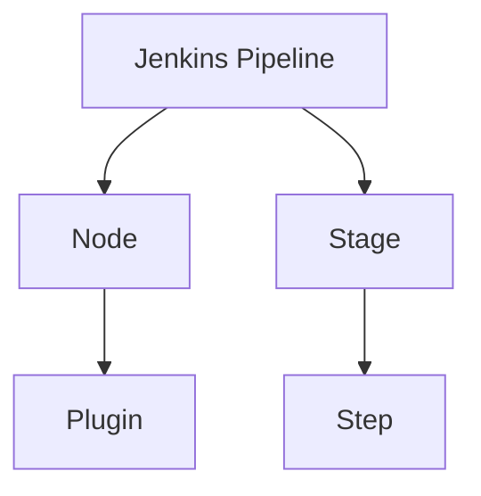

                 

# Jenkins Pipeline脚本开发

## 1. 背景介绍

### 1.1 问题由来
在现代软件开发过程中，持续集成（Continuous Integration, CI）和持续部署（Continuous Deployment, CD）已经成为不可或缺的实践。Jenkins作为最流行的开源CI/CD工具之一，通过构建、测试、部署流水线的自动化，极大地提高了软件开发效率和质量。然而，如何编写高效、可维护的Jenkins Pipeline脚本，对于开发者和系统管理员来说，是一个挑战。

### 1.2 问题核心关键点
Jenkins Pipeline脚本的核心是描述任务及其执行顺序的代码，以实现自动化构建和部署流水线。编写Jenkins Pipeline脚本的关键在于掌握其基本结构和语法，理解常用的插件和函数，并结合具体场景，设计出高效、可维护的流水线。

### 1.3 问题研究意义
研究Jenkins Pipeline脚本的开发，对于提升软件交付速度、降低部署风险、增强系统可靠性具有重要意义。

1. **提升交付速度**：自动化流水线能够快速响应代码变更，加速软件发布周期。
2. **降低部署风险**：自动化测试和部署减少了人为错误，提高了系统稳定性。
3. **增强系统可靠性**：持续集成和持续部署确保了软件的稳定性和一致性，避免了因版本问题导致的服务中断。

## 2. 核心概念与联系

### 2.1 核心概念概述

Jenkins Pipeline是一种在Jenkins中描述构建和部署流水线的脚本语言，用于自动化执行一系列任务和步骤。其主要概念包括：

- Jenkins Pipeline：描述自动化流水线的脚本，通常以Groovy语言编写。
- Node：执行任务的节点，可以是物理机或容器。
- Stage：流水线的阶段，用于组织和划分任务。
- Step：流水线的具体步骤，实现具体的任务和操作。
- Plugin：Jenkins提供的各种插件，如Codecov、SonarQube等，用于扩展Pipeline的功能。

### 2.2 核心概念原理和架构的 Mermaid 流程图



这个流程图展示了Jenkins Pipeline的核心组成：Pipeline脚本定义了Node的执行任务，通过Stage划分子任务，每个Step实现具体的任务操作，而插件可以增强Pipeline的功能。

## 3. 核心算法原理 & 具体操作步骤

### 3.1 算法原理概述

Jenkins Pipeline的算法原理基于流水线编排和任务执行的控制流机制。Pipeline通过Groovy语言定义任务，脚本中的`stage`关键字用于划分流水线阶段，`step`关键字用于具体执行任务，任务执行的顺序和依赖关系由流水线的逻辑控制。

### 3.2 算法步骤详解

#### 3.2.1 准备开发环境
首先，需要在Jenkins中安装Pipeline插件，并创建一个Jenkins Pipeline配置项，选择Pipeline作为类型。在配置项中可以输入Pipeline脚本代码。

#### 3.2.2 编写Pipeline脚本
一个典型的Pipeline脚本包括以下几个部分：

1. **定义环境变量**：
```groovy
env {
    JAVA_HOME = "/usr/lib/jvm/java-8-openjdk-amd64"
    MVN_HOME = "/usr/local/bin/mvn"
    NPM_HOME = "/usr/local/bin/npm"
}
```

2. **定义节点**：
```groovy
node {
    agent any
}
```

3. **定义阶段**：
```groovy
stage('Build') {
    steps {
        // 构建步骤
    }
}

stage('Test') {
    steps {
        // 测试步骤
    }
}

stage('Deploy') {
    steps {
        // 部署步骤
    }
}
```

4. **定义任务**：
```groovy
stage('Build') {
    steps {
        sh 'mvn clean install'
    }
}

stage('Test') {
    steps {
        sh 'npm install'
        sh 'npm test'
    }
}

stage('Deploy') {
    steps {
        sh 'mvn deploy'
    }
}
```

#### 3.2.3 执行Pipeline脚本
编写好Pipeline脚本后，可以在Jenkins配置项中配置触发方式，如定时任务、手动触发、代码变更触发等。

### 3.3 算法优缺点

#### 3.3.1 优点
- **易学易用**：Pipeline语法简单直观，易于上手。
- **可扩展性**：通过使用插件，Pipeline可以集成多种工具和功能。
- **自动化程度高**：Pipeline能够自动化执行构建、测试、部署等任务，提高工作效率。

#### 3.3.2 缺点
- **脚本复杂性**：复杂的业务逻辑可能需要复杂的Pipeline脚本实现。
- **性能瓶颈**：大型的Pipeline脚本可能导致性能问题，需要合理设计和管理。

### 3.4 算法应用领域

Jenkins Pipeline广泛应用于软件开发、系统运维、数据处理等场景，具体应用领域包括：

1. **软件开发**：自动化构建、测试、部署，提升软件交付速度。
2. **系统运维**：自动化运维任务，监控系统状态，处理告警。
3. **数据处理**：自动化数据清洗、转换、分析，提高数据处理效率。
4. **容器化部署**：自动化容器构建、部署，实现DevOps实践。

## 4. 数学模型和公式 & 详细讲解 & 举例说明

### 4.1 数学模型构建

Jenkins Pipeline的数学模型主要基于流水线的编排逻辑和任务执行的控制流机制。通过Groovy语言定义任务及其执行顺序，实现自动化流水线的编排。

### 4.2 公式推导过程

在Jenkins Pipeline中，常用公式如下：

- 定义环境变量：
```groovy
env {
    VAR_NAME = "value"
}
```

- 定义节点：
```groovy
node {
    agent any
}
```

- 定义阶段：
```groovy
stage('STAGE_NAME') {
    steps {
        // 任务列表
    }
}
```

- 定义任务：
```groovy
sh 'COMMAND'
```

### 4.3 案例分析与讲解

以一个简单的Jenkins Pipeline为例：

```groovy
pipeline {
    agent any
    stages {
        stage('Build') {
            steps {
                sh 'mvn clean install'
            }
        }
        stage('Test') {
            steps {
                sh 'npm install'
                sh 'npm test'
            }
        }
        stage('Deploy') {
            steps {
                sh 'mvn deploy'
            }
        }
    }
}
```

这个Pipeline定义了三个阶段：构建、测试、部署。每个阶段包含具体的任务步骤，用于实现自动化构建、测试、部署流程。

## 5. 项目实践：代码实例和详细解释说明

### 5.1 开发环境搭建

在Jenkins中安装Pipeline插件，创建一个新的Pipeline配置项，并输入Pipeline脚本代码。

### 5.2 源代码详细实现

以下是Jenkins Pipeline脚本的详细实现：

```groovy
pipeline {
    agent any
    stages {
        stage('Build') {
            steps {
                sh 'mvn clean install'
            }
        }
        stage('Test') {
            steps {
                sh 'npm install'
                sh 'npm test'
            }
        }
        stage('Deploy') {
            steps {
                sh 'mvn deploy'
            }
        }
    }
}
```

### 5.3 代码解读与分析

- `agent any`：定义节点为任何类型。
- `stage`：定义三个阶段：构建、测试、部署。
- `steps`：在每个阶段中定义具体的任务。

### 5.4 运行结果展示

执行Pipeline后，可以观察到构建、测试、部署的各个阶段执行结果，确保每个阶段的任务都能顺利完成。

## 6. 实际应用场景

### 6.1 软件开发

Jenkins Pipeline可以用于自动化构建、测试、部署软件项目，提升软件交付速度。例如，在Java项目中，可以通过Pipeline脚本自动化执行Maven构建、测试、部署任务。

### 6.2 系统运维

Jenkins Pipeline可以用于自动化运维任务，如监控系统状态、处理告警、更新配置等。例如，在一个Web应用中，可以通过Pipeline脚本自动化执行部署、重启、监控任务。

### 6.3 数据处理

Jenkins Pipeline可以用于自动化数据清洗、转换、分析任务。例如，在一个大数据项目中，可以通过Pipeline脚本自动化执行数据抽取、清洗、转换任务。

## 7. 工具和资源推荐

### 7.1 学习资源推荐

- Jenkins官方文档：详细的Jenkins Pipeline教程和示例。
- Jenkins Pipeline插件：丰富的插件和功能，扩展Pipeline的功能。
- Groovy官方文档：Groovy语言基础和进阶教程。

### 7.2 开发工具推荐

- Jenkins：开源的CI/CD工具，支持Pipeline和插件扩展。
- Git：版本控制系统，用于代码管理和变更控制。
- Docker：容器化技术，用于部署和运维。

### 7.3 相关论文推荐

- "Continuous Integration and Continuous Deployment: An Industrial Strength Approach to Building, Testing, and Deploying Java Applications"（《持续集成和持续部署：构建、测试和部署Java应用程序的工业级方法》）

## 8. 总结：未来发展趋势与挑战

### 8.1 研究成果总结

Jenkins Pipeline在持续集成和持续部署领域具有重要意义，通过自动化流水线编排，极大地提高了软件开发和系统运维的效率和可靠性。

### 8.2 未来发展趋势

未来，Jenkins Pipeline将向着以下方向发展：

- **云化**：Jenkins Pipeline将支持更多云平台，如AWS、Azure等，实现跨云自动化。
- **容器化**：Jenkins Pipeline将更深入地支持容器化技术，如Docker、Kubernetes等，实现DevOps实践。
- **人工智能**：Jenkins Pipeline将集成更多AI功能，如自动化测试数据生成、代码质量分析等。

### 8.3 面临的挑战

Jenkins Pipeline在发展过程中，面临以下挑战：

- **性能瓶颈**：大型的Pipeline脚本可能导致性能问题，需要合理设计和管理。
- **复杂性**：复杂的业务逻辑可能需要复杂的Pipeline脚本实现。
- **扩展性**：如何实现更灵活的扩展性，支持更多的插件和功能。

### 8.4 研究展望

未来的研究应在以下方面进行：

- **优化Pipeline性能**：优化Pipeline脚本设计，提升性能和可维护性。
- **增强可扩展性**：开发更多插件和扩展，实现更灵活的功能。
- **集成人工智能**：引入更多AI功能，提升Pipeline的自动化能力。

## 9. 附录：常见问题与解答

**Q1: Jenkins Pipeline脚本有哪些常用的插件？**

A: Jenkins Pipeline插件包括：

- Codecov：代码覆盖率测试。
- SonarQube：代码质量分析。
- Artifactory：私有软件仓库。
- Git SCM：Git版本控制。

**Q2: 如何在Jenkins Pipeline中使用环境变量？**

A: 在Pipeline脚本中使用环境变量，可以使用`env`关键字定义。例如：
```groovy
env {
    JAVA_HOME = "/usr/lib/jvm/java-8-openjdk-amd64"
    MVN_HOME = "/usr/local/bin/mvn"
    NPM_HOME = "/usr/local/bin/npm"
}
```

**Q3: Jenkins Pipeline中如何实现并发任务？**

A: 在Pipeline脚本中使用`parallel`关键字实现并发任务。例如：
```groovy
stage('Parallel') {
    steps {
        parallel {
            stage('Task 1') {
                steps {
                    sh 'task1.sh'
                }
            }
            stage('Task 2') {
                steps {
                    sh 'task2.sh'
                }
            }
        }
    }
}
```

**Q4: Jenkins Pipeline中如何实现任务重试？**

A: 在Pipeline脚本中使用`try-catch`关键字实现任务重试。例如：
```groovy
stage('Retry') {
    steps {
        try {
            sh 'command'
        } catch (Exception e) {
            sh 'retry.sh'
        }
    }
}
```

**Q5: Jenkins Pipeline中如何实现任务依赖？**

A: 在Pipeline脚本中使用`with`关键字实现任务依赖。例如：
```groovy
stage('Build') {
    steps {
        sh 'mvn clean install'
    }
}

stage('Test') {
    steps {
        with env('MVN_HOME') {
            sh 'mvn test'
        }
    }
}
```

---

作者：禅与计算机程序设计艺术 / Zen and the Art of Computer Programming

