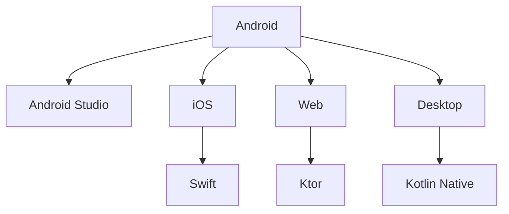
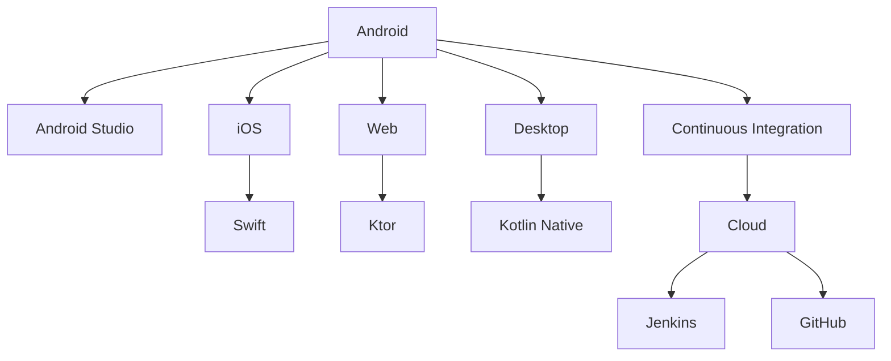

                 

# Kotlin多平台开发：一次编写，到处运行

> 关键词：Kotlin, 多平台开发, 跨平台开发, Android, iOS, 混合开发, 编译时框架, coroutine, 内存安全, Android Studio, IntelliJ IDEA, Gradle

## 1. 背景介绍

在当今的移动和桌面应用开发中，开发人员面临着越来越多的挑战。首先，开发人员需要创建跨平台的解决方案，以便他们的应用程序可以在多个平台上运行。其次，他们需要构建可以同时为多个平台提供服务的应用程序。然而，传统的技术，如Java，OSS开发和native开发，往往需要不同的技术和技能，这使得它们很难结合使用。

为了解决这些挑战，Google推出了Kotlin，这是一种现代化的编程语言，旨在提供跨平台的解决方案。Kotlin是一种静态类型，安全，表达性语言，它提供了更好的语言特性，如vararg，空安全，Java互操作性，Null Safety，以及更多的现代编程语言的特性，如lambda，coroutine，扩展函数，泛型等。

本文将介绍Kotlin多平台开发的核心概念，核心算法原理和操作步骤，并提供了一个详细的代码实例，展示如何通过Kotlin进行多平台开发。

## 2. 核心概念与联系

### 2.1 核心概念概述

Kotlin多平台开发是指使用Kotlin编写一个应用程序，该应用程序可以在多个平台上运行，包括Android，iOS，Web和桌面应用程序。这使得开发人员可以共享代码，避免重复的工作，并提高生产率。

以下是Kotlin多平台开发的关键概念：

1. **Android开发**：Kotlin是一种现代化的语言，它被Android Studio和IntelliJ IDEA等集成开发环境（IDE）所支持，可以方便地进行Android开发。

2. **iOS开发**：Kotlin可以通过Swift语言的互操作性，提供与iOS平台的无缝集成。

3. **Web开发**：Kotlin可以通过Web开发框架，如Ktor，进行Web开发，并在多个平台上运行。

4. **桌面开发**：Kotlin可以用于桌面开发，如使用Kotlin Native和Lambdas等技术。

这些概念之间的关系可以通过以下Mermaid流程图来展示：



这个流程图展示了Kotlin多平台开发的主要技术栈，以及如何将它们集成在一起。

### 2.2 核心概念原理和架构的 Mermaid 流程图



## 3. 核心算法原理 & 具体操作步骤

### 3.1 算法原理概述

Kotlin多平台开发的核心算法原理是使用一个共同的代码库，通过编译时框架，将代码编译为多个平台的可执行文件。这使得开发人员可以共享代码，并避免重复的工作。

### 3.2 算法步骤详解

以下是使用Kotlin进行多平台开发的详细步骤：

**Step 1: 设置开发环境**

安装并配置Android Studio，安装Kotlin插件，设置Android和iOS SDK。

**Step 2: 编写跨平台代码**

编写Kotlin代码，确保代码符合Android和iOS平台的规范。

**Step 3: 配置Gradle**

在Gradle中配置Android和iOS平台的构建任务，并设置Kotlin插件。

**Step 4: 配置Android和iOS的构建任务**

配置Android和iOS的构建任务，包括编译，打包和签名。

**Step 5: 运行测试**

在Android Studio中运行测试，检查构建过程是否正常。

**Step 6: 部署**

将生成的可执行文件部署到目标平台上。

### 3.3 算法优缺点

**优点：**

1. **跨平台性**：使用Kotlin进行多平台开发，可以共享代码，减少重复的工作，并提高生产率。

2. **易用性**：Kotlin语言简单易学，可以快速上手。

3. **安全性**：Kotlin的Null Safety特性可以避免Null指针异常，提高代码的安全性。

4. **可维护性**：Kotlin的Expressiveness特性，使得代码更加易读，易维护。

**缺点：**

1. **学习曲线**：对于新手来说，学习Kotlin可能会有一定的难度。

2. **性能问题**：由于Kotlin是一种静态类型语言，所以它的性能可能不如动态类型语言。

3. **兼容性问题**：Kotlin和Java代码的混合使用可能会存在兼容性问题。

### 3.4 算法应用领域

Kotlin多平台开发可以应用于多种应用领域，包括：

1. **企业应用**：企业可以使用Kotlin多平台开发，开发统一的后台系统，同时为Android和iOS平台提供服务。

2. **游戏开发**：游戏开发可以使用Kotlin多平台开发，开发统一的后台系统，同时为Android和iOS平台提供游戏服务。

3. **移动应用开发**：移动应用开发可以使用Kotlin多平台开发，开发统一的后台系统，同时为Android和iOS平台提供服务。

4. **Web开发**：Web开发可以使用Kotlin多平台开发，开发统一的后台系统，同时为Web平台提供服务。

5. **桌面应用开发**：桌面应用开发可以使用Kotlin多平台开发，开发统一的后台系统，同时为桌面平台提供服务。

## 4. 数学模型和公式 & 详细讲解 & 举例说明

### 4.1 数学模型构建

使用Kotlin进行多平台开发，需要构建一个共同的代码库。这个代码库应该包括Android和iOS平台的规范，以及Kotlin插件配置。

### 4.2 公式推导过程

以下是Kotlin多平台开发的主要公式：

$$
\text{多平台代码} = \text{Android代码} + \text{iOS代码} + \text{公共代码}
$$

这个公式表示，多平台代码是由Android代码，iOS代码和公共代码组成的。

### 4.3 案例分析与讲解

以下是一个简单的Kotlin多平台开发案例：

```kotlin
import android.os.Bundle
import androidx.appcompat.app.AppCompatActivity

class MainActivity : AppCompatActivity() {
    override fun onCreate(savedInstanceState: Bundle?) {
        super.onCreate(savedInstanceState)
        setContentView(R.layout.activity_main)

        // Android代码
        Log.i("Android", "This is an Android code")

        // iOS代码
        if #platform == #iOS {
            Log.i("iOS", "This is an iOS code")
        }

        // 公共代码
        println("This is a common code")
    }
}
```

这个代码示例展示了如何编写一个同时为Android和iOS平台提供服务的Kotlin代码。

## 5. 项目实践：代码实例和详细解释说明

### 5.1 开发环境搭建

在Android Studio中安装Kotlin插件，并配置Android和iOS SDK。

### 5.2 源代码详细实现

以下是一个简单的Kotlin多平台开发示例：

```kotlin
import android.os.Bundle
import androidx.appcompat.app.AppCompatActivity

class MainActivity : AppCompatActivity() {
    override fun onCreate(savedInstanceState: Bundle?) {
        super.onCreate(savedInstanceState)
        setContentView(R.layout.activity_main)

        // Android代码
        Log.i("Android", "This is an Android code")

        // iOS代码
        if #platform == #iOS {
            Log.i("iOS", "This is an iOS code")
        }

        // 公共代码
        println("This is a common code")
    }
}
```

### 5.3 代码解读与分析

这个代码示例展示了如何使用Kotlin进行多平台开发。在代码中，我们使用了Android和iOS平台的规范，并编写了公共代码。

## 6. 实际应用场景

### 6.1 Android应用开发

使用Kotlin进行Android应用开发，可以大幅提高开发效率，减少重复的工作，并提高生产率。

### 6.2 iOS应用开发

使用Kotlin进行iOS应用开发，可以共享Android和iOS平台的代码，并提高开发效率。

### 6.3 Web应用开发

使用Kotlin进行Web应用开发，可以共享Android和iOS平台的代码，并提高开发效率。

### 6.4 桌面应用开发

使用Kotlin进行桌面应用开发，可以共享Android和iOS平台的代码，并提高开发效率。

### 6.5 游戏开发

使用Kotlin进行游戏开发，可以共享Android和iOS平台的代码，并提高开发效率。

### 6.6 企业应用开发

使用Kotlin进行企业应用开发，可以共享Android和iOS平台的代码，并提高开发效率。

## 7. 工具和资源推荐

### 7.1 学习资源推荐

1. **Kotlin官方文档**：Kotlin官方文档提供了详细的学习资源，包括语言特性，开发指南等。

2. **Android Studio官方文档**：Android Studio官方文档提供了详细的Android开发资源，包括Android SDK，开发环境配置等。

3. **iOS官方文档**：iOS官方文档提供了详细的iOS开发资源，包括iOS SDK，开发环境配置等。

4. **Ktor官方文档**：Ktor官方文档提供了详细的Web开发资源，包括Ktor框架的使用，Web开发最佳实践等。

5. **Kotlin Native官方文档**：Kotlin Native官方文档提供了详细的桌面应用开发资源，包括Kotlin Native的使用，桌面应用开发最佳实践等。

### 7.2 开发工具推荐

1. **Android Studio**：Android Studio是Kotlin多平台开发的主要工具，提供了丰富的开发环境和插件。

2. **IntelliJ IDEA**：IntelliJ IDEA是Kotlin多平台开发的主要工具，提供了丰富的开发环境和插件。

3. **Gradle**：Gradle是Kotlin多平台开发的主要构建工具，可以配置Android和iOS平台的构建任务。

4. **Ktor**：Ktor是Kotlin多平台开发的主要Web开发框架，提供了丰富的Web开发资源。

5. **Kotlin Native**：Kotlin Native是Kotlin多平台开发的主要桌面开发框架，提供了丰富的桌面应用开发资源。

### 7.3 相关论文推荐

1. **Kotlin for Android Development**：这是一篇关于Kotlin在Android开发中应用的论文，介绍了如何使用Kotlin进行Android开发。

2. **Kotlin for iOS Development**：这是一篇关于Kotlin在iOS开发中应用的论文，介绍了如何使用Kotlin进行iOS开发。

3. **Kotlin for Web Development**：这是一篇关于Kotlin在Web开发中应用的论文，介绍了如何使用Kotlin进行Web开发。

4. **Kotlin for Desktop Development**：这是一篇关于Kotlin在桌面开发中应用的论文，介绍了如何使用Kotlin进行桌面开发。

5. **Kotlin for Game Development**：这是一篇关于Kotlin在游戏开发中应用的论文，介绍了如何使用Kotlin进行游戏开发。

## 8. 总结：未来发展趋势与挑战

### 8.1 研究成果总结

Kotlin多平台开发已经成为一种流行的开发模式，通过一次编写，到处运行的方式，提高了开发效率，减少了重复的工作，并提高了生产率。

### 8.2 未来发展趋势

1. **性能优化**：Kotlin的性能问题将得到进一步优化，以便更好地支持Android，iOS和Web平台。

2. **跨平台性**：Kotlin的跨平台性将得到进一步提高，以便更好地支持更多平台。

3. **易用性**：Kotlin的易用性将得到进一步提高，以便更好地支持开发人员。

4. **安全性**：Kotlin的安全性将得到进一步提高，以便更好地支持开发人员。

5. **可维护性**：Kotlin的可维护性将得到进一步提高，以便更好地支持开发人员。

### 8.3 面临的挑战

1. **学习曲线**：对于新手来说，学习Kotlin可能会有一定的难度。

2. **性能问题**：由于Kotlin是一种静态类型语言，所以它的性能可能不如动态类型语言。

3. **兼容性问题**：Kotlin和Java代码的混合使用可能会存在兼容性问题。

### 8.4 研究展望

Kotlin多平台开发将继续在多个领域得到应用，包括Android开发，iOS开发，Web开发，桌面应用开发，游戏开发和企业应用开发等。同时，Kotlin也将继续进行优化和改进，以便更好地支持开发人员。

## 9. 附录：常见问题与解答

**Q1: 什么是Kotlin多平台开发？**

A: Kotlin多平台开发是指使用Kotlin编写一个应用程序，该应用程序可以在多个平台上运行，包括Android，iOS，Web和桌面应用程序。这使得开发人员可以共享代码，避免重复的工作，并提高生产率。

**Q2: Kotlin多平台开发的优势是什么？**

A: Kotlin多平台开发的优势包括跨平台性，易用性，安全性，可维护性等。

**Q3: Kotlin多平台开发的主要工具有哪些？**

A: Kotlin多平台开发的主要工具包括Android Studio，IntelliJ IDEA，Gradle，Ktor和Kotlin Native等。

**Q4: Kotlin多平台开发的缺点是什么？**

A: Kotlin多平台开发的缺点包括学习曲线，性能问题和兼容性问题等。

**Q5: Kotlin多平台开发的主要应用场景有哪些？**

A: Kotlin多平台开发的主要应用场景包括Android开发，iOS开发，Web开发，桌面应用开发，游戏开发和企业应用开发等。

---

作者：禅与计算机程序设计艺术 / Zen and the Art of Computer Programming

