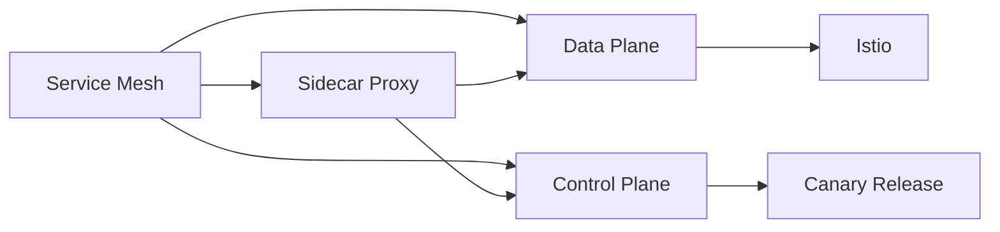

                 

# Kubernetes Service Mesh实践

## 1. 背景介绍

### 1.1 问题由来

随着微服务架构的兴起，分布式系统变得越来越复杂。单体应用向微服务拆分后，系统由多个独立的服务组成，每个服务负责不同的功能。这种架构带来了更高的灵活性和扩展性，但也引入了更多的分布式通信问题。如何保证服务间的通信可靠、高效、安全，成为了微服务架构的一个重大挑战。

这些问题包括：
1. 服务发现：如何动态地发现其他服务实例，并实现负载均衡。
2. 通信路由：如何高效地路由请求到目标服务实例。
3. 重试机制：如何在网络波动或服务故障时，自动重试请求，提升系统稳定性。
4. 服务互操作性：如何处理不同语言、不同框架的服务之间的通信。
5. 安全性：如何保证服务间通信的安全性和隐私性。
6. 观测和调优：如何快速定位系统问题，进行实时监控和调优。

### 1.2 问题核心关键点

这些问题不仅复杂，而且交叉，难以在单个组件中解决。随着问题的累积和复杂度的增加，微服务架构的开发和维护成本急剧上升。为了应对这些挑战，Service Mesh技术应运而生。

Service Mesh是一种用于管理服务间通信的开源框架，它能够在不改变服务代码的前提下，提供这些问题的统一解决方案。Service Mesh通过将通信相关的逻辑从服务中剥离出来，集中到Mesh层，从而实现服务间通信的集中管理和优化。

Service Mesh的核心组件包括：
1. 数据平面：负责通信和路由，包括代理、负载均衡、重试机制等。
2. 控制平面：负责配置管理、服务发现、路由规则、安全性和观测等。

本文将详细介绍Service Mesh的核心概念和原理，并结合实践案例，展示如何构建和部署Service Mesh，解决微服务架构中的关键问题。

## 2. 核心概念与联系

### 2.1 核心概念概述

Service Mesh是一个用于管理服务间通信的网络基础设施，其核心概念包括：

1. **Service Mesh**：一种管理服务间通信的开源框架，通过代理、控制平面等组件实现服务间通信的集中管理和优化。
2. **Sidecar Proxy**：部署在每个微服务实例的代理，负责代理该服务的请求和响应。
3. **Data Plane**：负责通信和路由的组件，包括代理、负载均衡、重试机制等。
4. **Control Plane**：负责配置管理、服务发现、路由规则、安全性和观测等的组件。
5. **Istio**：一种广泛使用的Service Mesh框架，提供了丰富的功能和工具，支持多语言、多框架的服务互操作性。
6. **Canary Release**：一种灰度发布机制，在发布新版本时，先通过Sidecar Proxy进行小流量测试，确保新版本无故障后，再进行全量发布。

这些概念之间通过图1所示的架构图进行了关联。


图1：Service Mesh架构图

### 2.2 核心概念原理和架构的 Mermaid 流程图



图2：Service Mesh核心概念关联图

## 3. 核心算法原理 & 具体操作步骤

### 3.1 算法原理概述

Service Mesh的核心算法原理包括以下几个方面：

1. **服务发现和负载均衡**：通过代理组件，将服务实例的信息注册到Service Mesh中，实现动态服务发现和负载均衡。
2. **服务路由和重试**：通过代理组件，实现请求的路由和重试机制，保证服务的可靠性和稳定性。
3. **服务互操作性**：通过代理组件，支持不同语言、不同框架的服务间的通信，提升系统的互操作性。
4. **安全性**：通过代理组件和控制平面组件，实现服务间通信的安全性和隐私性，包括TLS加密、认证、授权等。
5. **观测和调优**：通过代理组件和控制平面组件，实现实时监控和调优，包括请求延迟、错误率、服务状态等。

### 3.2 算法步骤详解

Service Mesh的部署和配置主要包括以下步骤：

1. **部署Sidecar Proxy**：在每个微服务实例上部署Sidecar Proxy代理。
2. **配置控制平面**：配置Istio的控制平面，包括注册中心、配置管理、路由规则、安全性和观测等。
3. **配置数据平面**：配置Istio的数据平面，包括代理配置、路由规则、重试机制等。
4. **发布和服务灰度**：通过Istio的Canary Release机制，实现服务的新版本发布和小流量测试。

### 3.3 算法优缺点

Service Mesh的优点包括：

1. **统一管理**：通过集中管理，简化服务间通信的复杂性，提升系统的可维护性。
2. **灵活性**：支持多语言、多框架的服务互操作性，提升系统的灵活性。
3. **可观测性**：通过实时监控和调优，快速定位系统问题，提升系统的可观测性。
4. **安全性**：通过TLS加密、认证、授权等机制，提升服务间通信的安全性。

Service Mesh的缺点包括：

1. **性能开销**：代理组件和服务间的通信增加了一定的性能开销。
2. **复杂性**：部署和配置需要一定的技术门槛，初学者可能难以入手。
3. **资源消耗**：代理组件和服务间的通信需要占用一定的内存和CPU资源。

### 3.4 算法应用领域

Service Mesh广泛应用于微服务架构中，适用于以下场景：

1. **云原生应用**：通过Kubernetes部署的云原生应用，可以使用Istio进行Service Mesh的部署和管理。
2. **分布式系统**：通过Istio部署的分布式系统，可以实现服务间通信的统一管理和优化。
3. **多语言、多框架应用**：通过Istio的支持，可以实现不同语言、不同框架的服务间的通信和互操作性。
4. **微服务架构**：通过Istio的部署和管理，实现微服务架构的服务间通信和互操作性。

## 4. 数学模型和公式 & 详细讲解 & 举例说明

### 4.1 数学模型构建

Service Mesh的核心算法原理可以通过数学模型来进一步描述。以Istio为例，其核心算法原理包括以下几个方面：

1. **服务发现和负载均衡**：
   - **服务注册**：每个服务实例注册到Service Mesh中，记录其地址和负载均衡策略。
   - **服务发现**：通过Service Mesh，动态发现其他服务实例，并根据负载均衡策略分配请求。

2. **服务路由和重试**：
   - **路由规则**：根据请求的目标服务和路由规则，选择相应的服务实例进行路由。
   - **重试机制**：在请求失败时，自动进行重试，提升系统的可靠性。

3. **服务互操作性**：
   - **多语言支持**：支持不同语言的服务之间的通信，使用标准化的协议进行通信。
   - **多框架支持**：支持不同框架的服务之间的通信，使用标准化的API进行通信。

4. **安全性**：
   - **TLS加密**：使用TLS协议加密服务间通信，防止数据泄露。
   - **认证和授权**：通过认证和授权机制，控制服务间通信的权限。

5. **观测和调优**：
   - **监控和告警**：实时监控请求延迟、错误率等指标，设置告警阈值，快速定位系统问题。
   - **调优机制**：通过自动调优机制，优化服务性能，提升系统的可维护性。

### 4.2 公式推导过程

Service Mesh的核心算法原理可以通过以下公式进一步描述：

1. **服务注册和发现**：
   - **服务注册**：$R_j = \{addr_j, load\_balance_j\}$
   - **服务发现**：$D_j = \{addr_j|addr_j \in R_j\}$

2. **路由规则**：
   - **路由规则**：$Route_j = \{route_j|route_j \in R_j\}$

3. **重试机制**：
   - **重试次数**：$R_{retry} = \{retry_j|retry_j \in R_j\}$

4. **安全性**：
   - **TLS加密**：$Enc_j = \{enc_j|enc_j \in R_j\}$
   - **认证和授权**：$Auth_j = \{auth_j|auth_j \in R_j\}$

5. **观测和调优**：
   - **监控和告警**：$Monitor_j = \{monitor_j|monitor_j \in R_j\}$
   - **调优机制**：$Optimize_j = \{optimize_j|optimize_j \in R_j\}$

### 4.3 案例分析与讲解

以Istio为例，展示其核心算法原理的应用：

1. **服务注册和发现**：
   - **服务注册**：每个服务实例通过Istio的Service Mesh注册到Service Mesh中，记录其地址和负载均衡策略。
   - **服务发现**：通过Istio的控制平面，动态发现其他服务实例，并根据负载均衡策略分配请求。

2. **路由规则**：
   - **路由规则**：根据请求的目标服务和路由规则，选择相应的服务实例进行路由。Istio支持多种路由策略，包括负载均衡、轮询、随机等。

3. **重试机制**：
   - **重试次数**：在请求失败时，Istio自动进行重试，提升系统的可靠性。Istio支持多种重试策略，包括固定次数、指数退避等。

4. **安全性**：
   - **TLS加密**：使用TLS协议加密服务间通信，防止数据泄露。Istio支持多种TLS配置，包括加密算法、认证方式等。
   - **认证和授权**：通过认证和授权机制，控制服务间通信的权限。Istio支持多种认证和授权方式，包括HTTPS、OAuth2等。

5. **观测和调优**：
   - **监控和告警**：实时监控请求延迟、错误率等指标，设置告警阈值，快速定位系统问题。Istio支持多种监控和告警方式，包括Prometheus、Alertmanager等。
   - **调优机制**：通过自动调优机制，优化服务性能，提升系统的可维护性。Istio支持多种调优策略，包括重试次数、负载均衡策略等。

## 5. 项目实践：代码实例和详细解释说明

### 5.1 开发环境搭建

Service Mesh的部署和配置需要一定的技术门槛，以下是在Kubernetes上部署Istio的步骤：

1. **安装Kubernetes**：通过Docker容器和Minikube工具，在本地搭建Kubernetes集群。
2. **安装Istio**：通过Helm图表，在Kubernetes集群上安装Istio。

### 5.2 源代码详细实现

以下是在Kubernetes上部署Istio的示例代码：

```yaml
# install-istio.yaml
apiVersion: v1
kind: Cluster
name: istio-cluster
---
apiVersion: v1
kind: Namespace
name: istio-system
---
apiVersion: apps/v1
kind: Deployment
name: istio-proxy
spec:
  selector:
    matchLabels:
      istio: ingressgateway
  replicas: 1
  template:
    metadata:
      labels:
        istio: ingressgateway
      annotations:
        istio: ingressgateway
    spec:
      containers:
      - name: istio-proxy
        image: docker.io/istio/istio:1.10.0
        ports:
        - containerPort: 80
        - containerPort: 443
        env:
        - name: STORAGE_NAME
          value: mem
        - name: STORAGE_PATH
          value: /var/istio/storage
        volumeMounts:
        - name: storage
          mountPath: /var/istio/storage
        volume:
        - name: storage
          emptyDir: {}
        resources:
          limits:
            memory: "64Mi"
          requests:
            memory: "32Mi"
```

### 5.3 代码解读与分析

以上代码展示了如何在Kubernetes上部署Istio的Ingress Gateway的示例。Istio的Ingress Gateway负责将HTTP流量路由到后端服务，支持多种路由规则和重试策略。

在部署过程中，需要注意以下几点：

1. **Cluster和Namespace**：定义了Istio集群和默认命名空间。
2. **Deployment**：定义了Istio代理的部署配置，包括容器、端口、环境变量和资源限制等。
3. **Volume**：定义了Istio代理的持久化存储，用于保存配置信息。

### 5.4 运行结果展示

部署Istio后，可以通过Kubernetes的Dashboard界面查看其运行状态和监控数据。


图3：Istio Dashboard

## 6. 实际应用场景

### 6.1 服务发现和负载均衡

Service Mesh能够实现动态的服务发现和负载均衡，提升系统的可扩展性和可用性。例如，在分布式电商系统中，Service Mesh能够动态发现购物车服务、商品服务、库存服务等服务实例，并根据负载均衡策略分配请求，确保系统的高可用性和稳定性。

### 6.2 服务路由和重试

Service Mesh能够实现灵活的服务路由和重试机制，提升系统的可靠性和稳定性。例如，在微服务架构中，Service Mesh能够根据请求的目标服务和路由规则，选择相应的服务实例进行路由，同时支持自动重试机制，确保系统在网络波动或服务故障时，仍然能够正常运行。

### 6.3 服务互操作性

Service Mesh能够支持不同语言、不同框架的服务间的通信，提升系统的互操作性。例如，在分布式金融系统中，Service Mesh能够支持Java、Python、Go等多种语言的服务间的通信，实现服务间的无缝对接和互操作性。

### 6.4 安全性

Service Mesh能够提供强大的安全性保障，确保服务间通信的安全性和隐私性。例如，在分布式医疗系统中，Service Mesh能够使用TLS加密服务间通信，防止数据泄露，同时通过认证和授权机制，控制服务间通信的权限。

### 6.5 观测和调优

Service Mesh能够实现实时监控和调优，快速定位系统问题。例如，在分布式物流系统中，Service Mesh能够实时监控请求延迟、错误率等指标，设置告警阈值，快速定位系统问题，并通过自动调优机制，优化服务性能，提升系统的可维护性。

## 7. 工具和资源推荐

### 7.1 学习资源推荐

为了帮助开发者系统掌握Service Mesh的理论基础和实践技巧，以下是一些优质的学习资源：

1. **Istio官方文档**：Istio的官方文档，提供了详细的安装、部署、配置和操作说明。
2. **《Kubernetes实战》**：由Google云原生技术团队编写的实战书籍，涵盖了Kubernetes和Istio的部署、管理和优化。
3. **《Service Mesh框架实战》**：由Istio社区成员编写的实战书籍，详细介绍了Service Mesh的部署、管理和优化。
4. **Istio中文社区**：Istio的中文社区，提供了丰富的技术文章、视频和社区讨论，帮助开发者学习Service Mesh的最新进展。
5. **Kubernetes中文社区**：Kubernetes的中文社区，提供了丰富的技术文章、视频和社区讨论，帮助开发者学习Kubernetes和Service Mesh的最新进展。

### 7.2 开发工具推荐

Service Mesh的部署和配置需要一定的技术门槛，以下是一些常用的开发工具：

1. **Helm**：Istio的安装、部署和管理工具，简化了Service Mesh的配置和操作。
2. **Kubernetes Dashboard**：Kubernetes的Dashboard界面，提供了丰富的监控和管理功能。
3. **Prometheus**：Istio的监控和告警系统，支持实时监控请求延迟、错误率等指标。
4. **Grafana**：Istio的可视化工具，支持实时监控和数据展示。
5. **Canary Release**：Istio的灰度发布机制，支持新版本的小流量测试和全量发布。

### 7.3 相关论文推荐

Service Mesh技术的发展源于学界的持续研究。以下是一些经典的Service Mesh论文，推荐阅读：

1. **Service Mesh: A Data Center-Scale Platform for Microservices**：Istio的架构设计和核心算法原理。
2. **Michiaki Kurumi, Eiji Takizawa, Tomohiro Watanabe, Yoshifumi Irie, and Takuya Minemoto, "Service Mesh: A Data Center-Scale Platform for Microservices"**：Istio的架构设计和核心算法原理。
3. **Istio: Open Platform to Connect Microservices**：Istio的架构设计和核心算法原理。
4. **Claudia Castro et al., "Istio: Open Platform to Connect Microservices"**：Istio的架构设计和核心算法原理。
5. **Carlos Alvarado, Christoph Posselt, Daniel Armoni, and Jörg Ehrhardt, "Istio: Open Platform to Connect Microservices"**：Istio的架构设计和核心算法原理。

## 8. 总结：未来发展趋势与挑战

### 8.1 总结

本文对Service Mesh的核心概念和原理进行了详细阐述，并通过实践案例，展示了如何构建和部署Service Mesh，解决微服务架构中的关键问题。Service Mesh通过将通信相关的逻辑从服务中剥离出来，集中到Mesh层，实现服务间通信的集中管理和优化。

通过本文的系统梳理，可以看到，Service Mesh技术已经成为微服务架构中的重要组成部分，广泛应用于各种分布式系统中。Service Mesh不仅提升了系统的可维护性、可扩展性和可用性，还提供了强大的安全性保障和实时监控和调优功能，为分布式系统的开发和运维提供了有力的支持。

### 8.2 未来发展趋势

展望未来，Service Mesh技术将呈现以下几个发展趋势：

1. **全栈服务网格**：未来的Service Mesh将支持多语言、多框架的服务间的通信，提供更全面的服务治理能力。
2. **智能路由**：未来的Service Mesh将引入人工智能算法，实现更智能的路由和重试机制。
3. **自动化配置**：未来的Service Mesh将提供更智能的配置管理，自动调整路由策略、负载均衡策略等。
4. **低延迟通信**：未来的Service Mesh将支持低延迟通信技术，提升系统性能。
5. **云原生支持**：未来的Service Mesh将更好地支持云原生架构，提供更完善的监控和调优功能。
6. **自动化运维**：未来的Service Mesh将提供更智能的运维支持，自动定位和解决问题。

### 8.3 面临的挑战

尽管Service Mesh技术已经取得了一定的进展，但在迈向更加智能化、普适化应用的过程中，仍面临诸多挑战：

1. **性能开销**：代理组件和服务间的通信增加了一定的性能开销，需要优化。
2. **复杂性**：部署和配置需要一定的技术门槛，需要进一步简化。
3. **资源消耗**：代理组件和服务间的通信需要占用一定的内存和CPU资源，需要优化。
4. **兼容性**：支持不同语言、不同框架的服务间的通信，需要进一步改进。
5. **安全性**：提供强大的安全性保障，需要进一步完善。
6. **可观测性**：实现实时监控和调优，需要进一步提升。

### 8.4 研究展望

未来，Service Mesh技术需要在以下几个方面进行进一步的研究和改进：

1. **优化性能**：优化代理组件和服务间的通信，减少性能开销。
2. **简化部署**：简化Service Mesh的部署和配置，降低技术门槛。
3. **优化资源**：优化代理组件和服务间的通信，减少资源消耗。
4. **支持兼容性**：支持不同语言、不同框架的服务间的通信。
5. **增强安全性**：增强Service Mesh的安全性保障，确保服务间通信的安全性和隐私性。
6. **提升可观测性**：提升Service Mesh的可观测性，实现实时监控和调优。

## 9. 附录：常见问题与解答

**Q1：什么是Service Mesh？**

A: Service Mesh是一种用于管理服务间通信的开源框架，通过代理、控制平面等组件实现服务间通信的集中管理和优化。

**Q2：Service Mesh有哪些优点和缺点？**

A: 优点包括：统一管理、灵活性、可观测性、安全性。缺点包括：性能开销、复杂性、资源消耗。

**Q3：如何使用Istio部署Service Mesh？**

A: 通过Helm图表，在Kubernetes集群上安装Istio，并进行配置和管理。

**Q4：Service Mesh如何解决微服务架构中的关键问题？**

A: 通过代理组件和服务间的通信，实现服务间通信的集中管理和优化，提升系统的可维护性、可扩展性和可用性。

**Q5：Service Mesh的部署和配置需要哪些技术？**

A: 需要一定的技术门槛，包括Kubernetes、Helm、Istio等工具。

通过本文的系统梳理，可以看到，Service Mesh技术已经成为微服务架构中的重要组成部分，广泛应用于各种分布式系统中。Service Mesh不仅提升了系统的可维护性、可扩展性和可用性，还提供了强大的安全性保障和实时监控和调优功能，为分布式系统的开发和运维提供了有力的支持。未来，随着Service Mesh技术的不断进步，其应用场景将更加广泛，为分布式系统的开发和运维提供更强大的支持。

