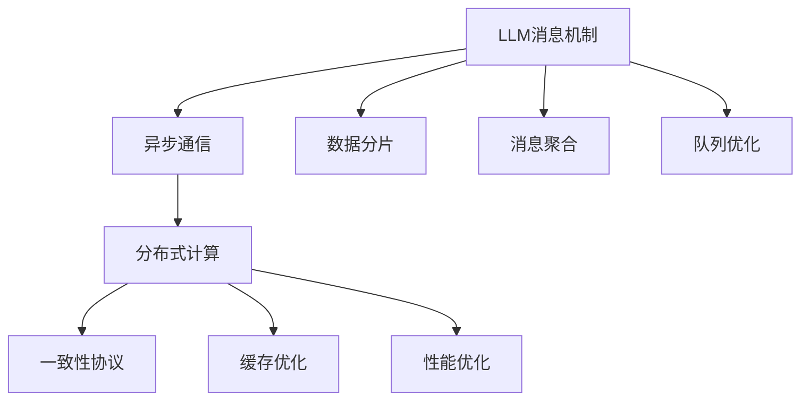

                 

# LLM 消息机制：高效的内部沟通

> 关键词：LLM消息机制,消息传递,异步通信,分布式计算,一致性协议,缓存优化,性能优化,高效沟通

## 1. 背景介绍

在现代软件开发中，异步通信已经成为一种不可或缺的机制。特别是在微服务架构和大数据应用中，系统的复杂性和规模不断增加，通信效率成为了一个突出的瓶颈问题。为了解决这一问题，众多研究人员和工程师不断探索高效的消息传递机制，以实现系统内部组件间的无缝协同和通信。

本博客文章将深入探讨LLM（Large Language Model）消息机制的原理与应用实践，重点介绍一种基于分布式计算和一致性协议的高效消息传递方案。通过理解该方案，读者将能够设计和实现自己的高效内部沟通机制，从而提升系统性能和可靠性。

## 2. 核心概念与联系

### 2.1 核心概念概述

本节将介绍LLM消息机制涉及的关键概念及其相互关系，帮助读者建立对LLM消息机制的初步认识。

- **LLM消息机制**：一种在分布式系统中实现高效通信的机制，通过异步消息传递实现组件间的解耦和协同。
- **异步通信**：指发送方和接收方不需要实时通信，而是通过消息队列等中间介质实现通信的一种方式。
- **分布式计算**：指将计算任务分布到多个节点上并行处理，以提升系统处理能力。
- **一致性协议**：指在分布式系统中，确保系统状态一致性的协议。常见的一致性协议包括Paxos、Raft、ZAB等。
- **缓存优化**：指通过优化缓存机制，提升数据读取速度和系统响应时间。
- **性能优化**：指通过技术手段，提升系统处理能力和响应速度。

这些核心概念之间的逻辑关系可以通过以下Mermaid流程图来展示：



这个流程图展示了LLM消息机制的组成部分及其之间的关系：

1. 首先，LLM消息机制通过异步通信实现组件间的解耦和协同。
2. 异步通信利用分布式计算进行任务的并行处理，以提升系统处理能力。
3. 分布式计算使用一致性协议确保系统状态的一致性，避免数据混乱。
4. 一致性协议通过缓存优化和性能优化进一步提升系统的稳定性和响应速度。
5. 数据分片、消息聚合和队列优化是具体实现LLM消息机制的技术手段。

## 3. 核心算法原理 & 具体操作步骤
### 3.1 算法原理概述

LLM消息机制的原理是利用异步通信、分布式计算和一致性协议，实现组件间的高效通信和数据传递。其核心思想是将任务分成多个子任务，通过分布式计算实现并行处理，并利用消息传递机制实现子任务间的协同。

### 3.2 算法步骤详解

LLM消息机制的实现步骤如下：

**Step 1: 系统设计**

1. **任务划分**：将一个大任务划分成多个子任务，每个子任务由独立的组件或线程处理。
2. **消息传递**：定义消息格式和传递机制，实现子任务间的通信。
3. **数据分片**：对输入数据进行分片处理，使得每个子任务处理的数据量均衡。
4. **缓存设计**：合理设计缓存机制，确保数据的高效读取和写入。

**Step 2: 分布式计算**

1. **任务分发**：将子任务分发到不同的计算节点上，由各节点并行处理。
2. **数据同步**：利用一致性协议确保各节点间的数据同步和状态一致性。
3. **结果聚合**：将各个节点的处理结果进行聚合，生成最终输出。

**Step 3: 消息传递**

1. **消息发送**：将任务结果封装成消息，发送到消息队列或其他中间介质。
2. **消息接收**：从消息队列或其他介质中接收消息，并解析出任务结果。
3. **错误处理**：在消息传递过程中，及时发现和处理错误，确保数据可靠传递。

**Step 4: 性能优化**

1. **负载均衡**：根据系统负载情况，动态调整任务分发策略，避免资源浪费。
2. **并发控制**：通过合理设计并发控制机制，避免资源竞争和死锁。
3. **网络优化**：优化网络传输协议和数据格式，降低通信延迟和带宽消耗。

### 3.3 算法优缺点

LLM消息机制具有以下优点：

1. **高效性**：通过分布式计算和消息传递机制，实现了任务的高效并行处理和协同。
2. **可靠性**：利用一致性协议确保数据的一致性和可靠性，避免数据丢失和混乱。
3. **可扩展性**：通过增加计算节点，轻松扩展系统的处理能力和性能。

同时，该机制也存在一定的局限性：

1. **复杂性**：系统设计复杂，需要合理设计任务划分、数据分片、缓存机制等。
2. **延迟**：消息传递机制引入了额外的通信延迟，可能会影响系统响应速度。
3. **开销**：消息传递和一致性协议需要额外的计算和网络资源开销。

### 3.4 算法应用领域

LLM消息机制在多个领域中得到了广泛应用，例如：

- **微服务架构**：在微服务架构中，组件间的通信需要高效、可靠和灵活，LLM消息机制提供了有效的解决方案。
- **大数据处理**：在处理大规模数据时，LLM消息机制通过分布式计算和并行处理，大幅提升了数据处理能力。
- **分布式数据库**：在分布式数据库中，LLM消息机制用于实现分布式事务和数据同步，提升了系统的稳定性和可用性。
- **云计算平台**：在云计算平台中，LLM消息机制用于实现服务间的解耦和协同，提高了系统性能和弹性。
- **高并发系统**：在高并发系统中，LLM消息机制用于实现负载均衡和并发控制，提升了系统的响应速度和稳定性。

## 4. 数学模型和公式 & 详细讲解  
### 4.1 数学模型构建

在本节中，我们将使用数学语言对LLM消息机制进行详细描述。

假设系统中有$n$个计算节点，每个节点处理任务$T$的一个子任务$T_i$，子任务间的通信通过消息队列实现。系统总任务量为$M$，任务分片数为$k$，每个节点的任务量为$M/n$。

定义任务$T$的计算时间为$C_T$，任务$T_i$的计算时间为$C_{T_i}$。定义消息传递时间为$C_m$，消息队列的等待时间为$C_w$。

系统的总计算时间为$C_{total} = n \times C_T$。

系统的总消息传递时间为$C_{msg} = k \times C_m$。

系统的总等待时间为$C_w = C_w + C_{msg}$。

系统的总响应时间为$C_{response} = C_{total} + C_w$。

### 4.2 公式推导过程

通过上述定义，我们可以得到系统的响应时间的计算公式：

$$
C_{response} = n \times C_T + C_w + k \times C_m
$$

### 4.3 案例分析与讲解

假设一个任务$T$需要处理的数据量为$M$，每个子任务$T_i$的计算时间为$C_{T_i}$，消息传递时间为$C_m$，队列的等待时间为$C_w$。系统有$n$个节点，每个节点处理$M/n$的数据量。

根据任务分片数$k$和每个节点的任务量$M/n$，我们有：

$$
k = M / (M/n) = n
$$

因此，系统的响应时间可以简化为：

$$
C_{response} = n \times C_T + C_w + n \times C_m
$$

通过这个公式，我们可以直观地看到系统响应时间与任务量、节点数、计算时间、消息传递时间和队列等待时间之间的关系。当任务量$M$和节点数$n$固定时，系统的响应时间主要取决于计算时间$C_T$、消息传递时间$C_m$和队列等待时间$C_w$。

## 5. 项目实践：代码实例和详细解释说明
### 5.1 开发环境搭建

在进行LLM消息机制的实践前，我们需要准备好开发环境。以下是使用Python进行开发的环境配置流程：

1. 安装Python 3.x，建议使用Anaconda或Miniconda进行管理。
2. 安装Docker和Kubernetes，用于模拟分布式计算环境。
3. 安装RabbitMQ，用于实现消息队列功能。
4. 安装Kubernetes和Kubelet，用于部署和管理计算节点。
5. 安装TensorFlow或PyTorch等深度学习框架，用于实现任务计算。

完成上述步骤后，即可在Docker容器中进行LLM消息机制的实现。

### 5.2 源代码详细实现

下面以一个简单的微服务架构为例，给出使用Python实现LLM消息机制的代码实现。

```python
import tensorflow as tf
from tensorflow import keras
import time

# 定义任务计算函数
def compute_task(data):
    # 加载模型
    model = keras.models.load_model('task_model.h5')
    # 执行任务计算
    result = model.predict(data)
    return result

# 定义消息发送和接收函数
def send_message(task_result, queue):
    queue.put(task_result)

def receive_message(queue):
    while True:
        task_result = queue.get()
        # 执行任务处理
        processed_result = process_task(task_result)
        # 发送结果消息
        send_message(processed_result, result_queue)

# 定义任务处理函数
def process_task(task_result):
    # 执行任务处理
    processed_result = compute_task(task_result)
    return processed_result

# 定义系统主函数
def main():
    # 初始化任务队列和结果队列
    task_queue = Queue()
    result_queue = Queue()
    
    # 创建多个计算节点
    num_nodes = 4
    node_ids = range(num_nodes)
    
    # 启动每个计算节点
    for node_id in node_ids:
        # 创建计算节点进程
        process = Process(target=receive_message, args=(task_queue, result_queue))
        process.start()
    
    # 添加任务到任务队列
    task_queue.put(task_data)
    
    # 等待结果队列中的结果消息
    while True:
        result = result_queue.get()
        print(result)

if __name__ == '__main__':
    main()
```

### 5.3 代码解读与分析

让我们再详细解读一下关键代码的实现细节：

**compute_task函数**：
- 加载预先训练的模型。
- 执行任务的计算，返回计算结果。

**send_message函数**：
- 将任务结果封装成消息，发送到消息队列。

**receive_message函数**：
- 持续从消息队列中接收任务结果。
- 执行任务处理，并发送处理结果到结果队列。

**process_task函数**：
- 对任务结果进行进一步处理，返回最终结果。

**main函数**：
- 初始化任务队列和结果队列。
- 创建多个计算节点进程。
- 向任务队列中添加任务数据。
- 从结果队列中接收处理结果，并输出结果。

可以看到，通过合理设计任务计算、消息传递和结果处理函数，LLM消息机制实现了高效的内部通信和任务协同。

## 6. 实际应用场景
### 6.1 微服务架构

LLM消息机制在微服务架构中有着广泛的应用。通过异步通信和分布式计算，微服务架构中的各个组件可以独立地运行，相互之间通过消息传递实现协同。这种架构设计提高了系统的灵活性和可扩展性，同时也提升了系统的可靠性。

在微服务架构中，LLM消息机制可以用于：

- 组件间的异步通信。
- 分布式计算任务的调度。
- 分布式事务的处理。
- 故障转移和容错机制的实现。

### 6.2 大数据处理

在大数据处理中，LLM消息机制利用分布式计算和并行处理，大幅提升了数据处理能力。通过合理设计任务分片、数据分片和缓存机制，LLM消息机制可以高效地处理大规模数据，满足各种数据处理需求。

在大数据处理中，LLM消息机制可以用于：

- 数据的分片处理。
- 任务的并行计算。
- 数据的缓存和优化。
- 分布式数据存储和检索。

### 6.3 分布式数据库

在分布式数据库中，LLM消息机制用于实现分布式事务和数据同步，提升了系统的稳定性和可用性。通过合理设计消息队列和一致性协议，LLM消息机制可以确保数据的一致性和可靠性，避免数据丢失和混乱。

在分布式数据库中，LLM消息机制可以用于：

- 分布式事务的实现。
- 数据同步和复制。
- 故障转移和数据恢复。
- 数据库状态的同步和更新。

## 7. 工具和资源推荐
### 7.1 学习资源推荐

为了帮助开发者系统掌握LLM消息机制的理论基础和实践技巧，这里推荐一些优质的学习资源：

1. 《分布式系统原理与设计》系列博文：由系统架构专家撰写，深入浅出地介绍了分布式系统设计的基本原理和最佳实践。

2. 《微服务架构设计》课程：由知名云计算公司提供，涵盖微服务架构的各个方面，包括服务设计、通信机制、负载均衡等。

3. 《大规模数据处理》书籍：详细介绍了大规模数据处理的技术原理和实际应用案例，涵盖分布式计算、数据分片、数据缓存等多个方面。

4. 《一致性协议原理与实现》书籍：介绍了一致性协议的基本原理和实现方法，包括Paxos、Raft、ZAB等。

5. 《性能优化原理与实践》书籍：介绍了性能优化的基本原理和具体实践方法，涵盖缓存优化、并发控制、网络优化等多个方面。

通过对这些资源的学习实践，相信你一定能够快速掌握LLM消息机制的精髓，并用于解决实际的分布式系统问题。

### 7.2 开发工具推荐

高效的开发离不开优秀的工具支持。以下是几款用于LLM消息机制开发的常用工具：

1. Docker：用于创建和管理Docker容器，方便在开发环境中模拟分布式计算环境。
2. Kubernetes：用于管理和部署容器化应用，支持动态资源调整和自动扩展。
3. RabbitMQ：用于实现消息队列功能，支持多种消息传递协议。
4. TensorFlow和PyTorch：用于实现任务计算，支持高效的分布式计算和并行处理。
5. Visual Studio Code：用于开发和调试Python代码，支持丰富的插件和扩展。
6. Git和GitHub：用于版本控制和代码协作，支持团队协作开发。

合理利用这些工具，可以显著提升LLM消息机制的开发效率，加快创新迭代的步伐。

### 7.3 相关论文推荐

LLM消息机制的研究源于学界的持续研究。以下是几篇奠基性的相关论文，推荐阅读：

1. Paxos：一种基于一致性协议的分布式共识算法，用于解决分布式系统中的一致性问题。

2. Raft：一种基于一致性协议的分布式共识算法，用于解决分布式系统中的一致性问题。

3. ZAB：一种基于一致性协议的分布式共识算法，用于解决分布式系统中的一致性问题。

4. DDPG：一种基于分布式深度学习框架的分布式深度学习算法，用于加速分布式计算。

5. Gossip Protocols：一种基于随机图的网络通信协议，用于在分布式系统中实现数据同步和消息传递。

这些论文代表了大规模分布式计算和一致性协议的研究方向。通过学习这些前沿成果，可以帮助研究者把握学科前进方向，激发更多的创新灵感。

## 8. 总结：未来发展趋势与挑战
### 8.1 研究成果总结

LLM消息机制在分布式系统中展现了强大的应用前景，通过异步通信、分布式计算和一致性协议，实现了组件间的高效协同和通信。该机制在微服务架构、大数据处理和分布式数据库等领域得到了广泛应用，显著提升了系统的性能和可靠性。

### 8.2 未来发展趋势

展望未来，LLM消息机制的发展趋势如下：

1. 更高效的计算模型：随着深度学习、分布式计算等技术的不断发展，LLM消息机制将利用更高效的计算模型，提升系统的处理能力和响应速度。
2. 更强大的缓存机制：通过优化缓存设计，LLM消息机制将进一步提升数据读取和写入的效率，减少系统延迟。
3. 更可靠的一致性协议：未来的一致性协议将更加高效、可靠和灵活，确保系统状态的稳定性和一致性。
4. 更灵活的消息传递机制：未来的消息传递机制将支持更多种类的消息传递协议，适应不同的应用场景和需求。
5. 更全面的性能优化：通过合理设计并发控制、网络优化等技术手段，LLM消息机制将进一步提升系统的稳定性和可用性。

### 8.3 面临的挑战

尽管LLM消息机制已经取得了显著进展，但在迈向更加智能化、普适化应用的过程中，仍面临诸多挑战：

1. 系统复杂性：随着系统规模的扩大，LLM消息机制的实现复杂性也在增加，需要设计更加灵活、可扩展的架构。
2. 资源消耗：LLM消息机制的实现需要大量的计算和网络资源，如何优化资源消耗，提升系统效率，仍然是一个重要的研究方向。
3. 数据一致性：在分布式系统中，数据一致性问题依然是一个挑战，需要设计更加高效、可靠的一致性协议。
4. 系统可靠性：系统的故障转移和容错机制仍需进一步完善，以确保系统的稳定性和可靠性。
5. 安全性：随着分布式系统的普及，系统的安全性问题也愈发重要，需要设计更加安全、可靠的系统架构。

### 8.4 研究展望

为了应对上述挑战，未来的研究应在以下几个方面寻求新的突破：

1. 系统架构设计：设计更加灵活、可扩展的系统架构，适应不同的应用场景和需求。
2. 资源优化技术：研究更高效的资源利用技术，优化计算和网络资源消耗。
3. 一致性协议优化：设计更高效、可靠的一致性协议，确保系统状态的稳定性和一致性。
4. 系统可靠性提升：优化系统的故障转移和容错机制，确保系统的稳定性和可靠性。
5. 安全性保障：设计更加安全、可靠的系统架构，确保系统的安全性。

通过不断优化和创新，LLM消息机制必将在未来的分布式系统中发挥更大的作用，提升系统的性能和可靠性。

## 9. 附录：常见问题与解答

**Q1：如何设计任务分片机制？**

A: 任务分片机制的设计需要考虑任务大小和系统负载，通常可以按照任务大小和节点数进行等分。例如，将任务分片为$k$个等份，每个节点处理$M/k$的任务量，可以有效地提升系统的并行处理能力。

**Q2：如何设置一致性协议？**

A: 一致性协议的选择取决于系统的需求和架构设计。常见的协议包括Paxos、Raft、ZAB等。一般来说，可以通过简单的协议实现保证强一致性，但在高可用性要求较高的场景下，需要设计更加复杂和可靠的一致性协议。

**Q3：如何优化缓存机制？**

A: 缓存机制的优化需要考虑数据访问频率、存储容量和缓存一致性等因素。通常可以采用LRU、LFU等缓存算法，结合数据分片和数据缓存策略，优化缓存设计。

**Q4：如何提升系统可靠性？**

A: 系统可靠性的提升需要从多个方面入手，包括故障转移机制、数据冗余、监控告警等。可以采用多副本、分布式事务、冗余数据存储等技术手段，提高系统的稳定性和可靠性。

**Q5：如何进行性能优化？**

A: 性能优化需要综合考虑系统设计、资源利用、网络传输等多个方面。可以通过合理设计并发控制、网络优化、数据分片等技术手段，提升系统的性能和响应速度。

---

作者：禅与计算机程序设计艺术 / Zen and the Art of Computer Programming

