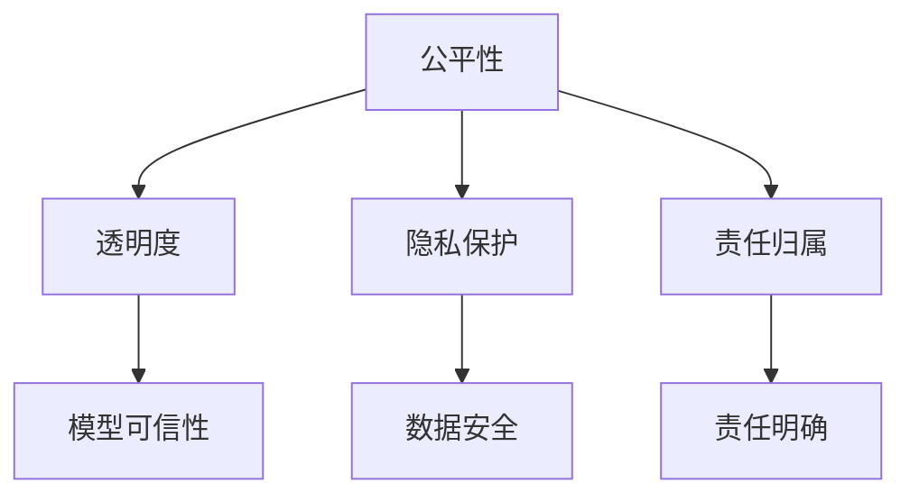

                 

# LLM 的伦理使用：道德标准和准则

在人工智能领域，伦理和道德标准一直是备受关注的话题。尤其是随着大型语言模型（Large Language Models, LLMs）的快速发展和广泛应用，如何确保这些模型的公平性、透明性和安全性成为了一个不容忽视的问题。本文将深入探讨LLM的伦理使用，从道德标准和准则的角度出发，分析其潜在风险，并提出一系列建议，以确保LLM在实际应用中的负责任使用。

## 1. 背景介绍

### 1.1 问题由来
随着深度学习和大规模数据训练技术的进步，LLMs在自然语言处理、文本生成、机器翻译等领域展现出了强大的能力。OpenAI的GPT系列、Google的BERT等模型已经证明了其在众多任务上的优势，显著提升了人工智能应用的效率和效果。然而，这些模型基于大规模无标签文本训练，不可避免地带来了一些伦理和道德上的风险。

### 1.2 问题核心关键点
LLMs的伦理问题主要集中在以下几个方面：
- **偏见与歧视**：模型可能学习到训练数据中的偏见，导致在特定群体或主题上的表现不佳。
- **透明度与可解释性**：LLMs作为"黑盒"模型，其决策过程难以理解和解释，难以满足伦理和合规要求。
- **公平性**：模型可能对不同种族、性别、年龄等群体产生不公正的输出。
- **安全与隐私**：LLMs可能被用于不道德或违法的用途，如生成虚假信息、侵犯隐私等。
- **责任与问责**：模型在产生错误输出时，责任归属问题不明确，可能引发法律和道德争议。

这些核心问题要求我们在开发和使用LLMs时，必须建立和遵守一定的伦理标准和准则，以确保模型的负责任和公平使用。

## 2. 核心概念与联系

### 2.1 核心概念概述

为了更好地理解LLMs的伦理问题，我们首先需要明确几个核心概念：

- **公平性（Fairness）**：确保模型对不同群体的表现一致，不产生歧视性输出。
- **透明度（Transparency）**：模型的决策过程可解释，用户能够理解模型的推理依据。
- **隐私保护（Privacy Protection）**：保护用户数据和隐私，防止信息泄露和滥用。
- **责任归属（Accountability）**：明确模型的责任主体，确保模型输出错误时的问责机制。

这些概念之间的逻辑关系可以通过以下Mermaid流程图来展示：



这个流程图展示了公平性、透明度、隐私保护和责任归属之间的联系和相互作用。公平性和透明度是确保模型输出公正和可信的基础，而隐私保护和责任归属则是在这个基础上，确保模型使用的合法性和道德性。

## 3. 核心算法原理 & 具体操作步骤

### 3.1 算法原理概述

LLMs的伦理使用，从算法原理上，主要依赖于以下几方面：

- **偏见检测与修正**：通过识别和消除模型中的偏见，确保模型对所有群体的公平对待。
- **可解释性增强**：通过增强模型的可解释性，使得决策过程透明，便于用户理解和使用。
- **隐私保护技术**：采用隐私保护技术，如差分隐私、联邦学习等，确保用户数据的安全和隐私。
- **责任归属机制**：明确模型开发者、用户和运营商的责任，建立问责机制。

这些技术手段的结合，可以在不同层面上确保LLMs的伦理使用。

### 3.2 算法步骤详解

以下是基于公平性、透明度、隐私保护和责任归属原则，详细讲解LLMs的伦理使用步骤：

**Step 1: 数据收集与准备**
- 收集多样性数据，确保数据集中的样本覆盖所有关键群体。
- 对数据进行清洗和标注，去除敏感信息，防止隐私泄露。

**Step 2: 模型训练与评估**
- 在清洗后的数据集上训练模型，检测和修正偏见。
- 在未见过的数据集上评估模型性能，确保公平性。
- 使用可解释性技术，如LIME、SHAP等，增强模型透明度。

**Step 3: 隐私保护措施**
- 采用差分隐私技术，在模型训练过程中添加噪声，保护个体隐私。
- 使用联邦学习，在分布式环境中训练模型，不泄露敏感数据。

**Step 4: 责任归属机制**
- 明确模型开发者、用户和运营商的责任。
- 建立错误输出时的问责机制，确保模型使用透明和公正。

**Step 5: 持续监控与反馈**
- 定期监控模型输出，检测偏见和歧视。
- 收集用户反馈，不断优化模型和应用。

### 3.3 算法优缺点

基于公平性、透明度、隐私保护和责任归属的LLMs伦理使用方法，具有以下优点：

- **提升公平性**：通过数据和模型层面的优化，确保模型对所有群体的公平对待。
- **增强透明度**：使用可解释性技术，使模型决策过程透明，便于用户理解和使用。
- **加强隐私保护**：通过差分隐私和联邦学习等技术，确保用户数据的安全和隐私。
- **明确责任归属**：建立清晰的责任机制，确保模型使用过程中的问责性。

同时，这些方法也存在一些局限性：

- **数据准备复杂**：需要收集和清洗大量多样性数据，可能涉及敏感信息的处理，耗时且繁琐。
- **技术实现难度大**：隐私保护和可解释性技术的实现，需要高水平的技术和资源支持。
- **模型性能受限**：一些公平性和透明度技术可能对模型性能产生影响，需要在性能和伦理之间寻求平衡。

尽管存在这些局限性，但基于公平性、透明度、隐私保护和责任归属的伦理使用方法，是确保LLMs负责任使用的重要手段。

### 3.4 算法应用领域

LLMs的伦理使用方法，已经在多个领域得到了应用，例如：

- **医疗健康**：确保医疗诊断和治疗的公平性、隐私保护和责任归属，避免误诊和歧视。
- **金融服务**：保护客户数据隐私，确保金融服务的公平性和透明性。
- **教育培训**：使用公平和透明的模型，提供个性化教育，避免数据滥用和隐私泄露。
- **内容创作**：确保生成内容的公平性、隐私保护和责任归属，防止虚假信息和侵权。

## 4. 数学模型和公式 & 详细讲解

### 4.1 数学模型构建

为了更准确地理解和分析LLMs的伦理问题，我们将构建几个相关的数学模型：

- **公平性模型**：通过统计方法和公平性指标（如Equalized Odds、Demographic Parity）来检测和修正模型中的偏见。
- **可解释性模型**：使用可解释性技术，如LIME、SHAP等，生成模型的特征重要性解释。
- **隐私保护模型**：采用差分隐私和联邦学习技术，保护数据隐私。
- **责任归属模型**：建立责任归属的数学模型，明确模型使用中的责任和问责机制。

### 4.2 公式推导过程

以下是公平性模型、可解释性模型和隐私保护模型的公式推导过程：

**公平性模型**
公平性检测和修正的常用方法是计算模型在不同群体上的误差，确保不同群体之间的误差差异最小化。

设模型在群体 $G$ 上的误差为 $Err(G)$，则公平性检测的公式为：

$$
Err(G) = \frac{1}{|G|} \sum_{g \in G} |\frac{1}{n_g} \sum_{i \in g} (y_i - M_{\theta}(x_i))|
$$

其中 $n_g$ 为群体 $g$ 的样本数量，$y_i$ 为真实标签，$M_{\theta}(x_i)$ 为模型输出。公平性修正的目的是通过调整模型参数，使得 $Err(G)$ 在不同群体上相等。

**可解释性模型**
可解释性技术LIME使用局部线性近似（Local Linear Approximation）来解释模型在特定输入下的输出。假设输入为 $x$，模型输出为 $y$，则LIME的公式为：

$$
\hat{f}(x) = \sum_{i=1}^{n} \alpha_i f_i(x)
$$

其中 $f_i(x)$ 为模型的特征函数，$\alpha_i$ 为权重，由LIME算法计算得到。

**隐私保护模型**
差分隐私技术通过在模型输出中加入噪声，保护个体隐私。假设模型输出为 $y$，噪声为 $\epsilon$，则差分隐私的公式为：

$$
y = M_{\theta}(x) + N(\epsilon)
$$

其中 $N(\epsilon)$ 为均值为0、方差为 $\frac{\epsilon^2}{2\delta^2}$ 的高斯噪声，$\delta$ 为隐私参数。

### 4.3 案例分析与讲解

**案例1：医疗诊断公平性**
某医疗健康应用使用GPT模型进行疾病诊断。为了确保模型对不同种族的公平性，可以收集不同种族的疾病数据，检测模型在不同种族上的诊断误差。如果发现模型在某一种族上的诊断误差显著高于其他种族，则可以通过重新训练模型，使用样本平衡技术或重新加权等方法，修正模型中的偏见。

**案例2：金融服务隐私保护**
某金融服务公司使用BERT模型进行信用评估。为了保护客户隐私，公司可以在模型训练过程中使用差分隐私技术，加入噪声保护个体数据。同时，使用联邦学习技术，在分布式环境中训练模型，不泄露敏感数据。

## 5. 项目实践：代码实例和详细解释说明

### 5.1 开发环境搭建

在进行LLMs的伦理使用实践前，我们需要准备好开发环境。以下是使用Python进行TensorFlow开发的环境配置流程：

1. 安装Anaconda：从官网下载并安装Anaconda，用于创建独立的Python环境。

2. 创建并激活虚拟环境：
```bash
conda create -n tensorflow-env python=3.8 
conda activate tensorflow-env
```

3. 安装TensorFlow：根据CUDA版本，从官网获取对应的安装命令。例如：
```bash
conda install tensorflow -c pytorch -c conda-forge
```

4. 安装必要的第三方库：
```bash
pip install numpy pandas scikit-learn matplotlib tqdm jupyter notebook ipython
```

完成上述步骤后，即可在`tensorflow-env`环境中开始伦理使用的实践。

### 5.2 源代码详细实现

这里我们以差分隐私为例，给出使用TensorFlow实现差分隐私的Python代码实现。

首先，导入必要的库和数据集：

```python
import tensorflow as tf
import numpy as np
from sklearn.datasets import make_classification
from sklearn.model_selection import train_test_split

# 生成模拟数据
X, y = make_classification(n_samples=1000, n_features=20, random_state=42)

# 将数据划分为训练集和测试集
X_train, X_test, y_train, y_test = train_test_split(X, y, test_size=0.2, random_state=42)
```

然后，定义差分隐私的参数和模型：

```python
# 差分隐私参数
epsilon = 0.1
delta = 0.01
lambda_ = 0.1

# 定义模型
model = tf.keras.Sequential([
    tf.keras.layers.Dense(64, activation='relu', input_shape=(20,)),
    tf.keras.layers.Dense(1, activation='sigmoid')
])

# 定义损失函数和优化器
loss = tf.keras.losses.BinaryCrossentropy()
optimizer = tf.keras.optimizers.Adam()
```

接着，定义差分隐私机制，并训练模型：

```python
# 定义差分隐私机制
def laplace_noise(mu, epsilon, delta):
    return tf.random.normal(shape=(), mean=mu, stddev=lambda_ / epsilon)

# 在每个batch中添加噪声
@tf.function
def train_step(data, labels):
    with tf.GradientTape() as tape:
        predictions = model(data, training=True)
        loss_value = loss(y_true=labels, y_pred=predictions)
    gradients = tape.gradient(loss_value, model.trainable_variables)
    noise = laplace_noise(tf.reduce_mean(gradients), epsilon, delta)
    optimizer.apply_gradients(zip(gradients + noise, model.trainable_variables))
    
# 训练模型
model.compile(optimizer=optimizer, loss=loss, metrics=['accuracy'])
model.fit(X_train, y_train, epochs=10, batch_size=32)
```

最后，评估模型的差分隐私效果：

```python
# 评估模型
model.evaluate(X_test, y_test)
```

以上就是一个使用TensorFlow实现差分隐私的完整代码实现。可以看到，通过在梯度中加入噪声，我们实现了差分隐私保护机制，保护了模型训练过程中的隐私。

### 5.3 代码解读与分析

让我们再详细解读一下关键代码的实现细节：

**生成模拟数据**：
- 使用`make_classification`函数生成一个20维特征、1000个样本的模拟数据集，用于训练和测试差分隐私模型。

**定义差分隐私参数和模型**：
- 定义差分隐私参数 $\epsilon$ 和 $\delta$，以及模型结构。

**差分隐私机制**：
- 定义差分隐私机制 `laplace_noise`，通过Laplace分布生成噪声，添加到梯度中。

**模型训练**：
- 使用TensorFlow的`@tf.function`装饰器定义训练函数 `train_step`，在其中加入差分隐私机制。
- 训练模型，并评估模型性能。

可以看到，通过差分隐私机制，我们可以在保护隐私的前提下，进行模型训练和评估。这为LLMs的伦理使用提供了重要技术保障。

## 6. 实际应用场景

### 6.1 医疗健康

医疗健康领域对公平性和隐私保护有极高要求。使用差分隐私和公平性检测技术，可以确保医疗诊断和治疗的公正性和隐私性。例如，使用差分隐私技术保护患者数据，防止数据泄露和滥用，同时通过公平性检测，确保不同种族、性别等群体在诊断和治疗上的公平性。

### 6.2 金融服务

金融服务涉及大量敏感数据，隐私保护尤为重要。通过差分隐私和联邦学习技术，可以在不泄露客户数据的前提下，进行信用评估和风险管理。例如，使用差分隐私保护客户信用记录，同时通过联邦学习，在分布式环境中训练信用评估模型，不泄露敏感数据。

### 6.3 教育培训

教育培训领域对公平性和透明度要求较高。使用公平性和可解释性技术，可以提供个性化教育，避免数据滥用和隐私泄露。例如，使用公平性检测技术，确保不同性别、年龄等群体在教育资源分配上的公平性，同时通过可解释性技术，解释模型在个性化推荐中的决策依据。

## 7. 工具和资源推荐

### 7.1 学习资源推荐

为了帮助开发者系统掌握LLMs的伦理使用理论基础和实践技巧，这里推荐一些优质的学习资源：

1. 《AI伦理与道德》课程：由知名AI伦理学家和学者主讲，涵盖AI伦理的基础理论和应用实践。

2. 《深度学习与伦理学》书籍：详细讲解深度学习中的伦理问题和解决方案，适合初学者和进阶开发者。

3. 《AI伦理指南》白皮书：由AI伦理委员会发布，提供全面系统的大数据和AI伦理指南。

4. AI伦理论坛：由AI学术机构和产业界共同发起的伦理讨论平台，汇集AI伦理专家和从业者，交流思想和实践经验。

5. AI伦理技术库：提供AI伦理技术的开源实现和工具库，便于开发者实践和应用。

通过对这些资源的学习实践，相信你一定能够全面掌握LLMs的伦理使用，并用于解决实际的AI伦理问题。

### 7.2 开发工具推荐

高效的开发离不开优秀的工具支持。以下是几款用于LLMs伦理使用开发的常用工具：

1. TensorFlow：基于Python的开源深度学习框架，生产部署方便，支持差分隐私和联邦学习等隐私保护技术。

2. PyTorch：灵活动态的计算图，适合研究性开发，支持可解释性技术，如LIME、SHAP等。

3. TensorBoard：TensorFlow配套的可视化工具，可实时监测模型训练状态，提供丰富的图表呈现方式，方便调试。

4. Keras：简单易用的深度学习框架，适合快速原型开发，支持多种预训练模型。

5. Weights & Biases：模型训练的实验跟踪工具，可以记录和可视化模型训练过程中的各项指标，方便对比和调优。

6. TensorFlow Privacy：TensorFlow的隐私保护库，提供差分隐私、联邦学习等隐私保护技术，方便开发者实践。

合理利用这些工具，可以显著提升LLMs伦理使用的开发效率，加快创新迭代的步伐。

### 7.3 相关论文推荐

LLMs的伦理使用技术的发展源于学界的持续研究。以下是几篇奠基性的相关论文，推荐阅读：

1. "Fairness in Machine Learning: What Do We Know?"：综述了机器学习中的公平性问题及其解决方案。

2. "Practical Privacy-Preserving Deep Learning"：介绍了差分隐私和联邦学习在深度学习中的应用。

3. "Explaining Deep Learning Models"：综述了深度学习模型的可解释性技术及其应用。

4. "Accountability in AI"：探讨了AI系统的责任归属问题及其解决方案。

这些论文代表了大语言模型伦理使用技术的发展脉络。通过学习这些前沿成果，可以帮助研究者把握学科前进方向，激发更多的创新灵感。

## 8. 总结：未来发展趋势与挑战

### 8.1 总结

本文对基于公平性、透明度、隐私保护和责任归属的LLMs伦理使用进行了全面系统的介绍。首先阐述了LLMs的伦理问题，明确了数据准备、模型训练、隐私保护和责任归属等关键环节。其次，从算法原理和操作步骤上，详细讲解了差分隐私、公平性检测和可解释性技术的应用。最后，给出了LLMs伦理使用的实际应用场景，并推荐了相关的学习资源和开发工具。

通过本文的系统梳理，可以看到，LLMs的伦理使用是确保模型负责任使用的重要手段。这些技术手段的结合，可以在不同层面上确保LLMs的公平性、透明性和隐私保护，从而在实际应用中发挥更大的价值。

### 8.2 未来发展趋势

展望未来，LLMs的伦理使用技术将呈现以下几个发展趋势：

1. **多维度伦理评估**：未来的伦理使用将更加注重多维度评估，如可解释性、责任归属、隐私保护、公平性等。通过综合评估，确保模型在各个方面的全面合规。

2. **动态伦理监控**：实时监控模型输出，动态调整伦理策略，确保模型在实际应用中始终满足伦理要求。例如，通过持续监控检测模型中的偏见和歧视，及时调整训练数据和模型参数。

3. **隐私保护技术演进**：隐私保护技术将不断演进，从差分隐私、联邦学习等技术，向零知识证明、同态加密等更高级技术发展。这些技术将提供更强的隐私保护能力，保障用户数据安全。

4. **可解释性增强**：可解释性技术将不断进步，从基于局部近似到基于全局解释，从模型参数到模型结构，逐步提升模型透明度。这将使模型决策过程更加透明，便于用户理解和信任。

5. **公平性提升**：公平性检测和修正技术将不断优化，从统计方法到因果分析，逐步提升模型对所有群体的公平对待能力。这将使得模型更加公正、透明，减少偏见和歧视。

这些趋势凸显了LLMs伦理使用的广阔前景。这些方向的探索发展，必将进一步提升LLMs的伦理水平，为构建负责任的智能系统提供坚实保障。

### 8.3 面临的挑战

尽管LLMs的伦理使用技术已经取得了一定的进展，但在迈向更加智能化、普适化应用的过程中，仍面临诸多挑战：

1. **数据收集困难**：获取高质量、多样化的数据集，特别是在医疗、法律等敏感领域，面临数据收集的巨大挑战。

2. **技术实现复杂**：隐私保护和可解释性技术的实现，需要高水平的技术和资源支持，特别是在分布式和大规模数据环境中。

3. **伦理标准差异**：不同国家和地区对AI伦理标准的理解存在差异，如何在全球范围内实现一致的伦理标准，仍是一个难题。

4. **社会接受度低**：公众对AI伦理问题的认知不足，难以理解和接受复杂的伦理问题。如何普及AI伦理知识，提升社会接受度，仍然是一个重要挑战。

5. **模型复杂性高**：大型语言模型结构复杂，难以全面理解其内部工作机制，导致伦理问题难以全面检测和解决。

这些挑战要求我们在实践中不断探索和创新，寻求更有效的解决方案。唯有通过多方协作，才能更好地推动LLMs伦理使用的广泛应用，确保AI技术的健康发展。

### 8.4 研究展望

未来的研究需要在以下几个方面寻求新的突破：

1. **跨领域伦理框架**：建立跨领域的伦理框架，确保在不同领域和应用场景中，模型都能满足统一的伦理标准。

2. **模型可解释性技术**：开发更加全面、透明的可解释性技术，增强模型的透明度和可信性。

3. **隐私保护新技术**：探索新的隐私保护技术，如零知识证明、同态加密等，提升隐私保护能力。

4. **公平性提升方法**：研究更有效的公平性检测和修正方法，提升模型对所有群体的公平对待能力。

5. **伦理标准标准化**：推动全球范围内的伦理标准统一和标准化，建立国际伦理认证机制。

这些研究方向的探索，将进一步提升LLMs的伦理水平，确保其在实际应用中的负责任和公平使用。

## 9. 附录：常见问题与解答

**Q1：如何确保模型在不同群体上的公平性？**

A: 可以通过公平性检测和修正技术，确保模型在不同群体上的表现一致。例如，使用统计方法计算模型在不同群体上的误差，通过重新训练模型，使用样本平衡技术或重新加权等方法，修正模型中的偏见。

**Q2：差分隐私和联邦学习如何保护数据隐私？**

A: 差分隐私通过在模型输出中加入噪声，保护个体隐私。联邦学习通过在分布式环境中训练模型，不泄露敏感数据。这些技术可以在保证模型性能的同时，保护用户数据隐私。

**Q3：如何解释复杂模型的决策过程？**

A: 使用可解释性技术，如LIME、SHAP等，生成模型的特征重要性解释。这些技术可以通过局部近似和全局解释，逐步提升模型的透明度和可信性。

**Q4：如何在模型训练中实现公平性和隐私保护？**

A: 在模型训练过程中，可以使用公平性检测和差分隐私等技术，确保模型在不同群体上的公平性和隐私保护。例如，在训练过程中加入噪声，保护个体数据隐私。

**Q5：如何构建负责任的AI伦理框架？**

A: 构建负责任的AI伦理框架，需要从数据准备、模型训练、隐私保护和责任归属等多个方面进行综合考虑。建立跨领域的伦理标准和认证机制，确保模型在不同领域和应用场景中，都能满足统一的伦理要求。

---

作者：禅与计算机程序设计艺术 / Zen and the Art of Computer Programming

