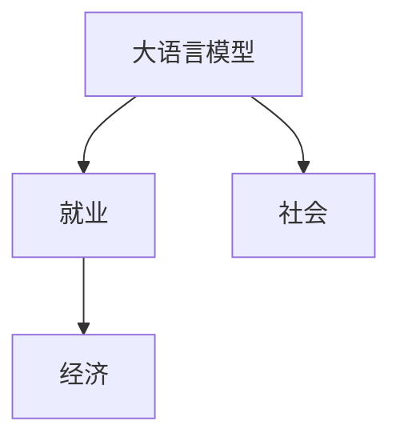

                 

# LLM 的社会影响：就业、经济和社会变革

在人工智能快速发展的大背景下，大语言模型（LLM）作为其中的佼佼者，以其惊人的语言理解和生成能力，正在深刻改变着我们的生产方式和社会形态。本文将从就业、经济和社会变革三个维度，全面探讨LLM的社会影响，并展望其未来的发展趋势。

## 1. 背景介绍

### 1.1 什么是大语言模型（LLM）

大语言模型（Large Language Model，LLM）是指一类能够处理大规模语言数据的深度学习模型。LLM通常基于自回归或自编码架构，如GPT、BERT、T5等，通过预训练和微调等技术，能够在各种自然语言处理（NLP）任务上取得优异性能。

### 1.2 LLM在社会中的作用

LLM正在迅速改变着我们的工作方式、商业模式和社会交流。从自动客服、智能助手，到自然语言生成、内容创作，再到机器翻译、问答系统，LLM的应用范围几乎无所不包，正在重塑人类与信息交互的方式。

## 2. 核心概念与联系

### 2.1 核心概念概述

为更好地理解LLM的社会影响，本节将介绍几个关键概念：

- **就业**：LLM能够自动处理重复性、低附加值的工作，提高生产效率，但同时也可能导致部分职业的消失和重新分配。
- **经济**：LLM的广泛应用将带来生产力的提升和成本的降低，改变产业结构，促进新兴经济形态的形成。
- **社会**：LLM将改变信息传播、人际交往、文化表达等社会活动，形成新的社会结构和价值观。

### 2.2 核心概念原理和架构的 Mermaid 流程图



### 2.3 关键概念之间的关系

LLM作为一类通用的语言处理模型，通过提高效率、降低成本，在就业、经济和社会变革中扮演着关键角色。

## 3. 核心算法原理 & 具体操作步骤

### 3.1 算法原理概述

LLM的算法原理基于自监督学习、预训练和微调。其主要步骤如下：

1. 数据预处理：收集大规模无标签文本数据，进行分词、标记等预处理。
2. 预训练：在预训练任务（如语言模型、掩码语言模型）上进行自监督训练，学习语言规律和知识。
3. 微调：在特定任务上，如分类、生成、翻译等，进行有监督微调，提升模型在该任务上的性能。

### 3.2 算法步骤详解

1. **数据预处理**：将大规模文本数据进行分词、标记、转换为模型输入格式等预处理。
2. **预训练**：在预训练任务上，使用自监督学习方法（如语言模型、掩码语言模型）对模型进行训练。
3. **微调**：在特定任务上，使用少量标注数据进行微调，提升模型在该任务上的性能。

### 3.3 算法优缺点

**优点**：
- 泛化能力强，能够处理各种复杂的NLP任务。
- 通过预训练和微调，可以在少量标注数据下取得优异性能。
- 适用于大规模数据集，能够学习到丰富的语言知识。

**缺点**：
- 对数据质量要求高，预训练和微调过程中容易过拟合。
- 模型训练和微调需要大量的计算资源，成本较高。
- 对于一些特定领域的任务，预训练模型的泛化能力可能不足。

### 3.4 算法应用领域

LLM的应用领域非常广泛，涵盖医疗、金融、教育、法律、娱乐等多个行业。以下是一些典型应用：

- **医疗**：利用LLM进行病历分析、病理诊断、药物研发等。
- **金融**：用于舆情分析、风险评估、智能投顾等。
- **教育**：智能教学、自动评分、知识推荐等。
- **法律**：合同审核、判例分析、法律文书生成等。
- **娱乐**：内容创作、自动字幕生成、故事生成等。

## 4. 数学模型和公式 & 详细讲解 & 举例说明

### 4.1 数学模型构建

LLM的数学模型通常基于Transformer架构，采用自回归或自编码方式进行训练。其核心模型是自回归语言模型：

$$
P(x_1, x_2, ..., x_n | y_1, y_2, ..., y_n) = \prod_{i=1}^n P(x_i | y_{<i})
$$

其中，$x_1, x_2, ..., x_n$ 表示输入文本，$y_1, y_2, ..., y_n$ 表示目标文本。

### 4.2 公式推导过程

在自回归语言模型中，输入文本 $x$ 的生成概率 $P(x)$ 可以通过条件概率 $P(x_i|x_{<i})$ 递推计算：

$$
P(x) = \prod_{i=1}^n P(x_i | x_{<i})
$$

其中 $P(x_i|x_{<i})$ 表示给定前 $i-1$ 个词 $x_{<i}$，第 $i$ 个词 $x_i$ 的生成概率。

### 4.3 案例分析与讲解

以BERT模型为例，其预训练任务是掩码语言模型：

$$
P(\tilde{x}_1, \tilde{x}_2, ..., \tilde{x}_n | x_1, x_2, ..., x_n) = \prod_{i=1}^n P(\tilde{x}_i | x_{<i})
$$

其中 $\tilde{x}_i$ 表示被掩码的词，$x_{<i}$ 表示其前 $i-1$ 个词。

## 5. 项目实践：代码实例和详细解释说明

### 5.1 开发环境搭建

- **环境配置**：
  - 安装Anaconda，创建虚拟环境。
  - 安装PyTorch、TensorFlow等深度学习框架。
  - 下载预训练的BERT模型。

- **代码实现**：
  ```python
  import torch
  from transformers import BertTokenizer, BertForMaskedLM
  from torch.utils.data import Dataset, DataLoader
  
  tokenizer = BertTokenizer.from_pretrained('bert-base-uncased')
  model = BertForMaskedLM.from_pretrained('bert-base-uncased')
  ```

### 5.2 源代码详细实现

- **数据预处理**：
  - 定义数据集类。
  - 使用Tokenizer对文本进行分词。
  - 构建数据加载器。

- **模型微调**：
  - 定义微调函数。
  - 设置训练参数。
  - 进行模型训练。

- **结果展示**：
  - 输出训练过程中模型性能的变化。
  - 使用微调后的模型对新文本进行推理。

### 5.3 代码解读与分析

- **数据集类定义**：
  ```python
  class MaskedLMData(Dataset):
      def __init__(self, texts):
          self.texts = texts
      def __getitem__(self, idx):
          text = self.texts[idx]
          tokens = tokenizer.tokenize(text)
          # 对文本进行掩码
          # 获取掩码位置和掩码后的文本
          return {'input_ids': tokenizer.convert_tokens_to_ids(tokens), 'masked_lm_labels': []}
      def __len__(self):
          return len(self.texts)
  ```

- **微调函数定义**：
  ```python
  def fine_tune(model, dataloader, optimizer):
      model.train()
      for batch in dataloader:
          input_ids = batch['input_ids']
          labels = batch['masked_lm_labels']
          optimizer.zero_grad()
          outputs = model(input_ids)
          loss = outputs.loss
          loss.backward()
          optimizer.step()
  ```

- **训练参数设置**：
  ```python
  model.to(device)
  optimizer = torch.optim.Adam(model.parameters(), lr=2e-5)
  epochs = 10
  batch_size = 32
  ```

## 6. 实际应用场景

### 6.1 就业市场变化

- **岗位变化**：自动化和智能化的提升使得许多重复性、低技能岗位消失，如数据录入、客服等，但同时也产生了大量需要高技能的岗位，如模型训练、算法优化、数据标注等。
- **技能要求**：对人工智能、机器学习等技术的要求增加，要求从业者具备更强的数学和编程能力。
- **职业转型**：许多现有职业需要进行技能提升和转型，以适应新的工作环境。

### 6.2 经济形态变革

- **产业结构变化**：人工智能将加速传统产业的数字化转型，提升生产效率，推动经济结构优化。
- **新兴经济形态**：如智能客服、在线教育、智能医疗等，将带来新的增长点。
- **创新驱动**：LLM将促进跨领域创新，推动技术进步和产业升级。

### 6.3 社会变革

- **信息传播**：LLM将改变信息的获取和传播方式，提升信息获取的速度和准确性。
- **人际交往**：自然语言处理技术将使得人际交往更加高效，提高沟通质量。
- **文化表达**：LLM将改变内容创作的方式，推动文化的多样性和创新。

## 7. 工具和资源推荐

### 7.1 学习资源推荐

- **课程**：
  - CS224N《深度学习自然语言处理》课程：斯坦福大学开设的NLP明星课程，有Lecture视频和配套作业。
  - 《Transformer from Scratch》博文系列：详细讲解Transformer的原理和实现。

- **书籍**：
  - 《Natural Language Processing with Transformers》：由Transformer库作者撰写，全面介绍NLP任务开发。
  - 《Deep Learning for Natural Language Processing》：深入讲解NLP中的深度学习模型和算法。

- **资源**：
  - HuggingFace官方文档：提供预训练模型的下载和微调样例代码。
  - CLUE开源项目：包含大量中文NLP数据集，有助于微调中文模型。

### 7.2 开发工具推荐

- **框架**：
  - PyTorch：基于Python的深度学习框架，灵活高效。
  - TensorFlow：由Google主导的开源框架，便于生产部署。
  - Transformers库：提供多种预训练模型的封装，便于微调开发。

- **工具**：
  - Weights & Biases：实验跟踪工具，记录和可视化模型训练过程。
  - TensorBoard：TensorFlow配套的可视化工具，实时监测训练状态。

### 7.3 相关论文推荐

- **BERT论文**：BERT的提出改变了NLP领域的研究方向，利用掩码语言模型进行预训练。
- **GPT论文**：GPT系列的自回归语言模型，展示了LLM在自然语言生成任务上的强大能力。
- **AdaLoRA论文**：提出AdaLoRA方法，在参数高效微调上取得了新的突破。

## 8. 总结：未来发展趋势与挑战

### 8.1 研究成果总结

大语言模型LLM在就业、经济和社会变革中发挥着重要作用，推动了产业结构的升级和经济形态的转型。其泛化能力强、学习速度快，广泛应用于各种NLP任务中。

### 8.2 未来发展趋势

1. **技术进步**：
   - 模型规模不断扩大，参数量将进一步增加。
   - 算法创新不断涌现，如参数高效微调、因果推断等。
   - 多模态处理将融合视觉、听觉等多种数据，提升模型的理解和生成能力。

2. **应用扩展**：
   - 从通用NLP任务扩展到更垂直的应用领域，如医疗、法律、教育等。
   - 新的应用场景不断涌现，如智能家居、智慧城市等。
   - 推动各行各业的数字化转型和智能化升级。

### 8.3 面临的挑战

1. **技术瓶颈**：
   - 大规模训练和微调需要高性能计算资源。
   - 模型训练和推理效率需进一步提升。
   - 模型鲁棒性和泛化能力需进一步增强。

2. **伦理和安全**：
   - 数据隐私和安全问题需引起重视。
   - 模型偏见和歧视需有效避免。
   - 用户可解释性需增强，确保算法的透明性和公平性。

### 8.4 研究展望

1. **参数高效微调**：
   - 研究更高效的参数微调方法，减少对计算资源的需求。
   - 探索自适应、分布式微调算法，提升微调效率。

2. **多模态处理**：
   - 融合视觉、听觉等多种数据源，提升模型的泛化能力。
   - 研究跨模态对齐、融合技术，推动多模态应用发展。

3. **伦理与安全**：
   - 引入伦理导向的训练目标，避免有害输出。
   - 建立用户隐私保护机制，确保数据安全。
   - 增强模型的可解释性，提升用户信任度。

## 9. 附录：常见问题与解答

**Q1：如何应对LLM带来的就业影响？**

A: 应对就业影响需要多方面努力：
- **职业培训**：开展职业培训和技能提升，帮助现有员工适应新的岗位需求。
- **再就业政策**：政府制定再就业政策，帮助失业人员重新就业。
- **跨行业转型**：鼓励员工向高技能、高需求的新兴领域转型。

**Q2：如何提升LLM模型的鲁棒性？**

A: 提升LLM模型的鲁棒性可以从以下几个方面入手：
- **数据增强**：扩充训练数据集，引入更多样化的数据。
- **对抗训练**：引入对抗样本，提高模型的鲁棒性。
- **正则化技术**：使用L2正则、Dropout等技术，防止过拟合。
- **多模型集成**：训练多个模型，取平均输出，提高鲁棒性。

**Q3：如何确保LLM模型的公平性和可解释性？**

A: 确保LLM模型的公平性和可解释性可以从以下方面着手：
- **公平性指标**：引入公平性指标，监控模型的偏见和歧视。
- **可解释性模型**：使用可解释性模型，提高模型的透明度。
- **用户反馈**：建立用户反馈机制，收集用户对模型的意见，持续优化模型。

**Q4：如何应对LLM在数据隐私和安全方面的挑战？**

A: 应对数据隐私和安全的挑战，可以采取以下措施：
- **数据匿名化**：对数据进行匿名化处理，保护用户隐私。
- **数据加密**：采用数据加密技术，防止数据泄露。
- **访问控制**：建立严格的访问控制机制，确保数据安全。
- **隐私保护算法**：使用差分隐私等隐私保护算法，保障数据隐私。

---

作者：禅与计算机程序设计艺术 / Zen and the Art of Computer Programming

