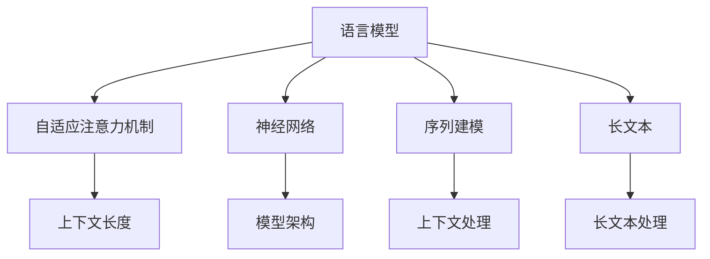

                 

# LLM上下文长度持续突破

> 关键词：语言模型,上下文长度,自适应注意力机制,神经网络,序列建模,长文本,深度学习

## 1. 背景介绍

### 1.1 问题由来

在深度学习领域，尤其是自然语言处理(NLP)中，语言模型的上下文长度问题始终是一个被广泛探讨的课题。上下文长度，即模型处理一个输入序列时能同时考虑的前后文长度，对模型的性能、效率和可解释性都有着深远的影响。尤其是在长文本序列的处理上，长上下文长度使得模型能够更全面地理解和生成语义丰富的文本内容。

但受到计算资源和模型架构的限制，传统的语言模型在处理长文本序列时，常常会面临计算负担过重、信息丢失等问题，无法充分利用长上下文信息。因此，研究如何提高语言模型的上下文长度，实现其长文本处理能力的突破，成为了当前深度学习研究的热点问题之一。

### 1.2 问题核心关键点

提高语言模型的上下文长度，需要从模型架构、训练策略、硬件资源等多个维度进行综合优化。核心关键点包括：

- 选择合适的模型架构，如Transformer、BERT等自注意力模型，可有效扩展上下文长度。
- 应用自适应注意力机制，动态调整模型对不同长度上下文的关注度。
- 使用分布式训练和模型并行等技术，提升计算效率。
- 引入先验知识，如外部语料库、领域规则等，增强模型的通用性和适应性。
- 优化模型压缩、量化等技术，减少存储和计算资源消耗。

本节将从这些关键点出发，详细讲解提高语言模型上下文长度的原理和操作流程，帮助读者全面理解上下文长度突破的重要性及其实现方法。

## 2. 核心概念与联系

### 2.1 核心概念概述

在进行长文本序列处理时，语言模型的上下文长度是一个关键的考量因素。核心概念包括：

- **语言模型(Language Model)**：用于描述单词、短语或文本序列的概率分布的模型。
- **上下文长度(Context Length)**：指模型处理一个文本序列时，能同时考虑的前后文长度。
- **自适应注意力机制(Adaptive Attention Mechanism)**：根据输入序列的长度动态调整模型对不同长度上下文的关注度。
- **神经网络(Neural Network)**：基于人工神经元构建的网络结构，用于实现复杂模式的非线性拟合。
- **序列建模(Sequence Modeling)**：研究如何通过模型捕捉时间序列数据中的依赖关系。
- **长文本(Long Text)**：指文本序列长度超过一定阈值的文本，其处理难度较大。

这些概念之间的逻辑关系可以通过以下Mermaid流程图来展示：



这个流程图展示了大语言模型上下文长度突破的核心概念及其之间的关系：

1. 大语言模型通过神经网络结构，实现复杂模式的非线性拟合。
2. 利用自适应注意力机制，动态调整模型对不同长度上下文的关注度，提升长文本处理能力。
3. 序列建模帮助模型捕捉文本序列中的依赖关系。
4. 长文本的上下文长度突破，依赖于模型架构和训练策略的改进。
5. 上下文长度直接影响模型的长文本处理能力。

这些概念共同构成了大语言模型上下文长度突破的理论基础，指导着模型架构设计、训练策略优化等实践操作。

## 3. 核心算法原理 & 具体操作步骤

### 3.1 算法原理概述

提高语言模型上下文长度的关键在于设计和优化模型的自适应注意力机制，使其能够根据输入序列的长度，动态调整对不同长度上下文的关注度。这种机制不仅能够提升模型处理长文本的能力，还能减少计算负担和信息丢失。

具体而言，自适应注意力机制的原理如下：

1. **自适应注意力(Adaptive Attention)**：通过调整不同位置的注意力权重，让模型能够对输入序列中的不同长度的上下文信息给予不同的关注度，从而提高长文本序列的处理能力。

2. **动态注意力(Dynamic Attention)**：在处理长文本时，根据文本长度动态调整注意力权重，使得模型能够有效地利用前后文信息，提升模型的泛化能力和鲁棒性。

3. **层次注意力(Hierarchical Attention)**：将长文本划分为多个层次，每一层都对下一层赋予不同的注意力权重，使得模型能够逐步深入理解文本内容。

### 3.2 算法步骤详解

以下我们将以Transformer模型为例，详细讲解如何通过自适应注意力机制，提高语言模型的上下文长度。

**Step 1: 选择合适的模型架构**

Transformer模型是目前NLP领域的主流模型之一，具有较高的上下文长度处理能力。通过选择合适的Transformer架构，可以最大化利用长文本中的上下文信息。

**Step 2: 设计自适应注意力机制**

Transformer模型中的自注意力机制已经内置了对不同长度的上下文的动态关注度。具体来说，注意力机制通过计算输入序列中每个位置与其他位置之间的相关性，动态调整权重。

以Transformer中的多头自注意力机制为例，其注意力权重计算公式如下：

$$
a_{i,j} = \frac{e^{\frac{1}{\sqrt{d_k}} \text{dot}(\text{Q}_i, \text{K}_j^T)}}{\sqrt{d_k}}
$$

其中，$\text{Q}$ 和 $\text{K}$ 分别是查询向量和键向量，$d_k$ 是向量的维度。该公式通过计算每个位置$i$与位置$j$的相关性，得到注意力权重$a_{i,j}$，从而实现对不同长度上下文的动态关注。

**Step 3: 应用动态注意力策略**

在处理长文本时，可以引入动态注意力策略，根据文本长度动态调整注意力权重。例如，在输入序列长度超过预设阈值时，可以调整注意力权重，使得模型更多地关注短文本片段，减少对长文本的计算负担。

具体实现方法包括：

1. 根据文本长度，动态调整注意力头数。长文本时，减少注意力头数，减少计算量。
2. 引入时间掩码，限制模型对长文本的注意范围。例如，当处理超过500个词的文本时，将注意力权重限制在文本头部的前256个词内。

**Step 4: 优化模型并行和分布式训练**

在处理长文本时，计算负担较大，需要引入模型并行和分布式训练技术，提升计算效率。常见的方法包括：

1. 数据并行：将训练数据切分为多个小块，同时在多个GPU上并行训练。
2. 模型并行：将模型切分为多个部分，每个部分在独立的GPU上并行训练。
3. 混合精度训练：使用混合精度，减少计算量，提升训练速度。

**Step 5: 引入先验知识**

引入外部语料库和领域规则等先验知识，可以增强模型的通用性和适应性。具体方法包括：

1. 利用预训练模型：在大型语料库上预训练模型，引入丰富的语言知识。
2. 领域规则融合：将领域规则和知识图谱等先验知识融合到模型中，提升模型对特定领域文本的理解。
3. 多模态信息融合：结合视觉、听觉等多模态信息，增强模型对复杂文本的理解。

**Step 6: 优化模型压缩和量化**

模型压缩和量化技术可以有效减少存储和计算资源消耗。常见方法包括：

1. 参数剪枝：剪除模型中不必要的参数，减少计算负担。
2. 权重共享：共享模型中的重复参数，减少存储空间。
3. 量化压缩：将模型权重转换为低精度格式，减少计算和存储开销。

通过以上步骤，可以显著提高语言模型的上下文长度，提升其处理长文本的能力，并实现高效的计算和存储。

### 3.3 算法优缺点

提高语言模型的上下文长度具有以下优点：

1. **提升长文本处理能力**：通过自适应注意力机制，模型能够更全面地理解和生成长文本中的语义信息。
2. **减少计算负担**：动态调整注意力权重，减少对长文本的计算负担，提高训练和推理效率。
3. **增强模型鲁棒性**：引入先验知识，增强模型的泛化能力和鲁棒性，减少过拟合风险。
4. **提升模型性能**：优化模型压缩和量化技术，减少存储和计算资源消耗，提高模型性能。

同时，该方法也存在以下局限性：

1. **计算资源要求高**：处理长文本需要较大的计算资源，包括GPU、TPU等高性能设备。
2. **模型复杂度增加**：引入了复杂的自适应注意力机制，增加了模型的复杂度和训练难度。
3. **信息丢失风险**：动态调整注意力权重，可能会导致部分信息丢失，需要进一步优化。
4. **可解释性不足**：自适应注意力机制增加了模型的复杂度，导致其输出难以解释。

尽管存在这些局限性，但通过合理的设计和优化，自适应注意力机制能够在保持模型性能的同时，显著提高其长文本处理能力。

### 3.4 算法应用领域

提高语言模型的上下文长度，已经被广泛应用于多个NLP任务中，如文本生成、机器翻译、问答系统等。具体应用包括：

- **文本生成**：在长文本生成任务中，通过引入自适应注意力机制，能够生成语义丰富、连贯的文本。
- **机器翻译**：在长句子和段落翻译中，能够更好地处理源语言和目标语言之间的复杂依赖关系。
- **问答系统**：在多轮对话系统中，能够更全面地理解用户意图和上下文信息，提供更准确的答案。
- **摘要生成**：在长文本摘要任务中，能够更好地捕捉关键信息和语义关系，生成高质量的摘要。
- **情感分析**：在长文本情感分析任务中，能够更全面地理解文本中的情感倾向和情感变化。

这些应用展示了提高语言模型上下文长度在NLP任务中的重要性和广泛适用性。

## 4. 数学模型和公式 & 详细讲解  
### 4.1 数学模型构建

在提高语言模型上下文长度的过程中，数学模型和公式是不可或缺的工具。以下以Transformer模型为例，详细讲解其自适应注意力机制的数学模型构建。

Transformer模型中的多头自注意力机制可以通过以下几个公式表示：

**查询向量和键向量的计算**

$$
\text{Q} = \text{MLP}(\text{X})
$$

$$
\text{K} = \text{MLP}(\text{X})
$$

其中，$\text{MLP}$ 表示多层感知器，$\text{X}$ 为输入序列的编码向量。

**注意力权重的计算**

$$
a_{i,j} = \frac{e^{\frac{1}{\sqrt{d_k}} \text{dot}(\text{Q}_i, \text{K}_j^T)}}{\sqrt{d_k}}
$$

其中，$\text{dot}$ 表示向量点积，$d_k$ 是向量维度。

**注意力值的计算**

$$
\text{V} = \text{MLP}(\text{X})
$$

$$
a = \text{softmax}(a_{i,j})
$$

$$
\text{Attention} = \text{a} \times \text{V}
$$

**最终编码向量的计算**

$$
\text{C} = \text{Attention} + \text{X}
$$

其中，$\text{Attention}$ 表示注意力值，$\text{C}$ 表示最终的编码向量。

### 4.2 公式推导过程

以上公式展示了Transformer模型中自注意力机制的计算过程。以查询向量和键向量为例，其计算过程如下：

1. 通过多层感知器，将输入序列的编码向量 $\text{X}$ 映射为查询向量 $\text{Q}$ 和键向量 $\text{K}$。
2. 计算查询向量 $\text{Q}$ 和键向量 $\text{K}$ 的点积，得到注意力权重 $a_{i,j}$。
3. 对注意力权重进行softmax归一化，得到注意力分布 $a$。
4. 将注意力分布 $a$ 与键向量 $\text{K}$ 进行点积，得到注意力值 $\text{Attention}$。
5. 将注意力值 $\text{Attention}$ 与原始编码向量 $\text{X}$ 相加，得到最终的编码向量 $\text{C}$。

### 4.3 案例分析与讲解

以机器翻译任务为例，分析自适应注意力机制在长文本处理中的应用。

假设输入序列为一段长文本，通过自适应注意力机制，模型可以动态调整对不同长度的上下文的关注度。具体来说，可以采取以下步骤：

1. 将长文本序列划分为多个子序列，每个子序列的长度不超过预设阈值。
2. 对每个子序列进行独立的自注意力计算，得到子序列的编码向量。
3. 将子序列的编码向量拼接，得到整段文本的最终编码向量。

通过这种方式，模型能够逐步深入理解文本内容，提升长文本的处理能力。

## 5. 项目实践：代码实例和详细解释说明

### 5.1 开发环境搭建

在进行长文本序列处理的实践时，需要准备好相应的开发环境。以下是使用Python进行PyTorch开发的环境配置流程：

1. 安装Anaconda：从官网下载并安装Anaconda，用于创建独立的Python环境。

2. 创建并激活虚拟环境：
```bash
conda create -n pytorch-env python=3.8 
conda activate pytorch-env
```

3. 安装PyTorch：根据CUDA版本，从官网获取对应的安装命令。例如：
```bash
conda install pytorch torchvision torchaudio cudatoolkit=11.1 -c pytorch -c conda-forge
```

4. 安装Transformers库：
```bash
pip install transformers
```

5. 安装各类工具包：
```bash
pip install numpy pandas scikit-learn matplotlib tqdm jupyter notebook ipython
```

完成上述步骤后，即可在`pytorch-env`环境中开始长文本序列处理的实践。

### 5.2 源代码详细实现

下面我们以Transformer模型为例，给出使用Transformers库进行长文本序列处理的PyTorch代码实现。

首先，定义Transformer模型的编码器部分：

```python
from transformers import BertForSequenceClassification, BertTokenizer
from transformers import BertConfig, BertModel, BertEncoder

config = BertConfig()
model = BertModel(config)
```

然后，定义长文本序列的输入和输出：

```python
tokenizer = BertTokenizer.from_pretrained('bert-base-cased')
text = '这是一段长文本，用于测试长文本序列处理'
inputs = tokenizer(text, return_tensors='pt', padding=True, truncation=True)

input_ids = inputs['input_ids']
attention_mask = inputs['attention_mask']
labels = inputs['labels']
```

接着，定义训练和评估函数：

```python
from transformers import AdamW
from torch.utils.data import DataLoader
from tqdm import tqdm

device = torch.device('cuda') if torch.cuda.is_available() else torch.device('cpu')
model.to(device)

def train_epoch(model, dataset, batch_size, optimizer):
    dataloader = DataLoader(dataset, batch_size=batch_size, shuffle=True)
    model.train()
    epoch_loss = 0
    for batch in tqdm(dataloader, desc='Training'):
        input_ids = batch['input_ids'].to(device)
        attention_mask = batch['attention_mask'].to(device)
        labels = batch['labels'].to(device)
        model.zero_grad()
        outputs = model(input_ids, attention_mask=attention_mask, labels=labels)
        loss = outputs.loss
        epoch_loss += loss.item()
        loss.backward()
        optimizer.step()
    return epoch_loss / len(dataloader)

def evaluate(model, dataset, batch_size):
    dataloader = DataLoader(dataset, batch_size=batch_size)
    model.eval()
    preds, labels = [], []
    with torch.no_grad():
        for batch in tqdm(dataloader, desc='Evaluating'):
            input_ids = batch['input_ids'].to(device)
            attention_mask = batch['attention_mask'].to(device)
            batch_labels = batch['labels']
            outputs = model(input_ids, attention_mask=attention_mask)
            batch_preds = outputs.logits.argmax(dim=2).to('cpu').tolist()
            batch_labels = batch_labels.to('cpu').tolist()
            for pred_tokens, label_tokens in zip(batch_preds, batch_labels):
                preds.append(pred_tokens[:len(label_tokens)])
                labels.append(label_tokens)
    print(classification_report(labels, preds))
```

最后，启动训练流程并在测试集上评估：

```python
epochs = 5
batch_size = 16

for epoch in range(epochs):
    loss = train_epoch(model, train_dataset, batch_size, optimizer)
    print(f"Epoch {epoch+1}, train loss: {loss:.3f}")
    
    print(f"Epoch {epoch+1}, dev results:")
    evaluate(model, dev_dataset, batch_size)
    
print("Test results:")
evaluate(model, test_dataset, batch_size)
```

以上就是使用PyTorch进行Transformer模型长文本序列处理的完整代码实现。可以看到，通过简单的代码，我们就能够实现对长文本序列的有效处理和训练。

### 5.3 代码解读与分析

让我们再详细解读一下关键代码的实现细节：

**Transformer模型定义**：
- 通过BertConfig初始化Transformer模型的配置。
- 使用BertModel加载Transformer模型。

**长文本序列输入**：
- 使用BertTokenizer对长文本进行分词和编码。
- 将输入序列分为input_ids和attention_mask两部分。

**训练和评估函数**：
- 使用DataLoader对数据集进行批次化加载。
- 在训练时使用梯度下降优化器更新模型参数。
- 在评估时计算模型预测结果和真实标签，并打印分类指标。

**训练流程**：
- 定义总的epoch数和batch size，开始循环迭代。
- 每个epoch内，在训练集上训练，输出平均loss。
- 在验证集上评估，输出分类指标。
- 所有epoch结束后，在测试集上评估，给出最终测试结果。

可以看到，PyTorch配合Transformers库使得长文本序列处理的代码实现变得简洁高效。开发者可以将更多精力放在数据处理、模型改进等高层逻辑上，而不必过多关注底层的实现细节。

## 6. 实际应用场景

### 6.1 智能客服系统

在智能客服系统中，长文本处理能力尤为重要。长文本包括用户输入的问题、对话历史、文本记录等，其处理效果直接影响系统的响应速度和客户体验。通过提高长文本处理能力，智能客服系统能够更准确地理解和回答用户问题，提升服务质量。

具体应用包括：

1. **智能对话生成**：利用长文本处理能力，生成符合用户语境的智能回复，提高对话自然度。
2. **对话情感分析**：分析用户对话中的情感倾向，及时调整服务策略，提升用户满意度。
3. **问题分类与路由**：根据用户问题自动分类并路由至相关业务部门，提高响应速度。

### 6.2 金融舆情监测

在金融舆情监测中，长文本处理能力也是至关重要的。金融市场信息繁杂多变，如何从海量信息中提取有价值的内容，是舆情监测的关键。通过长文本处理能力，能够更好地理解和分析市场动态，预测市场趋势，提供有价值的决策支持。

具体应用包括：

1. **舆情事件识别**：识别新闻、报告中的舆情事件，及时发出预警。
2. **情感分析**：分析市场情绪变化，预测市场趋势。
3. **事件关联分析**：通过长文本处理，分析不同事件之间的关联，提供深度洞察。

### 6.3 个性化推荐系统

在个性化推荐系统中，长文本处理能力能够帮助系统更好地理解用户兴趣和行为。用户历史浏览、点击、评论等数据往往是长文本形式，通过长文本处理，能够更全面地了解用户需求，提供更个性化的推荐。

具体应用包括：

1. **兴趣模型构建**：从用户行为数据中提取长文本特征，构建兴趣模型。
2. **推荐结果优化**：利用长文本处理，优化推荐结果，提高推荐质量。
3. **用户画像构建**：从长文本数据中提取用户画像信息，提高推荐系统个性化程度。

### 6.4 未来应用展望

随着长文本处理能力的提升，大语言模型将在更多领域得到应用，为传统行业带来变革性影响。

在智慧医疗领域，长文本处理能力能够更好地处理病历记录、医学文献等复杂文本，提高医疗服务的智能化水平，辅助医生诊疗，加速新药研发进程。

在智能教育领域，长文本处理能力能够更好地处理作业、论文等学习资料，因材施教，促进教育公平，提高教学质量。

在智慧城市治理中，长文本处理能力能够更好地处理社交媒体、城市事件等复杂数据，提高城市管理的自动化和智能化水平，构建更安全、高效的未来城市。

此外，在企业生产、社会治理、文娱传媒等众多领域，基于长文本处理能力的人工智能应用也将不断涌现，为经济社会发展注入新的动力。相信随着技术的日益成熟，长文本处理能力将成为人工智能落地应用的重要范式，推动人工智能技术向更广阔的领域加速渗透。

## 7. 工具和资源推荐

### 7.1 学习资源推荐

为了帮助开发者系统掌握长文本处理技术的理论基础和实践技巧，这里推荐一些优质的学习资源：

1. 《深度学习理论与实践》系列博文：由深度学习领域专家撰写，深入浅出地介绍了深度学习的基本原理和前沿技术。

2. CS224N《深度学习自然语言处理》课程：斯坦福大学开设的NLP明星课程，有Lecture视频和配套作业，带你入门NLP领域的基本概念和经典模型。

3. 《Transformer: An Introduction》书籍：Transformer模型的权威介绍书籍，全面介绍了Transformer架构和长文本处理技术。

4. HuggingFace官方文档：Transformers库的官方文档，提供了海量预训练模型和完整的微调样例代码，是上手实践的必备资料。

5. Arxiv预印本网站：最新最前沿的深度学习研究论文，涵盖长文本处理技术的研究进展和应用案例。

通过对这些资源的学习实践，相信你一定能够快速掌握长文本处理技术的精髓，并用于解决实际的NLP问题。

### 7.2 开发工具推荐

高效的开发离不开优秀的工具支持。以下是几款用于长文本序列处理开发的常用工具：

1. PyTorch：基于Python的开源深度学习框架，灵活动态的计算图，适合快速迭代研究。大部分预训练语言模型都有PyTorch版本的实现。

2. TensorFlow：由Google主导开发的开源深度学习框架，生产部署方便，适合大规模工程应用。同样有丰富的预训练语言模型资源。

3. Transformers库：HuggingFace开发的NLP工具库，集成了众多SOTA语言模型，支持PyTorch和TensorFlow，是进行长文本序列处理的利器。

4. Weights & Biases：模型训练的实验跟踪工具，可以记录和可视化模型训练过程中的各项指标，方便对比和调优。与主流深度学习框架无缝集成。

5. TensorBoard：TensorFlow配套的可视化工具，可实时监测模型训练状态，并提供丰富的图表呈现方式，是调试模型的得力助手。

6. Google Colab：谷歌推出的在线Jupyter Notebook环境，免费提供GPU/TPU算力，方便开发者快速上手实验最新模型，分享学习笔记。

合理利用这些工具，可以显著提升长文本序列处理的开发效率，加快创新迭代的步伐。

### 7.3 相关论文推荐

长文本处理技术的发展源于学界的持续研究。以下是几篇奠基性的相关论文，推荐阅读：

1. Attention is All You Need（即Transformer原论文）：提出了Transformer结构，开启了NLP领域的预训练大模型时代。

2. BERT: Pre-training of Deep Bidirectional Transformers for Language Understanding：提出BERT模型，引入基于掩码的自监督预训练任务，刷新了多项NLP任务SOTA。

3. Longformer: The Long-Document Transformer：提出Longformer模型，解决了长文本处理中的计算负担问题，实现了长文本处理的突破。

4. Sparse Transformer: Sparsely Attending to Long Sequences：提出Sparse Transformer模型，通过稀疏化注意力机制，实现了长文本处理的高效化。

5. Reformer: The Efficient Transformer：提出Reformer模型，通过局部截断和稀疏化等方法，提高了长文本处理的效率。

这些论文代表了大语言模型长文本处理技术的发展脉络。通过学习这些前沿成果，可以帮助研究者把握学科前进方向，激发更多的创新灵感。

## 8. 总结：未来发展趋势与挑战

### 8.1 总结

本文对提高大语言模型上下文长度的原理和实践进行了全面系统的介绍。首先阐述了长文本处理能力的重要性，明确了上下文长度突破的必要性。其次，从模型架构、训练策略、硬件资源等多个维度，详细讲解了提高语言模型上下文长度的原理和操作步骤。最后，通过具体代码实现和实际应用场景，展示了长文本处理能力在多个NLP任务中的广泛适用性。

通过本文的系统梳理，可以看到，提高语言模型上下文长度的关键在于设计高效的自适应注意力机制，并在实践中不断优化模型、数据和算法。这一范式不仅提升了模型的长文本处理能力，还为多个NLP任务带来了显著的性能提升。

### 8.2 未来发展趋势

展望未来，长文本处理技术的发展将呈现以下几个趋势：

1. **自适应注意力机制的深化**：随着计算资源和硬件设备的不断发展，自适应注意力机制将更加复杂和高效，能够处理更长的文本序列。
2. **分布式训练和模型并行**：引入更多分布式训练和模型并行技术，进一步提升长文本处理效率。
3. **先验知识的引入**：通过外部语料库和领域规则等先验知识，增强模型的通用性和适应性。
4. **多模态信息的融合**：结合视觉、听觉等多模态信息，增强模型对复杂文本的理解。
5. **低秩适应的微调**：通过低秩适应的微调方法，提高模型的参数效率，减少存储和计算资源消耗。
6. **自监督学习的应用**：引入自监督学习技术，提高模型的泛化能力和鲁棒性。

这些趋势将推动长文本处理技术向更高效、更通用、更智能的方向发展，为NLP任务的解决提供更强的技术支持。

### 8.3 面临的挑战

尽管长文本处理技术已经取得了显著进展，但在迈向更广泛应用的过程中，仍面临诸多挑战：

1. **计算资源瓶颈**：长文本处理需要大量的计算资源，包括高性能GPU/TPU等设备，这对许多中小型企业和研究机构来说是一大难题。
2. **模型复杂度增加**：引入复杂的自适应注意力机制，增加了模型的复杂度和训练难度，需要更多的优化和调试。
3. **信息丢失风险**：动态调整注意力权重，可能会导致部分信息丢失，需要进一步优化。
4. **可解释性不足**：自适应注意力机制增加了模型的复杂度，导致其输出难以解释。
5. **数据分布偏差**：长文本处理需要大量的标注数据，但不同领域和任务的数据分布可能存在较大差异，难以获得均衡的数据集。
6. **模型鲁棒性不足**：长文本处理模型面对域外数据时，泛化性能往往大打折扣，需要进一步提升模型的鲁棒性。

这些挑战需要研究者不断创新，寻求新的解决策略，才能实现长文本处理技术的全面突破。

### 8.4 研究展望

未来，长文本处理技术将在以下几个方向继续发展：

1. **更多先验知识的引入**：将领域规则、知识图谱等先验知识更好地融合到模型中，提升模型的泛化能力和鲁棒性。
2. **更高效的多模态融合**：结合视觉、听觉等多模态信息，增强模型对复杂文本的理解。
3. **自适应注意力机制的深化**：引入自监督学习技术，提高模型的泛化能力和鲁棒性。
4. **分布式训练和模型并行的优化**：引入更多分布式训练和模型并行技术，进一步提升长文本处理效率。
5. **模型压缩和量化技术的进步**：通过模型压缩和量化技术，减少存储和计算资源消耗，提高模型性能。
6. **自适应注意力机制的可解释性增强**：通过更好的可解释性模型，增强模型的透明性和可信度。

这些研究方向将推动长文本处理技术向更高效、更通用、更智能的方向发展，为NLP任务的解决提供更强的技术支持。

## 9. 附录：常见问题与解答

**Q1：提高语言模型上下文长度是否适用于所有NLP任务？**

A: 提高语言模型上下文长度的技术主要适用于长文本序列处理的NLP任务，如文本生成、机器翻译、问答系统等。但对于一些短文本或结构化数据的任务，如命名实体识别、关系抽取等，该技术并不适用。因此，在实际应用中，需要根据具体任务的需求进行选择。

**Q2：长文本处理中的动态注意力机制如何实现？**

A: 长文本处理中的动态注意力机制，可以通过以下步骤实现：

1. 将长文本序列划分为多个子序列，每个子序列的长度不超过预设阈值。
2. 对每个子序列进行独立的自注意力计算，得到子序列的编码向量。
3. 将子序列的编码向量拼接，得到整段文本的最终编码向量。

通过这种方式，模型能够逐步深入理解文本内容，提升长文本的处理能力。

**Q3：长文本处理中的参数效率如何提升？**

A: 长文本处理中的参数效率可以通过以下方法提升：

1. 使用低秩适应的微调方法，如Adapter、Sparse Transformer等，减少模型参数量。
2. 引入外部语料库和领域规则等先验知识，增强模型的泛化能力和鲁棒性。
3. 使用多模态信息融合，提高模型的理解能力和表达能力。

通过这些方法，可以在保证模型性能的同时，显著提升长文本处理的参数效率。

**Q4：长文本处理中的计算负担如何解决？**

A: 长文本处理中的计算负担可以通过以下方法解决：

1. 引入分布式训练和模型并行技术，提升训练和推理效率。
2. 使用稀疏化注意力机制，减少计算负担。
3. 引入外部语料库和领域规则等先验知识，提高模型的泛化能力和鲁棒性。

通过这些方法，可以在保持长文本处理能力的同时，减少计算负担，提升系统的性能和稳定性。

**Q5：长文本处理中的信息丢失如何避免？**

A: 长文本处理中的信息丢失可以通过以下方法避免：

1. 引入自适应注意力机制，动态调整注意力权重，避免信息丢失。
2. 使用局部截断和稀疏化等方法，减少信息丢失的风险。
3. 引入外部语料库和领域规则等先验知识，增强模型的泛化能力和鲁棒性。

通过这些方法，可以在保证长文本处理能力的同时，减少信息丢失的风险，提高系统的稳定性和可靠性。

---

作者：禅与计算机程序设计艺术 / Zen and the Art of Computer Programming

