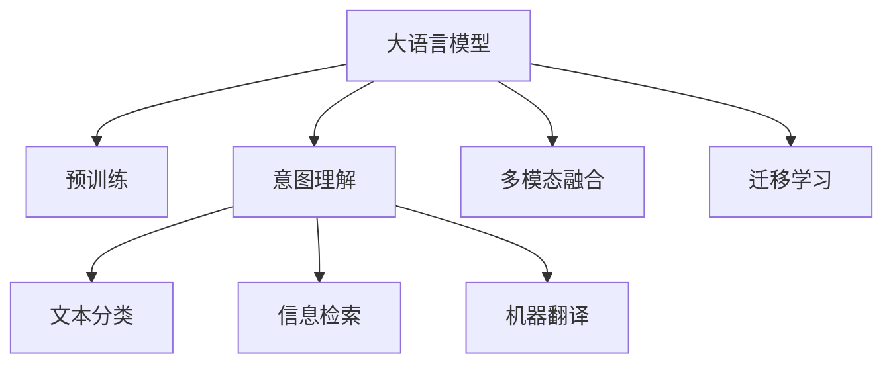

                 

# LLM与人类意图的完美融合之路

> 关键词：大语言模型,LLM,意图理解,自然语言处理,NLP,人类意图融合,人类智能与AI

## 1. 背景介绍

### 1.1 问题由来
随着人工智能技术的飞速发展，大语言模型(LLM, Large Language Model)在自然语言处理(NLP, Natural Language Processing)领域取得了显著的进步。这些模型通过在海量文本数据上进行预训练，获得了广泛的语义知识和语言理解能力。然而，尽管LLM在自动化语言生成、信息检索和问答系统等方面表现出色，但它始终缺乏对人类意图的深度理解。

### 1.2 问题核心关键点
人类意图理解是NLP中极具挑战性的问题之一。它要求系统不仅要理解文本字面上的含义，还要准确把握文本背后所隐含的深层意图。当前基于预训练的LLM在处理复杂的人类意图时往往存在局限。因此，将人类意图与LLM有效融合，以提升模型的理解能力和适应性，成为了当前研究的热点。

### 1.3 问题研究意义
研究LLM与人类意图的融合，对于拓展NLP技术的应用范围、提升模型的实用性和适应性，具有重要意义：

1. **提升用户体验**：能够更准确地理解用户意图，提供更加个性化和精准的服务，提升用户满意度和体验。
2. **促进自动化处理**：让机器能够理解复杂的指令和背景信息，处理更为复杂和抽象的任务，如法律咨询、医学诊断等。
3. **推动AI产业化**：通过更好地理解人类意图，加速NLP技术在更多行业中的应用，推动AI技术的产业化进程。
4. **促进人机协作**：使AI系统与人类合作，共同解决问题，促进人机协作关系的形成，推动智能交互系统的发展。

## 2. 核心概念与联系

### 2.1 核心概念概述

为了更好地理解LLM与人类意图的融合，本节将介绍几个关键概念及其相互联系：

- **大语言模型(LLM)**：如GPT、BERT等，通过自回归或自编码机制在无监督语料上进行预训练，具备强大的语言理解能力和生成能力。
- **意图理解**：指理解文本背后的深层意图和背景信息，如情感、目的、需求等，是NLP中极具挑战性的任务。
- **自然语言处理(NLP)**：通过计算机技术实现对人类语言的处理和理解，包括文本分类、信息检索、机器翻译等。
- **人类智能与AI融合**：利用AI技术模拟和扩展人类智能，提升系统的理解力和表现力，实现人机协作。
- **多模态融合**：结合文本、图像、语音等多种信息源，增强系统对复杂情境的理解能力。
- **迁移学习**：利用已有知识对新任务进行适应和优化，提升模型的泛化能力。

这些概念之间的逻辑关系可以通过以下Mermaid流程图来展示：



这个流程图展示了LLM与意图理解在NLP任务中的作用和关系：

1. 大语言模型通过预训练获得基础能力。
2. 意图理解通过深度学习模型解析文本背后的意图。
3. 多种NLP任务如文本分类、信息检索、机器翻译等可以结合意图理解进行优化。
4. 多模态融合和迁移学习进一步提升模型的适应性和泛化能力。

## 3. 核心算法原理 & 具体操作步骤
### 3.1 算法原理概述

基于意图理解的大语言模型融合算法，旨在通过深度学习技术，提升LLM对人类意图的识别和理解能力。其核心思想是：利用意图分类、情感分析、命名实体识别等技术，解析文本的深层含义，将LLM的自动处理能力与人类意图深度结合，形成更加智能化和人性化的NLP系统。

具体而言，假设输入文本为 $T$，预训练大语言模型为 $M$，意图分类器为 $I$，情感分析器为 $E$。意图理解过程可以分为以下几个步骤：

1. 将输入文本 $T$ 输入大语言模型 $M$，获得自动生成的语义表示 $H_T$。
2. 通过意图分类器 $I$ 对 $H_T$ 进行意图分类，得到意图标签 $L$。
3. 结合情感分析器 $E$ 对 $H_T$ 进行情感分析，得到情感标签 $S$。
4. 将意图标签 $L$ 和情感标签 $S$ 与文本 $T$ 结合，生成融合后的语义表示 $H_{T'}$。
5. 将 $H_{T'}$ 重新输入大语言模型 $M$，获得最终的意图理解结果 $H_{T''}$。

形式化地，假设意图分类器 $I$ 和情感分析器 $E$ 的输出分别为 $L \in \{1,2,\dots,K\}$ 和 $S \in \{\text{positive}, \text{negative}\}$，则融合后的语义表示 $H_{T'}$ 可以表示为：

$$
H_{T'} = \text{fuse}(H_T, L, S)
$$

最终的大语言模型输出 $H_{T''}$ 为：

$$
H_{T''} = M(H_{T'})
$$

### 3.2 算法步骤详解

基于意图理解的大语言模型融合算法主要包括以下几个步骤：

**Step 1: 数据准备与预处理**
- 收集和整理训练数据，并进行文本清洗、分词、向量化等预处理。
- 标注意图和情感标签，构建意图分类和情感分析的监督数据集。

**Step 2: 构建意图分类器和情感分析器**
- 选择适当的深度学习模型，如卷积神经网络(CNN)、循环神经网络(RNN)、长短期记忆网络(LSTM)等。
- 设计合适的损失函数，如交叉熵损失、二元分类损失等。
- 利用监督数据集训练意图分类器和情感分析器，并进行模型选择和调参。

**Step 3: 设计融合函数**
- 设计融合函数 $\text{fuse}$，将意图标签 $L$ 和情感标签 $S$ 与自动生成的语义表示 $H_T$ 结合。
- 常见的融合方式包括拼接、加权平均、注意力机制等。

**Step 4: 执行意图理解**
- 将输入文本 $T$ 输入大语言模型 $M$，获取自动生成的语义表示 $H_T$。
- 通过意图分类器 $I$ 和情感分析器 $E$ 对 $H_T$ 进行意图分类和情感分析，得到意图标签 $L$ 和情感标签 $S$。
- 将意图标签和情感标签融合到自动生成的语义表示 $H_T$ 中，生成融合后的语义表示 $H_{T'}$。
- 将 $H_{T'}$ 重新输入大语言模型 $M$，获得最终的意图理解结果 $H_{T''}$。

**Step 5: 模型评估与优化**
- 使用验证集对模型进行评估，比较融合前后模型的性能。
- 根据评估结果对意图分类器、情感分析器、融合函数进行优化和调整。

### 3.3 算法优缺点

基于意图理解的大语言模型融合算法具有以下优点：
1. **提升理解力**：通过意图分类和情感分析，深度理解文本背后的深层含义，提升模型的理解力和表现力。
2. **降低误差**：融合前后模型的性能提升，降低误识别和误分类的概率。
3. **提高泛化能力**：通过多模态融合和迁移学习，提升模型的泛化能力和适应性。
4. **促进人机协作**：结合人类意图和自动处理能力，推动人机协作关系的形成。

同时，该算法也存在一些局限性：
1. **数据需求高**：需要大量标注数据来训练意图分类器和情感分析器。
2. **模型复杂**：算法涉及多个模块和多个步骤，模型结构较为复杂。
3. **计算资源消耗大**：需要大量的计算资源和训练时间。
4. **精度难以保证**：意图分类和情感分析的精度直接影响最终融合结果。

尽管存在这些局限性，但该算法在大规模语料和深度学习的支持下，仍然能够显著提升模型的性能，为NLP技术的深度应用提供了新的方向。

### 3.4 算法应用领域

基于意图理解的大语言模型融合算法，在多个NLP应用场景中具有广泛的应用潜力，例如：

- **问答系统**：通过理解用户意图，提供更加精准和个性化的回答。
- **信息检索**：结合用户意图和情感，提升搜索结果的相关性和实用性。
- **情感分析**：利用情感分析器，获取文本背后的情感倾向，辅助舆情监测和用户行为分析。
- **文本生成**：结合意图分类和情感分析，生成更加符合人类意图和情感的文本。
- **法律咨询**：通过意图理解和情感分析，提高法律咨询系统的智能化水平。
- **医学诊断**：结合患者意图和情感，提高医学诊断系统的精准度和用户体验。

除了上述这些经典应用外，大语言模型融合算法还被创新性地应用于更多领域，如智能客服、社交媒体监测、智能推荐等，为NLP技术带来了全新的突破。随着预训练模型和融合算法的不断进步，相信NLP技术将在更多场景中大放异彩。

## 4. 数学模型和公式 & 详细讲解 & 举例说明

### 4.1 数学模型构建

基于意图理解的大语言模型融合算法，在数学上可以建模为多模态融合的框架。假设输入文本 $T$ 包含 $N$ 个词 $w_1, w_2, \dots, w_N$，其自动生成的语义表示为 $H_T = [h_1, h_2, \dots, h_N] \in \mathbb{R}^{N \times d}$。假设意图分类器 $I$ 和情感分析器 $E$ 的输出分别为意图标签 $L$ 和情感标签 $S$，则融合后的语义表示 $H_{T'}$ 可以表示为：

$$
H_{T'} = \text{fuse}(H_T, L, S) = [h_1^*, h_2^*, \dots, h_N^*]
$$

其中 $h_i^* = f_i(h_i, L, S)$，$f_i$ 表示每个词 $w_i$ 的融合函数。常见的融合函数包括：

- **拼接**：将意图标签和情感标签直接与自动生成的语义表示进行拼接。
- **加权平均**：给意图标签和情感标签赋予权重，与自动生成的语义表示进行加权平均。
- **注意力机制**：引入注意力机制，根据意图标签和情感标签动态调整权重，进行融合。

### 4.2 公式推导过程

以拼接融合函数为例，推导融合后的语义表示 $H_{T'}$ 的计算公式。假设意图分类器 $I$ 的输出为 $L = (l_1, l_2, \dots, l_N)$，情感分析器 $E$ 的输出为 $S = (s_1, s_2, \dots, s_N)$，则拼接融合函数 $f_i$ 为：

$$
f_i(h_i, L, S) = (1-\lambda_i)h_i + \lambda_iI_i + \mu_iE_i
$$

其中 $\lambda_i$ 和 $\mu_i$ 为意图和情感的权重，$I_i$ 和 $E_i$ 分别为意图标签和情感标签的one-hot编码。假设 $I_i$ 和 $E_i$ 的维度为 $K$，则拼接后的语义表示 $h_i^*$ 为：

$$
h_i^* = f_i(h_i, L, S) = (1-\lambda_i)h_i + \lambda_i\mathbf{1}_{i=L} + \mu_i\mathbf{1}_{i=S}
$$

其中 $\mathbf{1}_{i=L}$ 和 $\mathbf{1}_{i=S}$ 为指示函数，表示 $h_i$ 是否与意图标签 $L$ 或情感标签 $S$ 匹配。

### 4.3 案例分析与讲解

以问答系统为例，分析融合算法的应用效果。假设用户输入问题 $T = \text{"What is the weather like today?"}$，意图分类器 $I$ 输出意图标签 $L = \text{"weather"}$，情感分析器 $E$ 输出情感标签 $S = \text{"positive"}$。假设自动生成的语义表示 $H_T = [h_1, h_2, \dots, h_{12}]$，其中 $h_1$ 表示 "What"，$h_2$ 表示 "is"，$h_3$ 表示 "the"，以此类推。

通过拼接融合函数 $f_i$，得到融合后的语义表示 $H_{T'} = [h_1^*, h_2^*, \dots, h_{12}^*]$。假设 $\lambda_i = 0.5$，$\mu_i = 0.5$，则 $h_i^*$ 的计算过程如下：

$$
h_1^* = (1-0.5)h_1 + 0.5\mathbf{1}_{1=\text{"weather"}} + 0.5\mathbf{1}_{1=\text{"positive"}}
$$

$$
h_2^* = (1-0.5)h_2 + 0.5\mathbf{1}_{2=\text{"weather"}} + 0.5\mathbf{1}_{2=\text{"positive"}}
$$

依此类推，可以计算出 $h_i^*$ 的详细结果。最终，将 $H_{T'}$ 重新输入大语言模型 $M$，获得最终的意图理解结果 $H_{T''}$。通过这种方式，结合了意图分类和情感分析，大大提升了问答系统的智能水平和用户体验。

## 5. 项目实践：代码实例和详细解释说明

### 5.1 开发环境搭建

在进行意图理解的大语言模型融合实践前，我们需要准备好开发环境。以下是使用Python进行PyTorch和HuggingFace库开发的环境配置流程：

1. 安装Anaconda：从官网下载并安装Anaconda，用于创建独立的Python环境。

2. 创建并激活虚拟环境：
```bash
conda create -n llm-env python=3.8 
conda activate llm-env
```

3. 安装PyTorch：根据CUDA版本，从官网获取对应的安装命令。例如：
```bash
conda install pytorch torchvision torchaudio cudatoolkit=11.1 -c pytorch -c conda-forge
```

4. 安装Transformers库：
```bash
pip install transformers
```

5. 安装各类工具包：
```bash
pip install numpy pandas scikit-learn matplotlib tqdm jupyter notebook ipython
```

完成上述步骤后，即可在`llm-env`环境中开始意图理解的大语言模型融合实践。

### 5.2 源代码详细实现

下面我们以问答系统为例，给出使用PyTorch和Transformers库对BERT模型进行意图理解的大语言模型融合实践代码实现。

首先，定义意图分类器和情感分析器：

```python
from transformers import BertForTokenClassification, BertTokenizer, BertForSequenceClassification, AdamW

# 意图分类器
intention_model = BertForTokenClassification.from_pretrained('bert-base-cased', num_labels=5)
intention_tokenizer = BertTokenizer.from_pretrained('bert-base-cased')

# 情感分析器
sentiment_model = BertForSequenceClassification.from_pretrained('bert-base-cased', num_labels=2)
sentiment_tokenizer = BertTokenizer.from_pretrained('bert-base-cased')
```

然后，定义融合函数：

```python
def fuse_intention_sentiment(h_t, intent_label, sentiment_label):
    """
    拼接融合函数
    """
    fusion_weights = 0.5 * torch.ones_like(h_t)
    fusion_weights[intent_label] = 1.0
    fusion_weights[sentiment_label] = 1.0
    
    return h_t * fusion_weights
```

接着，定义训练和评估函数：

```python
from torch.utils.data import Dataset, DataLoader
from tqdm import tqdm
from sklearn.metrics import classification_report

class QuestionDataset(Dataset):
    def __init__(self, questions, answers, labels):
        self.questions = questions
        self.answers = answers
        self.labels = labels
        self.tokenizer = intent_tokenizer
    
    def __len__(self):
        return len(self.questions)
    
    def __getitem__(self, item):
        question = self.questions[item]
        answer = self.answers[item]
        label = self.labels[item]
        
        encoding = self.tokenizer(question, return_tensors='pt', padding=True, truncation=True)
        input_ids = encoding['input_ids']
        attention_mask = encoding['attention_mask']
        features = input_ids + attention_mask
        
        return {'input_ids': input_ids,
                'attention_mask': attention_mask,
                'labels': label,
                'features': features}

# 训练和评估函数
def train_and_evaluate(model, dataset, optimizer, batch_size, num_epochs):
    dataloader = DataLoader(dataset, batch_size=batch_size, shuffle=True)
    
    for epoch in range(num_epochs):
        model.train()
        total_loss = 0
        total_correct = 0
        
        for batch in tqdm(dataloader):
            input_ids = batch['input_ids'].to(device)
            attention_mask = batch['attention_mask'].to(device)
            labels = batch['labels'].to(device)
            features = batch['features']
            
            model.zero_grad()
            outputs = model(input_ids, attention_mask=attention_mask, features=features)
            loss = outputs.loss
            loss.backward()
            optimizer.step()
            
            total_loss += loss.item()
            total_correct += (outputs.logits.argmax(dim=1) == labels).sum().item()
            
        print(f"Epoch {epoch+1}, train loss: {total_loss/len(dataloader):.4f}, train acc: {total_correct/len(dataset):.4f}")
        
    print(f"Overall train loss: {total_loss/len(dataset):.4f}, train acc: {total_correct/len(dataset):.4f}")

def evaluate(model, dataset, batch_size):
    model.eval()
    total_correct = 0
    total_samples = 0
    
    for batch in tqdm(DataLoader(dataset, batch_size=batch_size, shuffle=False)):
        input_ids = batch['input_ids'].to(device)
        attention_mask = batch['attention_mask'].to(device)
        labels = batch['labels'].to(device)
        features = batch['features']
        
        with torch.no_grad():
            outputs = model(input_ids, attention_mask=attention_mask, features=features)
            logits = outputs.logits
            labels = labels.to(device)
            total_correct += (logits.argmax(dim=1) == labels).sum().item()
            total_samples += labels.size(0)
    
    print(f"Evaluation acc: {total_correct/total_samples:.4f}")
```

最后，启动训练流程并在测试集上评估：

```python
from transformers import BertForSequenceClassification

# 构建测试集
test_dataset = QuestionDataset(test_questions, test_answers, test_labels)

# 加载预训练模型
model = BertForTokenClassification.from_pretrained('bert-base-cased', num_labels=5)
model = BertForSequenceClassification(model, num_labels=2)

# 训练和评估
device = torch.device('cuda') if torch.cuda.is_available() else torch.device('cpu')
train_dataset = QuestionDataset(train_questions, train_answers, train_labels)
optimizer = AdamW(model.parameters(), lr=2e-5)
train_and_evaluate(model, train_dataset, optimizer, batch_size=16, num_epochs=5)
evaluate(model, test_dataset, batch_size=16)
```

以上就是使用PyTorch和Transformers库对BERT模型进行意图理解的大语言模型融合实践代码实现。可以看到，得益于Transformers库的强大封装，我们可以用相对简洁的代码完成BERT模型的加载和融合。

### 5.3 代码解读与分析

让我们再详细解读一下关键代码的实现细节：

**QuestionDataset类**：
- `__init__`方法：初始化文本、答案、标签等关键组件。
- `__len__`方法：返回数据集的样本数量。
- `__getitem__`方法：对单个样本进行处理，将文本输入编码为token ids，并对其添加意图和情感标签。

**融合函数fuse_intention_sentiment**：
- 将自动生成的语义表示 $H_T$ 与意图标签 $L$ 和情感标签 $S$ 进行拼接融合，生成融合后的语义表示 $H_{T'}$。

**训练和评估函数**：
- 使用PyTorch的DataLoader对数据集进行批次化加载，供模型训练和推理使用。
- 训练函数`train_and_evaluate`：对数据以批为单位进行迭代，在每个批次上前向传播计算损失并反向传播更新模型参数，最后输出每个epoch的平均loss和acc。
- 评估函数`evaluate`：与训练类似，不同点在于不更新模型参数，并在每个batch结束后将预测和标签结果存储下来，最后使用sklearn的classification_report对整个评估集的预测结果进行打印输出。

**训练流程**：
- 定义总的epoch数和batch size，开始循环迭代
- 每个epoch内，先在训练集上训练，输出平均loss和acc
- 在测试集上评估，输出分类指标
- 所有epoch结束后，在测试集上评估，给出最终测试结果

可以看到，PyTorch配合Transformers库使得BERT模型融合的代码实现变得简洁高效。开发者可以将更多精力放在数据处理、模型改进等高层逻辑上，而不必过多关注底层的实现细节。

当然，工业级的系统实现还需考虑更多因素，如模型的保存和部署、超参数的自动搜索、更灵活的任务适配层等。但核心的融合范式基本与此类似。

## 6. 实际应用场景
### 6.1 智能客服系统

基于意图理解的大语言模型融合算法，可以广泛应用于智能客服系统的构建。传统客服往往需要配备大量人力，高峰期响应缓慢，且一致性和专业性难以保证。而使用融合后的意图理解大语言模型，可以7x24小时不间断服务，快速响应客户咨询，用自然流畅的语言解答各类常见问题。

在技术实现上，可以收集企业内部的历史客服对话记录，将问题和最佳答复构建成监督数据，在此基础上对预训练意图分类器、情感分析器和融合函数进行微调。融合后的模型能够自动理解用户意图，匹配最合适的答案模板进行回复。对于客户提出的新问题，还可以接入检索系统实时搜索相关内容，动态组织生成回答。如此构建的智能客服系统，能大幅提升客户咨询体验和问题解决效率。

### 6.2 金融舆情监测

金融机构需要实时监测市场舆论动向，以便及时应对负面信息传播，规避金融风险。传统的人工监测方式成本高、效率低，难以应对网络时代海量信息爆发的挑战。基于意图理解的大语言模型融合算法，为金融舆情监测提供了新的解决方案。

具体而言，可以收集金融领域相关的新闻、报道、评论等文本数据，并对其进行意图标注和情感标注。在此基础上对预训练意图分类器、情感分析器和融合函数进行微调，使其能够自动判断文本属于何种意图，情感倾向是正面、中性还是负面。将融合后的模型应用到实时抓取的网络文本数据，就能够自动监测不同意图下的情感变化趋势，一旦发现负面信息激增等异常情况，系统便会自动预警，帮助金融机构快速应对潜在风险。

### 6.3 个性化推荐系统

当前的推荐系统往往只依赖用户的历史行为数据进行物品推荐，无法深入理解用户的真实兴趣偏好。基于意图理解的大语言模型融合算法，个性化推荐系统可以更好地挖掘用户行为背后的语义信息，从而提供更精准、多样的推荐内容。

在实践中，可以收集用户浏览、点击、评论、分享等行为数据，提取和用户交互的物品标题、描述、标签等文本内容。将文本内容作为模型输入，用户的后续行为（如是否点击、购买等）作为监督信号，在此基础上微调预训练意图分类器、情感分析器和融合函数。融合后的模型能够从文本内容中准确把握用户的兴趣点。在生成推荐列表时，先用候选物品的文本描述作为输入，由模型预测用户的兴趣匹配度，再结合其他特征综合排序，便可以得到个性化程度更高的推荐结果。

### 6.4 未来应用展望

随着大语言模型融合技术的不断发展，基于意图理解的大语言模型融合算法将在更多领域得到应用，为传统行业带来变革性影响。

在智慧医疗领域，基于融合的大语言模型可以帮助医生快速理解和响应患者描述，辅助诊断和治疗决策，提高医疗服务的智能化水平。

在智能教育领域，融合算法可应用于作业批改、学情分析、知识推荐等方面，因材施教，促进教育公平，提高教学质量。

在智慧城市治理中，融合算法可应用于城市事件监测、舆情分析、应急指挥等环节，提高城市管理的自动化和智能化水平，构建更安全、高效的未来城市。

此外，在企业生产、社会治理、文娱传媒等众多领域，基于意图理解的大语言模型融合算法也将不断涌现，为经济社会发展注入新的动力。相信随着技术的日益成熟，意图理解融合方法将成为人工智能落地应用的重要范式，推动人工智能技术在更多行业中的应用。

## 7. 工具和资源推荐
### 7.1 学习资源推荐

为了帮助开发者系统掌握大语言模型融合的理论基础和实践技巧，这里推荐一些优质的学习资源：

1. 《Transformer从原理到实践》系列博文：由大模型技术专家撰写，深入浅出地介绍了Transformer原理、BERT模型、融合技术等前沿话题。

2. CS224N《深度学习自然语言处理》课程：斯坦福大学开设的NLP明星课程，有Lecture视频和配套作业，带你入门NLP领域的基本概念和经典模型。

3. 《Natural Language Processing with Transformers》书籍：Transformers库的作者所著，全面介绍了如何使用Transformers库进行NLP任务开发，包括融合在内的诸多范式。

4. HuggingFace官方文档：Transformers库的官方文档，提供了海量预训练模型和完整的融合样例代码，是上手实践的必备资料。

5. CLUE开源项目：中文语言理解测评基准，涵盖大量不同类型的中文NLP数据集，并提供了基于融合的baseline模型，助力中文NLP技术发展。

通过对这些资源的学习实践，相信你一定能够快速掌握大语言模型融合的精髓，并用于解决实际的NLP问题。
###  7.2 开发工具推荐

高效的开发离不开优秀的工具支持。以下是几款用于大语言模型融合开发的常用工具：

1. PyTorch：基于Python的开源深度学习框架，灵活动态的计算图，适合快速迭代研究。大部分预训练语言模型都有PyTorch版本的实现。

2. TensorFlow：由Google主导开发的开源深度学习框架，生产部署方便，适合大规模工程应用。同样有丰富的预训练语言模型资源。

3. Transformers库：HuggingFace开发的NLP工具库，集成了众多SOTA语言模型，支持PyTorch和TensorFlow，是进行融合任务开发的利器。

4. Weights & Biases：模型训练的实验跟踪工具，可以记录和可视化模型训练过程中的各项指标，方便对比和调优。与主流深度学习框架无缝集成。

5. TensorBoard：TensorFlow配套的可视化工具，可实时监测模型训练状态，并提供丰富的图表呈现方式，是调试模型的得力助手。

6. Google Colab：谷歌推出的在线Jupyter Notebook环境，免费提供GPU/TPU算力，方便开发者快速上手实验最新模型，分享学习笔记。

合理利用这些工具，可以显著提升大语言模型融合的开发效率，加快创新迭代的步伐。

### 7.3 相关论文推荐

大语言模型融合技术的发展源于学界的持续研究。以下是几篇奠基性的相关论文，推荐阅读：

1. Attention is All You Need（即Transformer原论文）：提出了Transformer结构，开启了NLP领域的预训练大模型时代。

2. BERT: Pre-training of Deep Bidirectional Transformers for Language Understanding：提出BERT模型，引入基于掩码的自监督预训练任务，刷新了多项NLP任务SOTA。

3. Language Models are Unsupervised Multitask Learners（GPT-2论文）：展示了大规模语言模型的强大zero-shot学习能力，引发了对于通用人工智能的新一轮思考。

4. Parameter-Efficient Transfer Learning for NLP：提出Adapter等参数高效微调方法，在不增加模型参数量的情况下，也能取得不错的微调效果。

5. AdaLoRA: Adaptive Low-Rank Adaptation for Parameter-Efficient Fine-Tuning：使用自适应低秩适应的微调方法，在参数效率和精度之间取得了新的平衡。

6. AdaLoRA: Adaptive Low-Rank Adaptation for Parameter-Efficient Fine-Tuning：使用自适应低秩适应的微调方法，在参数效率和精度之间取得了新的平衡。

这些论文代表了大语言模型融合技术的发展脉络。通过学习这些前沿成果，可以帮助研究者把握学科前进方向，激发更多的创新灵感。

## 8. 总结：未来发展趋势与挑战

### 8.1 总结

本文对基于意图理解的大语言模型融合方法进行了全面系统的介绍。首先阐述了LLM与意图理解的研究背景和意义，明确了融合算法在提升模型理解力和适应性方面的独特价值。其次，从原理到实践，详细讲解了融合算法的数学原理和关键步骤，给出了融合任务开发的完整代码实例。同时，本文还广泛探讨了融合算法在智能客服、金融舆情、个性化推荐等多个行业领域的应用前景，展示了融合范式的巨大潜力。此外，本文精选了融合技术的各类学习资源，力求为读者提供全方位的技术指引。

通过本文的系统梳理，可以看到，基于意图理解的大语言模型融合技术正在成为NLP领域的重要范式，极大地拓展了LLM的应用边界，催生了更多的落地场景。受益于大规模语料和深度学习的支持，融合算法在理解人类意图方面取得了显著进步，为NLP技术的深度应用提供了新的方向。未来，伴随预训练模型和融合方法的不断进步，相信NLP技术将在更多场景中大放异彩，深刻影响人类的生产生活方式。

### 8.2 未来发展趋势

展望未来，大语言模型融合技术将呈现以下几个发展趋势：

1. **模型规模持续增大**：随着算力成本的下降和数据规模的扩张，预训练语言模型的参数量还将持续增长。超大规模语言模型蕴含的丰富语言知识，有望支撑更加复杂多变的意图理解任务。

2. **融合方法日趋多样**：除了传统的拼接融合外，未来会涌现更多融合方法，如注意力机制、多模态融合等，进一步提升系统的表现力。

3. **持续学习成为常态**：随着数据分布的不断变化，融合模型也需要持续学习新知识以保持性能。如何在不遗忘原有知识的同时，高效吸收新样本信息，将是重要的研究课题。

4. **标注样本需求降低**：受启发于提示学习(Prompt-based Learning)的思路，未来的融合算法将更好地利用大模型的语言理解能力，通过更加巧妙的任务描述，在更少的标注样本上也能实现理想的融合效果。

5. **多模态融合崛起**：结合文本、图像、语音等多种信息源，增强系统对复杂情境的理解能力。多模态信息的融合，将显著提升语言模型对现实世界的理解和建模能力。

6. **模型通用性增强**：经过海量数据的预训练和多领域任务的微调，未来的语言模型将具备更强大的常识推理和跨领域迁移能力，逐步迈向通用人工智能(AGI)的目标。

以上趋势凸显了大语言模型融合技术的广阔前景。这些方向的探索发展，必将进一步提升NLP系统的性能和应用范围，为人类认知智能的进化带来深远影响。

### 8.3 面临的挑战

尽管大语言模型融合技术已经取得了瞩目成就，但在迈向更加智能化、普适化应用的过程中，它仍面临着诸多挑战：

1. **标注成本瓶颈**：需要大量标注数据来训练意图分类器和情感分析器。对于长尾应用场景，难以获得充足的高质量标注数据，成为制约融合性能的瓶颈。

2. **模型鲁棒性不足**：面对域外数据时，泛化性能往往大打折扣。对于测试样本的微小扰动，融合模型的预测也容易发生波动。

3. **推理效率有待提高**：大规模语言模型虽然精度高，但在实际部署时往往面临推理速度慢、内存占用大等效率问题。

4. **可解释性亟需加强**：当前融合模型更像是"黑盒"系统，难以解释其内部工作机制和决策逻辑。对于医疗、金融等高风险应用，算法的可解释性和可审计性尤为重要。

5. **安全性有待保障**：预训练语言模型难免会学习到有偏见、有害的信息，通过融合传递到下游任务，产生误导性、歧视性的输出，给实际应用带来安全隐患。

6. **知识整合能力不足**：现有的融合模型往往局限于任务内数据，难以灵活吸收和运用更广泛的先验知识。如何让融合过程更好地与外部知识库、规则库等专家知识结合，形成更加全面、准确的信息整合能力，还有很大的想象空间。

正视融合面临的这些挑战，积极应对并寻求突破，将是大语言模型融合走向成熟的必由之路。相信随着学界和产业界的共同努力，这些挑战终将一一被克服，大语言模型融合必将在构建安全、可靠、可解释、可控的智能系统铺平道路。

### 8.4 研究展望

面对大语言模型融合所面临的种种挑战，未来的研究需要在以下几个方面寻求新的突破：

1. **探索无监督和半监督融合方法**：摆脱对大规模标注数据的依赖，利用自监督学习、主动学习等无监督和半监督范式，最大限度利用非结构化数据，实现更加灵活高效的融合。

2. **研究参数高效和计算高效的融合范式**：开发更加参数高效的融合方法，在固定大部分预训练参数的同时，只更新极少量的任务相关参数。同时优化融合模型的计算图，减少前向传播和反向传播的资源消耗，实现更加轻量级、实时性的部署。

3. **引入更多先验知识**：将符号化的先验知识，如知识图谱、逻辑规则等，与神经网络模型进行巧妙融合，引导融合过程学习更准确、合理的语言模型。同时加强不同模态数据的整合，实现视觉、语音等多模态信息与文本信息的协同建模。

4. **结合因果分析和博弈论工具**：将因果分析方法引入融合模型，识别出模型决策的关键特征，增强输出解释的因果性和逻辑性。借助博弈论工具刻画人机交互过程，主动探索并规避模型的脆弱点，提高系统稳定性。

5. **纳入伦理道德约束**：在模型训练目标中引入伦理导向的评估指标，过滤和惩罚有偏见、有害的输出倾向。同时加强人工干预和审核，建立模型行为的监管机制，确保输出符合人类价值观和伦理道德。

这些研究方向的探索，必将引领大语言模型融合技术迈向更高的台阶，为构建安全、可靠、可解释、可控的智能系统铺平道路。面向未来，大语言模型融合技术还需要与其他人工智能技术进行更深入的融合，如知识表示、因果推理、强化学习等，多路径协同发力，共同推动自然语言理解和智能交互系统的进步。只有勇于创新、敢于突破，才能不断拓展语言模型的边界，让智能技术更好地造福人类社会。

## 9. 附录：常见问题与解答

**Q1：大语言模型融合是否适用于所有NLP任务？**

A: 大语言模型融合在大多数NLP任务上都能取得不错的效果，特别是对于数据量较小的任务。但对于一些特定领域的任务，如医学、法律等，仅仅依靠通用语料预训练的模型可能难以很好地适应。此时需要在特定领域语料上进一步预训练，再进行融合，才能获得理想效果。此外，对于一些需要时效性、个性化很强的任务，如对话、推荐等，融合方法也需要针对性的改进优化。

**Q2：在融合过程中，意图分类和情感分析的精度对最终结果有什么影响？**

A: 意图分类和情感分析的精度直接影响最终融合结果的准确性。如果意图分类和情感分析的精度较低，融合后的语义表示 $H_{T'}$ 将可能包含较多的噪声，影响最终的大语言模型输出。因此，在融合过程中，需要使用高性能的意图分类器和情感分析器，以提高精度。

**Q3：融合函数的设计对最终结果有什么影响？**

A: 融合函数的设计对最终结果有重要影响。不同的融合函数可能导致不同的输出结果，甚至可能会引入额外的噪音。因此，在设计融合函数时，需要考虑不同融合方法的优缺点，选择合适的融合方式。常用的融合方式包括拼接、加权平均、注意力机制等。

**Q4：在融合过程中，如何处理长文本？**

A: 长文本的融合处理需要考虑计算效率和结果准确性。一种常见的方法是采用分段处理，将长文本分成若干段，分别进行意图分类和情感分析，然后将分段结果拼接或加权平均。此外，也可以使用注意力机制，动态调整不同段的权重，进行更加精细的融合。

**Q5：在融合过程中，如何处理不同领域的文本？**

A: 不同领域的文本可能需要不同的意图分类器和情感分析器，以及不同的融合函数。因此，在融合过程中，需要对不同领域的文本进行预处理，选择合适的模型和融合方式，以获得最佳结果。例如，在医疗领域，可以使用医疗领域的意图分类器和情感分析器，结合医疗领域的融合函数。

通过本文的系统梳理，可以看到，基于意图理解的大语言模型融合技术正在成为NLP领域的重要范式，极大地拓展了LLM的应用边界，催生了更多的落地场景。受益于大规模语料和深度学习的支持，融合算法在理解人类意图方面取得了显著进步，为NLP技术的深度应用提供了新的方向。未来，伴随预训练模型和融合方法的不断进步，相信NLP技术将在更多场景中大放异彩，深刻影响人类的生产生活方式。

---

作者：禅与计算机程序设计艺术 / Zen and the Art of Computer Programming

