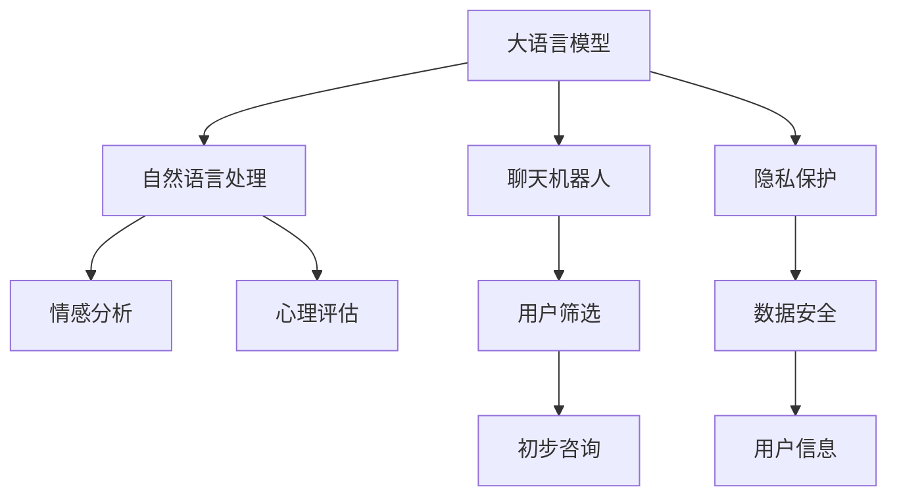

                 

# LLM与心理健康：AI辅助心理咨询

> 关键词：自然语言处理(NLP), 人工智能(AI), 心理咨询, 心理健康, 聊天机器人, 情感分析, 心理评估, 隐私保护

## 1. 背景介绍

### 1.1 问题由来
在现代快节奏、高压力的生活背景下，全球范围内心理健康问题逐渐凸显。据世界卫生组织(WHO)统计，全球约1/3的人口在一生中会遭遇心理健康问题，其中抑郁症、焦虑症等已成为全球主要的疾病负担。传统心理咨询依赖于专业心理咨询师，但由于时间和资源限制，无法覆盖到所有有需求的人群。

近年来，人工智能(AI)技术迅猛发展，尤其是自然语言处理(NLP)领域取得了一系列突破性进展。大语言模型(LLMs)作为NLP的最新突破，具有强大的语言理解和生成能力，已经被广泛应用于智能客服、智能翻译、信息检索等多个领域。鉴于此，将大语言模型应用于心理健康咨询领域，借助AI技术提供便捷、高效的心理支持，已经成为现实。

### 1.2 问题核心关键点
1. **用户隐私保护**：在AI心理咨询中，用户信息的安全和隐私保护至关重要。如何在咨询过程中保护用户隐私，防止数据泄露和滥用，成为亟需解决的问题。
2. **咨询效果评估**：AI心理咨询模型的效果评估涉及多维度指标，如情感分析、心理评估、用户满意度等。如何科学、全面地评估模型的咨询效果，是AI心理咨询的另一大挑战。
3. **模型泛化能力**：大语言模型通常预训练于大规模通用数据，应用于特定心理健康领域时，模型的泛化能力能否满足需求，仍需验证。
4. **用户情感互动**：心理咨询的核心在于情感互动和情感支持。AI系统如何模拟人类情感交流，理解用户情感需求，提供温暖且有效的情感回应，是实现有效咨询的关键。
5. **跨文化支持**：心理健康问题具有跨文化特性，AI系统如何理解并支持不同文化背景下的心理健康需求，是国际化的重要考量。

## 2. 核心概念与联系

### 2.1 核心概念概述

为更好地理解大语言模型在心理健康咨询中的应用，本节将介绍几个核心概念及其相互联系：

- **大语言模型(LLM)**：指基于自回归或自编码机制，通过大规模无标签或少量有标签文本数据进行预训练的语言模型，如GPT、BERT等。这些模型在自然语言理解与生成方面表现出色，具备强大的语言处理能力。
- **自然语言处理(NLP)**：指计算机科学、人工智能和语言学交叉领域的研究方向，旨在使计算机能够理解、处理和生成自然语言。NLP技术为AI心理咨询提供了技术基础。
- **情感分析(Emotion Analysis)**：指通过分析文本中的情感词汇和语调，识别用户情感状态的技术。情感分析在心理咨询中用于理解用户情绪，提供针对性支持。
- **心理评估(Psychological Assessment)**：指通过量表、问卷等方式评估用户心理状态的技术。心理评估在心理咨询中用于评估用户心理健康水平，指导咨询策略。
- **聊天机器人(Chatbot)**：指基于NLP技术的对话系统，可以模拟人类对话，提供自动化咨询服务。聊天机器人在心理咨询中用于初步筛选和初步咨询，减轻专业心理咨询师的工作负担。
- **隐私保护(Privacy Protection)**：指保护用户隐私信息，防止数据泄露和滥用的技术。隐私保护在AI心理咨询中用于保障用户信息安全。

这些核心概念之间的逻辑关系可以通过以下Mermaid流程图来展示：



这个流程图展示了大语言模型在心理健康咨询中的关键作用和各技术环节：

1. 大语言模型通过自然语言处理技术，理解并处理用户输入的自然语言文本。
2. 自然语言处理技术进一步用于情感分析和心理评估，理解用户情感状态和心理水平。
3. 聊天机器人利用自然语言处理技术，提供自动化咨询和用户筛选。
4. 隐私保护技术保障用户数据安全，防止数据泄露和滥用。

## 3. 核心算法原理 & 具体操作步骤

### 3.1 算法原理概述

基于大语言模型的心理健康咨询，主要利用模型的语言理解与生成能力，结合情感分析、心理评估等技术，提供个性化的心理咨询服务。核心算法流程如下：

1. **文本输入与理解**：用户通过文本输入表达情感困扰或心理问题，大语言模型理解并处理用户输入的自然语言文本。
2. **情感分析**：模型分析文本中的情感词汇和语调，识别用户的情感状态。
3. **心理评估**：模型通过心理问卷或量表，评估用户的心理状态。
4. **咨询建议**：根据情感分析和心理评估结果，模型提供个性化的咨询建议。
5. **情感互动**：模型通过多轮对话，与用户进行情感互动，提供心理支持。
6. **隐私保护**：在咨询过程中，模型应用隐私保护技术，保护用户信息安全。

### 3.2 算法步骤详解

**Step 1: 数据准备**
- 收集心理健康相关的文本数据，如心理咨询记录、社交媒体帖子、心理健康调查问卷等。
- 对数据进行清洗、标注和划分，生成训练集、验证集和测试集。

**Step 2: 模型选择与预训练**
- 选择合适的预训练语言模型，如GPT、BERT等，进行模型选择。
- 使用大规模心理健康文本数据对模型进行预训练，使其具备处理心理健康相关任务的能力。

**Step 3: 模型微调与优化**
- 针对心理健康咨询任务，对预训练模型进行微调，优化模型参数，提高其性能。
- 使用情感分析、心理评估等任务进行模型微调，提升模型的情感理解和心理评估能力。

**Step 4: 情感分析与心理评估**
- 将用户输入的文本作为输入，使用微调后的情感分析模型识别用户情感状态。
- 使用微调后的心理评估模型，对用户进行心理健康评估，获取心理健康水平分数。

**Step 5: 咨询建议与情感互动**
- 根据情感分析和心理评估结果，生成个性化的咨询建议，如情绪调节方法、心理支持策略等。
- 使用多轮对话模型与用户进行情感互动，提供情感支持和心理辅导。

**Step 6: 隐私保护**
- 在咨询过程中，应用隐私保护技术，如数据匿名化、差分隐私等，保护用户隐私信息。
- 对用户输入的文本进行数据脱敏，防止敏感信息泄露。

**Step 7: 系统部署与监控**
- 将训练好的模型部署到生产环境中，提供心理健康咨询服务。
- 实时监控系统性能和用户反馈，进行模型调优和优化。

### 3.3 算法优缺点

基于大语言模型的心理健康咨询有以下优点：
1. **高效便捷**：大语言模型能够快速处理大量文本数据，提供即时心理咨询服务，减轻专业心理咨询师的工作负担。
2. **个性化定制**：通过情感分析和心理评估，大语言模型能够提供个性化的咨询建议，满足不同用户的需求。
3. **泛化能力强**：大语言模型通常预训练于大规模通用数据，具有较强的泛化能力，可以适应不同文化背景和语言环境的心理健康需求。
4. **隐私保护**：利用隐私保护技术，大语言模型能够在咨询过程中保障用户数据安全，防止信息泄露。

同时，该方法也存在一些局限性：
1. **数据质量要求高**：模型性能依赖于高质量标注数据，数据质量差可能导致模型效果不佳。
2. **缺乏人类温暖**：机器无法完全替代人类心理咨询师，缺乏面对面交流的情感支持。
3. **依赖技术条件**：模型应用需要稳定的网络环境和高性能计算资源，用户可能面临技术接入门槛。
4. **伦理道德风险**：模型的自动化决策可能存在伦理道德风险，如算法偏见、数据滥用等。
5. **需要持续优化**：心理健康问题具有复杂性，模型的咨询效果需要不断优化和改进。

尽管存在这些局限性，但基于大语言模型的心理健康咨询在提供即时、便捷、个性化的心理支持方面，仍具有巨大的应用潜力。未来相关研究的方向将是提升模型效果、优化隐私保护、增强用户信任等方面。

### 3.4 算法应用领域

基于大语言模型的心理健康咨询技术，已经在多个领域得到应用，如：

- **在线心理咨询**：为用户提供24/7的心理支持，减轻专业心理咨询师的工作压力。
- **情绪管理应用**：帮助用户进行情绪调节和管理，提升心理状态。
- **心理健康监测**：通过情感分析和心理评估，监测用户的心理健康状况，提供及时干预。
- **青少年心理健康**：针对青少年群体，提供心理咨询和情感支持，预防心理问题。
- **危机干预**：在紧急情况下，提供即时的心理支持和危机干预，避免自杀等悲剧发生。

除了上述这些应用领域外，大语言模型在心理健康咨询的潜在应用还包括：

- **心理康复辅助**：在心理康复过程中，帮助患者记录和分析心理状态变化，提供科学的心理康复建议。
- **心理健康研究**：利用大规模数据训练模型，开展心理健康领域的科学研究，揭示心理健康问题的本质和规律。
- **心理健康教育**：通过虚拟心理辅导员，进行心理健康知识的普及和教育，提高公众心理健康意识。

## 4. 数学模型和公式 & 详细讲解

### 4.1 数学模型构建

假设大语言模型为 $M_{\theta}$，其中 $\theta$ 为模型参数。心理健康咨询任务为 $T$，包括情感分析和心理评估两个子任务。训练集为 $D=\{(x_i, y_i)\}_{i=1}^N, x_i \in \mathcal{X}, y_i \in \mathcal{Y}$，其中 $\mathcal{X}$ 为文本输入空间，$\mathcal{Y}$ 为标签空间。

定义情感分析任务 $T_{emotion}$ 的损失函数为 $\mathcal{L}_{emotion}$，心理评估任务 $T_{psychology}$ 的损失函数为 $\mathcal{L}_{psychology}$。则在训练集 $D$ 上的总损失函数为：

$$
\mathcal{L}(\theta) = \lambda_{emotion}\mathcal{L}_{emotion} + \lambda_{psychology}\mathcal{L}_{psychology}
$$

其中 $\lambda_{emotion}$ 和 $\lambda_{psychology}$ 为情感分析和心理评估任务的权重。

假设情感分析任务 $T_{emotion}$ 的标签空间为 $\mathcal{Y}_{emotion} = \{\text{positive}, \text{negative}\}$，使用交叉熵损失函数，情感分析任务 $T_{emotion}$ 的损失函数为：

$$
\mathcal{L}_{emotion} = -\frac{1}{N}\sum_{i=1}^N [y_{emotion,i}\log M_{\theta}(x_i) + (1-y_{emotion,i})\log(1-M_{\theta}(x_i))]
$$

其中 $y_{emotion,i}$ 为情感标签，$M_{\theta}(x_i)$ 为模型在文本 $x_i$ 上的情感预测概率。

假设心理评估任务 $T_{psychology}$ 的标签空间为 $\mathcal{Y}_{psychology} = [0,1]$，使用均方误差损失函数，心理评估任务 $T_{psychology}$ 的损失函数为：

$$
\mathcal{L}_{psychology} = \frac{1}{N}\sum_{i=1}^N (y_{psychology,i} - M_{\theta}(x_i))^2
$$

其中 $y_{psychology,i}$ 为心理健康水平分数，$M_{\theta}(x_i)$ 为模型在文本 $x_i$ 上的心理健康评估预测。

### 4.2 公式推导过程

下面以情感分析任务为例，推导交叉熵损失函数的计算公式。

假设模型 $M_{\theta}$ 在输入 $x$ 上的输出为 $\hat{y}=M_{\theta}(x) \in [0,1]$，表示样本属于正面情感的概率。真实情感标签 $y \in \{\text{positive}, \text{negative}\}$。则情感分析任务的交叉熵损失函数定义为：

$$
\ell(M_{\theta}(x),y) = -[y\log \hat{y} + (1-y)\log (1-\hat{y})]
$$

将其代入总损失函数，得：

$$
\mathcal{L}(\theta) = \lambda_{emotion}\frac{1}{N}\sum_{i=1}^N [y_{emotion,i}\log M_{\theta}(x_i) + (1-y_{emotion,i})\log(1-M_{\theta}(x_i))]
$$

根据链式法则，损失函数对参数 $\theta_k$ 的梯度为：

$$
\frac{\partial \mathcal{L}(\theta)}{\partial \theta_k} = \lambda_{emotion}\frac{1}{N}\sum_{i=1}^N (\frac{y_{emotion,i}}{M_{\theta}(x_i)}-\frac{1-y_{emotion,i}}{1-M_{\theta}(x_i)}) \frac{\partial M_{\theta}(x_i)}{\partial \theta_k}
$$

其中 $\frac{\partial M_{\theta}(x_i)}{\partial \theta_k}$ 可进一步递归展开，利用自动微分技术完成计算。

在得到损失函数的梯度后，即可带入参数更新公式，完成模型的迭代优化。重复上述过程直至收敛，最终得到适应情感分析任务的最优模型参数 $\theta^*$。

## 5. 项目实践：代码实例和详细解释说明

### 5.1 开发环境搭建

在进行心理健康咨询应用开发前，我们需要准备好开发环境。以下是使用Python进行PyTorch开发的环境配置流程：

1. 安装Anaconda：从官网下载并安装Anaconda，用于创建独立的Python环境。

2. 创建并激活虚拟环境：
```bash
conda create -n pytorch-env python=3.8 
conda activate pytorch-env
```

3. 安装PyTorch：根据CUDA版本，从官网获取对应的安装命令。例如：
```bash
conda install pytorch torchvision torchaudio cudatoolkit=11.1 -c pytorch -c conda-forge
```

4. 安装Transformers库：
```bash
pip install transformers
```

5. 安装各类工具包：
```bash
pip install numpy pandas scikit-learn matplotlib tqdm jupyter notebook ipython
```

完成上述步骤后，即可在`pytorch-env`环境中开始心理健康咨询应用的开发。

### 5.2 源代码详细实现

这里我们以情感分析任务为例，给出使用Transformers库对BERT模型进行心理健康咨询应用的PyTorch代码实现。

首先，定义情感分析任务的数据处理函数：

```python
from transformers import BertTokenizer
from torch.utils.data import Dataset
import torch

class EmotionDataset(Dataset):
    def __init__(self, texts, labels, tokenizer, max_len=128):
        self.texts = texts
        self.labels = labels
        self.tokenizer = tokenizer
        self.max_len = max_len
        
    def __len__(self):
        return len(self.texts)
    
    def __getitem__(self, item):
        text = self.texts[item]
        label = self.labels[item]
        
        encoding = self.tokenizer(text, return_tensors='pt', max_length=self.max_len, padding='max_length', truncation=True)
        input_ids = encoding['input_ids'][0]
        attention_mask = encoding['attention_mask'][0]
        
        # 对标签进行one-hot编码
        encoded_label = torch.tensor([label2id[label]], dtype=torch.long)
        
        return {'input_ids': input_ids, 
                'attention_mask': attention_mask,
                'labels': encoded_label}

# 标签与id的映射
label2id = {'positive': 0, 'negative': 1}
id2label = {v: k for k, v in label2id.items()}

# 创建dataset
tokenizer = BertTokenizer.from_pretrained('bert-base-cased')

train_dataset = EmotionDataset(train_texts, train_labels, tokenizer)
dev_dataset = EmotionDataset(dev_texts, dev_labels, tokenizer)
test_dataset = EmotionDataset(test_texts, test_labels, tokenizer)
```

然后，定义模型和优化器：

```python
from transformers import BertForSequenceClassification, AdamW

model = BertForSequenceClassification.from_pretrained('bert-base-cased', num_labels=2)

optimizer = AdamW(model.parameters(), lr=2e-5)
```

接着，定义训练和评估函数：

```python
from torch.utils.data import DataLoader
from tqdm import tqdm
from sklearn.metrics import classification_report

device = torch.device('cuda') if torch.cuda.is_available() else torch.device('cpu')
model.to(device)

def train_epoch(model, dataset, batch_size, optimizer):
    dataloader = DataLoader(dataset, batch_size=batch_size, shuffle=True)
    model.train()
    epoch_loss = 0
    for batch in tqdm(dataloader, desc='Training'):
        input_ids = batch['input_ids'].to(device)
        attention_mask = batch['attention_mask'].to(device)
        labels = batch['labels'].to(device)
        model.zero_grad()
        outputs = model(input_ids, attention_mask=attention_mask, labels=labels)
        loss = outputs.loss
        epoch_loss += loss.item()
        loss.backward()
        optimizer.step()
    return epoch_loss / len(dataloader)

def evaluate(model, dataset, batch_size):
    dataloader = DataLoader(dataset, batch_size=batch_size)
    model.eval()
    preds, labels = [], []
    with torch.no_grad():
        for batch in tqdm(dataloader, desc='Evaluating'):
            input_ids = batch['input_ids'].to(device)
            attention_mask = batch['attention_mask'].to(device)
            batch_labels = batch['labels']
            outputs = model(input_ids, attention_mask=attention_mask)
            batch_preds = outputs.logits.argmax(dim=1).to('cpu').tolist()
            batch_labels = batch_labels.to('cpu').tolist()
            for pred, label in zip(batch_preds, batch_labels):
                preds.append(pred)
                labels.append(label)
                
    print(classification_report(labels, preds))
```

最后，启动训练流程并在测试集上评估：

```python
epochs = 5
batch_size = 16

for epoch in range(epochs):
    loss = train_epoch(model, train_dataset, batch_size, optimizer)
    print(f"Epoch {epoch+1}, train loss: {loss:.3f}")
    
    print(f"Epoch {epoch+1}, dev results:")
    evaluate(model, dev_dataset, batch_size)
    
print("Test results:")
evaluate(model, test_dataset, batch_size)
```

以上就是使用PyTorch对BERT进行心理健康咨询应用的完整代码实现。可以看到，得益于Transformers库的强大封装，我们可以用相对简洁的代码完成BERT模型的加载和微调。

### 5.3 代码解读与分析

让我们再详细解读一下关键代码的实现细节：

**EmotionDataset类**：
- `__init__`方法：初始化文本、标签、分词器等关键组件。
- `__len__`方法：返回数据集的样本数量。
- `__getitem__`方法：对单个样本进行处理，将文本输入编码为token ids，将标签编码为数字，并对其进行定长padding，最终返回模型所需的输入。

**label2id和id2label字典**：
- 定义了标签与数字id之间的映射关系，用于将标签转换为模型接受的格式。

**训练和评估函数**：
- 使用PyTorch的DataLoader对数据集进行批次化加载，供模型训练和推理使用。
- 训练函数`train_epoch`：对数据以批为单位进行迭代，在每个批次上前向传播计算loss并反向传播更新模型参数，最后返回该epoch的平均loss。
- 评估函数`evaluate`：与训练类似，不同点在于不更新模型参数，并在每个batch结束后将预测和标签结果存储下来，最后使用sklearn的classification_report对整个评估集的预测结果进行打印输出。

**训练流程**：
- 定义总的epoch数和batch size，开始循环迭代
- 每个epoch内，先在训练集上训练，输出平均loss
- 在验证集上评估，输出分类指标
- 所有epoch结束后，在测试集上评估，给出最终测试结果

可以看到，PyTorch配合Transformers库使得BERT微调的代码实现变得简洁高效。开发者可以将更多精力放在数据处理、模型改进等高层逻辑上，而不必过多关注底层的实现细节。

当然，工业级的系统实现还需考虑更多因素，如模型的保存和部署、超参数的自动搜索、更灵活的任务适配层等。但核心的微调范式基本与此类似。

## 6. 实际应用场景

### 6.1 智能心理咨询系统

基于大语言模型的心理健康咨询技术，可以广泛应用于智能心理咨询系统的构建。传统的心理咨询往往依赖于专业心理咨询师，由于时间和资源限制，难以覆盖到所有有需求的人群。使用大语言模型进行智能心理咨询，可以提供便捷、高效的心理支持，减轻专业心理咨询师的工作负担。

具体实现上，可以构建智能心理咨询聊天机器人，通过自然语言处理技术理解用户输入的情感困扰，结合情感分析和心理评估模型提供个性化的咨询建议，帮助用户进行情绪调节和管理，提升心理状态。通过多轮对话技术，实现与用户的情感互动，提供温暖且有效的情感回应，形成良好的心理咨询效果。

### 6.2 情绪监测与预警

心理健康问题往往伴随着情绪波动。基于大语言模型的情绪监测技术，可以实时监测用户的情绪状态，及时发现情绪异常并发出预警。

具体应用中，可以通过社交媒体、手机应用等收集用户的情绪文本，利用训练好的情绪分析模型识别情绪状态，结合历史数据和机器学习算法，预测用户的情绪变化趋势。一旦发现情绪异常，系统便会自动预警，提醒用户或联系专业心理咨询师，进行及时的干预和支持。

### 6.3 心理健康评估与干预

大语言模型可以用于心理健康评估，帮助用户进行自我评估和心理健康监测。通过与用户进行多轮对话，收集用户的心理健康状况信息，结合心理评估模型，生成心理健康水平分数。根据评估结果，系统可以提供个性化的心理健康建议，指导用户进行自我调节和心理健康干预。

### 6.4 心理危机干预

在紧急情况下，大语言模型可以用于心理危机干预，提供即时的心理支持和危机干预。通过多轮对话技术，与用户进行情感互动，引导用户表达情感困扰，提供心理支持和危机干预建议，帮助用户度过危机时刻，避免悲剧发生。

### 6.5 青少年心理健康

青少年是心理健康问题的高发群体。基于大语言模型的心理健康技术，可以针对青少年群体，提供心理健康教育和心理咨询服务。通过与青少年的多轮对话，了解他们的心理状态和情感需求，提供针对性的心理健康支持和建议，帮助他们建立健康的心理状态，预防心理问题的发生。

## 7. 工具和资源推荐

### 7.1 学习资源推荐

为了帮助开发者系统掌握大语言模型在心理健康咨询中的应用，这里推荐一些优质的学习资源：

1. 《Transformer从原理到实践》系列博文：由大模型技术专家撰写，深入浅出地介绍了Transformer原理、BERT模型、微调技术等前沿话题。

2. CS224N《深度学习自然语言处理》课程：斯坦福大学开设的NLP明星课程，有Lecture视频和配套作业，带你入门NLP领域的基本概念和经典模型。

3. 《Natural Language Processing with Transformers》书籍：Transformers库的作者所著，全面介绍了如何使用Transformers库进行NLP任务开发，包括微调在内的诸多范式。

4. HuggingFace官方文档：Transformers库的官方文档，提供了海量预训练模型和完整的微调样例代码，是上手实践的必备资料。

5. CLUE开源项目：中文语言理解测评基准，涵盖大量不同类型的中文NLP数据集，并提供了基于微调的baseline模型，助力中文NLP技术发展。

通过对这些资源的学习实践，相信你一定能够快速掌握大语言模型在心理健康咨询中的应用精髓，并用于解决实际的心理健康问题。

### 7.2 开发工具推荐

高效的开发离不开优秀的工具支持。以下是几款用于心理健康咨询应用的常用工具：

1. PyTorch：基于Python的开源深度学习框架，灵活动态的计算图，适合快速迭代研究。大部分预训练语言模型都有PyTorch版本的实现。

2. TensorFlow：由Google主导开发的开源深度学习框架，生产部署方便，适合大规模工程应用。同样有丰富的预训练语言模型资源。

3. Transformers库：HuggingFace开发的NLP工具库，集成了众多SOTA语言模型，支持PyTorch和TensorFlow，是进行心理健康咨询应用的利器。

4. Weights & Biases：模型训练的实验跟踪工具，可以记录和可视化模型训练过程中的各项指标，方便对比和调优。与主流深度学习框架无缝集成。

5. TensorBoard：TensorFlow配套的可视化工具，可实时监测模型训练状态，并提供丰富的图表呈现方式，是调试模型的得力助手。

6. Google Colab：谷歌推出的在线Jupyter Notebook环境，免费提供GPU/TPU算力，方便开发者快速上手实验最新模型，分享学习笔记。

合理利用这些工具，可以显著提升心理健康咨询应用的开发效率，加快创新迭代的步伐。

### 7.3 相关论文推荐

大语言模型和心理健康咨询技术的发展源于学界的持续研究。以下是几篇奠基性的相关论文，推荐阅读：

1. Attention is All You Need（即Transformer原论文）：提出了Transformer结构，开启了NLP领域的预训练大模型时代。

2. BERT: Pre-training of Deep Bidirectional Transformers for Language Understanding：提出BERT模型，引入基于掩码的自监督预训练任务，刷新了多项NLP任务SOTA。

3. Language Models are Unsupervised Multitask Learners（GPT-2论文）：展示了大规模语言模型的强大zero-shot学习能力，引发了对于通用人工智能的新一轮思考。

4. Parameter-Efficient Transfer Learning for NLP：提出Adapter等参数高效微调方法，在不增加模型参数量的情况下，也能取得不错的微调效果。

5. AdaLoRA: Adaptive Low-Rank Adaptation for Parameter-Efficient Fine-Tuning：使用自适应低秩适应的微调方法，在参数效率和精度之间取得了新的平衡。

6. Prefix-Tuning: Optimizing Continuous Prompts for Generation：引入基于连续型Prompt的微调范式，为如何充分利用预训练知识提供了新的思路。

这些论文代表了大语言模型心理健康咨询技术的发展脉络。通过学习这些前沿成果，可以帮助研究者把握学科前进方向，激发更多的创新灵感。

## 8. 总结：未来发展趋势与挑战

### 8.1 总结

本文对基于大语言模型的心理健康咨询技术进行了全面系统的介绍。首先阐述了大语言模型和心理健康咨询的研究背景和意义，明确了心理健康咨询在AI辅助下可能带来的高效便捷、个性化定制等优势。其次，从原理到实践，详细讲解了心理健康咨询的数学模型和关键步骤，给出了心理健康咨询应用的完整代码实例。同时，本文还广泛探讨了心理健康咨询技术在智能心理咨询、情绪监测、心理健康评估等多个领域的应用前景，展示了该技术的巨大潜力。此外，本文精选了心理健康咨询技术的学习资源，力求为读者提供全方位的技术指引。

通过本文的系统梳理，可以看到，基于大语言模型的心理健康咨询技术正在成为心理健康支持的重要范式，极大地提升了心理健康咨询的效率和效果。未来，伴随大语言模型的持续演进，心理健康咨询技术将有望进一步优化，为全球的心理健康事业带来深远影响。

### 8.2 未来发展趋势

展望未来，大语言模型在心理健康咨询领域的应用将呈现以下几个发展趋势：

1. **模型规模持续增大**：随着算力成本的下降和数据规模的扩张，预训练语言模型的参数量还将持续增长。超大规模语言模型蕴含的丰富语言知识，有望支撑更加复杂多变的心理健康咨询任务。

2. **微调方法日趋多样**：除了传统的全参数微调外，未来会涌现更多参数高效的微调方法，如Prefix-Tuning、LoRA等，在节省计算资源的同时也能保证心理健康咨询的效果。

3. **持续学习成为常态**：心理健康问题具有动态变化的特点，微调模型也需要持续学习新知识以保持性能。如何在不遗忘原有知识的同时，高效吸收新样本信息，将成为重要的研究课题。

4. **数据质量要求降低**：未来可能会探索更多无监督或半监督学习范式，通过多源数据、对抗性学习等技术，提升心理健康咨询模型的泛化能力和鲁棒性。

5. **用户信任度提升**：为增强用户对AI心理咨询的信任度，未来将更加注重情感互动、隐私保护和伦理性设计。如何让AI系统更好地模拟人类情感交流，提升用户信任度，将是重要的研究方向。

6. **跨文化支持增强**：心理健康问题具有跨文化特性，AI系统如何理解并支持不同文化背景下的心理健康需求，是国际化的重要考量。

以上趋势凸显了大语言模型心理健康咨询技术的广阔前景。这些方向的探索发展，必将进一步提升心理健康咨询的效果和应用范围，为全球的心理健康事业带来深远影响。

### 8.3 面临的挑战

尽管大语言模型在心理健康咨询中已经展现出一定的优势，但在迈向更加智能化、普适化应用的过程中，它仍面临着诸多挑战：

1. **数据质量瓶颈**：心理健康咨询的准确性依赖于高质量标注数据，数据质量差可能导致模型效果不佳。如何进一步降低数据获取成本，提升数据质量，是未来需要解决的重要问题。

2. **伦理道德风险**：模型的自动化决策可能存在伦理道德风险，如算法偏见、数据滥用等。如何建立透明、公平、安全的心理健康咨询模型，将是重要的研究方向。

3. **用户情感互动不足**：尽管大语言模型能够模拟人类情感交流，但在复杂情境下，仍难以完全替代人类心理咨询师的情感互动。如何在AI系统中融入更多人类情感元素，提升情感支持效果，是未来的研究重点。

4. **隐私保护问题**：在心理健康咨询中，用户信息的安全和隐私保护至关重要。如何防止数据泄露和滥用，保障用户隐私，将是重要的技术挑战。

5. **多模态融合能力不足**：当前大语言模型通常聚焦于文本数据，对于图像、视频等非文本数据的支持不足。如何实现文本与多模态数据的融合，提升心理健康咨询的全面性和准确性，是未来的研究方向。

6. **个性化定制难度高**：心理健康问题的个体差异较大，如何针对不同用户进行个性化定制，提升心理健康咨询的针对性和有效性，是未来的研究重点。

尽管存在这些挑战，但基于大语言模型的心理健康咨询在提供即时、便捷、个性化的心理支持方面，仍具有巨大的应用潜力。未来研究需要在算法优化、隐私保护、用户信任度提升等方面进行深入探索，才能更好地发挥大语言模型在心理健康咨询中的潜力。

### 8.4 研究展望

面对大语言模型在心理健康咨询领域面临的挑战，未来的研究需要在以下几个方面寻求新的突破：

1. **多源数据融合**：探索将多源数据（如语音、图像等）与文本数据结合，提升心理健康咨询的多模态理解和分析能力。

2. **无监督学习探索**：研究无监督或半监督学习范式，利用多源数据和对抗性学习技术，提升心理健康咨询模型的泛化能力和鲁棒性。

3. **隐私保护技术改进**：改进隐私保护技术，如差分隐私、联邦学习等，保障用户数据的安全和隐私。

4. **伦理性设计**：引入伦理性设计，如公平性、透明度等，确保心理健康咨询模型的伦理性和公平性。

5. **情感互动增强**：研究增强情感互动的方法，如利用情感生成模型、情感反馈机制等，提升用户对AI系统的信任度。

6. **跨文化支持优化**：优化跨文化支持技术，提升AI系统在不同文化背景下的适应性和支持能力。

7. **多模态融合**：研究多模态融合技术，实现文本与图像、视频等多模态数据的协同分析，提升心理健康咨询的全面性和准确性。

8. **个性化定制优化**：探索个性化定制方法，利用深度学习、知识图谱等技术，提升心理健康咨询的个性化支持效果。

这些研究方向的探索，必将引领大语言模型心理健康咨询技术迈向更高的台阶，为全球的心理健康事业带来深远影响。面向未来，大语言模型心理健康咨询技术还需要与其他人工智能技术进行更深入的融合，如知识表示、因果推理、强化学习等，多路径协同发力，共同推动心理健康咨询系统的进步。只有勇于创新、敢于突破，才能不断拓展大语言模型的边界，让智能技术更好地造福人类社会。

## 9. 附录：常见问题与解答

**Q1：大语言模型在心理健康咨询中的应用场景有哪些？**

A: 大语言模型在心理健康咨询中的应用场景主要包括：

1. **智能心理咨询系统**：构建智能心理咨询聊天机器人，通过自然语言处理技术理解用户输入的情感困扰，结合情感分析和心理评估模型提供个性化的咨询建议，帮助用户进行情绪调节和管理，提升心理状态。

2. **情绪监测与预警**：实时监测用户的情绪状态，及时发现情绪异常并发出预警，提醒用户或联系专业心理咨询师，进行及时的干预和支持。

3. **心理健康评估与干预**：通过与用户进行多轮对话，收集用户的心理健康状况信息，结合心理评估模型，生成心理健康水平分数，提供个性化的心理健康建议和干预。

4. **心理危机干预**：在紧急情况下，通过多轮对话技术，与用户进行情感互动，引导用户表达情感困扰，提供心理支持和危机干预建议，帮助用户度过危机时刻。

5. **青少年心理健康**：针对青少年群体，提供心理健康教育和心理咨询服务，帮助他们建立健康的心理状态，预防心理问题的发生。

**Q2：大语言模型在心理健康咨询中的优缺点有哪些？**

A: 大语言模型在心理健康咨询中具有以下优点：

1. **高效便捷**：大语言模型能够快速处理大量文本数据，提供即时心理咨询服务，减轻专业心理咨询师的工作负担。

2. **个性化定制**：通过情感分析和心理评估，大语言模型能够提供个性化的咨询建议，满足不同用户的需求。

3. **泛化能力强**：大语言模型通常预训练于大规模通用数据，具有较强的泛化能力，可以适应不同文化背景和语言环境的心理健康需求。

4. **隐私保护**：利用隐私保护技术，大语言模型能够在咨询过程中保障用户数据安全，防止信息泄露。

同时，该方法也存在一些局限性：

1. **数据质量要求高**：模型性能依赖于高质量标注数据，数据质量差可能导致模型效果不佳。

2. **缺乏人类温暖**：机器无法完全替代人类心理咨询师，缺乏面对面交流的情感支持。

3. **依赖技术条件**：模型应用需要稳定的网络环境和高性能计算资源，用户可能面临技术接入门槛。

4. **伦理道德风险**：模型的自动化决策可能存在伦理道德风险，如算法偏见、数据滥用等。

5. **需要持续优化**：心理健康问题具有复杂性，模型的咨询效果需要不断优化和改进。

尽管存在这些局限性，但基于大语言模型的心理健康咨询在提供即时、便捷、个性化的心理支持方面，仍具有巨大的应用潜力。未来相关研究的方向将是提升模型效果、优化隐私保护、增强用户信任等方面。

**Q3：如何选择合适的心理健康评估模型？**

A: 选择合适的心理健康评估模型需要考虑以下几个因素：

1. **评估维度的选择**：根据心理健康问题的类型和严重程度，选择合适的评估维度。常用的心理健康评估模型如GAD-7（广泛性焦虑障碍量表）、PHQ-9（抑郁症自评量表）等。

2. **评估工具的可靠性**：选择经过验证的心理健康评估工具，确保其可靠性和有效性。可以在专业的心理健康评估题库中进行选择。

3. **用户友好性**：评估工具应设计得用户友好，便于用户理解和填写。可以使用简洁明了的语言和格式，避免复杂的技术术语。

4. **隐私保护措施**：评估工具应采取有效的隐私保护措施，保护用户数据安全。可以在用户数据采集和存储过程中应用隐私保护技术，如数据加密、差分隐私等。

5. **可扩展性**：评估工具应具备良好的可扩展性，支持多语言和多文化环境。可以通过多语言模型和跨文化适应技术，增强评估工具的国际适用性。

综合考虑以上因素，可以选择适合的心理健康评估模型，并进行相应的参数微调和优化，以提升其评估效果和用户满意度。

**Q4：大语言模型在心理健康咨询中如何应用隐私保护技术？**

A: 大语言模型在心理健康咨询中应用隐私保护技术，主要通过以下几种方式实现：

1. **数据匿名化**：在数据预处理阶段，对用户输入的文本数据进行匿名化处理，去除敏感信息，保护用户隐私。

2. **差分隐私**：在模型训练过程中，应用差分隐私技术，限制模型对个体数据的敏感性，防止模型泄露用户隐私。

3. **联邦学习**：在模型部署过程中，采用联邦学习技术，在用户设备上进行本地训练，减少数据传输和存储风险。

4. **加密技术**：在数据传输和存储过程中，应用加密技术，如SSL/TLS、AES等，保护数据传输和存储的安全性。

5. **权限控制**：在模型访问和使用过程中，设置严格的权限控制机制，确保只有授权人员和设备可以访问和使用模型。

通过应用这些隐私保护技术，可以在心理健康咨询过程中，保障用户数据的安全和隐私，防止数据泄露和滥用。

**Q5：心理健康咨询模型的效果评估方法有哪些？**

A: 心理健康咨询模型的效果评估主要包括以下几种方法：

1. **情感分析准确率**：通过情感分析任务，评估模型对用户情感状态的识别准确率。可以使用交叉熵、F1-score等指标进行评估。

2. **心理评估准确率**：通过心理评估任务，评估模型对用户心理健康水平的评估准确率。可以使用均方误差、R-squared等指标进行评估。

3. **用户满意度**：通过用户反馈，评估用户对心理健康咨询服务的满意度。可以使用问卷调查、满意度评分等方式进行评估。

4. **实际效果**：通过实际应用效果，评估心理健康咨询模型的实际效果。可以使用用户情绪变化、心理健康水平提升等指标进行评估。

5. **对比实验**：通过对比实验，评估心理健康咨询模型与其他模型或方法的性能差异。可以使用A/B测试、交叉验证等方式进行评估。

综合考虑以上方法，可以全面评估心理健康咨询模型的效果，不断优化和改进模型性能。

---

作者：禅与计算机程序设计艺术 / Zen and the Art of Computer Programming

