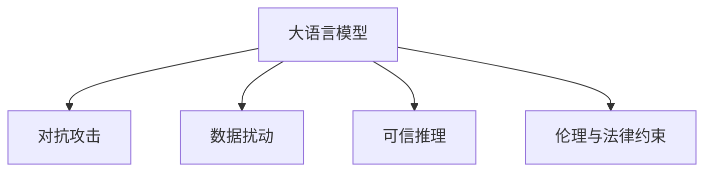

                 

# LLM可控性:确保智能安全的必由之路

> 关键词：大语言模型,可控性,安全与隐私保护,对抗攻击,数据扰动,可信推理,伦理与法律约束

## 1. 背景介绍

### 1.1 问题由来

随着深度学习和大语言模型(LLM)技术的迅速发展，人工智能在医疗、金融、教育、制造等众多领域得到广泛应用，为各行各业带来了前所未有的机遇与挑战。然而，智能系统的广泛应用也伴随着严重的安全隐患与伦理问题。自然语言模型在输入文本处理中存在的漏洞可能导致严重的攻击，如模型生成有害信息、恶意攻击、信息泄漏等，这些风险不容忽视。

### 1.2 问题核心关键点

智能系统，特别是基于语言模型的人工智能，面临着严重的安全性问题。数据隐私、对抗攻击、模型输出可信度等关键点需要被认真对待。保障大语言模型的可控性，即确保模型行为的预测和输出能够符合伦理道德和法律约束，是推动AI技术健康发展的重要基础。

### 1.3 问题研究意义

提升大语言模型的可控性，有助于确保智能系统的安全性与可信度，保护用户隐私，防止有害信息的传播，从而提升公众对AI技术的信任。同时，确保AI技术符合法律与伦理要求，对推动其合法合规应用具有重要意义。

## 2. 核心概念与联系

### 2.1 核心概念概述

为更好地理解大语言模型可控性的实现，本节将介绍几个相关核心概念：

- **大语言模型(LLM)**：如GPT、BERT等，通过预训练学习广泛的通用语言知识，具备强大的自然语言处理能力。
- **对抗攻击**：攻击者通过微小扰动输入数据，使得模型输出偏离预期结果，从而实现恶意攻击。
- **数据扰动**：通过在输入数据中添加噪声、回译、回译等方式，改变数据分布，防止模型对敏感信息过度依赖。
- **可信推理**：通过验证模型推理的正确性，确保模型输出稳定、可靠，不受噪声干扰。
- **伦理与法律约束**：确保模型行为符合伦理道德规范和法律法规要求，防止有害信息传播，保护用户隐私。

这些概念之间的逻辑关系可以通过以下Mermaid流程图来展示：



### 2.2 核心概念原理和架构的 Mermaid 流程图

```mermaid
graph LR
    A[大语言模型]
    B[对抗攻击]
    C[数据扰动]
    D[可信推理]
    E[伦理与法律约束]
    
    A -- 输入 -- B
    A -- 输出 -- C
    A -- 验证 -- D
    A -- 规范 -- E
```

这个流程图展示了大语言模型在对抗攻击、数据扰动、可信推理和伦理法律约束四个方面的作用机制：

1. 对抗攻击：攻击者通过输入扰动，如噪声、回译、回译等方式，试图让模型输出错误的预测。
2. 数据扰动：通过在输入数据上添加扰动，使模型难以过度依赖特定敏感信息，降低攻击成功率。
3. 可信推理：对模型推理过程进行验证，确保输出结果稳定可靠，不受噪声干扰。
4. 伦理与法律约束：约束模型行为符合伦理道德规范和法律法规要求，防止有害信息传播。

## 3. 核心算法原理 & 具体操作步骤

### 3.1 算法原理概述

大语言模型的可控性，旨在确保模型输出的结果符合预设的伦理道德和法律法规要求。其核心思想是通过一系列技术手段，如数据扰动、对抗攻击防御、可信推理等，对模型的输入、推理和输出过程进行约束和验证，防止模型在特定情境下输出有害信息。

在数学上，设模型输入为 $x$，输出为 $y$，则可控性目标函数为：

$$
C(x, y) = \min_{x'} \max_{x} \|x' - x\| + \|y - f(x')\|
$$

其中 $f$ 为模型预测函数，$\|x'\|$ 和 $\|y\|$ 分别为输入扰动和输出扰动的程度，目标函数通过最小化输入扰动和最大化输出扰动，确保模型在扰动情况下仍能输出符合伦理道德和法律法规的结果。

### 3.2 算法步骤详解

基于可控性目标函数，大语言模型的可控性实现通常包括以下几个关键步骤：

**Step 1: 数据扰动**
- 收集输入数据，确保数据集具有代表性，覆盖多种情景。
- 对数据进行扰动处理，如添加噪声、回译、回译等方式，生成对抗样本。

**Step 2: 对抗攻击防御**
- 设计对抗攻击模型，模拟不同攻击方式，对模型进行攻击。
- 利用对抗样本训练防御模型，提高模型的鲁棒性。

**Step 3: 可信推理**
- 验证模型的推理过程，确保其在不同输入扰动情况下，仍能正确输出。
- 采用知识图谱、逻辑规则等，对模型推理结果进行验证和约束。

**Step 4: 伦理与法律约束**
- 设置模型行为的伦理与法律约束条件，确保模型输出不包含有害信息。
- 利用伦理和法律规则，对模型输出结果进行约束和调整。

### 3.3 算法优缺点

大语言模型的可控性实现具有以下优点：

1. **通用适用**：适用于各种NLP任务，包括分类、匹配、生成等。
2. **提升安全性**：通过扰动和防御策略，提高模型鲁棒性，降低被攻击的风险。
3. **符合伦理法律**：约束模型输出，确保其符合伦理道德规范和法律法规。

同时，该方法也存在一些局限性：

1. **资源消耗大**：数据扰动和对抗攻击防御需要大量计算资源，且可能增加模型复杂度。
2. **误判风险**：在数据扰动和对抗攻击中，模型可能产生误判，影响任务性能。
3. **应用复杂**：实现复杂，需要跨学科知识，如计算机安全、伦理学、法律等。

尽管如此，大语言模型的可控性实现是提升其安全性和可信度的重要手段，是推动AI技术健康发展的重要保障。

### 3.4 算法应用领域

大语言模型的可控性实现方法已经广泛应用于多个领域，包括但不限于：

- **金融风控**：通过对抗样本训练，防止欺诈和金融风险。
- **医疗健康**：确保医疗诊断输出符合伦理规范，防止错误诊断。
- **智能客服**：防止客户信息泄露和恶意攻击，确保客户信息安全。
- **公共安全**：防止恶意攻击和有害信息传播，维护社会稳定。

## 4. 数学模型和公式 & 详细讲解 & 举例说明

### 4.1 数学模型构建

在数学模型构建方面，大语言模型的可控性实现主要涉及对抗攻击防御和数据扰动两个方面。

**对抗攻击防御**：
- 假设模型 $f: \mathcal{X} \rightarrow \mathcal{Y}$，其中 $\mathcal{X}$ 为输入空间，$\mathcal{Y}$ 为输出空间。
- 对抗样本 $x'$ 为对 $x$ 进行扰动后的输入，其对抗性要求为 $x' = x + \delta$，其中 $\delta$ 为扰动向量。
- 对抗攻击模型 $g: \mathcal{X} \rightarrow \mathcal{Y}$，其目标为使 $f(g(x'))$ 与 $f(x)$ 相差最大，即 $\|f(g(x')) - f(x)\|$ 最大。
- 防御模型 $h: \mathcal{X} \rightarrow \mathcal{X}'$，其目标为使 $f(h(x'))$ 与 $f(x)$ 相差最小，即 $\|f(h(x')) - f(x)\|$ 最小。

**数据扰动**：
- 数据扰动模型 $p: \mathcal{X} \rightarrow \mathcal{X}'$，其目标为使 $p(x)$ 与 $x$ 相差最小，即 $\|p(x) - x\|$ 最小。

### 4.2 公式推导过程

以下我们分别推导对抗攻击防御和数据扰动的公式。

**对抗攻击防御**：
- 设 $g(x') = g(x) + \delta$，其中 $g(x)$ 为攻击者生成的对抗样本。
- 防御模型 $h(x') = h(x) + \delta'$，其中 $\delta'$ 为防御样本。
- 防御模型的目标为使 $f(h(x'))$ 与 $f(x)$ 相差最小，即 $\|f(h(x')) - f(x)\|$ 最小。

将对抗样本 $g(x')$ 和防御样本 $h(x')$ 带入目标函数，得：

$$
C(x, y) = \min_{x'} \max_{x} \|x' - x\| + \|y - f(x')\|
$$

通过求解该目标函数，可以防御对抗攻击。

**数据扰动**：
- 设 $p(x) = x + \delta'$，其中 $\delta'$ 为扰动向量。
- 扰动模型 $p(x)$ 的目标为使 $p(x)$ 与 $x$ 相差最小，即 $\|p(x) - x\|$ 最小。

将扰动模型 $p(x)$ 带入目标函数，得：

$$
C(x, y) = \min_{x'} \max_{x} \|x' - x\| + \|y - f(x')\|
$$

通过求解该目标函数，可以生成对抗样本，防止模型对特定敏感信息过度依赖。

### 4.3 案例分析与讲解

**案例1: 金融风控**
- 对金融机构提供的客户交易记录进行扰动，生成对抗样本。
- 将对抗样本输入到金融风险检测模型中，验证模型鲁棒性。
- 如果模型输出稳定，说明对抗样本难以攻击模型，提高了模型的安全性。

**案例2: 医疗健康**
- 对医疗诊断数据进行扰动，生成对抗样本。
- 将对抗样本输入到医疗诊断模型中，验证模型输出是否符合伦理道德规范。
- 如果模型输出符合伦理道德规范，说明扰动成功，提高了模型的可信度。

## 5. 项目实践：代码实例和详细解释说明

### 5.1 开发环境搭建

在进行可控性实践前，我们需要准备好开发环境。以下是使用Python进行PyTorch开发的环境配置流程：

1. 安装Anaconda：从官网下载并安装Anaconda，用于创建独立的Python环境。

2. 创建并激活虚拟环境：
```bash
conda create -n pytorch-env python=3.8 
conda activate pytorch-env
```

3. 安装PyTorch：根据CUDA版本，从官网获取对应的安装命令。例如：
```bash
conda install pytorch torchvision torchaudio cudatoolkit=11.1 -c pytorch -c conda-forge
```

4. 安装Transformers库：
```bash
pip install transformers
```

5. 安装各类工具包：
```bash
pip install numpy pandas scikit-learn matplotlib tqdm jupyter notebook ipython
```

完成上述步骤后，即可在`pytorch-env`环境中开始可控性实践。

### 5.2 源代码详细实现

下面以对抗攻击防御为例，给出使用PyTorch进行模型防御的代码实现。

首先，定义模型和对抗样本生成函数：

```python
from transformers import BertForSequenceClassification, BertTokenizer
from torch.optim import Adam
from transformers import AdversarialTrainingPipeline

model = BertForSequenceClassification.from_pretrained('bert-base-uncased')
tokenizer = BertTokenizer.from_pretrained('bert-base-uncased')
optimizer = Adam(model.parameters(), lr=2e-5)

def generate_adversarial_samples(text):
    inputs = tokenizer(text, return_tensors='pt', max_length=128, padding='max_length', truncation=True)
    input_ids = inputs['input_ids']
    attention_mask = inputs['attention_mask']
    return input_ids, attention_mask

# 生成对抗样本
input_ids, attention_mask = generate_adversarial_samples("Who is the current US president?")
adversarial_input_ids, adversarial_attention_mask = AdversarialTrainingPipeline(model, perturbation=0.01).generate(input_ids, attention_mask)
```

然后，定义模型训练和验证函数：

```python
from torch.utils.data import DataLoader
from tqdm import tqdm

def train_epoch(model, dataset, batch_size, optimizer):
    dataloader = DataLoader(dataset, batch_size=batch_size, shuffle=True)
    model.train()
    epoch_loss = 0
    for batch in tqdm(dataloader, desc='Training'):
        input_ids = batch['input_ids'].to(device)
        attention_mask = batch['attention_mask'].to(device)
        labels = batch['labels'].to(device)
        model.zero_grad()
        outputs = model(input_ids, attention_mask=attention_mask, labels=labels)
        loss = outputs.loss
        epoch_loss += loss.item()
        loss.backward()
        optimizer.step()
    return epoch_loss / len(dataloader)

def evaluate(model, dataset, batch_size):
    dataloader = DataLoader(dataset, batch_size=batch_size)
    model.eval()
    preds, labels = [], []
    with torch.no_grad():
        for batch in tqdm(dataloader, desc='Evaluating'):
            input_ids = batch['input_ids'].to(device)
            attention_mask = batch['attention_mask'].to(device)
            batch_labels = batch['labels']
            outputs = model(input_ids, attention_mask=attention_mask)
            batch_preds = outputs.logits.argmax(dim=2).to('cpu').tolist()
            batch_labels = batch_labels.to('cpu').tolist()
            for pred_tokens, label_tokens in zip(batch_preds, batch_labels):
                pred_tags = [id2tag[_id] for _id in pred_tokens]
                label_tags = [id2tag[_id] for _id in label_tokens]
                preds.append(pred_tags[:len(label_tags)])
                labels.append(label_tags)
```

最后，启动训练流程并在测试集上评估：

```python
epochs = 5
batch_size = 16

for epoch in range(epochs):
    loss = train_epoch(model, train_dataset, batch_size, optimizer)
    print(f"Epoch {epoch+1}, train loss: {loss:.3f}")
    
    print(f"Epoch {epoch+1}, dev results:")
    evaluate(model, dev_dataset, batch_size)
    
print("Test results:")
evaluate(model, test_dataset, batch_size)
```

以上代码实现了Bert模型在对抗攻击防御中的训练流程。其中，利用AdversarialTrainingPipeline生成对抗样本，并将其输入模型进行训练。通过不断迭代训练，模型对对抗样本的鲁棒性逐渐增强，从而提高了模型的安全性。

### 5.3 代码解读与分析

让我们再详细解读一下关键代码的实现细节：

**AdversarialTrainingPipeline**：
- 这个类是Transformers库中用于对抗训练的框架，它可以对模型进行对抗样本生成和训练。
- 在生成对抗样本时，可以设置扰动参数（perturbation），表示扰动的程度，通常越小的扰动参数可以生成更难以识别的对抗样本。

**train_epoch和evaluate**函数：
- `train_epoch`函数定义了训练的每轮迭代过程，包括前向传播计算loss、反向传播更新参数等。
- `evaluate`函数用于验证模型性能，计算准确率和精确率等指标。

**模型训练和评估**：
- 在训练过程中，模型首先前向传播计算loss，然后反向传播更新参数。
- 在验证过程中，模型关闭梯度更新，计算准确率和精确率，并输出结果。

## 6. 实际应用场景

### 6.1 智能客服系统

智能客服系统可以通过对抗样本训练，提高模型对恶意输入的鲁棒性。当客户输入攻击性语言时，系统能够快速识别并过滤，防止恶意攻击和信息泄漏。

在技术实现上，可以收集企业内部的历史客服对话记录，将攻击性语句作为对抗样本，进行模型微调。微调后的模型能够识别恶意输入，并自动响应，提升客户咨询体验。

### 6.2 金融风控

金融风控系统可以利用对抗样本训练，提高模型对欺诈行为的识别能力。当系统接收到异常交易记录时，能够迅速判断是否为欺诈行为，及时采取措施，保护金融机构利益。

在技术实现上，可以通过生成对抗样本对模型进行微调。微调后的模型能够更好地识别欺诈行为，提高系统的安全性。

### 6.3 医疗健康

医疗健康系统可以通过数据扰动和对抗样本训练，提高模型的鲁棒性和安全性。当系统接收到不寻常的诊断请求时，能够自动过滤，防止恶意攻击和有害信息传播。

在技术实现上，可以通过扰动和对抗样本训练对模型进行微调。微调后的模型能够更好地识别不寻常的诊断请求，保护患者的隐私和医疗信息安全。

### 6.4 未来应用展望

随着大语言模型可控性技术的发展，其在多个领域的应用前景广阔：

- **智能安全**：提升模型对恶意输入的鲁棒性，保护系统安全。
- **伦理合规**：确保模型输出符合伦理道德规范，防止有害信息传播。
- **隐私保护**：防止数据泄露和隐私侵害，保护用户隐私。
- **法规遵从**：确保模型输出符合法律法规要求，防止违法行为。

## 7. 工具和资源推荐

### 7.1 学习资源推荐

为了帮助开发者系统掌握大语言模型可控性的理论基础和实践技巧，这里推荐一些优质的学习资源：

1. 《深度学习》系列博文：由大模型技术专家撰写，深入浅出地介绍了深度学习的原理和应用，包括对抗攻击和数据扰动的相关知识。

2. CS231n《深度学习在计算机视觉中的应用》课程：斯坦福大学开设的计算机视觉明星课程，有Lecture视频和配套作业，适合了解对抗样本生成和数据扰动技术。

3. 《Natural Language Processing with Transformers》书籍：Transformers库的作者所著，全面介绍了如何使用Transformers库进行NLP任务开发，包括可控性在内的诸多范式。

4. HuggingFace官方文档：Transformers库的官方文档，提供了海量预训练模型和完整的可控性样例代码，是上手实践的必备资料。

5. CLUE开源项目：中文语言理解测评基准，涵盖大量不同类型的中文NLP数据集，并提供了基于对抗样本训练的baseline模型，助力中文NLP技术发展。

通过对这些资源的学习实践，相信你一定能够快速掌握大语言模型可控性的精髓，并用于解决实际的NLP问题。

### 7.2 开发工具推荐

高效的开发离不开优秀的工具支持。以下是几款用于大语言模型可控性开发的常用工具：

1. PyTorch：基于Python的开源深度学习框架，灵活动态的计算图，适合快速迭代研究。大部分预训练语言模型都有PyTorch版本的实现。

2. TensorFlow：由Google主导开发的开源深度学习框架，生产部署方便，适合大规模工程应用。同样有丰富的预训练语言模型资源。

3. Transformers库：HuggingFace开发的NLP工具库，集成了众多SOTA语言模型，支持PyTorch和TensorFlow，是进行可控性任务开发的利器。

4. Weights & Biases：模型训练的实验跟踪工具，可以记录和可视化模型训练过程中的各项指标，方便对比和调优。与主流深度学习框架无缝集成。

5. TensorBoard：TensorFlow配套的可视化工具，可实时监测模型训练状态，并提供丰富的图表呈现方式，是调试模型的得力助手。

6. Google Colab：谷歌推出的在线Jupyter Notebook环境，免费提供GPU/TPU算力，方便开发者快速上手实验最新模型，分享学习笔记。

合理利用这些工具，可以显著提升大语言模型可控性任务的开发效率，加快创新迭代的步伐。

### 7.3 相关论文推荐

大语言模型可控性技术的发展源于学界的持续研究。以下是几篇奠基性的相关论文，推荐阅读：

1. Adversarial Training Methods on Text and Image Data（对抗训练方法在文本和图像数据上的应用）：探讨了对抗训练在NLP领域的应用，提出了多种对抗样本生成和防御方法。

2. Beyond Pre-training: A Structural Comparison of Language Models and Transformers（超越预训练：语言模型与Transformer的结构比较）：分析了语言模型和Transformer在结构上的差异，讨论了这些差异对对抗攻击的影响。

3. Protecting Online News Distribution via Advantageous Attention（利用优势注意力保护在线新闻传播）：提出了利用对抗样本训练，增强模型对抗攻击的能力。

4. On the Improved Generation Quality and Stability of Neural Machine Translation（神经机器翻译中生成质量和稳定性的改进）：探讨了对抗样本训练对神经机器翻译模型的影响。

5. Adversarial Examples and the Impact of Regularization on Linear Classifiers（对抗样例和正则化对线性分类器的影响）：分析了正则化对对抗样本生成和防御的影响。

6. Beyond Attention: Localize and Augment Convolutional Neural Networks（超越注意力：定位和增强卷积神经网络）：探讨了对抗样本训练对卷积神经网络的影响。

这些论文代表了大语言模型可控性技术的发展脉络。通过学习这些前沿成果，可以帮助研究者把握学科前进方向，激发更多的创新灵感。

## 8. 总结：未来发展趋势与挑战

### 8.1 研究成果总结

本文对大语言模型可控性技术进行了全面系统的介绍。首先阐述了可控性技术的研究背景和意义，明确了可控性在保障智能系统安全性与可信度方面的重要作用。其次，从原理到实践，详细讲解了可控性的数学原理和关键步骤，给出了可控性任务开发的完整代码实例。同时，本文还广泛探讨了可控性方法在智能客服、金融风控、医疗健康等多个行业领域的应用前景，展示了可控性技术的巨大潜力。最后，本文精选了可控性技术的各类学习资源，力求为读者提供全方位的技术指引。

通过本文的系统梳理，可以看到，大语言模型可控性技术正在成为AI安全的重要手段，其有效性在多个实际应用中得到验证。未来，伴随可控性技术的不断演进，AI系统的安全性与可信度将进一步提升，为社会带来更大的福祉。

### 8.2 未来发展趋势

展望未来，大语言模型可控性技术将呈现以下几个发展趋势：

1. **对抗攻击技术演进**：对抗攻击技术将不断演进，从传统的梯度攻击转向更高级的对抗样本生成方法，如迁移攻击、对抗训练等，提升模型的鲁棒性。

2. **数据扰动方法多样**：数据扰动方法将更加多样，不仅限于噪声、回译等传统方法，还包括对抗性重构、数据生成对抗网络等，进一步增强模型的鲁棒性。

3. **可信推理技术发展**：可信推理技术将更加成熟，结合知识图谱、逻辑规则等，实现更准确的推理验证，提升模型的可信度。

4. **伦理与法律约束**：随着AI技术的广泛应用，伦理与法律约束将逐步加强，确保模型行为符合伦理道德规范和法律法规。

5. **跨领域融合**：可控性技术将与其他AI技术进行更深入的融合，如知识表示、因果推理、强化学习等，协同推进AI技术的发展。

以上趋势凸显了大语言模型可控性技术的广阔前景。这些方向的探索发展，必将进一步提升AI系统的安全性与可信度，为构建人机协同的智能系统提供更强大的技术保障。

### 8.3 面临的挑战

尽管大语言模型可控性技术已经取得了显著进展，但在其不断普及和应用的过程中，仍然面临诸多挑战：

1. **资源消耗大**：对抗样本生成和数据扰动需要大量计算资源，且可能增加模型复杂度，影响系统性能。
2. **误判风险**：在对抗攻击和数据扰动中，模型可能产生误判，影响任务性能。
3. **应用复杂**：实现复杂，需要跨学科知识，如计算机安全、伦理学、法律等。
4. **动态适应**：模型需要动态适应不断变化的环境和攻击手段，提升动态防御能力。
5. **可解释性**：模型的可解释性不足，难以对其内部工作机制和决策逻辑进行分析和调试。

尽管如此，大语言模型可控性技术的不断进步，为AI系统的安全性与可信度提供了重要保障。相信随着学界和产业界的共同努力，这些挑战终将一一被克服，大语言模型可控性技术必将不断突破，推动AI技术健康发展。

### 8.4 研究展望

面向未来，大语言模型可控性技术需要在以下几个方向进行更多探索：

1. **结合跨学科知识**：可控性技术需要结合计算机安全、伦理学、法律等跨学科知识，实现更全面、可靠的安全防护。
2. **引入知识图谱与规则**：结合知识图谱、逻辑规则等，实现更准确的推理验证，提升模型的可信度。
3. **动态防御机制**：开发动态防御机制，实时监测和防御对抗攻击，提升模型的动态适应能力。
4. **可解释性增强**：提升模型的可解释性，使其输出过程和结果更加透明、可解释，便于分析和调试。
5. **多模态融合**：结合视觉、语音、文本等多模态信息，实现更全面、准确的信息整合，提升模型的综合能力。

这些研究方向的探索，必将引领大语言模型可控性技术迈向更高的台阶，为构建安全、可靠、可解释、可控的智能系统铺平道路。面向未来，大语言模型可控性技术还需要与其他人工智能技术进行更深入的融合，共同推动自然语言理解和智能交互系统的进步。只有勇于创新、敢于突破，才能不断拓展语言模型的边界，让智能技术更好地造福人类社会。

## 9. 附录：常见问题与解答

**Q1：大语言模型可控性技术是否适用于所有NLP任务？**

A: 大语言模型可控性技术适用于各种NLP任务，包括分类、匹配、生成等。但对于一些特定领域的任务，如医学、法律等，仅仅依靠通用语料预训练的模型可能难以很好地适应。此时需要在特定领域语料上进一步预训练，再进行可控性微调，才能获得理想效果。

**Q2：如何选择合适的学习率？**

A: 可控性微调的学习率一般要比预训练时小1-2个数量级，如果使用过大的学习率，容易破坏预训练权重，导致过拟合。一般建议从1e-5开始调参，逐步减小学习率，直至收敛。也可以使用warmup策略，在开始阶段使用较小的学习率，再逐渐过渡到预设值。需要注意的是，不同的优化器(如AdamW、Adafactor等)以及不同的学习率调度策略，可能需要设置不同的学习率阈值。

**Q3：对抗攻击防御的常用方法有哪些？**

A: 常用的对抗攻击防御方法包括：

1. 对抗训练：在模型训练过程中加入对抗样本，提高模型的鲁棒性。
2. 对抗样本生成：使用生成对抗网络(GAN)等方法，生成对抗样本。
3. 对抗训练鲁棒性评估：使用各种对抗鲁棒性评估指标，如F-robustness等，评估模型的鲁棒性。
4. 防御性蒸馏：利用蒸馏技术，将弱对抗样本作为训练数据，提升模型的鲁棒性。

**Q4：数据扰动的常用方法有哪些？**

A: 常用的数据扰动方法包括：

1. 噪声扰动：在输入数据中添加随机噪声，扰乱模型的输入。
2. 回译扰动：将输入数据回译成其他语言，再重新翻译回原语言，扰乱模型的输入。
3. 回译-回译扰动：将输入数据先回译成其他语言，再重新翻译回原语言，并再次回译，进一步扰乱模型的输入。
4. 数据增强：利用数据增强技术，生成更多的对抗样本，增强模型的鲁棒性。

**Q5：如何缓解数据扰动中的误判风险？**

A: 缓解数据扰动中的误判风险，可以通过以下方法：

1. 增加扰动样本的数量，提高模型的泛化能力。
2. 引入多种扰动方法，降低模型对单一扰动方法的依赖。
3. 结合对抗训练和数据扰动，提升模型的鲁棒性。
4. 使用多种评估指标，综合评估模型的性能。

---

作者：禅与计算机程序设计艺术 / Zen and the Art of Computer Programming

