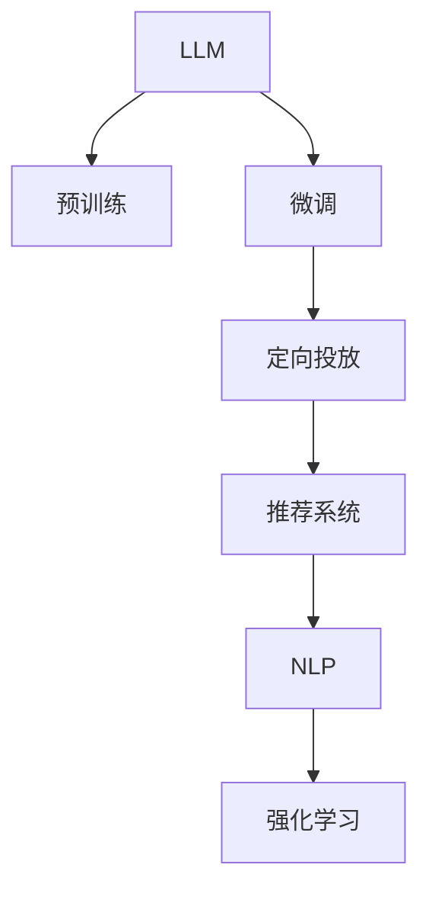

                 

# LLM在广告营销中的应用：精准定向投放

## 1. 背景介绍

随着数字化营销的兴起，广告主们越来越重视广告投放的精准度。在有限的市场预算下，如何通过精准的定向投放，实现广告的最大化效果，成为了广告营销中一个关键问题。近年来，大规模语言模型（Large Language Model, LLM）的涌现，为解决这一问题提供了新的方向。

LLM通过在海量文本数据上预训练，掌握了丰富的语言知识和理解能力，具备从文本中提取语义信息、识别实体、情感分析等多种能力。这些能力可以有效地应用于广告定向投放中，帮助广告主精准定位目标用户，提升广告效果和ROI。

## 2. 核心概念与联系

### 2.1 核心概念概述

为更好地理解LLM在广告营销中的应用，本节将介绍几个密切相关的核心概念：

- 大规模语言模型(LLM)：以自回归模型（如GPT）或自编码模型（如BERT）为代表的大规模预训练语言模型。通过在大规模无标签文本语料上进行预训练，学习通用的语言表示，具备强大的语言理解和生成能力。

- 预训练(Pre-training)：指在大规模无标签文本语料上，通过自监督学习任务训练通用语言模型的过程。常见的预训练任务包括言语建模、遮挡语言模型等。

- 微调(Fine-tuning)：指在预训练模型的基础上，使用下游任务的少量标注数据，通过有监督学习优化模型在该任务上的性能。

- 定向投放(Programmatic Advertising)：指通过程序化算法实现广告的自动化投放，基于用户属性、行为数据、上下文环境等因素，自动匹配和选择广告位，以实现广告的最优化展示。

- 自然语言处理(NLP)：指让计算机能够理解、处理和生成人类语言的技术，包括文本分类、实体识别、情感分析等。

- 推荐系统(Recommendation System)：指通过机器学习算法，为用户推荐个性化内容和服务的技术，广泛应用于广告定向、电商推荐等场景。

- 强化学习(Reinforcement Learning)：指通过奖励和惩罚机制，引导智能体在环境中进行学习，优化决策策略，以达到最大化奖励的目标。

这些核心概念之间的逻辑关系可以通过以下Mermaid流程图来展示：



这个流程图展示了大语言模型的工作原理和与广告定向投放的相关性：

1. LLM通过预训练获得基础能力。
2. 微调使其更适应广告定向投放的任务需求。
3. 定向投放利用微调的LLM对目标用户进行精准定位和广告匹配。
4. 推荐系统进一步提升广告投放的效果，通过个性化推荐增加用户点击率。
5. NLP技术提供对用户文本数据（如搜索查询、社交媒体评论等）的分析，提升定向投放的精准性。
6. 强化学习算法优化广告投放策略，实现自我学习和迭代。

## 3. 核心算法原理 & 具体操作步骤

### 3.1 算法原理概述

基于LLM的广告定向投放，本质上是一个通过语言模型进行精准定向的过程。其核心思想是：将预训练的LLM视作一个"智能分析器"，通过分析用户的文本数据（如搜索历史、评论、社交媒体信息等），从中提取与广告内容相关的特征，进而匹配最合适的用户进行定向投放。

形式化地，假设广告内容为 $A$，用户的文本数据为 $D$，预训练的LLM为 $M_{\theta}$。定向投放的目标是找到最匹配的用户集 $U$，使得广告 $A$ 最大化地展示给用户集 $U$ 中的用户，即：

$$
U^* = \mathop{\arg\max}_{U} \prod_{u \in U} \mathbb{P}(A|D_u)
$$

其中 $\mathbb{P}(A|D_u)$ 表示在用户 $u$ 的文本数据 $D_u$ 的条件下，广告 $A$ 的展示概率。

通过梯度下降等优化算法，定向投放过程不断更新用户集 $U$ 和广告展示策略，最大化广告展示效果。

### 3.2 算法步骤详解

基于LLM的广告定向投放一般包括以下几个关键步骤：

**Step 1: 准备预训练模型和数据集**
- 选择合适的预训练语言模型 $M_{\theta}$ 作为初始化参数，如 GPT-3、BERT等。
- 准备广告内容库 $A$ 和用户文本数据集 $D$，划分训练集、验证集和测试集。

**Step 2: 定义任务适配层**
- 根据广告定向投放任务，设计合适的输出层和损失函数。例如，对于点击率预测任务，可以添加一个线性分类器和一个交叉熵损失函数。

**Step 3: 设置微调超参数**
- 选择合适的优化算法及其参数，如 Adam、SGD等，设置学习率、批大小、迭代轮数等。
- 设置正则化技术及强度，包括权重衰减、Dropout、Early Stopping等。

**Step 4: 执行梯度训练**
- 将训练集数据分批次输入模型，前向传播计算损失函数。
- 反向传播计算参数梯度，根据设定的优化算法和学习率更新模型参数。
- 周期性在验证集上评估模型性能，根据性能指标决定是否触发 Early Stopping。
- 重复上述步骤直到满足预设的迭代轮数或 Early Stopping 条件。

**Step 5: 测试和部署**
- 在测试集上评估微调后模型 $M_{\hat{\theta}}$ 的性能，对比微调前后的点击率提升。
- 使用微调后的模型对新广告和新用户进行预测，集成到广告投放系统中。

以上是基于LLM的广告定向投放的一般流程。在实际应用中，还需要针对具体任务和平台特点，对微调过程的各个环节进行优化设计，如改进训练目标函数，引入更多的正则化技术，搜索最优的超参数组合等，以进一步提升模型性能。

### 3.3 算法优缺点

基于LLM的广告定向投放方法具有以下优点：
1. 精度高。LLM在大规模预训练中学习到丰富的语言知识，能够更好地理解和匹配广告和用户文本数据，提升定向投放的精准度。
2. 泛化能力强。LLM具备跨领域迁移能力，在各种广告定向场景中都能取得不错的效果。
3. 实时性高。通过微调后的LLM可以快速处理大量用户文本数据，实现广告的实时匹配和投放。
4. 扩展性强。LLM的预训练参数量巨大，可以根据实际需求进行裁剪，适应不同的平台和业务场景。

同时，该方法也存在一定的局限性：
1. 依赖高质量标注数据。微调的效果很大程度上取决于标注数据的质量和数量，标注数据的获取和清洗成本较高。
2. 模型复杂度高。预训练语言模型的参数量庞大，对计算资源和存储空间要求较高。
3. 对抗样本风险。LLM可能学习到某些对抗性样本特征，导致对某些类型的广告投放不敏感，需要进一步优化。
4. 隐私和安全问题。LLM处理用户文本数据时，涉及到用户隐私保护和数据安全问题，需要严格的数据管理和访问控制。

尽管存在这些局限性，但就目前而言，基于LLM的广告定向投放方法仍是最为主流和有效的技术方案。未来相关研究的重点在于如何进一步降低微调对标注数据的依赖，提高模型的实时性和泛化能力，同时兼顾隐私和安全性等因素。

### 3.4 算法应用领域

基于LLM的广告定向投放技术，已经在多个领域得到了广泛的应用，包括但不限于：

- 互联网广告：在搜索引擎广告、社交媒体广告、程序化广告等场景下，通过分析用户的搜索历史、社交媒体行为等数据，实现广告的精准匹配和展示。
- 移动应用广告：在移动应用内广告推荐中，通过分析用户的点击行为、下载行为等数据，推荐用户感兴趣的应用内容。
- 电商广告：在电商平台广告投放中，通过分析用户的浏览记录、购物行为等数据，实现个性化广告推荐和动态定价。
- 视频广告：在视频平台广告投放中，通过分析用户的观看行为、评论内容等数据，实现视频内容的精准推荐和广告位选择。

此外，基于LLM的广告定向投放技术也被创新性地应用到更多场景中，如跨平台广告投放、广告投放策略优化、用户行为预测等，为广告主提供更精准、高效的广告投放解决方案。

## 4. 数学模型和公式 & 详细讲解 & 举例说明

### 4.1 数学模型构建

本节将使用数学语言对基于LLM的广告定向投放过程进行更加严格的刻画。

假设广告内容为 $A$，用户的文本数据为 $D$，预训练的LLM为 $M_{\theta}$。定向投放的任务是最大化广告 $A$ 在用户集 $U$ 上的展示概率。设广告 $A$ 在用户 $u$ 的文本数据 $D_u$ 下展示的概率为 $p(A|D_u)$，则定向投放的目标可以表示为：

$$
U^* = \mathop{\arg\max}_{U} \prod_{u \in U} p(A|D_u)
$$

将 $p(A|D_u)$ 表示为广告展示概率的形式，即 $p(A|D_u) = \mathbb{P}(A|M_{\theta}(D_u))$，其中 $\mathbb{P}$ 表示条件概率。因此，定向投放的目标可以进一步表示为：

$$
U^* = \mathop{\arg\max}_{U} \prod_{u \in U} \mathbb{P}(A|M_{\theta}(D_u))
$$

在实践中，我们通常使用基于梯度的优化算法（如SGD、Adam等）来近似求解上述最优化问题。设 $\eta$ 为学习率，$\lambda$ 为正则化系数，则参数的更新公式为：

$$
\theta \leftarrow \theta - \eta \nabla_{\theta}\mathcal{L}(\theta) - \eta\lambda\theta
$$

其中 $\nabla_{\theta}\mathcal{L}(\theta)$ 为损失函数对参数 $\theta$ 的梯度，可通过反向传播算法高效计算。

### 4.2 公式推导过程

以下我们以点击率预测任务为例，推导LLM在广告定向投放中的梯度计算公式。

假设广告内容为 $A$，用户的文本数据为 $D$。将 $D$ 输入预训练的LLM，得到其输出 $\hat{D} = M_{\theta}(D)$。广告 $A$ 在用户 $u$ 的文本数据 $D_u$ 下展示的概率 $p(A|D_u)$ 可以通过 $\hat{D}$ 的输出计算得到，假设模型输出一个隐层的表示 $\hat{D}_h$，则点击率预测任务的损失函数为：

$$
\ell(p(A|D_u)) = -\frac{1}{N}\sum_{i=1}^N [y_i\log p(A|D_u) + (1-y_i)\log(1-p(A|D_u))]
$$

其中 $y_i$ 表示广告 $A$ 在用户 $u$ 的文本数据 $D_u$ 下是否被点击。将 $\ell(p(A|D_u))$ 代入经验风险公式，得：

$$
\mathcal{L}(\theta) = -\frac{1}{N}\sum_{i=1}^N \ell(p(A|M_{\theta}(D_i)))
$$

根据链式法则，损失函数对参数 $\theta_k$ 的梯度为：

$$
\frac{\partial \mathcal{L}(\theta)}{\partial \theta_k} = -\frac{1}{N}\sum_{i=1}^N \frac{\partial \ell(p(A|M_{\theta}(D_i)))}{\partial M_{\theta}(D_i))} \frac{\partial M_{\theta}(D_i))}{\partial \theta_k}
$$

其中 $\frac{\partial \ell(p(A|M_{\theta}(D_i)))}{\partial M_{\theta}(D_i))}$ 可以通过计算 $p(A|M_{\theta}(D_i))$ 的导数得到，即：

$$
\frac{\partial \ell(p(A|M_{\theta}(D_i)))}{\partial M_{\theta}(D_i))} = \frac{\partial p(A|M_{\theta}(D_i))}{\partial M_{\theta}(D_i))} \cdot \frac{\partial M_{\theta}(D_i))}{\partial \theta_k}
$$

通过将 $p(A|M_{\theta}(D_i))$ 表示为 $M_{\theta}(D_i)$ 的函数，并应用梯度链式法则，可以得到完整的梯度计算公式。

## 5. 项目实践：代码实例和详细解释说明

### 5.1 开发环境搭建

在进行广告定向投放实践前，我们需要准备好开发环境。以下是使用Python进行PyTorch开发的环境配置流程：

1. 安装Anaconda：从官网下载并安装Anaconda，用于创建独立的Python环境。

2. 创建并激活虚拟环境：
```bash
conda create -n pytorch-env python=3.8 
conda activate pytorch-env
```

3. 安装PyTorch：根据CUDA版本，从官网获取对应的安装命令。例如：
```bash
conda install pytorch torchvision torchaudio cudatoolkit=11.1 -c pytorch -c conda-forge
```

4. 安装Transformers库：
```bash
pip install transformers
```

5. 安装各类工具包：
```bash
pip install numpy pandas scikit-learn matplotlib tqdm jupyter notebook ipython
```

完成上述步骤后，即可在`pytorch-env`环境中开始广告定向投放实践。

### 5.2 源代码详细实现

下面我们以点击率预测任务为例，给出使用Transformers库对BERT模型进行广告定向投放的PyTorch代码实现。

首先，定义点击率预测任务的输入和输出：

```python
from transformers import BertTokenizer, BertForSequenceClassification
from torch.utils.data import Dataset
import torch

class ClickRateDataset(Dataset):
    def __init__(self, texts, labels, tokenizer, max_len=128):
        self.texts = texts
        self.labels = labels
        self.tokenizer = tokenizer
        self.max_len = max_len
        
    def __len__(self):
        return len(self.texts)
    
    def __getitem__(self, item):
        text = self.texts[item]
        label = self.labels[item]
        
        encoding = self.tokenizer(text, return_tensors='pt', max_length=self.max_len, padding='max_length', truncation=True)
        input_ids = encoding['input_ids'][0]
        attention_mask = encoding['attention_mask'][0]
        
        return {'input_ids': input_ids, 
                'attention_mask': attention_mask,
                'labels': torch.tensor(label, dtype=torch.long)}
```

然后，定义模型和优化器：

```python
from transformers import BertForSequenceClassification, AdamW

model = BertForSequenceClassification.from_pretrained('bert-base-uncased', num_labels=2)

optimizer = AdamW(model.parameters(), lr=2e-5)
```

接着，定义训练和评估函数：

```python
from torch.utils.data import DataLoader
from tqdm import tqdm
from sklearn.metrics import roc_auc_score

device = torch.device('cuda') if torch.cuda.is_available() else torch.device('cpu')
model.to(device)

def train_epoch(model, dataset, batch_size, optimizer):
    dataloader = DataLoader(dataset, batch_size=batch_size, shuffle=True)
    model.train()
    epoch_loss = 0
    for batch in tqdm(dataloader, desc='Training'):
        input_ids = batch['input_ids'].to(device)
        attention_mask = batch['attention_mask'].to(device)
        labels = batch['labels'].to(device)
        model.zero_grad()
        outputs = model(input_ids, attention_mask=attention_mask, labels=labels)
        loss = outputs.loss
        epoch_loss += loss.item()
        loss.backward()
        optimizer.step()
    return epoch_loss / len(dataloader)

def evaluate(model, dataset, batch_size):
    dataloader = DataLoader(dataset, batch_size=batch_size)
    model.eval()
    preds, labels = [], []
    with torch.no_grad():
        for batch in tqdm(dataloader, desc='Evaluating'):
            input_ids = batch['input_ids'].to(device)
            attention_mask = batch['attention_mask'].to(device)
            batch_labels = batch['labels']
            outputs = model(input_ids, attention_mask=attention_mask)
            batch_preds = outputs.logits.argmax(dim=1).to('cpu').tolist()
            batch_labels = batch_labels.to('cpu').tolist()
            for pred, label in zip(batch_preds, batch_labels):
                preds.append(pred)
                labels.append(label)
                
    print(roc_auc_score(labels, preds))
```

最后，启动训练流程并在测试集上评估：

```python
epochs = 5
batch_size = 16

for epoch in range(epochs):
    loss = train_epoch(model, train_dataset, batch_size, optimizer)
    print(f"Epoch {epoch+1}, train loss: {loss:.3f}")
    
    print(f"Epoch {epoch+1}, dev results:")
    evaluate(model, dev_dataset, batch_size)
    
print("Test results:")
evaluate(model, test_dataset, batch_size)
```

以上就是使用PyTorch对BERT进行广告定向投放的完整代码实现。可以看到，得益于Transformers库的强大封装，我们可以用相对简洁的代码完成BERT模型的加载和微调。

### 5.3 代码解读与分析

让我们再详细解读一下关键代码的实现细节：

**ClickRateDataset类**：
- `__init__`方法：初始化文本、标签、分词器等关键组件。
- `__len__`方法：返回数据集的样本数量。
- `__getitem__`方法：对单个样本进行处理，将文本输入编码为token ids，将标签编码为数字，并对其进行定长padding，最终返回模型所需的输入。

**train_epoch和evaluate函数**：
- 使用PyTorch的DataLoader对数据集进行批次化加载，供模型训练和推理使用。
- 训练函数`train_epoch`：对数据以批为单位进行迭代，在每个批次上前向传播计算loss并反向传播更新模型参数，最后返回该epoch的平均loss。
- 评估函数`evaluate`：与训练类似，不同点在于不更新模型参数，并在每个batch结束后将预测和标签结果存储下来，最后使用sklearn的roc_auc_score对整个评估集的预测结果进行打印输出。

**训练流程**：
- 定义总的epoch数和batch size，开始循环迭代
- 每个epoch内，先在训练集上训练，输出平均loss
- 在验证集上评估，输出AUC
- 所有epoch结束后，在测试集上评估，给出最终的AUC

可以看到，PyTorch配合Transformers库使得BERT微调的代码实现变得简洁高效。开发者可以将更多精力放在数据处理、模型改进等高层逻辑上，而不必过多关注底层的实现细节。

当然，工业级的系统实现还需考虑更多因素，如模型的保存和部署、超参数的自动搜索、更灵活的任务适配层等。但核心的微调范式基本与此类似。

## 6. 实际应用场景

### 6.1 智能广告投放平台

智能广告投放平台通过机器学习算法实现广告的自动化投放。LLM在此类平台中，主要用于广告定向和推荐。具体而言，LLM可以分析用户的文本数据（如搜索历史、社交媒体评论等），从中提取与广告内容相关的特征，进而匹配最合适的用户进行定向投放。

在技术实现上，可以收集平台上的用户数据，将广告内容作为训练样本，在BERT等预训练模型上进行微调。微调后的LLM能够从用户的文本数据中识别出与广告内容相关的语义信息，例如用户的兴趣、偏好、行为等，并将其作为定向投放的依据。通过优化广告展示策略，可以实现广告的精准投放，提高点击率和转化率。

### 6.2 视频广告推荐系统

视频广告推荐系统通过机器学习算法，根据用户的观看行为、评论内容等数据，推荐用户感兴趣的视频内容，并实现广告的精准投放。LLM在此类系统中，主要用于视频内容的情感分析和用户行为预测。

具体而言，LLM可以分析用户对视频的评论和评分，从中提取用户对视频内容的情感倾向。通过情感分析结果，LLM可以为广告投放提供依据，优化广告内容的选择和展示策略。同时，LLM还可以根据用户的观看行为，预测用户对未来视频的兴趣，实现更精准的广告推荐。

### 6.3 个性化推荐广告系统

个性化推荐广告系统通过机器学习算法，为每个用户推荐个性化的广告内容。LLM在此类系统中，主要用于广告内容的语义分析和用户兴趣的提取。

具体而言，LLM可以分析广告内容的语义信息，识别出广告的关键词和主题。通过关键词和主题，LLM可以匹配用户的行为数据，提取用户对相似内容的兴趣，并推荐与之相关的广告。LLM还可以分析用户的文本数据（如社交媒体评论、搜索历史等），从中提取用户的兴趣点和行为特征，实现更精准的广告推荐。

### 6.4 未来应用展望

随着LLM和广告定向投放技术的不断发展，基于LLM的广告定向投放方法将在更多领域得到应用，为广告主提供更精准、高效的广告投放解决方案。

在电子商务领域，基于LLM的广告定向投放技术可以应用于个性化推荐、动态定价等环节，提升电商平台的转化率和用户满意度。在在线视频平台，LLM可以帮助平台根据用户的观看行为和评论内容，推荐个性化的视频内容和广告，提升用户粘性和广告效果。在社交媒体平台，LLM可以分析用户的文本数据，推荐个性化的广告内容，增强用户互动和广告效果。

此外，基于LLM的广告定向投放技术也将被创新性地应用到更多场景中，如跨平台广告投放、广告投放策略优化、广告内容生成等，为广告主提供更全面、高效、个性化的广告投放服务。

## 7. 工具和资源推荐

### 7.1 学习资源推荐

为了帮助开发者系统掌握LLM在广告定向投放中的应用，这里推荐一些优质的学习资源：

1. 《自然语言处理入门与实践》系列博文：由大模型技术专家撰写，深入浅出地介绍了自然语言处理的基本概念和经典模型，包括广告定向投放。

2. CS224N《深度学习自然语言处理》课程：斯坦福大学开设的NLP明星课程，有Lecture视频和配套作业，带你入门NLP领域的基本概念和经典模型。

3. 《深度学习与广告推荐》书籍：介绍深度学习在广告推荐中的应用，包括基于LLM的广告定向投放。

4. HuggingFace官方文档：Transformers库的官方文档，提供了海量预训练模型和完整的广告定向投放样例代码，是上手实践的必备资料。

5. Kaggle竞赛：参与Kaggle上的广告定向投放竞赛，通过实践提高广告定向投放的技术水平。

通过对这些资源的学习实践，相信你一定能够快速掌握LLM在广告定向投放中的应用，并用于解决实际的广告投放问题。

### 7.2 开发工具推荐

高效的开发离不开优秀的工具支持。以下是几款用于LLM广告定向投放开发的常用工具：

1. PyTorch：基于Python的开源深度学习框架，灵活动态的计算图，适合快速迭代研究。BERT等预训练模型都有PyTorch版本的实现。

2. TensorFlow：由Google主导开发的开源深度学习框架，生产部署方便，适合大规模工程应用。同样有丰富的预训练语言模型资源。

3. Transformers库：HuggingFace开发的NLP工具库，集成了众多SOTA语言模型，支持PyTorch和TensorFlow，是进行广告定向投放开发的利器。

4. Weights & Biases：模型训练的实验跟踪工具，可以记录和可视化模型训练过程中的各项指标，方便对比和调优。与主流深度学习框架无缝集成。

5. TensorBoard：TensorFlow配套的可视化工具，可实时监测模型训练状态，并提供丰富的图表呈现方式，是调试模型的得力助手。

6. Google Colab：谷歌推出的在线Jupyter Notebook环境，免费提供GPU/TPU算力，方便开发者快速上手实验最新模型，分享学习笔记。

合理利用这些工具，可以显著提升LLM广告定向投放的开发效率，加快创新迭代的步伐。

### 7.3 相关论文推荐

LLM在广告定向投放技术的发展源于学界的持续研究。以下是几篇奠基性的相关论文，推荐阅读：

1. Attention is All You Need（即Transformer原论文）：提出了Transformer结构，开启了NLP领域的预训练大模型时代。

2. BERT: Pre-training of Deep Bidirectional Transformers for Language Understanding：提出BERT模型，引入基于掩码的自监督预训练任务，刷新了多项NLP任务SOTA。

3. Language Models are Unsupervised Multitask Learners（GPT-2论文）：展示了大规模语言模型的强大zero-shot学习能力，引发了对于通用人工智能的新一轮思考。

4. Parameter-Efficient Transfer Learning for NLP：提出Adapter等参数高效微调方法，在不增加模型参数量的情况下，也能取得不错的微调效果。

5. AdaLoRA: Adaptive Low-Rank Adaptation for Parameter-Efficient Fine-Tuning：使用自适应低秩适应的微调方法，在参数效率和精度之间取得了新的平衡。

这些论文代表了大语言模型在广告定向投放领域的研究进展。通过学习这些前沿成果，可以帮助研究者把握学科前进方向，激发更多的创新灵感。

## 8. 总结：未来发展趋势与挑战

### 8.1 总结

本文对基于LLM的广告定向投放方法进行了全面系统的介绍。首先阐述了LLM和广告定向投放的背景和意义，明确了LLM在广告定向投放中的独特价值。其次，从原理到实践，详细讲解了LLM广告定向投放的数学原理和关键步骤，给出了广告定向投放的完整代码实例。同时，本文还广泛探讨了LLM在广告定向投放中的应用场景，展示了LLM在广告定向投放中的强大应用潜力。

通过本文的系统梳理，可以看到，基于LLM的广告定向投放技术正在成为广告定向投放的重要范式，极大地提升了广告定向投放的精准度和效率。未来，伴随预训练语言模型和广告定向技术的不断演进，LLM在广告定向投放中的应用将更加广泛，为广告主提供更全面、高效、个性化的广告投放解决方案。

### 8.2 未来发展趋势

展望未来，基于LLM的广告定向投放技术将呈现以下几个发展趋势：

1. 模型规模持续增大。随着算力成本的下降和数据规模的扩张，预训练语言模型的参数量还将持续增长。超大规模语言模型蕴含的丰富语言知识，有望支撑更加复杂多变的广告定向投放。

2. 微调方法日趋多样。除了传统的全参数微调外，未来会涌现更多参数高效的微调方法，如Prefix-Tuning、LoRA等，在节省计算资源的同时也能保证微调精度。

3. 持续学习成为常态。随着数据分布的不断变化，LLM也需要持续学习新知识以保持性能。如何在不遗忘原有知识的同时，高效吸收新样本信息，将成为重要的研究课题。

4. 标注样本需求降低。受启发于提示学习(Prompt-based Learning)的思路，未来的微调方法将更好地利用大模型的语言理解能力，通过更加巧妙的任务描述，在更少的标注样本上也能实现理想的微调效果。

5. 模型通用性增强。经过海量数据的预训练和多领域任务的微调，LLM将具备更强大的跨领域迁移能力，在各种广告定向场景中都能取得不错的效果。

以上趋势凸显了基于LLM的广告定向投放技术的广阔前景。这些方向的探索发展，必将进一步提升广告定向投放的精准度和效率，为广告主提供更全面、高效、个性化的广告投放解决方案。

### 8.3 面临的挑战

尽管基于LLM的广告定向投放技术已经取得了瞩目成就，但在迈向更加智能化、普适化应用的过程中，它仍面临着诸多挑战：

1. 标注成本瓶颈。虽然微调的效果很大程度上取决于标注数据的质量和数量，获取高质量标注数据的成本较高。如何进一步降低微调对标注样本的依赖，将是一大难题。

2. 模型鲁棒性不足。当前微调模型面对域外数据时，泛化性能往往大打折扣。对于测试样本的微小扰动，微调模型的预测也容易发生波动。如何提高微调模型的鲁棒性，避免灾难性遗忘，还需要更多理论和实践的积累。

3. 推理效率有待提高。大规模语言模型虽然精度高，但在实际部署时往往面临推理速度慢、内存占用大等效率问题。如何在保证性能的同时，简化模型结构，提升推理速度，优化资源占用，将是重要的优化方向。

4. 可解释性亟需加强。当前微调模型更像是"黑盒"系统，难以解释其内部工作机制和决策逻辑。对于医疗、金融等高风险应用，算法的可解释性和可审计性尤为重要。如何赋予微调模型更强的可解释性，将是亟待攻克的难题。

5. 安全性有待保障。预训练语言模型难免会学习到某些对抗性样本特征，导致对某些类型的广告投放不敏感，需要进一步优化。同时，LLM处理用户文本数据时，涉及到用户隐私保护和数据安全问题，需要严格的数据管理和访问控制。

尽管存在这些局限性，但就目前而言，基于LLM的广告定向投放方法仍是最为主流和有效的技术方案。未来相关研究的重点在于如何进一步降低微调对标注数据的依赖，提高模型的实时性和泛化能力，同时兼顾隐私和安全性等因素。

### 8.4 研究展望

面向未来，基于LLM的广告定向投放技术需要在以下几个方面寻求新的突破：

1. 探索无监督和半监督微调方法。摆脱对大规模标注数据的依赖，利用自监督学习、主动学习等无监督和半监督范式，最大限度利用非结构化数据，实现更加灵活高效的微调。

2. 研究参数高效和计算高效的微调范式。开发更加参数高效的微调方法，在固定大部分预训练参数的同时，只更新极少量的任务相关参数。同时优化微调模型的计算图，减少前向传播和反向传播的资源消耗，实现更加轻量级、实时性的部署。

3. 融合因果和对比学习范式。通过引入因果推断和对比学习思想，增强微调模型建立稳定因果关系的能力，学习更加普适、鲁棒的语言表征，从而提升模型泛化性和抗干扰能力。

4. 引入更多先验知识。将符号化的先验知识，如知识图谱、逻辑规则等，与神经网络模型进行巧妙融合，引导微调过程学习更准确、合理的语言模型。同时加强不同模态数据的整合，实现视觉、语音等多模态信息与文本信息的协同建模。

5. 结合因果分析和博弈论工具。将因果分析方法引入微调模型，识别出模型决策的关键特征，增强输出解释的因果性和逻辑性。借助博弈论工具刻画人机交互过程，主动探索并规避模型的脆弱点，提高系统稳定性。

6. 纳入伦理道德约束。在模型训练目标中引入伦理导向的评估指标，过滤和惩罚有偏见、有害的输出倾向。同时加强人工干预和审核，建立模型行为的监管机制，确保输出符合人类价值观和伦理道德。

这些研究方向的探索，必将引领基于LLM的广告定向投放技术迈向更高的台阶，为构建安全、可靠、可解释、可控的智能系统铺平道路。面向未来，基于LLM的广告定向投放技术还需要与其他人工智能技术进行更深入的融合，如知识表示、因果推理、强化学习等，多路径协同发力，共同推动自然语言理解和智能交互系统的进步。只有勇于创新、敢于突破，才能不断拓展语言模型的边界，让智能技术更好地造福人类社会。

## 9. 附录：常见问题与解答

**Q1：基于LLM的广告定向投放是否适用于所有广告类型？**

A: 基于LLM的广告定向投放适用于大多数广告类型，尤其是需要理解用户文本数据的场景。对于图像、视频等非文本类广告，LLM需要结合计算机视觉、视频分析等技术进行多模态联合处理。

**Q2：如何在LLM中进行广告定向投放？**

A: 在LLM中进行广告定向投放，需要完成以下几个步骤：
1. 收集和预处理广告内容库和用户文本数据集。
2. 选择预训练语言模型（如BERT、GPT等）进行微调。
3. 设计任务适配层（如分类器、回归器等），并选择合适的损失函数。
4. 设置微调超参数，进行模型训练。
5. 在测试集上评估微调后模型的广告定向效果。

**Q3：LLM在广告定向投放中如何处理冷启动问题？**

A: 冷启动问题是广告定向投放中常见的问题，指在缺少历史行为数据的情况下，如何匹配合适的广告。LLM可以通过引入先验知识和多模态信息来解决冷启动问题，例如结合用户兴趣标签、实时行为数据等。同时，LLM也可以通过迁移学习，利用其他用户的历史行为数据进行相似性匹配。

**Q4：LLM在广告定向投放中如何处理用户隐私问题？**

A: 用户隐私保护是广告定向投放中必须严格考虑的问题。LLM在处理用户文本数据时，需要确保数据的匿名化处理和安全的存储传输。此外，广告主需要遵守相关法律法规，例如GDPR、CCPA等，确保用户的隐私权利不被侵犯。

**Q5：LLM在广告定向投放中的计算资源需求如何？**

A: 由于预训练语言模型的参数量庞大，LLM在广告定向投放中的计算资源需求较高。通常需要GPU/TPU等高性能设备，同时还需要优化模型的计算图和存储方式，以降低资源消耗。

通过以上问题的解答，相信你对基于LLM的广告定向投放有了更全面的理解。掌握这些核心技术和实践方法，可以帮助你更好地实现精准广告投放，提升广告主的品牌影响力和投资回报率。

---

作者：禅与计算机程序设计艺术 / Zen and the Art of Computer Programming

