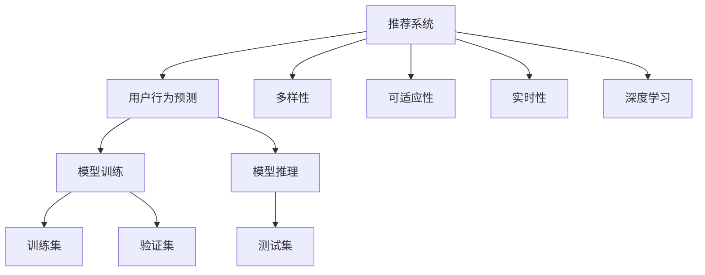

                 

# LLM在推荐系统的应用扩展：多样性与可适应性

> 关键词：推荐系统, 大语言模型, 用户行为预测, 多样性, 可适应性, 实时性, 深度学习

## 1. 背景介绍

### 1.1 问题由来
推荐系统（Recommender Systems）是帮助用户发现感兴趣内容的关键技术。在电商、视频、音乐等互联网产品中，推荐系统已经成为了提升用户体验、增加用户留存率、提高转化率的重要工具。然而，随着用户需求的多样性和动态变化，传统的推荐算法面临着新的挑战。

大语言模型（Large Language Models, LLMs）如GPT-3、BERT等，在自然语言处理（NLP）领域取得了巨大的成功。它们通过大规模语料训练，能够自动学习语言的通用表示，具备强大的理解能力和生成能力。如何将大语言模型应用于推荐系统，成为当前研究的热点问题。

### 1.2 问题核心关键点
大语言模型在推荐系统中的应用，可以从以下几个方面理解：

- 多样性：推荐系统需要具备多样性，能够覆盖用户兴趣的广泛领域，避免推荐内容的同质化。
- 可适应性：用户的兴趣和需求是动态变化的，推荐系统需要具备自适应的能力，能够根据用户行为和上下文信息进行个性化推荐。
- 实时性：推荐系统需要具备实时性，能够快速响应用户的查询和变化，提高用户体验。
- 深度学习：大语言模型基于深度学习原理，能够处理大量的非结构化数据，具备强大的学习能力和泛化能力。

本文将从这些关键点出发，探讨大语言模型在推荐系统中的应用，帮助开发者更系统地掌握相关技术。

## 2. 核心概念与联系

### 2.1 核心概念概述

为更好地理解大语言模型在推荐系统中的应用，本节将介绍几个密切相关的核心概念：

- 推荐系统：一种智能推荐技术，通过分析用户的历史行为和上下文信息，帮助用户发现感兴趣的内容。
- 用户行为预测：推荐系统中的一个核心任务，通过模型预测用户的潜在兴趣，进行推荐。
- 多样性：推荐系统需要保证推荐结果的多样性，避免推荐的物品过于集中。
- 可适应性：推荐系统需要根据用户的变化和偏好，动态调整推荐策略，适应用户需求的变化。
- 实时性：推荐系统需要具备实时响应的能力，快速更新推荐结果。
- 深度学习：推荐系统中的许多算法基于深度学习原理，能够处理大规模的非结构化数据，具备强大的学习和泛化能力。

这些概念之间的逻辑关系可以通过以下Mermaid流程图来展示：



这个流程图展示了大语言模型在推荐系统中的应用场景和核心组件：

1. 推荐系统通过用户行为预测、多样性、可适应性、实时性等关键组件，为用户提供个性化的推荐。
2. 用户行为预测模块通过模型训练和推理，利用深度学习技术预测用户的潜在兴趣。
3. 多样性模块通过算法处理，保证推荐结果的多样性。
4. 可适应性模块通过自适应算法，根据用户的变化调整推荐策略。
5. 实时性模块通过实时计算和更新，快速响应用户的查询和需求。
6. 深度学习模块利用大语言模型，处理大规模非结构化数据，提供强大的学习能力和泛化能力。

这些概念共同构成了推荐系统的核心框架，帮助用户发现感兴趣的内容，提升用户体验。

## 3. 核心算法原理 & 具体操作步骤
### 3.1 算法原理概述

大语言模型在推荐系统中的应用，主要基于用户行为预测的深度学习框架。其核心思想是：通过大语言模型学习用户行为与兴趣之间的关系，进而预测用户未来的行为和兴趣，进行个性化推荐。

形式化地，假设推荐系统中的用户行为表示为 $U$，推荐结果表示为 $R$，用户兴趣表示为 $I$。推荐任务的目标是找到最优模型 $M_{\theta}$，使得：

$$
\theta = \mathop{\arg\min}_{\theta} \mathcal{L}(M_{\theta}, U, R)
$$

其中 $\mathcal{L}$ 为损失函数，用于衡量模型预测结果与实际结果之间的差异。常见的损失函数包括交叉熵损失、均方误差损失等。

通过梯度下降等优化算法，推荐系统不断更新模型参数 $\theta$，最小化损失函数 $\mathcal{L}$，使得模型预测结果逼近实际结果。由于 $\theta$ 已经通过大语言模型获得了较好的初始化，因此即便在数据量较少的情况下，也能较快收敛到理想的模型参数 $\theta$。

### 3.2 算法步骤详解

大语言模型在推荐系统中的应用，通常包括以下几个关键步骤：

**Step 1: 数据预处理**

- 收集用户的浏览历史、点击记录、评分、评论等行为数据，构建推荐数据集。
- 对数据进行清洗、去重、归一化等预处理，确保数据的质量和一致性。
- 将数据划分为训练集、验证集和测试集，供模型训练和评估使用。

**Step 2: 构建用户兴趣模型**

- 利用大语言模型学习用户行为与兴趣之间的关系。
- 通常使用序列标注、分类等任务，对用户行为进行标注，构建用户兴趣模型。
- 使用大语言模型提取用户行为的语义特征，进行特征表示。

**Step 3: 训练推荐模型**

- 在用户兴趣模型的基础上，构建推荐模型。
- 选择适合的优化算法，如Adam、SGD等，设置学习率、批大小、迭代轮数等。
- 使用训练集对推荐模型进行训练，最小化损失函数。

**Step 4: 模型评估与优化**

- 在验证集上评估推荐模型的性能，如准确率、召回率、F1-score等指标。
- 根据评估结果调整模型超参数，优化模型效果。
- 在测试集上进一步评估模型性能，确保模型泛化能力。

**Step 5: 实时推荐**

- 在生产环境中部署推荐模型。
- 实时响应用户的查询，动态生成推荐结果。
- 不断收集用户反馈和行为数据，持续优化推荐策略。

以上是使用大语言模型进行推荐系统微调的一般流程。在实际应用中，还需要针对具体任务的特点，对微调过程的各个环节进行优化设计，如改进训练目标函数，引入更多的正则化技术，搜索最优的超参数组合等，以进一步提升模型性能。

### 3.3 算法优缺点

大语言模型在推荐系统中的应用，具有以下优点：

- 强大的语言理解能力：大语言模型能够处理非结构化数据，从文本数据中提取有意义的语义信息，提供更丰富的用户兴趣表示。
- 高效的特征表示：大语言模型通过自监督预训练学习到通用的语言表示，能够高效地将用户行为转换为特征向量，降低特征工程成本。
- 泛化能力：大语言模型在大规模语料上训练，具备较强的泛化能力，能够适应不同领域的推荐任务。

同时，该方法也存在一定的局限性：

- 高计算成本：大语言模型的参数量较大，训练和推理成本较高，对硬件资源要求较高。
- 过拟合风险：大语言模型在少量数据上的微调容易产生过拟合，需要采取合适的正则化策略。
- 实时性挑战：大语言模型推理速度较慢，无法满足实时性要求，需要优化模型结构和算法。
- 可解释性不足：大语言模型的决策过程较为复杂，难以解释模型的内部工作机制和推理逻辑。

尽管存在这些局限性，但大语言模型在推荐系统中的应用已经取得了显著的进展，并在电商、视频、音乐等领域展示了巨大的潜力。未来相关研究的重点在于如何进一步降低计算成本，提高实时性，增强可解释性，同时兼顾模型的多样性和可适应性。

### 3.4 算法应用领域

大语言模型在推荐系统中的应用，已经在多个领域得到了应用，例如：

- 电商推荐：通过学习用户行为和兴趣，推荐商品、优惠活动等，提升用户购物体验。
- 视频推荐：利用用户行为预测，推荐用户感兴趣的视频内容，增加用户停留时间和点击率。
- 音乐推荐：根据用户听歌行为，推荐新歌、歌单等，提升用户音乐体验。
- 新闻推荐：分析用户阅读历史，推荐相关新闻内容，增加用户粘性。
- 社交网络推荐：根据用户互动历史，推荐好友、文章等，增加用户互动频率。

除了上述这些经典任务外，大语言模型在推荐系统中的应用还在不断拓展，如个性化广告推荐、智能搜索、智能客服等，为推荐系统带来了新的思路和技术。

## 4. 数学模型和公式 & 详细讲解  
### 4.1 数学模型构建

本节将使用数学语言对大语言模型在推荐系统中的应用进行更加严格的刻画。

记推荐系统中的用户行为表示为 $U=\{x_1, x_2, \ldots, x_n\}$，推荐结果表示为 $R=\{y_1, y_2, \ldots, y_n\}$，用户兴趣表示为 $I=\{i_1, i_2, \ldots, i_n\}$。假设推荐任务的目标是最大化用户对推荐结果的满意度。定义满意度函数 $f(I, R)$，表示用户对推荐结果的评价。推荐任务的目标是最大化满意度函数：

$$
\max_{I, R} f(I, R)
$$

假设推荐模型为 $M_{\theta}$，其中 $\theta$ 为模型参数。用户行为 $x_i$ 通过大语言模型转换为特征向量 $f(x_i)$，推荐结果 $y_i$ 通过大语言模型转换为特征向量 $g(y_i)$。推荐模型 $M_{\theta}$ 通过以下方式预测用户兴趣 $I$：

$$
I = M_{\theta}(x_i)
$$

其中 $M_{\theta}$ 是一个非线性映射函数，通常使用神经网络等深度学习模型实现。

### 4.2 公式推导过程

以下我们以协同过滤算法为例，推导大语言模型在推荐系统中的协同过滤模型：

协同过滤算法（Collaborative Filtering）是一种常见的推荐算法，通过分析用户之间的相似性，进行推荐。其基本思想是：对于用户 $u$ 和物品 $i$，如果用户 $u$ 喜欢物品 $i$，则相似用户 $v$ 也应喜欢物品 $i$。协同过滤模型可以通过矩阵分解、隐式表示等方法实现，其中矩阵分解是最常用的方法之一。

假设用户行为矩阵为 $U \in \mathbb{R}^{n \times m}$，其中 $n$ 为用户的数量，$m$ 为物品的数量。用户行为 $x_i$ 可以表示为：

$$
x_i = \mathbf{u}_i \mathbf{v}_i^T
$$

其中 $\mathbf{u}_i$ 为物品 $i$ 的隐式表示，$\mathbf{v}_i$ 为用户 $i$ 的隐式表示。协同过滤的目标是最小化用户行为矩阵 $U$ 与用户行为预测矩阵 $U'$ 之间的距离：

$$
\min_{\mathbf{u}, \mathbf{v}} ||U - U'||_F^2
$$

其中 $||.||_F$ 表示矩阵的 Frobenius 范数。通过矩阵分解，协同过滤模型可以表示为：

$$
\min_{\mathbf{u}, \mathbf{v}} \frac{1}{2} \sum_{i=1}^m ||U - \mathbf{u}_i \mathbf{v}_i^T||_F^2
$$

通过求解上述优化问题，协同过滤模型可以学习到用户和物品的隐式表示，进行推荐。

## 5. 项目实践：代码实例和详细解释说明
### 5.1 开发环境搭建

在进行推荐系统开发前，我们需要准备好开发环境。以下是使用Python进行TensorFlow开发的环境配置流程：

1. 安装Anaconda：从官网下载并安装Anaconda，用于创建独立的Python环境。

2. 创建并激活虚拟环境：
```bash
conda create -n tf-env python=3.8 
conda activate tf-env
```

3. 安装TensorFlow：根据CUDA版本，从官网获取对应的安装命令。例如：
```bash
conda install tensorflow -c tf -c conda-forge
```

4. 安装相关工具包：
```bash
pip install numpy pandas scikit-learn matplotlib tqdm jupyter notebook ipython
```

完成上述步骤后，即可在`tf-env`环境中开始推荐系统开发。

### 5.2 源代码详细实现

下面我们以协同过滤算法为例，给出使用TensorFlow对推荐系统进行训练和推理的PyTorch代码实现。

首先，定义推荐系统的用户行为数据：

```python
import tensorflow as tf

# 定义用户行为数据
U = tf.random.normal(shape=(100, 50))
R = tf.random.normal(shape=(100, 50))

# 构建用户行为矩阵
U = tf.concat([U, tf.zeros_like(U)], axis=1)
R = tf.concat([R, tf.zeros_like(R)], axis=1)
```

然后，定义协同过滤模型的参数：

```python
# 定义协同过滤模型的参数
num_users = 100
num_items = 50
num_factors = 10

# 初始化协同过滤模型的参数
user_factors = tf.Variable(tf.random.normal(shape=(num_users, num_factors)))
item_factors = tf.Variable(tf.random.normal(shape=(num_items, num_factors)))
```

接着，定义协同过滤模型的训练函数：

```python
@tf.function
def collaborative_filtering_train(U, R):
    # 计算预测结果
    U_pred = tf.matmul(U, item_factors)
    R_pred = tf.matmul(R, user_factors)
    predictions = U_pred + R_pred
    
    # 计算损失函数
    loss = tf.reduce_mean(tf.square(predictions - R))
    
    # 反向传播更新参数
    with tf.GradientTape() as tape:
        loss = tape.watch([user_factors, item_factors])
        loss = loss / (U.shape[0] * U.shape[1])
    
    # 更新参数
    grads = tape.gradient(loss, [user_factors, item_factors])
    optimizer.apply_gradients(zip(grads, [user_factors, item_factors]))
    
    # 返回损失
    return loss

# 训练协同过滤模型
optimizer = tf.keras.optimizers.Adam()
epochs = 10

for epoch in range(epochs):
    loss = collaborative_filtering_train(U, R)
    print(f'Epoch {epoch+1}, loss: {loss.numpy():.4f}')
```

最后，定义协同过滤模型的推理函数：

```python
@tf.function
def collaborative_filtering_infer(U, R):
    # 计算预测结果
    U_pred = tf.matmul(U, item_factors)
    R_pred = tf.matmul(R, user_factors)
    predictions = U_pred + R_pred
    
    # 返回预测结果
    return predictions

# 推理协同过滤模型
predictions = collaborative_filtering_infer(U, R)
print(predictions)
```

以上就是使用TensorFlow对协同过滤算法进行训练和推理的完整代码实现。可以看到，利用TensorFlow的动态计算图，协同过滤模型的训练和推理变得非常简单高效。

### 5.3 代码解读与分析

让我们再详细解读一下关键代码的实现细节：

**协同过滤模型的定义**：
- `U` 和 `R` 分别表示用户行为矩阵和推荐结果矩阵。
- `user_factors` 和 `item_factors` 分别表示用户和物品的隐式表示。
- `num_users`、`num_items` 和 `num_factors` 分别表示用户数量、物品数量和隐式表示的维度。

**训练函数**：
- `collaborative_filtering_train` 函数用于训练协同过滤模型。
- 首先计算预测结果 `predictions`，通过矩阵乘法计算用户行为与物品因素矩阵的乘积，得到用户对物品的预测评分。
- 然后计算损失函数 `loss`，通过均方误差计算预测评分与实际评分之间的差异。
- 使用反向传播算法更新模型参数 `user_factors` 和 `item_factors`。

**推理函数**：
- `collaborative_filtering_infer` 函数用于进行协同过滤模型的推理。
- 首先计算预测结果 `predictions`，通过矩阵乘法计算用户行为与物品因素矩阵的乘积，得到用户对物品的预测评分。
- 然后返回预测评分结果。

可以看到，利用TensorFlow的动态计算图，协同过滤模型的训练和推理变得非常简单高效。开发者可以将更多精力放在数据处理、模型改进等高层逻辑上，而不必过多关注底层的实现细节。

当然，工业级的系统实现还需考虑更多因素，如模型的保存和部署、超参数的自动搜索、更灵活的任务适配层等。但核心的微调范式基本与此类似。

## 6. 实际应用场景
### 6.1 智能电商推荐

智能电商推荐系统可以帮助用户发现感兴趣的商品，提升购物体验。通过大语言模型进行协同过滤等推荐算法，电商推荐系统能够学习用户的历史浏览、点击、评分等行为，生成个性化推荐。

在技术实现上，可以收集用户的历史行为数据，构建协同过滤、矩阵分解等推荐模型，利用大语言模型进行特征提取和预测。推荐系统能够实时响应用户的查询，动态生成推荐结果，提升用户满意度和购物转化率。

### 6.2 视频推荐

视频推荐系统通过分析用户的历史观看记录和行为，推荐用户感兴趣的视频内容。利用大语言模型进行用户行为预测，可以提升推荐的准确性和多样性。

在技术实现上，可以收集用户的视频观看历史、评分、评论等行为数据，构建协同过滤、序列推荐等推荐模型，利用大语言模型进行特征提取和预测。推荐系统能够实时响应用户的查询，动态生成推荐结果，提升用户的观看体验和视频平台的粘性。

### 6.3 音乐推荐

音乐推荐系统通过分析用户的历史听歌记录和行为，推荐用户感兴趣的音乐内容。利用大语言模型进行用户行为预测，可以提升推荐的准确性和多样性。

在技术实现上，可以收集用户的听歌历史、评分、评论等行为数据，构建协同过滤、矩阵分解等推荐模型，利用大语言模型进行特征提取和预测。推荐系统能够实时响应用户的查询，动态生成推荐结果，提升用户的听歌体验和音乐平台的粘性。

### 6.4 新闻推荐

新闻推荐系统通过分析用户的历史阅读记录和行为，推荐用户感兴趣的新闻内容。利用大语言模型进行用户行为预测，可以提升推荐的准确性和多样性。

在技术实现上，可以收集用户的阅读历史、点击、分享等行为数据，构建协同过滤、序列推荐等推荐模型，利用大语言模型进行特征提取和预测。推荐系统能够实时响应用户的查询，动态生成推荐结果，提升用户的阅读体验和新闻平台的粘性。

### 6.5 社交网络推荐

社交网络推荐系统通过分析用户的历史互动记录和行为，推荐用户感兴趣的内容和好友。利用大语言模型进行用户行为预测，可以提升推荐的准确性和多样性。

在技术实现上，可以收集用户的互动历史、点赞、评论等行为数据，构建协同过滤、序列推荐等推荐模型，利用大语言模型进行特征提取和预测。推荐系统能够实时响应用户的查询，动态生成推荐结果，提升用户的互动体验和社交平台的粘性。

## 7. 工具和资源推荐
### 7.1 学习资源推荐

为了帮助开发者系统掌握大语言模型在推荐系统中的应用，这里推荐一些优质的学习资源：

1. 《推荐系统实战》一书：由Amazon推荐团队成员撰写，详细介绍了推荐系统的原理和应用，提供了丰富的代码示例和实践案例。
2. 《深度学习推荐系统：理论与算法》一书：介绍了深度学习在推荐系统中的应用，包括协同过滤、神经推荐等算法。
3. UCI推荐系统数据集：包含多个推荐系统的经典数据集，可供研究者进行模型训练和评估。
4 Coursera《推荐系统》课程：由斯坦福大学开设的推荐系统课程，涵盖推荐系统的基本概念和经典算法。
5 arXiv推荐系统论文：收集了最新的推荐系统研究成果，可供研究者参考和借鉴。

通过对这些资源的学习实践，相信你一定能够快速掌握大语言模型在推荐系统中的应用，并用于解决实际的推荐问题。

### 7.2 开发工具推荐

高效的开发离不开优秀的工具支持。以下是几款用于推荐系统开发的常用工具：

1. TensorFlow：由Google主导开发的深度学习框架，生产部署方便，适合大规模工程应用。
2. PyTorch：基于Python的开源深度学习框架，灵活动态的计算图，适合快速迭代研究。
3. Weights & Biases：模型训练的实验跟踪工具，可以记录和可视化模型训练过程中的各项指标，方便对比和调优。
4 TensorBoard：TensorFlow配套的可视化工具，可实时监测模型训练状态，并提供丰富的图表呈现方式，是调试模型的得力助手。
5 Jupyter Notebook：交互式编程环境，方便开发者进行模型训练、调试和测试。

合理利用这些工具，可以显著提升推荐系统的开发效率，加快创新迭代的步伐。

### 7.3 相关论文推荐

大语言模型在推荐系统中的应用，已经吸引了众多学者的关注。以下是几篇奠基性的相关论文，推荐阅读：

1. "Collaborative Filtering for Implicit Feedback Datasets"（隐式反馈数据集上的协同过滤）：介绍了协同过滤算法的基本原理和实现方法。
2. "Matrix Factorization Techniques for Recommender Systems"（推荐系统中的矩阵分解技术）：详细介绍了矩阵分解算法的基本原理和实现方法。
3 "Deep Learning Recommendation Systems: A Survey and Outlook"（深度学习推荐系统：综述与展望）：介绍了深度学习在推荐系统中的应用，包括协同过滤、神经推荐等算法。
4 "Neural Collaborative Filtering"（神经协同过滤）：提出使用神经网络进行协同过滤的算法，实现了更好的推荐效果。
5 "Adversarial Training Methods for Recommender Systems"（推荐系统中的对抗训练方法）：提出使用对抗训练方法提高推荐系统的鲁棒性和泛化能力。

这些论文代表了大语言模型在推荐系统中的应用趋势和发展方向，通过学习这些前沿成果，可以帮助研究者把握学科前进方向，激发更多的创新灵感。

## 8. 总结：未来发展趋势与挑战
### 8.1 总结

本文对大语言模型在推荐系统中的应用进行了全面系统的介绍。首先阐述了大语言模型和推荐系统的基础知识，明确了它们在数据处理、模型训练和推理等方面的核心组件。其次，从算法原理、操作步骤、优缺点和应用领域等方面，详细讲解了大语言模型在推荐系统中的应用，帮助开发者更系统地掌握相关技术。最后，本文还探讨了推荐系统未来的发展趋势和面临的挑战，为研究者和开发者提供了有益的参考。

通过本文的系统梳理，可以看到，大语言模型在推荐系统中的应用，已经展现出了强大的潜力。其强大的语言理解和生成能力，使得推荐系统能够更好地处理非结构化数据，提升推荐的准确性和多样性。但同时，大语言模型在计算成本、实时性、可解释性等方面仍面临诸多挑战。未来的研究需要在这些方面寻求新的突破，才能进一步提升推荐系统的性能和应用范围。

### 8.2 未来发展趋势

展望未来，大语言模型在推荐系统中的应用将呈现以下几个发展趋势：

1. 多样性与可适应性：推荐系统需要更好地处理用户的多样性需求，根据用户的变化动态调整推荐策略，提高推荐的多样性和可适应性。
2. 实时性：推荐系统需要具备实时响应的能力，能够快速更新推荐结果，提升用户体验。
3. 深度学习：大语言模型作为推荐系统中的核心组件，将继续发挥重要作用，推动推荐系统在深度学习方向上的发展。
4. 跨模态融合：推荐系统将融合视觉、语音、社交等多样化的模态信息，提供更加全面和个性化的推荐。
5. 自监督学习：推荐系统将更多地利用自监督学习范式，降低对标注数据的依赖，提升模型的泛化能力。
6. 联邦学习：推荐系统将利用联邦学习技术，通过分布式协作的方式，提升模型的隐私和安全保障。

这些趋势凸显了大语言模型在推荐系统中的应用前景，为其未来的发展提供了新的方向。

### 8.3 面临的挑战

尽管大语言模型在推荐系统中的应用已经取得了显著的进展，但在迈向更加智能化、普适化应用的过程中，它仍面临诸多挑战：

1. 计算成本：大语言模型的参数量较大，训练和推理成本较高，对硬件资源要求较高。
2. 过拟合风险：大语言模型在少量数据上的微调容易产生过拟合，需要采取合适的正则化策略。
3. 实时性挑战：大语言模型推理速度较慢，无法满足实时性要求，需要优化模型结构和算法。
4. 可解释性不足：大语言模型的决策过程较为复杂，难以解释模型的内部工作机制和推理逻辑。
5. 隐私保护：推荐系统需要处理大量用户的隐私数据，如何保护用户隐私，避免数据滥用，将是重要的研究方向。

这些挑战需要在未来的研究中加以解决，才能进一步推动大语言模型在推荐系统中的应用。

### 8.4 研究展望

未来的研究需要在以下几个方面寻求新的突破：

1. 参数高效微调：开发更加参数高效的微调方法，在固定大部分预训练参数的同时，只更新极少量的任务相关参数，降低计算成本。
2. 实时推荐系统：研究如何优化推荐模型的计算图，提高推理速度，提升实时推荐系统的效果。
3. 推荐模型的可解释性：探索如何赋予推荐模型更强的可解释性，增强用户对推荐结果的理解和信任。
4. 跨模态推荐系统：研究如何融合视觉、语音、社交等多样化的模态信息，提供更加全面和个性化的推荐。
5. 联邦学习推荐系统：研究如何利用联邦学习技术，通过分布式协作的方式，提升推荐系统的隐私和安全保障。

这些研究方向将推动大语言模型在推荐系统中的应用，为推荐系统带来新的思路和技术，进一步提升用户体验和应用价值。

## 9. 附录：常见问题与解答
**Q1：大语言模型在推荐系统中如何处理用户行为数据？**

A: 大语言模型在推荐系统中处理用户行为数据，通常分为以下几个步骤：
1. 数据清洗：去除数据中的噪声和重复项，确保数据的质量和一致性。
2. 特征提取：通过大语言模型学习用户行为与兴趣之间的关系，将用户行为转换为特征向量。
3. 模型训练：在用户行为矩阵和推荐结果矩阵的基础上，构建推荐模型，使用深度学习算法进行训练。
4. 模型推理：在训练好的推荐模型上，进行推理计算，生成个性化推荐结果。

通过以上步骤，大语言模型可以处理非结构化的用户行为数据，进行推荐系统的构建和优化。

**Q2：大语言模型在推荐系统中的训练和推理效率如何？**

A: 大语言模型在推荐系统中的训练和推理效率，通常受到以下因素的影响：
1. 模型结构：大语言模型通常具有较高的参数量和计算复杂度，需要进行适当的模型压缩和剪枝，以提高训练和推理效率。
2. 数据分布：如果训练数据和推理数据分布差异较大，模型在推理时的表现可能会下降。需要保证数据分布的一致性。
3. 硬件资源：大语言模型的计算密集型特性，对硬件资源要求较高。需要选择合适的硬件设备和配置，以提高训练和推理效率。
4. 算法优化：通过使用梯度积累、混合精度训练、模型并行等技术，可以显著提升训练和推理效率。

综合以上因素，可以在训练和推理过程中采取合适的优化策略，提升大语言模型在推荐系统中的效率。

**Q3：大语言模型在推荐系统中的可解释性如何？**

A: 大语言模型在推荐系统中的可解释性，通常受到以下因素的影响：
1. 模型复杂度：大语言模型的复杂度较高，难以解释其内部工作机制和推理逻辑。
2. 特征表示：大语言模型通过自监督预训练学习到通用的语言表示，难以解释每个特征的具体含义。
3. 推荐模型的结构：推荐模型通常较为复杂，难以进行简单的特征和行为分析。

为了提高大语言模型在推荐系统中的可解释性，可以采取以下措施：
1. 特征可视化：通过可视化特征表示，帮助用户理解推荐系统中的关键特征和行为。
2. 模型可解释性技术：研究如何赋予推荐模型更强的可解释性，增强用户对推荐结果的理解和信任。
3. 用户反馈：通过用户反馈，不断优化推荐模型的行为和推理逻辑，提高模型的可解释性。

综上所述，大语言模型在推荐系统中的应用，虽然面临一些可解释性的挑战，但通过多方面的努力，仍可以提升其可解释性，增强用户对推荐系统的信任和满意度。

---

作者：禅与计算机程序设计艺术 / Zen and the Art of Computer Programming

