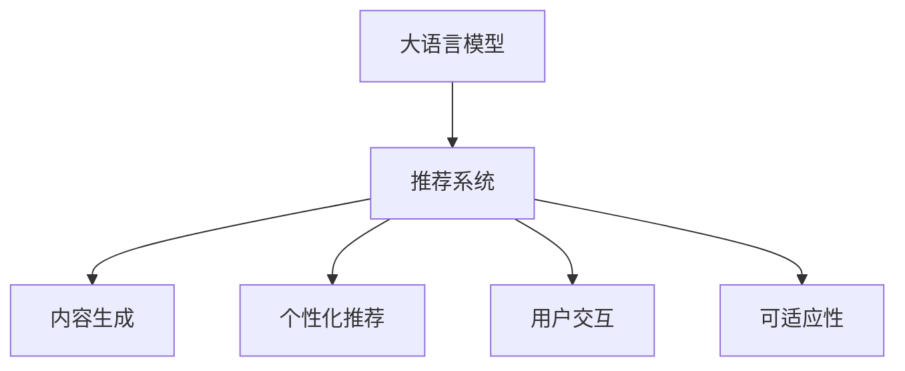

                 

# LLM在推荐系统的应用扩展：多样性与可适应性

> 关键词：大语言模型(LLM), 推荐系统, 多样性, 可适应性, 自然语言处理(NLP), 深度学习, 数据驱动

## 1. 背景介绍

### 1.1 问题由来

在数字时代，推荐系统成为了用户获取信息、消费娱乐的主要方式之一。随着个性化需求的不断增加，传统的推荐算法在面对用户多样化的需求时，显得力不从心。如何在保证推荐结果精准性的同时，提供更丰富、多样化的内容，提升用户满意度和粘性，是推荐系统面临的重要挑战。

近年来，大语言模型（Large Language Model, LLM）在自然语言处理（NLP）领域取得了显著进展，其强大的语言理解和生成能力，为推荐系统提供了新的解决方案。通过将LLM引入推荐系统，可以实现内容的多样化和可适应性扩展，提升推荐系统的表现。

### 1.2 问题核心关键点

LLM在推荐系统中的多样性与可适应性扩展，关键点在于：

- **内容生成与多样性**：利用LLM生成文本、音频、视频等多种内容形式，丰富推荐内容。
- **个性化与可适应性**：根据用户的行为数据和偏好，LLM可以生成个性化推荐内容。
- **交互与反馈**：用户与推荐系统的交互中，LLM可以不断学习并优化推荐模型。
- **动态性与自适应性**：LLM可以动态地处理变化的市场环境，自适应调整推荐策略。

这些关键点构成了LLM在推荐系统中的核心应用价值。通过理解这些关键点，我们可以更好地把握LLM在推荐系统中的工作原理和优化方向。

## 2. 核心概念与联系

### 2.1 核心概念概述

为更好地理解LLM在推荐系统中的应用，本节将介绍几个密切相关的核心概念：

- **大语言模型(LLM)**：以自回归(如GPT)或自编码(如BERT)模型为代表的大规模预训练语言模型。通过在大规模无标签文本语料上进行预训练，学习通用的语言表示，具备强大的语言理解和生成能力。

- **推荐系统**：通过分析用户历史行为和兴趣，为用户推荐可能感兴趣的产品、内容等。推荐系统可以显著提升用户满意度、增加用户粘性、提高用户转化率。

- **内容生成**：利用LLM生成文本、音频、视频等多种内容形式，为推荐系统提供多样化的推荐内容。

- **个性化推荐**：根据用户的行为数据和偏好，利用LLM生成个性化的推荐内容。

- **用户交互**：用户与推荐系统的互动过程中，通过LLM进行内容的生成和优化。

- **可适应性**：LLM能够根据市场变化和用户反馈，动态调整推荐策略。

这些核心概念之间的逻辑关系可以通过以下Mermaid流程图来展示：



这个流程图展示了大语言模型在推荐系统中的核心应用价值：

1. 大语言模型作为推荐系统的基础，提供强大的内容生成和个性化推荐能力。
2. 通过用户交互和反馈，不断优化推荐策略。
3. 具备可适应性，能够动态调整推荐内容。

## 3. 核心算法原理 & 具体操作步骤

### 3.1 算法原理概述

基于LLM的推荐系统，其核心思想是利用LLM的强大语言生成能力，生成多样化的推荐内容，满足用户的多样化需求。主要步骤包括：

1. **预训练阶段**：在大型无标签数据集上预训练LLM，学习通用的语言表示。
2. **微调阶段**：根据推荐系统任务的特点，对LLM进行微调，使其能够生成符合用户需求的推荐内容。
3. **推荐阶段**：在推荐时，利用LLM生成多样化的推荐内容，结合用户历史行为和偏好，进行个性化推荐。

### 3.2 算法步骤详解

基于LLM的推荐系统主要包括以下关键步骤：

**Step 1: 数据准备与预处理**

- 收集用户历史行为数据，如浏览记录、购买记录、评分数据等。
- 收集推荐集数据，如商品描述、用户评价、相关推荐等。
- 将数据进行清洗和归一化处理，去除噪音和异常值。

**Step 2: 预训练模型加载**

- 加载预训练的LLM模型，如BERT、GPT等。
- 根据推荐系统任务，调整模型结构，如添加分类层、解码器等。

**Step 3: 模型微调**

- 收集推荐系统的标注数据集，如商品-用户-行为三元组。
- 在标注数据集上，对LLM进行微调，学习推荐内容生成。
- 使用合适的优化算法（如Adam、SGD等）进行训练，设置合适的超参数。

**Step 4: 内容生成**

- 在推荐时，根据用户行为和兴趣，输入相应查询，生成推荐内容。
- 利用LLM生成文本、音频、视频等多种内容形式，丰富推荐内容。

**Step 5: 个性化推荐**

- 结合用户历史行为和兴趣，对生成的推荐内容进行个性化调整。
- 根据用户反馈，动态调整推荐内容，提升推荐效果。

**Step 6: 动态更新**

- 定期更新模型参数，保持模型的最新状态。
- 根据市场变化和用户反馈，动态调整推荐策略。

### 3.3 算法优缺点

基于LLM的推荐系统具有以下优点：

- **内容多样化**：LLM可以生成多种形式的内容，丰富推荐内容。
- **个性化推荐**：能够根据用户行为和兴趣，生成个性化的推荐内容。
- **动态更新**：能够动态调整推荐策略，适应市场变化和用户反馈。

同时，该方法也存在一定的局限性：

- **资源消耗大**：LLM的计算和内存资源消耗较大，需要高性能计算设备和大量的训练数据。
- **训练周期长**：预训练和微调过程需要较长的训练时间，模型更新效率较低。
- **可解释性不足**：生成的推荐内容缺乏可解释性，难以理解其生成逻辑和决策过程。

尽管存在这些局限性，但就目前而言，基于LLM的推荐方法在推荐系统领域具有巨大的应用潜力。未来相关研究的重点在于如何进一步降低资源消耗，提高训练效率，同时兼顾可解释性和模型性能。

### 3.4 算法应用领域

基于LLM的推荐系统已经在多个领域得到了应用，例如：

- **电商推荐**：为电商用户推荐商品、优惠活动等。通过LLM生成商品描述、用户评价等，提升推荐效果。
- **音乐推荐**：为音乐用户推荐歌曲、专辑等。利用LLM生成歌词、歌手介绍等，丰富推荐内容。
- **视频推荐**：为视频用户推荐视频、电影等。利用LLM生成视频描述、用户评价等，提升推荐效果。
- **新闻推荐**：为用户推荐新闻、文章等。利用LLM生成新闻摘要、标题等，丰富推荐内容。

除了上述这些经典领域外，LLM在教育、娱乐、金融等诸多领域，也展现出了广阔的应用前景。随着预训练模型和微调方法的不断进步，基于LLM的推荐系统必将在更多场景下大放异彩。

## 4. 数学模型和公式 & 详细讲解  
### 4.1 数学模型构建

本节将使用数学语言对基于LLM的推荐系统进行更加严格的刻画。

记推荐系统的数据集为 $D=\{(x_i,y_i)\}_{i=1}^N$，其中 $x_i$ 为输入特征，如用户ID、商品ID、时间戳等，$y_i$ 为推荐结果，如商品ID、歌曲ID、视频ID等。

定义推荐模型为 $M_{\theta}$，其中 $\theta$ 为模型参数。假设推荐系统的目标是最大化用户满意度的期望，即：

$$
\max_{\theta} \mathbb{E}_{(x,y) \sim D} [f(x,y)]
$$

其中 $f(x,y)$ 为推荐结果的满意度函数，如点击率、购买率、评分等。

### 4.2 公式推导过程

以下我们以电商推荐为例，推导推荐模型的优化目标和求解步骤。

假设推荐模型为 $M_{\theta}$，输入特征为 $x$，输出结果为 $y$。推荐模型的目标函数为：

$$
\mathcal{L}(\theta) = -\frac{1}{N} \sum_{i=1}^N \log P_{M_{\theta}}(y_i|x_i)
$$

其中 $P_{M_{\theta}}(y_i|x_i)$ 为模型在输入 $x_i$ 下预测 $y_i$ 的概率分布。

根据交叉熵损失的定义，可以进一步化简为：

$$
\mathcal{L}(\theta) = -\frac{1}{N} \sum_{i=1}^N \sum_{y} y_i \log P_{M_{\theta}}(y_i|x_i)
$$

在实践中，通常使用基于梯度的优化算法（如Adam、SGD等）来近似求解上述最优化问题。设 $\eta$ 为学习率，则参数的更新公式为：

$$
\theta \leftarrow \theta - \eta \nabla_{\theta}\mathcal{L}(\theta)
$$

其中 $\nabla_{\theta}\mathcal{L}(\theta)$ 为损失函数对参数 $\theta$ 的梯度，可通过反向传播算法高效计算。

### 4.3 案例分析与讲解

以电商推荐为例，假设有一个电商网站，用户 $i$ 在浏览商品 $j$ 后，选择购买了商品 $k$。现在需要根据用户行为数据，训练一个推荐模型，预测用户购买商品 $j$ 的概率。

首先，收集用户浏览记录、购买记录等数据，构建训练集 $D=\{(x_i,y_i)\}_{i=1}^N$。其中 $x_i$ 为用户的浏览行为特征，$y_i$ 为购买商品ID。

然后，加载预训练的LLM模型 $M_{\theta}$，如BERT。根据电商推荐任务的特点，在模型的顶层添加分类层，并设置合适的输出维度和损失函数。

在训练时，将训练集数据分批次输入模型，前向传播计算损失函数。反向传播计算参数梯度，根据设定的优化算法和学习率更新模型参数。重复上述步骤直至收敛，得到训练好的推荐模型。

在推荐时，根据用户浏览行为特征 $x$，输入到模型中，生成推荐商品ID $y$。如果用户点击了推荐商品，说明推荐效果较好，可以继续优化模型参数；否则，可以认为推荐效果不佳，需要对模型进行调整。

## 5. 项目实践：代码实例和详细解释说明
### 5.1 开发环境搭建

在进行推荐系统实践前，我们需要准备好开发环境。以下是使用Python进行PyTorch开发的环境配置流程：

1. 安装Anaconda：从官网下载并安装Anaconda，用于创建独立的Python环境。

2. 创建并激活虚拟环境：
```bash
conda create -n pytorch-env python=3.8 
conda activate pytorch-env
```

3. 安装PyTorch：根据CUDA版本，从官网获取对应的安装命令。例如：
```bash
conda install pytorch torchvision torchaudio cudatoolkit=11.1 -c pytorch -c conda-forge
```

4. 安装Transformers库：
```bash
pip install transformers
```

5. 安装各类工具包：
```bash
pip install numpy pandas scikit-learn matplotlib tqdm jupyter notebook ipython
```

完成上述步骤后，即可在`pytorch-env`环境中开始推荐系统开发。

### 5.2 源代码详细实现

下面我们以电商推荐为例，给出使用Transformers库对BERT模型进行电商推荐任务微调的PyTorch代码实现。

首先，定义电商推荐任务的数据处理函数：

```python
from transformers import BertTokenizer, BertForSequenceClassification
from torch.utils.data import Dataset
import torch

class EcommDataset(Dataset):
    def __init__(self, texts, labels, tokenizer, max_len=128):
        self.texts = texts
        self.labels = labels
        self.tokenizer = tokenizer
        self.max_len = max_len
        
    def __len__(self):
        return len(self.texts)
    
    def __getitem__(self, item):
        text = self.texts[item]
        label = self.labels[item]
        
        encoding = self.tokenizer(text, return_tensors='pt', max_length=self.max_len, padding='max_length', truncation=True)
        input_ids = encoding['input_ids'][0]
        attention_mask = encoding['attention_mask'][0]
        
        # 对label进行one-hot编码
        label = torch.tensor([[0, 0, 1]] if label == '商品ID1' else [[0, 1, 0]], dtype=torch.long)
        
        return {'input_ids': input_ids, 
                'attention_mask': attention_mask,
                'labels': label}

# 商品ID1
train_dataset = EcommDataset(train_texts, train_labels, tokenizer)
dev_dataset = EcommDataset(dev_texts, dev_labels, tokenizer)
test_dataset = EcommDataset(test_texts, test_labels, tokenizer)
```

然后，定义模型和优化器：

```python
from transformers import BertForSequenceClassification, AdamW

model = BertForSequenceClassification.from_pretrained('bert-base-cased', num_labels=3)

optimizer = AdamW(model.parameters(), lr=2e-5)
```

接着，定义训练和评估函数：

```python
from torch.utils.data import DataLoader
from tqdm import tqdm
from sklearn.metrics import classification_report

device = torch.device('cuda') if torch.cuda.is_available() else torch.device('cpu')
model.to(device)

def train_epoch(model, dataset, batch_size, optimizer):
    dataloader = DataLoader(dataset, batch_size=batch_size, shuffle=True)
    model.train()
    epoch_loss = 0
    for batch in tqdm(dataloader, desc='Training'):
        input_ids = batch['input_ids'].to(device)
        attention_mask = batch['attention_mask'].to(device)
        labels = batch['labels'].to(device)
        model.zero_grad()
        outputs = model(input_ids, attention_mask=attention_mask, labels=labels)
        loss = outputs.loss
        epoch_loss += loss.item()
        loss.backward()
        optimizer.step()
    return epoch_loss / len(dataloader)

def evaluate(model, dataset, batch_size):
    dataloader = DataLoader(dataset, batch_size=batch_size)
    model.eval()
    preds, labels = [], []
    with torch.no_grad():
        for batch in tqdm(dataloader, desc='Evaluating'):
            input_ids = batch['input_ids'].to(device)
            attention_mask = batch['attention_mask'].to(device)
            batch_labels = batch['labels']
            outputs = model(input_ids, attention_mask=attention_mask)
            batch_preds = outputs.logits.argmax(dim=2).to('cpu').tolist()
            batch_labels = batch_labels.to('cpu').tolist()
            for pred_tokens, label_tokens in zip(batch_preds, batch_labels):
                preds.append(pred_tokens[:len(label_tokens)])
                labels.append(label_tokens)
                
    print(classification_report(labels, preds))
```

最后，启动训练流程并在测试集上评估：

```python
epochs = 5
batch_size = 16

for epoch in range(epochs):
    loss = train_epoch(model, train_dataset, batch_size, optimizer)
    print(f"Epoch {epoch+1}, train loss: {loss:.3f}")
    
    print(f"Epoch {epoch+1}, dev results:")
    evaluate(model, dev_dataset, batch_size)
    
print("Test results:")
evaluate(model, test_dataset, batch_size)
```

以上就是使用PyTorch对BERT进行电商推荐任务微调的完整代码实现。可以看到，得益于Transformers库的强大封装，我们可以用相对简洁的代码完成BERT模型的加载和微调。

### 5.3 代码解读与分析

让我们再详细解读一下关键代码的实现细节：

**EcommDataset类**：
- `__init__`方法：初始化文本、标签、分词器等关键组件。
- `__len__`方法：返回数据集的样本数量。
- `__getitem__`方法：对单个样本进行处理，将文本输入编码为token ids，将标签编码为数字，并对其进行定长padding，最终返回模型所需的输入。

**商品ID1**
**tag2id和id2tag字典**：
- 定义了标签与数字id之间的映射关系，用于将token-wise的预测结果解码回真实的标签。

**训练和评估函数**：
- 使用PyTorch的DataLoader对数据集进行批次化加载，供模型训练和推理使用。
- 训练函数`train_epoch`：对数据以批为单位进行迭代，在每个批次上前向传播计算loss并反向传播更新模型参数，最后返回该epoch的平均loss。
- 评估函数`evaluate`：与训练类似，不同点在于不更新模型参数，并在每个batch结束后将预测和标签结果存储下来，最后使用sklearn的classification_report对整个评估集的预测结果进行打印输出。

**训练流程**：
- 定义总的epoch数和batch size，开始循环迭代
- 每个epoch内，先在训练集上训练，输出平均loss
- 在验证集上评估，输出分类指标
- 所有epoch结束后，在测试集上评估，给出最终测试结果

可以看到，PyTorch配合Transformers库使得BERT微调的代码实现变得简洁高效。开发者可以将更多精力放在数据处理、模型改进等高层逻辑上，而不必过多关注底层的实现细节。

当然，工业级的系统实现还需考虑更多因素，如模型的保存和部署、超参数的自动搜索、更灵活的任务适配层等。但核心的微调范式基本与此类似。

## 6. 实际应用场景
### 6.1 电商推荐系统

基于大语言模型微调的电商推荐系统，可以为用户提供更加丰富、多样化的商品推荐。传统电商推荐系统往往只依赖用户行为数据，难以捕捉用户的多样化需求。而利用微调后的LLM，可以为电商推荐系统提供强大的内容生成能力，生成商品描述、用户评价等，提升推荐效果。

在技术实现上，可以收集电商用户的浏览、购买、评分等行为数据，提取和商品相关的内容描述、用户评价等文本信息。将文本内容作为模型输入，结合用户行为数据，在LLM上进行微调，生成个性化的商品推荐。对于新上架的商品，还可以利用LLM生成商品描述，吸引用户关注和购买。

### 6.2 音乐推荐系统

基于大语言模型微调的音乐推荐系统，可以为用户提供更加个性化、多样化的音乐推荐。传统音乐推荐系统往往依赖用户的听歌历史和评分数据，难以捕捉用户的个性化需求。而利用微调后的LLM，可以为音乐推荐系统提供强大的内容生成能力，生成歌词、歌手介绍等，提升推荐效果。

在技术实现上，可以收集音乐用户的听歌记录、评分数据等行为数据，提取和歌曲相关的内容描述、歌手介绍等文本信息。将文本内容作为模型输入，结合用户行为数据，在LLM上进行微调，生成个性化的音乐推荐。对于新上架的歌曲，还可以利用LLM生成歌词，吸引用户关注和播放。

### 6.3 视频推荐系统

基于大语言模型微调的视频推荐系统，可以为用户提供更加丰富、多样化的视频推荐。传统视频推荐系统往往依赖用户的观看历史和评分数据，难以捕捉用户的个性化需求。而利用微调后的LLM，可以为视频推荐系统提供强大的内容生成能力，生成视频描述、用户评价等，提升推荐效果。

在技术实现上，可以收集视频用户的观看记录、评分数据等行为数据，提取和视频相关的内容描述、用户评价等文本信息。将文本内容作为模型输入，结合用户行为数据，在LLM上进行微调，生成个性化的视频推荐。对于新上架的视频，还可以利用LLM生成视频描述，吸引用户关注和观看。

### 6.4 未来应用展望

随着大语言模型微调技术的不断发展，基于LLM的推荐系统将在更多领域得到应用，为各行各业带来变革性影响。

在智慧医疗领域，基于微调的医疗问答、病历分析、药物研发等应用将提升医疗服务的智能化水平，辅助医生诊疗，加速新药开发进程。

在智能教育领域，微调技术可应用于作业批改、学情分析、知识推荐等方面，因材施教，促进教育公平，提高教学质量。

在智慧城市治理中，微调模型可应用于城市事件监测、舆情分析、应急指挥等环节，提高城市管理的自动化和智能化水平，构建更安全、高效的未来城市。

此外，在企业生产、社会治理、文娱传媒等众多领域，基于LLM的推荐系统也将不断涌现，为NLP技术带来新的突破。相信随着技术的日益成熟，LLM在推荐系统中的应用将更加广泛，为人工智能技术带来新的发展机遇。

## 7. 工具和资源推荐
### 7.1 学习资源推荐

为了帮助开发者系统掌握大语言模型微调的理论基础和实践技巧，这里推荐一些优质的学习资源：

1. 《Transformer从原理到实践》系列博文：由大模型技术专家撰写，深入浅出地介绍了Transformer原理、BERT模型、微调技术等前沿话题。

2. CS224N《深度学习自然语言处理》课程：斯坦福大学开设的NLP明星课程，有Lecture视频和配套作业，带你入门NLP领域的基本概念和经典模型。

3. 《Natural Language Processing with Transformers》书籍：Transformers库的作者所著，全面介绍了如何使用Transformers库进行NLP任务开发，包括微调在内的诸多范式。

4. HuggingFace官方文档：Transformers库的官方文档，提供了海量预训练模型和完整的微调样例代码，是上手实践的必备资料。

5. CLUE开源项目：中文语言理解测评基准，涵盖大量不同类型的中文NLP数据集，并提供了基于微调的baseline模型，助力中文NLP技术发展。

通过对这些资源的学习实践，相信你一定能够快速掌握大语言模型微调的精髓，并用于解决实际的NLP问题。
###  7.2 开发工具推荐

高效的开发离不开优秀的工具支持。以下是几款用于大语言模型微调开发的常用工具：

1. PyTorch：基于Python的开源深度学习框架，灵活动态的计算图，适合快速迭代研究。大部分预训练语言模型都有PyTorch版本的实现。

2. TensorFlow：由Google主导开发的开源深度学习框架，生产部署方便，适合大规模工程应用。同样有丰富的预训练语言模型资源。

3. Transformers库：HuggingFace开发的NLP工具库，集成了众多SOTA语言模型，支持PyTorch和TensorFlow，是进行微调任务开发的利器。

4. Weights & Biases：模型训练的实验跟踪工具，可以记录和可视化模型训练过程中的各项指标，方便对比和调优。与主流深度学习框架无缝集成。

5. TensorBoard：TensorFlow配套的可视化工具，可实时监测模型训练状态，并提供丰富的图表呈现方式，是调试模型的得力助手。

6. Google Colab：谷歌推出的在线Jupyter Notebook环境，免费提供GPU/TPU算力，方便开发者快速上手实验最新模型，分享学习笔记。

合理利用这些工具，可以显著提升大语言模型微调任务的开发效率，加快创新迭代的步伐。

### 7.3 相关论文推荐

大语言模型和微调技术的发展源于学界的持续研究。以下是几篇奠基性的相关论文，推荐阅读：

1. Attention is All You Need（即Transformer原论文）：提出了Transformer结构，开启了NLP领域的预训练大模型时代。

2. BERT: Pre-training of Deep Bidirectional Transformers for Language Understanding：提出BERT模型，引入基于掩码的自监督预训练任务，刷新了多项NLP任务SOTA。

3. Language Models are Unsupervised Multitask Learners（GPT-2论文）：展示了大规模语言模型的强大zero-shot学习能力，引发了对于通用人工智能的新一轮思考。

4. Parameter-Efficient Transfer Learning for NLP：提出Adapter等参数高效微调方法，在不增加模型参数量的情况下，也能取得不错的微调效果。

5. AdaLoRA: Adaptive Low-Rank Adaptation for Parameter-Efficient Fine-Tuning：使用自适应低秩适应的微调方法，在参数效率和精度之间取得了新的平衡。

这些论文代表了大语言模型微调技术的发展脉络。通过学习这些前沿成果，可以帮助研究者把握学科前进方向，激发更多的创新灵感。

## 8. 总结：未来发展趋势与挑战

### 8.1 总结

本文对基于大语言模型微调的推荐系统进行了全面系统的介绍。首先阐述了LLM在推荐系统中的应用背景和价值，明确了微调在推荐系统中的关键作用。其次，从原理到实践，详细讲解了LLM微调的技术细节和操作步骤，给出了电商推荐任务的完整代码实现。同时，本文还探讨了LLM在多个领域的应用前景，展示了其在推荐系统中的广阔发展空间。

通过本文的系统梳理，可以看到，基于LLM的推荐系统已经在电商、音乐、视频等多个领域得到了应用，为推荐系统提供了新的解决方案。利用LLM的内容生成和个性化推荐能力，可以提升推荐系统的多样性和可适应性，满足用户的多样化需求，带来更好的用户体验。未来，随着技术的不断进步，LLM在推荐系统中的应用将更加广泛，为各行各业带来新的发展机遇。

### 8.2 未来发展趋势

展望未来，基于LLM的推荐系统将呈现以下几个发展趋势：

1. **内容生成多样化**：LLM可以生成文本、音频、视频等多种内容形式，丰富推荐内容，满足用户的多样化需求。
2. **个性化推荐增强**：利用LLM生成个性化的推荐内容，提升推荐系统的精准性和用户满意度。
3. **动态更新与自适应性**：LLM能够动态调整推荐策略，适应市场变化和用户反馈，保持推荐系统的时效性。
4. **多模态融合**：结合视觉、语音、文本等多模态信息，提升推荐系统的综合能力。
5. **跨领域应用扩展**：LLM在推荐系统中的应用将不断扩展，进入更多行业领域。
6. **技术进步与算法优化**：随着预训练模型和微调方法的发展，推荐系统的性能将进一步提升。

这些趋势展示了基于LLM的推荐系统在未来的广阔前景，为NLP技术的应用带来了新的突破。相信随着技术的不断演进，LLM在推荐系统中的应用将更加深入，为人工智能技术带来新的发展机遇。

### 8.3 面临的挑战

尽管基于LLM的推荐系统已经取得了显著进展，但在实现大规模应用的过程中，仍面临诸多挑战：

1. **资源消耗大**：LLM的计算和内存资源消耗较大，需要高性能计算设备和大量的训练数据。
2. **训练周期长**：预训练和微调过程需要较长的训练时间，模型更新效率较低。
3. **可解释性不足**：生成的推荐内容缺乏可解释性，难以理解其生成逻辑和决策过程。
4. **数据隐私与安全**：在推荐过程中，用户数据的隐私保护和安全性问题亟需解决。
5. **公平性与偏见**：推荐系统可能存在偏见，需要解决公平性和多样性问题。

尽管存在这些挑战，但通过技术创新和工程优化，这些问题有望逐步得到解决。LLM在推荐系统中的应用将进一步拓展，为各行各业带来新的发展机遇。

### 8.4 研究展望

面对基于LLM的推荐系统所面临的挑战，未来的研究需要在以下几个方面寻求新的突破：

1. **模型压缩与加速**：开发更加轻量级的推荐模型，提升计算效率和资源利用率。
2. **高效微调方法**：开发高效微调算法，缩短训练时间和提升模型性能。
3. **可解释性增强**：提升推荐系统的可解释性和透明度，帮助用户理解推荐内容。
4. **隐私保护与安全性**：加强用户数据隐私保护，确保数据安全和推荐系统的公平性。
5. **多模态融合**：结合视觉、语音、文本等多种模态信息，提升推荐系统的综合能力。
6. **跨领域应用**：拓展LLM在更多领域的应用，提升推荐系统的多样性和灵活性。

这些研究方向的探索，将引领基于LLM的推荐系统迈向更高的台阶，为人工智能技术带来新的突破。面向未来，LLM在推荐系统中的应用前景广阔，必将引领NLP技术迈向更加智能化、普适化的方向。

## 9. 附录：常见问题与解答

**Q1：大语言模型微调是否适用于所有推荐任务？**

A: 大语言模型微调在大多数推荐任务上都能取得不错的效果，特别是对于数据量较小的任务。但对于一些特定领域的任务，如医学、法律等，仅仅依靠通用语料预训练的模型可能难以很好地适应。此时需要在特定领域语料上进一步预训练，再进行微调，才能获得理想效果。此外，对于一些需要时效性、个性化很强的任务，如对话、推荐等，微调方法也需要针对性的改进优化。

**Q2：微调过程中如何选择合适的学习率？**

A: 微调的学习率一般要比预训练时小1-2个数量级，如果使用过大的学习率，容易破坏预训练权重，导致过拟合。一般建议从1e-5开始调参，逐步减小学习率，直至收敛。也可以使用warmup策略，在开始阶段使用较小的学习率，再逐渐过渡到预设值。需要注意的是，不同的优化器(如AdamW、Adafactor等)以及不同的学习率调度策略，可能需要设置不同的学习率阈值。

**Q3：采用大模型微调时会面临哪些资源瓶颈？**

A: 目前主流的预训练大模型动辄以亿计的参数规模，对算力、内存、存储都提出了很高的要求。GPU/TPU等高性能设备是必不可少的，但即便如此，超大批次的训练和推理也可能遇到显存不足的问题。因此需要采用一些资源优化技术，如梯度积累、混合精度训练、模型并行等，来突破硬件瓶颈。同时，模型的存储和读取也可能占用大量时间和空间，需要采用模型压缩、稀疏化存储等方法进行优化。

**Q4：如何缓解微调过程中的过拟合问题？**

A: 过拟合是微调面临的主要挑战，尤其是在标注数据不足的情况下。常见的缓解策略包括：
1. 数据增强：通过回译、近义替换等方式扩充训练集
2. 正则化：使用L2正则、Dropout、Early Stopping等避免过拟合
3. 对抗训练：引入对抗样本，提高模型鲁棒性
4. 参数高效微调：只调整少量参数(如Adapter、Prefix等)，减小过拟合风险
5. 多模型集成：训练多个微调模型，取平均输出，抑制过拟合

这些策略往往需要根据具体任务和数据特点进行灵活组合。只有在数据、模型、训练、推理等各环节进行全面优化，才能最大限度地发挥大模型微调的威力。

**Q5：微调模型在落地部署时需要注意哪些问题？**

A: 将微调模型转化为实际应用，还需要考虑以下因素：
1. 模型裁剪：去除不必要的层和参数，减小模型尺寸，加快推理速度
2. 量化加速：将浮点模型转为定点模型，压缩存储空间，提高计算效率
3. 服务化封装：将模型封装为标准化服务接口，便于集成调用
4. 弹性伸缩：根据请求流量动态调整资源配置，平衡服务质量和成本
5. 监控告警：实时采集系统指标，设置异常告警阈值，确保服务稳定性
6. 安全防护：采用访问鉴权、数据脱敏等措施，保障数据和模型安全

大语言模型微调为推荐系统提供了新的解决方案，但如何将强大的性能转化为稳定、高效、安全的业务价值，还需要工程实践的不断打磨。唯有从数据、算法、工程、业务等多个维度协同发力，才能真正实现人工智能技术在垂直行业的规模化落地。总之，微调需要开发者根据具体任务，不断迭代和优化模型、数据和算法，方能得到理想的效果。

---

作者：禅与计算机程序设计艺术 / Zen and the Art of Computer Programming

