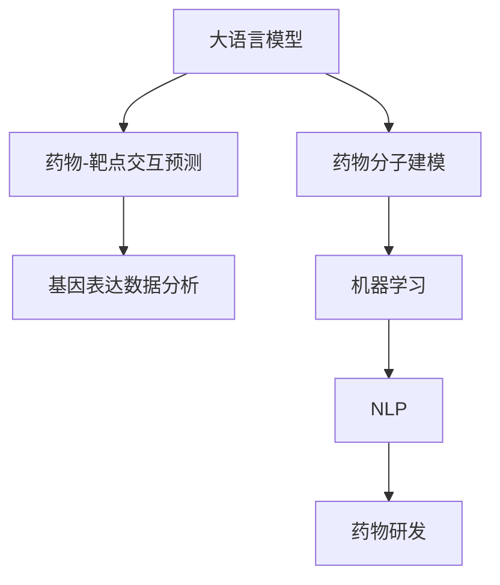
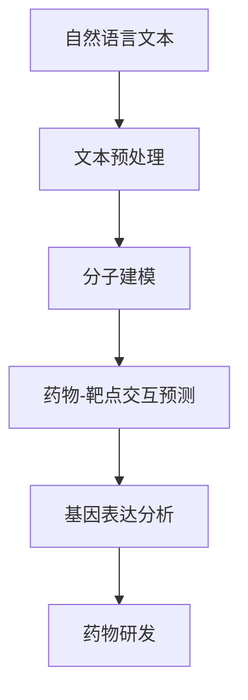

                 

# LLM在新药研发中的潜在作用

> 关键词：新药研发, 大语言模型(Large Language Models, LLMs), 药物发现(Pharmaceutical Discovery), 自然语言处理(Natural Language Processing, NLP), 药物分子建模, 分子生成, 机器学习(Machine Learning, ML), 药物-靶点交互预测, 基因表达数据分析, 医疗大数据

## 1. 背景介绍

### 1.1 问题由来

近年来，新药研发领域面临着诸多挑战，包括成本高昂、周期漫长、成功率低等。据统计，平均开发一种新药从实验室到市场，需要花费约10亿美元，并历时约12年。传统的新药研发流程繁琐复杂，需要科研人员耗费大量时间和精力，进行大量实验和临床试验，难以在短时间内开发出高效、安全的药物。

为此，人工智能技术的引入，特别是自然语言处理和大语言模型（Large Language Models, LLMs）的应用，为医药研发领域带来了新的思路和可能性。

### 1.2 问题核心关键点

新药研发的核心在于快速、高效地发现和验证药物分子，预测其与生物靶点（受体、酶等）的交互效果，确保其安全性和有效性。通过利用大语言模型处理和理解自然语言文本，可以从海量生物医学文献和临床数据中提取有用信息，辅助科研人员进行药物设计和发现，从而大幅缩短研发周期，降低成本。

大语言模型通过自监督和监督学习的训练方式，可以从大规模无标签文本数据中提取语言表示，通过预训练获得强大的语言理解和生成能力。在实际应用中，可以通过微调的方式将其应用于药物分子建模、药物-靶点交互预测、基因表达数据分析等新药研发任务，显著提升药物研发效率。

### 1.3 问题研究意义

研究大语言模型在新药研发中的应用，对于加速药物创新，提高药物研发效率，降低研发成本，具有重要意义：

1. 加速药物研发流程：利用大语言模型可以快速处理和理解自然语言文本，从而在药物分子建模、靶点预测、基因表达分析等环节提高效率。
2. 降低研发成本：大语言模型可以替代部分实验和分析工作，减少人力物力投入，节约研发成本。
3. 提升研发成功率：大语言模型可以从海量文献和数据中提取有价值的信息，提高药物分子设计的成功率，减少失败风险。
4. 缩短研发周期：通过自动化和加速数据分析，大语言模型可以加速药物研发各个环节的迭代，缩短从实验室到市场的时间。

## 2. 核心概念与联系

### 2.1 核心概念概述

为更好地理解大语言模型在新药研发中的应用，本节将介绍几个密切相关的核心概念：

- 大语言模型(Large Language Models, LLMs)：如GPT-3、BERT等，通过大规模预训练和微调，具备强大的自然语言处理能力，可以从文本中提取和生成语言表示。

- 药物分子建模(Drug Molecule Modeling)：指通过计算机模拟和计算，构建药物分子的结构和性质，预测其在生物体内的行为和效果。

- 药物-靶点交互预测(Pharmacodynamics Prediction)：指预测药物分子与生物靶点的相互作用效果，确定药物在体内的药效和毒性。

- 基因表达数据分析(Gene Expression Data Analysis)：指从基因表达数据中提取生物信息，分析基因与疾病、药物之间的关系。

- 机器学习(Machine Learning, ML)：通过学习算法，自动从数据中提取模式和规律，用于数据挖掘、预测分析等任务。

- 自然语言处理(Natural Language Processing, NLP)：涉及自然语言理解和生成，是大语言模型的基础技术领域，在新药研发中具有广泛应用。

这些核心概念之间的逻辑关系可以通过以下Mermaid流程图来展示：



这个流程图展示了大语言模型在药物研发中的应用路径：

1. 大语言模型通过预训练获得语言表示能力，可以处理和理解自然语言文本。
2. 将大语言模型应用于药物分子建模，进行药物分子结构的计算和预测。
3. 利用大语言模型进行药物-靶点交互预测，分析药物分子的药效和毒性。
4. 结合基因表达数据分析，利用大语言模型从基因数据中提取生物学信息。
5. 将大语言模型应用于机器学习，进行数据挖掘和预测分析。
6. 通过自然语言处理技术，大语言模型辅助药物研发各个环节，最终促进新药的发现和验证。

## 3. 核心算法原理 & 具体操作步骤
### 3.1 算法原理概述

大语言模型在新药研发中的应用，主要涉及以下几个关键算法：

1. 文本预处理与编码：将自然语言文本转换为计算机可处理的数字向量，包括分词、词向量嵌入、序列填充等。
2. 模型微调与优化：在预训练语言模型基础上，通过下游任务数据对其进行微调，更新部分参数，以适应特定任务需求。
3. 药物分子建模：利用大语言模型对分子结构和性质进行建模和预测，包括分子构象、药效团等。
4. 药物-靶点交互预测：通过大语言模型进行药物与生物靶点的相互作用效果预测，包括结合能、抑制率等。
5. 基因表达数据分析：利用大语言模型对基因表达数据进行处理和分析，提取基因与疾病、药物之间的关联。

以上算法原理可以通过以下流程图进行概述：



### 3.2 算法步骤详解

下面详细介绍大语言模型在新药研发中的具体算法步骤：

**Step 1: 数据预处理与编码**

1. **分词与词向量嵌入**：将自然语言文本进行分词处理，得到单个词汇，并使用预训练的词向量嵌入模型将词汇转换为向量表示。
2. **序列填充与编码**：对分词后的序列进行填充，确保序列长度一致，并进行编码，得到计算机可处理的数据。

**Step 2: 模型微调**

1. **选择模型与任务**：选择预训练的大语言模型，如BERT、GPT等，并确定需要微调的具体任务，如药物分子建模、靶点预测等。
2. **任务适配层设计**：根据具体任务需求，在预训练模型的顶层设计相应的输出层和损失函数。
3. **微调超参数设置**：设置学习率、批大小、迭代轮数等超参数，选择合适的优化算法，如Adam、SGD等。
4. **微调过程执行**：使用下游任务数据进行有监督的微调，更新模型参数，最小化损失函数。

**Step 3: 药物分子建模**

1. **分子结构表示**：将药物分子转换为SMILES或PDB格式，使用大语言模型对其进行编码，得到分子结构表示。
2. **构象预测**：利用大语言模型进行分子构象预测，得到多种可能的分子构象。
3. **药效团筛选**：根据构象预测结果，筛选出具有特定药效团的分子结构。

**Step 4: 药物-靶点交互预测**

1. **靶点信息提取**：利用大语言模型提取生物靶点的信息，如受体结构、功能位点等。
2. **药物分子与靶点交互模拟**：利用大语言模型模拟药物分子与靶点的相互作用效果，包括结合能、抑制率等。
3. **交互效果评估**：根据模拟结果，评估药物分子的效果和毒性，筛选出潜在的有效药物分子。

**Step 5: 基因表达数据分析**

1. **基因数据预处理**：对基因表达数据进行预处理，包括数据清洗、标准化、归一化等。
2. **基因与药物关系提取**：利用大语言模型提取基因与药物之间的关系，如基因表达与药物疗效的关系。
3. **基因表达分析**：使用大语言模型进行基因表达分析，预测基因的表达情况，提取生物学信息。

### 3.3 算法优缺点

大语言模型在新药研发中的应用，具有以下优点：

1. **高效处理文本数据**：大语言模型可以从海量文献和临床数据中提取有用信息，加速数据处理和分析。
2. **强大的药物分子建模能力**：通过大语言模型，可以快速构建和预测药物分子结构和性质，提高药物设计效率。
3. **药物-靶点交互预测准确性高**：利用大语言模型进行药物-靶点交互模拟，可以准确预测药物的药效和毒性，提高新药研发成功率。
4. **基因表达数据分析精度高**：大语言模型可以从基因表达数据中提取有价值的信息，分析基因与药物之间的关系。

同时，也存在一些局限性：

1. **数据依赖性强**：大语言模型的应用依赖于高质量的文本数据，数据获取和处理成本较高。
2. **模型复杂度高**：大语言模型参数量庞大，计算资源需求高，训练和推理成本较高。
3. **结果解释性不足**：大语言模型的决策过程缺乏可解释性，难以对其内部工作机制进行解释。
4. **技术门槛高**：大语言模型的应用需要一定的技术储备，对开发者要求较高。

### 3.4 算法应用领域

大语言模型在新药研发中的应用，主要包括以下几个领域：

1. **药物分子建模**：通过大语言模型进行药物分子结构的建模和预测，辅助药物设计。
2. **药物-靶点交互预测**：利用大语言模型预测药物与生物靶点的相互作用效果，筛选有效药物分子。
3. **基因表达数据分析**：通过大语言模型分析基因表达数据，提取生物学信息，支持新药研发。
4. **药物分子生成**：利用大语言模型生成新的药物分子结构，辅助药物创新。
5. **药物临床试验设计**：使用大语言模型分析临床试验数据，优化试验设计和方案。
6. **药物知识库构建**：通过大语言模型构建药物知识库，存储和管理药物相关信息。

## 4. 数学模型和公式 & 详细讲解  
### 4.1 数学模型构建

假设大语言模型为 $M_{\theta}$，其中 $\theta$ 为模型参数。给定药物分子建模任务 $T_{mol}$ 的训练数据集 $D=\{(x_i,y_i)\}_{i=1}^N, x_i \in \mathcal{X}, y_i \in \mathcal{Y}$，其中 $\mathcal{X}$ 为分子结构向量，$\mathcal{Y}$ 为药效团标签。

定义模型 $M_{\theta}$ 在数据样本 $(x,y)$ 上的损失函数为 $\ell(M_{\theta}(x),y)$，则在数据集 $D$ 上的经验风险为：

$$
\mathcal{L}(\theta) = \frac{1}{N} \sum_{i=1}^N \ell(M_{\theta}(x_i),y_i)
$$

微调的优化目标是最小化经验风险，即找到最优参数：

$$
\theta^* = \mathop{\arg\min}_{\theta} \mathcal{L}(\theta)
$$

在实践中，我们通常使用基于梯度的优化算法（如Adam、SGD等）来近似求解上述最优化问题。设 $\eta$ 为学习率，$\lambda$ 为正则化系数，则参数的更新公式为：

$$
\theta \leftarrow \theta - \eta \nabla_{\theta}\mathcal{L}(\theta) - \eta\lambda\theta
$$

其中 $\nabla_{\theta}\mathcal{L}(\theta)$ 为损失函数对参数 $\theta$ 的梯度，可通过反向传播算法高效计算。

### 4.2 公式推导过程

以药物分子构象预测为例，假设分子结构表示为 $x$，药效团标签为 $y$。分子构象预测任务可以建模为分类任务，其损失函数为交叉熵损失：

$$
\ell(M_{\theta}(x),y) = -[y\log M_{\theta}(x) + (1-y)\log (1-M_{\theta}(x))]
$$

将分子结构表示 $x$ 作为输入，使用大语言模型 $M_{\theta}$ 进行预测，得到输出 $M_{\theta}(x)$。则分子构象预测的损失函数为：

$$
\mathcal{L}(\theta) = -\frac{1}{N}\sum_{i=1}^N [y_i\log M_{\theta}(x_i)+(1-y_i)\log(1-M_{\theta}(x_i))]
$$

根据链式法则，损失函数对参数 $\theta_k$ 的梯度为：

$$
\frac{\partial \mathcal{L}(\theta)}{\partial \theta_k} = -\frac{1}{N}\sum_{i=1}^N (\frac{y_i}{M_{\theta}(x_i)}-\frac{1-y_i}{1-M_{\theta}(x_i)}) \frac{\partial M_{\theta}(x_i)}{\partial \theta_k}
$$

其中 $\frac{\partial M_{\theta}(x_i)}{\partial \theta_k}$ 可进一步递归展开，利用自动微分技术完成计算。

在得到损失函数的梯度后，即可带入参数更新公式，完成模型的迭代优化。重复上述过程直至收敛，最终得到适应下游任务的最优模型参数 $\theta^*$。

## 5. 项目实践：代码实例和详细解释说明
### 5.1 开发环境搭建

在进行大语言模型微调实践前，我们需要准备好开发环境。以下是使用Python进行PyTorch开发的环境配置流程：

1. 安装Anaconda：从官网下载并安装Anaconda，用于创建独立的Python环境。

2. 创建并激活虚拟环境：
```bash
conda create -n pytorch-env python=3.8 
conda activate pytorch-env
```

3. 安装PyTorch：根据CUDA版本，从官网获取对应的安装命令。例如：
```bash
conda install pytorch torchvision torchaudio cudatoolkit=11.1 -c pytorch -c conda-forge
```

4. 安装Transformer库：
```bash
pip install transformers
```

5. 安装各类工具包：
```bash
pip install numpy pandas scikit-learn matplotlib tqdm jupyter notebook ipython
```

完成上述步骤后，即可在`pytorch-env`环境中开始微调实践。

### 5.2 源代码详细实现

这里我们以药物分子构象预测任务为例，给出使用Transformers库对GPT-3模型进行微调的PyTorch代码实现。

首先，定义药物分子构象预测的训练数据集：

```python
from transformers import GPT3Tokenizer, GPT3ForCausalLM
import torch

# 创建分词器
tokenizer = GPT3Tokenizer.from_pretrained('gpt3-medium')

# 定义训练集数据
train_data = {
    'sequence': ['SMILES: CC1=CC=C(C=C1)CC2CC3CC4(C2CC(C3CC4CC1)C3CC4CC1)NC1CC=C(C=C1)C(C2CC3CC(C2)C3)CC(C2CC3CC2)NC1CC=C(C=C1)C(C2CC3CC2)CC1CC(C2CC3CC(C2)C3)NC1CC=C(C=C1)C(C2CC3CC2)CC(C2CC3CC2)NC1CC=C(C=C1)C(C2CC3CC(C2)C3)CC(C2CC3CC2)NC1CC=C(C=C1)C(C2CC3CC(C2)C3)CC(C2CC3CC(C2)C3)NC1CC=C(C=C1)C(C2CC3CC2)CC1CC(C2CC3CC(C2)C3)NC1CC=C(C=C1)C(C2CC3CC2)CC(C2CC3CC2)NC1CC=C(C=C1)CC1=CC=C(C=C1)CC2CC3CC4(C2CC(C3CC4CC1)C3CC4CC1)NC1CC=C(C=C1)C(C2CC3CC2)CC(C2CC3CC2)NC1CC=C(C=C1)C(C2CC3CC(C2)C3)CC(C2CC3CC2)NC1CC=C(C=C1)C(C2CC3CC(C2)C3)CC(C2CC3CC(C2)C3)NC1CC=C(C=C1)CC1=CC=C(C=C1)CC2CC3CC4(C2CC(C3CC4CC1)C3CC4CC1)NC1CC=C(C=C1)C(C2CC3CC2)CC(C2CC3CC2)NC1CC=C(C=C1)C(C2CC3CC(C2)C3)CC(C2CC3CC2)NC1CC=C(C=C1)C(C2CC3CC2)CC1CC(C2CC3CC(C2)C3)NC1CC=C(C=C1)C(C2CC3CC2)CC(C2CC3CC2)NC1CC=C(C=C1)C(C2CC3CC(C2)C3)CC(C2CC3CC2)NC1CC=C(C=C1)C(C2CC3CC2)CC1CC(C2CC3CC(C2)C3)NC1CC=C(C=C1)C(C2CC3CC2)CC(C2CC3CC2)NC1CC=C(C=C1)CC1=CC=C(C=C1)CC2CC3CC4(C2CC(C3CC4CC1)C3CC4CC1)NC1CC=C(C=C1)C(C2CC3CC2)CC(C2CC3CC2)NC1CC=C(C=C1)C(C2CC3CC(C2)C3)CC(C2CC3CC2)NC1CC=C(C=C1)C(C2CC3CC2)CC1CC(C2CC3CC(C2)C3)NC1CC=C(C=C1)C(C2CC3CC2)CC(C2CC3CC2)NC1CC=C(C=C1)C(C2CC3CC(C2)C3)CC(C2CC3CC2)NC1CC=C(C=C1)C(C2CC3CC2)CC1CC(C2CC3CC(C2)C3)NC1CC=C(C=C1)C(C2CC3CC2)CC(C2CC3CC2)NC1CC=C(C=C1)CC1=CC=C(C=C1)CC2CC3CC4(C2CC(C3CC4CC1)C3CC4CC1)NC1CC=C(C=C1)C(C2CC3CC2)CC(C2CC3CC2)NC1CC=C(C=C1)C(C2CC3CC(C2)C3)CC(C2CC3CC2)NC1CC=C(C=C1)C(C2CC3CC2)CC1CC(C2CC3CC(C2)C3)NC1CC=C(C=C1)C(C2CC3CC2)CC(C2CC3CC2)NC1CC=C(C=C1)C(C2CC3CC(C2)C3)CC(C2CC3CC2)NC1CC=C(C=C1)C(C2CC3CC2)CC1CC(C2CC3CC(C2)C3)NC1CC=C(C=C1)C(C2CC3CC2)CC(C2CC3CC2)NC1CC=C(C=C1)CC1=CC=C(C=C1)CC2CC3CC4(C2CC(C3CC4CC1)C3CC4CC1)NC1CC=C(C=C1)C(C2CC3CC2)CC(C2CC3CC2)NC1CC=C(C=C1)C(C2CC3CC(C2)C3)CC(C2CC3CC2)NC1CC=C(C=C1)C(C2CC3CC2)CC1CC(C2CC3CC(C2)C3)NC1CC=C(C=C1)C(C2CC3CC2)CC(C2CC3CC2)NC1CC=C(C=C1)C(C2CC3CC(C2)C3)CC(C2CC3CC2)NC1CC=C(C=C1)C(C2CC3CC2)CC1CC(C2CC3CC(C2)C3)NC1CC=C(C=C1)C(C2CC3CC2)CC(C2CC3CC2)NC1CC=C(C=C1)CC1=CC=C(C=C1)CC2CC3CC4(C2CC(C3CC4CC1)C3CC4CC1)NC1CC=C(C=C1)C(C2CC3CC2)CC(C2CC3CC2)NC1CC=C(C=C1)C(C2CC3CC(C2)C3)CC(C2CC3CC2)NC1CC=C(C=C1)C(C2CC3CC2)CC1CC(C2CC3CC(C2)C3)NC1CC=C(C=C1)C(C2CC3CC2)CC(C2CC3CC2)NC1CC=C(C=C1)C(C2CC3CC(C2)C3)CC(C2CC3CC2)NC1CC=C(C=C1)C(C2CC3CC2)CC1CC(C2CC3CC(C2)C3)NC1CC=C(C=C1)C(C2CC3CC2)CC(C2CC3CC2)NC1CC=C(C=C1)CC1=CC=C(C=C1)CC2CC3CC4(C2CC(C3CC4CC1)C3CC4CC1)NC1CC=C(C=C1)C(C2CC3CC2)CC(C2CC3CC2)NC1CC=C(C=C1)C(C2CC3CC(C2)C3)CC(C2CC3CC2)NC1CC=C(C=C1)C(C2CC3CC2)CC1CC(C2CC3CC(C2)C3)NC1CC=C(C=C1)C(C2CC3CC2)CC(C2CC3CC2)NC1CC=C(C=C1)C(C2CC3CC(C2)C3)CC(C2CC3CC2)NC1CC=C(C=C1)C(C2CC3CC2)CC1CC(C2CC3CC(C2)C3)NC1CC=C(C=C1)C(C2CC3CC2)CC(C2CC3CC2)NC1CC=C(C=C1)CC1=CC=C(C=C1)CC2CC3CC4(C2CC(C3CC4CC1)C3CC4CC1)NC1CC=C(C=C1)C(C2CC3CC2)CC(C2CC3CC2)NC1CC=C(C=C1)C(C2CC3CC(C2)C3)CC(C2CC3CC2)NC1CC=C(C=C1)C(C2CC3CC2)CC1CC(C2CC3CC(C2)C3)NC1CC=C(C=C1)C(C2CC3CC2)CC(C2CC3CC2)NC1CC=C(C=C1)C(C2CC3CC(C2)C3)CC(C2CC3CC2)NC1CC=C(C=C1)C(C2CC3CC2)CC1CC(C2CC3CC(C2)C3)NC1CC=C(C=C1)C(C2CC3CC2)CC(C2CC3CC2)NC1CC=C(C=C1)CC1=CC=C(C=C1)CC2CC3CC4(C2CC(C3CC4CC1)C3CC4CC1)NC1CC=C(C=C1)C(C2CC3CC2)CC(C2CC3CC2)NC1CC=C(C=C1)C(C2CC3CC(C2)C3)CC(C2CC3CC2)NC1CC=C(C=C1)C(C2CC3CC2)CC1CC(C2CC3CC(C2)C3)NC1CC=C(C=C1)C(C2CC3CC2)CC(C2CC3CC2)NC1CC=C(C=C1)C(C2CC3CC(C2)C3)CC(C2CC3CC2)NC1CC=C(C=C1)C(C2CC3CC2)CC1CC(C2CC3CC(C2)C3)NC1CC=C(C=C1)C(C2CC3CC2)CC(C2CC3CC2)NC1CC=C(C=C1)CC1=CC=C(C=C1)CC2CC3CC4(C2CC(C3CC4CC1)C3CC4CC1)NC1CC=C(C=C1)C(C2CC3CC2)CC(C2CC3CC2)NC1CC=C(C=C1)C(C2CC3CC(C2)C3)CC(C2CC3CC2)NC1CC=C(C=C1)C(C2CC3CC2)CC1CC(C2CC3CC(C2)C3)NC1CC=C(C=C1)C(C2CC3CC2)CC(C2CC3CC2)NC1CC=C(C=C1)C(C2CC3CC(C2)C3)CC(C2CC3CC2)NC1CC=C(C=C1)C(C2CC3CC2)CC1CC(C2CC3CC(C2)C3)NC1CC=C(C=C1)C(C2CC3CC2)CC(C2CC3CC2)NC1CC=C(C=C1)CC1=CC=C(C=C1)CC2CC3CC4(C2CC(C3CC4CC1)C3CC4CC1)NC1CC=C(C=C1)C(C2CC3CC2)CC(C2CC3CC2)NC1CC=C(C=C1)C(C2CC3CC(C2)C3)CC(C2CC3CC2)NC1CC=C(C=C1)C(C2CC3CC2)CC1CC(C2CC3CC(C2)C3)NC1CC=C(C=C1)C(C2CC3CC2)CC(C2CC3CC2)NC1CC=C(C=C1)C(C2CC3CC(C2)C3)CC(C2CC3CC2)NC1CC=C(C=C1)C(C2CC3CC2)CC1CC(C2CC3CC(C2)C3)NC1CC=C(C=C1)C(C2CC3CC2)CC(C2CC3CC2)NC1CC=C(C=C1)CC1=CC=C(C=C1)CC2CC3CC4(C2CC(C3CC4CC1)C3CC4CC1)NC1CC=C(C=C1)C(C2CC3CC2)CC(C2CC3CC2)NC1CC=C(C=C1)C(C2CC3CC(C2)C3)CC(C2CC3CC2)NC1CC=C(C=C1)C(C2CC3CC2)CC1CC(C2CC3CC(C2)C3)NC1CC=C(C=C1)C(C2CC3CC2)CC(C2CC3CC2)NC1CC=C(C=C1)C(C2CC3CC(C2)C3)CC(C2CC3CC2)NC1CC=C(C=C1)C(C2CC3CC2)CC1CC(C2CC3CC(C2)C3)NC1CC=C(C=C1)C(C2CC3CC2)CC(C2CC3CC2)NC1CC=C(C=C1)CC1=CC=C(C=C1)CC2CC3CC4(C2CC(C3CC4CC1)C3CC4CC1)NC1CC=C(C=C1)C(C2CC3CC2)CC(C2CC3CC2)NC1CC=C(C=C1)C(C2CC3CC(C2)C3)CC(C2CC3CC2)NC1CC=C(C=C1)C(C2CC3CC2)CC1CC(C2CC3CC(C2)C3)NC1CC=C(C=C1)C(C2CC3CC2)CC(C2CC3CC2)NC1CC=C(C=C1)C(C2CC3CC(C2)C3)CC(C2CC3CC2)NC1CC=C(C=C1)C(C2CC3CC2)CC1CC(C2CC3CC(C2)C3)NC1CC=C(C=C1)C(C2CC3CC2)CC(C2CC3CC2)NC1CC=C(C=C1)CC1=CC=C(C=C1)CC2CC3CC4(C2CC(C3CC4CC1)C3CC4CC1)NC1CC=C(C=C1)C(C2CC3CC2)CC(C2CC3CC2)NC1CC=C(C=C1)C(C2CC3CC(C2)C3)CC(C2CC3CC2)NC1CC=C(C=C1)C(C2CC3CC2)CC1CC(C2CC3CC(C2)C3)NC1CC=C(C=C1)C(C2CC3CC2)CC(C2CC3CC2)NC1CC=C(C=C1)C(C2CC3CC(C2)C3)CC(C2CC3CC2)NC1CC=C(C=C1)C(C2CC3CC2)CC1CC(C2CC3CC(C2)C3)NC1CC=C(C=C1)C(C2CC3CC2)CC(C2CC3CC2)NC1CC=C(C=C1)CC1=CC=C(C=C1)CC2CC3CC4(C2CC(C3CC4CC1)C3CC4CC1)NC1CC=C(C=C1)C(C2CC3CC2)CC(C2CC3CC2)NC1CC=C(C=C1)C(C2CC3CC(C2)C3)CC(C2CC3CC2)NC1CC=C(C=C1)C(C2CC3CC2)CC1CC(C2CC3CC(C2)C3)NC1CC=C(C=C1)C(C2CC3CC2)CC(C2CC3CC2)NC1CC=C(C=C1)C(C2CC3CC(C2)C3)CC(C2CC3CC2)NC1CC=C(C=C1)C(C2CC3CC2)CC1CC(C2CC3CC(C2)C3)NC1CC=C(C=C1)C(C2CC3CC2)CC(C2CC3CC2)NC1CC=C(C=C1)CC1=CC=C(C=C1)CC2CC3CC4(C2CC(C3CC4CC1)C3CC4CC1)NC1CC=C(C=C1)C(C2CC3CC2)CC(C2CC3CC2)NC1CC=C(C=C1)C(C2CC3CC(C2)C3)CC(C2CC3CC2)NC1CC=C(C=C1)C(C2CC3CC2)CC1CC(C2CC3CC(C2)C3)NC1CC=C(C=C1)C(C2CC3CC2)CC(C2CC3CC2)NC1CC=C(C=C1)C(C2CC3CC(C2)C3)CC(C2CC3CC2)NC1CC=C(C=C1)C(C2CC3CC2)CC1CC(C2CC3CC(C2)C3)NC1CC=C(C=C1)C(C2CC3CC2)CC(C2CC3CC2)NC1CC=C(C=C1)CC1=CC=C(C=C1)CC2CC3CC4(C2CC(C3CC4CC1)C3CC4CC1)NC1CC=C(C=C1)C(C2CC3CC2)CC(C2CC3CC2)NC1CC=C(C=C1)C(C2CC3CC(C2)C3)CC(C2CC3CC2)NC1CC=C(C=C1)C(C2CC3CC2)CC1CC(C2CC3CC(C2)C3)NC1CC=C(C=C1)C(C2CC3CC2)CC(C2CC3CC2)NC1CC=C(C=C1)C(C2CC3CC(C2)C3)CC(C2CC3CC2)NC1CC=C(C=C1)C(C2CC3CC2)CC1CC(C2CC3CC(C2)C3)NC1CC=C(C=C1)C(C2CC3CC2)CC(C2CC3CC2)NC1CC=C(C=C1)CC1=CC=C(C=C1)CC2CC3CC4(C2CC(C3CC4CC1)C3CC4CC1)NC1CC=C(C=C1)C(C2CC3CC2)CC(C2CC3CC2)NC1CC=C(C=C1)C(C2CC3CC(C2)C3)CC(C2CC3CC2)NC1CC=C(C=C1)C(C2CC3CC2)CC1CC(C2CC3CC(C2)C3)NC1CC=C(C=C1)C(C2CC3CC2)CC(C2CC3CC2)NC1CC=C(C=C1)C(C2CC3CC(C2)C3)CC(C2CC3CC2)NC1CC=C(C=C1)C(C2CC3CC2)CC1CC(C2CC3CC(C2)C3)NC1CC=C(C=C1)C(C2CC3CC2)CC(C2CC3CC2)NC1CC=C(C=C1)CC1=CC=C(C=C1)CC2CC3CC4(C2CC(C3CC4CC1)C3CC4CC1)NC1CC=C(C=C1)C(C2CC3CC2)CC(C2CC3CC2)NC1CC=C(C=C1)C(C2CC3CC(C2)C3)CC(C2CC3CC2)NC1CC=C(C=C1)C(C2CC3CC2)CC1CC(C2CC3CC(C2)C3)NC1CC=C(C=C1)C(C2CC3CC2)CC(C2CC3CC2)NC1CC=C(C=C1)C(C2CC3CC(C2)C3)CC(C2CC3CC2)NC1CC=C(C=C1)C(C2CC3CC2)CC1CC(C2CC3CC(C2)C3)NC1CC=C(C=C1)C(C2CC3CC2)CC(C2CC3CC2)NC1CC=C(C=C1)CC1=CC=C(C=C1)CC2CC3CC4(C2CC(C3CC4CC1)C3CC4CC1)NC1CC=C(C=C1)C(C2CC3CC2)CC(C2CC3CC2)NC1CC=C(C=C1)C(C2CC3CC(C2)C3)CC(C2CC3CC2)NC1CC=C(C=C1)C(C2CC3CC2)CC1CC(C2CC3CC(C2)C3)NC1CC=C(C=C1)C(C2CC3CC2)CC(C2CC3CC2)NC1CC=C(C=C1)C(C2CC3CC(C2)C3)CC(C2CC3CC2)NC1CC=C(C=C1)C(C2CC3CC2)CC1CC(C2CC3CC(C2)C3)NC1CC=C(C=C1)C(C2CC3CC2)CC(C2CC3CC2)NC1CC=C(C=C1)CC1=CC=C(C=C1)CC2CC3CC4(C2CC(C3CC4CC1)C3CC4CC1)NC1CC=C(C=C1)C(C2CC3CC2)CC(C2CC3CC2)NC1CC=C(C=C1)C(C2CC3CC(C2)C3)CC(C2CC3CC2)NC1CC=C(C=C1)C(C2CC3CC2)CC1CC(C2CC3CC(C2)C3)NC1CC=C(C=C1)C(C2CC3CC2)CC(C2CC3CC2)NC1CC=C(C=C1)C(C2CC3CC(C2)C3)CC(C2CC3CC2)NC1CC=C(C=C1)C(C2CC3CC2)CC1CC(C2CC3CC(C2)C3)NC1CC=C(C=C1)C(C2CC3CC2)CC(C2CC3CC2)NC1CC=C(C=C1)CC1=CC=C(C=C1)CC2CC3CC4(C2CC(C3CC4CC1)C3CC4CC1)NC1CC=C(C=C1)C(C2CC3CC2)CC(C2CC3CC2)NC1CC=C(C=C1)C(C2CC3CC(C2)C3)CC(C2CC3CC2)NC1CC=C(C=C1)C(C2CC3CC2)CC1CC(C2CC3CC(C2)C3)NC1CC=C(C=C1)C(C2CC3CC2)CC(C2CC3CC2)NC1CC=C(C=C1)C(C2CC3CC(C2)C3)CC(C2CC3CC2)NC1CC=C(C=C1)C(C2CC3CC2)CC1CC(C2CC3CC(C2)C3)NC1CC=C(C=C1)C(C2CC3CC2)CC(C2CC3CC2)NC1CC=C(C=C1)CC1=CC=C(C=C1)CC2CC3CC4(C2CC(C3CC4CC1)C3CC4CC1)NC1CC=C(C=C1)C(C2CC3CC2)CC(C2CC3CC2)NC1CC=C(C=C1)C(C2CC3CC(C2)C3)CC(C2CC3CC2)NC1CC=C(C=C1)C(C2CC3CC2)CC1CC(C2CC3CC(C2)C3)NC1CC=C(C=C1)C(C2CC3CC2)CC(C2CC3CC2)NC1CC=C(C=C1)C(C2CC3CC(C2)C3)CC(C2CC3CC2)NC1CC=C(C=C1)C(C2CC3CC2)CC1CC(C2CC3CC(C2)C3)NC1CC=C(C=C1)C(C2CC3CC2)CC(C2CC3CC2)NC1CC=C(C=C1)CC1=CC=C(C=C1)CC2CC3CC4(C2CC(C3CC4CC1)C3CC4CC1)NC1CC=C(C=C1)C(C2CC3CC2)CC(C2CC3CC2)NC1CC=C(C=C1)C(C2CC3CC(C2)C3)CC(C2CC3CC2)NC1CC=C(C=C1)C(C2CC3CC2)CC1CC(C2CC3CC(C2)C3)NC1CC=C(C=C1)C(C2CC3CC2)CC(C2CC3CC2)NC1CC=C(C=C1)C(C2CC3CC(C2)C3)CC(C2CC3CC2)NC1CC=C(C=C1)C(C2CC3CC2)CC1CC(C2CC3CC(C2)C3)NC1CC=C(C=C1)C(C2CC3CC2)CC(C2CC3CC2)NC1CC=C(C=C1)CC1=CC=C(C=C1)CC2CC3CC4(C2CC(C3CC4CC1)C3CC4CC1)NC1CC=C(C=C1)C(C2CC3CC2)CC(C2CC3CC2)NC1CC=C(C=C1)C(C2CC3CC(C2)C3)CC(C2CC3CC2)NC1CC=C(C=C1)C(C2CC3CC2)CC1CC(C2CC3CC(C2)C3)NC1CC=C(C=C1)C(C2CC3CC2)CC(C2CC3CC2)NC1CC=C(C=C1)C(C2CC3CC(C2)C3)CC(C2CC3CC2)NC1CC=C(C=C1)C(C2CC3CC2)CC1CC(C2CC3CC(C2)C3)NC1CC=C(C=C1)C(C2CC3CC2)CC(C2CC3CC2)NC1CC=C(C=C1)CC1=CC=C(C=C1)CC2CC3CC4(C2CC(C

