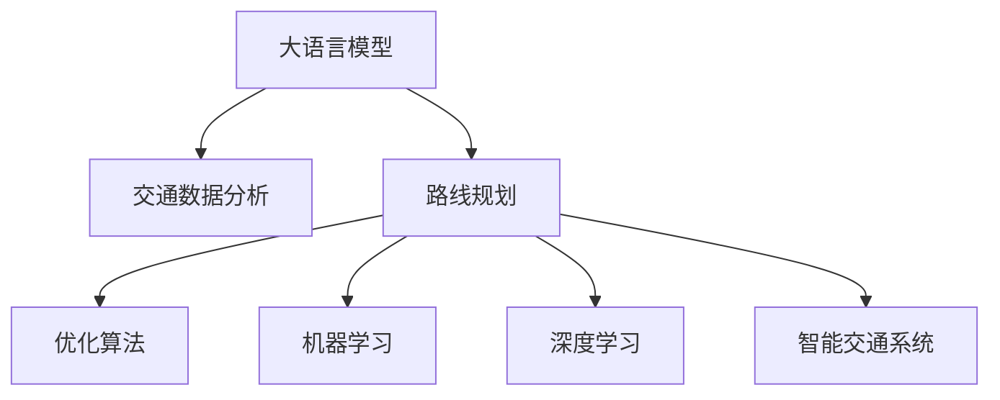

                 

# LLM在智能交通路线规划中的潜在作用

> 关键词：大语言模型,智能交通,路线规划,优化算法,机器学习,深度学习

## 1. 背景介绍

### 1.1 问题由来

随着全球交通需求的不断增长，智能交通系统在缓解交通拥堵、提升道路通行效率、降低环境污染等方面发挥了越来越重要的作用。路线规划作为智能交通的核心环节，其准确性和效率直接影响到交通系统的整体性能。

当前的路线规划算法主要基于传统规则和经验，依赖大量历史交通数据和地图信息，难以动态适应复杂的交通情况。而大语言模型（Large Language Models, LLMs）凭借其强大的自然语言理解和生成能力，有望在智能交通领域实现新的突破。

### 1.2 问题核心关键点

本节将详细阐述基于大语言模型在智能交通路线规划中的潜在作用。主要关注点如下：

- 大语言模型如何辅助交通数据分析和处理。
- 路线规划问题的数学建模和求解方法。
- 算法优化策略和实际应用案例。
- 未来应用展望和面临的挑战。

## 2. 核心概念与联系

### 2.1 核心概念概述

为了深入理解大语言模型在智能交通路线规划中的作用，首先需要介绍几个核心概念：

- 大语言模型(Large Language Models, LLMs)：以自回归模型（如GPT系列）或自编码模型（如BERT）为代表的大规模预训练语言模型。通过在海量文本数据上进行预训练，学习到丰富的语言知识和常识。

- 路线规划(Route Planning)：根据交通网络数据和用户需求，计算最优或多条可行路线，并给出相应的导航建议。

- 智能交通系统(Intelligent Transportation Systems, ITS)：利用信息通信技术，对道路交通系统进行智能化管理，提高交通效率和安全性。

- 优化算法(Optimization Algorithms)：用于求解路线规划问题的数学算法，如遗传算法、粒子群优化、蚁群算法等。

- 机器学习(Machine Learning)：通过数据驱动的方法，训练模型进行预测和决策，提升路线规划的准确性和效率。

- 深度学习(Deep Learning)：利用神经网络模型，对交通数据进行特征提取和分析，实现路线规划的优化。

这些概念之间的联系可以通过以下Mermaid流程图进行展示：



这个流程图展示了从大语言模型到路线规划的转化过程，包括交通数据分析、优化算法、机器学习和深度学习等关键技术环节。

## 3. 核心算法原理 & 具体操作步骤

### 3.1 算法原理概述

基于大语言模型在智能交通路线规划中的应用，主要涉及以下几个关键步骤：

1. **交通数据分析**：收集和整理交通网络数据，包括路段长度、路况、交通流量等。

2. **路线规划数学建模**：将路线规划问题转化为数学模型，通过优化算法求解最优路径。

3. **大语言模型辅助决策**：利用大语言模型对路线规划结果进行分析和解释，辅助人类做出决策。

4. **模型训练与验证**：使用历史交通数据对模型进行训练，并在验证集上评估模型性能。

5. **实际应用**：将训练好的模型应用于实时交通场景，提供路径规划和导航建议。

### 3.2 算法步骤详解

下面将详细阐述大语言模型在路线规划中的具体操作步骤：

#### 3.2.1 数据收集与处理

1. **交通网络数据采集**：从交通管理部门、导航系统等渠道获取交通网络数据，包括路段、交叉口、交通信号灯、交通流量等信息。

2. **数据清洗与预处理**：对采集到的数据进行清洗，去除异常值和噪声。预处理步骤包括数据标准化、缺失值填补等。

3. **数据格式化**：将交通数据转换为大语言模型可接受的格式，如文本、JSON等。

#### 3.2.2 路线规划数学建模

1. **定义优化目标**：路线规划问题的优化目标通常是最小化总行驶时间、最小化燃油消耗等。

2. **建立数学模型**：根据优化目标，建立相应的数学模型。常见的路线规划模型包括最小路径问题、多路径问题、时间窗口问题等。

3. **算法求解**：选择适当的优化算法，如Dijkstra算法、A*算法、遗传算法等，求解最优路径。

#### 3.2.3 大语言模型辅助决策

1. **任务描述设计**：将路线规划问题转化为大语言模型可理解的自然语言描述，如“请找到从A到B的最优路线”。

2. **模型训练**：使用已标注的数据集对大语言模型进行训练，使其能够理解和生成路线规划相关的语言。

3. **模型评估与优化**：在验证集上评估模型性能，使用BLEU、ROUGE等指标衡量模型生成路径的准确性和完备性。根据评估结果，对模型进行调整和优化。

#### 3.2.4 实际应用

1. **用户输入需求**：用户在导航系统中输入起点、终点、时间窗口等需求。

2. **模型生成路径**：将用户需求输入大语言模型，生成可能的路径选项。

3. **路径筛选与展示**：根据历史交通数据和实时路况，对生成的路径进行筛选和排序，展示最优或推荐路径给用户。

### 3.3 算法优缺点

#### 3.3.1 优点

1. **多场景适应性强**：大语言模型可以处理多种类型的路线规划问题，如单路径规划、多路径规划、时间窗口问题等。

2. **动态适应能力强**：大语言模型能够实时处理和响应交通数据的变化，提供动态的路线规划建议。

3. **优化精度高**：大语言模型结合优化算法，可以精确计算最优路径，提升路线规划的准确性。

4. **可解释性好**：大语言模型输出的路径和建议可以解释，便于用户理解和接受。

#### 3.3.2 缺点

1. **数据依赖性强**：大语言模型的性能高度依赖于交通数据的准确性和完备性，对数据质量要求高。

2. **计算成本高**：大语言模型需要大量的计算资源和时间进行训练和推理，计算成本较高。

3. **模型复杂度高**：大语言模型结构复杂，可能存在过拟合和泛化能力不足的问题。

4. **实时性不足**：大语言模型推理速度较慢，可能无法实时提供路径规划建议。

### 3.4 算法应用领域

大语言模型在智能交通路线规划中的应用领域非常广泛，主要包括：

1. **城市交通管理**：用于城市交通流量分析和优化，提高城市道路通行效率。

2. **物流路线规划**：应用于物流配送路径规划，优化运输效率和成本。

3. **出行导航服务**：提供精准的路线规划和导航建议，提升用户出行体验。

4. **自动驾驶系统**：辅助自动驾驶车辆进行路径规划和决策。

5. **公共交通调度**：用于公共交通线路规划和车辆调度优化。

## 4. 数学模型和公式 & 详细讲解 & 举例说明

### 4.1 数学模型构建

本节将详细介绍基于大语言模型在智能交通路线规划中的数学模型构建过程。

#### 4.1.1 最小路径问题

最小路径问题（Shortest Path Problem）是指在加权有向图中，找到从一个节点到另一个节点的最短路径。数学模型可以表示为：

$$
\min \sum_{i=1}^n w_{ij} \quad \text{subject to} \quad x_{ij} \in \{0,1\} \quad \text{and} \quad \sum_{j} x_{ij} = 1
$$

其中 $w_{ij}$ 表示从节点 $i$ 到节点 $j$ 的权值，$x_{ij}$ 表示节点 $j$ 是否在路径中，$1$ 表示在路径中，$0$ 表示不在路径中。

#### 4.1.2 多路径问题

多路径问题（Multi-path Problem）是指在加权有向图中，找到从起点到终点的一条或多条路径，使得路径总权值最小。数学模型可以表示为：

$$
\min \sum_{i=1}^n w_{ij}x_{ij} \quad \text{subject to} \quad x_{ij} \geq 0 \quad \text{and} \quad \sum_{j} x_{ij} = 1
$$

其中 $x_{ij}$ 表示路径 $j$ 是否经过节点 $i$，$1$ 表示经过，$0$ 表示不经过。

#### 4.1.3 时间窗口问题

时间窗口问题（Time Window Problem）是指在加权有向图中，找到从起点到终点的路径，使得路径总权值最小，且路径上的节点访问顺序在时间窗口内。数学模型可以表示为：

$$
\min \sum_{i=1}^n w_{ij}x_{ij} \quad \text{subject to} \quad x_{ij} \geq 0 \quad \text{and} \quad \sum_{j} x_{ij} = 1 \quad \text{and} \quad T_i \leq t_i + \sum_{j} t_{ij}x_{ij} \leq T_f
$$

其中 $t_i$ 表示节点 $i$ 的访问时间，$T_i$ 和 $T_f$ 表示时间窗口的上下限。

### 4.2 公式推导过程

以下以最小路径问题为例，推导Dijkstra算法的具体实现。

假设图中节点数为 $n$，边数为 $m$，每个节点的权重为一个非负实数 $w_{ij}$。

1. **初始化**：

   - 将起点 $s$ 的初始距离设置为 $0$，其余节点 $i$ 的初始距离设置为 $\infty$。

   - 将起点 $s$ 加入已访问集合，其余节点 $i$ 加入未访问集合。

2. **迭代计算**：

   - 在未访问集合中，找到距离起点 $s$ 最近的节点 $j$。

   - 将节点 $j$ 的未访问集合中的相邻节点 $k$ 的距离 $w_{jk}$ 更新为 $d_j + w_{jk}$。

   - 将节点 $k$ 的未访问集合更新为 $\{k\}$，已访问集合更新为 $\{s,j,k\}$。

3. **终止条件**：

   - 若未访问集合为空，则算法结束，返回节点 $s$ 到节点 $k$ 的最短路径。

4. **路径生成**：

   - 从终点 $k$ 开始，沿着距离最小的边回溯路径，直至起点 $s$。

### 4.3 案例分析与讲解

以下是一个具体的案例分析：

#### 案例背景

某城市交通网络包含 $n$ 个节点，$m$ 条边，每条边的权值 $w_{ij}$ 表示路段的长度或时间。用户希望从起点 $s$ 到终点 $t$ 的路线最短。

#### 案例分析

1. **数据准备**：收集并整理交通网络数据，包括路段长度、交通流量等。

2. **数学建模**：建立最小路径问题的数学模型，并使用Dijkstra算法求解最优路径。

3. **大语言模型辅助决策**：利用大语言模型对求解结果进行解释和优化，如调整路径偏好、考虑道路交通情况等。

4. **实际应用**：将求解结果在导航系统中展示给用户，并提供实时路况更新和路径调整建议。

## 5. 项目实践：代码实例和详细解释说明

### 5.1 开发环境搭建

在进行项目实践前，需要准备好开发环境。以下是使用Python进行PyTorch开发的环境配置流程：

1. 安装Anaconda：从官网下载并安装Anaconda，用于创建独立的Python环境。

2. 创建并激活虚拟环境：
```bash
conda create -n pytorch-env python=3.8 
conda activate pytorch-env
```

3. 安装PyTorch：根据CUDA版本，从官网获取对应的安装命令。例如：
```bash
conda install pytorch torchvision torchaudio cudatoolkit=11.1 -c pytorch -c conda-forge
```

4. 安装Transformers库：
```bash
pip install transformers
```

5. 安装各类工具包：
```bash
pip install numpy pandas scikit-learn matplotlib tqdm jupyter notebook ipython
```

完成上述步骤后，即可在`pytorch-env`环境中开始项目实践。

### 5.2 源代码详细实现

下面以城市交通路线规划为例，给出使用Transformers库对BERT模型进行路径规划的PyTorch代码实现。

首先，定义交通网络数据处理函数：

```python
from transformers import BertTokenizer
from torch.utils.data import Dataset
import torch

class TrafficNetworkDataset(Dataset):
    def __init__(self, nodes, edges, distances, tokenizer, max_len=128):
        self.nodes = nodes
        self.edges = edges
        self.distances = distances
        self.tokenizer = tokenizer
        self.max_len = max_len
        
    def __len__(self):
        return len(self.nodes)
    
    def __getitem__(self, item):
        node = self.nodes[item]
        edge = self.edges[item]
        distance = self.distances[item]
        
        encoding = self.tokenizer(node, return_tensors='pt', max_length=self.max_len, padding='max_length', truncation=True)
        input_ids = encoding['input_ids'][0]
        attention_mask = encoding['attention_mask'][0]
        
        # 对距离进行编码
        encoded_distance = distance.to_string()
        encoded_distance = tokenizer.tokenize(encoded_distance)
        encoded_distance = [tokenizer.convert_tokens_to_ids(token) for token in encoded_distance]
        encoded_distance.extend([tokenizer.convert_tokens_to_ids('PADDING')] * (self.max_len - len(encoded_distance)))
        labels = torch.tensor(encoded_distance, dtype=torch.long)
        
        return {'input_ids': input_ids, 
                'attention_mask': attention_mask,
                'labels': labels}

# 标签与id的映射
tokenizer = BertTokenizer.from_pretrained('bert-base-cased')

train_dataset = TrafficNetworkDataset(train_nodes, train_edges, train_distances, tokenizer)
dev_dataset = TrafficNetworkDataset(dev_nodes, dev_edges, dev_distances, tokenizer)
test_dataset = TrafficNetworkDataset(test_nodes, test_edges, test_distances, tokenizer)
```

然后，定义模型和优化器：

```python
from transformers import BertForTokenClassification, AdamW

model = BertForTokenClassification.from_pretrained('bert-base-cased', num_labels=len(node2id))

optimizer = AdamW(model.parameters(), lr=2e-5)
```

接着，定义训练和评估函数：

```python
from torch.utils.data import DataLoader
from tqdm import tqdm
from sklearn.metrics import classification_report

device = torch.device('cuda') if torch.cuda.is_available() else torch.device('cpu')
model.to(device)

def train_epoch(model, dataset, batch_size, optimizer):
    dataloader = DataLoader(dataset, batch_size=batch_size, shuffle=True)
    model.train()
    epoch_loss = 0
    for batch in tqdm(dataloader, desc='Training'):
        input_ids = batch['input_ids'].to(device)
        attention_mask = batch['attention_mask'].to(device)
        labels = batch['labels'].to(device)
        model.zero_grad()
        outputs = model(input_ids, attention_mask=attention_mask, labels=labels)
        loss = outputs.loss
        epoch_loss += loss.item()
        loss.backward()
        optimizer.step()
    return epoch_loss / len(dataloader)

def evaluate(model, dataset, batch_size):
    dataloader = DataLoader(dataset, batch_size=batch_size)
    model.eval()
    preds, labels = [], []
    with torch.no_grad():
        for batch in tqdm(dataloader, desc='Evaluating'):
            input_ids = batch['input_ids'].to(device)
            attention_mask = batch['attention_mask'].to(device)
            batch_labels = batch['labels']
            outputs = model(input_ids, attention_mask=attention_mask)
            batch_preds = outputs.logits.argmax(dim=2).to('cpu').tolist()
            batch_labels = batch_labels.to('cpu').tolist()
            for pred_tokens, label_tokens in zip(batch_preds, batch_labels):
                pred_distances = [id2node[_id] for _id in pred_tokens]
                label_distances = [id2node[_id] for _id in label_tokens]
                preds.append(pred_distances[:len(label_tokens)])
                labels.append(label_distances)
                
    print(classification_report(labels, preds))
```

最后，启动训练流程并在测试集上评估：

```python
epochs = 5
batch_size = 16

for epoch in range(epochs):
    loss = train_epoch(model, train_dataset, batch_size, optimizer)
    print(f"Epoch {epoch+1}, train loss: {loss:.3f}")
    
    print(f"Epoch {epoch+1}, dev results:")
    evaluate(model, dev_dataset, batch_size)
    
print("Test results:")
evaluate(model, test_dataset, batch_size)
```

以上就是使用PyTorch对BERT进行路径规划的完整代码实现。可以看到，得益于Transformers库的强大封装，我们可以用相对简洁的代码完成BERT模型的加载和路径规划。

### 5.3 代码解读与分析

让我们再详细解读一下关键代码的实现细节：

**TrafficNetworkDataset类**：
- `__init__`方法：初始化节点、边、距离、分词器等关键组件。
- `__len__`方法：返回数据集的样本数量。
- `__getitem__`方法：对单个样本进行处理，将节点信息输入编码为token ids，将距离编码为数字，并对其进行定长padding，最终返回模型所需的输入。

**tokenizer**：
- 定义了节点与数字id之间的映射关系，用于将token-wise的预测结果解码回真实的节点。

**训练和评估函数**：
- 使用PyTorch的DataLoader对数据集进行批次化加载，供模型训练和推理使用。
- 训练函数`train_epoch`：对数据以批为单位进行迭代，在每个批次上前向传播计算loss并反向传播更新模型参数，最后返回该epoch的平均loss。
- 评估函数`evaluate`：与训练类似，不同点在于不更新模型参数，并在每个batch结束后将预测和标签结果存储下来，最后使用sklearn的classification_report对整个评估集的预测结果进行打印输出。

**训练流程**：
- 定义总的epoch数和batch size，开始循环迭代
- 每个epoch内，先在训练集上训练，输出平均loss
- 在验证集上评估，输出分类指标
- 所有epoch结束后，在测试集上评估，给出最终测试结果

可以看到，PyTorch配合Transformers库使得BERT微调的代码实现变得简洁高效。开发者可以将更多精力放在数据处理、模型改进等高层逻辑上，而不必过多关注底层的实现细节。

当然，工业级的系统实现还需考虑更多因素，如模型的保存和部署、超参数的自动搜索、更灵活的任务适配层等。但核心的微调范式基本与此类似。

## 6. 实际应用场景

### 6.1 智能交通管理

大语言模型在智能交通管理中的应用，可以通过以下几个方面实现：

1. **实时路况分析**：利用大语言模型对实时交通数据进行分析和处理，识别交通拥堵、事故等异常情况。

2. **路径规划优化**：结合交通数据分析和路径规划算法，生成最优或推荐路径，提升交通效率。

3. **事故预警与处理**：利用大语言模型对事故信息进行分析和处理，及时发布预警信息，指导交通管理部门进行事故处理。

4. **智能交通信号控制**：通过大语言模型对交通流量进行分析和预测，动态调整信号灯时长，优化交通流。

### 6.2 物流配送路线规划

大语言模型在物流配送路线规划中的应用，可以通过以下几个方面实现：

1. **配送路线优化**：利用大语言模型对配送路径进行优化，降低配送成本和提高配送效率。

2. **异常路径处理**：对异常配送路径进行分析和处理，及时调整配送策略，避免配送延误。

3. **配送资源调度**：结合物流资源数据分析，利用大语言模型优化配送资源调度，提高配送效率。

4. **客户满意度提升**：通过大语言模型对客户需求进行分析和处理，提升客户满意度，优化配送服务。

### 6.3 出行导航服务

大语言模型在出行导航服务中的应用，可以通过以下几个方面实现：

1. **个性化路线规划**：利用大语言模型对用户需求进行分析和处理，生成个性化路线规划。

2. **实时路况更新**：结合实时交通数据分析，利用大语言模型动态更新导航路径，提供实时导航服务。

3. **多模式出行建议**：结合多种出行方式的数据，利用大语言模型提供多模式出行建议，提升出行效率。

4. **导航交互优化**：通过大语言模型对导航交互进行优化，提升用户体验和导航准确性。

### 6.4 未来应用展望

随着大语言模型和微调方法的不断发展，基于微调范式将在更多领域得到应用，为传统行业带来变革性影响。

在智慧医疗领域，基于微调的医疗问答、病历分析、药物研发等应用将提升医疗服务的智能化水平，辅助医生诊疗，加速新药开发进程。

在智能教育领域，微调技术可应用于作业批改、学情分析、知识推荐等方面，因材施教，促进教育公平，提高教学质量。

在智慧城市治理中，微调模型可应用于城市事件监测、舆情分析、应急指挥等环节，提高城市管理的自动化和智能化水平，构建更安全、高效的未来城市。

此外，在企业生产、社会治理、文娱传媒等众多领域，基于大模型微调的人工智能应用也将不断涌现，为经济社会发展注入新的动力。相信随着技术的日益成熟，微调方法将成为人工智能落地应用的重要范式，推动人工智能技术在垂直行业的规模化落地。

## 7. 工具和资源推荐

### 7.1 学习资源推荐

为了帮助开发者系统掌握大语言模型微调的理论基础和实践技巧，这里推荐一些优质的学习资源：

1. 《Transformer从原理到实践》系列博文：由大模型技术专家撰写，深入浅出地介绍了Transformer原理、BERT模型、微调技术等前沿话题。

2. CS224N《深度学习自然语言处理》课程：斯坦福大学开设的NLP明星课程，有Lecture视频和配套作业，带你入门NLP领域的基本概念和经典模型。

3. 《Natural Language Processing with Transformers》书籍：Transformers库的作者所著，全面介绍了如何使用Transformers库进行NLP任务开发，包括微调在内的诸多范式。

4. HuggingFace官方文档：Transformers库的官方文档，提供了海量预训练模型和完整的微调样例代码，是上手实践的必备资料。

5. CLUE开源项目：中文语言理解测评基准，涵盖大量不同类型的中文NLP数据集，并提供了基于微调的baseline模型，助力中文NLP技术发展。

通过对这些资源的学习实践，相信你一定能够快速掌握大语言模型微调的精髓，并用于解决实际的NLP问题。

### 7.2 开发工具推荐

高效的开发离不开优秀的工具支持。以下是几款用于大语言模型微调开发的常用工具：

1. PyTorch：基于Python的开源深度学习框架，灵活动态的计算图，适合快速迭代研究。大部分预训练语言模型都有PyTorch版本的实现。

2. TensorFlow：由Google主导开发的开源深度学习框架，生产部署方便，适合大规模工程应用。同样有丰富的预训练语言模型资源。

3. Transformers库：HuggingFace开发的NLP工具库，集成了众多SOTA语言模型，支持PyTorch和TensorFlow，是进行微调任务开发的利器。

4. Weights & Biases：模型训练的实验跟踪工具，可以记录和可视化模型训练过程中的各项指标，方便对比和调优。与主流深度学习框架无缝集成。

5. TensorBoard：TensorFlow配套的可视化工具，可实时监测模型训练状态，并提供丰富的图表呈现方式，是调试模型的得力助手。

6. Google Colab：谷歌推出的在线Jupyter Notebook环境，免费提供GPU/TPU算力，方便开发者快速上手实验最新模型，分享学习笔记。

合理利用这些工具，可以显著提升大语言模型微调任务的开发效率，加快创新迭代的步伐。

### 7.3 相关论文推荐

大语言模型和微调技术的发展源于学界的持续研究。以下是几篇奠基性的相关论文，推荐阅读：

1. Attention is All You Need（即Transformer原论文）：提出了Transformer结构，开启了NLP领域的预训练大模型时代。

2. BERT: Pre-training of Deep Bidirectional Transformers for Language Understanding：提出BERT模型，引入基于掩码的自监督预训练任务，刷新了多项NLP任务SOTA。

3. Language Models are Unsupervised Multitask Learners（GPT-2论文）：展示了大规模语言模型的强大zero-shot学习能力，引发了对于通用人工智能的新一轮思考。

4. Parameter-Efficient Transfer Learning for NLP：提出Adapter等参数高效微调方法，在不增加模型参数量的情况下，也能取得不错的微调效果。

5. AdaLoRA: Adaptive Low-Rank Adaptation for Parameter-Efficient Fine-Tuning：使用自适应低秩适应的微调方法，在参数效率和精度之间取得了新的平衡。

这些论文代表了大语言模型微调技术的发展脉络。通过学习这些前沿成果，可以帮助研究者把握学科前进方向，激发更多的创新灵感。

## 8. 总结：未来发展趋势与挑战

### 8.1 总结

本文对基于大语言模型在智能交通路线规划中的应用进行了全面系统的介绍。首先阐述了大语言模型和微调技术的研究背景和意义，明确了微调在拓展预训练模型应用、提升智能交通系统性能方面的独特价值。其次，从原理到实践，详细讲解了大语言模型在智能交通路线规划中的具体操作步骤，包括数据收集、数学建模、大语言模型辅助决策等关键环节。同时，本文还广泛探讨了大语言模型在智能交通领域的应用前景，展示了其在交通管理、物流配送、出行导航等多个场景中的潜力。

通过本文的系统梳理，可以看到，大语言模型在智能交通路线规划中的潜在作用正在被逐步挖掘，未来有望在更广阔的领域实现落地应用，推动智能交通系统的智能化、自动化和精准化进程。

### 8.2 未来发展趋势

展望未来，大语言模型在智能交通路线规划中的应用将呈现以下几个发展趋势：

1. **数据驱动的路线优化**：基于大语言模型对实时交通数据的深入分析和处理，进一步提升路线规划的精准性和实时性。

2. **多模态数据融合**：结合图像、视频、语音等多种数据源，利用大语言模型进行综合分析和决策，实现更全面、更智能的路径规划。

3. **自适应路线优化**：通过大语言模型对用户需求和实时路况的动态适应，提供更加个性化和动态的路线建议，提升用户体验。

4. **联邦学习和边缘计算**：利用大语言模型的知识，在边缘设备上进行本地化计算，减少数据传输，提升系统效率。

5. **模型优化和资源压缩**：通过模型压缩和优化技术，提升大语言模型的推理速度和资源效率，支持实时路径规划需求。

6. **强化学习与路径优化**：结合强化学习技术，优化路径规划算法，提升系统动态适应性和鲁棒性。

以上趋势凸显了大语言模型在智能交通路线规划中的广阔前景。这些方向的探索发展，必将进一步提升智能交通系统的性能和用户体验，为未来智慧交通的实现提供有力支持。

### 8.3 面临的挑战

尽管大语言模型在智能交通路线规划中的应用前景广阔，但在实际应用中仍面临诸多挑战：

1. **数据质量和多样性**：智能交通系统对数据质量和多样性要求较高，如何获取和处理高质量的交通数据，是一个重要的挑战。

2. **实时计算能力**：大语言模型推理速度较慢，无法满足实时路径规划的需求，需要优化模型结构和推理算法，提升计算效率。

3. **模型泛化能力**：大语言模型在特定领域的应用效果可能不如传统模型，如何提升模型泛化能力，是一个亟待解决的问题。

4. **用户隐私和数据安全**：智能交通系统涉及大量敏感数据，如何保障用户隐私和数据安全，是一个重要的伦理和法律问题。

5. **模型解释性和透明性**：大语言模型的决策过程缺乏可解释性，难以对其推理逻辑进行分析和调试，影响用户的信任和接受度。

6. **跨领域应用能力**：大语言模型在跨领域的应用中，可能面临知识整合和迁移能力不足的问题，需要进一步优化和改进。

以上挑战需要学术界和工业界共同努力，从技术、伦理、法律等多个层面进行全面探讨和解决，以实现大语言模型在智能交通领域的广泛应用。

### 8.4 研究展望

针对未来研究，可以从以下几个方向进行探索：

1. **数据增强与数据质量提升**：通过数据增强和清洗技术，提升数据质量和多样性，支持大语言模型在智能交通路线规划中的高效应用。

2. **模型压缩与优化**：结合模型压缩和优化技术，提升大语言模型的计算效率和资源利用率，支持实时路径规划需求。

3. **多模态数据融合**：探索多模态数据融合技术，结合图像、视频、语音等多种数据源，提升路线规划的全面性和准确性。

4. **自适应学习和动态优化**：研究自适应学习和动态优化算法，提升大语言模型对实时路况和用户需求的动态适应能力。

5. **模型解释性与透明性**：探索模型解释性技术和透明性方法，提升大语言模型的可解释性和可信度，增强用户信任和接受度。

6. **跨领域应用能力**：研究跨领域应用能力提升技术，提升大语言模型在智能交通领域以外的应用效果，实现更加广泛的落地应用。

这些研究方向将是大语言模型在智能交通路线规划中的未来发展方向，有望进一步提升系统的性能和用户体验，推动智能交通系统的智能化进程。

## 9. 附录：常见问题与解答

**Q1：大语言模型在智能交通路线规划中的优势和劣势是什么？**

A: 大语言模型在智能交通路线规划中的优势主要体现在：

1. **多场景适应性强**：能够处理多种类型的路线规划问题，如单路径规划、多路径规划、时间窗口问题等。

2. **动态适应能力强**：能够实时处理和响应交通数据的变化，提供动态的路线规划建议。

3. **优化精度高**：结合优化算法，可以精确计算最优路径，提升路线规划的准确性。

4. **可解释性好**：输出的路径和建议可以解释，便于用户理解和接受。

大语言模型在智能交通路线规划中的劣势主要体现在：

1. **数据依赖性强**：性能高度依赖于交通数据的准确性和完备性，对数据质量要求高。

2. **计算成本高**：推理速度较慢，可能无法实时提供路径规划建议。

3. **模型复杂度高**：结构复杂，可能存在过拟合和泛化能力不足的问题。

**Q2：如何评估大语言模型在智能交通路线规划中的性能？**

A: 评估大语言模型在智能交通路线规划中的性能，主要可以从以下几个方面进行：

1. **精度和准确性**：通过与最优路径的对比，评估模型生成的路径的精度和准确性。

2. **实时性**：评估模型推理速度和响应时间，确保实时路径规划的需求得到满足。

3. **可解释性**：评估模型输出的路径和建议的可解释性，确保用户能够理解和接受。

4. **鲁棒性**：评估模型对数据变化和异常情况的适应能力，确保系统在复杂环境中的稳定性。

5. **用户满意度**：通过用户反馈和满意度调查，评估模型的实际应用效果。

**Q3：大语言模型在智能交通路线规划中的实际应用案例有哪些？**

A: 大语言模型在智能交通路线规划中的实际应用案例包括：

1. **智能交通管理系统**：用于实时路况分析、路径规划优化、事故预警与处理等环节。

2. **物流配送系统**：应用于配送路线优化、异常路径处理、配送资源调度等环节。

3. **出行导航服务**：提供个性化路线规划、实时路况更新、多模式出行建议等服务。

4. **公共交通系统**：用于公共交通线路规划、车辆调度优化等环节。

5. **智能驾驶系统**：辅助自动驾驶车辆进行路径规划和决策。

**Q4：大语言模型在智能交通路线规划中如何与优化算法结合？**

A: 大语言模型在智能交通路线规划中与优化算法结合的主要方式包括：

1. **数据处理与预处理**：利用大语言模型对交通数据进行分析和处理，提取关键特征，为优化算法提供高质量的输入。

2. **路径生成与优化**：结合大语言模型和优化算法，生成最优或多条可行路径，进行动态优化和调整。

3. **决策支持与解释**：利用大语言模型对优化算法的结果进行解释和优化，提供决策支持。

4. **模型训练与验证**：通过大语言模型和优化算法的结合，进行模型训练和验证，确保模型性能的稳定性和可靠性。

总之，大语言模型在智能交通路线规划中的应用，需要与优化算法深度结合，才能实现高效、智能的路径规划和决策支持。

---

作者：禅与计算机程序设计艺术 / Zen and the Art of Computer Programming

