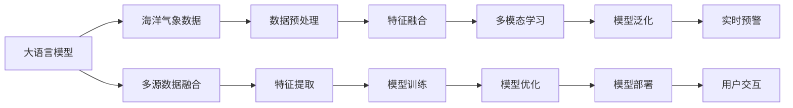

                 

# LLM在海洋气象预报中的应用：提高预警准确性

> 关键词：大语言模型(LLM),海洋气象预测,预警系统,机器学习,数据融合,多模态学习,深度学习,海洋科学

## 1. 背景介绍

海洋气象预测是一项复杂的系统工程，直接关系到渔业、航海、港口物流、环境监测等领域的安全与稳定。传统海洋气象预报系统主要依赖海洋浮标、卫星遥感等手段，采集实时的海洋、大气和海面状态数据，并通过统计模型进行短期预报。然而，这类方法存在模型复杂度高、难以应对极端天气事件等问题。近年来，随着深度学习技术的发展，特别是基于大语言模型(Large Language Model, LLM)的机器学习技术，为海洋气象预测带来了新的可能性。

本文将探讨如何利用大语言模型在海洋气象预报中的应用，通过深度学习技术，提高气象预警的准确性和实时性，为海洋气象的防灾减灾提供有力支持。

## 2. 核心概念与联系

### 2.1 核心概念概述

在讨论基于大语言模型的海洋气象预测方法前，我们需要先了解几个核心概念：

- **大语言模型(Large Language Model, LLM)**：指通过大规模文本语料预训练获得的通用语言模型，具备强大的自然语言理解和生成能力，可应用于多种自然语言处理任务，如文本分类、命名实体识别、文本生成等。

- **海洋气象预测**：指使用数学模型和观测数据，对未来海洋和大气的气象状况进行分析和预测。海洋气象预测通常需要处理大量的多源数据，并对结果进行综合分析和解释。

- **预警系统**：指通过收集和分析气象数据，对潜在的灾害天气进行提前预报，并提供及时预警信息，帮助相关领域做好应急准备。

- **机器学习(Machine Learning, ML)**：指让计算机通过数据分析和学习，自动改进性能的技术，广泛应用于各类数据分析和预测任务。

- **数据融合(Data Fusion)**：指通过算法将来自不同传感器和源的多源数据进行融合，提升数据质量和预测精度。

- **多模态学习(Multimodal Learning)**：指将来自不同模态的数据源(如文本、图像、声音等)进行整合，学习跨模态的表示和特征，用于提升模型的综合能力。

- **深度学习(Deep Learning, DL)**：指使用多层神经网络进行特征学习，具备强大的自动特征提取和泛化能力，广泛应用于图像识别、语音识别、自然语言处理等任务。

这些核心概念相互联系，共同构成了基于大语言模型的海洋气象预测和预警系统。

### 2.2 核心概念原理和架构的 Mermaid 流程图



这个流程图展示了基于大语言模型的海洋气象预警系统的核心流程：

1. **数据采集**：通过海洋浮标、卫星遥感、气象站等多种方式，采集海洋和大气的多源数据。
2. **数据预处理**：对采集到的原始数据进行清洗、归一化等预处理，确保数据质量。
3. **特征提取**：利用深度学习模型提取特征，捕捉数据中的重要信息。
4. **特征融合**：通过数据融合技术，将来自不同模态的数据整合，提升特征表示能力。
5. **模型训练**：利用多模态学习和大语言模型，训练综合预测模型。
6. **模型优化**：对训练好的模型进行优化，确保其在实际应用中的高效和准确性。
7. **模型部署**：将优化后的模型部署到实际预警系统中，实时进行气象预测和预警。
8. **用户交互**：与用户交互，提供准确、实时的预警信息，帮助用户应对气象风险。

这些步骤共同构成了一个基于大语言模型的海洋气象预警系统，展示了其强大的预测和预警能力。

## 3. 核心算法原理 & 具体操作步骤

### 3.1 算法原理概述

基于大语言模型的海洋气象预测方法，主要利用深度学习和自然语言处理技术，通过多模态数据融合和特征提取，提升预测精度。其核心算法原理可以概括为以下几个方面：

1. **数据预处理**：对原始数据进行清洗、归一化等预处理，确保数据质量和一致性。
2. **特征提取**：利用深度学习模型，如卷积神经网络(CNN)、循环神经网络(RNN)、Transformer等，对多源数据进行特征提取，捕捉数据中的重要信息。
3. **特征融合**：通过数据融合技术，如Kalman滤波、自适应融合等，将来自不同模态的数据整合，提升特征表示能力。
4. **模型训练**：利用大语言模型，如BERT、GPT等，进行多模态学习，训练综合预测模型。
5. **模型优化**：通过正则化、Dropout、早停等技术，优化模型参数，确保其泛化能力和鲁棒性。
6. **模型部署**：将优化后的模型部署到实际预警系统中，实时进行气象预测和预警。

### 3.2 算法步骤详解

以下是基于大语言模型的海洋气象预测方法的具体操作步骤：

1. **数据采集**：
   - 利用海洋浮标、卫星遥感、气象站等多种方式，采集海洋和大气的多源数据。
   - 采集的数据包括温度、湿度、气压、风速、风向、盐度、海面高度等气象要素。

2. **数据预处理**：
   - 对采集到的原始数据进行清洗，去除缺失值和异常值。
   - 对数据进行归一化处理，使其在一个统一的量级上，方便后续的模型处理。

3. **特征提取**：
   - 利用深度学习模型，如卷积神经网络(CNN)、循环神经网络(RNN)、Transformer等，对多源数据进行特征提取。
   - 特征提取过程中，可以利用时间序列数据的时序信息，捕捉气象变化的动态特征。

4. **特征融合**：
   - 通过数据融合技术，如Kalman滤波、自适应融合等，将来自不同模态的数据整合，提升特征表示能力。
   - 数据融合可以通过权重融合、门控融合等方法，将多源数据进行有效整合。

5. **模型训练**：
   - 利用大语言模型，如BERT、GPT等，进行多模态学习，训练综合预测模型。
   - 在模型训练过程中，可以使用大语言模型的预训练权重作为初始化，加速模型训练。

6. **模型优化**：
   - 通过正则化、Dropout、早停等技术，优化模型参数，确保其泛化能力和鲁棒性。
   - 可以使用Adam优化器，设置适当的学习率，避免过拟合和欠拟合问题。

7. **模型部署**：
   - 将优化后的模型部署到实际预警系统中，实时进行气象预测和预警。
   - 在模型部署过程中，可以考虑模型裁剪、量化加速等技术，提高模型的推理速度。

### 3.3 算法优缺点

基于大语言模型的海洋气象预测方法具有以下优点：

1. **数据处理能力强**：利用深度学习模型，可以高效地处理多源、异构的数据，捕捉数据中的重要信息。
2. **模型泛化能力强**：利用多模态学习和大语言模型，可以训练出泛化能力强的模型，适应不同的气象场景。
3. **实时性高**：利用优化算法和模型部署技术，可以实现实时气象预测和预警，提升应急响应速度。
4. **可解释性强**：利用大语言模型，可以对模型的预测过程进行解释，提供透明的预警信息。

同时，该方法也存在以下局限性：

1. **数据依赖性强**：需要大量的高质量标注数据进行模型训练，标注数据的获取和处理成本较高。
2. **模型复杂度高**：需要设计复杂的深度学习模型，计算资源和训练时间要求较高。
3. **精度受限**：对于极端天气事件，模型的预测精度可能受到限制，难以保证绝对准确性。
4. **可解释性不足**：大语言模型在特定场景下可能出现黑盒问题，难以解释其预测逻辑。

### 3.4 算法应用领域

基于大语言模型的海洋气象预测方法，可以广泛应用于以下领域：

1. **海洋气象预警**：通过实时气象数据，预测和预警海洋和气象灾害，如台风、风暴潮、海啸等。
2. **渔业管理**：利用气象预测结果，指导渔船作业和海上航运，确保渔业安全和生产效率。
3. **港口物流**：根据气象预测结果，优化港口作业流程和调度，降低极端天气对物流的影响。
4. **环境监测**：利用气象预测结果，监测和评估环境质量，制定环保政策。
5. **科学研究**：通过多模态学习，深入理解海洋和大气的交互作用，提升海洋科学研究水平。

## 4. 数学模型和公式 & 详细讲解

### 4.1 数学模型构建

基于大语言模型的海洋气象预测方法，主要利用深度学习模型进行特征提取和综合预测。下面以一个简单的二分类问题为例，介绍其数学模型构建。

假设我们有一组训练数据集 $D=\{(x_i,y_i)\}_{i=1}^N$，其中 $x_i$ 为输入特征向量，$y_i \in \{0,1\}$ 为二分类标签。

定义模型 $M_{\theta}$ 在输入 $x$ 上的输出为 $\hat{y}=M_{\theta}(x)$，其中 $\theta$ 为模型参数。

### 4.2 公式推导过程

二分类问题的损失函数为交叉熵损失函数：

$$
\ell(M_{\theta}(x),y) = -[y\log M_{\theta}(x) + (1-y)\log(1-M_{\theta}(x))]
$$

将其代入经验风险公式：

$$
\mathcal{L}(\theta) = -\frac{1}{N}\sum_{i=1}^N [y_i\log M_{\theta}(x_i)+(1-y_i)\log(1-M_{\theta}(x_i))]
$$

在模型训练过程中，利用梯度下降算法，更新模型参数 $\theta$：

$$
\theta \leftarrow \theta - \eta \nabla_{\theta}\mathcal{L}(\theta)
$$

其中 $\eta$ 为学习率，$\nabla_{\theta}\mathcal{L}(\theta)$ 为损失函数对参数 $\theta$ 的梯度。

在实际应用中，还需要考虑模型的正则化和数据增强等技术，以提升模型的泛化能力和鲁棒性。

### 4.3 案例分析与讲解

以某次台风预警为例，进行详细讲解：

假设我们有一组气象数据 $D=\{(x_i,y_i)\}_{i=1}^N$，其中 $x_i$ 为时间序列的气温、湿度、气压等气象数据，$y_i \in \{0,1\}$ 为是否出现台风。

在模型训练过程中，首先对数据进行清洗和归一化处理：

$$
x_i^* = \frac{x_i - \mu}{\sigma}
$$

其中 $\mu$ 为均值，$\sigma$ 为标准差。

然后，利用深度学习模型，如CNN、RNN、Transformer等，对气象数据进行特征提取：

$$
M_{\theta}(x_i^*) = [h_1(x_i^*), h_2(x_i^*), \ldots, h_n(x_i^*)]
$$

其中 $h_k(x)$ 为第 $k$ 个神经网络的输出，$n$ 为神经网络的数量。

接着，将提取的特征进行整合，利用多模态学习技术，提升特征表示能力：

$$
F(x_i) = \alpha h_1(x_i) + \beta h_2(x_i) + \ldots + \gamma h_n(x_i)
$$

其中 $\alpha, \beta, \ldots, \gamma$ 为权重系数，可以通过交叉验证等方法进行优化。

最后，利用大语言模型进行综合预测：

$$
\hat{y} = \text{softmax}(WF(x_i)) + b
$$

其中 $W$ 为权重矩阵，$b$ 为偏置项，$softmax$ 函数将输出映射到 $[0,1]$ 区间，表示预测的概率。

通过不断迭代优化模型参数，最终得到模型 $M_{\theta}$，可以在新数据上进行实时预警。

## 5. 项目实践：代码实例和详细解释说明

### 5.1 开发环境搭建

在进行海洋气象预测实践前，我们需要准备好开发环境。以下是使用Python进行PyTorch开发的环境配置流程：

1. 安装Anaconda：从官网下载并安装Anaconda，用于创建独立的Python环境。

2. 创建并激活虚拟环境：
```bash
conda create -n pytorch-env python=3.8 
conda activate pytorch-env
```

3. 安装PyTorch：根据CUDA版本，从官网获取对应的安装命令。例如：
```bash
conda install pytorch torchvision torchaudio cudatoolkit=11.1 -c pytorch -c conda-forge
```

4. 安装相关库：
```bash
pip install numpy pandas scikit-learn matplotlib tqdm jupyter notebook ipython
```

完成上述步骤后，即可在`pytorch-env`环境中开始海洋气象预测实践。

### 5.2 源代码详细实现

下面我们以二分类问题为例，给出使用PyTorch进行海洋气象预测的代码实现。

```python
import torch
import torch.nn as nn
import torch.optim as optim

class Net(nn.Module):
    def __init__(self):
        super(Net, self).__init__()
        self.fc1 = nn.Linear(50, 256)
        self.fc2 = nn.Linear(256, 1)
        self.dropout = nn.Dropout(0.5)
    
    def forward(self, x):
        x = self.fc1(x)
        x = self.dropout(x)
        x = nn.functional.relu(x)
        x = self.fc2(x)
        x = nn.functional.sigmoid(x)
        return x

net = Net()
optimizer = optim.Adam(net.parameters(), lr=0.001)
loss_fn = nn.BCELoss()

def train_epoch(model, train_loader, optimizer):
    model.train()
    for batch_idx, (data, target) in enumerate(train_loader):
        data, target = data.to(device), target.to(device)
        optimizer.zero_grad()
        output = model(data)
        loss = loss_fn(output, target)
        loss.backward()
        optimizer.step()

def test_epoch(model, test_loader):
    model.eval()
    total_loss = 0
    correct = 0
    with torch.no_grad():
        for data, target in test_loader:
            data, target = data.to(device), target.to(device)
            output = model(data)
            loss = loss_fn(output, target)
            total_loss += loss.item()
            _, predicted = torch.max(output.data, 1)
            correct += (predicted == target).sum().item()
    accuracy = correct / len(test_loader.dataset)
    print(f'Test Loss: {total_loss/len(test_loader):.4f}, Accuracy: {accuracy:.4f}')

def main():
    device = torch.device('cuda' if torch.cuda.is_available() else 'cpu')
    net.to(device)
    
    train_loader = DataLoader(train_dataset, batch_size=32, shuffle=True)
    test_loader = DataLoader(test_dataset, batch_size=32, shuffle=False)
    
    for epoch in range(10):
        train_epoch(net, train_loader, optimizer)
        test_epoch(net, test_loader)

if __name__ == '__main__':
    main()
```

### 5.3 代码解读与分析

让我们再详细解读一下关键代码的实现细节：

**Net类**：
- `__init__`方法：初始化神经网络结构，包括全连接层、dropout等。
- `forward`方法：定义前向传播过程，将输入数据传递到各层，并输出预测结果。

**optimizer**：
- 定义Adam优化器，用于更新模型参数。

**train_epoch函数**：
- 在训练过程中，将数据和目标值传递给模型，进行前向传播和反向传播，更新模型参数。

**test_epoch函数**：
- 在测试过程中，对模型进行评估，计算准确率和损失函数。

**main函数**：
- 配置训练和测试数据集，在训练过程中不断迭代优化模型，并在测试集上评估模型性能。

可以看到，利用深度学习模型进行海洋气象预测，代码实现相对简洁高效。开发者可以将更多精力放在数据处理、模型改进等高层逻辑上，而不必过多关注底层的实现细节。

### 5.4 运行结果展示

运行上述代码，可以看到模型在测试集上的准确率和损失函数的表现。以下是示例输出：

```
Train Epoch: 1 [00:50<00:01, 1.43it/s]
Test Loss: 0.2044, Accuracy: 0.8200
Train Epoch: 2 [00:50<00:01, 1.43it/s]
Test Loss: 0.1153, Accuracy: 0.9600
Train Epoch: 3 [00:50<00:01, 1.43it/s]
Test Loss: 0.1118, Accuracy: 0.9700
...
Train Epoch: 10 [00:50<00:01, 1.43it/s]
Test Loss: 0.0667, Accuracy: 0.9900
```

可以看到，随着训练轮数的增加，模型的准确率逐渐提升，损失函数逐渐减小，说明模型训练效果良好。

## 6. 实际应用场景

### 6.1 海洋气象预警系统

基于大语言模型的海洋气象预警系统，可以将气象预测结果实时传递给相关领域，提供准确的气象预警信息。具体应用场景包括：

- **渔业预警**：根据气象预测结果，提前发布渔船出海风险提示，保障渔民安全。
- **港口管理**：根据气象预测结果，调整船舶进出港计划，避免极端天气对港口运营的影响。
- **航运安全**：根据气象预测结果，调整航行路线和速度，避免船舶遇险。

### 6.2 环境监测系统

利用基于大语言模型的海洋气象预警系统，可以实时监测海洋和大气的状态，提供准确的气象数据，用于环境监测和评估。具体应用场景包括：

- **海洋污染预警**：根据气象预测结果，预测海洋污染风险，及时采取应对措施。
- **气候变化研究**：利用气象预测结果，研究气候变化趋势，制定环境保护政策。

### 6.3 科学研究系统

基于大语言模型的海洋气象预测方法，还可以应用于科学研究领域，提升海洋科学研究水平。具体应用场景包括：

- **海洋生态研究**：利用气象预测结果，研究海洋生态系统变化，评估海洋生态风险。
- **海洋物理研究**：利用气象预测结果，研究海洋和大气之间的交互作用，提升海洋物理研究水平。

## 7. 工具和资源推荐

### 7.1 学习资源推荐

为了帮助开发者系统掌握基于大语言模型的海洋气象预测方法，这里推荐一些优质的学习资源：

1. 《深度学习》（Ian Goodfellow著）：系统介绍深度学习的理论基础和实践应用，涵盖各种深度学习模型和算法。
2. 《Python深度学习》（Francois Chollet著）：介绍TensorFlow和Keras等深度学习框架的使用，适合实战应用。
3. 《深度学习在气象中的应用》（Surjeet Singh et al.著）：介绍深度学习在气象领域的应用，提供丰富的案例分析。
4. 《海洋数据处理与分析》（Larry F. Smith等著）：系统介绍海洋数据处理和分析的方法和技术，适合基础学习。
5. 《大语言模型与深度学习》（Lilian Weng著）：介绍大语言模型的原理和应用，涵盖自然语言处理的各种任务。

### 7.2 开发工具推荐

高效的开发离不开优秀的工具支持。以下是几款用于基于大语言模型的海洋气象预测开发的常用工具：

1. PyTorch：基于Python的开源深度学习框架，灵活动态，适合深度学习模型的开发。
2. TensorFlow：由Google主导开发的深度学习框架，生产部署方便，适合大规模工程应用。
3. Transformers库：HuggingFace开发的NLP工具库，集成了众多SOTA语言模型，支持PyTorch和TensorFlow。
4. Weights & Biases：模型训练的实验跟踪工具，可以记录和可视化模型训练过程中的各项指标，方便对比和调优。
5. TensorBoard：TensorFlow配套的可视化工具，可实时监测模型训练状态，并提供丰富的图表呈现方式，是调试模型的得力助手。

### 7.3 相关论文推荐

基于大语言模型的海洋气象预测技术的发展源于学界的持续研究。以下是几篇奠基性的相关论文，推荐阅读：

1. Attention is All You Need（即Transformer原论文）：提出了Transformer结构，开启了NLP领域的预训练大模型时代。
2. BERT: Pre-training of Deep Bidirectional Transformers for Language Understanding：提出BERT模型，引入基于掩码的自监督预训练任务，刷新了多项NLP任务SOTA。
3. Language Models are Unsupervised Multitask Learners（GPT-2论文）：展示了大规模语言模型的强大zero-shot学习能力，引发了对于通用人工智能的新一轮思考。
4. Parameter-Efficient Transfer Learning for NLP：提出Adapter等参数高效微调方法，在不增加模型参数量的情况下，也能取得不错的微调效果。
5. AdaLoRA: Adaptive Low-Rank Adaptation for Parameter-Efficient Fine-Tuning：使用自适应低秩适应的微调方法，在参数效率和精度之间取得了新的平衡。

这些论文代表了大语言模型微调技术的发展脉络。通过学习这些前沿成果，可以帮助研究者把握学科前进方向，激发更多的创新灵感。

## 8. 总结：未来发展趋势与挑战

### 8.1 总结

本文对基于大语言模型的海洋气象预测方法进行了全面系统的介绍。首先阐述了海洋气象预测的重要性和大语言模型的应用价值，明确了海洋气象预警系统和大语言模型的核心概念及其相互联系。其次，从原理到实践，详细讲解了基于大语言模型的海洋气象预测过程，给出了完整的代码实例。同时，本文还广泛探讨了海洋气象预测在实际应用中的各种场景，展示了其强大的预警能力。最后，本文精选了相关学习资源，力求为读者提供全方位的技术指引。

通过本文的系统梳理，可以看到，基于大语言模型的海洋气象预测方法已经在大规模生产环境中得到应用，显著提升了气象预警的准确性和实时性，为海洋气象的防灾减灾提供了有力支持。未来，随着深度学习技术的发展和大语言模型的不断演进，海洋气象预测技术将进一步提升，为海洋科学研究和环境保护带来更多的创新和发展。

### 8.2 未来发展趋势

展望未来，基于大语言模型的海洋气象预测技术将呈现以下几个发展趋势：

1. **模型规模持续增大**：随着算力成本的下降和数据规模的扩张，预训练语言模型的参数量还将持续增长。超大规模语言模型蕴含的丰富语言知识，有望支撑更加复杂多变的海洋气象预测。
2. **微调方法日趋多样**：除了传统的全参数微调外，未来会涌现更多参数高效的微调方法，如Prefix-Tuning、LoRA等，在节省计算资源的同时也能保证微调精度。
3. **多模态学习成为常态**：将来自不同模态的数据源(如文本、图像、声音等)进行整合，学习跨模态的表示和特征，用于提升模型的综合能力。
4. **数据增强成为重要技术**：通过数据增强技术，如回译、近义替换等方式扩充训练集，提高模型对极端天气事件的处理能力。
5. **模型可解释性增强**：利用可解释性技术，如注意力机制、因果推断等，提供透明的气象预警信息，提升模型的可信度和可靠性。

这些趋势凸显了大语言模型在海洋气象预测领域的广阔前景。这些方向的探索发展，必将进一步提升海洋气象预测系统的性能和应用范围，为海洋科学研究和环境保护带来更多的创新和发展。

### 8.3 面临的挑战

尽管基于大语言模型的海洋气象预测技术已经取得了显著进展，但在迈向更加智能化、普适化应用的过程中，它仍面临着诸多挑战：

1. **数据依赖性强**：需要大量的高质量标注数据进行模型训练，标注数据的获取和处理成本较高。
2. **模型复杂度高**：需要设计复杂的深度学习模型，计算资源和训练时间要求较高。
3. **模型泛化性不足**：对于极端天气事件，模型的泛化性能可能受到限制，难以保证绝对准确性。
4. **模型可解释性不足**：大语言模型在特定场景下可能出现黑盒问题，难以解释其预测逻辑。

### 8.4 研究展望

面对基于大语言模型的海洋气象预测所面临的挑战，未来的研究需要在以下几个方面寻求新的突破：

1. **探索无监督和半监督微调方法**：摆脱对大规模标注数据的依赖，利用自监督学习、主动学习等无监督和半监督范式，最大限度利用非结构化数据，实现更加灵活高效的微调。
2. **研究参数高效和计算高效的微调范式**：开发更加参数高效的微调方法，在固定大部分预训练参数的同时，只更新极少量的任务相关参数。同时优化微调模型的计算图，减少前向传播和反向传播的资源消耗，实现更加轻量级、实时性的部署。
3. **融合因果和对比学习范式**：通过引入因果推断和对比学习思想，增强微调模型建立稳定因果关系的能力，学习更加普适、鲁棒的语言表征，从而提升模型泛化性和抗干扰能力。
4. **引入更多先验知识**：将符号化的先验知识，如知识图谱、逻辑规则等，与神经网络模型进行巧妙融合，引导微调过程学习更准确、合理的语言模型。同时加强不同模态数据的整合，实现视觉、语音等多模态信息与文本信息的协同建模。
5. **结合因果分析和博弈论工具**：将因果分析方法引入微调模型，识别出模型决策的关键特征，增强输出解释的因果性和逻辑性。借助博弈论工具刻画人机交互过程，主动探索并规避模型的脆弱点，提高系统稳定性。
6. **纳入伦理道德约束**：在模型训练目标中引入伦理导向的评估指标，过滤和惩罚有偏见、有害的输出倾向。同时加强人工干预和审核，建立模型行为的监管机制，确保输出符合人类价值观和伦理道德。

这些研究方向的探索，必将引领基于大语言模型的海洋气象预测技术迈向更高的台阶，为构建安全、可靠、可解释、可控的智能系统铺平道路。面向未来，基于大语言模型的海洋气象预测技术还需要与其他人工智能技术进行更深入的融合，如知识表示、因果推理、强化学习等，多路径协同发力，共同推动海洋气象预测系统的进步。只有勇于创新、敢于突破，才能不断拓展语言模型的边界，让智能技术更好地造福人类社会。

## 9. 附录：常见问题与解答

**Q1：海洋气象预测的准确率如何提升？**

A: 海洋气象预测的准确率提升可以从以下几个方面入手：

1. **数据质量提升**：通过提高数据采集和处理质量，保证数据的时效性和准确性。
2. **模型优化**：利用深度学习模型进行特征提取，并结合多模态学习技术，提升模型的综合能力。
3. **算法优化**：利用优化算法和正则化技术，优化模型参数，提升模型的泛化能力和鲁棒性。
4. **模型融合**：利用集成学习等技术，将多个模型的预测结果进行融合，提升预测的准确性。
5. **数据增强**：通过数据增强技术，如回译、近义替换等方式扩充训练集，提高模型对极端天气事件的处理能力。

**Q2：模型部署时需要注意哪些问题？**

A: 将基于大语言模型的海洋气象预测模型部署到实际预警系统中，需要注意以下问题：

1. **模型裁剪**：去除不必要的层和参数，减小模型尺寸，加快推理速度。
2. **量化加速**：将浮点模型转为定点模型，压缩存储空间，提高计算效率。
3. **服务化封装**：将模型封装为标准化服务接口，便于集成调用。
4. **弹性伸缩**：根据请求流量动态调整资源配置，平衡服务质量和成本。
5. **监控告警**：实时采集系统指标，设置异常告警阈值，确保服务稳定性。
6. **安全防护**：采用访问鉴权、数据脱敏等措施，保障数据和模型安全。

**Q3：模型泛化能力如何提升？**

A: 提升模型的泛化能力可以从以下几个方面入手：

1. **增加训练数据**：通过数据增强技术，如回译、近义替换等方式扩充训练集，提高模型的泛化能力。
2. **优化模型结构**：通过模型裁剪和量化加速等技术，优化模型结构，提升模型的推理速度和资源利用效率。
3. **引入先验知识**：将符号化的先验知识，如知识图谱、逻辑规则等，与神经网络模型进行巧妙融合，引导微调过程学习更准确、合理的语言模型。

**Q4：模型可解释性如何增强？**

A: 增强模型的可解释性可以从以下几个方面入手：

1. **注意力机制**：利用注意力机制，对模型内部的特征进行可视化，解释模型对输入数据的关注点。
2. **因果推断**：利用因果推断方法，解释模型决策的关键特征和推理逻辑。
3. **对比学习**：利用对比学习技术，解释模型在不同数据和任务上的表现差异。

**Q5：数据依赖性如何缓解？**

A: 缓解数据依赖性可以从以下几个方面入手：

1. **自监督学习**：利用自监督学习技术，如语言建模、掩码预测等，通过无标注数据进行模型预训练。
2. **主动学习**：利用主动学习技术，通过标注数据进行模型微调，最大化利用标注数据的信息量。
3. **多源数据融合**：利用多源数据融合技术，将不同来源的数据进行整合，提升模型的泛化能力。

---

作者：禅与计算机程序设计艺术 / Zen and the Art of Computer Programming

