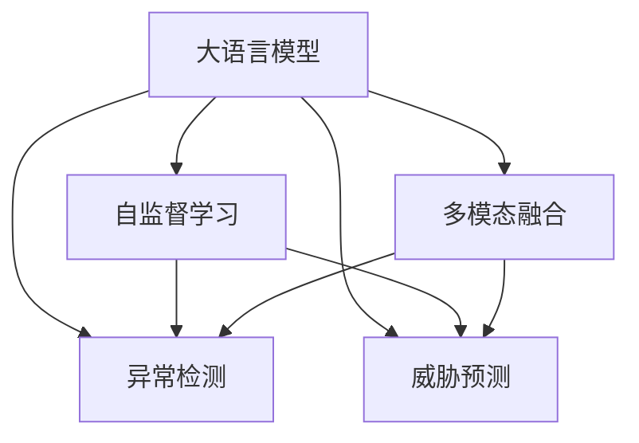

                 

# 大语言模型在网络安全中的应用：智能威胁检测

> 关键词：大语言模型,网络安全,智能威胁检测,自监督学习,Transformer,BERT,多模态融合,异常检测

## 1. 背景介绍

### 1.1 问题由来
网络安全威胁日益严重，如SQL注入、跨站脚本攻击(XSS)、DDoS攻击等，每年造成企业巨大的经济损失。传统的安全检测手段大多依赖规则匹配、特征分析等技术，难以应对复杂多变的威胁形势。随着大语言模型和大数据分析技术的发展，基于大语言模型的智能威胁检测技术成为新的研究热点。

大语言模型（Large Language Model, LLM）是指通过自监督或半监督学习，在大规模无标签文本语料上训练得到的通用语言模型。在网络安全领域，大语言模型可以从多源异构的数据中学习攻击模式，自动发现威胁行为特征，从而实现智能威胁检测。其核心思想是将网络安全数据转化为自然语言，通过大语言模型进行分析处理，最终输出威胁检测结果。

### 1.2 问题核心关键点
大语言模型在网络安全中的应用，主要集中在以下几个方面：

- 自动获取威胁特征：大语言模型可以从大规模无标签网络数据中自动学习到攻击模式和行为特征，无需手工提取。
- 异常检测与预测：利用大语言模型强大的模式识别能力，实现对异常网络行为的自动检测和预测。
- 自监督与无监督学习：在缺乏标注数据的情况下，大语言模型可以通过自监督或无监督学习进行训练，进而适应不同的安全检测场景。
- 多模态融合：结合文本、行为、设备等多源异构数据，全面提升威胁检测的准确性和鲁棒性。

### 1.3 问题研究意义
大语言模型在网络安全中的应用，将极大地提升威胁检测的智能化水平，降低安全防护的人力和时间成本。具体意义如下：

- 自动化安全检测：大语言模型能够自动分析大量网络数据，发现未知的威胁模式，无需人工干预。
- 动态响应安全事件：基于大语言模型的威胁检测系统可以实时监测网络行为，快速响应各类安全事件。
- 适配多种威胁场景：大语言模型可以适应不同类型的安全威胁，提高防护系统的通用性和灵活性。
- 降低误报和漏报：通过多模态融合等技术手段，大语言模型可以降低误报和漏报，提升威胁检测的准确性和可靠性。

## 2. 核心概念与联系

### 2.1 核心概念概述

为更好地理解大语言模型在网络安全中的应用，本节将介绍几个关键的概念及其相互关系：

- 大语言模型（LLM）：以自回归（如GPT）或自编码（如BERT）模型为代表的大规模预训练语言模型。通过在大规模无标签文本语料上进行预训练，学习通用的语言知识，具备强大的语言理解和生成能力。
- 自监督学习：在缺乏标注数据的情况下，通过设计预训练任务（如语言建模、掩码语言模型等）对模型进行训练，自动学习到模型自身的结构化知识。
- 异常检测：通过训练有监督或无监督的模型，对输入数据进行异常行为识别和分类，进而发现威胁。
- 威胁预测：基于历史数据，通过训练模型对未来的威胁行为进行预测，提前采取防护措施。
- 多模态融合：结合文本、行为、设备等多源异构数据，提升威胁检测系统的全面性和鲁棒性。

这些核心概念之间的关系可以通过以下Mermaid流程图来展示：



这个流程图展示了大语言模型在网络安全中的应用框架：

1. 大语言模型通过自监督学习获得基础知识，并将其应用在异常检测和威胁预测等任务中。
2. 异常检测和威胁预测在多模态融合的基础上，可以全面地分析各类安全威胁，提高检测的准确性和鲁棒性。
3. 自监督学习和多模态融合为异常检测和威胁预测提供了更多的训练数据和信息源。

## 3. 核心算法原理 & 具体操作步骤
### 3.1 算法原理概述

大语言模型在网络安全中的应用，本质上是通过自监督学习和大规模数据训练，实现对异常网络行为的自动识别和分类。其核心算法原理如下：

1. **数据准备**：收集并整理网络安全数据，包括日志文件、网络流量、行为记录等，并将其转化为自然语言。
2. **模型预训练**：在大规模无标签网络数据上进行自监督学习，训练通用语言模型。
3. **任务适配**：根据具体威胁检测任务，设计合适的任务适配层，如分类器、解码器等，实现对网络数据的具体分析。
4. **微调与优化**：在少量标注数据上对模型进行微调，优化其在下游任务上的性能。
5. **异常检测与预测**：利用训练好的模型，对输入的网络数据进行异常行为检测和威胁预测。

### 3.2 算法步骤详解

基于大语言模型在网络安全中的应用，本文将详细介绍其具体操作步骤：

**Step 1: 数据预处理**
- 收集和整理网络安全数据，包括日志文件、网络流量、行为记录等。
- 使用分词器将文本数据转化为分词序列，并去除噪声和停用词。
- 根据具体任务需求，对文本数据进行编码和标准化处理。

**Step 2: 模型预训练**
- 在大规模无标签网络数据上进行自监督学习，训练通用语言模型。
- 使用预训练任务，如掩码语言模型、文本分类等，对模型进行训练。
- 使用多GPU或多TPU进行并行训练，加速模型收敛。

**Step 3: 任务适配**
- 根据具体威胁检测任务，设计合适的任务适配层，如分类器、解码器等。
- 在预训练模型基础上，添加任务适配层，实现对网络数据的分析。

**Step 4: 微调与优化**
- 在少量标注数据上对模型进行微调，优化其在下游任务上的性能。
- 使用正则化技术，如L2正则、Dropout等，避免过拟合。
- 使用AdamW等优化算法，调节学习率，优化模型参数。

**Step 5: 异常检测与预测**
- 利用训练好的模型，对输入的网络数据进行异常行为检测和威胁预测。
- 根据模型的输出结果，进行威胁分类和等级划分。
- 实时监测网络行为，快速响应各类安全事件。

### 3.3 算法优缺点

大语言模型在网络安全中的应用，具有以下优点：
1. 自动学习特征：大语言模型可以从大规模无标签数据中自动学习到攻击模式和行为特征，无需手工提取。
2. 异常检测能力强：大语言模型具有强大的模式识别能力，可以有效识别各类异常行为。
3. 动态响应能力强：基于大语言模型的威胁检测系统可以实时监测网络行为，快速响应安全事件。
4. 鲁棒性好：多模态融合等技术手段，可以降低误报和漏报，提高威胁检测的准确性和鲁棒性。

同时，该方法也存在一定的局限性：
1. 数据预处理复杂：网络安全数据格式多样，需要进行复杂的数据预处理和标准化。
2. 训练成本高：大语言模型的训练需要大规模计算资源，成本较高。
3. 依赖标注数据：微调过程中，仍需要少量标注数据，获取高质量标注数据的成本较高。
4. 泛化能力有限：当预训练数据与目标数据分布差异较大时，模型的泛化能力可能不足。
5. 可解释性不足：大语言模型输出结果缺乏可解释性，难以进行深入分析和调试。

尽管存在这些局限性，但大语言模型在网络安全中的应用，具有巨大的潜力，仍是大规模语言模型应用的重要方向。

### 3.4 算法应用领域

基于大语言模型在网络安全中的应用，主要包括以下几个领域：

- **异常检测**：实时监测网络行为，自动识别异常行为，如SQL注入、DDoS攻击、XSS攻击等。
- **威胁预测**：利用历史数据，对未来的威胁行为进行预测，提前采取防护措施。
- **恶意软件检测**：分析恶意软件代码，自动识别并分类恶意软件类型。
- **行为分析**：分析用户行为，检测异常登录行为、异常操作行为等。
- **日志分析**：分析系统日志文件，检测异常访问记录和操作记录。
- **入侵检测**：检测网络入侵行为，防止未经授权的访问和攻击。

除了上述这些经典任务外，大语言模型在网络安全中的应用，还包括入侵预防、恶意行为分析、漏洞扫描等更多场景。

## 4. 数学模型和公式 & 详细讲解  
### 4.1 数学模型构建

为更好地理解大语言模型在网络安全中的应用，本节将介绍其数学模型构建方法。

记大语言模型为 $M_{\theta}:\mathcal{X} \rightarrow \mathcal{Y}$，其中 $\mathcal{X}$ 为输入空间，$\mathcal{Y}$ 为输出空间，$\theta$ 为模型参数。假设网络安全任务为异常检测，训练集为 $D=\{(x_i,y_i)\}_{i=1}^N, x_i \in \mathcal{X}, y_i \in \{0,1\}$，$y_i=1$ 表示样本为异常行为。

定义模型 $M_{\theta}$ 在输入 $x$ 上的输出为 $\hat{y}=M_{\theta}(x) \in [0,1]$，表示样本为异常行为的概率。真实标签 $y_i \in \{0,1\}$。则异常检测任务中的损失函数定义为：

$$
\ell(M_{\theta}(x),y) = -[y\log \hat{y} + (1-y)\log (1-\hat{y})]
$$

将其代入经验风险公式，得：

$$
\mathcal{L}(\theta) = -\frac{1}{N}\sum_{i=1}^N [y_i\log M_{\theta}(x_i)+(1-y_i)\log(1-M_{\theta}(x_i))]
$$

通过梯度下降等优化算法，最小化损失函数，得到最优参数 $\hat{\theta}$。

### 4.2 公式推导过程

以下我们以二分类任务为例，推导异常检测任务中的损失函数及其梯度的计算公式。

假设模型 $M_{\theta}$ 在输入 $x$ 上的输出为 $\hat{y}=M_{\theta}(x) \in [0,1]$，表示样本为异常行为的概率。真实标签 $y_i \in \{0,1\}$。则二分类交叉熵损失函数定义为：

$$
\ell(M_{\theta}(x),y) = -[y\log \hat{y} + (1-y)\log (1-\hat{y})]
$$

将其代入经验风险公式，得：

$$
\mathcal{L}(\theta) = -\frac{1}{N}\sum_{i=1}^N [y_i\log M_{\theta}(x_i)+(1-y_i)\log(1-M_{\theta}(x_i))]
$$

根据链式法则，损失函数对参数 $\theta_k$ 的梯度为：

$$
\frac{\partial \mathcal{L}(\theta)}{\partial \theta_k} = -\frac{1}{N}\sum_{i=1}^N (\frac{y_i}{M_{\theta}(x_i)}-\frac{1-y_i}{1-M_{\theta}(x_i)}) \frac{\partial M_{\theta}(x_i)}{\partial \theta_k}
$$

其中 $\frac{\partial M_{\theta}(x_i)}{\partial \theta_k}$ 可进一步递归展开，利用自动微分技术完成计算。

在得到损失函数的梯度后，即可带入参数更新公式，完成模型的迭代优化。重复上述过程直至收敛，最终得到适应异常检测任务的最优模型参数 $\hat{\theta}$。

## 5. 项目实践：代码实例和详细解释说明
### 5.1 开发环境搭建

在进行网络安全大语言模型微调实践前，我们需要准备好开发环境。以下是使用Python进行PyTorch开发的环境配置流程：

1. 安装Anaconda：从官网下载并安装Anaconda，用于创建独立的Python环境。

2. 创建并激活虚拟环境：
```bash
conda create -n pytorch-env python=3.8 
conda activate pytorch-env
```

3. 安装PyTorch：根据CUDA版本，从官网获取对应的安装命令。例如：
```bash
conda install pytorch torchvision torchaudio cudatoolkit=11.1 -c pytorch -c conda-forge
```

4. 安装Transformers库：
```bash
pip install transformers
```

5. 安装各类工具包：
```bash
pip install numpy pandas scikit-learn matplotlib tqdm jupyter notebook ipython
```

完成上述步骤后，即可在`pytorch-env`环境中开始微调实践。

### 5.2 源代码详细实现

下面我们以异常检测任务为例，给出使用Transformers库对BERT模型进行微调的PyTorch代码实现。

首先，定义异常检测任务的数据处理函数：

```python
from transformers import BertTokenizer
from torch.utils.data import Dataset
import torch

class AnomalyDataset(Dataset):
    def __init__(self, texts, labels, tokenizer, max_len=128):
        self.texts = texts
        self.labels = labels
        self.tokenizer = tokenizer
        self.max_len = max_len
        
    def __len__(self):
        return len(self.texts)
    
    def __getitem__(self, item):
        text = self.texts[item]
        label = self.labels[item]
        
        encoding = self.tokenizer(text, return_tensors='pt', max_length=self.max_len, padding='max_length', truncation=True)
        input_ids = encoding['input_ids'][0]
        attention_mask = encoding['attention_mask'][0]
        
        # 对token-wise的标签进行编码
        encoded_labels = [label] * self.max_len
        labels = torch.tensor(encoded_labels, dtype=torch.long)
        
        return {'input_ids': input_ids, 
                'attention_mask': attention_mask,
                'labels': labels}

# 标签与id的映射
label2id = {0: 0, 1: 1}
id2label = {v: k for k, v in label2id.items()}

# 创建dataset
tokenizer = BertTokenizer.from_pretrained('bert-base-cased')

train_dataset = AnomalyDataset(train_texts, train_labels, tokenizer)
dev_dataset = AnomalyDataset(dev_texts, dev_labels, tokenizer)
test_dataset = AnomalyDataset(test_texts, test_labels, tokenizer)
```

然后，定义模型和优化器：

```python
from transformers import BertForTokenClassification, AdamW

model = BertForTokenClassification.from_pretrained('bert-base-cased', num_labels=len(label2id))

optimizer = AdamW(model.parameters(), lr=2e-5)
```

接着，定义训练和评估函数：

```python
from torch.utils.data import DataLoader
from tqdm import tqdm
from sklearn.metrics import classification_report

device = torch.device('cuda') if torch.cuda.is_available() else torch.device('cpu')
model.to(device)

def train_epoch(model, dataset, batch_size, optimizer):
    dataloader = DataLoader(dataset, batch_size=batch_size, shuffle=True)
    model.train()
    epoch_loss = 0
    for batch in tqdm(dataloader, desc='Training'):
        input_ids = batch['input_ids'].to(device)
        attention_mask = batch['attention_mask'].to(device)
        labels = batch['labels'].to(device)
        model.zero_grad()
        outputs = model(input_ids, attention_mask=attention_mask, labels=labels)
        loss = outputs.loss
        epoch_loss += loss.item()
        loss.backward()
        optimizer.step()
    return epoch_loss / len(dataloader)

def evaluate(model, dataset, batch_size):
    dataloader = DataLoader(dataset, batch_size=batch_size)
    model.eval()
    preds, labels = [], []
    with torch.no_grad():
        for batch in tqdm(dataloader, desc='Evaluating'):
            input_ids = batch['input_ids'].to(device)
            attention_mask = batch['attention_mask'].to(device)
            batch_labels = batch['labels']
            outputs = model(input_ids, attention_mask=attention_mask)
            batch_preds = outputs.logits.argmax(dim=2).to('cpu').tolist()
            batch_labels = batch_labels.to('cpu').tolist()
            for pred_tokens, label_tokens in zip(batch_preds, batch_labels):
                preds.append(pred_tokens)
                labels.append(label_tokens)
                
    print(classification_report(labels, preds))
```

最后，启动训练流程并在测试集上评估：

```python
epochs = 5
batch_size = 16

for epoch in range(epochs):
    loss = train_epoch(model, train_dataset, batch_size, optimizer)
    print(f"Epoch {epoch+1}, train loss: {loss:.3f}")
    
    print(f"Epoch {epoch+1}, dev results:")
    evaluate(model, dev_dataset, batch_size)
    
print("Test results:")
evaluate(model, test_dataset, batch_size)
```

以上就是使用PyTorch对BERT进行异常检测任务微调的完整代码实现。可以看到，得益于Transformers库的强大封装，我们可以用相对简洁的代码完成BERT模型的加载和微调。

### 5.3 代码解读与分析

让我们再详细解读一下关键代码的实现细节：

**AnomalyDataset类**：
- `__init__`方法：初始化文本、标签、分词器等关键组件。
- `__len__`方法：返回数据集的样本数量。
- `__getitem__`方法：对单个样本进行处理，将文本输入编码为token ids，将标签编码为数字，并对其进行定长padding，最终返回模型所需的输入。

**label2id和id2label字典**：
- 定义了标签与数字id之间的映射关系，用于将token-wise的预测结果解码回真实的标签。

**训练和评估函数**：
- 使用PyTorch的DataLoader对数据集进行批次化加载，供模型训练和推理使用。
- 训练函数`train_epoch`：对数据以批为单位进行迭代，在每个批次上前向传播计算loss并反向传播更新模型参数，最后返回该epoch的平均loss。
- 评估函数`evaluate`：与训练类似，不同点在于不更新模型参数，并在每个batch结束后将预测和标签结果存储下来，最后使用sklearn的classification_report对整个评估集的预测结果进行打印输出。

**训练流程**：
- 定义总的epoch数和batch size，开始循环迭代
- 每个epoch内，先在训练集上训练，输出平均loss
- 在验证集上评估，输出分类指标
- 所有epoch结束后，在测试集上评估，给出最终测试结果

可以看到，PyTorch配合Transformers库使得BERT微调的代码实现变得简洁高效。开发者可以将更多精力放在数据处理、模型改进等高层逻辑上，而不必过多关注底层的实现细节。

当然，工业级的系统实现还需考虑更多因素，如模型的保存和部署、超参数的自动搜索、更灵活的任务适配层等。但核心的微调范式基本与此类似。

## 6. 实际应用场景
### 6.1 智能入侵检测

基于大语言模型的智能入侵检测系统，可以实时监测网络行为，自动识别各种入侵行为。当检测到异常行为时，系统可以立即发出告警，并采取相应的防御措施。

在技术实现上，可以收集网络行为数据，将网络行为转化为自然语言，对大语言模型进行微调。微调后的模型能够识别各种入侵行为，如DDoS攻击、SQL注入、跨站脚本攻击等。模型输出结果可以实时更新，不断优化识别效果，提升防御系统的智能化水平。

### 6.2 恶意软件分析

网络中存在大量恶意软件，其种类和变种层出不穷。传统的恶意软件检测方法依赖特征匹配，难以应对新的威胁。大语言模型可以通过分析恶意软件的代码和行为特征，自动识别恶意软件类型，并进行分类。

具体而言，可以将恶意软件代码和行为记录转化为自然语言，输入到大语言模型中进行训练。微调后的模型能够从代码和行为中学习到恶意软件的特征，进而自动分类和识别不同类型的恶意软件。对于新兴的恶意软件，模型也能通过相似性推理进行识别。

### 6.3 行为分析与身份认证

网络中存在大量伪造的登录请求，如何识别伪造行为是安全防护的关键问题。基于大语言模型的行为分析和身份认证技术，可以准确识别用户行为，防止伪造登录请求。

具体而言，可以将用户的登录行为记录转化为自然语言，输入到大语言模型中进行训练。微调后的模型能够学习到用户的正常行为特征，进而识别异常登录行为。结合身份认证信息，可以进一步提升安全防护效果。

### 6.4 未来应用展望

随着大语言模型和微调方法的不断发展，基于大语言模型的智能威胁检测技术将迎来更多突破。

在智慧城市安全防护中，基于大语言模型的智能威胁检测系统可以实时监测各类安全事件，如网络攻击、恶意软件等，及时发出告警，提高城市管理的智能化水平。

在网络安全威胁检测中，大语言模型可以与机器学习、深度学习等技术手段结合，实现更加全面、精准的威胁检测。结合多模态数据，如行为、设备信息等，可以进一步提升检测系统的鲁棒性和准确性。

在云安全防护中，基于大语言模型的智能威胁检测系统可以实时监测云平台的行为，及时发现异常行为，保障云服务的稳定性和安全性。

除了上述这些经典应用外，大语言模型在网络安全领域还有更多的创新方向，如智能安全审计、安全事件响应、威胁情报生成等。

## 7. 工具和资源推荐
### 7.1 学习资源推荐

为了帮助开发者系统掌握大语言模型在网络安全中的应用，这里推荐一些优质的学习资源：

1. 《深度学习基础》课程：由李宏毅教授讲授，涵盖深度学习基础知识和前沿技术，适合初学者和进阶者。

2. 《自然语言处理》课程：斯坦福大学开设的NLP经典课程，系统讲解NLP基本概念和技术，提供丰富的实验和项目。

3. 《Python深度学习》书籍：深度学习领域的经典入门书籍，涵盖深度学习基础和实践技术，适合入门和进阶读者。

4. 《机器学习实战》书籍：机器学习领域的经典入门书籍，涵盖机器学习基础和常用算法，提供丰富的实验和案例。

5. 《自然语言处理入门教程》：中科院计算所开设的NLP入门教程，系统讲解NLP基本概念和常见算法，适合初学者和进阶者。

通过对这些资源的学习实践，相信你一定能够快速掌握大语言模型在网络安全中的应用，并用于解决实际的安全防护问题。

### 7.2 开发工具推荐

高效的开发离不开优秀的工具支持。以下是几款用于大语言模型在网络安全中应用的开发工具：

1. PyTorch：基于Python的开源深度学习框架，灵活动态的计算图，适合快速迭代研究。大部分预训练语言模型都有PyTorch版本的实现。

2. TensorFlow：由Google主导开发的开源深度学习框架，生产部署方便，适合大规模工程应用。同样有丰富的预训练语言模型资源。

3. Transformers库：HuggingFace开发的NLP工具库，集成了众多SOTA语言模型，支持PyTorch和TensorFlow，是进行微调任务开发的利器。

4. Weights & Biases：模型训练的实验跟踪工具，可以记录和可视化模型训练过程中的各项指标，方便对比和调优。与主流深度学习框架无缝集成。

5. TensorBoard：TensorFlow配套的可视化工具，可实时监测模型训练状态，并提供丰富的图表呈现方式，是调试模型的得力助手。

6. Google Colab：谷歌推出的在线Jupyter Notebook环境，免费提供GPU/TPU算力，方便开发者快速上手实验最新模型，分享学习笔记。

合理利用这些工具，可以显著提升大语言模型在网络安全中的应用开发效率，加快创新迭代的步伐。

### 7.3 相关论文推荐

大语言模型在网络安全中的应用，涉及多方面的研究内容。以下是几篇奠基性的相关论文，推荐阅读：

1. Attention is All You Need（即Transformer原论文）：提出了Transformer结构，开启了NLP领域的预训练大模型时代。

2. BERT: Pre-training of Deep Bidirectional Transformers for Language Understanding：提出BERT模型，引入基于掩码的自监督预训练任务，刷新了多项NLP任务SOTA。

3. Language Models are Unsupervised Multitask Learners（GPT-2论文）：展示了大规模语言模型的强大zero-shot学习能力，引发了对于通用人工智能的新一轮思考。

4. Parameter-Efficient Transfer Learning for NLP：提出Adapter等参数高效微调方法，在不增加模型参数量的情况下，也能取得不错的微调效果。

5. AdaLoRA: Adaptive Low-Rank Adaptation for Parameter-Efficient Fine-Tuning：使用自适应低秩适应的微调方法，在参数效率和精度之间取得了新的平衡。

6. CyberBERT: A Transformer-based Network Anomaly Detection Framework：提出基于Transformer的异常检测框架CyberBERT，提升了网络异常检测的准确性和效率。

这些论文代表了大语言模型在网络安全中的应用研究的发展脉络。通过学习这些前沿成果，可以帮助研究者把握学科前进方向，激发更多的创新灵感。

## 8. 总结：未来发展趋势与挑战

### 8.1 总结

本文对大语言模型在网络安全中的应用进行了全面系统的介绍。首先阐述了大语言模型和微调技术的研究背景和意义，明确了大语言模型在网络安全检测任务中的核心价值。其次，从原理到实践，详细讲解了大语言模型在网络安全中的应用方法，包括数据预处理、模型预训练、任务适配、微调与优化等关键步骤。同时，本文还探讨了基于大语言模型的智能威胁检测技术在不同领域的应用，展示了其广阔的应用前景。最后，本文精选了相关学习资源和开发工具，力求为读者提供全方位的技术指引。

通过本文的系统梳理，可以看到，大语言模型在网络安全中的应用，能够极大提升威胁检测的智能化水平，降低安全防护的人力和时间成本。未来，伴随大语言模型和微调方法的持续演进，基于大语言模型的智能威胁检测技术必将进一步发展和完善，为网络安全防护带来新的突破。

### 8.2 未来发展趋势

展望未来，大语言模型在网络安全中的应用将呈现以下几个发展趋势：

1. 数据源多样化。大语言模型可以从多源异构的数据中学习攻击模式和行为特征，包括日志文件、网络流量、行为记录等。

2. 自动化程度提升。基于大语言模型的威胁检测系统可以自动分析大量网络数据，自动识别未知的威胁模式，无需人工干预。

3. 动态响应能力增强。实时监测网络行为，快速响应各类安全事件，保障网络安全。

4. 多模态融合深入。结合文本、行为、设备等多源异构数据，全面提升威胁检测系统的全面性和鲁棒性。

5. 自监督学习普及。在缺乏标注数据的情况下，大语言模型可以通过自监督学习进行训练，提升训练效率和泛化能力。

6. 鲁棒性增强。通过引入对抗训练、自适应学习等技术手段，增强模型的鲁棒性和泛化能力，防止模型过拟合和泛化不足。

以上趋势凸显了大语言模型在网络安全中的应用前景，得益于大语言模型的强大语言理解和生成能力，其将逐步成为网络安全防护中的核心技术手段。

### 8.3 面临的挑战

尽管大语言模型在网络安全中的应用取得了一定进展，但在迈向更加智能化、普适化应用的过程中，仍面临诸多挑战：

1. 数据隐私保护。网络安全数据涉及敏感信息，如何保护用户隐私，避免数据泄露，是一个重要问题。

2. 数据标准化。不同类型的数据格式和结构不同，需要进行复杂的数据预处理和标准化。

3. 鲁棒性问题。当预训练数据与目标数据分布差异较大时，模型的泛化能力可能不足，容易出现误报和漏报。

4. 模型可解释性。大语言模型输出结果缺乏可解释性，难以进行深入分析和调试。

5. 模型规模和训练成本。大语言模型的参数规模巨大，训练成本较高，需要大规模算力支持。

6. 安全性和可靠性。大语言模型在网络安全中的应用，需要确保模型的安全性，防止模型被恶意利用。

尽管存在这些挑战，但随着大语言模型和微调方法的不断进步，相信能够逐步克服这些障碍，推动大语言模型在网络安全中的应用不断发展和完善。

### 8.4 研究展望

未来的研究将从以下几个方向展开：

1. 引入更多先验知识。将符号化的先验知识，如知识图谱、逻辑规则等，与神经网络模型进行巧妙融合，引导微调过程学习更准确、合理的语言模型。

2. 研究参数高效和计算高效的微调范式。开发更加参数高效的微调方法，在固定大部分预训练参数的情况下，只更新极少量的任务相关参数。同时优化微调模型的计算图，减少前向传播和反向传播的资源消耗，实现更加轻量级、实时性的部署。

3. 引入因果分析和博弈论工具。将因果分析方法引入微调模型，识别出模型决策的关键特征，增强输出解释的因果性和逻辑性。借助博弈论工具刻画人机交互过程，主动探索并规避模型的脆弱点，提高系统稳定性。

4. 纳入伦理道德约束。在模型训练目标中引入伦理导向的评估指标，过滤和惩罚有偏见、有害的输出倾向。同时加强人工干预和审核，建立模型行为的监管机制，确保输出符合人类价值观和伦理道德。

5. 持续学习与在线更新。构建持续学习机制，使得大语言模型能够不断从新数据中学习，更新模型的知识库，适应不断变化的网络环境。

6. 动态鲁棒性研究。研究如何在大规模、动态环境中保持模型鲁棒性，防止模型过拟合和泛化不足。

以上研究方向将推动大语言模型在网络安全中的应用不断深入和完善，使得基于大语言模型的威胁检测系统更加智能化、普适化，为网络安全防护提供更加可靠的技术保障。

## 9. 附录：常见问题与解答

**Q1：大语言模型在网络安全中的应用是否能够完全取代传统的安全检测方法？**

A: 大语言模型在网络安全中的应用，可以自动学习攻击模式和行为特征，提升威胁检测的智能化水平。但大语言模型仍然需要人工规则、特征工程等辅助手段，才能取得最优检测效果。因此，大语言模型与传统安全检测方法应结合使用，共同构建综合性的安全防护体系。

**Q2：大语言模型在网络安全中的应用是否存在数据隐私问题？**

A: 大语言模型在网络安全中的应用，需要处理大量的敏感数据，如网络行为记录、日志文件等。为了保护用户隐私，需要在数据预处理和存储过程中，采取严格的隐私保护措施，如数据脱敏、匿名化等技术手段。同时，应建立完善的隐私保护政策，确保数据使用的合法性和合规性。

**Q3：大语言模型在网络安全中的应用是否会面临模型泛化不足的问题？**

A: 大语言模型在网络安全中的应用，确实可能面临模型泛化不足的问题。当预训练数据与目标数据分布差异较大时，模型的泛化能力可能不足，容易出现误报和漏报。为了解决这一问题，可以采用多模态融合、对抗训练等技术手段，增强模型的泛化能力和鲁棒性。

**Q4：大语言模型在网络安全中的应用是否会面临计算资源的问题？**

A: 大语言模型的参数规模巨大，训练和推理过程需要大量的计算资源，包括GPU/TPU等高性能设备。为了降低计算成本，可以采用分布式训练、模型压缩等技术手段，优化模型性能。同时，也可以在大模型中引入参数高效微调技术，进一步提高模型的计算效率。

**Q5：大语言模型在网络安全中的应用是否会面临安全性和可靠性问题？**

A: 大语言模型在网络安全中的应用，需要确保模型的安全性，防止模型被恶意利用。可以通过引入对抗训练、自适应学习等技术手段，增强模型的鲁棒性和泛化能力，防止模型过拟合和泛化不足。同时，应建立完善的模型监管机制，确保模型输出的安全性，防止恶意攻击和滥用。

通过对这些常见问题的解答，相信你一定能够更好地理解大语言模型在网络安全中的应用，掌握其核心技术原理和方法，从而更好地应用于实际的安全防护任务中。

