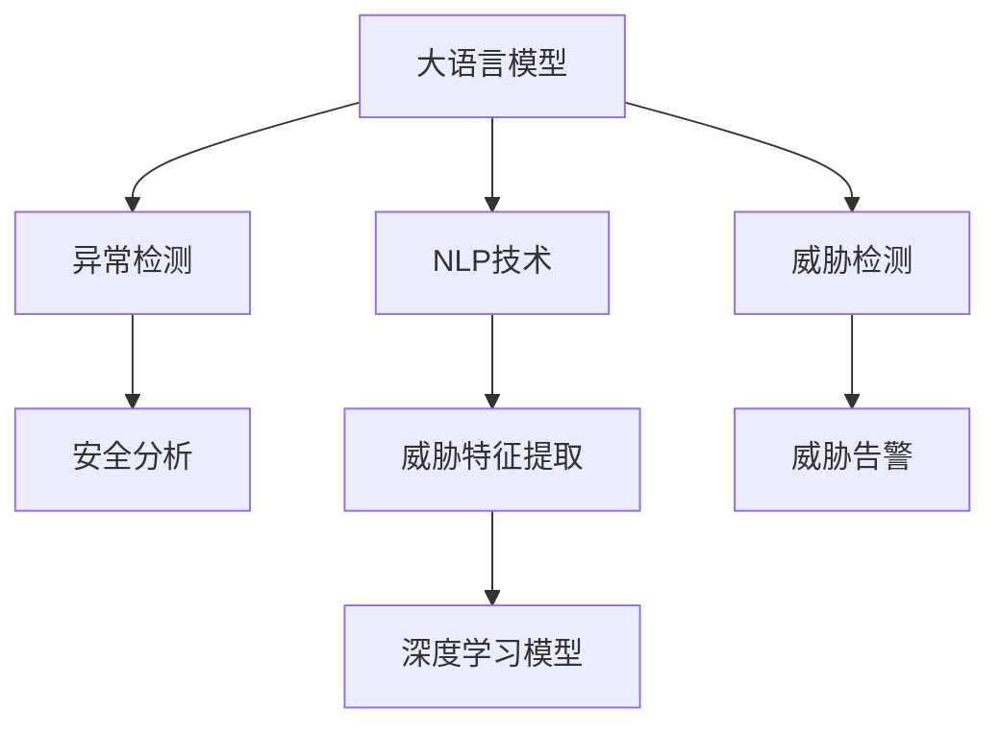

                 

# LLM在网络安全中的应用：智能威胁检测

> 关键词：大语言模型,智能威胁检测,自然语言处理,NLP,自然语言理解,异常检测,深度学习,安全分析

## 1. 背景介绍

### 1.1 问题由来
网络安全威胁日益严重，包括恶意软件攻击、网络钓鱼、DDoS攻击、数据泄露等多种形式。传统的基于规则和签名的安全检测方式，在应对新型威胁时显得力不从心。因此，需要一种更加智能、灵活、高效的安全检测方法，以适应快速变化的网络安全环境。

大语言模型（Large Language Models, LLMs）的兴起为这一问题提供了解决方案。大语言模型通过在大规模文本数据上进行预训练，学习到丰富的语言知识，能够理解和生成自然语言文本。借助这些能力，大语言模型可以用于网络安全领域，进行智能威胁检测，自动分析和识别潜在的安全威胁。

### 1.2 问题核心关键点
大语言模型在网络安全中的应用核心在于其能够理解自然语言，从文本数据中提取有用信息，用于威胁检测。具体包括以下几个关键点：

- **自然语言处理(NLP)**：大语言模型能够理解自然语言，从而从网络日志、告警报告等文本数据中提取有用信息。
- **异常检测**：利用大语言模型识别出异常行为或恶意事件，提前预警和响应。
- **深度学习**：利用深度学习模型自动学习威胁特征，提升检测的准确率和效率。
- **安全分析**：结合领域知识，对检测结果进行深入分析，提供有价值的报告和建议。

这些关键点共同构成了大语言模型在网络安全中应用的框架，使其能够在各种网络威胁检测场景中发挥强大的作用。

### 1.3 问题研究意义
大语言模型在网络安全中的应用，对于提升网络安全防护能力，保障重要信息系统的安全具有重要意义：

1. **自动化**：通过自动化威胁检测，减少人工干预，提高检测效率和响应速度。
2. **精准性**：利用大语言模型的丰富知识，提升威胁检测的准确性和深度。
3. **适应性**：大语言模型能够学习最新的安全威胁特征，及时更新检测模型，应对不断演变的威胁。
4. **成本效益**：相比传统的人工检测方式，大语言模型能够以较低成本，实现高效的网络安全防护。
5. **灵活性**：大语言模型可以根据不同的安全需求，设计不同的检测模型和任务，提升检测的灵活性和适用性。
6. **可解释性**：结合领域知识，为威胁检测结果提供可解释的报告，帮助人工理解和处理。

因此，利用大语言模型进行智能威胁检测，是大数据时代网络安全防护的重要手段。

## 2. 核心概念与联系

### 2.1 核心概念概述

为更好地理解大语言模型在网络安全中的应用，本节将介绍几个密切相关的核心概念：

- **大语言模型(Large Language Models, LLMs)**：指通过自监督学习在大规模文本数据上进行预训练的语言模型，如BERT、GPT、XLNet等。
- **自然语言处理(Natural Language Processing, NLP)**：涉及计算机科学、人工智能、语言学等多个领域的交叉学科，研究如何让计算机理解、处理和生成自然语言。
- **异常检测(Anomaly Detection)**：从数据中识别出异常行为或事件，常用于网络安全、金融风控等领域。
- **深度学习(Deep Learning)**：利用多层神经网络进行数据特征学习和自动建模的机器学习方法。
- **安全分析(Security Analysis)**：对威胁检测结果进行深入分析，提供有价值的报告和建议，帮助人工理解和处理。

这些核心概念之间的逻辑关系可以通过以下Mermaid流程图来展示：



这个流程图展示了大语言模型在网络安全中的应用过程：

1. 大语言模型通过预训练学习到丰富的语言知识。
2. 结合NLP技术，从网络日志、告警报告等文本数据中提取威胁特征。
3. 利用深度学习模型进行威胁检测，识别出异常行为或恶意事件。
4. 通过安全分析，提供有价值的报告和建议，帮助人工理解和处理。

## 3. 核心算法原理 & 具体操作步骤
### 3.1 算法原理概述

大语言模型在网络安全中的应用，本质上是利用其强大的NLP能力，从文本数据中提取威胁特征，用于异常检测和威胁检测。具体步骤如下：

1. **数据预处理**：收集网络日志、告警报告等文本数据，并进行清洗和标注。
2. **特征提取**：利用大语言模型提取文本中的威胁特征，如恶意代码、攻击模式等。
3. **异常检测**：使用深度学习模型（如LSTM、RNN等）对提取的特征进行建模，识别出异常行为或恶意事件。
4. **安全分析**：对检测结果进行深入分析，提供有价值的报告和建议，帮助人工理解和处理。

### 3.2 算法步骤详解

下面以恶意代码检测为例，详细介绍大语言模型在网络安全中的应用步骤：

**Step 1: 数据预处理**
- 收集网络日志、告警报告等文本数据，并进行清洗和标注。清洗包括去除无用信息、标准化格式等，标注包括标记恶意代码、攻击模式等。

**Step 2: 特征提取**
- 利用BERT等大语言模型对文本进行编码，得到文本的词向量表示。
- 结合领域知识，提取文本中的恶意代码特征，如字符串模式、函数调用等。

**Step 3: 异常检测**
- 利用LSTM或RNN等深度学习模型对提取的特征进行建模，识别出异常行为或恶意事件。
- 使用交叉熵损失函数和AdamW优化器进行模型训练。

**Step 4: 安全分析**
- 对检测结果进行深入分析，结合领域知识，提供有价值的报告和建议。
- 使用正则化技术（如L2正则、Dropout）防止模型过拟合。

### 3.3 算法优缺点

大语言模型在网络安全中的应用具有以下优点：
1. **自动化和高效性**：利用自动化技术，提高威胁检测效率和响应速度。
2. **精准性和深度**：结合领域知识，提高威胁检测的准确性和深度。
3. **适应性和灵活性**：能够学习最新的安全威胁特征，及时更新检测模型，应对不断演变的威胁。
4. **成本效益**：相比传统的人工检测方式，大语言模型能够以较低成本，实现高效的网络安全防护。

同时，该方法也存在一定的局限性：
1. **依赖标注数据**：需要收集大量的标注数据，进行特征提取和训练。标注数据的质量和数量直接影响检测效果。
2. **模型泛化性**：大语言模型可能对未知的威胁特征识别效果不佳。
3. **计算资源需求高**：大语言模型需要大量的计算资源进行预训练和微调。

尽管存在这些局限性，但大语言模型在网络安全中的应用前景依然广阔，未来仍需解决以上问题，提升检测效果和性能。

### 3.4 算法应用领域

大语言模型在网络安全中的应用，主要包括以下几个领域：

1. **恶意代码检测**：识别网络中的恶意代码，如病毒、木马、勒索软件等。
2. **入侵检测**：检测网络入侵行为，如DDoS攻击、端口扫描等。
3. **安全告警**：自动生成威胁告警，及时通知安全团队处理。
4. **行为分析**：分析用户和设备的行为模式，识别异常行为或恶意事件。
5. **漏洞分析**：分析系统漏洞，提供修补建议。
6. **安全审计**：对安全事件进行审计和溯源，找出问题的根源。

这些应用领域覆盖了网络安全防护的各个环节，使得大语言模型成为网络安全防护的重要工具。

## 4. 数学模型和公式 & 详细讲解 & 举例说明
### 4.1 数学模型构建

本节将使用数学语言对大语言模型在网络安全中的应用进行更加严格的刻画。

记大语言模型为 $M_{\theta}$，其中 $\theta$ 为模型参数。假设网络日志数据集为 $D=\{(x_i,y_i)\}_{i=1}^N, x_i \in \mathcal{X}, y_i \in \{0,1\}$，其中 $0$ 表示正常日志，$1$ 表示包含恶意代码。

定义模型 $M_{\theta}$ 在输入 $x_i$ 上的输出为 $\hat{y}=M_{\theta}(x_i) \in [0,1]$，表示模型判断该日志是否包含恶意代码的概率。则定义经验风险为：

$$
\mathcal{L}(\theta) = -\frac{1}{N} \sum_{i=1}^N y_i\log \hat{y}_i + (1-y_i)\log (1-\hat{y}_i)
$$

其中 $y_i\log \hat{y}_i + (1-y_i)\log (1-\hat{y}_i)$ 为二分类交叉熵损失函数。

使用梯度下降等优化算法（如AdamW），最小化损失函数 $\mathcal{L}(\theta)$，更新模型参数 $\theta$：

$$
\theta \leftarrow \theta - \eta \nabla_{\theta}\mathcal{L}(\theta) - \eta\lambda\theta
$$

其中 $\nabla_{\theta}\mathcal{L}(\theta)$ 为损失函数对参数 $\theta$ 的梯度。

### 4.2 公式推导过程

以二分类任务为例，推导交叉熵损失函数及其梯度的计算公式。

假设模型 $M_{\theta}$ 在输入 $x_i$ 上的输出为 $\hat{y}=M_{\theta}(x_i) \in [0,1]$，表示样本是否包含恶意代码的概率。真实标签 $y_i \in \{0,1\}$。则二分类交叉熵损失函数定义为：

$$
\ell(M_{\theta}(x_i),y_i) = -[y_i\log \hat{y}_i + (1-y_i)\log (1-\hat{y}_i)]
$$

将其代入经验风险公式，得：

$$
\mathcal{L}(\theta) = -\frac{1}{N}\sum_{i=1}^N [y_i\log M_{\theta}(x_i)+(1-y_i)\log(1-M_{\theta}(x_i))]
$$

根据链式法则，损失函数对参数 $\theta_k$ 的梯度为：

$$
\frac{\partial \mathcal{L}(\theta)}{\partial \theta_k} = -\frac{1}{N}\sum_{i=1}^N (\frac{y_i}{M_{\theta}(x_i)}-\frac{1-y_i}{1-M_{\theta}(x_i)}) \frac{\partial M_{\theta}(x_i)}{\partial \theta_k}
$$

其中 $\frac{\partial M_{\theta}(x_i)}{\partial \theta_k}$ 可进一步递归展开，利用自动微分技术完成计算。

在得到损失函数的梯度后，即可带入参数更新公式，完成模型的迭代优化。重复上述过程直至收敛，最终得到适应恶意代码检测的模型参数 $\theta^*$。

### 4.3 案例分析与讲解

以GPT模型为例，展示如何利用大语言模型进行恶意代码检测：

**Step 1: 数据预处理**
- 收集网络日志，去除无用信息，标准化格式，标注恶意代码。

**Step 2: 特征提取**
- 利用BERT对日志进行编码，得到词向量表示。
- 提取日志中的恶意代码特征，如字符串模式、函数调用等。

**Step 3: 异常检测**
- 使用LSTM对提取的特征进行建模，识别出恶意代码。
- 使用交叉熵损失函数和AdamW优化器进行模型训练。

**Step 4: 安全分析**
- 对检测结果进行深入分析，结合领域知识，提供有价值的报告和建议。
- 使用正则化技术（如L2正则、Dropout）防止模型过拟合。

通过以上步骤，大语言模型可以高效、准确地检测恶意代码，提升网络安全防护能力。

## 5. 项目实践：代码实例和详细解释说明
### 5.1 开发环境搭建

在进行恶意代码检测实践前，我们需要准备好开发环境。以下是使用Python进行PyTorch开发的环境配置流程：

1. 安装Anaconda：从官网下载并安装Anaconda，用于创建独立的Python环境。

2. 创建并激活虚拟环境：
```bash
conda create -n pytorch-env python=3.8 
conda activate pytorch-env
```

3. 安装PyTorch：根据CUDA版本，从官网获取对应的安装命令。例如：
```bash
conda install pytorch torchvision torchaudio cudatoolkit=11.1 -c pytorch -c conda-forge
```

4. 安装Transformers库：
```bash
pip install transformers
```

5. 安装各类工具包：
```bash
pip install numpy pandas scikit-learn matplotlib tqdm jupyter notebook ipython
```

完成上述步骤后，即可在`pytorch-env`环境中开始恶意代码检测实践。

### 5.2 源代码详细实现

下面我们以恶意代码检测任务为例，给出使用Transformers库对BERT模型进行检测的PyTorch代码实现。

首先，定义检测任务的数据处理函数：

```python
from transformers import BertTokenizer
from torch.utils.data import Dataset
import torch

class MalwareDetectionDataset(Dataset):
    def __init__(self, texts, labels, tokenizer, max_len=128):
        self.texts = texts
        self.labels = labels
        self.tokenizer = tokenizer
        self.max_len = max_len
        
    def __len__(self):
        return len(self.texts)
    
    def __getitem__(self, item):
        text = self.texts[item]
        label = self.labels[item]
        
        encoding = self.tokenizer(text, return_tensors='pt', max_length=self.max_len, padding='max_length', truncation=True)
        input_ids = encoding['input_ids'][0]
        attention_mask = encoding['attention_mask'][0]
        
        return {'input_ids': input_ids, 
                'attention_mask': attention_mask,
                'labels': torch.tensor(label, dtype=torch.long)}
```

然后，定义模型和优化器：

```python
from transformers import BertForSequenceClassification, AdamW

model = BertForSequenceClassification.from_pretrained('bert-base-uncased', num_labels=2)

optimizer = AdamW(model.parameters(), lr=2e-5)
```

接着，定义训练和评估函数：

```python
from torch.utils.data import DataLoader
from tqdm import tqdm
from sklearn.metrics import classification_report

device = torch.device('cuda') if torch.cuda.is_available() else torch.device('cpu')
model.to(device)

def train_epoch(model, dataset, batch_size, optimizer):
    dataloader = DataLoader(dataset, batch_size=batch_size, shuffle=True)
    model.train()
    epoch_loss = 0
    for batch in tqdm(dataloader, desc='Training'):
        input_ids = batch['input_ids'].to(device)
        attention_mask = batch['attention_mask'].to(device)
        labels = batch['labels'].to(device)
        model.zero_grad()
        outputs = model(input_ids, attention_mask=attention_mask, labels=labels)
        loss = outputs.loss
        epoch_loss += loss.item()
        loss.backward()
        optimizer.step()
    return epoch_loss / len(dataloader)

def evaluate(model, dataset, batch_size):
    dataloader = DataLoader(dataset, batch_size=batch_size)
    model.eval()
    preds, labels = [], []
    with torch.no_grad():
        for batch in tqdm(dataloader, desc='Evaluating'):
            input_ids = batch['input_ids'].to(device)
            attention_mask = batch['attention_mask'].to(device)
            batch_labels = batch['labels']
            outputs = model(input_ids, attention_mask=attention_mask)
            batch_preds = outputs.logits.argmax(dim=2).to('cpu').tolist()
            batch_labels = batch_labels.to('cpu').tolist()
            for pred, label in zip(batch_preds, batch_labels):
                preds.append(pred)
                labels.append(label)
                
    print(classification_report(labels, preds))
```

最后，启动训练流程并在测试集上评估：

```python
epochs = 5
batch_size = 16

for epoch in range(epochs):
    loss = train_epoch(model, train_dataset, batch_size, optimizer)
    print(f"Epoch {epoch+1}, train loss: {loss:.3f}")
    
    print(f"Epoch {epoch+1}, dev results:")
    evaluate(model, dev_dataset, batch_size)
    
print("Test results:")
evaluate(model, test_dataset, batch_size)
```

以上就是使用PyTorch对BERT进行恶意代码检测的完整代码实现。可以看到，利用Transformers库可以简洁高效地实现大语言模型的微调。

### 5.3 代码解读与分析

让我们再详细解读一下关键代码的实现细节：

**MalwareDetectionDataset类**：
- `__init__`方法：初始化文本、标签、分词器等关键组件。
- `__len__`方法：返回数据集的样本数量。
- `__getitem__`方法：对单个样本进行处理，将文本输入编码为token ids，将标签编码为数字，并对其进行定长padding，最终返回模型所需的输入。

**模型和优化器**：
- 使用BertForSequenceClassification模型，指定标签数为2（包含恶意代码和非恶意代码）。
- 使用AdamW优化器，设置学习率为2e-5。

**训练和评估函数**：
- 使用PyTorch的DataLoader对数据集进行批次化加载，供模型训练和推理使用。
- 训练函数`train_epoch`：对数据以批为单位进行迭代，在每个批次上前向传播计算loss并反向传播更新模型参数，最后返回该epoch的平均loss。
- 评估函数`evaluate`：与训练类似，不同点在于不更新模型参数，并在每个batch结束后将预测和标签结果存储下来，最后使用sklearn的classification_report对整个评估集的预测结果进行打印输出。

**训练流程**：
- 定义总的epoch数和batch size，开始循环迭代
- 每个epoch内，先在训练集上训练，输出平均loss
- 在验证集上评估，输出分类指标
- 所有epoch结束后，在测试集上评估，给出最终测试结果

可以看到，PyTorch配合Transformers库使得BERT检测的代码实现变得简洁高效。开发者可以将更多精力放在数据处理、模型改进等高层逻辑上，而不必过多关注底层的实现细节。

当然，工业级的系统实现还需考虑更多因素，如模型的保存和部署、超参数的自动搜索、更灵活的任务适配层等。但核心的检测范式基本与此类似。

## 6. 实际应用场景
### 6.1 智能威胁检测

大语言模型在网络安全中的应用，主要体现在智能威胁检测领域。智能威胁检测是指利用自动化技术，从网络日志、告警报告等文本数据中提取威胁特征，识别出异常行为或恶意事件。

智能威胁检测的实现流程包括：
1. 收集网络日志、告警报告等文本数据。
2. 利用BERT等大语言模型提取文本中的威胁特征，如恶意代码、攻击模式等。
3. 使用深度学习模型（如LSTM、RNN等）对提取的特征进行建模，识别出异常行为或恶意事件。
4. 结合领域知识，对检测结果进行深入分析，提供有价值的报告和建议。

智能威胁检测的核心是大语言模型和深度学习模型的结合，能够自动学习威胁特征，识别出异常行为或恶意事件，提供实时、精准的安全防护。

### 6.2 未来应用展望

未来，大语言模型在网络安全中的应用将呈现以下几个发展趋势：

1. **实时性和高效性**：通过进一步优化深度学习模型，提升威胁检测的实时性和响应速度，满足实时威胁防护的需求。
2. **泛化性和适应性**：利用大语言模型的预训练能力，提升威胁检测的泛化性，能够应对不断演变的威胁。
3. **可解释性和透明度**：结合领域知识，为威胁检测结果提供可解释的报告和建议，提高系统的透明度和可解释性。
4. **多模态融合**：结合网络流量数据、日志数据、告警数据等多种信息源，提升威胁检测的准确性和全面性。
5. **智能自适应**：通过智能自适应机制，动态调整检测策略和模型参数，适应不同的威胁环境和网络行为。

这些趋势将进一步提升大语言模型在网络安全中的应用效果，构建更加智能、高效、可靠的安全防护系统。

## 7. 工具和资源推荐
### 7.1 学习资源推荐

为了帮助开发者系统掌握大语言模型在网络安全中的应用，这里推荐一些优质的学习资源：

1. 《深度学习与网络安全》系列博文：由网络安全专家撰写，深入浅出地介绍了深度学习在网络安全中的应用。
2. CS229《机器学习》课程：斯坦福大学开设的机器学习明星课程，讲解了深度学习、异常检测等基础知识。
3. 《深度学习实战》书籍：通俗易懂地介绍了深度学习的基础知识和应用场景，包括网络安全检测。
4. HuggingFace官方文档：Transformers库的官方文档，提供了海量预训练模型和完整的微调样例代码。
5. GitHub上的开源项目：如LSTM恶意代码检测项目，提供了详细的代码实现和论文分析。

通过对这些资源的学习实践，相信你一定能够快速掌握大语言模型在网络安全中的应用方法，并用于解决实际的安全威胁检测问题。
###  7.2 开发工具推荐

高效的开发离不开优秀的工具支持。以下是几款用于恶意代码检测开发的常用工具：

1. PyTorch：基于Python的开源深度学习框架，灵活动态的计算图，适合快速迭代研究。大部分预训练语言模型都有PyTorch版本的实现。
2. TensorFlow：由Google主导开发的开源深度学习框架，生产部署方便，适合大规模工程应用。同样有丰富的预训练语言模型资源。
3. Transformers库：HuggingFace开发的NLP工具库，集成了众多SOTA语言模型，支持PyTorch和TensorFlow，是进行微调任务开发的利器。
4. Weights & Biases：模型训练的实验跟踪工具，可以记录和可视化模型训练过程中的各项指标，方便对比和调优。与主流深度学习框架无缝集成。
5. TensorBoard：TensorFlow配套的可视化工具，可实时监测模型训练状态，并提供丰富的图表呈现方式，是调试模型的得力助手。
6. Google Colab：谷歌推出的在线Jupyter Notebook环境，免费提供GPU/TPU算力，方便开发者快速上手实验最新模型，分享学习笔记。

合理利用这些工具，可以显著提升恶意代码检测的开发效率，加快创新迭代的步伐。

### 7.3 相关论文推荐

大语言模型在网络安全中的应用源于学界的持续研究。以下是几篇奠基性的相关论文，推荐阅读：

1. Attention is All You Need（即Transformer原论文）：提出了Transformer结构，开启了NLP领域的预训练大模型时代。
2. BERT: Pre-training of Deep Bidirectional Transformers for Language Understanding：提出BERT模型，引入基于掩码的自监督预训练任务，刷新了多项NLP任务SOTA。
3. Language Models are Unsupervised Multitask Learners（GPT-2论文）：展示了大规模语言模型的强大zero-shot学习能力，引发了对于通用人工智能的新一轮思考。
4. Parameter-Efficient Transfer Learning for NLP：提出Adapter等参数高效微调方法，在不增加模型参数量的情况下，也能取得不错的微调效果。
5. Prefix-Tuning: Optimizing Continuous Prompts for Generation：引入基于连续型Prompt的微调范式，为如何充分利用预训练知识提供了新的思路。
6. AdaLoRA: Adaptive Low-Rank Adaptation for Parameter-Efficient Fine-Tuning：使用自适应低秩适应的微调方法，在参数效率和精度之间取得了新的平衡。

这些论文代表了大语言模型在网络安全中的应用发展脉络。通过学习这些前沿成果，可以帮助研究者把握学科前进方向，激发更多的创新灵感。

## 8. 总结：未来发展趋势与挑战
### 8.1 总结

本文对大语言模型在网络安全中的应用进行了全面系统的介绍。首先阐述了大语言模型在网络安全中的应用背景和意义，明确了智能威胁检测的核心技术。其次，从原理到实践，详细讲解了智能威胁检测的数学原理和关键步骤，给出了恶意代码检测的完整代码实现。同时，本文还广泛探讨了智能威胁检测在多个行业领域的应用前景，展示了其广泛的应用价值。此外，本文精选了智能威胁检测技术的各类学习资源，力求为读者提供全方位的技术指引。

通过本文的系统梳理，可以看到，大语言模型在网络安全中的应用前景广阔，其强大的NLP能力和深度学习能力，使得威胁检测更加智能化、高效化。未来，随着大语言模型的进一步发展，智能威胁检测技术将得到更大范围的推广和应用，为网络安全领域带来革命性的变化。

### 8.2 未来发展趋势

展望未来，智能威胁检测技术将呈现以下几个发展趋势：

1. **实时性和高效性**：通过进一步优化深度学习模型，提升威胁检测的实时性和响应速度，满足实时威胁防护的需求。
2. **泛化性和适应性**：利用大语言模型的预训练能力，提升威胁检测的泛化性，能够应对不断演变的威胁。
3. **可解释性和透明度**：结合领域知识，为威胁检测结果提供可解释的报告和建议，提高系统的透明度和可解释性。
4. **多模态融合**：结合网络流量数据、日志数据、告警数据等多种信息源，提升威胁检测的准确性和全面性。
5. **智能自适应**：通过智能自适应机制，动态调整检测策略和模型参数，适应不同的威胁环境和网络行为。

这些趋势将进一步提升智能威胁检测的效果，构建更加智能、高效、可靠的安全防护系统。

### 8.3 面临的挑战

尽管智能威胁检测技术已经取得了显著进展，但在迈向更加智能化、普适化应用的过程中，它仍面临着诸多挑战：

1. **标注数据依赖**：需要收集大量的标注数据，进行特征提取和训练，标注数据的质量和数量直接影响检测效果。
2. **模型泛化性不足**：大语言模型可能对未知的威胁特征识别效果不佳，需要在模型训练中加入更多的领域知识。
3. **计算资源需求高**：大语言模型需要大量的计算资源进行预训练和微调，这对硬件设施提出了较高的要求。
4. **模型鲁棒性不足**：面对复杂的威胁环境，模型可能出现误检或漏检，需要进一步优化模型的鲁棒性。
5. **模型可解释性不足**：模型的预测结果缺乏可解释性，难以进行人工干预和调试。
6. **模型安全性不足**：模型的输入可能包含恶意代码或攻击特征，导致模型自身被攻击或滥用。

正视智能威胁检测面临的这些挑战，积极应对并寻求突破，将是大语言模型在网络安全领域走向成熟的必由之路。相信随着学界和产业界的共同努力，这些挑战终将一一被克服，智能威胁检测技术必将实现更加精准、可靠的威胁防护。

### 8.4 研究展望

面向未来，智能威胁检测技术需要在以下几个方面寻求新的突破：

1. **多模态融合**：结合网络流量数据、日志数据、告警数据等多种信息源，提升威胁检测的准确性和全面性。
2. **智能自适应**：通过智能自适应机制，动态调整检测策略和模型参数，适应不同的威胁环境和网络行为。
3. **模型鲁棒性提升**：通过对抗训练等方法，提升模型的鲁棒性，防止模型的误检和漏检。
4. **模型可解释性增强**：结合领域知识，为威胁检测结果提供可解释的报告和建议，提高系统的透明度和可解释性。
5. **模型安全性保障**：通过数据脱敏、模型加密等方法，确保模型的安全性，防止模型的滥用和攻击。

这些研究方向的探索，必将引领智能威胁检测技术迈向更高的台阶，为网络安全领域带来革命性的变化。

## 9. 附录：常见问题与解答

**Q1：智能威胁检测是否适用于所有网络安全场景？**

A: 智能威胁检测在大多数网络安全场景中都能取得不错的效果，特别是对于数据量较大的场景。但对于一些特定领域的场景，如物联网设备、工业控制系统等，可能需要针对性地设计模型和算法。

**Q2：智能威胁检测的准确性和效率如何？**

A: 智能威胁检测的准确性和效率取决于数据质量和模型设计。通常来说，通过深度学习模型和大语言模型的结合，可以显著提高威胁检测的准确性和效率。但需要注意，在标注数据不足或模型泛化性不足的情况下，准确性和效率可能受到一定的影响。

**Q3：智能威胁检测需要哪些数据？**

A: 智能威胁检测需要大量的网络日志、告警报告等文本数据，并进行预处理和标注。数据的质和量直接影响检测效果，因此需要收集和处理高质量的数据。

**Q4：智能威胁检测的模型如何更新？**

A: 智能威胁检测的模型通常需要定期更新，以适应新的威胁环境和网络行为。可以通过重新训练模型或微调模型，来更新威胁检测模型。此外，结合领域知识，定期手动调整模型的检测策略和参数，也是提升检测效果的重要手段。

**Q5：智能威胁检测对网络安全策略有哪些建议？**

A: 智能威胁检测能够帮助网络安全团队及时发现和响应威胁事件，但仍然需要结合人工干预和分析，制定更加全面、精准的安全策略。结合领域知识，制定详细的检测策略和应急响应计划，是提升网络安全防护能力的关键。

通过以上问题的解答，可以看到，智能威胁检测技术虽然面临一些挑战，但在网络安全防护中具有广阔的应用前景。随着技术的发展和应用的深化，智能威胁检测必将为网络安全领域带来革命性的变化，提升整体安全防护水平。

---

作者：禅与计算机程序设计艺术 / Zen and the Art of Computer Programming

