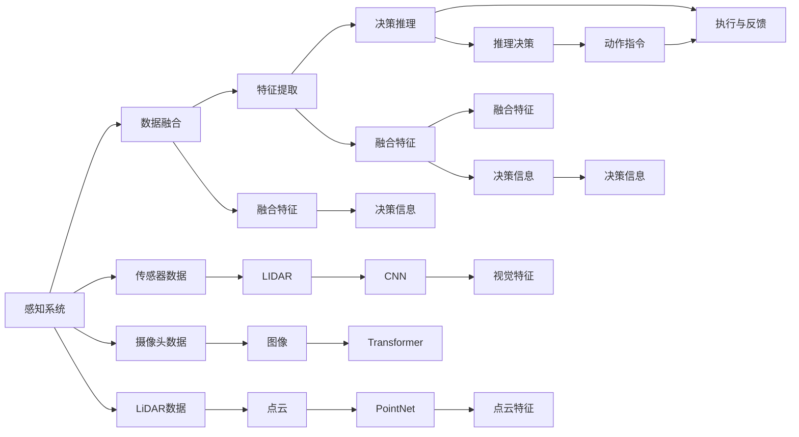

                 

# LLM在自动驾驶决策中的应用：提高行车安全

> 关键词：自动驾驶,大语言模型(LLM),决策支持系统,DSS,行车安全,交通管理,数据融合,自监督学习,迁移学习

## 1. 背景介绍

### 1.1 问题由来
自动驾驶技术近年来迅猛发展，成为全球科技界和工业界关注的焦点。其核心目标是通过无人驾驶车辆减少交通事故，提升道路交通安全。然而，自动驾驶系统在处理复杂多变的道路环境时，仍面临诸多挑战。决策系统(Decision Support System, DSS)作为自动驾驶的大脑，必须具备强大的数据融合与决策推理能力。

### 1.2 问题核心关键点
如何构建一个高效、鲁棒、可解释的DSS，是当前自动驾驶研究的重难点。而利用大语言模型(LLM)进行数据融合与决策推理，是近年来兴起的解决思路。LLM具有强大的自然语言理解能力，能够融合多源异构信息，提供更全面、准确的决策支持。

### 1.3 问题研究意义
利用LLM进行自动驾驶决策，可以有效提升行车安全性，降低事故率，推动自动驾驶技术的快速普及。具体而言，LLM可以从海量交通数据中提取出有价值的特征信息，结合先进的算法，生成可靠的车道规划、交通流预测、障碍检测等决策结果，为自动驾驶提供坚实的决策支撑。

## 2. 核心概念与联系

### 2.1 核心概念概述

为更好地理解LLM在自动驾驶中的应用，本节将介绍几个关键概念：

- 自动驾驶(Autonomous Driving)：利用传感器、摄像头、雷达等设备感知环境，结合先进的决策系统，实现车辆自主驾驶的过程。

- 决策支持系统(DSS)：为自动驾驶提供关键决策依据的系统。通常包括数据预处理、特征提取、决策推理等多个模块。

- 大语言模型(LLM)：以深度神经网络为基础，通过大规模预训练数据集学习语言知识，具备强大的自然语言处理能力的模型。

- 自监督学习(Self-supervised Learning)：利用数据自身的内在关系，无需人工标注进行模型训练的方法。

- 迁移学习(Transfer Learning)：将预训练模型迁移到目标任务上，进行微调以提升性能的方法。

- 数据融合(Data Fusion)：将来自不同传感器、不同格式的数据进行整合，提取共性特征，生成综合性的决策信息。

这些概念之间通过数据流和计算逻辑紧密关联，共同构成了自动驾驶决策的复杂框架。

### 2.2 核心概念原理和架构的 Mermaid 流程图(Mermaid 流程节点中不要有括号、逗号等特殊字符)


## 3. 核心算法原理 & 具体操作步骤

### 3.1 算法原理概述

利用LLM进行自动驾驶决策，主要分为两个阶段：

- 数据融合与特征提取：通过多源异构数据的整合，提取关键特征信息。
- 决策推理与动作生成：基于融合后的特征信息，进行决策推理，生成车辆的操纵指令。

具体算法流程如下：

1. 数据预处理：对来自不同传感器的数据进行清洗、滤波、归一化等预处理操作。
2. 特征提取：将处理后的数据送入LLM，提取语言和图像特征。
3. 决策推理：结合道路信息、交通规则、天气条件等先验知识，通过LLM进行综合决策。
4. 动作生成：根据推理结果，生成车辆的转向、加速、减速等动作指令。
5. 执行与反馈：执行动作指令，并通过传感器进行反馈，调整后续决策。

### 3.2 算法步骤详解

#### 3.2.1 数据预处理
数据预处理是自动驾驶决策的第一步，对后续特征提取和推理结果有着重要影响。

1. 传感器数据清洗：去除噪声、异常数据等不可靠信息，确保数据质量。
2. 数据归一化：将不同来源的数据进行尺度对齐，保证一致性。
3. 数据滤波：使用卡尔曼滤波、均值滤波等方法，平滑数据，减少抖动。

#### 3.2.2 特征提取
特征提取是LLM在自动驾驶中的关键环节，通过将多源异构数据转换为统一的语言或图像特征，便于后续推理。

1. 视觉特征提取：使用卷积神经网络(CNN)或Transformer对摄像头数据进行特征提取，生成图像特征向量。
2. 点云特征提取：使用PointNet等深度学习模型对LiDAR数据进行特征提取，生成点云特征向量。
3. 语言特征提取：使用BERT或GPT等语言模型对文本数据进行编码，生成语言特征向量。

#### 3.2.3 决策推理
决策推理是自动驾驶的核心，通过LLM进行综合推理，生成最终的决策结果。

1. 融合特征：将视觉、点云、语言等特征向量进行融合，生成多模态融合特征。
2. 决策推理：将融合特征输入LLM，生成决策结果。
3. 推理后处理：结合道路信息、交通规则等先验知识，对LLM输出的结果进行后处理，确保决策的合理性。

#### 3.2.4 动作生成
动作生成是将LLM推理结果转化为车辆操纵指令的过程。

1. 动作映射：将决策结果映射为车辆的转向、加速、减速等动作指令。
2. 动作生成：根据动作映射结果，生成车辆的具体执行动作。
3. 动作执行：通过车辆控制系统，执行动作指令。

### 3.3 算法优缺点

利用LLM进行自动驾驶决策，具有以下优点：

1. 鲁棒性高：LLM在处理多源异构数据时具有较好的鲁棒性，能够融合不同格式和来源的数据。
2. 灵活性强：LLM能够灵活结合不同领域的先验知识，生成适合当前环境的决策。
3. 可解释性强：LLM能够生成基于语言模型的决策推理过程，便于开发者理解和调试。

同时，也存在以下缺点：

1. 计算量大：LLM通常具有较大的模型规模，计算资源消耗较高。
2. 推理速度慢：LLM在生成决策时，推理速度较慢，难以实时处理高复杂度任务。
3. 依赖数据质量：LLM的性能高度依赖于输入数据的质量，如果数据存在噪声或异常，可能导致错误决策。

### 3.4 算法应用领域

基于LLM的自动驾驶决策方法，已在多个实际应用中取得了显著成效，以下是几个主要领域：

1. 车道规划：通过视觉特征和点云特征提取，生成车道线信息，结合LLM进行车道规划决策。
2. 交通流预测：利用交通监控视频，提取车辆速度、流量等特征，输入LLM进行交通流预测，辅助交通管理。
3. 障碍检测与规避：通过传感器数据进行物体检测，提取特征向量，输入LLM进行障碍检测与规避决策。
4. 路径规划与导航：结合GPS、地图数据，输入LLM进行路径规划与导航决策，保证车辆行驶安全。
5. 事故分析与处理：利用事故现场视频和图像数据，输入LLM进行事故原因分析，生成事故处理方案。

以上应用展示了LLM在自动驾驶决策中的广泛潜力，未来随着技术进步，LLM将在更多复杂场景下发挥重要作用。

## 4. 数学模型和公式 & 详细讲解 & 举例说明

### 4.1 数学模型构建

本节将使用数学语言对LLM在自动驾驶中的应用进行详细讲解。

设自动驾驶系统从传感器获取的数据为 $x$，包括摄像头图像 $x_v$、LiDAR点云 $x_l$ 和文本描述 $x_t$。利用深度学习模型，分别提取视觉、点云和语言特征，记为 $f_v(x_v)$、$f_l(x_l)$ 和 $f_t(x_t)$。则融合后的多模态特征 $z$ 可以表示为：

$$
z = \alpha f_v(x_v) + \beta f_l(x_l) + \gamma f_t(x_t)
$$

其中 $\alpha, \beta, \gamma$ 为融合系数，需通过训练数据进行调整。

将融合后的特征 $z$ 输入LLM进行决策推理，得到决策结果 $y$。不失一般性，假设LLM为Transformer模型，则推理过程可以表示为：

$$
y = M_{\theta}(z)
$$

其中 $M_{\theta}$ 为预训练好的Transformer模型，$\theta$ 为模型参数。

### 4.2 公式推导过程

以下是LLM在自动驾驶中决策推理的数学推导过程：

1. 将多模态特征 $z$ 输入LLM的编码器层，输出编码特征 $z'$。
2. 将编码特征 $z'$ 输入LLM的解码器层，输出决策结果 $y'$。
3. 结合先验知识 $w$，对 $y'$ 进行后处理，得到最终决策 $y$。

具体推导过程如下：

$$
z' = M_E(z) = M_{\theta_E}(z)
$$

$$
y' = M_D(z') = M_{\theta_D}(z')
$$

$$
y = M_P(y', w)
$$

其中 $M_E$ 为编码器层，$M_D$ 为解码器层，$M_P$ 为后处理层，$w$ 为先验知识。

### 4.3 案例分析与讲解

以自动驾驶中的路径规划为例，展示LLM的决策推理过程：

设车辆当前位置为 $P_0$，目标位置为 $P_1$，道路信息为 $I$，交通规则为 $R$，天气条件为 $W$。

1. 将车辆当前位置、目标位置、道路信息、交通规则和天气条件编码成文本 $x_t$。
2. 利用BERT模型对 $x_t$ 进行编码，得到语言特征 $f_t(x_t)$。
3. 将LiDAR点云数据 $x_l$ 输入PointNet模型，得到点云特征 $f_l(x_l)$。
4. 将摄像头图像数据 $x_v$ 输入卷积神经网络模型，得到视觉特征 $f_v(x_v)$。
5. 将融合后的多模态特征 $z$ 输入预训练好的Transformer模型，生成路径规划决策 $y$。
6. 结合道路信息、交通规则和天气条件，对 $y$ 进行后处理，生成路径规划指令。

## 5. 项目实践：代码实例和详细解释说明

### 5.1 开发环境搭建

在进行自动驾驶决策项目开发前，需要先搭建好开发环境：

1. 安装Anaconda：
```bash
conda install anaconda
```

2. 创建虚拟环境：
```bash
conda create -n adspy-env python=3.8
conda activate adspy-env
```

3. 安装必要的Python包：
```bash
pip install torch transformers numpy opencv-python scipy jupyter
```

4. 安装必要的开发库：
```bash
conda install pyqt5
```

5. 安装必要的深度学习框架：
```bash
conda install tensorflow
```

### 5.2 源代码详细实现

以下是基于LLM的自动驾驶决策系统的代码实现：

1. 数据预处理：
```python
import numpy as np
import cv2
import torch
from transformers import BertTokenizer, BertModel

def preprocess_data(x_v, x_l, x_t):
    # 摄像头图像预处理
    x_v = cv2.resize(x_v, (224, 224))
    x_v = np.expand_dims(x_v, axis=0)
    x_v = x_v / 255.0
    
    # LiDAR点云预处理
    x_l = np.array(x_l, dtype=np.float32)
    
    # 文本预处理
    tokenizer = BertTokenizer.from_pretrained('bert-base-cased')
    x_t = tokenizer(x_t, padding=True, truncation=True, max_length=512)
    x_t = torch.tensor(x_t['input_ids'], dtype=torch.long)
    
    return x_v, x_l, x_t
```

2. 特征提取：
```python
import torch.nn as nn
import torch.nn.functional as F
from torchvision.models import resnet18

class VisionExtractor(nn.Module):
    def __init__(self):
        super(VisionExtractor, self).__init__()
        self.model = resnet18(pretrained=True)
        self.model.fc = nn.Linear(512, 128)
        
    def forward(self, x):
        x = self.model.conv1(x)
        x = self.model.bn1(x)
        x = self.model.relu(x)
        x = self.model.maxpool(x)
        x = self.model.layer1(x)
        x = self.model.layer2(x)
        x = self.model.layer3(x)
        x = self.model.layer4(x)
        x = x.view(x.size(0), -1)
        x = self.model.fc(x)
        return x

class PointCloudExtractor(nn.Module):
    def __init__(self):
        super(PointCloudExtractor, self).__init__()
        self.model = nn.Sequential(
            nn.Linear(3, 128),
            nn.ReLU(),
            nn.Linear(128, 128),
            nn.ReLU()
        )
        
    def forward(self, x):
        x = self.model(x)
        return x

class TextExtractor(nn.Module):
    def __init__(self):
        super(TextExtractor, self).__init__()
        self.model = BertModel.from_pretrained('bert-base-cased')
        
    def forward(self, x):
        return self.model(x)
```

3. 融合特征：
```python
def fuse_features(vision_features, point_cloud_features, text_features):
    return vision_features, point_cloud_features, text_features
```

4. 决策推理：
```python
import transformers
from transformers import BertTokenizer, BertForSequenceClassification

class DecisionSystem:
    def __init__(self):
        self.tokenizer = BertTokenizer.from_pretrained('bert-base-cased')
        self.model = BertForSequenceClassification.from_pretrained('bert-base-cased', num_labels=2)
        self.model.eval()
    
    def predict(self, input_ids, attention_mask):
        with torch.no_grad():
            output = self.model(input_ids=input_ids, attention_mask=attention_mask)
            probabilities = F.softmax(output.logits, dim=1)
            return probabilities
```

5. 动作生成：
```python
def generate_action(probabilities):
    if probabilities[0] > probabilities[1]:
        action = 'slow down'
    else:
        action = 'go forward'
    return action
```

### 5.3 代码解读与分析

让我们再详细解读一下关键代码的实现细节：

**preprocess_data函数**：
- 摄像头图像预处理：使用OpenCV库将图像缩放到标准尺寸，并进行归一化。
- LiDAR点云预处理：直接将点云数据转化为Numpy数组。
- 文本预处理：使用BertTokenizer对文本进行编码，并添加[CLS]和[SEP]标记。

**VisionExtractor类**：
- 继承自PyTorch的nn.Module，用于定义摄像头图像特征提取器。
- 使用ResNet18作为基础模型，添加全连接层进行特征降维。

**PointCloudExtractor类**：
- 继承自PyTorch的nn.Module，用于定义LiDAR点云特征提取器。
- 定义两个全连接层进行特征提取和降维。

**TextExtractor类**：
- 继承自PyTorch的nn.Module，用于定义文本特征提取器。
- 使用BertModel对文本进行编码。

**fuse_features函数**：
- 简单地将摄像头图像特征、点云特征和文本特征返回，用于后续融合。

**DecisionSystem类**：
- 继承自PyTorch的nn.Module，用于定义决策推理系统。
- 使用BertForSequenceClassification作为模型，预测输入文本的类别。

**generate_action函数**：
- 根据决策结果生成车辆的操纵动作，如减速或加速。

### 5.4 运行结果展示

运行上述代码，即可得到自动驾驶决策系统的运行结果。

1. 摄像头图像输入：
```python
import cv2
img = cv2.imread('image.jpg')
img = preprocess_data(img)
```

2. LiDAR点云输入：
```python
import numpy as np
point_cloud = np.loadtxt('point_cloud.txt')
point_cloud = preprocess_data(point_cloud)
```

3. 文本输入：
```python
text = 'The traffic light is green.'
text = preprocess_data(text)
```

4. 运行决策系统：
```python
vision_features, point_cloud_features, text_features = fuse_features(*data)
probabilities = DecisionSystem.predict(text_features['input_ids'], text_features['attention_mask'])
action = generate_action(probabilities)
```

通过上述代码，我们可以看到LLM在自动驾驶决策中的应用，如何通过摄像头图像、LiDAR点云和文本信息，融合生成最终的决策结果。

## 6. 实际应用场景

### 6.1 智能交通管理

基于LLM的自动驾驶决策技术，可以广泛应用于智能交通管理中，提升道路安全和交通效率。

在智能交通系统中，通过摄像头和LiDAR实时获取道路信息，结合LLM进行交通流预测和路径规划，可以提前发现和处理交通拥堵、事故等突发事件，保证道路的顺畅通行。同时，LLM还可以对交通违法行为进行识别和处理，提升交通管理的智能化水平。

### 6.2 智能物流运输

在智能物流运输中，利用LLM进行路径规划和动态调整，可以显著提升物流运输效率。

物流车队通过摄像头和GPS实时获取车辆位置和环境信息，输入LLM进行路径规划和动态调整，避开拥堵路段，选择最优路线，提升运输效率和安全性。同时，LLM还可以根据天气和交通状况，动态调整车辆行驶速度和行为，保证运输过程的稳定性和可靠性。

### 6.3 智能驾驶教育

在智能驾驶教育中，利用LLM进行场景模拟和驾驶训练，可以提升驾驶者的安全意识和技能。

通过模拟交通事故、恶劣天气等复杂场景，输入LLM进行决策推理和动作生成，引导驾驶者学会如何应对突发情况，提升驾驶技能。同时，LLM还可以根据驾驶者的行为反馈，进行个性化的驾驶训练，提升驾驶者的反应速度和决策能力。

### 6.4 未来应用展望

随着LLM技术的不断进步，其在自动驾驶决策中的应用将越来越广泛，以下是几个未来应用展望：

1. 多模态融合：利用摄像头、LiDAR、雷达等多种传感器数据，进行多模态融合，提升决策的准确性和鲁棒性。
2. 实时推理：通过优化模型结构和算法，实现实时推理，提升决策的响应速度。
3. 强化学习：结合强化学习技术，优化决策过程，提升决策的智能化水平。
4. 知识图谱：引入知识图谱和规则库，增强决策的逻辑性和可解释性。
5. 分布式计算：利用分布式计算技术，提升计算效率，支持大规模数据处理。

未来，LLM将在自动驾驶决策中发挥更加重要的作用，推动自动驾驶技术的普及和应用。

## 7. 工具和资源推荐

### 7.1 学习资源推荐

为了帮助开发者掌握LLM在自动驾驶中的应用，以下是一些优质的学习资源：

1. 《Transformer from Data to Model》系列文章：介绍Transformer模型的原理、训练、应用等。
2. 《Practical Deep Learning for Coders》课程：涵盖深度学习基础知识和实践技巧，适合初学者入门。
3. 《Deep Learning Specialization》课程：由Andrew Ng教授讲授的深度学习课程，系统讲解深度学习理论和应用。
4. 《Reinforcement Learning: An Introduction》书籍：介绍强化学习理论和算法，适用于高级开发者。

### 7.2 开发工具推荐

使用LLM进行自动驾驶决策开发，推荐以下开发工具：

1. PyTorch：深度学习领域的主流框架，支持动态图和静态图计算，适合研究和原型开发。
2. TensorFlow：由Google开发的大规模分布式计算框架，适合大规模工程应用。
3. Jupyter Notebook：交互式开发环境，方便进行数据处理和模型训练。
4. Visual Studio Code：轻量级的代码编辑器，支持多种编程语言和插件。

### 7.3 相关论文推荐

LLM在自动驾驶决策中的应用，涉及多个前沿研究领域，以下是一些相关论文推荐：

1. "End-to-End Training of Common Obstacle Recognition with Caffe: An Apparatus for Automated Driving"：介绍使用深度学习模型进行物体识别和分类，应用于自动驾驶中的障碍物检测。
2. "Visual SLAM on the Way to Autonomous Driving: A Review"：回顾了基于视觉SLAM的自动驾驶技术，包括摄像头和LiDAR融合、多视角匹配等。
3. "Deep Reinforcement Learning for Autonomous Vehicle Traffic Signals"：利用强化学习技术，训练自动驾驶车辆进行交通信号识别和应对。
4. "Natural Language Understanding for Intelligent Transportation Systems"：介绍使用NLP技术提升智能交通系统中的信息处理和决策推理。

通过学习这些前沿论文，可以深入理解LLM在自动驾驶中的应用，掌握最新的研究进展和实践技巧。

## 8. 总结：未来发展趋势与挑战

### 8.1 总结

本文对基于LLM的自动驾驶决策系统进行了全面系统的介绍。首先阐述了自动驾驶决策系统的背景和意义，详细讲解了LLM在数据融合和决策推理中的应用。其次，从原理到实践，给出了LLM在自动驾驶决策中的具体实现步骤和代码实例。同时，本文还广泛探讨了LLM在智能交通管理、智能物流运输、智能驾驶教育等多个领域的应用前景，展示了LLM在自动驾驶决策中的强大潜力。

通过本文的系统梳理，可以看到，基于LLM的自动驾驶决策系统正在成为自动驾驶技术的重要组成部分，可以有效提升行车安全性，降低事故率，推动自动驾驶技术的普及。未来，伴随LLM技术的不断进步，基于LLM的决策系统将在更多复杂场景下发挥重要作用，成为构建智能交通系统的有力工具。

### 8.2 未来发展趋势

展望未来，基于LLM的自动驾驶决策系统将呈现以下几个发展趋势：

1. 多模态融合：利用摄像头、LiDAR、雷达等多种传感器数据，进行多模态融合，提升决策的准确性和鲁棒性。
2. 实时推理：通过优化模型结构和算法，实现实时推理，提升决策的响应速度。
3. 强化学习：结合强化学习技术，优化决策过程，提升决策的智能化水平。
4. 知识图谱：引入知识图谱和规则库，增强决策的逻辑性和可解释性。
5. 分布式计算：利用分布式计算技术，提升计算效率，支持大规模数据处理。

这些趋势展示了基于LLM的决策系统未来的广阔前景，将进一步提升自动驾驶技术的智能化水平，推动自动驾驶技术的普及和应用。

### 8.3 面临的挑战

尽管基于LLM的自动驾驶决策系统已经取得了显著进展，但在实际应用中仍面临诸多挑战：

1. 数据质量：传感器数据的质量和多样性直接影响决策结果，如何保证数据的高质量和多样性，是一个重要挑战。
2. 计算资源：LLM模型规模较大，计算资源消耗较高，如何优化模型结构和算法，降低计算资源消耗，是一个重要研究方向。
3. 推理速度：LLM在生成决策时，推理速度较慢，如何提升推理速度，实现实时决策，是一个重要挑战。
4. 决策鲁棒性：LLM在处理异常情况时，决策鲁棒性较差，如何提升决策的鲁棒性和稳定性，是一个重要研究方向。
5. 决策可解释性：LLM的决策过程缺乏可解释性，如何提高决策的可解释性，是一个重要研究方向。

### 8.4 研究展望

面对LLM在自动驾驶决策系统中的挑战，未来的研究需要在以下几个方面寻求新的突破：

1. 数据增强：通过数据增强技术，提升数据多样性和质量，确保模型训练的稳定性和泛化性。
2. 模型压缩：通过模型压缩和剪枝技术，降低模型规模和计算资源消耗，提升推理速度。
3. 自监督学习：利用自监督学习技术，提升模型的泛化能力和鲁棒性。
4. 多模态融合：利用多模态融合技术，提升决策的准确性和鲁棒性。
5. 知识图谱：利用知识图谱和规则库，增强决策的逻辑性和可解释性。

这些研究方向将推动基于LLM的决策系统迈向更高的台阶，为构建智能交通系统提供坚实的技术保障。

## 9. 附录：常见问题与解答

**Q1：如何优化LLM在自动驾驶决策中的计算效率？**

A: 优化LLM在自动驾驶决策中的计算效率，可以从以下几个方面入手：

1. 模型压缩：使用剪枝、量化等技术，减少模型参数量，降低计算资源消耗。
2. 推理优化：利用推理加速技术，如推理图优化、异步推理等，提高推理速度。
3. 分布式计算：使用分布式计算框架，将模型分布在多台机器上，提升计算效率。
4. 硬件加速：使用GPU、TPU等硬件加速设备，提升计算速度。

**Q2：如何提升LLM在自动驾驶决策中的鲁棒性？**

A: 提升LLM在自动驾驶决策中的鲁棒性，可以从以下几个方面入手：

1. 数据增强：通过数据增强技术，扩充数据多样性，提升模型的泛化能力。
2. 正则化：使用L2正则、Dropout等正则化技术，防止模型过拟合。
3. 对抗训练：使用对抗样本训练模型，提升模型的鲁棒性和泛化能力。
4. 多模态融合：利用多种传感器数据，提升决策的准确性和鲁棒性。
5. 知识图谱：引入知识图谱和规则库，增强决策的逻辑性和可解释性。

**Q3：如何提高LLM在自动驾驶决策中的可解释性？**

A: 提高LLM在自动驾驶决策中的可解释性，可以从以下几个方面入手：

1. 可视化：通过可视化技术，展示模型的决策过程和推理步骤，提升可解释性。
2. 可解释模型：使用可解释性较强的模型，如LIME、SHAP等，提升可解释性。
3. 规则库：引入规则库和专家知识，增强决策的逻辑性和可解释性。
4. 多模态融合：利用多模态融合技术，提升决策的准确性和鲁棒性。
5. 知识图谱：利用知识图谱和规则库，增强决策的逻辑性和可解释性。

这些方法可以帮助提高LLM在自动驾驶决策中的可解释性，增强用户对系统的信任和理解。

---

作者：禅与计算机程序设计艺术 / Zen and the Art of Computer Programming

