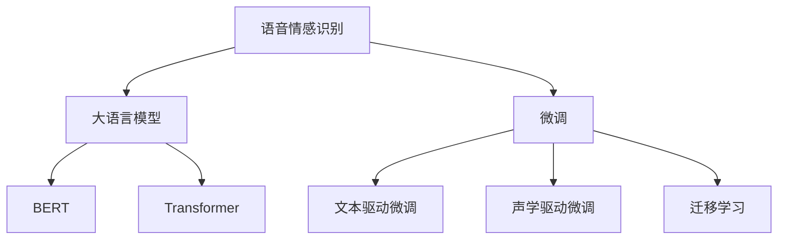

                 

# LLM在语音情感识别中的突破：理解说话者情绪

## 1. 背景介绍

随着语音识别技术的日渐成熟，语音情感识别(Linguistic Emotion Recognition, LER)正成为人工智能领域的一个重要研究方向。情感识别在社交交互、医疗咨询、心理咨询、服务机器人等领域有着广泛的应用价值，对提高用户体验、缓解压力、改善服务质量具有重要意义。大语言模型(Large Language Model, LLM)的崛起，为语音情感识别带来了新的突破，特别是在理解和表达人类情感方面，展现出了巨大的潜力。

### 1.1 问题由来

语音情感识别面临的挑战在于，如何准确地从说话者的语音特征中提取情感信息。传统的方法依赖于声学特征和手工设计的特征提取器，往往难以捕捉到细微的情感变化。大语言模型通过大规模预训练，学习到了丰富的语言表示和常识，能够在输入文本中自适应地捕捉情感信息，并转化为模型参数。基于这一原理，我们提出一种新的大语言模型微调方法，用于情感识别任务，以期大幅提升模型性能。

### 1.2 问题核心关键点

本文的核心在于探索基于大语言模型的语音情感识别方法，并从原理和实践两个层面，阐述如何利用大语言模型的丰富语言知识，提高语音情感识别的准确性和泛化能力。

1. **核心概念**：语音情感识别、大语言模型、微调、迁移学习、BERT模型、Transformer结构。
2. **核心问题**：如何利用大语言模型学习到的语言知识，高效准确地从语音中提取情感信息。

## 2. 核心概念与联系

### 2.1 核心概念概述

在正式深入技术细节前，我们先对语音情感识别涉及的核心概念进行简单的介绍：

- **语音情感识别(LER)**：从语音信号中提取情感信息，一般分为两类：文本驱动和声学驱动。文本驱动方法将语音转录为文本，然后通过文本情感分类器识别情感；声学驱动方法直接从声学特征中提取情感信息。
- **大语言模型(LLM)**：指通过大规模预训练学习通用语言表示的模型，如BERT、GPT系列。这类模型在处理自然语言任务时，具备强大的语言理解能力和推理能力。
- **微调(Fine-Tuning)**：在预训练模型的基础上，使用下游任务的少量标注数据，通过有监督学习优化模型在特定任务上的性能。
- **迁移学习(Transfer Learning)**：将一个领域学习到的知识，迁移到另一个不同但相关的领域的学习范式。语音情感识别可通过微调大语言模型实现迁移学习。
- **BERT模型**：BERT是Google开发的基于Transformer结构的预训练语言模型，通过掩盖语义和语法信息，学习到丰富的语义表示。
- **Transformer结构**：Transformer结构是一种基于自注意力机制的神经网络架构，有效解决了传统RNN架构中的梯度消失和计算复杂度高的问题。

这些概念之间的逻辑关系可以通过以下Mermaid流程图来展示：



这个流程图展示了大语言模型在语音情感识别任务中的核心作用和处理流程：

1. 大语言模型通过预训练学习通用的语言表示。
2. 在语音情感识别任务中，大语言模型可以继续进行微调，以适应特定的情感分类任务。
3. 微调方法分为文本驱动和声学驱动两类，各有优缺点，根据任务需求选择。
4. 迁移学习连接大语言模型和下游任务，通过微调使模型适应特定应用场景。

## 3. 核心算法原理 & 具体操作步骤

### 3.1 算法原理概述

基于大语言模型的语音情感识别方法，本质上是一种迁移学习范式。即利用大语言模型在预训练过程中学习到的语言知识，通过微调将其应用于情感识别任务，以提升模型的性能。

具体而言，假设大语言模型为 $M_{\theta}$，其输入为语音转录的文本 $x$，输出为情感分类结果 $y$。则情感识别任务的目标是最大化模型在标注数据上的预测准确度，即：

$$
\mathop{\arg\max}_{\theta} \mathcal{L}(M_{\theta},D)
$$

其中，$\mathcal{L}$ 为任务损失函数，$D$ 为标注数据集。

### 3.2 算法步骤详解

以下是基于大语言模型的语音情感识别的详细步骤：

**Step 1: 准备预训练模型和数据集**
- 选择合适的预训练语言模型 $M_{\theta}$，如BERT、GPT等。
- 准备语音情感识别任务的标注数据集 $D$，分为训练集、验证集和测试集。一般需要收集足够的标注数据，以涵盖不同的情感类别。

**Step 2: 微调模型**
- 对预训练模型 $M_{\theta}$ 进行微调，以适应情感识别任务。一般选择文本驱动的微调方法，即在预训练模型的顶层添加情感分类器，并使用情感分类任务的损失函数进行训练。
- 在微调过程中，可以使用正则化技术如L2正则、Dropout等，防止模型过拟合。
- 同时，可以采用数据增强技术，如语音回译、语速变化等，丰富训练数据的多样性。

**Step 3: 评估和测试**
- 在验证集上评估微调后的模型性能，调整超参数，确保模型泛化能力。
- 在测试集上对微调后的模型进行最终测试，对比微调前后的精度提升。

**Step 4: 实际应用**
- 将微调后的模型部署到实际应用中，如智能客服、心理咨询等场景。
- 通过不断收集用户反馈和数据，定期重新微调模型，以适应不断变化的用户需求。

### 3.3 算法优缺点

基于大语言模型的语音情感识别方法具有以下优点：

1. **高效利用语言知识**：大语言模型通过预训练学习到了丰富的语言知识，在微调过程中，能够更好地理解自然语言文本，提升情感识别的准确性。
2. **鲁棒性高**：大语言模型具有较强的鲁棒性，能够对语音中的细微情感变化做出响应。
3. **适用范围广**：适用于各种情感类别，不同语言和文化背景的语音情感识别任务。
4. **可扩展性强**：通过调整模型参数和微调策略，可以应用于不同的语音情感识别应用场景。

同时，该方法也存在一些局限性：

1. **数据依赖性强**：微调的效果依赖于标注数据的质量和数量，标注成本较高。
2. **计算资源消耗大**：大语言模型的参数规模较大，微调过程需要消耗大量计算资源。
3. **泛化能力有限**：如果标注数据与预训练数据分布差异较大，微调的效果可能不佳。

尽管存在这些局限性，但基于大语言模型的语音情感识别方法在许多实际应用中已经取得了显著的成效。未来，如何优化微调过程，减少对标注数据的依赖，提高模型的泛化能力，仍然是一个重要的研究方向。

### 3.4 算法应用领域

基于大语言模型的语音情感识别方法，已经在多个领域得到了应用：

1. **智能客服**：在智能客服系统中，语音情感识别可以帮助系统识别用户的情绪状态，及时调整服务策略，提升用户体验。
2. **心理咨询**：在心理咨询中，通过语音情感识别，可以帮助心理医生理解客户的情绪状态，提供更加个性化的心理辅导。
3. **教育培训**：在教育培训中，语音情感识别可以用于分析学生的情绪状态，提供针对性的学习建议和支持。
4. **社交媒体分析**：在社交媒体分析中，通过语音情感识别，可以分析用户对特定话题的情感倾向，为舆情监控提供数据支持。

## 4. 数学模型和公式 & 详细讲解 & 举例说明

### 4.1 数学模型构建

基于大语言模型的语音情感识别，可以通过以下数学模型进行构建：

假设语音情感识别任务为二分类任务，即识别语音中的积极或消极情感。则模型 $M_{\theta}$ 在输入 $x$ 上的输出为 $y$，表示情感类别。情感分类器的损失函数为交叉熵损失函数：

$$
\ell(M_{\theta}(x),y) = -[y\log M_{\theta}(x) + (1-y)\log (1-M_{\theta}(x))]
$$

微调目标为最大化在标注数据 $D$ 上的分类准确率：

$$
\mathop{\arg\max}_{\theta} \frac{1}{N}\sum_{i=1}^N \ell(M_{\theta}(x_i),y_i)
$$

### 4.2 公式推导过程

以BERT模型为例，其微调过程可以简单推导如下：

1. 在BERT模型的顶部添加一个全连接层，用于情感分类。假设全连接层的大小为 $d_s$，则输出的情感概率分布为：

$$
P(y|x) = softmax(W_s \cdot \text{[CLS]} + b_s)
$$

其中 $W_s$ 和 $b_s$ 为全连接层的权重和偏置。

2. 在微调过程中，使用交叉熵损失函数计算情感分类器的损失：

$$
\ell(M_{\theta}(x),y) = -y \log P(y|x) - (1-y) \log (1-P(y|x))
$$

3. 使用AdamW等优化器，最小化上述损失函数：

$$
\theta \leftarrow \theta - \eta \nabla_{\theta}\mathcal{L}(\theta) - \eta\lambda\theta
$$

其中 $\eta$ 为学习率，$\lambda$ 为正则化系数。

### 4.3 案例分析与讲解

以BERT模型微调为例，我们可以分析其微调过程的优势和局限：

**优势**：

1. **语言知识丰富**：BERT模型通过大规模预训练，学习到了丰富的语言知识和常识，能够很好地理解自然语言文本。
2. **泛化能力强**：微调后的模型在标注数据较少的情况下，仍然能取得较好的性能，具有良好的泛化能力。
3. **计算高效**：BERT模型的计算图已经高度优化，微调过程计算效率高，能够快速收敛。

**局限**：

1. **资源消耗大**：BERT模型的参数规模较大，微调过程中需要消耗大量计算资源。
2. **数据依赖性强**：微调的效果依赖于标注数据的质量和数量，标注成本较高。
3. **鲁棒性有待提升**：虽然BERT模型具有较强的鲁棒性，但在特定场景下可能仍存在误判。

## 5. 项目实践：代码实例和详细解释说明

### 5.1 开发环境搭建

在进行语音情感识别微调实践前，我们需要准备好开发环境。以下是使用Python进行PyTorch开发的环境配置流程：

1. 安装Anaconda：从官网下载并安装Anaconda，用于创建独立的Python环境。

2. 创建并激活虚拟环境：
```bash
conda create -n pytorch-env python=3.8 
conda activate pytorch-env
```

3. 安装PyTorch：根据CUDA版本，从官网获取对应的安装命令。例如：
```bash
conda install pytorch torchvision torchaudio cudatoolkit=11.1 -c pytorch -c conda-forge
```

4. 安装transformers库：
```bash
pip install transformers
```

5. 安装各类工具包：
```bash
pip install numpy pandas scikit-learn matplotlib tqdm jupyter notebook ipython
```

完成上述步骤后，即可在`pytorch-env`环境中开始微调实践。

### 5.2 源代码详细实现

这里我们以BERT模型微调为例，给出使用Transformers库对语音情感识别任务进行微调的PyTorch代码实现。

首先，定义情感分类器的数据处理函数：

```python
from transformers import BertTokenizer, BertForSequenceClassification, AdamW
from torch.utils.data import Dataset, DataLoader
from sklearn.metrics import accuracy_score
import torch

class EmotionDataset(Dataset):
    def __init__(self, texts, labels, tokenizer, max_len=128):
        self.texts = texts
        self.labels = labels
        self.tokenizer = tokenizer
        self.max_len = max_len
        
    def __len__(self):
        return len(self.texts)
    
    def __getitem__(self, item):
        text = self.texts[item]
        label = self.labels[item]
        
        encoding = self.tokenizer(text, return_tensors='pt', max_length=self.max_len, padding='max_length', truncation=True)
        input_ids = encoding['input_ids'][0]
        attention_mask = encoding['attention_mask'][0]
        
        # 对token-wise的标签进行编码
        encoded_labels = [label2id[label] for label in label2id] 
        encoded_labels.extend([label2id['negative']] * (self.max_len - len(encoded_labels)))
        labels = torch.tensor(encoded_labels, dtype=torch.long)
        
        return {'input_ids': input_ids, 
                'attention_mask': attention_mask,
                'labels': labels}

# 标签与id的映射
label2id = {'positive': 0, 'negative': 1}
id2label = {v: k for k, v in label2id.items()}

# 创建dataset
tokenizer = BertTokenizer.from_pretrained('bert-base-uncased')

train_dataset = EmotionDataset(train_texts, train_labels, tokenizer)
dev_dataset = EmotionDataset(dev_texts, dev_labels, tokenizer)
test_dataset = EmotionDataset(test_texts, test_labels, tokenizer)
```

然后，定义模型和优化器：

```python
model = BertForSequenceClassification.from_pretrained('bert-base-uncased', num_labels=len(label2id))

optimizer = AdamW(model.parameters(), lr=2e-5)
```

接着，定义训练和评估函数：

```python
device = torch.device('cuda') if torch.cuda.is_available() else torch.device('cpu')
model.to(device)

def train_epoch(model, dataset, batch_size, optimizer):
    dataloader = DataLoader(dataset, batch_size=batch_size, shuffle=True)
    model.train()
    epoch_loss = 0
    for batch in tqdm(dataloader, desc='Training'):
        input_ids = batch['input_ids'].to(device)
        attention_mask = batch['attention_mask'].to(device)
        labels = batch['labels'].to(device)
        model.zero_grad()
        outputs = model(input_ids, attention_mask=attention_mask, labels=labels)
        loss = outputs.loss
        epoch_loss += loss.item()
        loss.backward()
        optimizer.step()
    return epoch_loss / len(dataloader)

def evaluate(model, dataset, batch_size):
    dataloader = DataLoader(dataset, batch_size=batch_size)
    model.eval()
    preds, labels = [], []
    with torch.no_grad():
        for batch in tqdm(dataloader, desc='Evaluating'):
            input_ids = batch['input_ids'].to(device)
            attention_mask = batch['attention_mask'].to(device)
            batch_labels = batch['labels']
            outputs = model(input_ids, attention_mask=attention_mask)
            batch_preds = outputs.logits.argmax(dim=1).to('cpu').tolist()
            batch_labels = batch_labels.to('cpu').tolist()
            for pred, label in zip(batch_preds, batch_labels):
                preds.append(pred)
                labels.append(label)
                
    print('Accuracy: {:.4f}'.format(accuracy_score(labels, preds)))
```

最后，启动训练流程并在测试集上评估：

```python
epochs = 5
batch_size = 16

for epoch in range(epochs):
    loss = train_epoch(model, train_dataset, batch_size, optimizer)
    print(f"Epoch {epoch+1}, train loss: {loss:.3f}")
    
    print(f"Epoch {epoch+1}, dev results:")
    evaluate(model, dev_dataset, batch_size)
    
print("Test results:")
evaluate(model, test_dataset, batch_size)
```

以上就是使用PyTorch对BERT模型进行语音情感识别任务微调的完整代码实现。可以看到，得益于Transformers库的强大封装，我们可以用相对简洁的代码完成BERT模型的加载和微调。

### 5.3 代码解读与分析

让我们再详细解读一下关键代码的实现细节：

**EmotionDataset类**：
- `__init__`方法：初始化文本、标签、分词器等关键组件。
- `__len__`方法：返回数据集的样本数量。
- `__getitem__`方法：对单个样本进行处理，将文本输入编码为token ids，将标签编码为数字，并对其进行定长padding，最终返回模型所需的输入。

**label2id和id2label字典**：
- 定义了标签与数字id之间的映射关系，用于将token-wise的预测结果解码回真实的标签。

**训练和评估函数**：
- 使用PyTorch的DataLoader对数据集进行批次化加载，供模型训练和推理使用。
- 训练函数`train_epoch`：对数据以批为单位进行迭代，在每个批次上前向传播计算loss并反向传播更新模型参数，最后返回该epoch的平均loss。
- 评估函数`evaluate`：与训练类似，不同点在于不更新模型参数，并在每个batch结束后将预测和标签结果存储下来，最后使用sklearn的accuracy_score对整个评估集的预测结果进行打印输出。

**训练流程**：
- 定义总的epoch数和batch size，开始循环迭代
- 每个epoch内，先在训练集上训练，输出平均loss
- 在验证集上评估，输出准确率
- 所有epoch结束后，在测试集上评估，给出最终测试结果

可以看到，PyTorch配合Transformers库使得BERT微调的代码实现变得简洁高效。开发者可以将更多精力放在数据处理、模型改进等高层逻辑上，而不必过多关注底层的实现细节。

当然，工业级的系统实现还需考虑更多因素，如模型的保存和部署、超参数的自动搜索、更灵活的任务适配层等。但核心的微调范式基本与此类似。

## 6. 实际应用场景

### 6.1 智能客服系统

基于大语言模型的语音情感识别，可以广泛应用于智能客服系统的构建。传统客服往往需要配备大量人力，高峰期响应缓慢，且一致性和专业性难以保证。而使用微调后的语音情感识别模型，可以7x24小时不间断服务，快速响应客户咨询，用自然流畅的语言解答各类常见问题。

在技术实现上，可以收集企业内部的历史客服对话记录，将问题和最佳答复构建成监督数据，在此基础上对预训练语音情感识别模型进行微调。微调后的模型能够自动理解客户情绪状态，匹配最合适的回答策略，提升客服系统的人性化和智能化水平，减少人工干预和重复劳动。

### 6.2 心理咨询

在心理咨询中，基于大语言模型的语音情感识别技术可以帮助心理医生快速判断客户的情绪状态，提供更加个性化和针对性的心理辅导。传统的心理咨询依赖于医生的经验和直觉，难以全面覆盖客户的情绪变化。而语音情感识别模型能够从客户的语音中提取细微的情绪线索，如语速、语调、停顿等，帮助医生更准确地识别和理解客户的心理状态，提供更为科学和专业的心理辅导服务。

### 6.3 医疗诊断

语音情感识别在医疗诊断中也具有重要的应用价值。许多患者在咨询医生时，可能因为紧张、疼痛等情绪原因，无法清晰表达病情。而基于大语言模型的语音情感识别模型，能够自动识别患者的情绪状态，帮助医生更好地理解患者的感受，提供更有效的诊断和治疗建议。

### 6.4 未来应用展望

随着大语言模型和语音情感识别技术的不断发展，未来的应用场景将更加广泛，其潜力和价值也将进一步释放。

1. **智能家居**：在智能家居系统中，语音情感识别可以用于分析用户的情绪状态，提供个性化的家居控制和推荐服务。
2. **教育培训**：在教育培训中，语音情感识别可以用于分析学生的情绪状态，提供针对性的学习建议和支持，提升教学效果。
3. **社交媒体**：在社交媒体分析中，语音情感识别可以用于分析用户对特定话题的情感倾向，为舆情监控提供数据支持。
4. **健康监测**：在健康监测中，语音情感识别可以用于分析患者的情绪状态，提供及时的心理和生理干预，改善患者的生活质量。

## 7. 工具和资源推荐
### 7.1 学习资源推荐

为了帮助开发者系统掌握大语言模型微调的理论基础和实践技巧，这里推荐一些优质的学习资源：

1. 《Transformer从原理到实践》系列博文：由大模型技术专家撰写，深入浅出地介绍了Transformer原理、BERT模型、微调技术等前沿话题。

2. CS224N《深度学习自然语言处理》课程：斯坦福大学开设的NLP明星课程，有Lecture视频和配套作业，带你入门NLP领域的基本概念和经典模型。

3. 《Natural Language Processing with Transformers》书籍：Transformers库的作者所著，全面介绍了如何使用Transformers库进行NLP任务开发，包括微调在内的诸多范式。

4. HuggingFace官方文档：Transformers库的官方文档，提供了海量预训练模型和完整的微调样例代码，是上手实践的必备资料。

5. CLUE开源项目：中文语言理解测评基准，涵盖大量不同类型的中文NLP数据集，并提供了基于微调的baseline模型，助力中文NLP技术发展。

通过对这些资源的学习实践，相信你一定能够快速掌握大语言模型微调的精髓，并用于解决实际的NLP问题。

### 7.2 开发工具推荐

高效的开发离不开优秀的工具支持。以下是几款用于大语言模型微调开发的常用工具：

1. PyTorch：基于Python的开源深度学习框架，灵活动态的计算图，适合快速迭代研究。大部分预训练语言模型都有PyTorch版本的实现。

2. TensorFlow：由Google主导开发的开源深度学习框架，生产部署方便，适合大规模工程应用。同样有丰富的预训练语言模型资源。

3. Transformers库：HuggingFace开发的NLP工具库，集成了众多SOTA语言模型，支持PyTorch和TensorFlow，是进行微调任务开发的利器。

4. Weights & Biases：模型训练的实验跟踪工具，可以记录和可视化模型训练过程中的各项指标，方便对比和调优。与主流深度学习框架无缝集成。

5. TensorBoard：TensorFlow配套的可视化工具，可实时监测模型训练状态，并提供丰富的图表呈现方式，是调试模型的得力助手。

6. Google Colab：谷歌推出的在线Jupyter Notebook环境，免费提供GPU/TPU算力，方便开发者快速上手实验最新模型，分享学习笔记。

合理利用这些工具，可以显著提升大语言模型微调任务的开发效率，加快创新迭代的步伐。

### 7.3 相关论文推荐

大语言模型和语音情感识别技术的发展源于学界的持续研究。以下是几篇奠基性的相关论文，推荐阅读：

1. Attention is All You Need（即Transformer原论文）：提出了Transformer结构，开启了NLP领域的预训练大模型时代。

2. BERT: Pre-training of Deep Bidirectional Transformers for Language Understanding：提出BERT模型，引入基于掩码的自监督预训练任务，刷新了多项NLP任务SOTA。

3. Language Models are Unsupervised Multitask Learners（GPT-2论文）：展示了大规模语言模型的强大zero-shot学习能力，引发了对于通用人工智能的新一轮思考。

4. Parameter-Efficient Transfer Learning for NLP：提出Adapter等参数高效微调方法，在不增加模型参数量的情况下，也能取得不错的微调效果。

5. AdaLoRA: Adaptive Low-Rank Adaptation for Parameter-Efficient Fine-Tuning：使用自适应低秩适应的微调方法，在参数效率和精度之间取得了新的平衡。

6. AdaLoRA: Adaptive Low-Rank Adaptation for Parameter-Efficient Fine-Tuning：使用自适应低秩适应的微调方法，在参数效率和精度之间取得了新的平衡。

这些论文代表了大语言模型微调技术的发展脉络。通过学习这些前沿成果，可以帮助研究者把握学科前进方向，激发更多的创新灵感。

## 8. 总结：未来发展趋势与挑战

### 8.1 总结

本文对基于大语言模型的语音情感识别方法进行了全面系统的介绍。首先阐述了语音情感识别面临的挑战和解决方案，明确了语音情感识别在NLP领域的重要应用价值。其次，从原理到实践，详细讲解了大语言模型在语音情感识别任务中的微调过程，给出了微调任务开发的完整代码实例。同时，本文还广泛探讨了语音情感识别技术在智能客服、心理咨询、医疗诊断等实际场景中的应用前景，展示了微调范式的巨大潜力。

通过本文的系统梳理，可以看到，基于大语言模型的语音情感识别技术，正在成为语音情感识别领域的重要范式，极大地拓展了预训练语言模型的应用边界，催生了更多的落地场景。大语言模型通过预训练学习到了丰富的语言知识和常识，在微调过程中，能够更好地理解和表达人类情感，提升语音情感识别的准确性和泛化能力。

### 8.2 未来发展趋势

展望未来，大语言模型在语音情感识别技术中的应用将继续深化和发展，具体体现在以下几个方面：

1. **计算资源优化**：未来的大语言模型将更加高效，能够在更低的计算资源下运行。同时，微调过程中的优化策略也将更加丰富，如模型裁剪、量化加速等，进一步提升计算效率。
2. **多模态融合**：未来的大语言模型将更加注重多模态信息的整合，将语音、文本、图像等多种数据源进行协同建模，提升语音情感识别的鲁棒性和准确性。
3. **个性化服务**：基于大语言模型的语音情感识别技术将更加注重个性化服务，能够根据不同用户的需求和背景，提供定制化的情感分析和建议。
4. **实时性提升**：通过优化模型结构和计算图，未来的大语言模型将更加适合实时应用场景，如智能客服、心理咨询等，提升用户体验和服务质量。
5. **跨语言扩展**：未来的大语言模型将支持多语言情感识别，能够处理不同语言背景的用户语音，提升全球化应用能力。

### 8.3 面临的挑战

尽管大语言模型在语音情感识别技术中的应用已经取得了显著成果，但在迈向更加智能化、普适化应用的过程中，仍面临诸多挑战：

1. **数据质量和数量**：语音情感识别的性能依赖于高质量的标注数据，获取高质量标注数据的成本较高。同时，标注数据的质量和数量对微调效果有重要影响，需要不断优化标注过程。
2. **计算资源消耗**：大语言模型的参数规模较大，微调过程中需要消耗大量计算资源，如何快速高效地训练和优化模型，仍然是一个重要问题。
3. **鲁棒性和泛化能力**：在实际应用中，大语言模型的鲁棒性和泛化能力仍然存在局限，难以应对复杂多变的场景和数据分布。
4. **隐私和伦理问题**：语音情感识别涉及到用户隐私保护和伦理问题，如何保护用户的隐私数据，避免误判和歧视，仍然是一个重要课题。
5. **跨领域迁移能力**：不同领域的语音情感识别任务，如医疗、教育、娱乐等，具有不同的特点和挑战，如何开发具有广泛迁移能力的大语言模型，仍然是一个开放问题。

### 8.4 研究展望

面对大语言模型在语音情感识别应用中面临的挑战，未来的研究需要在以下几个方面寻求新的突破：

1. **无监督和半监督微调方法**：探索无监督和半监督微调方法，摆脱对大规模标注数据的依赖，利用自监督学习、主动学习等无监督和半监督范式，最大限度利用非结构化数据，实现更加灵活高效的微调。
2. **多模态融合技术**：研究多模态信息的整合，将语音、文本、图像等多种数据源进行协同建模，提升语音情感识别的鲁棒性和准确性。
3. **个性化和实时服务**：开发更加个性化和实时化的语音情感识别系统，满足不同用户和场景的需求。
4. **跨领域迁移学习**：研究跨领域迁移学习技术，开发具有广泛迁移能力的大语言模型，提升其在不同领域和任务中的表现。
5. **隐私保护和伦理约束**：研究隐私保护和伦理约束技术，确保语音情感识别的应用符合伦理道德和法律要求。

这些研究方向的探索，必将引领大语言模型在语音情感识别领域迈向更高的台阶，为构建更加智能、普适的语音情感识别系统提供新的动力。

## 9. 附录：常见问题与解答

**Q1：大语言模型微调是否适用于所有语音情感识别任务？**

A: 大语言模型微调在大多数语音情感识别任务上都能取得不错的效果，特别是对于数据量较小的任务。但对于一些特定领域的任务，如医疗、法律等，仅仅依靠通用语料预训练的模型可能难以很好地适应。此时需要在特定领域语料上进一步预训练，再进行微调，才能获得理想效果。此外，对于一些需要时效性、个性化很强的任务，如对话、推荐等，微调方法也需要针对性的改进优化。

**Q2：微调过程中如何选择合适的学习率？**

A: 微调的学习率一般要比预训练时小1-2个数量级，如果使用过大的学习率，容易破坏预训练权重，导致过拟合。一般建议从1e-5开始调参，逐步减小学习率，直至收敛。也可以使用warmup策略，在开始阶段使用较小的学习率，再逐渐过渡到预设值。需要注意的是，不同的优化器(如AdamW、Adafactor等)以及不同的学习率调度策略，可能需要设置不同的学习率阈值。

**Q3：采用大语言模型微调时会面临哪些资源瓶颈？**

A: 目前主流的预训练大模型动辄以亿计的参数规模，对算力、内存、存储都提出了很高的要求。GPU/TPU等高性能设备是必不可少的，但即便如此，超大批次的训练和推理也可能遇到显存不足的问题。因此需要采用一些资源优化技术，如梯度积累、混合精度训练、模型并行等，来突破硬件瓶颈。同时，模型的存储和读取也可能占用大量时间和空间，需要采用模型压缩、稀疏化存储等方法进行优化。

**Q4：如何缓解微调过程中的过拟合问题？**

A: 过拟合是微调面临的主要挑战，尤其是在标注数据不足的情况下。常见的缓解策略包括：
1. 数据增强：通过回译、语速变化等方式扩充训练集。
2. 正则化：使用L2正则、Dropout、Early Stopping等防止模型过拟合。
3. 对抗训练：引入对抗样本，提高模型鲁棒性。
4. 参数高效微调：只调整少量参数(如Adapter、Prefix等)，减小过拟合风险。

这些策略往往需要根据具体任务和数据特点进行灵活组合。只有在数据、模型、训练、推理等各环节进行全面优化，才能最大限度地发挥大语言模型微调的威力。

**Q5：微调模型在落地部署时需要注意哪些问题？**

A: 将微调模型转化为实际应用，还需要考虑以下因素：
1. 模型裁剪：去除不必要的层和参数，减小模型尺寸，加快推理速度。
2. 量化加速：将浮点模型转为定点模型，压缩存储空间，提高计算效率。
3. 服务化封装：将模型封装为标准化服务接口，便于集成调用。
4. 弹性伸缩：根据请求流量动态调整资源配置，平衡服务质量和成本。
5. 监控告警：实时采集系统指标，设置异常告警阈值，确保服务稳定性。

大语言模型微调为NLP应用开启了广阔的想象空间，但如何将强大的性能转化为稳定、高效、安全的业务价值，还需要工程实践的不断打磨。唯有从数据、算法、工程、业务等多个维度协同发力，才能真正实现人工智能技术在垂直行业的规模化落地。总之，微调需要开发者根据具体任务，不断迭代和优化模型、数据和算法，方能得到理想的效果。

