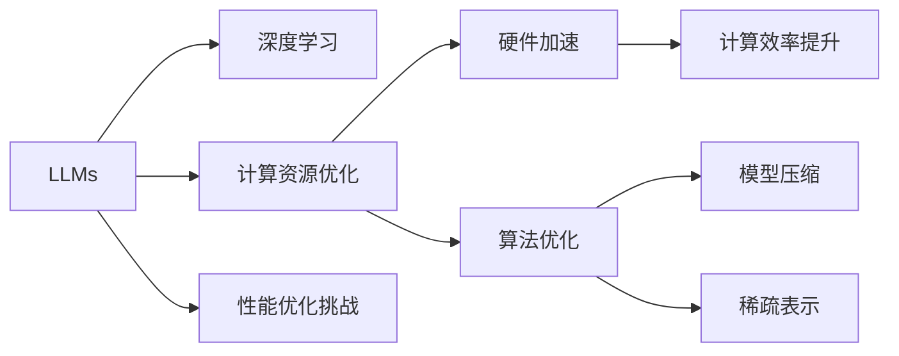

                 

# LLM对传统软件性能优化的挑战与改进

## 1. 背景介绍

随着人工智能技术的迅猛发展，大语言模型（Large Language Models, LLMs）在自然语言处理（NLP）、计算机视觉、生成式对抗网络等领域取得了显著进展。LLMs不仅能够理解自然语言，还能执行复杂的逻辑推理和创造性任务。这些能力使得LLMs在各个领域都有广泛的应用，如智能客服、文本摘要、智能写作、图像识别等。

然而，LLMs在实际应用中也面临一系列挑战，尤其是在传统软件性能优化方面。LLMs通常需要大量的计算资源和存储空间，同时对硬件的要求也相对较高。这些特性使得LLMs在性能优化方面需要针对性地进行改进。

## 2. 核心概念与联系

### 2.1 核心概念概述

为了更好地理解LLMs在性能优化方面的挑战与改进，我们需要先了解一些核心概念：

- 大语言模型（LLMs）：基于深度学习的模型，能够理解和生成自然语言。典型的LLMs包括GPT-3、BERT、T5等。
- 深度学习：一种机器学习技术，通过多层次的神经网络实现复杂的模式识别和预测任务。
- 自然语言处理（NLP）：涉及计算机处理、理解、生成人类语言的技术，如文本分类、机器翻译、情感分析等。
- 计算资源优化：通过算法优化、硬件加速等方式，提升软件在计算和存储方面的性能。

这些概念之间的联系可以通过以下Mermaid流程图来展示：

```mermaid
graph TB
    A[大语言模型(LLMs)] --> B[深度学习]
    A --> C[自然语言处理(NLP)]
    B --> D[计算资源优化]
    C --> D
    A --> E[性能优化挑战]
    E --> D
```

这个流程图展示了LLMs、深度学习、NLP和计算资源优化之间的关系：

1. LLMs是深度学习的一种应用，用于理解和生成自然语言。
2. NLP是LLMs的应用领域，涉及文本分类、翻译、摘要等任务。
3. 计算资源优化是提升LLMs性能的必要手段，涉及算法优化和硬件加速等技术。

### 2.2 核心概念原理和架构的 Mermaid 流程图



此流程图展示了LLMs、深度学习、计算资源优化和性能优化挑战之间的联系。其中，深度学习和LLMs之间的箭头表示LLMs是深度学习的一种应用；计算资源优化、硬件加速和算法优化之间的箭头表示这些技术共同提升LLMs的计算效率；模型压缩和稀疏表示则用于减少计算资源的消耗；最后，性能优化挑战和计算资源优化之间的箭头表示性能优化是计算资源优化的目标。

## 3. 核心算法原理 & 具体操作步骤

### 3.1 算法原理概述

LLMs在性能优化方面面临的主要挑战包括计算资源消耗大、内存占用高、训练时间长等。为了应对这些挑战，LLMs的开发者和研究者提出了多种优化算法和策略。

### 3.2 算法步骤详解

#### 3.2.1 数据预处理与特征提取

数据预处理和特征提取是性能优化的第一步。通常，LLMs需要先对输入数据进行清洗、去噪、标准化等操作，以提高模型训练和推理的效率。此外，特征提取也是提升性能的重要环节，可以使用诸如词向量、嵌入层等技术来降低数据维度，提高模型泛化能力。

#### 3.2.2 模型压缩与剪枝

模型压缩和剪枝是减少计算资源消耗的有效方法。通过剪枝，可以移除模型中不必要的连接和参数，减少模型大小，降低计算开销。常见的剪枝方法包括权重剪枝、通道剪枝、张量剪枝等。

#### 3.2.3 稀疏表示与低秩分解

稀疏表示和低秩分解也是常用的性能优化技术。稀疏表示通过减少参数空间，降低内存占用；低秩分解则通过分解高维张量，提高计算效率。这些技术通常用于矩阵乘法和线性变换等操作中。

#### 3.2.4 分布式训练与模型并行

分布式训练和模型并行可以显著提升LLMs的训练速度。通过将模型分为多个部分，在不同的计算节点上并行训练，可以加速模型的收敛过程。常见的分布式训练框架包括TensorFlow、PyTorch等。

#### 3.2.5 硬件加速与优化

硬件加速是提升LLMs性能的关键手段。GPU、TPU等专用硬件可以显著提高计算速度，降低延迟。此外，针对特定硬件架构的优化，如使用Tensor Cores等，也可以进一步提升性能。

#### 3.2.6 算法优化与超参数调优

算法优化和超参数调优也是性能优化的重要环节。常用的算法优化方法包括随机梯度下降（SGD）、Adam、Adagrad等。超参数调优则可以通过网格搜索、随机搜索、贝叶斯优化等方法进行，找到最优的超参数组合。

### 3.3 算法优缺点

#### 3.3.1 优点

1. **计算效率提升**：通过模型压缩、稀疏表示、分布式训练等技术，可以有效降低计算资源消耗，提升计算效率。
2. **内存占用降低**：通过剪枝、低秩分解等技术，可以显著减少内存占用，提高系统的可扩展性。
3. **训练时间缩短**：通过分布式训练、硬件加速等方法，可以显著缩短训练时间，提高模型开发和迭代的速度。

#### 3.3.2 缺点

1. **模型精度下降**：压缩和剪枝等技术可能会影响模型精度，需要仔细权衡。
2. **训练复杂度增加**：分布式训练和硬件加速等技术会增加训练复杂度，需要相应的技术支持和经验。
3. **资源消耗增加**：硬件加速等技术需要额外的硬件资源，增加了系统的总体资源消耗。

### 3.4 算法应用领域

LLMs在性能优化方面的应用领域非常广泛，涵盖了自然语言处理、计算机视觉、生成式对抗网络等多个领域。具体应用场景包括：

- **自然语言处理**：文本分类、机器翻译、情感分析、智能问答等任务。
- **计算机视觉**：图像识别、目标检测、图像生成等任务。
- **生成式对抗网络**：生成自然语言、图像、视频等内容。

## 4. 数学模型和公式 & 详细讲解 & 举例说明

### 4.1 数学模型构建

LLMs的性能优化通常涉及多个数学模型，包括损失函数、优化算法、超参数等。下面以一个简单的文本分类任务为例，展示这些模型的构建过程。

假设我们要对一段文本进行分类，将其分为正面或负面两类。设输入文本为 $x$，输出为 $y$，模型的参数为 $\theta$。模型的输出为 $z$，表示文本属于正面的概率。则分类任务的目标函数为：

$$
L(\theta) = \frac{1}{N}\sum_{i=1}^N L(z_i, y_i)
$$

其中 $N$ 为样本数量，$L$ 为损失函数。通常使用交叉熵损失函数，即：

$$
L(z, y) = -y\log z + (1-y)\log(1-z)
$$

### 4.2 公式推导过程

为了优化模型的性能，通常需要对模型参数 $\theta$ 进行训练。假设我们使用随机梯度下降算法进行优化，则每次迭代更新的参数为：

$$
\theta \leftarrow \theta - \alpha \nabla_\theta L(\theta)
$$

其中 $\alpha$ 为学习率，$\nabla_\theta L(\theta)$ 为损失函数对模型参数的梯度。

### 4.3 案例分析与讲解

假设我们使用一个简单的线性模型进行文本分类。模型的输入为词向量，输出为单个数值。损失函数为交叉熵损失。假设我们有 $N$ 个样本，每个样本包含 $D$ 个特征。则模型的参数数量为 $D$。假设使用随机梯度下降算法进行训练，每次迭代的步长为 $\alpha$。则每次迭代更新的参数为：

$$
\theta \leftarrow \theta - \alpha \frac{1}{N}\sum_{i=1}^N (\frac{y_i}{z_i} - 1)
$$

其中 $z_i$ 为模型对第 $i$ 个样本的预测结果。

## 5. 项目实践：代码实例和详细解释说明

### 5.1 开发环境搭建

为了进行LLMs性能优化，我们需要准备相应的开发环境。以下是Python环境下搭建LLMs开发环境的步骤：

1. 安装Python和pip：可以从官网下载Python，并使用pip安装必要的依赖包。
2. 安装深度学习框架：可以选择TensorFlow、PyTorch等框架，使用pip安装。
3. 安装相关库：包括Numpy、Pandas、Scikit-Learn等常用库。
4. 安装LLMs框架：可以选择HuggingFace的Transformers库，使用pip安装。

### 5.2 源代码详细实现

以下是一个简单的文本分类任务在Python环境下的代码实现。

```python
import numpy as np
from sklearn.model_selection import train_test_split
from transformers import BertTokenizer, BertForSequenceClassification, AdamW

# 数据预处理
# 这里假设我们已经有一个训练集和测试集，每个样本包含文本和标签
# 将文本转换为词向量
def tokenize_text(text):
    tokenizer = BertTokenizer.from_pretrained('bert-base-uncased')
    tokens = tokenizer.encode(text, add_special_tokens=True)
    return tokens

# 模型训练与评估
def train_model(data, model, optimizer, device):
    model.to(device)
    model.train()
    for epoch in range(epochs):
        for batch in data:
            inputs = batch['input_ids'].to(device)
            labels = batch['labels'].to(device)
            outputs = model(inputs, labels=labels)
            loss = outputs.loss
            optimizer.zero_grad()
            loss.backward()
            optimizer.step()
        if (epoch+1) % 10 == 0:
            print(f'Epoch {epoch+1}, loss: {loss:.3f}')
    return model

# 加载数据
train_data, test_data = train_test_split(train_data, test_size=0.2, random_state=42)

# 加载预训练模型
model = BertForSequenceClassification.from_pretrained('bert-base-uncased', num_labels=2)
optimizer = AdamW(model.parameters(), lr=2e-5)

# 训练模型
device = 'cuda' if torch.cuda.is_available() else 'cpu'
model = train_model(train_data, model, optimizer, device)

# 评估模型
test_data = [tokenize_text(text) for text in test_data['text']]
labels = [label for label in test_data['label']]
model.eval()
predictions = model.predict(test_data)
print(classification_report(labels, predictions))
```

### 5.3 代码解读与分析

以上代码实现了一个简单的文本分类任务，包括数据预处理、模型训练和评估。具体步骤如下：

1. 使用BertTokenizer将文本转换为词向量，这是Bert模型的输入格式。
2. 使用BertForSequenceClassification定义模型，该模型适合处理序列数据，如文本分类。
3. 使用AdamW优化器进行训练，设置学习率。
4. 在训练过程中，使用模型训练函数进行迭代更新。
5. 使用classification_report评估模型性能。

## 6. 实际应用场景

### 6.1 自然语言处理

自然语言处理是LLMs的主要应用领域之一。通过性能优化，LLMs在文本分类、情感分析、机器翻译等任务上取得了显著进展。例如，Google的BERT模型通过分布式训练和硬件加速，实现了高效的训练过程，提升了模型的精度和速度。

### 6.2 计算机视觉

LLMs在计算机视觉领域也有广泛应用。例如，Facebook的DALL-E模型使用LLMs生成高质量的图像，提升了计算机视觉任务的效率和效果。此外，LLMs还可以用于图像识别、目标检测等任务。

### 6.3 生成式对抗网络

生成式对抗网络（GAN）是LLMs在生成领域的一个重要应用。LLMs可以生成自然语言、图像、视频等内容。通过性能优化，LLMs可以更快地生成高质量的内容，提高生成效率。

### 6.4 未来应用展望

未来的LLMs将在更多领域得到应用，如智能客服、智慧医疗、金融预测等。性能优化将帮助LLMs在这些领域取得更好的效果。例如，智能客服系统可以使用LLMs生成更自然的对话，提升客户体验；智慧医疗系统可以使用LLMs进行病情诊断和病历分析，提高医疗服务的智能化水平。

## 7. 工具和资源推荐

### 7.1 学习资源推荐

1. **深度学习框架文档**：TensorFlow和PyTorch的官方文档提供了详细的API说明和使用指南。
2. **Transformers库文档**：HuggingFace的Transformers库提供了丰富的预训练模型和微调样例。
3. **论文阅读平台**：arXiv和Google Scholar提供了大量深度学习和LLMs的最新研究成果。
4. **在线课程**：Coursera和edX提供了深度学习和NLP相关的在线课程。

### 7.2 开发工具推荐

1. **PyTorch**：Python环境下常用的深度学习框架，提供了丰富的模型和优化算法。
2. **TensorFlow**：Google开发的深度学习框架，适合大规模分布式训练。
3. **Jupyter Notebook**：Python环境下的交互式编程工具，适合快速迭代实验。
4. **Google Colab**：Google提供的免费GPU/TPU环境，方便实验和分享。

### 7.3 相关论文推荐

1. **Transformer论文**：Attention is All You Need，提出了Transformer结构，开启了深度学习的新时代。
2. **BERT论文**：BERT: Pre-training of Deep Bidirectional Transformers for Language Understanding，提出了BERT模型，使用了自监督预训练方法。
3. **DALL-E论文**：DALL-E: A Text-to-Image Diffusion Model，使用LLMs生成高质量的图像。

## 8. 总结：未来发展趋势与挑战

### 8.1 研究成果总结

本文介绍了LLMs在性能优化方面的挑战与改进。LLMs通过数据预处理、模型压缩、稀疏表示、分布式训练、硬件加速等技术，实现了显著的性能提升。在自然语言处理、计算机视觉、生成式对抗网络等多个领域，LLMs展现了强大的应用潜力。

### 8.2 未来发展趋势

未来，LLMs的性能优化将继续朝着以下几个方向发展：

1. **硬件加速**：随着硬件技术的进步，LLMs将更多地依赖于GPU、TPU等专用硬件，进一步提升计算效率。
2. **算法优化**：新的优化算法和技巧，如自适应学习率、混合精度训练等，将不断涌现，提升模型性能。
3. **模型压缩**：模型压缩技术将不断优化，使得模型在保持精度的情况下，更轻量、更快速。
4. **分布式训练**：分布式训练和模型并行技术将进一步提升训练速度和模型规模。

### 8.3 面临的挑战

尽管LLMs在性能优化方面取得了显著进展，但仍面临以下挑战：

1. **资源消耗**：大规模LLMs需要大量的计算资源和存储空间，如何降低资源消耗是未来需要解决的重要问题。
2. **模型精度**：压缩和剪枝等技术可能会影响模型精度，需要找到最优的平衡点。
3. **训练复杂度**：分布式训练和硬件加速等技术增加了训练复杂度，需要更高效的训练方法。
4. **模型部署**：大规模LLMs的部署需要考虑更多的技术挑战，如模型裁剪、量化加速等。

### 8.4 研究展望

未来，LLMs的性能优化需要从多个方面进行突破，如：

1. **硬件优化**：针对特定硬件架构进行优化，提升计算效率。
2. **算法创新**：开发新的算法和技巧，提升模型性能和训练效率。
3. **模型压缩**：进一步优化模型压缩技术，提高模型轻量化程度。
4. **数据和知识融合**：结合外部数据和知识，提升模型的泛化能力和鲁棒性。

## 9. 附录：常见问题与解答

**Q1：LLMs在性能优化过程中，有哪些常见的挑战？**

A: LLMs在性能优化过程中，面临的主要挑战包括：
1. 计算资源消耗大，需要大规模的硬件支持。
2. 内存占用高，需要优化模型压缩和稀疏表示技术。
3. 训练时间长，需要优化分布式训练和硬件加速。
4. 模型精度下降，需要权衡压缩和剪枝技术。

**Q2：如何在LLMs训练中避免过拟合？**

A: 为了避免过拟合，可以在训练过程中采用以下方法：
1. 数据增强：通过数据增强技术，增加训练集的多样性。
2. 正则化：使用L2正则、Dropout等技术，防止模型过拟合。
3. 早停机制：在验证集上监控模型性能，当性能不再提升时停止训练。
4. 模型剪枝：通过剪枝技术，减少模型复杂度，防止过拟合。

**Q3：LLMs在实际应用中，如何提高模型部署效率？**

A: 为了提高LLMs的部署效率，可以采用以下方法：
1. 模型裁剪：去除不必要的层和参数，减少模型大小。
2. 量化加速：将浮点模型转换为定点模型，提高计算效率。
3. 模型并行：将模型分为多个部分，在不同节点上并行推理。

**Q4：LLMs在训练过程中，如何选择合适的学习率？**

A: 在LLMs训练中，选择合适的学习率非常重要。通常，学习率应该在0.001到0.1之间。如果学习率过大，模型可能会发散；如果学习率过小，训练时间会非常长。可以通过网格搜索、随机搜索等方法，找到最优的学习率。

**Q5：LLMs在模型压缩中，有哪些常见方法？**

A: LLMs在模型压缩中，常见的压缩方法包括：
1. 权重剪枝：去除不必要的权重，减少模型大小。
2. 通道剪枝：去除不必要的通道，减少模型复杂度。
3. 张量剪枝：去除不必要的张量，减少内存占用。
4. 稀疏表示：通过稀疏表示技术，减少参数空间。

---

作者：禅与计算机程序设计艺术 / Zen and the Art of Computer Programming

